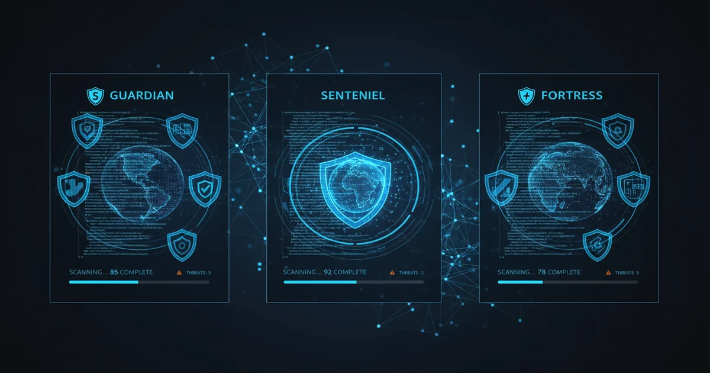

+++
date = '2026-03-13T10:00:00+08:00'
draft = false
title = '2026年AI代码安全工具横评：Codex Security、Claude Code Security与Snyk谁更强？'
description = 'AI代码安全工具横评 2026：Codex Security（3 月发布，扫描 120 万次提交发现 792 个严重漏洞、14 个 CVE）、Claude Code Security（2 月发布，基于 Opus 4.6）与 Snyk、SonarQube 逐项对比，附定价与选型建议。'
toc = true
tags = ['AI Security', 'Code Audit', 'Claude Code', 'DevSecOps', 'Vulnerability Scanning']
keywords = ['AI代码安全工具对比', 'Codex Security评测', 'Claude Code Security使用体验', 'Snyk替代方案', '代码安全扫描工具2026', 'AI漏洞扫描']
+++



2026年2月到3月，AI代码安全领域迎来了一波集中爆发——Anthropic在2月20日推出了[Claude Code Security](https://www.anthropic.com/news/claude-code-security)，OpenAI紧随其后在3月6日发布了[Codex Security](https://openai.com/index/codex-security-now-in-research-preview/)。与此同时，老牌安全工具Snyk和SonarQube也在加速引入AI能力。作为开发者或安全工程师，面对这么多选择，到底该用哪个？本文用真实数据和具体案例来帮你搞清楚。

## 为什么现在需要AI安全扫描？

传统静态分析工具（SAST）已经存在几十年了。它们的工作原理是把代码模式与已知漏洞数据库进行匹配。问题在于，它们抓不住**上下文相关的漏洞**——那种需要理解数据如何在多个组件间流动、认证逻辑如何与业务规则交互、或者一个看似无害的辅助函数如何在三层调用之后制造注入漏洞的情况。

打个比方：传统工具就像拼写检查器，能抓住错别字，但抓不住语法正确却逻辑荒谬的句子。AI安全扫描的目标是充当人类编辑——理解意图、上下文，以及代码出错的那些微妙方式。

现实是严峻的。根据[2025年Verizon DBIR报告](https://www.verizon.com/business/resources/reports/dbir/)，Web应用漏洞仍然是头号攻击向量，关键漏洞的平均修复时间依然以月为单位计算。

## 四款工具速览

先看一张对比总表：

| 特性 | Codex Security | Claude Code Security | Snyk Code | SonarQube |
|------|---------------|---------------------|-----------|-----------|
| **技术路线** | AI Agent + 沙箱验证 | AI推理 + 多阶段验证 | AI辅助数据流分析 | 规则匹配 + 少量AI |
| **发布时间** | 2026年3月 | 2026年2月 | 2020年（收购DeepCode） | 2007年 |
| **底层模型** | OpenAI内部模型 | Claude Opus 4.6 | 自研ML模型 | 静态规则 |
| **语言支持** | 主流语言 | 主流语言 | 15+种 | 35+种 |
| **误报处理** | 沙箱验证 | 多阶段自检 | AI置信度评分 | 质量门禁 |
| **修复建议** | 提供代码+解释 | 提供补丁供审查 | AI生成修复方案 | 基于规则 |
| **定价** | 预览期免费 | 企业/团队版 | 免费版+付费版 | 社区版免费+付费 |
| **私有部署** | 不支持 | 不支持 | 不支持（纯SaaS） | 支持（社区版） |

## OpenAI Codex Security：来势凶猛的新玩家

### 工作原理

Codex Security脱胎于OpenAI内部的安全扫描工具**Aardvark**，最初用来扫描自家代码库。2025年10月进入内测，2026年3月6日正式开放公开预览。

它的扫描流程分为**三个阶段**：

1. **上下文分析**：分析仓库结构，构建安全相关的系统地图，并生成一份**可编辑的威胁模型**——一份描述应用做什么、哪里最容易被攻击的文档。

2. **漏洞识别**：以威胁模型为基础进行扫描，按照实际影响而非理论严重性来分类漏洞。

3. **沙箱验证**：把发现的问题放到**隔离沙箱中进行压力测试**，验证是否真的可利用。这是Codex最有特色的地方——不只是标记潜在问题，而是尝试证明它们确实能被利用。

### 实战成绩

在测试期间，Codex Security扫描了超过**120万次提交**，发现了：

- **792个严重漏洞**
- **10,561个高危漏洞**
- **14个严重到获得CVE编号的漏洞**

这些CVE漏洞来自多个知名开源项目：

- **GnuPG**（CVE-2026-24881、CVE-2026-24882）
- **GnuTLS**（CVE-2025-32988、CVE-2025-32989）
- **GOGS**（CVE-2025-64175、CVE-2026-25242）
- **Thorium**（CVE-2025-35430至CVE-2025-35436多个CVE）
- **OpenSSH**、**libssh**、**PHP**、**Chromium**

能在GnuPG和OpenSSH这种被安全专家反复审计多年的项目里找到漏洞，这个成绩确实令人印象深刻。

### 独特之处

**可编辑威胁模型**是一个亮点功能。扫描之前，Codex会先用自然语言描述你的应用是怎么工作的、攻击面在哪里。你可以编辑这份文档来纠正误解或补充信息，从而提高扫描准确度。就像在安全审计前给顾问做一次详细的briefing——briefing越充分，审计效果越好。

沙箱验证也值得关注。很多SAST工具标记的问题在实际中根本无法利用，通过在隔离环境中实测，Codex在测试期间将误报率**降低了50%以上**。

### 可用性与价格

Codex Security的公开预览面向**ChatGPT Pro、Enterprise、Business和Edu**用户开放，通过Codex网页界面使用。首月免费。开源项目维护者可以申请免费使用。

长期定价尚未公布。

## Claude Code Security：推理驱动的安全扫描

### 工作原理

Claude Code Security走了一条完全不同的路线。它没有构建单独的扫描Agent，而是把安全扫描能力**直接内置到Claude Code中**，由[Claude Opus 4.6](/zh/posts/ai/2026-02-22-claude-code-security/)驱动，像人类安全研究员一样对代码进行推理分析。

关键词是"推理"。Claude Code Security不仅仅追踪数据流——它**理解代码的语义**。它能把握组件之间的交互关系，跨模块追踪数据流向，发现那些由多个单独安全的组件组合在一起才会出现的漏洞。

### 多阶段验证

当Claude发现潜在漏洞时，会进入**多阶段验证流程**：

1. **初始发现**：基于代码分析标记潜在问题
2. **自我审查**：重新检查发现的问题，尝试证明或推翻它
3. **误报过滤**：经不住推敲的发现被移除
4. **严重性和置信度评分**：每个确认的漏洞获得严重性等级和置信度评分

这种自我批判的方式直接解决了告警疲劳问题。用过传统SAST工具的人都知道，在成百上千条误报中淘金的体验，有时候比没有扫描器还糟糕。

### 实战成绩

使用Claude Opus 4.6，Anthropic团队在生产级开源代码中发现了**500多个漏洞**——这些Bug存在多年，即使经过专家审查也未被发现。

虽然绝对数量不如Codex Security，但两者不能简单对比。Claude Code Security强调的是**精度而非数量**——发现更少，但每一条都有更高的可信度。

### 人在回路的设计理念

所有发现都会出现在**Claude Code Security仪表盘**中，团队可以：

- 审查漏洞及其上下文
- 查看建议的补丁
- 确认置信度评级
- 批准或拒绝修复方案

没有任何修复是自动应用的。这不仅仅是安全考量——它体现了一种设计哲学：AI增强人类判断力，而非取代它。

### 可用性与价格

Claude Code Security以**有限研究预览**的形式提供给Enterprise和Team客户。开源项目维护者可以申请**加速免费接入**。具体价格需要联系Anthropic销售团队。

## Snyk：久经沙场的老将

### 工作原理

[Snyk](https://snyk.io/)从2015年开始做安全，经过多年发展已经相当成熟。它的SAST引擎**Snyk Code**来自2020年收购的**DeepCode**（苏黎世联邦理工学院的衍生公司），使用AI数据流分析而非传统的模式匹配。

Snyk走的是**开发者优先**路线：在你写代码的时候，漏洞提示就直接出现在IDE中，不需要编译。每个发现都附带解释、数据流可视化和AI生成的修复建议。

### 完整产品矩阵

与专注AI的新玩家不同，Snyk提供了一个**完整的安全平台**，包含五大产品线：

1. **Snyk Open Source（SCA）**：扫描依赖中的已知漏洞
2. **Snyk Code（SAST）**：AI驱动的源码分析
3. **Snyk Container**：容器镜像扫描
4. **Snyk IaC**：基础设施即代码扫描
5. **Snyk API & Web（DAST）**：动态应用安全测试

这种广度是Snyk最大的优势。Codex Security和Claude Code Security聚焦在源代码分析上，而Snyk覆盖了整个应用栈——你的代码、依赖、容器、基础设施定义和运行中的应用。

### IDE实时集成

Snyk Code在**IDE内实时扫描**——支持VS Code、IntelliJ等。你写代码的同时就能看到安全提示，而不是提交之后才知道。这与Codex Security和Claude Code Security在仓库级别运行的方式有本质区别。

对开发者来说，这意味着在你还能随手改的时候就收到安全反馈，而不是几天后在安全评审中才发现问题。

### 价格

Snyk的定价透明且分层：

- **免费版**：最多5个项目，开源扫描不限次数
- **团队版**：起价$25/开发者/月
- **企业版**：定制价格，含高级功能
- **没有免费试用期**——但免费版对小项目确实够用

## SonarQube：代码质量老兵

### 定位

[SonarQube](https://www.sonarqube.org/)值得一提，因为很多团队已经在用它了。2007年由SonarSource创建，本质上是一个**代码质量工具**，同时也做安全扫描。它的6,500多条规则中大约**85%聚焦代码质量**（Bug、代码异味、可维护性），剩下15%针对安全漏洞。

### 优势

- **支持私有部署**：社区版免费且可自托管——很多企业的硬性要求
- **35+种语言支持**：覆盖面最广
- **质量门禁**：为代码变更设置自动化通过/不通过标准
- **IDE深度集成**：SonarLint提供实时反馈

### 局限

SonarQube的安全扫描本质上是**基于规则的**，不是AI驱动的。它能有效捕获已知模式，但对于那些AI工具擅长发现的上下文相关漏洞就力不从心了。最好把它定位为AI安全工具的补充，而非替代品。

## 实战对比：各工具到底能抓住什么漏洞？

来看几个具体的漏洞案例：

### SQL注入示例

看这段看似无害的Python代码：

```python
def get_user(request):
    user_id = request.params.get("id")
    # 通过辅助函数间接注入
    query = build_query("users", {"id": user_id})
    return db.execute(query)

def build_query(table, filters):
    conditions = " AND ".join(f"{k} = '{v}'" for k, v in filters.items())
    return f"SELECT * FROM {table} WHERE {conditions}"
```

| 工具 | 能否检测 | 原因 |
|------|----------|------|
| **SonarQube** | 大概率漏掉 | 注入通过`build_query`间接发生，可能不会被标记为sink |
| **Snyk Code** | 能发现 | AI数据流分析能追踪`user_id`经过`build_query`到达`db.execute` |
| **Claude Code Security** | 能发现 | 语义推理能理解跨函数边界的不安全字符串拼接 |
| **Codex Security** | 能发现+验证 | 找到问题并在沙箱中确认可利用性 |

### 认证绕过示例

一个更隐蔽的场景——session处理中的竞态条件：

```python
def transfer_funds(request):
    session = get_session(request.cookies["session_id"])
    if not session.is_authenticated:
        return redirect("/login")

    # 竞态条件：在检查和使用之间session可能已被失效
    amount = float(request.params["amount"])
    source = session.user.primary_account  # session可能已过期
    process_transfer(source, amount)
```

| 工具 | 能否检测 |
|------|----------|
| **SonarQube** | 抓不到——没有session竞态条件的规则 |
| **Snyk Code** | 有可能——取决于数据流模型的深度 |
| **Claude Code Security** | 大概率能发现——通过语义推理理解session生命周期 |
| **Codex Security** | 大概率能发现并验证——沙箱测试可以暴露竞态条件 |

规律很明显：**AI工具能抓住基于规则的工具遗漏的上下文相关漏洞**。问题在于哪种AI方案更适合你的工作流。

## 选型建议：该用哪个？

没有万能答案。根据你的需求来选：

### 选Codex Security，如果你：

- 想要最彻底的扫描，带**沙箱验证**
- 已经在OpenAI/ChatGPT生态中
- 做**开源项目**（可以申请免费使用）
- 想要**可编辑的威胁模型**来引导扫描过程
- 能接受研究预览阶段的不稳定

### 选Claude Code Security，如果你：

- 已经在用[Claude Code](/zh/posts/ai/2026-01-14-claude-code-guide/)做开发
- 看重**精度而非数量**（更少的误报）
- 想要安全扫描**集成到AI编码工作流中**
- 团队重视人在回路的审查机制
- 是Enterprise或Team客户

### 选Snyk，如果你：

- 需要一个**经过生产验证的成熟方案**
- 想要在写代码时就获得**IDE内实时反馈**
- 不只需要源码扫描，还要管**依赖、容器和基础设施**
- 需要**透明可预期的定价**
- 合规要求需要经过审计的成熟工具

### 选SonarQube，如果你：

- 必须**私有部署**
- 代码质量和安全同样重要
- 需要在CI/CD管线中设置**质量门禁**
- 预算有限（社区版免费）
- 计划和AI工具配合使用以获得更深层的安全扫描

### 最佳实践：多工具组合

实际中最聪明的做法是**多工具分层防御**：

1. **SonarQube**放在CI/CD中负责代码质量和基础安全规则
2. **Snyk**负责依赖扫描和IDE实时反馈
3. **Codex Security或Claude Code Security**负责深度AI漏洞挖掘

这种分层方案从拼写错误到零日逻辑漏洞全覆盖。没有任何单一工具能抓住所有问题，但组合起来构成的安全网远比单打独斗强得多。

## 大局观：AI正在重塑安全行业

Codex Security和Claude Code Security在短短几周内先后发布，标志着代码安全领域的一次根本性转变。传统模式——写代码、跑扫描器、修复标记的模式——正在被**理解代码语义的AI**所取代。

Claude Code Security发布后，[网络安全股票大幅下跌](https://www.theregister.co.uk/2026/02/23/claude_code_security_panic/)——CrowdStrike跌了近8%，Okta下滑9.2%。市场清楚地意识到AI安全扫描不是小打小闹，而是可能颠覆整个安全工具行业。

但也要看到局限性：

- **两款AI工具都在研究预览阶段**——合规关键的工作流还不能完全依赖它们
- **定价不确定**——免费预览不会永远持续，企业级AI定价可能不便宜
- **误报没有消除**——减少了，但还在
- **传统工具不会消失**——依赖扫描、容器安全、CI/CD集成这些事，AI扫描器还管不了

未来大概率不是"AI取代Snyk"，而是"AI让所有安全工具都变得更聪明"。Snyk已经在[加速引入AI能力](https://snyk.io/articles/anthropic-launches-claude-code-security/)，SonarQube的竞品也在抢着加AI功能。赢家是那些早早拥抱AI扫描、同时维护好现有安全基础设施的开发者。

## 常见问题

**Q: Codex Security和Claude Code Security可以同时用吗？**

可以，而且这可能是个好主意。它们使用不同的AI模型和方法，可能捕获不同类型的漏洞。在关键代码库上同时运行两者，等于获得了两个独立的AI视角来审视你的安全状况。

**Q: 这些工具能替代渗透测试吗？**

不能。AI代码扫描是静态分析——检查源代码但不运行应用。渗透测试评估的是运行中的应用、基础设施和配置。两者互补，不是替代关系。

**Q: 这些工具如何处理私有/商业代码？**

三款AI工具都在服务端处理你的代码。Codex Security使用隔离容器进行分析，Claude Code Security通过Anthropic的基础设施处理代码。在扫描敏感代码前，务必检查各家的数据处理政策，确保符合合规要求。

**Q: 这些工具的可靠性足以用于生产吗？**

Codex Security和Claude Code Security都在研究预览阶段——建议作为补充扫描工具使用，不要作为主要安全关卡。Snyk和SonarQube已经是生产就绪的，有SLA和合规认证。

## 相关阅读

- [Claude Code Security: How AI-Powered Code Scanning Changes Everything](/zh/posts/ai/2026-02-22-claude-code-security/) — Claude Code Security的架构与成果深度解析
- [AI Agent Security: Protecting Your AI-Powered Development Workflow](/zh/posts/ai/2026-02-27-ai-agent-security/) — AI开发中的安全全景
- [MCP Security Guide: Securing Your AI Tool Integrations](/zh/posts/ai/2026-02-23-mcp-security-guide/) — AI工具MCP连接的安全指南
- [Secure Vibe Coding: Writing Safe Code with AI Assistance](/zh/posts/ai/2026-02-24-secure-vibe-coding/) — 用AI编码时的安全最佳实践
- [Claude Code vs Codex CLI: Which AI Coding Agent Wins?](/zh/posts/ai/2026-02-19-claude-code-vs-codex/) — OpenAI与Anthropic编码工具的全面对比
- [MCP Security Deep Dive 2026](/zh/posts/ai/2026-03-10-mcp-security-2026/) — 最新MCP安全动态
