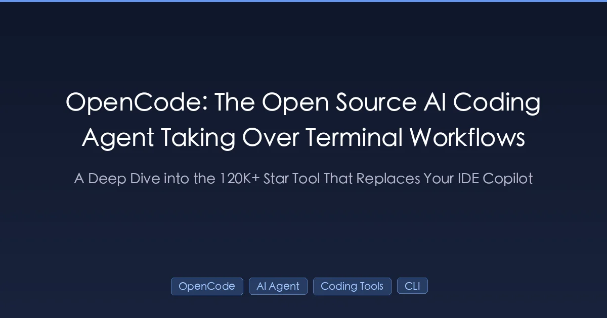

+++
date = '2026-03-13T10:00:00+08:00'
draft = false
title = 'OpenCode 深度评测：这款开源AI编程代理能替代Claude Code吗？'
description = '两周实测12万星开源AI编程代理OpenCode，详解LSP自修正、多模型切换、权限控制等核心能力，与Claude Code、Cursor的真实对比。'
toc = true
tags = ['OpenCode', 'AI Agent', 'Coding Tools', 'CLI', 'Developer Tools']
keywords = ['OpenCode 评测', '开源编程代理', 'OpenCode vs Claude Code', 'AI编程工具对比', '终端AI助手']
+++



用AI编程代理写了半年代码，最大的痛点是什么？**厂商锁定**。Claude Code绑定Anthropic模型，Cursor绑定订阅，GitHub Copilot活在VS Code里。[OpenCode](https://github.com/anomalyco/opencode)走了另一条路——MIT开源、支持75+模型提供商、终端/桌面/IDE三端通吃。GitHub上12万+星，发版速度按天计算，是2026年增长最快的开源AI编程代理。

但开源就一定更好吗？我花了两周把OpenCode当主力工具用，聊聊真实体验——哪些地方确实强，哪些地方还有坑，什么人值得切换。

## 谁在做OpenCode？背景很重要

OpenCode的开发团队是[Anomaly](https://github.com/anomalyco)，就是做[SST](https://github.com/sst/sst)（Serverless Stack，2.5万星）的那帮人。核心开发者Dax（GitHub ID: thdxr），同时也是terminal.shop和OpenAuth的作者。

README里说创始团队是"neovim users and the creators of terminal.shop"。这里需要澄清：他们是Neovim的**深度用户和赞助者**，不是Neovim的核心开发者。Terminal.shop是个很酷的玩具项目——通过SSH终端买咖啡。但SST的背景是实打实的，给数千家公司提供过生产级基础设施工具。

### 关于命名争议

"OpenCode"这个名字原本属于[Kujtim Hoxha用Go写的终端AI工具](https://github.com/opencode-ai/opencode)，曾经有1.1万+星。Anomaly团队用了同名发布自己的项目后，原版被迫归档，改名"Crush"继续开发（在Charm旗下）。这件事在社区引发了不小的争议。你怎么看是你的事，但这个背景值得了解。

## 架构设计：客户端-服务器分离

多数AI编程代理是单体架构——UI和运行时紧耦合。OpenCode把它们拆开了：

```
┌─────────────────┐          ┌──────────────────┐          ┌─────────────────┐
│     客户端层     │  HTTP   │    代理服务器      │          │    外部工具      │
│                  │◄───────►│   (端口 4096)     │◄────────►│                 │
│ • 终端 TUI      │         │ • 代理运行时      │          │ • LSP 服务器    │
│ • 桌面端 (Tauri) │         │ • 工具执行引擎    │          │ • MCP 服务器    │
│ • IDE 扩展      │         │ • 会话管理        │          │ • Git, Docker   │
│ • Web 界面      │         │ • 上下文管理      │          │ • 75+ 大模型    │
└─────────────────┘          └──────────────────┘          └─────────────────┘
```

**实际场景：**

- 服务器跑在性能强的工作站上，笔记本轻量级连接
- 团队成员可以连接同一个代理会话协作调试
- 桌面端（用Tauri而非Electron，更轻量）和TUI共享同一个后端
- 支持mDNS局域网自动发现

服务器配置长这样：

```json
{
  "server": {
    "port": 4096,
    "hostname": "0.0.0.0",
    "mdns": true,
    "cors": {
      "origins": ["http://localhost:*"]
    }
  }
}
```

**但是，没人提的代价：** 这个架构导致了一个[严重的未认证远程代码执行漏洞](https://github.com/anomalyco/opencode/issues/6355)（CVSS评分约10分）。本地服务器没有做认证，任何网站都能在你的机器上执行任意代码。据报已修复，但这提醒我们——本地开发工具的客户端-服务器架构天然比单体架构多出一个攻击面。

## LSP集成：真正的差异化优势

这是OpenCode对所有终端AI编程代理的降维打击。大多数工具（包括[Claude Code](/zh/posts/ai/2026-02-28-claude-code-complete-guide/)）理解代码的方式是读文件、跑grep。OpenCode直接连接LSP——就是你IDE做自动补全、跳转定义、错误检查用的那个协议。

### 自修正循环——核心杀手锏

OpenCode用`/init`初始化项目时，会自动检测语言、下载并启动对应的LSP服务器（支持约40种语言）。然后，关键来了：

```
代理写了一段代码
       ↓
LSP 实时分析
       ↓
LSP 报告："第42行：类型 'string' 不能赋值给类型 'number'"
       ↓
代理看到诊断信息，自动修正
       ↓
LSP 确认：没有错误了
       ↓
继续下一个任务
```

用Claude Code时，你需要手动跑`tsc`或linter才能发现类型错误。OpenCode的反馈循环是自动且连续的。

**真实场景**：比如你重构了一个TypeScript函数签名：

```typescript
// 之前: function getUser(id: string): Promise<User>
// 之后: function getUser(id: number): Promise<User>
```

没有LSP，代理根本不知道有15个调用点现在传错了类型。有了LSP集成，代理立刻看到15个类型错误，全部自动修复——你不需要跑`tsc`也不需要手动指出。

### LSP配置

```json
{
  "lsp": {
    "typescript": {
      "command": "typescript-language-server",
      "args": ["--stdio"],
      "filetypes": ["typescript", "typescriptreact", "javascript"],
      "root_markers": ["tsconfig.json", "package.json"]
    },
    "python": {
      "command": "pyright-langserver",
      "args": ["--stdio"],
      "filetypes": ["python"],
      "root_markers": ["pyproject.toml", "setup.py"]
    }
  }
}
```

**需要注意**：LSP支持目前仍标记为实验性。TypeScript和Python表现不错，但冷门语言偶尔会出问题。另外会增加200-500MB的内存占用。

## 多代理系统：分工协作

OpenCode的代理系统跟[Claude Code的子代理](/zh/posts/ai/2025-12-26-claudecode-skill&subagent/)理念类似，但设计哲学不同。

### 内置代理

| 代理 | 类型 | 权限 | 用途 |
|------|------|------|------|
| **Build** | 主代理 | 完全（读写+执行） | 默认开发代理 |
| **Plan** | 主代理 | 只读 | 代码分析、架构评审 |
| **@general** | 子代理 | 完全 | 复杂多步任务 |
| **@explore** | 子代理 | 只读 | 快速代码搜索 |

用`Tab`键切换Build和Plan，用`@general`或`@explore`调用子代理。

### 自定义代理实战

在`~/.config/opencode/agents/security-audit.md`创建文件：

```markdown
---
description: Security vulnerability scanner
mode: subagent
model: anthropic/claude-sonnet-4-20250514
temperature: 0.1
tools:
  write: false
  edit: false
permission:
  bash:
    "npm audit": allow
    "grep -r": allow
    "*": deny
---

你是安全审计专家。分析代码库中的：
- SQL注入和XSS漏洞
- 硬编码的密钥和凭证
- 不安全的依赖版本
- 认证/授权缺陷

按严重程度报告发现，并给出修复建议。
绝对不要修改任何文件。
```

调用方式：`@security-audit Review the authentication module`

这个设计很精妙。细粒度权限模型意味着你可以创建一个安全审计代理——能读代码、能跑`npm audit`，但绝对不能写文件或执行其他命令。Claude Code也有[类似能力](/zh/posts/ai/2026-02-28-claude-code-skills-guide/)，但OpenCode的每代理权限模型更显式。

## 权限系统：比Claude Code更细

```json
{
  "permission": {
    "edit": "allow",
    "write": "allow",
    "bash": {
      "*": "ask",
      "git status": "allow",
      "git diff": "allow",
      "git log *": "allow",
      "git add *": "allow",
      "git commit *": "ask",
      "git push *": "ask",
      "rm -rf *": "deny"
    },
    "webfetch": "deny"
  }
}
```

三个权限级别：
- **`allow`** — 直接执行，不问
- **`ask`** — 每次确认
- **`deny`** — 完全禁止

Claude Code的权限是按大类划分的（bash全允许/全问/全禁），OpenCode可以细到允许`git status`但要求`git push`需确认——日常使用中这个区别很实用。

## 模型支持：自带钥匙的自由

OpenCode通过[Models.dev](https://models.dev)集成支持75+模型提供商：

```json
{
  "provider": {
    "anthropic": { "api_key": "sk-ant-..." },
    "openai": { "api_key": "sk-..." },
    "ollama": { "base_url": "http://localhost:11434" }
  },
  "model": {
    "default": "anthropic/claude-sonnet-4-20250514",
    "plan": "openai/gpt-4o-mini",
    "general": "anthropic/claude-sonnet-4-20250514"
  }
}
```

**实际好处**：复杂编码用Claude Sonnet，快速探索用GPT-4o Mini，敏感代码用本地Llama——同一个工具里无缝切换。

**省钱技巧**：有GitHub Copilot订阅的话，可以把OpenCode路由过去——相当于用已有订阅获得Claude Code级别的体验。

### OpenCode Zen

Zen是OpenCode团队的付费模型代理服务。起步价$20（用完自动充值），号称"零加价"——你只付模型提供商的原价。具体是否严格如此难以验证，但一个API Key访问所有模型的便利性是真实的。

## 真实对比：OpenCode vs Claude Code vs Cursor vs Aider

四个工具都深度用过，说点实话：

| 维度 | OpenCode | Claude Code | Cursor | Aider |
|------|----------|-------------|--------|-------|
| **开源** | MIT | 否 | 否 | Apache 2.0 |
| **模型灵活性** | 75+提供商 | 仅Anthropic | 多模型 | 多模型 |
| **界面** | TUI+桌面+IDE | 终端 | IDE | 终端 |
| **LSP集成** | 原生（~40语言） | 无原生LSP | 通过IDE | 无 |
| **多代理** | 内置 | 内置 | 有限 | 无 |
| **MCP支持** | 有 | 有（生态更大） | 无 | 无 |
| **上下文管理** | 自动压缩 | 好（手动+自动） | 好 | 最好（显式控制） |
| **权限粒度** | 按命令 | 按类别 | 基础 | 每次确认 |
| **成熟度** | 年轻、迭代快 | 成熟 | 成熟 | 成熟 |
| **安全记录** | 曾有严重RCE | 无重大问题 | 无重大问题 | 无重大问题 |
| **桌面端** | Tauri | 无 | Electron | 无 |
| **价格** | 免费+API费 | Max约$100/月 | $20/月 | 免费+API费 |

### OpenCode赢在哪

1. **LSP自修正** — 真正减少类型错误，Claude Code需要手动跑编译器才能发现的问题它自动搞定
2. **模型自由** — 按任务选模型，避免厂商锁定
3. **权限粒度** — 按命令级别控制，比Claude Code的大类划分更实用
4. **桌面端** — Tauri比Electron轻量，界面也打磨得不错

### Claude Code赢在哪

1. **稳定性** — 更少崩溃，错误处理更好，行为更可预测
2. **上下文管理** — 长会话中保持连贯性更好
3. **[MCP生态](/zh/posts/ai/2026-02-28-claude-code-mcp-setup/)** — 社区和可用服务器更丰富
4. **安全记录** — 没有出过严重漏洞
5. **[Hooks系统](/zh/posts/ai/2026-02-28-claude-code-hooks-guide/)** — 强大的自动化能力，OpenCode目前没有
6. **文档** — 完善且持续维护

### Aider赢在哪

1. **上下文控制** — 你显式决定代理能看哪些文件，结果更可预测
2. **轻量** — 资源占用最小，启动最快
3. **Git原生** — 每次改动自动提交，回滚很方便

## 两周实测：真实感受

### 表现好的地方

**TypeScript重构**：LSP集成在这里大放异彩。我重命名了一个核心接口，OpenCode的LSP瞬间捕获了40+文件中的所有下游类型错误。用Claude Code的话，我得在改完之后手动跑`tsc`再把错误喂回去。

**快速切模型**：调试一个棘手的异步问题，先用GPT-4o Mini快速探索，再切Claude Sonnet做实际修复。无缝切换。

**自定义安全代理**：按代理配置权限的能力让我轻松创建了一个只读安全扫描器，绝对不会误改生产代码。

### 表现差的地方

**长会话退化**：上下文超过约10万token后，响应变慢且质量下降。自动压缩功能有，但不如Claude Code顺滑。

**补丁失败**：两周内有3次OpenCode生成的补丁无法正确应用。重试后有时反而更乱。Claude Code的编辑系统更可靠。

**文档缺失**：很多配置选项只在GitHub issue里有说明，没有正式文档。我花了30分钟研究LSP配置，本该2分钟看完文档的事。

**内存占用**：TypeScript LSP跑起来后，OpenCode吃掉约1.2GB内存，Claude Code大概400MB。

## 快速上手

```bash
# 安装（选一个）
curl -fsSL https://opencode.ai/install | bash
npm i -g opencode
brew install opencode

# 在项目里启动
cd my-project
opencode

# 首次配置
/connect anthropic    # 或 openai, ollama 等
/init                 # 检测项目，启动LSP服务器
```

常用快捷键：
- `Tab` — 切换Build/Plan代理
- `@` — 调用子代理或引用文件
- `Ctrl+Z` — 撤销上次修改
- `/share` — 分享会话链接

## 该不该切换？

**适合切换到OpenCode的情况：**
- 需要用多个模型提供商（尤其是敏感代码需要本地模型的场景）
- TypeScript/Python开发者，LSP自修正能明显提高效率
- 喜欢极致定制代理行为和权限
- 信仰开源

**适合留在[Claude Code](/zh/posts/ai/2026-02-28-claude-code-complete-guide/)的情况：**
- 看重稳定性和成熟度
- 深度依赖[MCP生态](/zh/posts/ai/2026-02-28-claude-code-mcp-setup/)
- 安全是第一优先级
- 习惯了完善的文档

**适合考虑[Aider](https://aider.chat)的情况：**
- 想要显式控制上下文和token用量
- 偏好轻量级工具
- Git原生工作流很重要

OpenCode是目前最有野心的开源AI编程代理。LSP集成和模型灵活性是实打实的差异化优势。但野心带来的是粗糙——安全前科、文档缺失、长会话不稳定，意味着它目前还不能完全替代成熟工具。值得持续关注，对很多工作流来说，它已经够用了。

## 相关阅读

- [Claude Code 完整指南](/zh/posts/ai/2026-02-28-claude-code-complete-guide/) — 深入了解Anthropic的终端AI编程代理
- [2026年AI编程代理对比](/zh/posts/ai/2026-03-10-ai-coding-agents-comparison-2026/) — 所有主流AI编程工具的全面对比
- [Claude Code vs Cursor vs Windsurf](/zh/posts/ai/2026-02-18-claude-code-vs-cursor-vs-windsurf-2026/) — IDE路线 vs 终端路线的AI编程方案
- [MCP协议详解](/zh/posts/ai/2026-02-28-mcp-protocol-explained/) — 理解驱动现代AI代理的模型上下文协议
- [Claude Code Skills和子代理](/zh/posts/ai/2025-12-26-claudecode-skill&subagent/) — Claude Code如何处理多代理工作流
