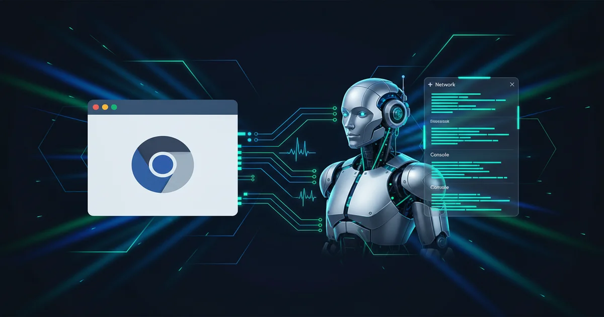

+++
date = '2026-03-17T10:00:00+08:00'
draft = false
title = 'Chrome DevTools MCP 配置指南 2026：AI 直连浏览器调试（三种方式详解）'
description = '手把手配置 Chrome DevTools MCP：解决 AI 打开新窗口的痛点、9222 远程调试端口设置、autoConnect 自动连接、user-data-dir 踩坑经验。适用于 Claude Code 和 Cursor。'
toc = true
tags = ['Chrome DevTools', 'MCP', 'AI Coding Tools', 'Claude Code']
keywords = ['Chrome DevTools MCP 配置', 'Chrome DevTools MCP 教程', 'Chrome 远程调试端口 9222', 'autoConnect 自动连接', 'AI 浏览器调试', 'MCP 服务器设置', 'Claude Code 浏览器调试', 'Chrome MCP 设置 2026']
+++



用 Chrome DevTools MCP 的人，几乎都踩过同一个坑：AI 助手每次都打开一个**全新的 Chrome 窗口**，你已经登录好的网站、打开的调试面板、复现好的 bug 现场——全没了。你在一个窗口里盯着报错，AI 在另一个空白窗口里两眼一抹黑。

这篇文章彻底解决这个问题。三种连接方式怎么选、「新窗口」到底为什么出现、以及大多数教程都没提到的 `--user-data-dir` 关键修复——一次讲透。

## Chrome DevTools MCP 是什么

[Chrome DevTools MCP](https://github.com/ChromeDevTools/chrome-devtools-mcp) 是 Google Chrome 团队做的一个 MCP（Model Context Protocol）服务器。用大白话说：它是 AI 编程助手和 Chrome 浏览器之间的翻译官。

没有它，AI 只能看你的代码猜浏览器里发生了什么。有了它，AI 能直接：

- **看到控制台报错**——不用你复制粘贴
- **检查网络请求**——请求头、响应体、耗时一目了然
- **录制性能 trace**——自动分析瓶颈在哪
- **截图和无障碍快照**——"看见"页面长什么样
- **跑 Lighthouse 审计**——性能评分、最佳实践一键检测
- **在页面里执行 JS**——直接操作 DOM
- **填表单、点按钮、跳转页面**——通过 Puppeteer 自动化

截至 v0.19.0，一共有 29 个工具可用。

## 「打开新窗口」这个坑，到底怎么回事

默认配置长这样：

```json
{
  "mcpServers": {
    "chrome-devtools": {
      "command": "npx",
      "args": ["-y", "chrome-devtools-mcp@latest"]
    }
  }
}
```

MCP 服务器会自己启动一个全新的 Chrome，用的是独立的用户数据目录（`~/.cache/chrome-devtools-mcp/chrome-profile-stable`）。结果就是：

- 没有 Cookie，没有已保存的密码，没有登录态
- 有些网站检测到 WebDriver 直接拦截
- 你真正在用的浏览器和调试上下文？完全隔离

这是最安全的模式，但也是最没用的模式——如果你要调试一个需要登录才能看到的页面，一个空白浏览器毫无意义。

## 三种连接方式，一张表说清楚

| 方式 | 登录态 | 适用场景 | Chrome 版本要求 |
|------|--------|----------|-----------------|
| **默认**（新实例） | 无 | 公开页面、CI/CD | 任意 |
| **autoConnect** | 保留 | 日常调试 | 146+（稳定版） |
| **手动连接**（`--browserUrl`） | 保留 | Docker、沙箱环境 | 任意 |

### 方式一：autoConnect（日常首选）

Chrome 146 稳定版开始，可以用 `--autoConnect` 直接连到你正在用的 Chrome。不开新窗口，不丢登录态。

**第一步：** 在 Chrome 地址栏输入 `chrome://inspect/#remote-debugging`，把开关打开。

**第二步：** 配置 MCP 服务器：

```json
{
  "mcpServers": {
    "chrome-devtools": {
      "command": "npx",
      "args": ["chrome-devtools-mcp@latest", "--autoConnect"]
    }
  }
}
```

Claude Code 用户直接命令行搞定：

```bash
claude mcp add chrome-devtools -- npx chrome-devtools-mcp@latest --autoConnect
```

**第三步：** MCP 连接时 Chrome 会弹窗问你「是否允许远程调试」，点允许就行。浏览器顶部会出现一条横幅「Chrome 正被自动测试软件控制」，正常现象。

连上之后，AI 能看到你 Chrome 里**所有标签页**——已登录的后台、已打开的调试面板、已复现的 bug 现场，全都在。

> **注意：** autoConnect 从 Chrome 144 就有了，但之前只在 Beta 通道可用（要加 `--channel=beta`）。Chrome 146 是第一个在**稳定版**支持这个功能的版本。

### 方式二：手动连接 `--browserUrl`（深度修复方案）

当 autoConnect 不可用，或者你需要更精细的控制（比如在 Docker 里跑 MCP 服务器连宿主机的 Chrome），就用这个方法。

核心思路：你自己启动 Chrome 并开启调试端口，然后让 MCP 服务器连过去。

**但坑就在这里。** 大部分人会这么做：

```bash
# 这样通常会失败
"/Applications/Google Chrome.app/Contents/MacOS/Google Chrome" \
  --remote-debugging-port=9222
```

Chrome 打开了，9222 端口好像也在监听，但 `curl http://127.0.0.1:9222/json/version` 返回 404 或者连接被拒。MCP 服务器连不上。

#### 三个原因，逐个击破

**原因一：Chrome 没有以调试模式启动。**

你平时双击图标打开的 Chrome，不会监听调试端口。`--remote-debugging-port` 这个参数只有从命令行**一开始就带上**才有效。

**原因二：已有 Chrome 进程抢占了端口。**

如果你电脑上已经有 Chrome 在跑，再用命令行带 `--remote-debugging-port=9222` 启动，Chrome 会检测到已有实例，然后把你的启动请求变成「在已有实例里打开新窗口」。调试参数被**静默吞掉了**。

**原因三：用户数据目录冲突（真正的杀手）。**

就算你杀掉所有 Chrome 进程再重启，Chrome 默认还是用你的标准用户数据目录。从 Chrome 136 开始，[Google 修改了安全策略](https://developer.chrome.com/blog/remote-debugging-port)：如果用的是默认配置目录，`--remote-debugging-port` 会被**直接忽略**。这是为了保护你保存的密码和 Cookie 不被调试协议暴露。

#### 解决方案：杀进程 + 独立目录 + 验证

完整的、可用的方案：

```bash
# 第一步：杀掉所有 Chrome 进程（必须彻底，不能有残留）
killall -9 "Google Chrome"

# 第二步：用独立的用户数据目录 + 调试端口启动
"/Applications/Google Chrome.app/Contents/MacOS/Google Chrome" \
  --remote-debugging-port=9222 \
  --user-data-dir=/tmp/chrome-debug-profile
```

Windows 用户：

```powershell
# 杀掉所有 Chrome 进程
taskkill /F /IM chrome.exe

# 用独立配置目录 + 调试端口启动
"C:\Program Files\Google\Chrome\Application\chrome.exe" `
  --remote-debugging-port=9222 `
  --user-data-dir="%TEMP%\chrome-debug-profile"
```

**第三步：验证调试端口是否正常：**

```bash
curl http://127.0.0.1:9222/json/version
```

看到类似这样的 JSON 响应就对了：

```json
{
  "Browser": "Chrome/146.0.6814.46",
  "Protocol-Version": "1.3",
  "webSocketDebuggerUrl": "ws://127.0.0.1:9222/devtools/browser/..."
}
```

然后配置 MCP 服务器指向这个端口：

```json
{
  "mcpServers": {
    "chrome-devtools": {
      "command": "npx",
      "args": ["chrome-devtools-mcp@latest", "--browserUrl", "http://127.0.0.1:9222"]
    }
  }
}
```

Claude Code 用户：

```bash
claude mcp add chrome-devtools -- npx chrome-devtools-mcp@latest --browserUrl http://127.0.0.1:9222
```

#### 为什么 `--user-data-dir` 不可省略

这个参数做了两件事：

1. **绕过 Chrome 136+ 的安全限制**——Chrome 只对非默认配置目录启用远程调试
2. **避免实例冲突**——独立的数据目录意味着 Chrome 不会试图和已有实例合并

路径随便写：`/tmp/chrome-debug-profile`、`~/chrome-debug`、甚至 `$(mktemp -d)` 都行。

> **小技巧：** 如果想在调试配置里保留书签和扩展，可以把默认 Chrome 配置目录复制一份到调试路径，然后反复使用。

### 方式三：默认模式（新实例）

最简单的配置，MCP 服务器全权处理：

```json
{
  "mcpServers": {
    "chrome-devtools": {
      "command": "npx",
      "args": ["-y", "chrome-devtools-mcp@latest"]
    }
  }
}
```

加 `--isolated` 可以用临时配置目录，浏览器关闭后自动清理：

```json
{
  "args": ["-y", "chrome-devtools-mcp@latest", "--isolated"]
}
```

适合测试公开页面、对预发布环境跑 Lighthouse、或者 CI/CD 流水线。需要登录态的场景，用方式一或方式二。

## 实战场景：调试需要登录的内部系统

**场景：** 公司内部管理后台部署后白屏了，页面需要 SSO 登录。

**没有 autoConnect 的情况：**
1. MCP 打开新 Chrome → 跳到 SSO 登录页 → AI 没法认证 → 死胡同

**用 autoConnect 的情况：**
1. 你已经在浏览器里登录了管理后台，看到了白屏
2. 你跟 Claude Code 说：「帮我看看这个页面的控制台和网络请求有没有报错」
3. Claude Code 连上你的 Chrome，发现 `/api/config` 接口返回 403
4. 它看了请求头，发现缺少 Authorization header，追溯到最近改的中间件
5. 你改了代码，Claude Code 在你的浏览器里实时验证——全程没开新窗口

这种「人操作，AI 分析」的工作流，才是 Chrome DevTools MCP 真正的价值。

## v0.19.0 带来了什么

配合 Chrome 146，MCP 服务器升级到 v0.19.0，重要更新：

- **Lighthouse 集成**——AI 可以在工作流里自动跑性能审计。先审计、找问题、改代码、再审计，形成闭环
- **Slim 模式**（`--slim`）——只暴露 3 个核心工具，大幅减少 token 消耗。挂了多个 MCP 服务器的时候特别有用
- **内存快照**——`take_memory_snapshot` 工具，排查内存泄漏利器
- **无障碍和 LCP 技能**——专门针对 WCAG 合规和核心 Web 指标的调试能力
- **实验性录屏**——把浏览器操作录成视频

## 安全提醒

用 autoConnect 或 `--browserUrl` 时，AI 能访问连接的 Chrome 里**所有标签页**。包括：

- 每个域名的 Cookie 和 localStorage
- 已登录的会话（银行、邮箱、管理后台）
- 表单数据和自动填充的密码

**几条实用建议：**

1. **连接前关掉敏感页面**——银行、密码管理器、支付页面
2. **看清 AI 要做什么再点允许**——大部分 MCP 客户端会让你确认工具调用
3. **用专门的 Chrome 配置文件做 AI 调试**——和日常浏览的配置隔开
4. **处理敏感代码时关闭遥测**——加 `--no-usage-statistics` 和 `--no-performance-crux`

## 常见问题排查

### 端口 9222 连接被拒

```bash
# 检查 9222 端口被谁占了
lsof -i :9222

# 如果有其他进程占用，杀掉
kill -9 <PID>

# 重新启动 Chrome
killall -9 "Google Chrome"
"/Applications/Google Chrome.app/Contents/MacOS/Google Chrome" \
  --remote-debugging-port=9222 \
  --user-data-dir=/tmp/chrome-debug-profile
```

### autoConnect 反复弹授权窗口

标签页多的时候会这样——MCP 服务器每次执行命令都要重新枚举标签页。可以试试 [chrome-cdp-skill](https://github.com/pasky/chrome-cdp-skill) 这个替代方案，它用持久化的 WebSocket 连接，弹窗只出现一次。

### Chrome 打开了但调试端口返回 404

大概率是 `--user-data-dir` 指向了默认配置目录。Chrome 136 以后，默认目录**不允许**远程调试。换一个路径就行：

```bash
--user-data-dir=/tmp/chrome-debug-profile  # 任何非默认路径都可以
```

### Node.js 版本不对

Chrome DevTools MCP 需要 **Node.js v20.19+**，检查一下：

```bash
node --version
```

## FAQ

**Q：autoConnect 在 Chrome 144/145 上能用吗？**
A：能，但只在 Beta 通道。需要在 MCP 配置里加 `--channel=beta`。Chrome 146 是第一个在稳定版支持 autoConnect 的版本。

**Q：Firefox 或 Safari 能用吗？**
A：不能。Chrome DevTools MCP 用的是 Chrome DevTools Protocol（CDP），Firefox 和 Safari 各有自己的调试协议，不兼容。

**Q：AI 连上来会拖慢浏览器吗？**
A：基本不会。MCP 通过 CDP WebSocket 通信，开销可以忽略。录制性能 trace 的时候会有一些额外开销，但只在主动录制期间。

**Q：autoConnect 也需要 `--user-data-dir` 吗？**
A：不需要。autoConnect 用的是 Chrome 内置的远程调试请求 API（Chrome 144 引入），不需要单独的用户数据目录。`--user-data-dir` 只在手动 `--browserUrl` 方式下需要。

## Related Reading

- [MCP 协议详解：AI 如何连接外部工具](/posts/ai/2026-02-28-mcp-protocol-explained/) — Chrome DevTools MCP 背后的协议原理
- [2026 年 Claude Code 最佳 MCP 服务器推荐](/posts/ai/2026-03-05-best-mcp-servers-claude-code/) — Chrome DevTools MCP 和其他必装服务器
- [Python 实战：从零构建 MCP 服务器](/posts/ai/2026-03-05-build-mcp-server-python/) — 自己动手写一个 MCP 服务器
- [Claude Code 浏览器自动化指南](/posts/ai/2026-01-28-claude-code-browser-automation/) — 其他浏览器自动化方案
- [MCP 安全指南：保护你的 AI 工具集成](/posts/ai/2026-03-10-mcp-security-2026/) — MCP 服务器安全最佳实践
