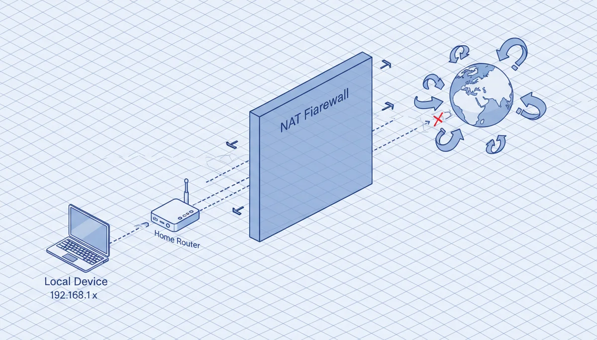
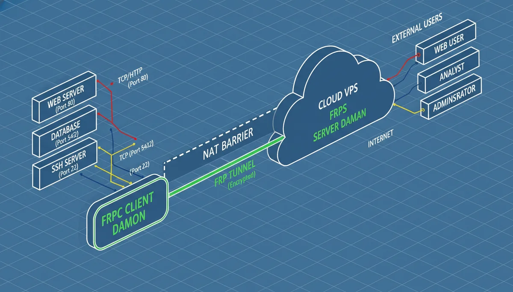
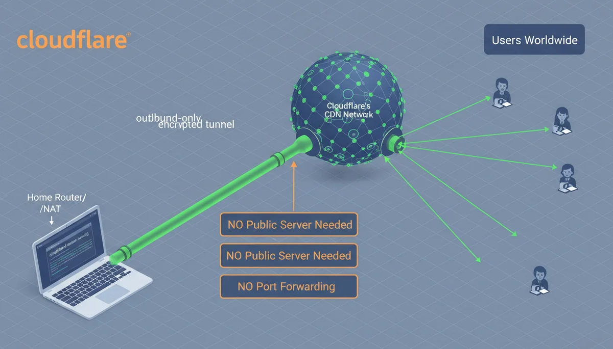
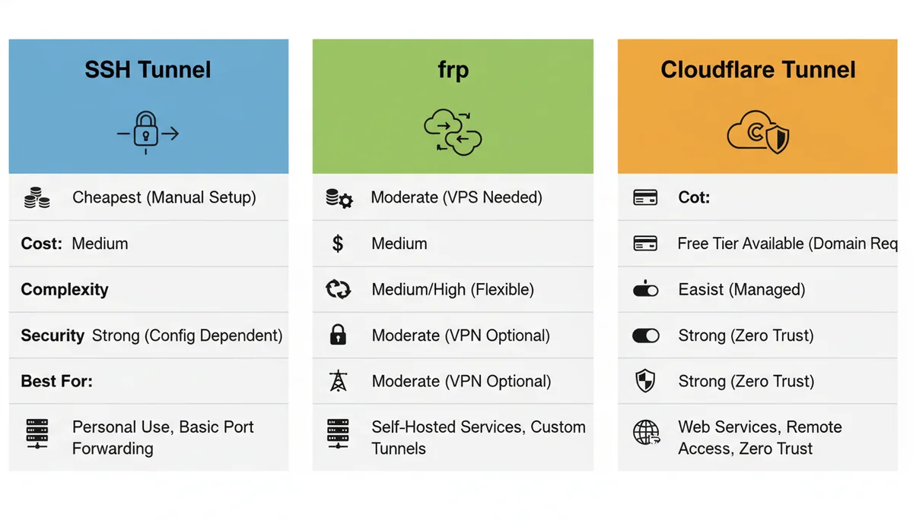

+++
date = '2026-03-28T10:00:00+08:00'
draft = false
title = '内网穿透实战：SSH 隧道、frp、Cloudflare Tunnel 三种方案深度对比'
description = '没有公网 IP 怎么让外部访问本地服务？三种主流内网穿透方案的架构原理、完整搭建教程、踩坑记录与横向对比，帮你选对工具。'
toc = true
tags = ['Cloudflare', 'Networking', 'DevOps', 'Tunneling']
keywords = ['内网穿透', 'Cloudflare Tunnel 教程', 'SSH 反向隧道', 'frp 配置', 'ngrok 替代方案', '本地服务公网访问', 'NAT 穿透', 'localhost 公网']
+++


上周碰到一个很常见的场景：海外同事要测一个我本地跑着的功能。我的 Mac Mini 在家里，藏在路由器的 NAT 后面，没有公网 IP，ISP 也没给固定地址。我总不能为了让人看一眼页面，就去折腾端口转发、暴露整个家庭网络吧。

这个问题 —— 把 `localhost` 暴露到公网 —— 在开发中高频出现。Webhook 回调、真机测试、跨国协作、客户演示……需求很普遍，但网络现实让它出奇地难搞。

过去几年我在不同项目里用过三种方案，各有各的适用场景。这篇文章不是那种浅尝辄止的工具推荐，而是把每种方案的底层原理、完整搭建步骤、以及我实际踩过的坑全部摊开来讲。

## 问题的本质：为什么 localhost 无法被外部访问

根源在 NAT（网络地址转换）。你的 ISP 给路由器一个公网 IP（运气差的话是 CGNAT 共享地址），路由器再给内网设备分配 `192.168.x.x` 之类的私有地址。外部流量到达路由器时，路由器不知道该转给哪台设备 —— 除非你手动配了端口转发。

端口转发能用，但实际操作问题很多：要有路由器管理权限、需要 ISP 提供静态 IP（多数不提供）、还在防火墙上开了一个 7×24 小时的口子。为了开发测试搞这些，太重了。

聪明的做法是**反向隧道** —— 不等外部来连你（NAT 会拦截），而是你主动向外连接到一个中继节点，中继节点再把流量通过这条已建立的连接回传给你。本文的三种方案都基于这个原理，但实现方式截然不同。



## 三种方案速览

开始之前，先看全局：

| 方案 | 核心思路 | 你需要准备什么 |
|------|---------|-------------|
| **SSH 反向隧道** | 利用 SSH 内置的 `-R` 参数，通过一台公网服务器建隧道 | 一台有公网 IP 的 VPS |
| **frp** | 专用的自托管内网穿透服务，支持多种协议 | 一台有公网 IP 的 VPS |
| **Cloudflare Tunnel** | 托管式隧道，用 Cloudflare 的全球 CDN 做中继 | 一个托管在 Cloudflare 的域名（免费） |

前两种需要你自己有公网服务器，第三种不需要。但各自擅长的场景不同，搞清楚区别才能选对工具。

## 方案一：SSH 反向隧道

SSH 是服务器管理的瑞士军刀，它的反向隧道功能是最被低估的能力之一。如果你手头有台 VPS，这个方案不需要安装任何额外软件。

### 原理

正常的 SSH 连接（`ssh user@server`）是你的电脑向外连接到服务器，连接本身是双向的 —— 数据可以两边流。`-R` 参数告诉 SSH：在**服务器端**也监听一个端口，收到的流量通过 SSH 连接回传到你的本地。

```
┌──────────────┐                    ┌──────────────┐
│  你的电脑     │──── SSH（出站）────→│  公网服务器   │
│ localhost:8080│←── 流量通过同一条  ←──│ :8080（监听） │
└──────────────┘    连接回传          └──────────────┘
                                           ↑
                                      用户从这里访问
```

关键在于：**你的电脑不需要公网 IP。** 它主动发起出站连接（NAT 放行出站流量），然后流量反向搭载在同一条连接上回来。就像打电话 —— 你不需要公开号码就能拨出去，电话一通双方都能说话。

### 完整搭建步骤

**第一步：建立反向隧道**

在你的本地电脑上执行：

```bash
ssh -R 8080:127.0.0.1:8080 user@server-ip
```

这条命令把服务器的 8080 端口映射到你本地的 8080 端口。只要 SSH 会话活着，访问 `server-ip:8080` 的请求就会被转发到你笔记本的 `localhost:8080`。

加保活参数，防止空闲断线：

```bash
ssh -R 8080:127.0.0.1:8080 \
    -o ServerAliveInterval=60 \
    -o ServerAliveCountMax=3 \
    user@server-ip
```

**第二步：在服务器上配 Nginx，用域名访问**

裸 IP + 端口只适合临时测试。正经用得配域名加 HTTPS。在服务器上配 Nginx：

```nginx
server {
    listen 80;
    server_name app.example.com;

    location / {
        proxy_pass http://127.0.0.1:8080;
        proxy_set_header Host $host;
        proxy_set_header X-Real-IP $remote_addr;
        proxy_set_header X-Forwarded-Proto $scheme;
        proxy_set_header X-Forwarded-For $proxy_add_x_forwarded_for;

        # WebSocket 支持（Vite HMR、Socket.IO 等需要）
        proxy_http_version 1.1;
        proxy_set_header Upgrade $http_upgrade;
        proxy_set_header Connection "upgrade";
    }
}
```

加 HTTPS，一行搞定：

```bash
sudo certbot --nginx -d app.example.com
```

**第三步：配 DNS**

添加 A 记录：`app.example.com → server-ip`

**第四步：验证完整链路**

```
用户访问 https://app.example.com
  → DNS 解析到你的服务器
  → Nginx 收到请求，转发到 127.0.0.1:8080
  → SSH 隧道把请求传到你电脑的 8080 端口
  → 本地服务处理，响应原路返回
```

### 最大的弱点：连接不稳定

SSH 隧道很脆弱。网络一抖、电脑休眠、路由器重启 —— 任何一个都会让隧道悄悄断掉。你不会收到通知，直到有人告诉你"网站打不开了"。

标准解法是 `autossh`，一个 SSH 连接的守护程序，断了自动重连：

```bash
brew install autossh    # macOS
sudo apt install autossh  # Ubuntu

autossh -M 20000 -R 8080:127.0.0.1:8080 \
    -o ServerAliveInterval=60 \
    -o ServerAliveCountMax=3 \
    -N user@server-ip
```

`-M 20000` 设置监控端口，`autossh` 通过它发心跳包检测连接是否存活。`-N` 表示不开 shell（只需要隧道，不需要交互）。

这能用，但本质上是个补丁。SSH 设计初衷是交互式会话，不是持久化的基础设施隧道。这就引出了一个专门为此设计的工具。

### 什么时候该用 SSH 隧道

- 手头有 VPS，不想装别的东西
- 临时用一下 —— "让我给你看 10 分钟"
- 需要隧道非 HTTP 协议（SSH 原生支持 TCP）
- 环境限制不允许装额外软件

## 方案二：frp（Fast Reverse Proxy）

SSH 隧道是把通用工具拿来客串，[frp](https://github.com/fatedier/frp) 是专门为内网穿透而生的。它支持 HTTP、HTTPS、TCP、UDP，甚至点对点连接。2017 年开源至今，GitHub 90k+ star，被大量 DevOps 团队用在生产环境。

### 架构



frp 是经典的客户端-服务端模型：

- **frps**（服务端）：跑在公网 VPS 上，接受客户端连接，监听用户流量
- **frpc**（客户端）：跑在你本地电脑上，主动连接 frps，注册要暴露的服务

```
┌──────────────┐                    ┌──────────────┐
│  你的电脑     │──── frp 隧道 ────→ │  公网服务器   │
│  frpc        │    （持久连接）     │  frps        │
│ localhost:8080│←── 流量回传  ←────│ :80（vhost）  │
└──────────────┘                    └──────────────┘
                                          ↑
                                     用户从这里访问
```

和 SSH 不同，frp 从底层就为持久连接设计。重连、多路复用、协议协商都是原生支持的，不需要外部工具辅助。

### 完整搭建步骤

**第一步：在公网服务器上部署 frps**

从 [GitHub releases](https://github.com/fatedier/frp/releases) 下载，写服务端配置：

```toml
# frps.toml
bindPort = 7000
vhostHTTPPort = 80
vhostHTTPSPort = 443
```

三行配置。`bindPort` 是 frpc 连接用的端口，`vhostHTTPPort` 和 `vhostHTTPSPort` 是用户流量进来的端口。

启动：

```bash
./frps -c frps.toml
```

**第二步：在你的电脑上配置 frpc**

```toml
# frpc.toml
serverAddr = "server-ip"
serverPort = 7000

[[proxies]]
name = "web-frontend"
type = "http"
localPort = 8080
customDomains = ["app.example.com"]

[[proxies]]
name = "web-api"
type = "http"
localPort = 3000
customDomains = ["api.example.com"]
```

启动：

```bash
./frpc -c frpc.toml
```

**第三步：配 DNS**

A 记录指向服务器：

```
app.example.com → server-ip
api.example.com → server-ip
```

搞定。`http://app.example.com` 现在指向你本地的 8080 端口。

### HTTPS 怎么搞

两种路子。简单的是在 frps 前面放 Nginx 做 TLS 终止 —— 和 SSH 方案里一样的模式。另一种是用 frp 内置的 HTTPS 插件：

```toml
[[proxies]]
name = "web-https"
type = "https"
customDomains = ["app.example.com"]

[proxies.plugin]
type = "https2http"
localAddr = "127.0.0.1:8080"
crtPath = "/path/to/cert.pem"
keyPath = "/path/to/key.pem"
```

### 杀手锏：TCP 和 UDP 隧道

这是 frp 拉开差距的地方。SSH 和 Cloudflare Tunnel 主要处理 HTTP 流量，frp 能隧道穿透**任意 TCP 和 UDP 流量**：

```toml
# 暴露本地 SSH，实现远程访问
[[proxies]]
name = "my-ssh"
type = "tcp"
localIP = "127.0.0.1"
localPort = 22
remotePort = 6022

# 暴露一个游戏服务器
[[proxies]]
name = "game-server"
type = "udp"
localIP = "127.0.0.1"
localPort = 27015
remotePort = 27015
```

配完之后，`ssh -p 6022 user@server-ip` 就能直连你的本地电脑。数据库、Redis、自定义 TCP 协议 —— frp 都能隧道。

### 什么时候该用 frp

- 需要 TCP 或 UDP 隧道（数据库、SSH、游戏服务器）
- 想完全控制中继基础设施
- 团队使用场景，需要自定义访问控制
- 隐私要求高，不想流量经过第三方

代价也很明确：你得自己维护服务器、管理 TLS 证书、保障运行时间。

## 方案三：Cloudflare Tunnel

前两种方案都需要你有一台公网服务器。如果没有呢？

[Cloudflare Tunnel](https://developers.cloudflare.com/cloudflare-one/networks/connectors/cloudflare-tunnel/) 的思路是：用 Cloudflare 全球 300 多个数据中心组成的网络来充当中继。你在本地跑一个叫 `cloudflared` 的轻量守护进程，它主动连接到 Cloudflare，Cloudflare 处理剩下的一切 —— DNS、TLS、路由、高可用。

结果：**零基础设施，免费。**



### 深入底层

这部分值得细看，因为它解释了 Cloudflare Tunnel 为什么既强又有局限。

`cloudflared` 启动时，不是只开一条连接 —— 它会建立 **4 条持久连接**，使用**后量子加密**，分布在至少 **2 个不同的 Cloudflare 数据中心**。启动日志里能看到：

```
INF Registered tunnel connection connIndex=0 ... location=hkg08
INF Registered tunnel connection connIndex=1 ... location=hkg09
INF Registered tunnel connection connIndex=2 ... location=hkg09
INF Registered tunnel connection connIndex=3 ... location=hkg11
```

为什么是四条连接两个数据中心？冗余。一条断了还有三条。一个数据中心挂了，另一个继续服务。这种基础设施级别的可靠性，用 SSH 或 frp 自建的话需要花不少精力。

四条连接全是出站的。你的防火墙不需要任何入站规则。连接使用 TLS 1.3 加后量子加密算法 —— 设计用来抵抗未来量子计算机攻击的加密方式。默认就有，不用配。

**请求的完整生命周期：**

```
用户访问 https://app.example.com
  1. DNS 通过 CNAME 解析到 Cloudflare 的 Anycast IP
  2. 离用户最近的 Cloudflare 边缘节点收到 HTTPS 请求
  3. Cloudflare 找到负责这个域名的隧道
  4. 请求通过最近的 cloudflared 连接转发
  5. cloudflared 代理请求到 localhost:8080
  6. 响应原路返回
```

用户完全无感。Cloudflare 在边缘做 TLS 终止，所以你本地跑 HTTP 就行 —— 证书不用管。

### 完整搭建步骤

**前提：** 有一个 DNS 托管在 Cloudflare 的域名（免费套餐就行）。

**第一步：安装 cloudflared**

```bash
# macOS
brew install cloudflared

# Linux (Debian/Ubuntu)
curl -L https://github.com/cloudflare/cloudflared/releases/latest/download/cloudflared-linux-amd64.deb -o cloudflared.deb
sudo dpkg -i cloudflared.deb

# Windows
winget install --id Cloudflare.cloudflared

# 验证
cloudflared --version
```

**第二步：登录认证**

```bash
cloudflared tunnel login
```

浏览器弹出授权页面，选择要用的域名并授权。凭证保存到 `~/.cloudflared/cert.pem`。

**第三步：创建隧道**

```bash
cloudflared tunnel create my-tunnel
```

生成一个隧道 UUID，凭证保存到 `~/.cloudflared/<UUID>.json`。UUID 是隧道的身份标识 —— 它是一个持久对象，即使 `cloudflared` 没在运行也存在。

**第四步：写配置文件**

创建 `~/.cloudflared/config.yml`：

```yaml
tunnel: <UUID>
credentials-file: /path/to/.cloudflared/<UUID>.json

ingress:
  - hostname: app.example.com
    service: http://localhost:8080
  - hostname: api.example.com
    service: http://localhost:3000
  - service: http_status:404
```

ingress 规则和反向代理一样 —— 从上到下匹配，命中第一条就停。最后的兜底规则必须有，告诉 Cloudflare 不匹配的请求怎么处理。

验证配置：

```bash
cloudflared tunnel ingress validate
```

**第五步：绑定 DNS**

```bash
cloudflared tunnel route dns my-tunnel app.example.com
```

自动在 Cloudflare DNS 里创建 CNAME：`app.example.com → <UUID>.cfargotunnel.com`。也可以去 Cloudflare 控制台手动确认。

**第六步：启动隧道**

```bash
cloudflared tunnel run my-tunnel
```

完事。`https://app.example.com` 现在通过 Cloudflare 的全球网络指向你本地的 8080 端口，带合法 TLS 证书。

### 进阶配置

**精调 ingress 规则：**

```yaml
ingress:
  - hostname: app.example.com
    service: http://localhost:8080
    originRequest:
      connectTimeout: 30s
      noTLSVerify: true
      httpHostHeader: app.example.com
      keepAliveConnections: 10
      keepAliveTimeout: 90s
```

**注册为系统服务**（开机自启、崩溃自动恢复）：

```bash
# macOS
sudo cloudflared service install
sudo launchctl start com.cloudflare.cloudflared

# Linux
sudo cloudflared service install
sudo systemctl enable cloudflared
sudo systemctl start cloudflared
```

**监控：** `cloudflared` 默认在 `http://127.0.0.1:20241/metrics` 暴露 Prometheus 格式的指标，可以接 Grafana 做隧道健康看板。

**WebSocket：** 开箱支持。Vite HMR、Socket.IO 等 WebSocket 工具不需要额外配置就能通过隧道工作。

### 生产级能力

Cloudflare Tunnel 不只是开发工具，它有完整的生产级特性：

**副本高可用。** 用相同凭证在多台机器上运行同一条隧道：

```bash
# 机器 A
cloudflared tunnel run my-tunnel

# 机器 B（相同凭证文件）
cloudflared tunnel run my-tunnel
```

每个副本开 4 条连接，最多支持 25 个副本（100 条连接）。流量自动路由到最近的健康副本。

**零停机更新配置。** 用新配置启动一个新副本，等它注册成功，再停掉旧的。不丢请求。

**Cloudflare Access 做访问控制。** 不改一行代码就能给隧道加认证 —— 邮箱验证码、Google/GitHub SSO、IP 白名单、设备状态检查。给内部工具加个访问门槛，不需要 VPN，特别省事。

### 什么时候该用 Cloudflare Tunnel

- 没有公网服务器，也不想维护
- 希望 TLS 证书自动搞定
- 需要高可用但不想自己建
- 域名本身就在 Cloudflare 上
- 想给服务加访问控制又不想改代码

代价：所有流量都走 Cloudflare。多数场景没问题 —— 他们是全球最大的 CDN 之一。但如果有严格的数据主权要求，或者需要 TCP/UDP 隧道，这就不是合适的工具了。

## 实战踩坑记录

不管选哪种方案，下面这些坑大概率会碰到。

### 「Blocked request — host not allowed」

现代前端开发服务器（Vite、Next.js、Webpack Dev Server）会拒绝非 `localhost` 的请求。流量以 `app.example.com` 的身份到达时，服务器直接返回 403。

**Vite** — 在 `vite.config.ts` 里加：
```typescript
server: {
  allowedHosts: ['app.example.com'],
}
```

**Next.js** — 在 `next.config.js` 里加：
```javascript
module.exports = {
  allowedDevOrigins: ['app.example.com'],
}
```

### 502 Bad Gateway（Cloudflare Tunnel）

Cloudflare 成功连到了 `cloudflared`，但 `cloudflared` 连不上你的本地服务。排查清单：

- 本地服务跑起来了吗？
- `config.yml` 里端口对不对？
- 有些系统上 `localhost` 和 `127.0.0.1` 解析结果不同 —— 换着试试

### DNS 超时报错（Cloudflare Tunnel）

启动时可能看到这个：

```
ERR Failed to fetch features error="lookup cfd-features.argotunnel.com: i/o timeout"
```

不影响使用。`cloudflared` 在尝试解析 Cloudflare 的内部服务发现域名，失败了只是跳过可选的功能协商。隧道本身正常。

### 性能问题

任何隧道都会增加延迟。SSH 和 frp 多一跳（经过你的服务器），Cloudflare Tunnel 经过最近的 Cloudflare 边缘节点（通常很快，但不一定是最优路径）。

实用建议：

- 本地服务开启压缩（gzip/brotli）
- Cloudflare Tunnel 用户看启动日志的 `location` 字段，确认连的是最近的数据中心
- 如果你有地理位置靠近用户的 VPS，SSH 或 frp 通常比绕道 Cloudflare 更快
- 对于静态资源，Cloudflare 的缓存反而可能比直连更快

## 怎么选：横向对比与决策框架



三种方案都实际用下来之后，我的选择逻辑是这样的：

| 维度 | SSH 隧道 | frp | Cloudflare Tunnel |
|------|---------|-----|-------------------|
| 需要公网服务器 | 需要 | 需要 | 不需要 |
| 额外软件 | 不需要（系统自带） | frps + frpc | cloudflared |
| 自动重连 | 不支持（需要 autossh） | 内建 | 内建 |
| TLS 证书 | 手动配 | 手动或插件 | 自动 |
| TCP/UDP 隧道 | 支持 | 支持 | 仅 HTTP/HTTPS |
| 多服务路由 | 多个 SSH 会话 | 一个配置文件 | 一个配置文件 |
| 全球 CDN 加速 | 无 | 无 | 有（300+ 节点） |
| 搭建复杂度 | 低 | 中 | 中 |
| 日常维护量 | 中（连接不稳定） | 中（服务器运维） | 低 |
| 费用 | VPS（$5-20/月） | VPS（$5-20/月） | 免费 |
| 数据主权 | 完全可控 | 完全可控 | 经过 Cloudflare |

**我的决策框架：**

- **"给我 10 分钟看一下效果"** —— SSH 反向隧道。一条命令，零准备。
- **"我要隧道 TCP/UDP 流量"** —— frp。三个方案里唯一能优雅处理任意协议的。
- **"我有一台离用户很近的服务器"** —— SSH 或 frp。延迟敏感时，直连比绕 CDN 更快。
- **"搭好就不想管了，永久稳定运行"** —— Cloudflare Tunnel。不用维护服务器、不用续证书、不用守连接。
- **"基础设施必须完全自主可控"** —— frp。自托管、高度可配、不依赖第三方。

没有哪个方案是"最好的"。我个人是 SSH 隧道用来临时快速共享，Cloudflare Tunnel 用在需要长期稳定运行的场景，frp 填补 Cloudflare 不支持的协议空白。

## 结尾

把 localhost 暴露到公网这个问题，已经被很多工具解决过了。但这些方案处在一个从极简（SSH）到全托管（Cloudflare）的光谱上。理解各自的取舍，才能在不过度工程和不缺斤少两之间找到平衡点。

如果只记住一件事：**三种方案用的是同一个底层技巧** —— 你的机器向外发起连接，流量通过这条已建立的连接回传。区别在于谁来管理中继、连接多可靠、支持什么协议。

根据你当前的约束条件选就好。反正以后要换也不难 —— 不管中间的隧道是什么，最终的模式（反向代理 → 本地服务）都一样。

## 相关阅读

- [Chrome DevTools MCP：AI 驱动的浏览器调试](/posts/ai/2026-03-17-chrome-devtools-mcp-guide/) — 用 AI 辅助调试 Web 应用
- [Tmux 终端复用指南](/posts/ai/2026-03-03-tmux-guide-ai-development/) — AI 开发场景下的终端管理
- [AI 开发环境搭建](/posts/ai/2026-03-10-ai-dev-environment-setup/) — 完整的 AI 开发环境配置指南
- [MCP 协议详解](/posts/ai/2026-02-28-mcp-protocol-explained/) — 理解模型上下文协议
