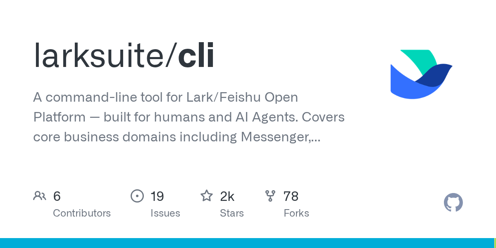

+++
date = '2026-03-29T09:00:00+08:00'
title = 'Lark CLI 完全指南：用命令行和 AI Agent 操控飞书'
description = 'Lark CLI 是飞书开放平台官方命令行工具，覆盖日历、消息、文档等 11 大业务域，提供 200+ 命令和 19 个 AI Agent Skills。本文手把手教你从安装配置到实战操作，让 AI Agent 直接帮你管理飞书。'
toc = true
tags = ['Lark CLI', 'Feishu', 'AI Agent', 'Claude Code', 'CLI Tools', 'Open Source', 'Productivity']
keywords = ['Lark CLI', 'lark-cli 安装', '飞书命令行', 'AI Agent 飞书', 'Claude Code 飞书', '飞书开放平台', 'lark-cli 教程']
+++



## 一、先讲个故事

你是不是有过这样的经历：老板突然要你把飞书日历上下周所有会议导出来，或者给 50 个群发一条通知，又或者把文档批量整理到知识库里。你只能一个个点、一个个复制，干到眼花。

现在有了 Lark CLI，在终端里敲一行命令就搞定。更狠的是，它可以直接接入 Claude Code 这类 AI Agent——你用自然语言说"帮我看看明天有什么会"，AI 就替你查好了。读完这篇，你会掌握从安装到实战的全部流程。

---

## 二、Lark CLI 到底是什么？

### 2.1 一句话定义

> **Lark CLI** 是飞书（Lark）开放平台的官方命令行工具，由 larksuite 团队开发并开源（MIT 协议）。它覆盖 11 大业务域、提供 200+ 精选命令和 19 个 AI Agent Skills，截至 2026 年 3 月，GitHub 已有 1.7k Star（[来源](https://github.com/larksuite/cli)）。

用大白话说：它是飞书的"遥控器"，不用打开网页或 App，在终端里就能操作日历、消息、文档、表格等几乎所有飞书功能。

### 2.2 它和飞书开放平台 API 有什么不同？

| 对比维度 | 直接调飞书 API | Lark CLI |
|---------|--------------|----------|
| 上手门槛 | 需要写代码、处理认证、分页、错误 | 一行命令搞定 |
| 认证方式 | 手动管理 Token 刷新 | 内置 OAuth，自动管理凭证 |
| AI 集成 | 需要自己写 Function Calling | 19 个 Skills 开箱即用 |
| 覆盖范围 | 2500+ API 端点（全量） | 200+ 精选命令 + 通用 API 兜底 |
| 输出格式 | JSON 自己解析 | 支持 JSON / Table / CSV / Pretty |

简单说：**直接调 API 像自己组装电脑，Lark CLI 像买品牌整机——核心能力一样，但省了一堆折腾**。

### 2.3 谁做的？

Lark CLI 由飞书开放平台团队（[larksuite](https://github.com/larksuite)）官方维护，MIT 协议开源。项目用 Go 语言开发，AI Skills 部分采用标准的 Skills 协议，可以被 Claude Code、Cursor、Gemini CLI 等主流 AI 编程工具直接加载。

---

## 三、它能帮你做什么？

Lark CLI 覆盖 11 大业务域，以下是最常用的场景：

### 3.1 日历管理

**你说**："帮我看看今天有什么会议"
**它做**：

```bash
lark-cli calendar +agenda
```

返回今天的完整日程，包括会议标题、时间、参会人。

**你说**："帮我创建一个明天下午 3 点的评审会，邀请张三"
**它做**：

```bash
lark-cli calendar +create --title "方案评审会" --start "2026-03-30T15:00:00+08:00" --end "2026-03-30T16:00:00+08:00" --attendees "zhangsan@company.com"
```

### 3.2 即时消息

**你说**："给研发群发一条消息，提醒大家明天提交周报"
**它做**：

```bash
lark-cli im +messages-send --chat-id "oc_xxx" --text "提醒：明天下班前提交周报"
```

**你说**："搜一下上周小王在群里发的那个链接"
**它做**：

```bash
lark-cli im +messages-search --query "链接" --sender "xiaowang" --start-time "2026-03-22T00:00:00+08:00"
```

### 3.3 云文档

**你说**："帮我新建一个周报文档"
**它做**：

```bash
lark-cli docs +create --title "2026 第 13 周周报" --markdown "# 本周进展\n\n## 完成事项\n\n## 下周计划"
```

### 3.4 多维表格

```bash
# 列出表格中的所有记录
lark-cli base records list --params '{"app_token":"bascnXXX","table_id":"tblXXX"}'

# 新增一条记录
lark-cli base records create --params '{"app_token":"bascnXXX","table_id":"tblXXX"}' --data '{"fields":{"任务名":"修复登录Bug","负责人":"张三","状态":"进行中"}}'
```

### 3.5 更多业务域

| 业务域 | 命令前缀 | 典型操作 |
|--------|---------|---------|
| 电子表格 | `sheets` | 读写单元格、导出数据 |
| 任务 | `task` | 创建/完成任务、设置提醒 |
| 知识库 | `wiki` | 搜索文档、管理节点 |
| 通讯录 | `contact` | 按姓名/邮箱搜索同事 |
| 邮箱 | `mail` | 浏览邮件、写草稿 |
| 视频会议 | `vc` | 查看录制、获取会议纪要 |
| 妙记 | `minutes` | 获取会议纪要内容 |

---

## 四、三层命令架构——它是怎么工作的？

Lark CLI 设计了一个三层架构，由浅到深，覆盖不同需求：

```
┌─────────────────────────────────────────────┐
│  第一层：快捷命令（+ 前缀）                    │
│  人类友好，AI 友好，覆盖高频场景                │
│  例：lark-cli calendar +agenda               │
├─────────────────────────────────────────────┤
│  第二层：API 命令                              │
│  与飞书 API 端点一一对应，100+ 精选命令          │
│  例：lark-cli calendar events list           │
├─────────────────────────────────────────────┤
│  第三层：通用 API 调用                          │
│  覆盖全部 2500+ 飞书开放平台端点                │
│  例：lark-cli api GET /open-apis/...         │
└─────────────────────────────────────────────┘
```

**第一层**是给人和 AI 用的"快捷方式"，用 `+` 前缀标识。参数简洁、智能默认值多、返回结果经过格式化。

**第二层**是从飞书 API 元数据自动生成的命令，参数和返回值与官方 API 文档一致，适合需要精确控制的场景。

**第三层**是万能后备——任何飞书开放平台的 API 端点都能直接调用，即使 CLI 还没封装对应的命令。

---

## 五、准备工作

### 5.1 环境要求

| 依赖 | 版本要求 | 说明 |
|------|---------|------|
| Node.js | 建议 v18+ | 包含 npm 和 npx |
| Go | v1.23+（可选） | 仅源码编译时需要 |
| Python 3 | 最新版（可选） | 仅源码编译时需要 |

检查你的 Node.js 环境：

```bash
node -v   # 应输出 v18.x.x 或更高
npm -v    # 应输出 9.x.x 或更高
```

如果没有安装 Node.js，macOS 用户推荐用 Homebrew：

```bash
brew install node
```

### 5.2 你需要一个飞书应用

Lark CLI 通过飞书开放平台的应用来获取权限。你需要在飞书开发者后台创建一个应用，获取 App ID 和 App Secret。

别担心，下一章会一步步带你操作。

---

## 六、手把手安装教程

### 6.1 安装 Lark CLI

**macOS / Linux：**

```bash
# 全局安装 lark-cli
sudo npm install -g @larksuite/cli

# 验证安装
lark-cli --version
# 输出：lark-cli version 1.0.0
```

> 如果遇到权限问题（EACCES 错误），需要加 `sudo`。或者你可以配置 npm 全局目录到用户目录下，避免每次都要 sudo。

**Windows：**

```powershell
npm install -g @larksuite/cli
lark-cli --version
```

**源码安装（适合想参与开发的用户）：**

```bash
git clone https://github.com/larksuite/cli.git
cd cli
make install
```

### 6.2 安装 AI Agent Skills

这一步是 Lark CLI 的精华——安装 19 个 AI Agent Skills，让 Claude Code 等 AI 工具能够理解和操作飞书。

```bash
# 一键安装全部 Skills
npx skills add larksuite/cli -y -g
```

安装完成后可以验证：

```bash
npx skills list
```

你会看到类似这样的输出：

```
lark-shared        ~/.agents/skills/lark-shared
lark-calendar      ~/.agents/skills/lark-calendar
lark-im            ~/.agents/skills/lark-im
lark-doc           ~/.agents/skills/lark-doc
lark-drive         ~/.agents/skills/lark-drive
lark-sheets        ~/.agents/skills/lark-sheets
lark-base          ~/.agents/skills/lark-base
lark-task          ~/.agents/skills/lark-task
lark-mail          ~/.agents/skills/lark-mail
lark-contact       ~/.agents/skills/lark-contact
lark-wiki          ~/.agents/skills/lark-wiki
...共 19 个
```

如果你只需要特定域的能力，也可以按需安装：

```bash
# 只装日历相关
npx skills add larksuite/cli -s lark-calendar -y

# 只装消息相关
npx skills add larksuite/cli -s lark-im -y
```

### 6.3 创建飞书应用并获取凭证

这是最关键的一步。Lark CLI 需要一个飞书应用的身份才能调用 API。

**第一步：打开飞书开发者后台**

访问 [https://open.feishu.cn/app](https://open.feishu.cn/app)，用你的飞书账号登录。

**第二步：创建应用**

1. 点击"创建企业自建应用"
2. 填写应用名称（比如"我的 CLI 工具"）和描述
3. 点击"确定"创建

**第三步：获取凭证**

在应用详情页的"凭证与基础信息"中，找到：
- **App ID**（类似 `cli_a5xxxxx`）
- **App Secret**（一长串密钥）

把这两个值记下来，下一步要用。

**第四步：配置 CLI**

```bash
lark-cli config init
```

按提示输入 App ID 和 App Secret。CLI 会将凭证加密存储在系统钥匙串中（macOS 用 Keychain，Linux 用 Secret Service），不是明文保存。

### 6.4 授权登录

```bash
lark-cli auth login --recommend
```

`--recommend` 参数会自动选择常用的权限范围，省去手动勾选。执行后会弹出浏览器页面，点击"同意授权"即可。

验证登录状态：

```bash
lark-cli auth status
```

看到类似 `Logged in as xxx` 就说明成功了。

### 6.5 健康检查

Lark CLI 提供了一个诊断命令，一次性检查配置、认证和网络连通性：

```bash
lark-cli doctor
```

如果有问题，它会明确告诉你哪里出了问题以及如何修复。

---

## 七、新手必试的 5 个操作

安装完成后，用这 5 个命令快速验证一切正常：

### 7.1 查看今日日程

```bash
lark-cli calendar +agenda
```

这是最简单的命令——不需要任何参数，返回你今天的全部日程。

### 7.2 搜索同事

```bash
lark-cli contact +search-user --query "张三"
```

按姓名搜索通讯录，返回姓名、部门、邮箱等信息。

### 7.3 查看群聊列表

```bash
lark-cli im +chat-search --query "研发"
```

搜索名字包含"研发"的所有群聊，返回群名和 chat_id（后续发消息要用到）。

### 7.4 查看 API Schema

```bash
# 列出所有可用的 API 服务
lark-cli schema

# 查看日历事件相关的 API 详情
lark-cli schema calendar.events.instance_view
```

`schema` 命令相当于内置的 API 文档查看器，不用打开浏览器就能查参数说明。

### 7.5 Dry Run 预览

在真正执行操作前，先看看请求长什么样：

```bash
lark-cli im +messages-send --chat-id oc_xxx --text "测试消息" --dry-run
```

`--dry-run` 只打印请求内容，不会真正发送。新手强烈建议先用这个参数试水。

---

## 八、进阶玩法

### 8.1 与 Claude Code 集成——真正的 AI Agent

这才是 Lark CLI 最强大的地方。安装了 Skills 之后，Claude Code 能直接理解飞书操作指令。

在 Claude Code 中，你可以直接用自然语言：

```
你：帮我看看明天有什么会议
Claude Code：（调用 lark-cli calendar +agenda 查询明天日程）

你：给研发群发一条消息，提醒大家下午 3 点开会
Claude Code：（调用 lark-cli im +messages-send 发送消息）

你：帮我把这周的会议纪要整理成文档
Claude Code：（调用 lark-cli minutes + lark-cli docs 联合操作）
```

19 个 Skills 的完整列表：

| 分类 | Skill 名称 | 功能 |
|------|-----------|------|
| 核心 | `lark-shared` | 通用认证和配置管理 |
| 业务域 | `lark-calendar` | 日历和日程管理 |
| 业务域 | `lark-im` | 即时消息和群聊 |
| 业务域 | `lark-doc` | 云文档操作 |
| 业务域 | `lark-drive` | 云空间和文件管理 |
| 业务域 | `lark-sheets` | 电子表格操作 |
| 业务域 | `lark-base` | 多维表格管理 |
| 业务域 | `lark-task` | 任务管理 |
| 业务域 | `lark-mail` | 邮箱操作 |
| 业务域 | `lark-contact` | 通讯录查询 |
| 业务域 | `lark-wiki` | 知识库管理 |
| 业务域 | `lark-event` | 事件订阅 |
| 业务域 | `lark-vc` | 视频会议 |
| 专项 | `lark-whiteboard` | 白板操作 |
| 专项 | `lark-minutes` | 妙记/会议纪要 |
| 专项 | `lark-openapi-explorer` | API 探索器 |
| 专项 | `lark-skill-maker` | 自定义 Skill 创建 |
| 工作流 | `lark-workflow-meeting-summary` | 会议总结自动化 |
| 工作流 | `lark-workflow-standup-report` | 站会报告自动化 |

### 8.2 输出格式控制

默认输出 JSON，但你可以按需切换：

```bash
# 表格格式——适合终端阅读
lark-cli calendar +agenda --format table

# CSV 格式——适合导入 Excel
lark-cli base records list --params '{"app_token":"bascnXXX","table_id":"tblXXX"}' --format csv

# Pretty 格式——带缩进和高亮的 JSON
lark-cli calendar events list --params '{"calendar_id":"primary"}' --format pretty

# NDJSON 格式——每行一个 JSON，适合流式处理
lark-cli im +chat-messages-list --chat-id oc_xxx --format ndjson
```

### 8.3 分页控制

飞书 API 返回数据量大时需要分页，Lark CLI 提供了智能分页参数：

```bash
# 自动翻页获取全部数据
lark-cli base records list --params '{"app_token":"bascnXXX","table_id":"tblXXX"}' --page-all

# 最多取 5 页
lark-cli im +chat-messages-list --chat-id oc_xxx --page-all --page-limit 5

# 每页之间等 500ms，避免触发限流
lark-cli base records list --params '{"app_token":"bascnXXX","table_id":"tblXXX"}' --page-all --page-delay 500
```

### 8.4 身份切换

有些操作需要以用户身份执行（比如查看个人日历），有些需要以机器人身份执行（比如发群消息）。用 `--as` 参数切换：

```bash
# 以用户身份查看日历
lark-cli calendar +agenda --as user

# 以机器人身份发消息
lark-cli im +messages-send --chat-id oc_xxx --text "通知" --as bot
```

### 8.5 通用 API 调用——万能后备

遇到 CLI 没封装的 API？直接用 `api` 命令调原始端点：

```bash
# GET 请求
lark-cli api GET /open-apis/calendar/v4/calendars

# POST 请求
lark-cli api POST /open-apis/im/v1/messages \
  --params '{"receive_id_type":"chat_id"}' \
  --data '{"receive_id":"oc_xxx","msg_type":"text","content":"{\"text\":\"hello\"}"}'
```

飞书开放平台有 2500+ API 端点，这个命令可以调用其中任何一个。

### 8.6 用 lark-skill-maker 创建自定义 Skill

如果你有特定的飞书工作流，可以用 `lark-skill-maker` 这个 Skill 让 AI Agent 帮你创建新的自定义 Skill。比如让 AI 生成一个"每日站会自动发送"的 Skill，把多个命令组合成一个工作流。

---

## 九、常见问题

### 9.1 安装时报 EACCES 权限错误？

**简短答案**：加 `sudo` 或配置 npm 全局目录。

macOS/Linux 下全局安装 npm 包默认写入 `/usr/local/lib`，需要管理员权限：

```bash
sudo npm install -g @larksuite/cli
```

更优雅的方案是修改 npm 全局路径：

```bash
mkdir ~/.npm-global
npm config set prefix '~/.npm-global'
# 然后在 ~/.zshrc 或 ~/.bashrc 中添加：
# export PATH=~/.npm-global/bin:$PATH
```

### 9.2 `lark-cli config init` 需要什么信息？

**简短答案**：飞书应用的 App ID 和 App Secret。

在 [飞书开发者后台](https://open.feishu.cn/app) 创建应用后，在"凭证与基础信息"页面获取。

### 9.3 auth login 弹出的浏览器页面打不开？

**简短答案**：检查网络，或手动复制终端中输出的 URL 到浏览器打开。

如果你在服务器等无浏览器环境，可以用 `--no-wait` 参数：

```bash
lark-cli auth login --recommend --no-wait
```

它会输出一个 URL，你复制到任何有浏览器的设备上完成授权。

### 9.4 命令报权限不足（scope 错误）？

**简短答案**：需要在飞书应用中开通对应的权限范围。

用 `auth check` 查看当前权限：

```bash
lark-cli auth check
```

用 `auth scopes` 查看可用权限列表：

```bash
lark-cli auth scopes
```

也可以在登录时指定特定域的权限：

```bash
lark-cli auth login --domain calendar,im
```

### 9.5 支持国际版 Lark 吗？

**简短答案**：支持。Lark CLI 同时兼容飞书（Feishu）和国际版 Lark。

---

## 十、安全注意事项

1. **凭证存储**：Lark CLI 将 App Secret 和 OAuth Token 加密存储在操作系统钥匙串中（macOS Keychain / Linux Secret Service），不会以明文形式保存在磁盘上
2. **AI Agent 风险**：当 AI Agent 调用 Lark CLI 执行操作时，存在模型幻觉、执行不可控等风险。建议将对接的飞书机器人仅用作**私人助手**，不要拉入群聊或允许他人交互
3. **防注入保护**：CLI 内置了输入防注入和终端输出净化机制，但在将 CLI 集成到自动化流水线时，仍需注意参数校验
4. **最小权限原则**：`auth login` 时只授权你实际需要的权限范围，不要图省事全部勾选
5. **定期审查**：用 `lark-cli auth list` 定期检查认证状态，`lark-cli auth logout` 清理不再使用的凭证

---

## 十一、总结

Lark CLI 解决了一个真实的痛点：**飞书操作太碎片化，自动化门槛太高**。

它的三层架构设计（快捷命令 → API 命令 → 通用 API）让你从简单到复杂都能覆盖。而 19 个 AI Agent Skills 的加入，让 Claude Code、Cursor 等 AI 工具可以直接操作飞书——这不是简单的"命令行包装"，而是把飞书变成了 AI Agent 的能力模块。

如果你日常重度使用飞书，不管是开发者还是非技术人员，都值得花 10 分钟装一下试试。

---

## 十二、相关链接

- [Lark CLI GitHub](https://github.com/larksuite/cli)（1.7k Star，截至 2026 年 3 月）
- [飞书开放平台](https://open.feishu.cn/)
- [飞书开放平台 API 文档](https://open.feishu.cn/document/)
- [Skills 协议规范](https://github.com/anthropics/skills)

---

## 十三、延伸阅读

- [Claude Code 完全指南：从入门到精通](/posts/ai/2026-01-14-claude-code-guide/) - 如果你还不了解 Claude Code，先看这篇
- [Claude Code Skills Top20](/posts/ai/2026-01-20-claude-code-skills-top20/) - 更多好用的 Skills 推荐
- [Claude Code Skill 开发指南](/posts/ai/2026-01-08-claudecode-skill-guide/) - 想自己写 Skill？看这篇
- [AI 开发工作流](/posts/ai/2026-01-19-ai-dev-workflow/) - 把 Lark CLI 融入你的日常工作流
- [终端工具推荐](/posts/macos/2025-01-22-terminal-tools-guide/) - 让你的终端更好用

---

如果这篇文章对你有帮助，欢迎在评论区分享你的使用体验！

---

> 本文更新于 2026 年 3 月 | 基于 lark-cli v1.0.0 版本撰写
