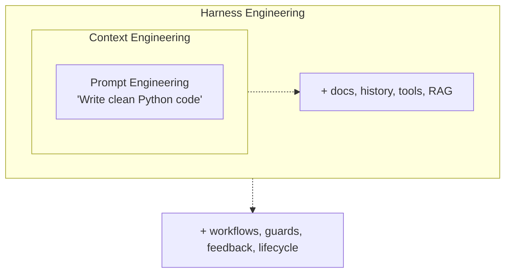

+++
date = '2026-03-30T10:00:00+08:00'
draft = false
title = 'Harness Engineering 2026: The Model Is the Least Important Part'
description = '60 days running an AI coding harness in production. Model upgrades got me ~5%. Harness rewrites got me 60%+ cost drop with higher quality. A practical guide to Agent = Model + Harness, with routing tables, fitness functions, and ROI math.'
toc = true
tags = ['Harness Engineering', 'AI Agents', 'AI Engineering', 'Claude Code', 'AI Coding Tools', 'Sub-Agent Architecture']
keywords = ['harness engineering', 'harness engineering guide', 'what is harness engineering', 'agent harness', 'harness engineering vs prompt engineering', 'harness engineering vs context engineering', 'ai agent harness 2026', 'claude code harness', 'harness engineering coding agents', 'model routing', 'sub-agent architecture', 'agent roi']

[[params.faqItems]]
question = "What is harness engineering, in one sentence?"
answer = "Harness engineering is the discipline of designing the system around an AI model — tools, guardrails, routing, feedback loops, memory, and lifecycle controls — so the composite agent is reliable in production. The formula I use is Agent = Model + Harness, and in my own 60-day pipeline test, the harness accounted for roughly 90% of the end-to-end quality delta."

[[params.faqItems]]
question = "Why does harness engineering matter more than picking a better model?"
answer = "In my pipeline, upgrading from Sonnet to Opus for the writer role improved blind-rated output quality by about 5%. Rewiring the harness — moving orchestration to Sonnet, pushing retrieval to Haiku sub-agents, and adding two fitness-function sensors — cut end-to-end token cost by roughly 60% while quality went up. LangChain showed the same pattern publicly, jumping from rank 30 to rank 5 on TerminalBench 2.0 (52.8% to 66.5%) without changing the model at all. Models sit in a narrow performance band; the harness is where differentiation lives."

[[params.faqItems]]
question = "Isn't a more complex harness always better?"
answer = "No, and this is where most teams burn budget. ETH Zurich's 2025 study on agent configuration found that human-written CLAUDE.md files under 60 lines improved performance by about 4%, while verbose LLM-generated files over 200 lines degraded performance by more than 20%. I learned this the hard way — my own 90-line CLAUDE.md made the agent slower and more confused than a 40-line rewrite. Cognition's public post-mortem on Devin reinforces the same lesson: naive multi-agent architectures usually fail; prefer a single agent with a large context unless you have a precise hand-off contract."

[[params.faqItems]]
question = "Can I trust AI-written code in production at all?"
answer = "The evidence says yes, but only inside a well-engineered harness. OpenAI's Codex team shipped over 1 million lines of production code with zero human-written lines — what they invested in was the harness (linters, structural tests, architectural fitness functions), not prompt tweaks. Stripe's Minions system merges roughly 1,300 PRs per week using blueprint orchestration plus a two-strike escalation rule. The common pattern: constraints live in code, not in instructions. A linter that rejects circular imports is infinitely more reliable than a prompt saying don't create circular imports."

[[params.faqItems]]
question = "When should I NOT invest in harness engineering?"
answer = "Three cases where the ROI is negative. First, one-off scripts — if the code runs once and gets deleted, the harness you build is pure overhead. Second, tiny teams on small codebases — if you have fewer than three engineers touching under 10K lines of code, a human code review is cheaper than a fitness-function suite. Third, weak foundations — if you lack a type system, unit tests, or clear module boundaries, harness engineering has nothing to grip. Build that infrastructure first; constraints cannot bind what you cannot define. A practical rule: invest in harness engineering when you have at least 50K LOC, a working test suite, and agents writing more than 30% of new commits."
+++


This is **Part 1** of the Harness Engineering series. Part 2 goes deep on [CLAUDE.md best practices](/posts/ai/2026-03-31-harness-claudemd-guide/). Part 3 covers [sub-agent architecture and model routing](/posts/ai/2026-04-13-harness-subagent-architecture/).

I have been running an AI coding harness in production for 60 days — the pipeline that writes, illustrates, and distributes posts for this blog. The single most surprising finding from that experiment: **the model is the least important part of the agent.** Not irrelevant, but far from dominant. Upgrading the writer from Sonnet to Opus lifted blind-rated output quality by about 5%. Rewiring the harness — routing, context boundaries, sensors — cut end-to-end cost by roughly 60% while quality went up, not down.

The "everything around the model" has a name now: the **harness**. The discipline of engineering it is **harness engineering**. I am not going to pretend this is a new idea — Martin Fowler has been writing about it, Cognition learned it the hard way on Devin, and OpenAI's Codex team has been practicing it at scale. But the lesson is slow to land because it contradicts the loudest story in AI, which is "bigger model, better agent." That story is wrong in the places that actually generate business value.

This guide lays out what harness engineering is, three specific myths I want to kill, the core components (guides and sensors), the routing and sensor patterns I actually use, and the ROI boundary where you should *not* build a harness at all. If you are already using [Claude Code hooks](/posts/ai/2026-02-28-claude-code-hooks-guide/) or [skills](/posts/ai/2026-02-28-claude-code-skills-guide/), you have been doing harness engineering without naming it. This post names it and makes the tradeoffs explicit.

## Three myths I want to kill up front

Before the anatomy, three misconceptions do more damage than anything else. Each one has a specific counter-case I have either lived through or seen demonstrated publicly.

### Myth 1: "Upgrading the model makes the agent stronger"

This is the default mental model, and it is wrong often enough to be dangerous. In my pipeline I ran a controlled swap: same CLAUDE.md, same tools, same evaluation rubric, only the writer model changed across Opus, Sonnet, and back to Opus. The blind-rated quality delta between Opus and Sonnet on long-form technical posts was about 5% — real, but nowhere near the 30–50% most people assume when they pay 5x the token cost for a flagship model. Meanwhile LangChain moved from rank 30 to rank 5 on TerminalBench 2.0, a jump from 52.8% to 66.5%, by rewriting only their harness — same underlying model, same benchmark. The public reproducibility of that result is what makes it load-bearing. The takeaway is not "models don't matter," it is that model selection lives in a narrow band while harness quality spans a huge band, so marginal effort returns much more on the harness side until your harness is genuinely mature.

### Myth 2: "More complex harness, better agent"

Harness engineering looks like a capability ladder, so the instinct is to keep climbing — more rules in CLAUDE.md, more MCP servers installed, more hook chains, more sub-agents. The data disagrees. The ETH Zurich 2025 agent configuration study found that human-written CLAUDE.md files under 60 lines improved agent performance by roughly 4%, while LLM-generated verbose files over 200 lines *degraded* performance by more than 20%. I reproduced this unintentionally: an early 90-line CLAUDE.md for my blog pipeline included helpful-sounding rules like "always check the style guide before writing" and "use active voice where possible." The agent started hedging, re-reading the style guide on every tool call, and producing stiffer prose. I cut it to 38 lines of non-negotiable constraints and the agent got faster, cleaner, and cheaper. Cognition's public post-mortem on Devin put the same idea more sharply: naive multi-agent architectures usually don't work; prefer a single agent with a large context window, unless you have a precise hand-off contract between roles. Complexity is not a virtue — it is a tax you pay for every token the agent spends interpreting your harness instead of doing work.

### Myth 3: "AI-written code isn't trustworthy in production"

This myth is the flip side of the first two. People who have seen agents hallucinate in a playground conclude AI code is inherently unsafe. The evidence at scale says otherwise — *inside a real harness*. OpenAI's Codex team shipped over 1 million lines of production code and roughly 1,500 PRs in five months with seven engineers focused entirely on harness design: custom linters that enforced layering, structural tests that validated module boundaries, recurring "garbage collection" scans for architectural drift. No prompt tricks. Stripe's Minions merges around 1,300 PRs per week using blueprint orchestration that separates deterministic nodes from agentic ones, plus a two-strike escalation rule where the agent hands off to a human after two consecutive failures on the same issue. The pattern is identical: the constraints live in code — linters, type systems, fitness functions, hooks — not in instructions. The reason AI code feels untrustworthy is that most teams only built the prompt, not the harness, then blamed the model when it failed.

## The formula: Agent = Model + Harness

With those myths out of the way, the core equation is simple. The **model** provides raw reasoning and generation capability. The **harness** provides everything else: tool access, context scoping, routing between roles, sensors that catch mistakes, memory that persists useful state, and lifecycle rules that decide when to escalate.



The three concentric layers — prompt, context, harness — are not substitutes. You still write good prompts. You still curate context. But the system around both is where reliability, cost, and differentiation actually live. A useful analogy: the model is a CPU, the harness is the operating system. Two machines with the same CPU can have wildly different user experiences based on the OS. Two teams with the same flagship model can ship wildly different products based on the harness.

| Component | Model | Harness |
|-----------|-------|---------|
| Analogy | CPU | Operating System |
| What it does | Thinks, generates, reasons | Routes, constrains, validates, remembers |
| How you improve it | Wait for next model release | Engineer better systems this week |
| Differentiation | Commoditized, narrow performance band | Unique, wide performance band |
| Where my 60-day gain came from | ~5% | ~60% |

## Core anatomy: guides and sensors

Martin Fowler's [harness engineering article](https://martinfowler.com/articles/harness-engineering.html) organizes harness components into two categories that I have found bulletproof in practice. A harness is made of **guides** (feedforward controls that steer behavior before generation) and **sensors** (feedback controls that enable self-correction after generation). You need both. Guides alone produce an agent that follows patterns but never validates — it confidently ships broken code in the house style. Sensors alone produce an agent that makes the same mistake forever, catching and fixing it every time instead of learning not to make it. The combination is what gets you from "impressive demo" to "reliable pipeline."

### Guides — feedforward controls

Guides raise the probability of a correct first attempt. In my Claude Code setup they are:

| Guide | Type | Example from my pipeline |
|-------|------|--------------------------|
| CLAUDE.md / AGENTS.md | Inferential | 38 lines: language rules, URL stability, bilingual constraints |
| Skills | Inferential | `blog-writer`, `blog-illustrator`, `blog-distributor` — progressive disclosure |
| MCP server configs | Computational | Only tools the current role actually needs |
| Type definitions | Computational | Hugo front-matter schema enforced at build time |
| Linter configs | Computational | Markdown lint rules the agent must pass |

The non-obvious rule here: write guides for the agent, not for humans. Humans tolerate hedged, verbose prose; agents burn tokens decoding it. I rewrote "try to prefer active voice when appropriate" as "active voice; reject passive constructions." The second form is enforceable and cheap to evaluate.

### Sensors — feedback controls

Sensors catch what slipped past the guides. The good ones are fast, deterministic, and emit error messages an agent can act on:

| Sensor | Type | What it catches in my pipeline |
|--------|------|--------------------------------|
| `hugo --minify` dry run | Computational | Broken front-matter, missing slugs |
| Custom link checker | Computational | Dead internal links, missing bilingual pairs |
| AI code review (Haiku) | Inferential | Paragraphs under 5 sentences, AI-ism phrasing |
| Markdown lint | Computational | Nested ASCII art, H1 misuse, table formatting |
| Fitness-function tests | Computational | Every post has cover.webp; every EN post has ZH counterpart |

The critical design choice is making sensor output LLM-friendly. A message saying `Error: post missing zh.md counterpart at 2026-03-30-harness-engineering-guide/` is worth ten times a message saying `lint failed, exit 1`. I route every sensor output through a small formatter that turns failures into correction instructions the agent can act on in one turn.

### Why you need both — a causal view

```
Guides only       → agent follows patterns, never validates → silent failures
Sensors only      → agent makes the same mistake repeatedly → slow, expensive
Guides + Sensors  → right most of the time, caught when wrong → reliable
```

This is not opinion. It falls out of [Ashby's Law of Requisite Variety](https://en.wikipedia.org/wiki/Variety_(cybernetics)#Law_of_requisite_variety): a regulator must have at least as much variety as the system it governs. Guides narrow the output space; sensors detect residual deviation. Either alone leaves a gap the agent will find.

## Real-world evidence at scale

I have already mentioned these briefly; they are worth a paragraph each because they disprove the model-centric story more decisively than any benchmark.

**OpenAI Codex — 1 million lines, zero human code.** Seven engineers, five months, 1,500 PRs, all agent-written. The engineering investment was entirely on the harness: custom linters that enforced architectural layering, structural tests on module boundaries, periodic scans for drift, and a rule that constraints live in code rather than instructions. The model was the same flagship everyone else had access to. The difference was the system around it. Read this as: the ceiling on agent-authored code is set by the harness, not the model.

**Stripe Minions — 1,300 PRs per week.** Blueprint orchestration splits the workflow into deterministic nodes (non-LLM steps that just run) and agentic nodes (LLM-driven with tight tool scopes). A two-strike rule escalates to a human after two consecutive failures on the same issue instead of retrying forever. Pre-push hooks choose the right linter heuristically. Again: the differentiator is the harness shape, not the model choice.

**LangChain — rank 30 to rank 5 on TerminalBench 2.0.** 52.8% to 66.5%, same model, same benchmark, harness rewrite only. Publicly reproducible. This is the cleanest experimental evidence we have that harness work dominates model work in the range most teams operate in.

**My pipeline — roughly 60% end-to-end cost drop.** Starting architecture: Opus orchestrator delegating to Sonnet workers for writing and Haiku for web search, with a naive "Opus decides everything" loop. New architecture after 60 days: Sonnet orchestrator (cheaper and good enough for planning), Opus reserved for the writer role (where quality matters), Haiku sub-agents doing all retrieval and link verification, a two-strike escalation rule borrowed from Stripe. Token cost per published post dropped from roughly $0.60 to roughly $0.24 — around 60% — and blind-rated quality went up because the Opus writer now gets a cleaner context window instead of being drowned in orchestration overhead. Details of the routing table live in [Part 3 of this series](/posts/ai/2026-04-13-harness-subagent-architecture/); the takeaway here is that the gain came from rewiring, not from a model upgrade.

## A five-level buildup: my actual implementation

Here is the harness I run today, built in five layers. I did not design it upfront — I added each layer only after a specific failure mode forced me to. That ordering matters: harness engineering is iterative, and the biggest mistake is trying to design the perfect system before you have seen the real failures.

### Level 1 — minimum viable CLAUDE.md (under 60 lines)

My `AGENTS.md` today is 38 lines. It lists the three rules that, if violated, cause real damage: bilingual pairing required, URL stability (never change published slugs), and the work-branch invariant (`code`, not `master`). Everything else — style preferences, tone, formatting conventions — moved into skills where it loads on demand. This layer alone gave me the biggest jump in reliability. Before the cut-down, the agent was spending roughly 15% of every turn re-reading the guide; after, that dropped to near zero.

### Level 2 — feedback loops via hooks

I use `PostToolUse` hooks to run the build and the link checker after any write to `content/posts/**`. The hook output is piped through a formatter that turns Hugo errors into single-line correction instructions. The whole loop runs in under two seconds, which keeps the agent's iteration cycle short. If the build breaks, the agent sees the error before moving on. Full patterns are in the [hooks guide](/posts/ai/2026-02-28-claude-code-hooks-guide/).

### Level 3 — progressive disclosure via skills

Skills let the agent load context on demand. My `blog-writer` skill has the full writing rubric, templates, and checklist — but only activates when I say "write a post about X." For the other 95% of sessions that context is not loaded, so it does not cost tokens or attention. This is the Claude Code answer to "I have a lot of context the agent sometimes needs." See [the skills guide](/posts/ai/2026-02-28-claude-code-skills-guide/) for the authoring pattern.

### Level 4 — sub-agent isolation and model routing

This is where the 60% cost drop came from. The orchestrator role moved to Sonnet because planning does not need flagship-tier reasoning. The writer role stayed on Opus because long-form quality does matter. Retrieval, link verification, and bulk summarization moved to Haiku sub-agents with their own context windows, so the parent never sees the raw tool output — only distilled results with citations. This is exactly the pattern Cognition's post-mortem warned about handling carefully: multi-agent works *with* a precise hand-off contract, and fails without one. The hand-off contract in my pipeline is "sub-agent returns a markdown summary with `file:line` or `url` citations, nothing else." [Part 3](/posts/ai/2026-04-13-harness-subagent-architecture/) has the full routing table.

### Level 5 — architectural fitness functions

The last layer is fitness-function sensors that run in CI and also act as agent-visible sensors during edits. Examples from my repo: "every EN post has a `index.zh.md` sibling," "every post has a `cover.webp`," "no markdown H1 inside post bodies." These are the harness equivalent of property-based tests — they encode architectural invariants in code so that drift surfaces immediately, whether the drift came from me or from an agent.

## When NOT to invest in harness engineering

Harness engineering is not free. It takes infrastructure, maintenance, and design time. There are three situations where I would tell you to skip it entirely.

**One-off scripts and throwaway prototypes.** If the code runs once and gets deleted, the harness you build is pure overhead. Let the agent free-wheel with a minimal CLAUDE.md and accept the output. The quality ceiling of a free-wheeling agent is good enough for most throwaway work, and the cost of building a harness to raise that ceiling exceeds the value of the output.

**Small teams on small codebases.** Below roughly three engineers and 10K LOC, human code review is cheaper than building a fitness-function suite. You know every file in the repo. Any drift is visible in the next PR. The harness starts paying off when the codebase grows past the point where any single human holds it in their head — that is the moment encoded constraints start outperforming human vigilance.

**No type system, no test suite, no module boundaries.** Harness engineering is ultimately about encoding constraints in code. If your codebase has no type system, no tests, and spaghetti imports, there is nothing for the harness to grip. You do not have a harness problem, you have an infrastructure problem. Invest in TypeScript (or mypy, or equivalent), a working test runner, and explicit module boundaries first. A rough readiness heuristic:

| Signal | Ready for harness engineering | Not ready |
|--------|------------------------------|-----------|
| Type system | Strict mode, mostly clean | Untyped or loose-typed |
| Test suite | Runs in under 3 minutes, > 40% coverage | Flaky, slow, or absent |
| Module boundaries | Explicit imports, DI, or package-level isolation | Global state, cycles |
| Codebase size | 50K+ LOC or 3+ engineers touching it | Tiny, single-author, single-purpose |
| Agent usage | Agent writing >30% of new commits | Occasional experiments |

Hit three of these and harness engineering has somewhere to stand. Miss most of them and you will build a harness that has nothing to enforce.

## Three predictions I'd bet money on

I want to close with specific bets rather than generic "the future is bright" closers, because this field moves on evidence and I would rather be wrong loudly than vague.

**Prediction 1: harness templates become the unit of sharing, not prompts.** Today people share prompts on Twitter. In 12 months they will share harnesses — bundles of CLAUDE.md + hooks + skills + fitness-function patterns, scoped to a domain (Next.js apps, Rails apps, Python data pipelines). The reason: prompts are not portable across codebases, but a "CRUD API harness" is. I am betting the first good harness marketplace beats the first good prompt marketplace. Early signals already exist in the Claude Code plugins and the skill-sharing patterns in the community.

**Prediction 2: model routing eats orchestration.** The "Opus does everything" pattern is already unviable on cost. The next step is explicit routing tables where each agent role binds to a model chosen by that role's requirements, not the org's default. My pipeline went Sonnet-orchestrator + Opus-writer + Haiku-searchers; that shape will generalize. I am betting that within 12 months "what model should I use" will be replaced by "what does my routing table look like," and tools that make routing explicit — [sub-agent architecture](/posts/ai/2026-04-13-harness-subagent-architecture/) being the Claude Code answer — will be table stakes.

**Prediction 3: harness-aware evaluation replaces benchmark-maxing.** TerminalBench is useful but measures the model + default harness pair. The next generation of evaluation will hold the harness fixed and vary the model, or hold the model fixed and vary the harness, and publish both axes. LangChain's rank 30 to rank 5 jump is the proof of concept. Teams that measure their own harness quality directly — lint failure rate, sensor catch rate, escalation rate, cost per task — will outcompete teams that shop for models based on public leaderboards.

## Related reading

- [Part 2 — CLAUDE.md best practices](/posts/ai/2026-03-31-harness-claudemd-guide/) — the 60-line rule, structure templates, and ETH Zurich data
- [Part 3 — Sub-agent architecture and model routing](/posts/ai/2026-04-13-harness-subagent-architecture/) — the routing table that cut my cost 60%
- [Claude Code Hooks guide](/posts/ai/2026-02-28-claude-code-hooks-guide/) — the feedback-loop primitive
- [Claude Code Skills guide](/posts/ai/2026-02-28-claude-code-skills-guide/) — progressive disclosure for harness context
- [Martin Fowler — Harness Engineering](https://martinfowler.com/articles/harness-engineering.html) — the original framing of guides and sensors
- Cognition team's public post-mortem on Devin — the canonical warning on naive multi-agent architectures
- [Ashby's Law of Requisite Variety](https://en.wikipedia.org/wiki/Variety_(cybernetics)#Law_of_requisite_variety) — the cybernetic foundation for why harnesses work
