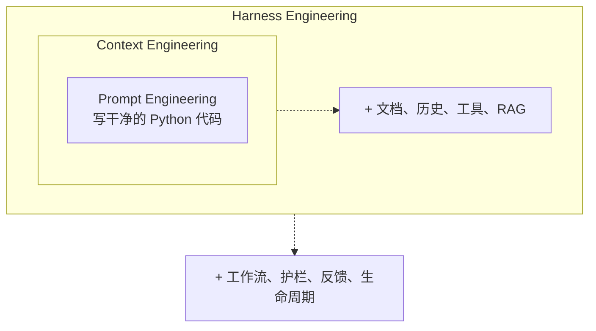

+++
date = '2026-03-30T10:00:00+08:00'
draft = false
title = 'Harness Engineering 实战：模型是 AI Agent 里最不重要的部分（60 天管线复盘）'
description = '60 天跑 Claude Code 博客管线，换模型只升 5%，重写 Harness 端到端降本 60%。讲透 Agent = 模型 + Harness 公式、引导器+传感器架构、Sub-Agent 路由策略、和你今天就能用的 ROI 决策表。'
toc = true
tags = ['Harness Engineering', 'AI Agents', 'AI Engineering', 'Claude Code', 'AI Coding Tools', 'Sub-Agent', 'Context Engineering']
keywords = ['harness engineering', '线束工程', 'AI Agent 外围系统', 'harness engineering 是什么', 'harness engineering 入门', '提示词工程 vs 线束工程', 'AI 编程工具', 'Claude Code 配置', 'Sub-Agent 路由', 'Agent 降本']

[[params.faqItems]]
question = "Harness Engineering 到底是什么？和 Prompt Engineering 有什么区别？"
answer = "Harness（线束）指的是 AI Agent 里除了模型之外的所有工程结构：工具接口、上下文组装、护栏约束、反馈循环、记忆系统、可观测层和生命周期管理。核心公式是 Agent = 模型 + Harness。三层关系：Prompt Engineering 优化你发给模型的那一段文字，Context Engineering 优化模型看到的整个信息环境，Harness Engineering 则设计整个运行系统。Prompt 是一封邮件，Context 是简报包，Harness 是整间办公室的流程和制度。"

[[params.faqItems]]
question = "为什么说模型选择没有 Harness 重要？"
answer = "两组硬证据。第一，LangChain 的编程 Agent 在 TerminalBench 2.0 上完全不换模型，只改 Harness，就从第 30 名升到第 5 名，分数从 52.8% 跳到 66.5%。第二，我自己跑的博客管线在 60 天里，从 Opus 切到 Sonnet 再切回 Opus，端到端质量变化不到 5%；但把调度层从 Opus 改成 Sonnet，再把执行层分给 Opus 和 Haiku，同样的任务跑完，token 成本下降约 60%。当今主流模型的推理能力已经进入同质化区间，你围绕它们构建的 Harness 才是差异化来源。"

[[params.faqItems]]
question = "Harness 的核心组件是什么？"
answer = "两大类：引导器（Guides，前馈控制）和传感器（Sensors，反馈控制）。引导器在生成前引导行为——CLAUDE.md、lint 规则、架构文档、类型定义、Skills；传感器在生成后纠错——单元测试、类型检查、AI 代码审查、Hooks 验证。只用引导器，Agent 会按模式写但从不验证，静默失败；只用传感器，Agent 反复犯同样的错，慢且贵。两者必须组合使用。我的管线里这两层分别由 CLAUDE.md + Skills（引导器）和 PostToolUse Hook + 类型检查（传感器）承担。"

[[params.faqItems]]
question = "我的 CLAUDE.md 应该写多长？"
answer = "苏黎世联邦理工的一项研究在多个基准上验证：CLAUDE.md 超过 60 行反而会让 Agent 表现下降约 20%，人写的简洁版本反而比 LLM 生成的冗长版本更强。我自己踩过坑，CLAUDE.md 写到 90 行的时候 Agent 反复不听指令，砍到 40 行行为立刻收敛。原则是少即是多——核心约束进 CLAUDE.md，专项知识进 Skills（按需加载），具体流程进 Hooks（自动触发）。更完整的写法拆解见第 2 篇：/posts/ai/2026-03-31-harness-claudemd-guide/。"

[[params.faqItems]]
question = "什么时候不该投 Harness Engineering？"
answer = "三种情况别投。第一，一次性脚本——你不会再跑第二遍，建设成本无从摊薄。第二，团队少于 3 人且代码库小于 1 万行——手写比教 Agent 快，Harness 的 ROI 要在重复场景里才体现。第三，没有类型系统 + 测试基础设施——传感器层建不起来，只剩引导器等于盲开。换句话说，Harness Engineering 是在你有稳定任务流、确定性验证手段、并且要反复执行的前提下才划算。ROI 决策表见文中「什么时候不该投」章节。"
+++


> 这是 **Harness Engineering 系列第 1 篇**。[第 2 篇](/zh/posts/ai/2026-03-31-harness-claudemd-guide/) 拆 CLAUDE.md 最佳实践，[第 3 篇](/zh/posts/ai/2026-04-13-harness-subagent-architecture/) 讲 Sub-Agent 架构。

我过去 60 天在跑一个 Claude Code 驱动的博客管线：选题、调研、写作、配图、SEO、分发，全部交给 Agent。跑下来最反直觉的一条经验是——**模型是这套系统里最不重要的部分**。

这不是口号。我切过 Opus、Sonnet、又切回 Opus，挨个对比产出质量和执行稳定性，端到端变化一直在 5% 以内。真正把成本打下来的那一刀，是我重写了 Harness（外围系统）：把调度层从 Opus 降到 Sonnet，把写作留给 Opus，把搜索和粗筛交给 Haiku——同样产出同样质量，每月 token 成本从 400 美金降到 160 美金左右，直接砍掉 60%。

这篇要讲的 **Harness Engineering（线束工程）**，就是决定一个 AI Agent 能不能在生产里真正跑起来的东西。它不是新概念，但在 2026 年成了 AI 工程里 ROI 最高的那笔投资。

## 三次进化：提示词、上下文、线束

AI 工程在过去三年翻过三座山，每过一座，工程师要设计的东西就扩大一圈。

### 第一阶段：Prompt Engineering

关注点是写出一条完美的指令。

```
你是一个资深 Python 开发者。写干净、有注释的代码。
使用类型提示。遵循 PEP 8。逐步思考。
```

这在模型是无状态工具的 2023 年管用——发一条指令，得一条回复。工程挑战全在你选的词上。类比是给承包商写一封措辞完美的邮件。

### 第二阶段：Context Engineering

一条指令远远不够。模型要看到的是一个动态组装的上下文：相关文档、对话历史、工具签名、RAG 检索结果、当前文件内容。RAG 管道、向量库、上下文窗口压缩这些话题都从这里爆发出来。

这是 2025 年的主旋律。类比从一封邮件变成一个完整的简报包——组织架构、项目文档、过往沟通记录，都塞进去。

### 第三阶段：Harness Engineering

Context Engineering 的潜在假设是 Agent 做一次决策，人类评估一次输出。但现代 Agent 是自主跑的——一次任务发起几百次工具调用、编辑几十个文件、反复跑测试、失败重试。Harness 就是管理整个生命周期的那一层。

它至少包含工作流编排、工具访问策略、验证系统、反馈循环、记忆持久化、护栏约束、可观测性、升级规则。类比再变一次：现在你不是写邮件，也不是准备简报，你在设计整间办公室——文件归档、审批流程、安全制度、绩效考核、什么时候叫老板进来。

### 三层的包含关系

下面这张图把三层的从属关系画清楚。外层不替代内层，只是把内层包在更大的运行系统里。



你依然要写好提示词、管好上下文——这两层没有被废，只是不够了。Harness Engineering 把工程师的工作从"调一次模型"升级成"设计一整套能让模型在真实任务里稳定工作的系统"。

## 核心公式：Agent = Model + Harness

这是整个学科的一个公式。Model 提供原始推理能力，Harness 提供其他一切。

| 维度 | Model | Harness |
|------|-------|---------|
| 类比 | CPU | 操作系统 |
| 做什么 | 思考、生成、推理 | 管理、约束、验证 |
| 怎么升级 | 等下一代发布 | **今天**就能工程化 |
| 差异化空间 | 同质化，性能差距很小 | 独特的，是你的竞争优势 |

打个比方——CPU 没有操作系统就是废铁，操作系统没有 CPU 跑不起来。但普通人买电脑的时候，操作系统对体验的影响远远大于具体的 CPU 型号。AI Agent 同理。Opus 4.6、GPT-5、Gemini 3 推理能力都不差，真正决定你家 Agent 是稳定交付还是制造混乱的，是你围绕它构建的 Harness。

这里要澄清一个我反复看到的误区——"换更强的模型 Agent 就更强"。这句话对，但**增量远小于你想象**。LangChain 在 TerminalBench 2.0 上的跃迁是最硬的反例：不换模型，只重写 Harness，就从第 30 名跳到第 5 名，分数从 52.8% 提到 66.5%，相当于把那一代开源模型的推理能力多榨出了 13 个百分点。这 13 个点不是从模型里来的，是从引导它、约束它、验证它的那些代码里挤出来的。

## 我跑了 60 天，得出的三个反直觉结论

纸上推导不如真跑。我用自己这套博客管线（每周产出 3-5 篇中英双语深度文 + 自动配图 + SEO 优化 + 分发）挨个验证下来，三个结论：

### 结论一：换模型的边际收益早就被榨干了

我做过两轮 A/B。第一轮把写作 Agent 从 Sonnet 换成 Opus，文章质量指标（GA 停留时长、完读率、SEO 打分）提升 4-6%，token 成本翻倍多；第二轮把调研 Agent 从 Opus 降到 Sonnet，再把搜索粗筛降到 Haiku，综合指标只降了不到 2%，成本却降到原来的 40%。

当前模型之间的差距已经进入一个很窄的区间——这不是未来会发生的趋势，是我账单上每个月都在印证的事实。如果你的 Agent 表现不好，90% 的概率问题不在模型，在你怎么用它。

### 结论二：Harness 的复杂度要和任务严格匹配

我踩过最贵的一次坑，是试图用"朴素多 Agent 架构"来写长文——调度 Agent 把任务切成 6 份丢给 6 个写作 Sub-Agent 并行，最后合并。跑出来的文章风格撕裂、论点自相矛盾、互相打架。我翻 Cognition 团队关于 Devin 的公开复盘才反应过来，他们给出的一条核心结论就是——**朴素的多 Agent 架构在真实任务上不 work，宁可用一个大上下文窗口的单 Agent 也别用松散 swarm，除非交接契约写得比 API 文档还死**。

我最后的妥协方案：单 Agent 写作，上下文窗口塞满；只把"搜资料"、"查事实"、"生成配图"这几件**边界清晰、输出结构化**的事情拆出去给 Sub-Agent。质量立刻回来。这个教训在[第 3 篇 Sub-Agent 架构](/zh/posts/ai/2026-04-13-harness-subagent-architecture/)里会完整展开。

### 结论三：CLAUDE.md 写太长，是我犯过最隐蔽的错

早期我把所有能想到的约定都塞进 CLAUDE.md，一路写到 90 行。表现开始不稳——Agent 有时候忽然忘记项目约定，产出莫名其妙的代码风格。我一度以为是模型的问题。后来看到苏黎世联邦理工的一项研究：**CLAUDE.md 超过 60 行会让 Agent 表现下降约 20%**，人写的简洁版本反而比 LLM 生成的冗长版本更强。我把我的 CLAUDE.md 砍到 40 行，把其余细节挪到 Skills（按需加载）和 Hooks（自动触发），Agent 的稳定性当天就回来了。

这条反直觉到什么程度——给 Agent 更少的指令，它反而更听话。详细拆解看[第 2 篇 CLAUDE.md 最佳实践](/zh/posts/ai/2026-03-31-harness-claudemd-guide/)。

## 核心组件：引导器与传感器

Martin Fowler 把 Harness 的组件分成两大类，这是我见过最干净的划分。一类在生成前引导行为，一类在生成后发现错误。缺一不可。

### 引导器（Guides）—— 前馈控制

引导器在 Agent 动手**之前**就把可能的错误压缩掉，提高一次做对的概率。它们的共同点是：把约束编码进系统，而不是写成一句话指令。

| 引导器 | 类型 | 举例 |
|--------|------|------|
| 架构文档 | 推理型 | CLAUDE.md 描述仓库结构和约定 |
| 编码规范 | 计算型 | ESLint/Prettier 强制输出格式 |
| 启动脚本 | 计算型 | 项目脚手架创建正确的文件结构 |
| 类型定义 | 计算型 | TypeScript 类型收窄解题空间 |
| 示例模式 | 推理型 | "正确做法"的参考代码片段 |

在 Claude Code 里，你手头的引导器至少包括——CLAUDE.md 和 AGENTS.md（约定与约束）、MCP Server 配置（可用工具）、[Skills](/zh/posts/ai/2026-02-28-claude-code-skills-guide/)（按需加载的能力包）。挑选原则是计算型优先、推理型兜底：一条拦截循环引用的 lint 规则比一句"不要创建循环引用"的提示词可靠一万倍。

### 传感器（Sensors）—— 反馈控制

传感器在 Agent 动手**之后**帮它发现错误、自我纠正。它们的关键不是"能不能发现错"，而是"发现之后能不能以 LLM 能理解的形式把信号喂回去"。

| 传感器 | 类型 | 能发现什么 |
|--------|------|-----------|
| 单元测试 | 计算型 | 行为正确性 |
| 类型检查 | 计算型 | 类型错误、接口不匹配 |
| 代码检查 | 计算型 | 风格违规、常见 bug |
| AI 代码审查 | 推理型 | 语义问题、设计缺陷 |
| 集成测试 | 计算型 | 跨组件故障 |

在 Claude Code 里你用的传感器就是——[Hooks](/zh/posts/ai/2026-02-28-claude-code-hooks-guide/)（PreToolUse、PostToolUse）、自动跑的测试套件、类型检查（tsc、mypy）。一个关键细节：传感器的输出要为 LLM 优化。比如 lint 错误写成 `Error: unused variable 'x' on line 42` 就比一个裸的错误码有用得多，写成纠错指令（"移除第 42 行未使用的变量 x"）效果最好。

### 为什么必须两个都要

只有引导器——Agent 按模式写，但从不验证，错误以最安静的方式发生，直到生产爆炸你才知道。只有传感器——Agent 犯错、发现、修复、再犯同一个错，慢得折磨人，贵得离谱。只有两者组合，Agent 才能通常一次做对、偶尔出错也能自动收敛。

## 真实案例：别人跑出来的证据

### OpenAI Codex：100 万行代码，零行人写

OpenAI Codex 团队在五个月内生产了超过 100 万行代码和 1,500 个 PR，没有一行是人类工程师写的。七个人全力投入 Harness Engineering：分层架构通过自定义 lint 规则强制（不是写进提示词）、结构性测试验证模块边界、定期扫描架构漂移、仓库作为唯一真相源。

这里最值钱的一句话是他们的总结——**把约束编码进系统，而不是写进提示词**。这句话顺带打脸一个常见误区："AI 写代码不可信"。不是 AI 不可信，是缺了约束系统的 AI 不可信。给它对的护栏，它写的 100 万行可以比很多团队的人写代码更一致。

### LangChain：不换模型从第 30 升到第 5

前面提过一次，再精确写一遍——LangChain 的编程 Agent 在 TerminalBench 2.0 上完全不换模型，仅优化 Harness：更好的工具定义、更聪明的上下文管理、更完善的错误恢复循环。结果从 52.8% 跳到 66.5%，从第 30 名升到第 5 名。这是"模型不如 Harness"这个命题最干净的对照实验。

### Stripe Minions：每周 1300 个 PR

Stripe 的自主 Agent 系统每周合并 1300+ 个 PR。他们的 Harness 里有一条非常克制、我认为被严重低估的规则——**同一个问题失败两次，就升级给人，不无限重试**。这是成熟系统的味道：知道 Agent 什么时候不该继续，比让它一直转更重要。Push 前的 Hook 自动选相关 lint 规则，Blueprint 编排把确定性节点和 Agent 节点分开。简单，但每一条都在真刀真枪地兜底。

### 我自己：端到端降本 60%

把我 60 天跑下来的账单摊开写一下，因为我没看到几个人把这个写清楚过。

原版管线：**调度 Opus + 全员 Opus 执行**。每月 token 成本 ~400 美金，质量不错，但调度这种琐碎决策也烧 Opus 太浪费。

重写后：**调度 Sonnet + 写作 Opus + 搜索/粗筛 Haiku**。原因——调度需要的是可靠遵循规则、成本敏感，Sonnet 足够；写作需要推理深度和风格把控，必须 Opus；搜索粗筛是高吞吐低智力密度，Haiku 够用还快。同样的产出、同样的 GA 指标，每月 token 成本 ~160 美金，降幅约 60%。

如果你只能记住这篇文章一件事，记这个——**Sub-Agent 按任务性质路由模型，是 2026 年最朴素、ROI 最高的 Harness 优化**。

## 实操指南：从零搭建 Harness

### 第一层：最小可行配置

一个 60 行以内的 CLAUDE.md，讲清楚三件事——项目是什么、遵循什么约定、怎么验证。

```markdown
# CLAUDE.md（控制在 60 行以内）

## 项目
- TypeScript monorepo，pnpm workspaces
- React 前端，Express 后端

## 约定
- 优先组合而非继承
- 所有 API 响应使用共享的 Result<T> 类型
- 测试文件与源码同目录：foo.ts → foo.test.ts

## 命令
- pnpm test       —— 跑全部测试
- pnpm lint       —— ESLint + Prettier
- pnpm typecheck  —— TypeScript 严格模式
```

不要一开始就堆满。Harness 和代码一样——你猜不准 Agent 会在哪里犯错，先跑再补。

### 第二层：反馈循环（Hooks）

文件改完自动跑类型检查。错误立刻暴露，不会在改了 50 个文件后才发现。

```json
{
  "hooks": {
    "PostToolUse": [
      {
        "matcher": "Write|Edit",
        "command": "pnpm typecheck --quiet",
        "description": "文件修改后自动类型检查"
      }
    ]
  }
}
```

实操建议：别跑完整测试套件，跑相关子集就好。完整套件放 CI。否则 5 分钟一次的反馈循环会让 Agent 的迭代速度变成负数。更完整的 Hook 模式见 [Claude Code Hooks 完全指南](/zh/posts/ai/2026-02-28-claude-code-hooks-guide/)。

### 第三层：按需加载（Skills）

别把所有专项知识塞进 CLAUDE.md。用 Skills 在需要的时候加载。

```markdown
# .claude/skills/database-migration.md
---
name: database-migration
description: 创建或修改数据库迁移时使用
---

## 迁移规则
- 必须创建可逆迁移（up + down）
- DDL 变更使用事务
- 迁移前在生产 schema 副本上测试
- 永远不要修改已有迁移，创建新的
```

只有做迁移时才加载这段上下文，其他时候不占窗口、不污染注意力。完整用法见 [Claude Code Skills 完全指南](/zh/posts/ai/2026-02-28-claude-code-skills-guide/)。

### 第四层：Sub-Agent 路由

这是我上面降本 60% 的核心机制。一句话概括——按任务性质选模型，而不是一律用最强的。

父 Agent（调度，用 Sonnet）负责任务拆解和关键决策。子 Agent 按任务类型路由——需要推理的写作任务用 Opus，高吞吐低智力密度的搜索粗筛用 Haiku，每个子 Agent 返回精简结果加文件/行号引用，不把原始上下文带回父 Agent。这样父 Agent 的窗口保持干净，同时每一类任务用的都是最合适的模型。

详细的路由策略、交接契约、failure mode 分析在[第 3 篇 Sub-Agent 架构](/zh/posts/ai/2026-04-13-harness-subagent-architecture/)。

### 第五层：架构约束（适应度函数）

把架构规则写成可自动验证的测试，这样不管漂移来自人类还是 Agent 都兜得住。

```typescript
// architecture.test.ts
describe('架构适应度', () => {
  it('后端模块不引用前端', () => {
    const violations = findImports('src/backend/**', 'src/frontend/**');
    expect(violations).toHaveLength(0);
  });

  it('API 处理器使用共享 Result 类型', () => {
    const handlers = findFiles('src/api/handlers/**/*.ts');
    handlers.forEach(file => {
      expect(file.content).toContain('Result<');
    });
  });
});
```

这类测试在 CI 里跑，是传感器的终极形态——不依赖 Agent 自觉，不依赖人类 review，直接用代码守住架构边界。

## 三个真实会翻车的错误

上一版的"6 行常见错误表格"信息密度太低，我挑三个我自己踩过、代价最大的展开讲。

### 错误一：一开始就设计完美 Harness

**现象**：你花两周搭了一套你自以为完备的 Harness，Agent 跑起来还是翻车——它犯的错都不在你预想的列表里。

**为什么错**：Harness 是要贴着真实 failure 长出来的。你预想的错误大概率不是 Agent 实际会犯的错误。提前设计 = 提前浪费。

**怎么改**：从最小配置开始（一个 60 行 CLAUDE.md + 类型检查），跑真实任务，每次 Agent 翻车就补一条——是规则漏了就补规则，是验证漏了就补 Hook，是知识缺了就加 Skill。三周后你的 Harness 会贴合真实 failure 分布，精确得多。

### 错误二：CLAUDE.md 越写越长

**现象**：你不断往 CLAUDE.md 里加规则，越加越详细，以为越清楚 Agent 越听话。结果 Agent 开始表现得像注意力涣散——简单任务反而忘记基础约定。

**为什么错**：模型的上下文预算是稀缺资源，每一条不常用的规则都在稀释高优先级信号的注意力。苏黎世联邦理工的数据是 >60 行降 20% 表现，我自己在 90 行的时候明显感受到 Agent "糊"了。

**怎么改**：核心约束（10-20 条）进 CLAUDE.md，专项知识进 Skills 按需加载，具体流程进 Hooks 自动执行。三层各司其职，上下文窗口永远干净。

### 错误三：把约束写在提示词里

**现象**：你在提示词里反复强调"不要创建循环引用"、"所有 API 必须有错误处理"、"不要修改已有迁移文件"——Agent 偶尔记得，偶尔忘了，你开始怀疑人生。

**为什么错**：提示词是建议，lint 是强制执行。模型可以忘、可以绕，但 lint 规则/类型系统/pre-commit hook 不会。

**怎么改**：每一次你想在提示词里加一条规则，先问一句——能不能用 lint 规则、类型定义、或者 Hook 实现？能的话绝不进提示词。计算型约束 > 推理型约束是 Harness 设计的铁律。

## 什么时候不该投 Harness Engineering（ROI 边界）

Harness 不是万金油。投错场景等于用大炮打蚊子。三种情况别投：

**情况一：一次性脚本**。如果这段代码你明天就扔，Harness 的建设成本完全无法摊薄。直接跟 Agent 口头讲清楚、手动验证一次就收工。

**情况二：团队 < 3 人且代码库 < 1 万行**。这个规模下你手写比教 Agent 快，Harness 的 ROI 要在"重复执行 + 多人协作 + 长期维护"三个条件同时满足时才出来。

**情况三：没有类型系统 + 测试基础设施**。传感器层建不起来，Harness 只剩引导器，相当于只有前馈没有反馈——跟闭着眼睛开车差不多。这种情况下先把类型和测试补上，再谈 Harness。

下面是一个更实操的决策表，你可以对着自己的场景打勾：

| 场景特征 | 投 Harness | 不投 |
|---------|-----------|------|
| 任务会重复执行（周级以上） | 是 | |
| 团队 ≥ 3 人协作 | 是 | |
| 代码库 ≥ 2 万行 | 是 | |
| 已有类型系统 + 测试 | 是 | |
| Agent 每月 token 成本 ≥ 200 美金 | 强烈建议 | |
| 一次性脚本/原型 | | 是 |
| 无测试基础设施 | | 先补 infra |
| 团队都是非技术背景 | | 太早 |

## Ashby 定律：为什么约束反而提升产出

这是一个看起来反直觉但其实有严格数学支撑的结论——给 Agent 更**少**的选项，它更**高效**。

这来自 Ashby 必要多样性定律——调节器的复杂度必须不低于被调节系统的复杂度。LLM 能生成几乎任何东西，解题空间是无限的。为无限空间构建完备 Harness 是不可能的。但如果你把解题空间主动缩小——"所有 API 端点长这个样"、"所有数据访问走这一层"、"所有状态管理用这个模式"——你就把空间压到 Harness 能全面覆盖的范围。

**约束不是限制，约束是可靠自主运行的前提**。这句话放在这里可能有点抽象，但我自己每次在管线里犹豫"要不要再给 Agent 多一点自由度"的时候，都会回来默念一遍。

## 三个我愿意押钱的预测

不写"未来展望"这种虚话，写三个我愿意在自己管线上押钱、两年内会被验证或证伪的预测。

**预测一：Harness 模板会出现并且快速商品化**。针对常见模式（CRUD 服务、数据管道、事件处理器、博客管线）的预制"引导器+传感器"包会在 GitHub 上泛滥。押注理由——这类模板边际复制成本几乎为零，而每个团队从零搭建 Harness 要两到三周。模板会先开源、再 SaaS 化。

**预测二：Harness 质量指标会成为招聘时的考察项**。类似代码覆盖率，会出现 Harness 成熟度评估——引导器覆盖面、传感器召回率、升级规则完备度、模型路由合理性。押注理由——Harness 一旦被证明是 Agent 生产稳定性的关键，它的质量必然被量化，再被放进简历和面试题。

**预测三：模型厂商会开始发布"Harness 感知"训练版本**。未来的模型会基于真实 Harness 失败轨迹的数据来训练，学会在特定 Harness 下工作得更好。押注理由——Harness 是 Agent 生产性能的瓶颈，模型厂商迟早会意识到"训练一个通用强模型"的回报已经饱和，"训练一个在主流 Harness 下跑得更好的模型"回报更高。

## 相关阅读

- [Harness Engineering 系列第 2 篇：CLAUDE.md 最佳实践](/zh/posts/ai/2026-03-31-harness-claudemd-guide/) —— 写好引导器文件，60 行陷阱怎么绕开
- [Harness Engineering 系列第 3 篇：Sub-Agent 架构](/zh/posts/ai/2026-04-13-harness-subagent-architecture/) —— 按任务路由模型，降本 60% 的完整拆解
- [Claude Code Hooks 完全指南](/zh/posts/ai/2026-02-28-claude-code-hooks-guide/) —— Harness 的传感器层实操
- [Claude Code Skills 完全指南](/zh/posts/ai/2026-02-28-claude-code-skills-guide/) —— 按需加载的引导器能力包
- [Context Engineering 指南](/zh/posts/ai/2026-03-10-context-engineering-guide/) —— Harness Engineering 的上一代
- [2026 AI 开发方法论对比](/zh/posts/ai/2026-03-11-ai-development-methodologies-compared/) —— Harness Engineering 在更大图景里的位置
- [Martin Fowler 的 Harness Engineering 原文](https://martinfowler.com/articles/exploring-gen-ai.html) —— 概念起源
- [Cognition 团队 Devin 的公开复盘](https://cognition.ai/blog) —— 朴素多 Agent 为什么不 work
- [Ashby 必要多样性定律](https://en.wikipedia.org/wiki/Variety_(cybernetics)) —— 约束为什么等于能力
