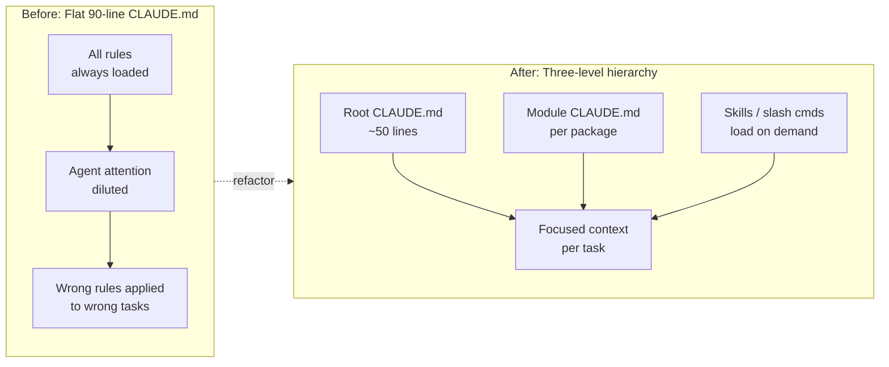

+++
date = '2026-03-31T10:00:00+08:00'
draft = false
title = 'Harness Engineering #2: The 60-Line CLAUDE.md Rule (and Why My 90-Line File Failed)'
description = 'I shipped a 90-line CLAUDE.md and watched my agent get dumber. The ETH Zurich study explains why: LLM-generated files drop success by 20%, human-written files under 60 lines add 4%. Here is the audit, the layering, and the template I use today.'
toc = true
tags = ['Harness Engineering', 'Claude Code', 'CLAUDE.md', 'AI Agents', 'AI Engineering', 'Context Engineering']
keywords = ['CLAUDE.md best practices', 'how to write CLAUDE.md', 'CLAUDE.md guide 2026', 'harness engineering CLAUDE.md', 'CLAUDE.md vs AGENTS.md', 'CLAUDE.md anti-patterns', 'CLAUDE.md template', 'ETH Zurich CLAUDE.md study', 'CLAUDE.md audit', 'CLAUDE.md 60 lines', 'layered CLAUDE.md', 'CLAUDE.md too long']

[[params.faqItems]]
question = "How long should a CLAUDE.md file be?"
answer = "Keep the root CLAUDE.md under 60 lines. The ETH Zurich study on LLM instruction files found human-written files below that threshold added roughly 4% to success rate, while LLM-generated verbose files (200+ lines) dropped success by about 20% and burned 14-22% more reasoning tokens. The rule I apply to my own repo: every line must prevent a specific mistake the agent has actually made. If pulling a line would not cause a real regression, cut it."

[[params.faqItems]]
question = "Should I let Claude generate CLAUDE.md for me?"
answer = "No. The same ETH Zurich research tested 138 agentfiles and found LLM-generated context files consistently reduced agent performance. They read smooth but they drown the attention window in generic advice like 'write clean code' or 'follow best practices' — things the model already does by default. Write it by hand, from observed failures. Every time you correct the agent twice in a week, that correction earns a line in CLAUDE.md."

[[params.faqItems]]
question = "What is the difference between CLAUDE.md and AGENTS.md?"
answer = "CLAUDE.md is Anthropic's native file for Claude Code and supports hierarchical merging, @import syntax, and user-level overrides at ~/.claude/CLAUDE.md. AGENTS.md is an open standard now adopted by 60,000+ repos and read by Codex, Cursor, and Copilot. My rule: if the team uses only Claude Code, put everything in CLAUDE.md; if you mix tools, put shared conventions in AGENTS.md and let CLAUDE.md be a one-line pointer (see @AGENTS.md) plus any Claude-specific rules."

[[params.faqItems]]
question = "My CLAUDE.md is already 120 lines. What do I cut?"
answer = "Do not cut — split. A long root file is almost always carrying three different kinds of content: project conventions (belongs in root), domain rules (belongs in module-level CLAUDE.md or Skills), and situational guidance (belongs in feature-level memory or slash commands). I hit this wall myself at 90 lines; the fix was a three-level hierarchy: root for universal rules, packages/*/CLAUDE.md for module rules, and .claude/skills/ for anything that loads on demand."

[[params.faqItems]]
question = "How do I know if my CLAUDE.md is actually working?"
answer = "Track three signals across a week of sessions: first-attempt correctness (did the agent get it right without a 'no, do it this way' nudge?), repeated corrections (are you saying the same thing twice?), and exploratory tool calls (does the agent run find/grep for information you should have put in the file?). Repeated corrections are the loudest signal — each one is a missing line. Exploratory tool calls that keep discovering the same fact mean your orientation section is too thin."
+++


This is **Part 2** of the Harness Engineering series. [Part 1](/posts/ai/2026-03-30-harness-engineering-guide/) framed the core identity: `Agent = Model + Harness`. [Part 3](/posts/ai/2026-04-13-harness-subagent-architecture/) goes deep on sub-agent architecture. This piece sits between them, on the single highest-ROI file you will ever write for a coding agent — and the one most teams write wrong.

I have read a lot of `CLAUDE.md` files on GitHub over the past three months. Most of them fail the same three ways: they are too long, they were generated by an LLM, and they live in a single flat file when the project has outgrown that shape. I know all three failure modes intimately because I shipped all three in my own repo. This guide is what I wish someone had handed me before I spent a weekend debugging why my agent had gotten dumber.

## The three mistakes almost every team makes

The first mistake is treating `CLAUDE.md` like documentation. Documentation is for humans and rewards completeness. `CLAUDE.md` is a constraint injection file and rewards ruthless compression. Every line in it competes with the actual task for attention weight inside the model's context window, which means a 300-line file is not "more helpful" — it is actively draining the reasoning budget the agent needs to solve your problem. This is the distinction Martin Fowler hammers on in his [harness article](https://martinfowler.com/articles/exploring-gen-ai.html): the harness is not the place to explain your system, it is the place to narrow the agent's behavior. If you want a reference doc, write a README. If you want fewer mistakes, write constraints.

The second mistake is asking an LLM to write the file. This feels natural — you are configuring an LLM agent, why not let it configure itself? — but the empirical answer is clear. ETH Zurich's recent study on LLM instruction file length tested 138 agentfiles across Claude Code, Codex, and Qwen Code on 300+ SWE-bench tasks and found that LLM-generated context files dropped resolution rate by roughly 20% while burning 14-22% more reasoning tokens. The generated files read beautifully, full of "write clean, maintainable code" and "follow industry best practices," which is exactly the problem: those lines add zero signal because the model already behaves that way by default. They just dilute the lines that do carry signal.

The third mistake is the one I made personally: treating CLAUDE.md as a single flat file. My blog repo started with ~40 lines. I added a section for image rules. Then a section for SEO. Then Git branches. Then multilingual conventions. Then deployment. At 90 lines, the agent started hallucinating rules that were not there and ignoring rules that were. The file had crossed the threshold where attention compression kicks in, and I had no layering to fall back on. The fix was not trimming — the fix was going hierarchical.

## What ETH Zurich actually measured

The study's headline result is worth stating precisely, because it gets misquoted a lot. Researchers tested the same agents on the same tasks with three conditions: no agentfile, human-written concise file, and LLM-generated verbose file. Human-written concise files (under 60 lines) improved first-attempt success by about 4 percentage points at neutral token cost. LLM-generated verbose files (200+ lines) dropped success by about 3 percentage points while increasing token spend by roughly 20%. No agentfile was the baseline. The conclusion the authors drew, verbatim in spirit: omit LLM-generated context entirely, and restrict human-written instructions to non-inferable details.

That last phrase is the load-bearing one. "Non-inferable" means things the agent cannot determine by reading your codebase. The fact that you use TypeScript is inferable from `tsconfig.json`. The fact that you use React is inferable from `package.json`. These do not belong in CLAUDE.md. What does belong is the package manager you use (the agent defaults to npm and you use pnpm), the commit convention you follow, the shared type every API handler returns, the directory that must never be imported from outside its package. Every line you include should answer the question: "would the agent make a specific observable mistake if this line were gone?" If the answer is no, the line is noise.

I keep this study open in a tab when I audit CLAUDE.md files because the numbers are more persuasive than any style argument. A 20% regression is not a rounding error — it is the difference between an agent that feels smart and one that feels broken. And every verbose LLM-generated CLAUDE.md I have seen in the wild is costing its team something close to that.

## My 90-line wall, and the layering that fixed it

Here is the real story. In early March I was writing a long-form post and noticed the agent kept getting the front matter wrong — wrong date format, missing fields, occasionally in the wrong language. I looked at my CLAUDE.md. It was 90 lines. It had everything: interaction language rules, git workflow, build commands, multilingual conventions, front matter template, image format rules, content strategy, theme customization. It was readable. It was, as documentation, quite good. As a harness component it was broken.

The breaking mechanism became obvious once I drew it. At 90 lines every rule was technically loaded, but the attention distribution was so thin that the agent was effectively guessing which rules applied to the current task. A frontend component edit was getting flooded with content strategy rules. A commit message was getting flooded with image format rules. The signal-to-noise ratio was catastrophic for any given sub-task.



The refactor was straightforward once I accepted the diagnosis. I split the 90 lines into three levels. Root CLAUDE.md got trimmed to the ~50 lines that apply to every task in the repo: git branch, commit language, build commands, deploy trigger, and a short list of hard rules. Module-level CLAUDE.md files (or in my case, domain docs under `docs/`) absorbed the content strategy and the theme customization rules. Anything situational — "when writing a new post," "when generating a cover image" — moved into Skills and slash commands that only load when invoked. The Cognition team's [Devin post-mortems](https://cognition.ai/blog) make the same point from a different angle: natural-language instructions are a lossy handoff, and the loss compounds with length. Shorter files with tighter scope lose less.

The observable result was immediate. First-attempt correctness on front matter jumped from maybe 60% to consistently hitting the right shape. The agent stopped citing rules that applied to the wrong context. And the file became maintainable again — adding a new rule no longer meant scrolling through 90 lines to find where it fit.

## Audit your CLAUDE.md in 90 seconds

Here is the exact checklist I run against any CLAUDE.md I touch, mine or someone else's. It takes about 90 seconds per file and catches the majority of regressions.

- **Under 60 lines?** Count them. Hard cap for the root file. If a module has deep domain rules, those go in `packages/<name>/CLAUDE.md`, not in root.
- **Zero generic boilerplate?** No "You are an expert engineer," no "write clean code," no "follow best practices." If a line could appear unchanged in any other project's CLAUDE.md, delete it.
- **Commands present and exact?** Test, lint, typecheck, build — with the actual command strings. `pnpm test` not "run the tests." These save the agent from guessing the wrong package manager.
- **Hard rules present?** The red lines. Things like "never force-push to main" or "do not modify files in vendor/". These are the lines where "would removing this cause a real mistake" screams yes.
- **No inferable facts?** If `package.json` says React, do not restate React. If `tsconfig.json` says strict mode, do not restate strict mode. The agent reads these files; you do not need to mirror them.
- **No architecture tour?** A sentence of orientation is fine. A fifteen-line overview of the system is a README, not a harness file.
- **Written by a human from real failures?** Every line should be traceable to a specific mistake the agent made. If you cannot remember why a line is there, that is strong evidence it should not be.

A file that passes all seven is almost always doing its job. A file that fails two or more is almost certainly costing you agent performance even if you have not noticed yet.

## The layered pattern I use today

The architecture I settled on mirrors how Claude Code actually loads context: root file for universal rules, deeper files for scoped rules, Skills for on-demand expertise. Each level has a clear purpose and a length budget.

| Level | Lives at | Purpose | Length budget |
|---|---|---|---|
| Root | `./CLAUDE.md` | Universal project rules every task touches | ~50 lines |
| Module | `./packages/*/CLAUDE.md` | Domain rules for one package or area | ~30 lines |
| Skill | `./.claude/skills/*.md` | On-demand expertise loaded when invoked | No cap — only loads when needed |

The root file is the only one always loaded. It pays the attention tax on every call, so it earns every line. Module files load when the agent edits files within that subtree, which means their rules only consume attention when they are actually relevant. Skills are the progressive-disclosure escape hatch — deep knowledge that only enters the context when the agent or user summons it. For the mechanics of Skills, see my [Skills guide](/posts/ai/2026-02-28-claude-code-skills-guide/); for automating quality gates around all of this, see the [Hooks guide](/posts/ai/2026-02-28-claude-code-hooks-guide/).

This separation is also what makes CLAUDE.md compose cleanly with AGENTS.md when your team uses multiple tools. Put shared conventions in AGENTS.md, let CLAUDE.md point to it with `see @AGENTS.md`, and add only Claude-specific rules (sub-agent preferences, hook hints, Skill invocation patterns) in the CLAUDE.md itself. This is how my own blog repo is set up today, and it is the arrangement I recommend to any team touching more than one coding agent.

## A real template: my blog repo's CLAUDE.md

Here is a lightly-anonymized version of the structure I actually ship, about 50 lines of content plus the pointer file. It is the shape I arrived at after the 90-line disaster, and it has been stable for weeks.

```markdown
# CLAUDE.md (project root — 2 lines)
see @AGENTS.md
```

```markdown
# AGENTS.md (~50 lines of active rules)

## Interaction
- Converse in Chinese; write all new content in English
- Working branch is `code`; pushing triggers auto-deploy
- Commit messages in Chinese

## Project
- Hugo v0.153+ Extended, theme hermit-V2
- Live at https://www.heyuan110.com/

## Bilingual (hard rule)
- Every post needs both index.md (EN) and index.zh.md (ZH)
- Not machine translation — rewrite per language
- tags stay English-identical across languages
- keywords differ: use native-language search terms

## URL stability (hard rule)
- Never rename indexed URLs, EN or ZH
- New posts do not add categories
- Directory: <date>-<english-slug>/

## Images
- WebP only; cover named cover.webp at 1200x630
- Generate once in English, reuse across languages

## Commands
- hugo server -D      # preview with drafts
- hugo --minify       # production build
- git submodule update --remote  # update theme

## Deployment
- Push to `code` → GitHub Actions builds to GitHub Pages
- Workflow: .github/workflows/hugo.yml
```

Every line here earns its place. The interaction rules keep the agent from writing Chinese inline comments in English articles. The bilingual rules keep it from shortcutting translation into a one-shot machine pass. The URL stability rules keep it from breaking SEO — which is the rule that burns hardest when violated. The commands save three tool calls per session. No architecture tour, no "you are an expert Hugo developer," no restating what the theme does. Just the non-inferable specifics the agent would otherwise guess wrong.

For deeper domain rules — how to structure long-form posts, how to generate cover images, how to handle SEO distribution — I use Skills and slash commands. Those do not load by default. They load when I invoke `/blog-writer` or `/blog-cover-image`, which means the context stays clean for ordinary edits and expands only when I need specialized behavior.

## Hard-won lessons

Three rules I follow today, each one paid for with a failure.

**Write from corrections, not from imagination.** Every time you correct the agent twice in one week, that correction earns a line. Every line that cannot be traced back to a real correction is a candidate for deletion. This inverts the natural impulse to write CLAUDE.md up front; the truth is the file gets better over months as you notice patterns and codify them.

**Cap the root file hard.** 60 lines is the ceiling, and I aim for 50. When I feel the urge to add a 61st line I stop and ask whether the new rule belongs at module level or in a Skill. Almost always the answer is yes. Holding the cap is what keeps the file useful; crossing the cap is how it becomes the kind of file that makes agents worse.

**Read the file as the agent.** Every month I open my CLAUDE.md with a fresh session and pretend I am the model. Which lines am I going to skim? Which lines tell me something I could not guess? Which lines will I forget by the time I reach the task? Lines in the "forget" or "could guess" buckets go. This practice alone has caught more rot than any lint rule.

These are not the only rules that matter, and they are not universal. A large monorepo will push the module level harder. A solo project might collapse modules back into root. A team that writes for three different agents will lean heavier on AGENTS.md. The one invariant across all of those: the root file stays short, the rules stay non-inferable, and the corrections from real sessions drive what gets added.

## Related reading

- [Part 1: Harness Engineering — Why the System Around Your AI Agent Matters More Than the Model](/posts/ai/2026-03-30-harness-engineering-guide/) — the framing piece on Agent = Model + Harness
- [Part 3: Sub-Agent Architecture — How to Design a Team of Specialists](/posts/ai/2026-04-13-harness-subagent-architecture/) — the next step once your CLAUDE.md is clean
- [Claude Code Hooks Guide](/posts/ai/2026-02-28-claude-code-hooks-guide/) — automate the quality gates your CLAUDE.md cannot enforce by itself
- [Claude Code Skills Guide](/posts/ai/2026-02-28-claude-code-skills-guide/) — progressive disclosure for the rules that should not live in CLAUDE.md
- [ETH Zurich's study on LLM instruction files](https://www.infoq.com/news/2026/03/agents-context-file-value-review/) — the empirical foundation for the 60-line rule
- [Martin Fowler — Exploring Gen AI](https://martinfowler.com/articles/exploring-gen-ai.html) — the harness vocabulary this series uses
- [Anthropic — Claude Code memory documentation](https://docs.claude.com/en/docs/claude-code/memory) — official reference for CLAUDE.md loading order and @import syntax
