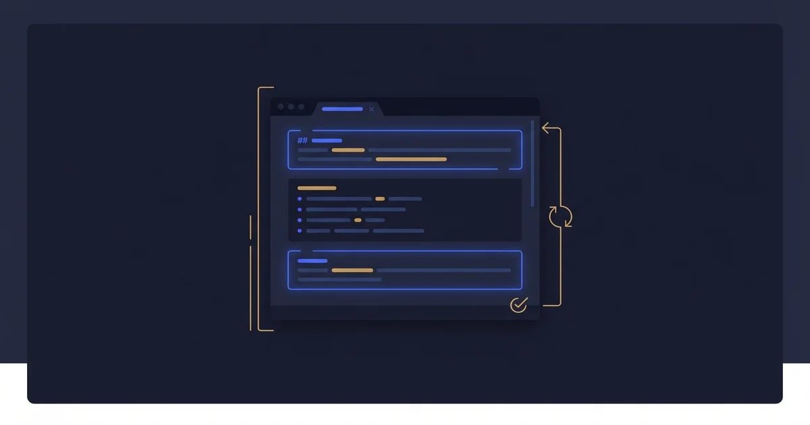
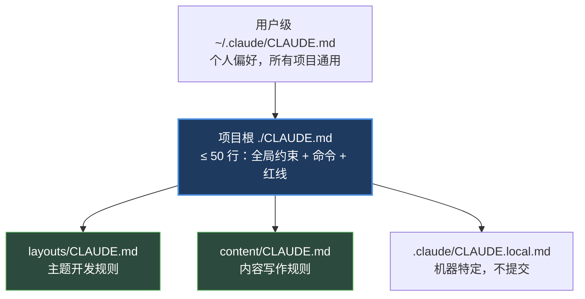

+++
date = '2026-03-31T10:00:00+08:00'
draft = false
title = 'CLAUDE.md 最佳实践：我把 90 行砍到 50 行，Agent 表现反而提升 — Harness #2'
description = '一个真刀真枪的 CLAUDE.md 写法指南：我翻车的 90 行版本，ETH Zurich 研究证实的 60 行上限，AI 自动生成降 20%。含分层架构、3 个误区、90 秒审查清单和可拷贝的 50 行模板。'
toc = true
tags = ['Harness Engineering', 'Claude Code', 'CLAUDE.md', 'AI Agents', 'AI Engineering', 'Prompt Engineering']
keywords = ['CLAUDE.md 最佳实践', 'CLAUDE.md 怎么写', 'CLAUDE.md 60 行', 'CLAUDE.md 踩坑', 'Harness Engineering CLAUDE.md', 'CLAUDE.md 分层', 'CLAUDE.md 模板', 'ETH Zurich CLAUDE.md 研究', 'Claude Code 配置文件', 'AI Agent 指令文件']

[[params.faqItems]]
question = "CLAUDE.md 到底应该写多长？"
answer = "ETH Zurich 关于 LLM 指令文件长度的研究给出了最清晰的答案：60 行以内，人工编写的版本成功率提升约 4%；超过 200 行的 AI 生成版本，成功率反而下降 3%、token 成本增加 20%。我自己踩过的坑是 90 行的 CLAUDE.md——看起来什么都写了，实际 Agent 行为开始漂移。删到 50 行以后，一次成功率显著上升。每一行都要通过石蕊测试：删掉这行，Agent 会犯一个具体、可观察的错误吗？不会就删。"

[[params.faqItems]]
question = "为什么不建议让 LLM 自动生成 CLAUDE.md？"
answer = "ETH Zurich 的 138 个 agentfile 对比实验显示，AI 生成版本反而让 Agent 表现下降约 20%。原因是 LLM 生成的内容倾向于写漂亮话——「编写清晰、可维护的代码」「遵循最佳实践」——这些 Agent 本来就默认这么做，写进去只会稀释注意力。真正有价值的约束来自你踩过的坑：Agent 第一次跑测试用了 npm 而不是 pnpm，你才知道要加一行「Use pnpm, not npm」。这种基于真实错误的规则，AI 自己生不出来。"

[[params.faqItems]]
question = "一个仓库一份 CLAUDE.md 够不够？"
answer = "不够。我自己的血泪教训：博客仓库根目录一开始塞了 90 行 CLAUDE.md，从构建命令到内容策略到图片格式全写一起，Agent 做主题开发时被内容规则干扰，做内容时又被构建细节绕进去。改成分层以后清爽多了：根目录 CLAUDE.md 只放全局约束和命令，layouts/ 子目录放主题开发的领域规则，content/ 子目录放内容写作的红线。离编辑文件越近的规则优先级越高，这是 Claude Code 的原生能力，不用白不用。"

[[params.faqItems]]
question = "CLAUDE.md 和 AGENTS.md 怎么分工？"
answer = "共享规则放 AGENTS.md，Claude 专属配置放 CLAUDE.md。AGENTS.md 是 Agentic AI Foundation 推动的开放标准，Codex、Cursor、Copilot 都认；CLAUDE.md 是 Anthropic 定制的，支持分层作用域、@import、用户级覆盖这些 Claude Code 独有特性。我自己博客仓库的 CLAUDE.md 只有一行「see @AGENTS.md」，AGENTS.md 写所有团队共享约定。如果团队只用 Claude Code，全放 CLAUDE.md 也可以。"

[[params.faqItems]]
question = "90 秒怎么审查一份 CLAUDE.md 是否合格？"
answer = "五个问题扫一遍：行数是否 ≤ 60？有没有「你是一位资深工程师」这种套话开头？有没有包含真实命令（test、lint、build）？有没有红线规则（不能直接推主分支、不能改 migration）？有没有重复 package.json 已经写明的信息（比如 Node 版本、依赖列表）？五个全过就合格；有任何一个翻车就得改。我自己每个月都会对照这个清单扫一次。"
+++



这是 **Harness Engineering 系列第 2 篇**。[第 1 篇](/zh/posts/ai/2026-03-30-harness-engineering-guide/)讲了 `Agent = 模型 + Harness` 的核心公式，[第 3 篇](/zh/posts/ai/2026-04-13-harness-subagent-architecture/)会深入 Sub-Agent 架构设计。这篇聚焦 Harness 里投入产出比最高的单个文件：`CLAUDE.md`。

先把结论放出来：**CLAUDE.md 是你为 AI 编程 Agent 写的 ROI 最高的一个文件——但多数团队写错了。** 三个最常见的坑：写太长（超过 60 行性能反降）、让 LLM 自动生成（实测降低 20%）、一个仓库一份不分层（领域规则互相干扰）。

我自己三个坑都踩过。这篇文章把踩的过程、爬出来的方式、以及我现在遵守的 3 条铁律，全部摊开讲。

## 我的翻车现场：90 行 CLAUDE.md 把 Agent 搞蒙了

去年年底我给这个博客仓库写了一份 90 行的 CLAUDE.md，当时觉得很满意——Hugo 版本、主题、双语规则、图片格式、Git 分支、front matter 模板、SEO 要求、内容策略红线，一个文件写全。

结果两周后开始发现不对劲。我让 Agent 帮我调整主题样式，它写了两行 CSS 又停下来问我图片要不要生成 WebP；我让它写一篇新文章，它一上来先跑 `hugo --minify` 确认构建没坏。每一次都绕远路。

我跑下来才意识到问题：90 行里每一行都在抢 Agent 的注意力。做主题开发的时候，内容策略那一整块完全是噪音；做内容写作的时候，构建命令和部署流程是干扰项。我把所有领域知识平铺在一个文件里，Agent 就得在每个任务开始前花推理算力去过滤——而这些推理 token 是从实际任务里抠出来的。

删到 50 行、再按目录分层之后，Agent 的行为明显稳了。一次成功率上去，绕远路的比例下来。**CLAUDE.md 的价值不是「写多少」，而是「在正确的时机，呈现正确的那几行」。**

## ETH Zurich 的研究：数据说话

这不是我一个人的幻觉。ETH Zurich 关于 LLM 指令文件长度的研究——社区通常称为 "agentfile study"——在 Claude Code、Codex、Qwen Code 等多个 Agent 上对比了 138 个 agentfile，测试集包括 SWE-bench Lite 300 任务和一个 138 任务的新基准。

| 配置 | 成功率变化 | Token 成本 |
|------|-----------|-----------|
| 人工编写，≤ 60 行 | +4% | 持平 |
| AI 自动生成，200+ 行 | -3% | +20% |
| 不用 agentfile | 基准线 | 基准线 |

三个关键发现。**第一**，人工写的精简版本比不用 agentfile 提升约 4%；**第二**，AI 自动生成的长版本反而让成功率下降约 3%；**第三**，Agent 要多花 14-22% 的推理 token 去消化冗长指令，换来的却是退步。

研究团队的结论很直接：**完全不要用 AI 生成的 agentfile，人工编写的也只保留 Agent 无法自行推断的信息。** 这和 Cognition 团队在 Devin 复盘里强调的观点一致：[自然语言指令的交接是有损的](https://cognition.ai/blog/dont-build-multi-agents)——你写进去的每一行，到 Agent 那边都会被解释、压缩、权重重排。写越多，失真越严重。

这也印证了 [Harness Engineering 第 1 篇](/zh/posts/ai/2026-03-30-harness-engineering-guide/)里的核心观点：Harness 的作用是**缩小解空间**，不是往里面堆信息。60 行的精准约束能把 Agent 稳稳压在正确轨道；300 行的文档倾倒只是在噪音里淹没 Agent。

## 三个必须打破的误区

### 误区一："CLAUDE.md 越详细越好"

很多团队默认配置文件写得越全越专业。放在 CLAUDE.md 上这个直觉是错的。每加一行，其他所有行的注意力权重都在被稀释——这是 LLM 注意力机制的物理事实，不是调优技巧能绕开的。

我现在对 CLAUDE.md 每一行做石蕊测试：**删掉这行，Agent 会犯一个具体的、可观察到的错误吗？** 答案是"不会"就删，不留情面。通过测试的行比如 `Use pnpm, not npm`（Agent 默认用 npm）、`All API handlers return Result<T, AppError>`（无法从代码推断的惯例）。没通过的行比如 `Write clean, well-documented code`（Agent 本来就这么做）、`Follow best practices`（太模糊，约束不了任何事）。

边界在哪？ETH Zurich 的数据说 60 行，我自己跑下来 50 行左右最舒服。超过这个数就该考虑往子目录或 Skills 分层。

### 误区二："让 LLM 自动生成 CLAUDE.md 省事"

这是我见过最常见也最昂贵的错误。让 Claude 帮你生成一份 CLAUDE.md，它会自动写出一堆听起来很专业的内容：代码质量标准、命名规范、注释要求、错误处理原则——每一条 Agent 本来就默认做到。

ETH Zurich 实测这类 AI 自动生成文件让成功率降低约 20%。原因很简单：Agent 已经知道要写干净代码，你再写一遍只是在告诉它"这部分重要，多花点注意力"——结果它从真正需要约束的地方（比如项目特定惯例）抽走了关注度。

真正有价值的 CLAUDE.md 规则来自**真实错误的沉淀**。我的工作流是：每次纠正 Agent 时记一笔；同一条纠正出现 3 次以上，就加进 CLAUDE.md。这种基于观察的增量，AI 自己生不出来。

### 误区三："一个仓库一个 CLAUDE.md 就够"

这就是我翻车的原因。一个仓库既有代码又有内容、既有主题又有文章，规则互相干扰。正确做法是**分层**：



Claude Code 原生支持这个层级。**离编辑文件越近的规则优先级越高。** 根目录说"用 Jest"，`packages/web/CLAUDE.md` 说"用 Vitest"——编辑那个包时 Agent 会用 Vitest，其他地方还是 Jest。

我自己博客仓库现在的结构：根目录只有 `see @AGENTS.md` 一行加全局指向；AGENTS.md 约 80 行放团队共享规则；主题开发相关的细节放在 [Skills 指南](/zh/posts/ai/2026-02-28-claude-code-skills-guide/)里按需加载，而不是塞进主配置。

## 我的 50 行 CLAUDE.md 模板（可拷贝）

这是我博客仓库实际在用的结构简化版。每一行都能说出防止了什么错：

```markdown
# CLAUDE.md

## Language
- Agent-user interaction: 中文
- Written content: English (all new posts)

## Stack
- Hugo v0.153.2+ (Extended), theme: hermit-V2
- Deploy: push to `code` branch → GitHub Actions

## Commands
- `hugo server -D` — local preview with drafts
- `hugo --minify` — production build
- `git submodule update --remote` — update theme

## Hard Rules (never violate)
- Never change URLs of indexed posts (Chinese or English)
- Never commit to `master`; always work on `code`
- Every new post needs both `index.md` (EN) and `index.zh.md` (ZH)
- Images: WebP only, cover named `cover.webp` (1200×630)
- Post directory naming: `<date>-<english-slug>/`

## Conventions
- `tags` field stays English across both languages
- `keywords` uses native-language search terms per version
- Chinese posts are NOT translations — native writing

## Where to look
- Theme customization: `assets/scss/`, `layouts/`
- Site config: `hugo.toml`
- Deploy workflow: `.github/workflows/hugo.yml`
```

数一下：34 行。为什么这样切？

**Language 段**防止 Agent 用英文跟我对话或者把正文写成中文；**Stack 段**两行给 Agent 一个锚点，不用去扒 `hugo.toml`；**Commands 段**是 Agent 最容易走歪的地方，精确命令比"运行测试"有用十倍；**Hard Rules 段**是红线，违反会造成实际损害（URL 变动会把已索引的流量全丢掉）；**Where to look 段**防止 Agent 开工前做一堆 `find`/`grep` 探路。

领域规则（比如内容写作时的 SEO 要求、SCSS 的命名空间约定）不放这里，放在 [Skills](/zh/posts/ai/2026-02-28-claude-code-skills-guide/) 里按需加载。Hooks 层面的自动化（构建后验证、推送前检查）用 [Claude Code Hooks](/zh/posts/ai/2026-02-28-claude-code-hooks-guide/) 处理，不写进 CLAUDE.md。

## 该放什么，不该放什么

### 该放：Agent 无法自行推断的具体信息

- **非默认的工具选择**：`Use pnpm, not npm`、`Use uv, not pip`
- **项目特定的类型/契约**：`All API responses use Result<T, AppError>`
- **可执行的命令**：`pnpm test`、`hugo --minify`，不写"运行测试"
- **架构红线**：`Frontend never imports from backend directly`
- **惯例锚点**：`Tests live next to source: foo.ts → foo.test.ts`

### 不该放：Claude 已经知道或能查到的东西

| 类别 | 例子 | 为什么不该放 |
|------|------|------------|
| 语言基础 | "Use TypeScript strict mode" | Agent 读 tsconfig.json 就知道 |
| 框架惯例 | "Use React hooks, not class components" | 现代框架默认就是这样 |
| 通用建议 | "Write unit tests" | 太模糊，约束不了具体行为 |
| 目录列表 | "src/ contains source code" | Agent 读文件系统就懂 |
| 项目综述 | "This app has a frontend and backend" | 从文件结构可推断 |

### 反模式：文档倾倒

我见过最夸张的一份 CLAUDE.md 有 247 行，开头 50 行是项目历史和架构决策记录。这不是 CLAUDE.md，是 README 放错位置。Agent 从代码一眼能看出来的东西，不值得用它稀缺的注意力预算去读。

## 90 秒审查你的 CLAUDE.md

打开你项目的 CLAUDE.md，对照这 5 条扫一遍。任何一条答"否"都得修。

- [ ] **行数 ≤ 60？** 超了就考虑分层或迁移到 Skills
- [ ] **没有套话开头？** 没有"你是一位资深工程师"这类对 Agent 毫无信息量的身份前缀
- [ ] **包含真实命令？** 至少有 test/lint/build 的精确命令（不是描述）
- [ ] **包含红线？** 至少一条"不能做 X"的硬规则（比如不能直接推主分支）
- [ ] **不重复 package.json？** 没有写 Node 版本、依赖列表、脚本描述这些工具链本身就能告诉 Agent 的信息

过不了的项，对照上面"该放什么/不该放什么"两张表改。改完再做一次石蕊测试：每一行删掉会不会产生具体错误。

## CLAUDE.md vs AGENTS.md：什么时候用哪个

2025 年以来生态里两套标准并存：

| 维度 | CLAUDE.md | AGENTS.md |
|------|-----------|-----------|
| 适用工具 | 仅 Claude Code | Claude、Codex、Cursor、Copilot 等 |
| 分层作用域 | 支持（根/子目录/用户级） | 部分（仅子目录） |
| @import 与覆盖 | 支持 | 不支持 |

实操规则：团队**只用 Claude Code** → 全部放 CLAUDE.md；团队**多工具混用** → 共享规则放 AGENTS.md，Claude 专属特性（sub-agent 策略、模型选择偏好）放 CLAUDE.md。我的博客仓库是后者，CLAUDE.md 里一行 `see @AGENTS.md` 做指向。

## 我现在遵守的 3 条铁律

不是展望未来，也不是"值得关注的趋势"——这是我跑下来确定能省时间的规则。

**铁律 1：新增一行前，先问能不能删一行。** CLAUDE.md 是零和游戏，注意力总量不变。想加新约束时先审视现有行，能删就删，不能删再加。这条强制我保持精简。

**铁律 2：规则必须来自真实错误，不来自想象。** 我不会因为"感觉应该有"就加规则。必须是 Agent 实际翻车过、我纠正过 2-3 次以上的问题，才值得固化到 CLAUDE.md。这样每一行都有明确的"防御对象"。

**铁律 3：领域规则走 Skills，不塞主文件。** 数据库迁移、API 规范、部署流程这类领域知识全部放 Skills 按需加载。主 CLAUDE.md 只保留每个任务都相关的全局约束。参考 [Skills 指南](/zh/posts/ai/2026-02-28-claude-code-skills-guide/)。

## 相关阅读

- [Harness Engineering #1：为什么模型之外的一切更重要](/zh/posts/ai/2026-03-30-harness-engineering-guide/) — 系列开篇，Agent = 模型 + Harness 的核心公式
- [Harness Engineering #3：Sub-Agent 架构设计](/zh/posts/ai/2026-04-13-harness-subagent-architecture/) — 下一篇，多 Agent 协作如何不让上下文爆炸
- [Claude Code Hooks 指南](/zh/posts/ai/2026-02-28-claude-code-hooks-guide/) — 用 Hooks 处理自动化，而不是塞进 CLAUDE.md
- [Claude Code Skills 指南](/zh/posts/ai/2026-02-28-claude-code-skills-guide/) — 领域知识按需加载，保持主配置精简
- [Anthropic 官方 CLAUDE.md 文档](https://docs.claude.com/en/docs/claude-code/memory) — 分层作用域、@import、用户级覆盖的完整语法
- [Martin Fowler: LLM engineering patterns](https://martinfowler.com/articles/2025-agentic-ai-patterns.html) — harness 视角下的 Agent 工程模式
