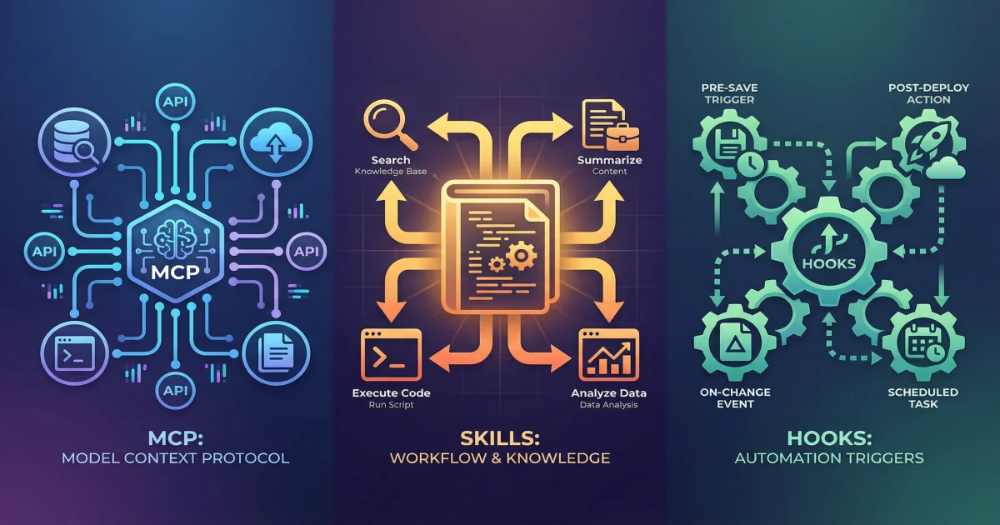

+++
date = '2026-04-02T10:00:00+08:00'
draft = false
title = 'MCP、Skills、Hooks 到底有什么区别？Claude Code 三大扩展机制深度对比'
description = '一文讲透 Claude Code 的 MCP、Skills 和 Hooks 三种扩展方式——它们各自解决什么问题、怎么选、怎么配合使用，附带实操示例和决策流程图。'
toc = true
tags = ['Claude Code', 'MCP', 'Skills', 'Hooks', 'AI Architecture']
keywords = ['MCP和Skill的区别', 'mcp skill 区别', 'Claude Code MCP Skill Hooks 对比', 'MCP是什么', 'Skill怎么用', 'Claude Code扩展方式', 'MCP vs Skills']

[[params.faqItems]]
question = "MCP 和 Skill 最核心的区别是什么？"
answer = "MCP 是连接外部服务的协议——让 AI 能调用数据库、浏览器、API 等外部工具。Skill 是教 AI 做事的知识包——告诉 AI 遇到某个任务该按什么步骤、什么标准来完成。简单说：MCP 提供能力，Skill 提供智慧。"

[[params.faqItems]]
question = "什么时候该用 Hooks 而不是 Skill？"
answer = "当某件事必须每次都执行、不能遗漏时用 Hooks。比如写完代码自动格式化、禁止执行危险命令——这些是硬性规则，不能靠 AI 自觉。Skill 适合需要 AI 判断和推理的复杂流程。"

[[params.faqItems]]
question = "MCP 服务器会不会很占 Token？"
answer = "会。每个 MCP 服务器的工具定义会常驻在上下文窗口中，一个有 15 个工具的服务器大约占 1500-3000 Token。接 5 个服务器可能就烧掉 1 万 Token。所以不要贪多，2-4 个核心服务器就够了。"

[[params.faqItems]]
question = "Skill 可以调用 MCP 工具吗？"
answer = "可以，而且这是推荐的最佳实践。Skill 负责编排流程逻辑——决定做什么、什么顺序、怎么处理异常；MCP 工具负责具体执行——查数据库、调 API、操作浏览器。两者配合才能发挥最大威力。"

[[params.faqItems]]
question = "三种扩展方式能同时用吗？"
answer = "不仅能，而且应该同时用。典型场景：Hooks 在底层强制执行规则（比如禁止删除生产目录），Skill 在中间编排复杂流程（比如完整的部署流程），MCP 在上面提供外部连接（比如通知 Slack、创建 GitHub Release）。三层协同才是最佳实践。"
+++



用 Claude Code 时间长了，你一定听过这三个词：**MCP**、**Skills**、**Hooks**。

很多人分不清它们的区别——MCP 和 Skill 都能"扩展 AI 的能力"，Hooks 和 Skill 都能"自动化流程"，到底什么时候用哪个？

这篇文章用最直白的方式讲清楚：三者各自解决什么问题，怎么选，怎么配合用。

## 先看一张图：三层架构

```
┌──────────────────────────────────────────────┐
│              Skills（技能层）                  │
│     可复用的工作流、领域知识、做事方法          │
│     → "怎么把事做好"                          │
├──────────────────────────────────────────────┤
│              MCP（协议层）                     │
│     连接外部服务的标准化接口                    │
│     → "能做什么"                              │
├──────────────────────────────────────────────┤
│              Hooks（执行层）                   │
│     生命周期事件的自动化执行                    │
│     → "什么事必须做"                          │
└──────────────────────────────────────────────┘
```

这三层各管各的：
- **Skills** 在最上层，负责编排复杂流程
- **MCP** 在中间，负责连接外部世界
- **Hooks** 在最底层，负责强制执行规则

理解了这个分层，后面的内容就容易懂了。

## MCP：让 AI 连接外部世界

### 一句话解释

MCP（Model Context Protocol，模型上下文协议）是一个开放标准，让 AI 能够调用外部工具和服务。

**类比**：MCP 就像手机上的 USB-C 接口——有了这个标准接口，充电器、耳机、U盘都能直接插上用，不需要每个设备配一根专用线。

### 怎么工作的

一个 MCP 服务器可以提供三种东西：

| 类型 | 说明 | 举例 |
|------|------|------|
| **Tools（工具）** | 可执行的操作 | 查数据库、点击网页、发邮件 |
| **Resources（资源）** | 可读取的数据 | 文档、配置文件、实时数据 |
| **Prompts（提示模板）** | 预设的提示词 | 代码审查模板、Bug 报告模板 |

配置方式很简单，在 `.claude/settings.json` 里加上：

```json
{
  "mcpServers": {
    "playwright": {
      "command": "npx",
      "args": ["@anthropic-ai/mcp-playwright"]
    },
    "github": {
      "command": "npx",
      "args": ["@modelcontextprotocol/server-github"],
      "env": {
        "GITHUB_TOKEN": "ghp_xxxxx"
      }
    }
  }
}
```

配完之后，Claude Code 就能操作浏览器、管理 GitHub 仓库了。

### 关键特点：Token 成本高

这是 MCP 最大的代价——**每个服务器的工具定义会常驻上下文窗口**。

什么意思？假设你连了一个 Playwright 服务器，它有 20 个工具（navigate、click、type、screenshot……），这些工具的名称、描述、参数定义加起来大约 2000-3000 Token。不管你用不用，它们一直在那里占着位置。

连 5 个服务器？可能就 1 万 Token 了。上下文窗口是有限的，这些 Token 会挤压你真正的工作空间。

### 什么时候用 MCP

一句话：**当你需要连接外部服务时**。

- 查数据库 → 用 Postgres MCP
- 操作浏览器 → 用 Playwright MCP
- 管理 GitHub → 用 GitHub MCP
- 调用公司内部 API → 自己写一个 MCP Server

**判断标准**：如果你发现自己在 Claude Code 里反复粘贴 `curl` 命令或者 API 调用结果，说明你需要一个 MCP 服务器。

## Skills：教 AI 做事的知识包

### 一句话解释

Skill 是一个可复用的指令包——一个文件夹里放一个 `SKILL.md` 文件，里面写清楚遇到某类任务该怎么做。

**类比**：如果 MCP 提供的是厨房里的锅碗瓢盆（工具），那 Skill 就是菜谱（怎么用这些工具做出一道菜）。

### 怎么工作的

Skill 有一个很聪明的设计——**渐进式加载**：

1. **平时**：Claude 只看到 Skill 的名称和描述（约 100 Token），用来判断是否相关
2. **需要时**：当你输入 `/skill-name` 触发，或者 Claude 发现当前任务匹配时，才加载完整内容
3. **执行完**：详细指令可以卸载，只保留结果

这意味着你可以装几十个 Skill，但平时只占很少的 Token。

```yaml
# 示例：.claude/skills/code-review/SKILL.md
---
name: code-review
description: "按团队标准审查代码变更"
---

## 审查步骤

1. 运行 `git diff --staged` 查看变更
2. 逐文件检查以下项目：
   - 没有硬编码的密钥或 API Key
   - 公共函数都有 JSDoc 注释
   - 错误处理符合项目规范
   - 新逻辑有对应的测试
3. 输出结构化的审查结果，标明严重等级
```

### 两种类型的 Skill

| 类型 | 用途 | 触发方式 | 例子 |
|------|------|----------|------|
| **知识型** | 给 Claude 补充领域知识 | 自动检测上下文 | 代码风格指南、架构规范 |
| **任务型** | 给 Claude 一套执行流程 | 手动输入 `/skill-name` | 部署流程、提交代码、生成文档 |

### 什么时候用 Skill

一句话：**当你反复向 AI 解释同一个流程时**。

- 你的代码审查有固定标准 → 写成 Skill
- 你的部署流程有 10 个步骤 → 写成 Skill
- 你的文档有特定格式要求 → 写成 Skill

**判断标准**：如果你已经在 Claude Code 里粘贴过 3 次以上相同的指令，它就该是一个 Skill。

## Hooks：必须执行的自动化

### 一句话解释

Hooks 是在 Claude Code 生命周期特定节点自动执行的命令。和 MCP、Skill 不同，Hooks 是**确定性执行**的——配了就一定会跑，不需要 AI 判断。

**类比**：MCP 像是给你一把锤子（工具），Skill 教你怎么钉钉子（流程），Hooks 像是一个安全装置——不管你钉不钉钉子，每次拿起锤子前都会自动检查有没有戴护目镜。

### 怎么工作的

在 `settings.json` 里配置：

```json
{
  "hooks": {
    "PostToolUse": [
      {
        "matcher": "Write|Edit",
        "hooks": [
          {
            "type": "command",
            "command": "prettier --write $CLAUDE_FILE_PATH"
          }
        ]
      }
    ],
    "PreToolUse": [
      {
        "matcher": "Bash",
        "hooks": [
          {
            "type": "command",
            "command": "bash -c 'echo $CLAUDE_TOOL_INPUT | jq -r .command | grep -q \"rm -rf /\" && echo \"BLOCKED\" >&2 && exit 2 || exit 0'"
          }
        ]
      }
    ]
  }
}
```

上面这段配置做了两件事：
1. 每次 Claude 写完文件，自动跑 Prettier 格式化
2. 每次 Claude 要执行 Shell 命令前，检查是不是危险的 `rm -rf /`

### 主要的生命周期事件

| 事件 | 触发时机 | 常见用途 |
|------|----------|----------|
| `PreToolUse` | 工具执行前 | 拦截危险命令、校验输入 |
| `PostToolUse` | 工具执行后 | 自动格式化、跑 Lint |
| `Stop` | Claude 完成回复时 | 发通知、更新看板 |
| `SessionStart` | 会话开始时 | 加载开发上下文、设环境变量 |
| `SessionEnd` | 会话结束时 | 清理临时文件、保存状态 |

### 关键特点：零 Token 成本

Hooks 完全在 AI 的上下文窗口之外运行，不占任何 Token。这让它成为成本最低的扩展方式——但也意味着它没法做需要推理和判断的事情。

### 什么时候用 Hooks

一句话：**当某件事必须每次都执行时**。

- 写完代码必须格式化 → Hook
- 绝对不能执行某些命令 → Hook
- 每次开始会话要加载特定上下文 → Hook

**判断标准**：如果你对这个需求的描述里有"必须"、"每次都要"、"绝对不能"，它就是 Hook。

## 一张表看懂全部区别

| 维度 | MCP | Skills | Hooks |
|------|-----|--------|-------|
| **本质** | 连接外部服务的协议 | 可复用的指令包 | 生命周期自动化 |
| **所在层** | 基础设施层 | 应用层 | 执行层 |
| **触发方式** | AI 自主决定调用 | 用户触发或 AI 自动检测 | 生命周期事件自动触发 |
| **是否需要 AI 推理** | 是 | 是 | 否（确定性执行） |
| **Token 成本** | 高（常驻上下文） | 低（按需加载） | 零 |
| **适用范围** | 跨平台（所有 MCP 客户端） | 仅 Claude Code | 仅 Claude Code |
| **配置位置** | `settings.json` mcpServers | `.claude/skills/` SKILL.md | `settings.json` hooks |
| **最适合** | 连接外部服务 | 复杂工作流和知识沉淀 | 强制性的自动化 |

## 同一个任务，三种做法

用一个具体例子来感受区别：**"写完代码自动格式化"**

### 用 MCP 做

连一个 Prettier MCP 服务器，暴露一个 `format_file` 工具。Claude 写完代码后自己决定要不要调。

**问题**：Claude 可能忘了调，或者觉得不需要。而且工具定义一直占着 Token。

### 用 Skill 做

写一个 Skill，在指令里写"每次编辑 TypeScript 文件后都要跑 Prettier"。当 Skill 被加载时，Claude 会遵循这个规则。

**问题**：只在 Skill 激活时有效。上下文紧张时 Claude 可能跳过。

### 用 Hook 做

配一个 `PostToolUse` Hook，匹配 `Write` 工具，每次写文件后自动跑 `prettier --write`。

**结果**：每次都执行，没有例外，零 Token 成本。**这才是正确选择。**

重点不是哪种方式"更好"，而是**每种方式解决不同类型的问题**：
- 格式化是确定性需求 → **Hook**
- 多步骤部署是复杂流程 → **Skill**
- 查生产数据库是外部连接 → **MCP**

## 决策流程：三步搞定

遇到一个新需求，按这个思路选：

```
需求来了
    │
    ▼
需要连接外部服务吗？（数据库、API、浏览器）
    ├── 是 → 用 MCP
    │
    ▼
必须每次都执行吗？（格式化、安全检查、自动通知）
    ├── 是 → 用 Hooks
    │
    ▼
是不是一个可复用的复杂流程？（代码审查、部署、文档生成）
    ├── 是 → 用 Skills
    │
    ▼
以上都不是 → 直接在 CLAUDE.md 里写规则就行
```

## 三者协同的实战案例

来看一个真实场景：**部署到生产环境**

```
Hook (PreToolUse):   拦截对生产目录的 rm -rf 命令 → 安全底线
Skill (/deploy):     编排完整的部署流程 →
  ├── MCP (GitHub):    创建 Release Tag
  ├── MCP (Slack):     通知团队频道
  ├── 内置工具:         跑测试套件
  └── 内置工具:         构建并推送 Docker 镜像
Hook (Stop):         把部署结果记录到审计日志 → 合规要求
```

三层各司其职：
- **Hook** 兜底，防止灾难性操作
- **Skill** 编排流程，确保步骤完整
- **MCP** 处理外部通信

## 常见误区

### 误区一：MCP 装得越多越好

连了 15 个 MCP 服务器，指望 Claude 自己搞定一切。结果：上下文爆炸，响应变慢，效果反而变差。

**正确做法**：2-4 个核心服务器就够了。复杂流程用 Skill 编排，而不是靠堆 MCP 服务器。

### 误区二：用 Skill 做强制性的事

在 Skill 里写"每次编辑后必须跑 Linter"。Skill 是建议，不是命令——Claude 在上下文紧张时可能跳过。

**正确做法**：必须执行的事用 Hook。

### 误区三：只用一种扩展方式

只用 MCP 不用 Skill，或者只用 Skill 不用 Hook。三种机制是互补的，不是互斥的。

**正确做法**：Hook 做保障，Skill 做流程，MCP 做连接，三管齐下。

## 推荐配置

对大多数开发者来说，一个好用的配置是：

- **MCP 服务器**：2-4 个（文件系统、GitHub，加 1-2 个业务相关的）
- **Skills**：5-10 个（代码审查、提交、部署、文档、团队特有流程）
- **Hooks**：3-5 个（自动格式化、危险命令拦截、会话初始化）

从最小可用集开始，发现重复模式时再添加。目标不是扩展越多越好，而是**用最少的上下文成本获得最大的效率提升**。

## 相关阅读

- [Skill 与 MCP 的区别：两种扩展 AI 能力的方式](/posts/ai/2026-01-06-skillmcp/) — 早期对 Skills 和 MCP 基础概念的梳理
- [Claude Code MCP 配置指南：连接 AI 到任何外部服务](/posts/ai/2026-02-28-claude-code-mcp-setup/) — MCP 服务器安装和自建的实操教程
- [Claude Code Skills 完全指南：创建自定义 SKILL.md 工作流](/posts/ai/2026-02-28-claude-code-skills-guide/) — 从零创建生产级 Skill 的详细指南
- [Claude Code Hooks 2026：完整事件列表 + 即用配置](/posts/ai/2026-02-28-claude-code-hooks-guide/) — 所有 Hook 事件详解，附可直接复制的配置
- [MCP 协议详解：AI 集成的通用标准](/posts/ai/2026-02-20-mcp-protocol-guide/) — MCP 协议架构的完整技术解析
