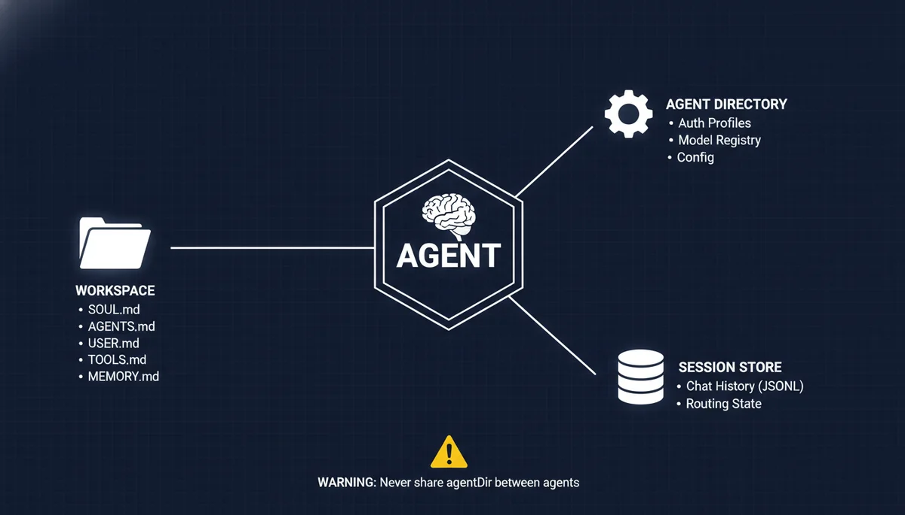
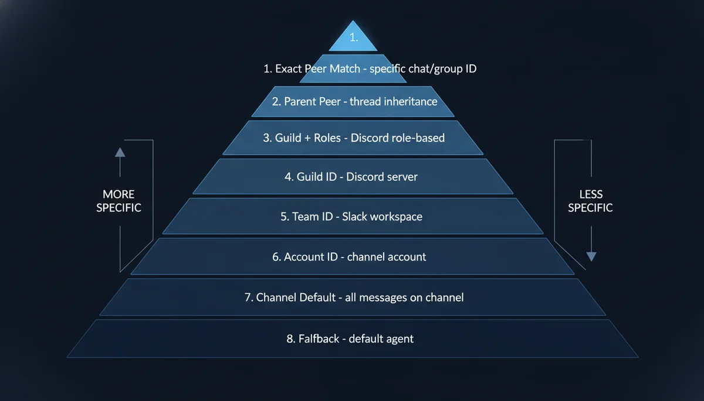
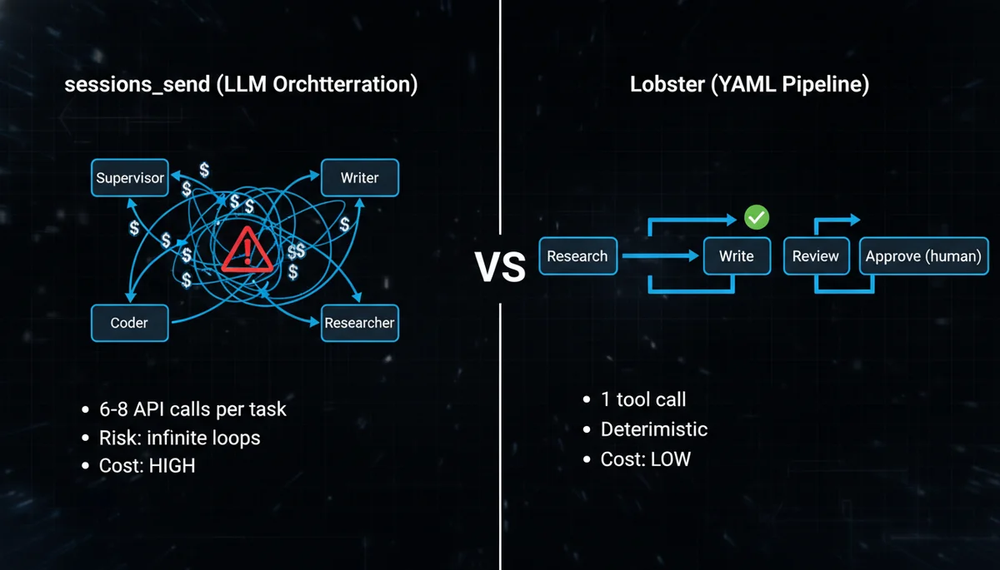
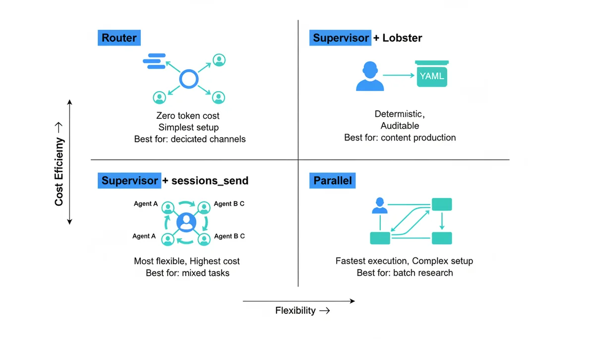
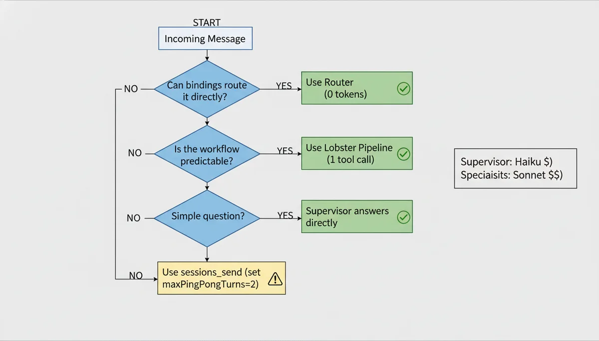

+++
date = '2026-04-02T14:00:00+08:00'
draft = false
title = 'OpenClaw Multi-Agent Setup: Stop Letting LLMs Orchestrate'
description = 'Complete OpenClaw multi-agent configuration guide. 8-tier binding priority, Lobster deterministic pipelines vs sessions_send, Feishu integration, cost optimization strategies, and a copy-paste 3-agent starter config.'
toc = true
tags = ['OpenClaw', 'Multi-Agent', 'AI Architecture', 'Lobster', 'Agent Orchestration']
keywords = ['OpenClaw multi-agent configuration', 'OpenClaw multi-agent setup guide', 'openclaw bindings routing', 'openclaw Lobster pipeline', 'sessions_send vs Lobster', 'multi-agent cost optimization', 'openclaw.json configuration', 'agent orchestration patterns 2026']

[[params.faqItems]]
question = "How do I set up multiple agents in OpenClaw?"
answer = "Use 'openclaw agents add <name>' for each agent. Each gets an isolated workspace with SOUL.md, AGENTS.md, memory, and its own session store under ~/.openclaw/agents/<agentId>/. Then configure 8-tier priority routing in openclaw.json bindings to map channels, groups, or accounts to specific agents."

[[params.faqItems]]
question = "Should I use sessions_send or Lobster for agent-to-agent communication?"
answer = "Start with Lobster for deterministic workflows (research → write → review). It uses YAML orchestration with one tool call instead of multiple LLM routing decisions, cutting costs by an order of magnitude. Use sessions_send only when you genuinely need LLM-driven dynamic decisions about which agent to contact next."

[[params.faqItems]]
question = "What is the OpenClaw binding priority order?"
answer = "OpenClaw uses 8-tier most-specific-wins routing: exact peer match > parent peer (thread inheritance) > guild ID + roles > guild ID > team ID > account ID > channel-level default > fallback default agent. Multiple match fields use AND semantics. Within the same tier, first in config order wins."

[[params.faqItems]]
question = "How do I control costs with OpenClaw multi-agent?"
answer = "Five strategies: 1) Use cheap models like Haiku for the supervisor — mixing models saves 40-60% vs using a premium model everywhere; 2) Use bindings routing instead of supervisor delegation for zero token overhead; 3) Use Lobster pipelines instead of sessions_send for deterministic workflows; 4) Set maxPingPongTurns to 2-3; 5) Configure the supervisor to answer simple queries directly without delegating."

[[params.faqItems]]
question = "Can OpenClaw multi-agent connect to Feishu/Lark?"
answer = "Yes. Since OpenClaw 2026.2.26, Feishu is a built-in channel using WebSocket — no public URL needed. Create multiple bot applications in Feishu, configure each as a channel account in openclaw.json, and use bindings to route each bot to a different agent. Full multi-agent routing support since 2026.3.13."
+++


The biggest threat to your OpenClaw multi-agent system is not misconfiguration. It is **letting LLMs handle orchestration**.

The typical setup looks elegant on paper: a Supervisor agent receives all messages, uses `sessions_send` to delegate to specialist agents, collects results, and delivers a unified response. In practice, every routing decision is a full API call, every specialist reply-back is another, and a simple "write me a blog post" might trigger 6-8 API requests. Worse, without anti-recursion rules, agents can enter circular delegation loops. [Cogent's failure playbook](https://cogentinfo.com/resources/when-ai-agents-collide-multi-agent-orchestration-failure-playbook-for-2026) documents teams that **burned thousands of dollars in minutes** from exactly this pattern.

The right starting point is **bindings for static routing + Lobster for deterministic pipelines**, with `sessions_send` reserved for cases that genuinely require LLM-driven dynamic decisions. This guide walks you through the complete setup.

If you have not installed OpenClaw yet, start with the [OpenClaw Setup Guide](/posts/ai/2026-03-05-openclaw-setup-guide/).

---

## Why Multi-Agent: The Single-Agent Ceiling

A single OpenClaw agent accumulates context from every domain it touches. After a few weeks of heavy use, three problems emerge — and none of them are the model's fault.

**Memory pollution is the first ceiling.** The agent retrieves irrelevant context when answering questions. Ask about a blog draft and it pulls in debugging notes from last week. Once the memory index exceeds 200MB, retrieval precision degrades noticeably because one vector store holds too many unrelated domains. This is not a search algorithm problem — it is an information density problem.

**Persona confusion is the second ceiling.** One SOUL.md cannot define both "formal technical writer" and "casual friend" without contradictions that leak across conversations. You get emoji-laden responses in work channels or corporate-speak in personal chats. OpenClaw's own [DM security documentation](https://open-claw.bot/docs/concepts/session/) warns that without isolation, multiple users sharing the same session context will experience private information leakage.

**Model mismatch is the third ceiling.** Coding tasks need Claude Sonnet, brainstorming works better with GLM-4.7, and routing decisions only need Haiku. One agent means one model for everything — either overpaying for simple tasks or underperforming on complex ones. Research shows that heterogeneous model architectures [reduce costs by 40-60%](https://moltbook-ai.com/posts/ai-agent-cost-optimization-2026) compared to using a single premium model, without sacrificing output quality.

Multi-agent architecture solves all three by giving each agent its own workspace, memory, persona, and model configuration. For the underlying Gateway-Agent-Skill model, see the [OpenClaw Architecture Deep Dive](/posts/ai/2026-02-14-openclaw-architecture-deep-dive/).

---

## Core Concepts: What Makes an Agent



Each OpenClaw agent is three isolated components:

| Component | Path | Purpose |
|-----------|------|---------|
| **Workspace** | `~/openclaw-agents/<name>/` | SOUL.md, AGENTS.md, USER.md, TOOLS.md, MEMORY.md |
| **Agent Directory** | `~/.openclaw/agents/<agentId>/` | Auth profiles, model registry, per-agent config |
| **Session Store** | `~/.openclaw/agents/<agentId>/sessions/` | Chat history (JSONL), routing state |

**Critical rule: never share an agentDir between agents.** Shared directories cause auth collisions, session bleed, and memory cross-contamination. I covered this in detail in the [Automation Pitfalls](/posts/ai/2026-03-05-openclaw-automation-pitfalls/) guide — once two agents' session stores are interleaved, you get Agent A suddenly speaking in Agent B's tone, and debugging this is extraordinarily painful.

---

## Step 1: Create Agent Workspaces

### Add Agents via CLI

```bash
# Create a supervisor agent (coordinator)
openclaw agents add supervisor

# Create specialist agents
openclaw agents add writer
openclaw agents add coder
openclaw agents add researcher
```

Each command creates a complete workspace directory:

```
~/openclaw-agents/writer/
├── AGENTS.md      # Agent capabilities and rules
├── SOUL.md        # Personality, tone, values
├── USER.md        # User preferences and context
├── TOOLS.md       # Available tools and restrictions
├── MEMORY.md      # Persistent memory notes
├── HEARTBEAT.md   # Proactive check-in rules
└── IDENTITY.md    # Name, avatar, metadata
```

Naming rules: lowercase letters, digits, and hyphens only (`a-z`, `0-9`, `-`). Must start with a letter, cannot end with a hyphen. Valid examples: `writer`, `code-reviewer`, `research-v2`.

### Configure SOUL.md Per Agent

SOUL.md is the soul file that defines each agent's personality and behavioral boundaries. Here is a practical example for a writer agent:

```markdown
# Writer Agent

You are a technical content writer specializing in AI engineering topics.

## Rules
- Write in clear, direct language — no filler
- Use concrete examples over abstract explanations
- Target 1500-2500 words per article
- Include code snippets when relevant
- Never generate placeholder content — every section must be substantive

## Tone
Professional but conversational. Like explaining tech to a colleague, not writing a thesis.

## Tools You Can Use
- tavily-search (web research)
- memory_search (recall past articles)
- read/write (file operations)

## Tools You Cannot Use
- exec (no shell commands)
- browser (no browser automation)
```

**Critical detail: you must explicitly list tools in SOUL.md.** After OpenClaw 2026.3.2, all tool permissions are disabled by default. This was the root cause of [widespread reports on Reddit](https://www.reddit.com/r/openclaw/comments/1rlg0ki/psa_after_updating_to_openclaw_202632_your_agent/) of agents "suddenly becoming dumb." The model did not change — tools were turned off. Configure tool allowlists in both SOUL.md and openclaw.json.

---

## Step 2: Configure Model Routing Per Agent

Different agents running different models is the most direct cost optimization in a multi-agent setup.

```bash
# Supervisor: fast, cheap — only makes routing decisions
openclaw agents config set supervisor model claude-3.5-haiku

# Writer: strong reasoning for long-form content
openclaw agents config set writer model deepseek-r1

# Coder: best coding model available
openclaw agents config set coder model claude-sonnet-4

# Researcher: strong tool use and synthesis
openclaw agents config set researcher model gpt-4.1
```

### Model Selection Strategy

| Agent Type | Recommended Model | Reasoning |
|-----------|-------------------|-----------|
| Supervisor | Claude Haiku / GPT-4.1-mini | Fast routing, low cost — no deep reasoning needed |
| Writer | DeepSeek-R1 / Claude Sonnet | Strong long-form generation and logical structure |
| Coder | Claude Sonnet / Codex | Best code quality and tool calling |
| Researcher | GPT-4.1 / Claude Sonnet | Strong multi-tool coordination and synthesis |
| Brainstormer | GLM-4.7 / DeepSeek | Creative divergent thinking, high cost-efficiency |

**The key insight: the supervisor is the agent you should spend the least on.** Its entire job is "which agent should handle this message?" — Haiku handles this perfectly. Save the expensive API calls for the specialists doing the actual work. In practice, a Haiku supervisor + Sonnet specialists architecture is [40-60% cheaper](https://moltbook-ai.com/posts/ai-agent-cost-optimization-2026) than using Sonnet everywhere.

---

## Step 3: Configure Bindings — 8-Tier Priority Routing

Bindings are deterministic routing rules in openclaw.json that map incoming messages to the correct agent. **This is zero-token-cost routing** — no LLM involvement, pure rule matching.

### Full Configuration Example

```json5
{
  agents: {
    list: [
      {
        id: "supervisor",
        workspace: "~/openclaw-agents/supervisor",
        default: true
      },
      {
        id: "writer",
        workspace: "~/openclaw-agents/writer"
      },
      {
        id: "coder",
        workspace: "~/openclaw-agents/coder"
      },
      {
        id: "researcher",
        workspace: "~/openclaw-agents/researcher"
      }
    ]
  },
  bindings: [
    // Exact peer match (highest priority)
    {
      agentId: "writer",
      match: { channel: "telegram", peer: { kind: "group", id: "writing_group_id" } }
    },
    {
      agentId: "coder",
      match: { channel: "telegram", peer: { kind: "group", id: "coding_group_id" } }
    },
    // Feishu routing by account
    {
      agentId: "supervisor",
      match: { channel: "feishu", accountId: "work-bot" }
    },
    {
      agentId: "writer",
      match: { channel: "feishu", accountId: "writing-bot" }
    },
    // Channel-level default (fallback)
    {
      agentId: "supervisor",
      match: { channel: "telegram" }
    }
  ]
}
```

### 8-Tier Binding Priority Reference



This is the complete priority system from the [official documentation](https://docs.openclaw.ai/concepts/multi-agent), from highest to lowest:

| Priority | Match Condition | Typical Use Case |
|----------|----------------|------------------|
| **1** | Exact peer (DM/group ID) | Specific chat → specific agent |
| **2** | Parent peer (thread inheritance) | Forum threads inherit parent routing |
| **3** | Guild ID + roles | Discord role-based routing |
| **4** | Guild ID | Discord server-wide routing |
| **5** | Team ID | Slack workspace-level routing |
| **6** | Account ID | Same channel, different accounts |
| **7** | Channel-level default | All messages on a channel type |
| **8** | Fallback default | Agent marked `default: true` |

**Critical detail**: when a binding specifies multiple match fields (e.g., `peer` + `accountId`), they use **AND semantics** — all fields must match. Within the same priority tier, the first binding in config order wins.

### Verify Your Bindings

Always verify after configuration — do not trust the config file blindly:

```bash
# Show all active bindings with actual routing order
openclaw agents list --bindings

# Probe channel connectivity
openclaw channels status --probe
```

---

## Step 4: Agent Communication — Choose the Right Mechanism

This is the most consequential decision in the entire setup. OpenClaw offers two inter-agent communication approaches, and choosing wrong is expensive.



### Option A: Lobster Deterministic Pipelines (Recommended)

[Lobster](https://github.com/openclaw/lobster) is OpenClaw's native workflow engine. The concept in one sentence: **LLMs handle creative work (writing, researching), YAML handles orchestration (sequencing, conditions, approval gates).**

Why not let LLMs orchestrate? A developer [shared their experience on dev.to](https://dev.to/ggondim/how-i-built-a-deterministic-multi-agent-dev-pipeline-inside-openclaw-and-contributed-a-missing-4ool) after trying five approaches. When you embed flow control in prompts ("if review fails, go back to step 2, max 3 retries"), LLMs miscount iterations, skip steps, or loop forever. YAML files do not make these mistakes.

#### Step A1: Install and Enable Lobster

```bash
# Install Lobster CLI on the Gateway host
pnpm install lobster

# Verify
lobster --help
lobster doctor
```

Enable in openclaw.json:

```json
{
  "tools": {
    "alsoAllow": ["lobster"]
  }
}
```

To enable only for specific agents (e.g., supervisor only):

```json
{
  "agents": {
    "list": [
      {
        "id": "supervisor",
        "tools": { "alsoAllow": ["lobster"] }
      }
    ]
  }
}
```

#### Step A2: Write a Workflow File

Create a `.lobster` file in your workspace. Here is a blog content production pipeline (`blog-pipeline.lobster`):

```yaml
name: blog-content-pipeline
args:
  topic:
    default: "OpenClaw security best practices"
steps:
  # Step 1: Research — LLM gathers data, outputs JSON
  - id: research
    pipeline: >
      openclaw.invoke --tool llm-task --action json
      --args-json '{"prompt": "Research the latest information about ${topic}. Return key findings, data points, and sources.", "thinking": "medium"}'

  # Step 2: Write — previous step output flows in via stdin
  - id: write
    pipeline: >
      openclaw.invoke --tool llm-task --action json
      --args-json '{"prompt": "Write a 2000-word technical article based on the research provided via stdin.", "thinking": "high"}'
    stdin: $research.json

  # Step 3: Human approval — pipeline pauses here
  - id: review
    approval: "Article draft is ready. Review before publishing?"
    stdin: $write.json

  # Step 4: Only runs after approval
  - id: publish
    command: hugo --minify
    when: $review.approved
```

**Key syntax explained:**
- `pipeline:` — calls Lobster built-in commands (e.g., `openclaw.invoke` to call agent tools)
- `command:` or `run:` — executes regular shell commands
- `stdin: $stepId.json` — pipes the previous step's JSON output to the next step's stdin — **this is how data flows between steps**
- `approval:` — human-in-the-loop gate; the pipeline pauses and waits for confirmation
- `when:` — conditional execution; step only runs if the condition is met

#### Step A3: Run the Workflow

**Option 1: CLI**

```bash
lobster run blog-pipeline.lobster --args-json '{"topic": "multi-agent cost optimization"}'
```

**Option 2: Agent triggers it during conversation**

When you tell the supervisor "write an article about multi-agent cost optimization," it calls the Lobster tool:

```json
{
  "action": "run",
  "pipeline": "/path/to/blog-pipeline.lobster",
  "argsJson": "{\"topic\": \"multi-agent cost optimization\"}",
  "timeoutMs": 60000
}
```

#### What Happens at Runtime

1. Lobster executes `research` → `write` sequentially, each step calling the LLM
2. At the `review` step, the **pipeline pauses** and returns `needs_approval` with a `resumeToken`
3. You inspect the draft and decide whether to proceed
4. If satisfied, resume: `{"action": "resume", "token": "<resumeToken>", "approve": true}`
5. Pipeline continues to `publish`

The entire process is **one Lobster tool call** from OpenClaw's perspective. Compare this to sessions_send, where the supervisor would need separate calls to the researcher (wait for reply), then the writer (wait for reply), then aggregate — at least 6 API calls for the same workflow.

#### How Lobster Relates to Multi-Agent

A common misconception: does Lobster replace multi-agent? **No.** Lobster is the glue between agents:

- Multi-agent provides **capability isolation** — each agent has its own SOUL.md, memory, model
- Lobster provides **workflow orchestration** — who runs first, who runs next, when to skip, when to ask for approval
- `sessions_send` provides **dynamic communication** — for cases where agents need runtime LLM judgment about "who to ask next"

These three are not mutually exclusive — they operate at different layers. For most scenarios, bindings routing + Lobster pipelines are sufficient. Only introduce sessions_send when you genuinely need LLM-driven dynamic decisions.

#### "How Is This Different from Writing a Skill?"

If you are wondering this, you have identified the right question. Lobster and Skills (instructions in SOUL.md/AGENTS.md) both look like "writing down a process." The critical difference is **who executes it**.

**A Skill is an instruction manual for the LLM.** You write "Step 1: research, Step 2: write, Step 3: review" in SOUL.md. The LLM reads it, understands it, then **decides on its own how to execute**. It might skip step 3 ("this article doesn't need review"), merge steps 1 and 2 ("I'll research while writing"), or lose the complete output of step 1 by step 2. The LLM is "interpreting instructions," not "executing code."

**Lobster is a script for a machine runtime.** When `$research.json` flows to `$write` via `stdin`, that is not the LLM "remembering the previous step's output" — it is an OS-level data pipe. Steps cannot be skipped. Order cannot be changed. Approval is a real pause/resume with a cryptographic token, not the LLM "pretending to wait."

This distinction matters most in three scenarios:

**Cross-agent orchestration.** A Skill lives in one agent's workspace. If you write "ask Researcher to investigate first" in Writer's SOUL.md, the Writer cannot actually do that — it has no authority to dispatch other agents. Lobster executes at the Gateway level and natively supports cross-agent invocation.

**Approval gates.** A Skill that says "confirm with user before critical operations" can be bypassed if the LLM decides confirmation is unnecessary. Lobster's `approval:` is a **hard stop** — the runtime serializes the entire workflow state and returns a `resumeToken`. Without an explicit resume, execution never continues. Your sensitive operations will never be skipped by a well-meaning LLM.

**Context cost.** Every step in a Skill accumulates in the same LLM context window — longer context means higher cost per call. Lobster steps are independent tool calls; each step's output pipes to the next step without inflating the context window.

**But not everything needs Lobster.** If the workflow stays within a single agent (e.g., "search → summarize → reply"), writing it in SOUL.md is sufficient. Lobster's value emerges with cross-agent multi-step workflows + hard execution guarantees + approval gates + token cost sensitivity.

### Option B: sessions_send (Dynamic LLM Orchestration)

Use `sessions_send` only when your scenario requires agents to dynamically decide "who to ask next" based on runtime information.

Enable in openclaw.json:

```json
{
  "tools": {
    "agentToAgent": {
      "enabled": true,
      "allow": ["supervisor", "writer", "coder", "researcher"],
      "maxPingPongTurns": 3
    }
  }
}
```

| Parameter | Default | Description |
|-----------|---------|-------------|
| `enabled` | `false` | Master switch — **off by default** |
| `allow` | `[]` | Allowlist of agent IDs that can communicate |
| `maxPingPongTurns` | `5` | Max back-and-forth turns (set to 2-3) |

**Anti-recursion rules are mandatory.** Add this to the supervisor's SOUL.md:

```markdown
## Coordination Rules
- NEVER accept tasks routed back from specialists
- After receiving specialist output, aggregate and close — do not re-delegate
- If a specialist cannot complete a task, report failure to the user — do not retry with different framing
```

Without this rule, you risk the three failure modes documented in [Cogent's multi-agent failure playbook](https://cogentinfo.com/resources/when-ai-agents-collide-multi-agent-orchestration-failure-playbook-for-2026): **infinite loops** (agents with conflicting instructions passing tasks back and forth), **hallucinated consensus** (agents converging on fabricated data), and **resource deadlock** (agents waiting on each other). Infinite loops are the most common and the most expensive.

A practical governance tip from [LumaDock's coordination guide](https://lumadock.com/tutorials/openclaw-multi-agent-coordination-governance): **physically deny specialist agents access to sessions_send**. Research and coding specialists do not need to initiate contact with other agents — they receive tasks, complete them, and return results. Denying at the tool level is far more reliable than prompting "do not delegate recursively."

### Decision Framework: Lobster vs sessions_send

| Scenario | Lobster | sessions_send |
|----------|---------|---------------|
| Fixed workflow (research → write → review) | ✅ | ❌ |
| Approval gates required | ✅ | ❌ |
| Token cost sensitive | ✅ | ❌ |
| Dynamic "who to ask" decisions needed | ❌ | ✅ |
| Multi-turn negotiation between agents | ❌ | ✅ |
| Fully ad-hoc exploratory tasks | ❌ | ✅ |

My recommendation: **start with Lobster.** Most scenarios that look like they need "dynamic orchestration" can be decomposed into deterministic steps on closer analysis. Introduce `sessions_send` only when you genuinely cannot predict at config time which agent should handle the next step.

---

## Step 5: Tool Permissions and Sandboxing

Each agent should have only the tools it needs. Over-permissioning creates security risks and degrades model accuracy — the more tools available, the lower the selection precision.

```json5
{
  agents: {
    list: [
      {
        id: "writer",
        workspace: "~/openclaw-agents/writer",
        sandbox: {
          enabled: true,
          allowedPaths: ["~/writing/", "~/drafts/"]
        },
        tools: {
          allow: ["tavily-search", "memory_search", "read", "write"],
          deny: ["exec", "browser", "shell"]
        }
      },
      {
        id: "coder",
        workspace: "~/openclaw-agents/coder",
        sandbox: {
          enabled: true,
          allowedPaths: ["~/projects/"]
        },
        tools: {
          allow: ["exec", "read", "write", "browser", "memory_search"],
          deny: ["tavily-search"]
        }
      },
      {
        id: "researcher",
        workspace: "~/openclaw-agents/researcher",
        tools: {
          allow: ["tavily-search", "memory_search", "read"],
          deny: ["exec", "write", "browser", "shell", "sessions_send"]
        }
      }
    ]
  }
}
```

Notice the researcher config: I explicitly deny `sessions_send`. This is not because researchers do not need communication — it is to **physically prevent delegation loops**. Specialists receive tasks, complete them, and return results. They should never initiate contact with other agents.

### Sandbox Quick Reference

| Agent Type | File Access | Tool Access | Principle |
|-----------|-------------|-------------|-----------|
| Writer | Content directories only | Search + read/write | No shell execution |
| Coder | Project directories only | Full dev tools | Restrict directory scope |
| Researcher | No write access | Search tools only | Read-only, deny sessions_send |
| Family/Shared | Read-only sandbox | Answer questions only | Cannot modify anything |

For more tool permission strategies, see the [OpenClaw Automation Pitfalls](/posts/ai/2026-03-05-openclaw-automation-pitfalls/) guide.

---

## Feishu/Lark Integration for Multi-Agent

Feishu (Lark) is bundled as a built-in channel since OpenClaw 2026.2.26, with full multi-agent routing support since 2026.3.13.

### Architecture: One Bot Per Agent

The recommended pattern: create multiple bot applications in the Feishu developer console, each acting as an independent channel account bound to a different agent.

**Step 1**: Create bot applications at [Feishu Open Platform](https://open.feishu.cn/app) — one per agent (e.g., Work Assistant → supervisor, Writing Assistant → writer, Code Assistant → coder).

**Step 2**: Configure minimum scopes per bot:

| Scope | Purpose |
|-------|---------|
| `im:message` | Send and receive messages |
| `im:message.group_at_msg` | Receive @mentions in groups |
| `contact:user.base:readonly` | Read user information |

Add `docs:doc`, `calendar:calendar`, `task:task`, or `bitable:app` based on agent needs.

**Step 3**: Configure openclaw.json:

```json5
{
  channels: {
    feishu: [
      { account: "work-bot", appId: "cli_xxx_work", appSecret: "secret1" },
      { account: "writing-bot", appId: "cli_xxx_write", appSecret: "secret2" },
      { account: "code-bot", appId: "cli_xxx_code", appSecret: "secret3" }
    ]
  },
  bindings: [
    { agentId: "supervisor", match: { channel: "feishu", accountId: "work-bot" } },
    { agentId: "writer", match: { channel: "feishu", accountId: "writing-bot" } },
    { agentId: "coder", match: { channel: "feishu", accountId: "code-bot" } }
  ]
}
```

**Step 4**: Restart and verify:

```bash
openclaw gateway restart
openclaw channels status --probe
openclaw agents list --bindings
```

Key advantage: **no public URL required**. Feishu uses WebSocket event subscription, so your gateway does not need to be publicly accessible — OpenClaw connects outbound to Feishu's servers.

---

## Four Collaboration Patterns



### Pattern 1: Router (Start Here)

```
Telegram Writing Group → Writer
Telegram Coding Group  → Coder
Feishu Work Bot        → Supervisor
```

Messages route directly to specialist agents via bindings. **Zero token overhead** — no supervisor involvement, no inter-agent communication. This is the right first step for most users because usage patterns naturally map to channels.

### Pattern 2: Supervisor + Lobster

```
User → Supervisor → [Lobster Pipeline] → Writer → Reviewer → User
```

The supervisor receives requests and triggers Lobster pipelines with deterministic steps. Best for fixed workflows: content production, code review chains, data processing.

### Pattern 3: Supervisor + sessions_send

```
User → Supervisor → Writer / Coder / Researcher → Supervisor → User
```

The supervisor uses LLM judgment to delegate dynamically. Maximum flexibility, maximum cost. Best for mixed-domain tasks that cannot be predefined.

### Pattern 4: Parallel Execution

```
           → Researcher A (topic 1)
User → Supervisor → Researcher B (topic 2) → Supervisor → User
           → Researcher C (topic 3)
```

Split large tasks across multiple agents running simultaneously. Best for large-scale research, multi-file code generation, batch processing. Highest config complexity — requires careful result aggregation and error handling.

### Pattern Selection Guide

| Scenario | Pattern | Why |
|----------|---------|-----|
| Dedicated channels per function | Router | Zero overhead, simplest |
| Content production pipeline | Supervisor + Lobster | Deterministic, auditable |
| Personal all-purpose assistant | Supervisor + sessions_send | Flexible but expensive |
| Competitive analysis across 10 companies | Parallel | Speed through parallelism |

---

## Cost Optimization: 5 Strategies You Can Apply Today



Multi-agent setups multiply API costs. [Deloitte predicts](https://www.deloitte.com/us/en/insights/industry/technology/technology-media-and-telecom-predictions/2026/ai-agent-orchestration.html) that over 40% of agentic AI projects may be cancelled due to cost overruns. These strategies can save you 60-80%:

**1. Use cheap models for the supervisor.** It only makes routing decisions — Haiku is sufficient. Save Sonnet/Opus for the specialists doing actual work.

**2. Use Router bindings instead of Supervisor delegation when possible.** Binding-based routing has zero token cost. If your channels naturally map to different agents, use bindings directly.

**3. Replace sessions_send with Lobster for deterministic workflows.** One tool call instead of multiple LLM orchestration rounds saves an order of magnitude in tokens.

**4. Limit ping-pong turns.** `maxPingPongTurns` defaults to 5, but most scenarios need only 2-3. Each additional turn is two API calls.

**5. Let the supervisor handle simple queries directly.** Add to the supervisor's SOUL.md: "Answer one-line questions directly without delegating to specialists." This prevents a "what's the weather?" from triggering a `sessions_send` round-trip.

For memory-level cost optimization, see the [OpenClaw Memory Strategy](/posts/ai/2026-01-31-openclaw-memory-strategy/) guide.

---

## Troubleshooting

**Agent not receiving messages**: Check binding priority order with `openclaw agents list --bindings`. A broader binding (e.g., channel-level default) may be catching messages before your specific peer rule. Ensure specific rules come **earlier** in the config file.

**sessions_send failing silently**: Two common causes — the target agent is not in the `agentToAgent.allow` list, or the master switch `enabled` is still `false`. It is off by default.

**Agent "became dumb" after update**: This is a known 2026.3.2 issue. All tool permissions reset to disabled by default. Fix: explicitly list each agent's required tools in `agents.list[].tools.allow` in openclaw.json.

**Token costs spiking**: First check if the supervisor is using an expensive model. Then use `/status` or `openclaw sessions --json` to see per-agent token distribution. If one agent's usage is far above expected, check for circular delegation — look for repeated `sessions_send` calls between the same agent pair in the logs.

---

## Recommended Starter Configuration

For most personal users, this 3-agent setup is sufficient:

| Agent | Model | Role | Binding |
|-------|-------|------|---------|
| supervisor | claude-3.5-haiku | Route tasks, handle simple queries | Default for all channels |
| writer | deepseek-r1 | Blog posts, documentation, emails | Writing-specific groups |
| coder | claude-sonnet-4 | Code generation, debugging, reviews | Coding-specific groups |

Add a researcher agent when the supervisor frequently needs web search for complex queries. Add more specialists only when you have **clear, distinct workloads** that justify the overhead. A well-configured 3-agent team beats a poorly-configured 10-agent team every time. As one Reddit user put it: "Run them like human coworker, tune it to use product, but not the product itself."

---

## What's Next

Multi-agent configuration is the foundation. Once your agents are running:

- **[OpenClaw Tavily Integration](/posts/ai/2026-03-05-openclaw-tavily-integration/)** — Give your researcher agent real-time web search
- **[OpenClaw Usage Tutorial](/posts/ai/2026-02-12-openclaw-usage-tutorial/)** — Complete beginner guide
- **[OpenClaw Setup Guide](/posts/ai/2026-03-05-openclaw-setup-guide/)** — Installation and basic configuration
- **[Lobster Workflow Engine](https://github.com/openclaw/lobster)** — Deterministic multi-agent pipelines in YAML
- **[OpenClaw ACP](https://dev.to/czmilo/2026-complete-guide-openclaw-acp-bridge-your-ide-to-ai-agents-3hl8)** — Bridge your IDE to OpenClaw agents for coding workflows
