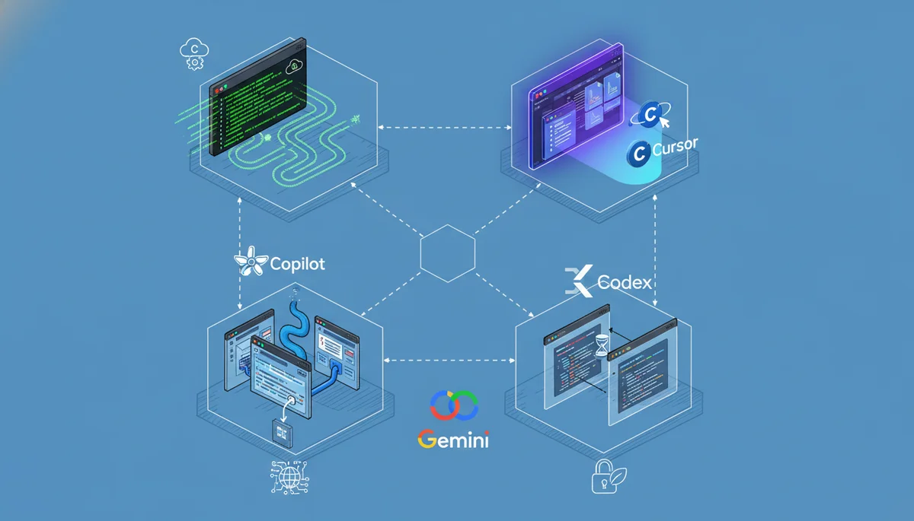
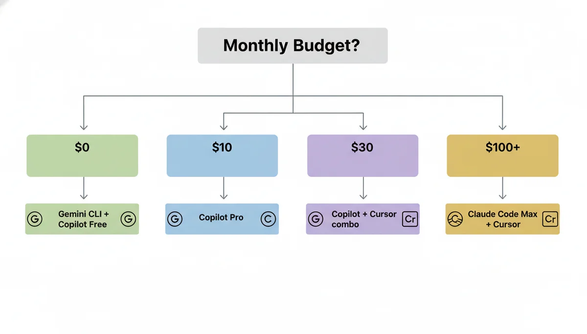

+++
date = '2026-04-03T10:00:00+08:00'
draft = false
title = '5 AI Coding Tools Compared: Why Picking Just One Is the Wrong Question'
description = 'Claude Code, Cursor, Copilot, Codex CLI, and Gemini CLI after 8 months of daily use. The $30/month combo that beats the $200/month single tool. Real benchmarks, honest limitations, and the decision framework I actually use.'
toc = true
tags = ['Claude Code', 'Cursor', 'GitHub Copilot', 'Codex CLI', 'Gemini CLI', 'AI Coding Tools']
keywords = ['claude code vs cursor vs copilot 2026', 'best AI coding tool 2026', 'codex cli review', 'gemini cli review', 'AI coding tools comparison', 'cursor composer 2 kimi', 'claude code pricing']

[[params.faqItems]]
question = "Which AI coding tool is the best in 2026?"
answer = "There is no single best tool. Survey data shows top developers use 2.3 tools on average. Claude Code wins at complex refactoring, Cursor at daily editing, Copilot at IDE breadth, Gemini CLI at free-tier generosity, and Codex CLI at code review. A $30/month combo of Copilot Pro + Cursor Pro outperforms a $200/month single-tool subscription for most workflows."

[[params.faqItems]]
question = "Is Gemini CLI really free?"
answer = "Yes. With a personal Google account, Gemini CLI provides 1,000 requests per day and 60 per minute using Gemini 2.5 Pro with a 1 million token context window — at zero cost. This is more generous than Claude Pro at $20/month. The catch: its ecosystem and community are far less mature than Claude Code's."

[[params.faqItems]]
question = "What is the Kimi K2.5 controversy with Cursor?"
answer = "Cursor's Composer 2 model is built on Moonshot AI's open-source Kimi K2.5 from China. Cursor initially hid this, and a developer discovered it via API config strings. Cursor claims 75% of compute was their own training, but the base model provides the core architecture and coding knowledge. The Kimi K2.5 license requires attribution above $20M monthly revenue — Cursor exceeds $166M/month."

[[params.faqItems]]
question = "How much should I spend on AI coding tools per month?"
answer = "Most developers get the best ROI at $30-40/month combining two tools: Copilot Pro ($10) + Cursor Pro ($20) for daily work, adding Claude Code only when you need heavy refactoring. Spending $200/month on a single tool makes sense only if you do multi-file autonomous coding for 4+ hours daily."

[[params.faqItems]]
question = "Should I use Codex CLI or Claude Code?"
answer = "Codex CLI is faster but shallower — great for code review, catching bugs, and straightforward implementations. Claude Code is slower but deeper — better for complex refactoring, architectural decisions, and tasks requiring 100K+ token context. If you only pick one terminal agent, Claude Code. If you want speed for reviews, add Codex."
+++

Asking "which AI coding tool is the best" in 2026 is like asking whether a hammer is better than a screwdriver. The question reveals a misunderstanding of the problem.

I have used all five major AI coding tools — Claude Code, Cursor, GitHub Copilot, OpenAI's Codex CLI, and Google's Gemini CLI — daily for the past eight months across three production codebases. The conclusion that surprised me most: **the developers shipping the fastest are not the ones with the most expensive tool. They are the ones who figured out which two tools to combine.**

Survey data backs this up: top developers in 2026 use an average of 2.3 AI coding tools. Not one. Not five. Two, maybe three, each covering what the others cannot.

This article is not a feature checklist. It is the decision framework I actually use, built on real usage data, honest about each tool's fatal flaw, and specific enough that you will know exactly what to buy (and what to skip) by the end.

## Five Philosophies, Not Five Products

Before comparing features, understand that these tools are built on fundamentally incompatible beliefs about how AI should help developers:

| Tool | Core Belief | Interface | Bet |
|------|------------|-----------|-----|
| **Claude Code** | AI should be an autonomous agent | Terminal CLI | The AI operates at system level, not inside your editor |
| **Cursor** | AI should be woven into every keystroke | VS Code fork | The editor IS the AI |
| **Copilot** | AI should meet developers where they are | Plugin for any IDE | Maximum reach, minimum disruption |
| **Codex CLI** | AI should work in sandboxed parallel tasks | Terminal + cloud sandbox | Multiple agents running simultaneously on branches |
| **Gemini CLI** | AI should be free and open source | Terminal CLI (open source) | Google's ecosystem and 1M token context as the moat |

These are not just product differences. They are worldview differences. Cursor thinks the IDE is the center of development. Claude Code thinks the terminal is. Copilot thinks neither should change. Understanding this explains why no single tool wins everything.

## The Benchmark Myth: Why the Numbers Lie

Let me be direct about something the marketing materials will not tell you.

**SWE-bench Verified scores in April 2026:**

| Model | Score |
|-------|-------|
| Claude Opus 4.6 | 80.8% |
| Gemini 3.1 Pro | 80.6% |
| GPT-5.2 | 80.0% |
| Cursor Composer 2 | 73.7% (SWE-bench Multilingual) |

The difference between 80.8% and 80.0% is 0.8 percentage points. In practice, you cannot feel this difference on any individual task. **OpenAI has stopped reporting SWE-bench Verified scores entirely** because their own audit found that frontier models can memorize gold patches from the training data. The benchmark is partially broken.

What actually matters is not the model — it is the harness around it. [Harness engineering](/posts/ai/2026-03-30-harness-engineering-guide/) determines whether the same model produces great code or garbage. LangChain proved this when they jumped from #30 to #5 on TerminalBench without changing their model.

So stop choosing tools based on which model they use. Choose based on which workflow they enable.

## Where Each Tool Actually Wins (and Where It Fails)

I am not going to give each tool equal treatment. That would be dishonest. Some tools are genuinely better in more situations than others.

### Claude Code: The Deep Thinker

**Kills at:** Multi-file refactoring, architectural decisions, security audits, anything requiring 50K+ tokens of context. The 1 million token context window is not a gimmick — it is the only tool that can hold an entire medium-sized codebase in memory simultaneously.

**Fatal flaw:** It is slow and expensive. A complex refactoring task might take 3-5 minutes of thinking time. At $200/month (Max 20x), you are paying for depth you may only need 20% of the time. Using Claude Code for Tab completion is like using a bulldozer to plant flowers.

**My honest experience:** I reach for Claude Code maybe 5-6 times per day, but those 5-6 times are the moments that matter most — the ones where getting it wrong costs hours of debugging. For everything else, it is overkill.

### Cursor: The Speed Demon

**Kills at:** Daily editing speed. Tab completions are instant. Multi-file inline diffs feel magical. The agent mode handles 80% of routine coding tasks without leaving the editor.

**Fatal flaw:** You are locked into a VS Code fork. If you use JetBrains, Neovim, or Xcode as your primary editor, Cursor does not exist for you. And the Composer 2 transparency issue matters — [Cursor built their flagship model on Kimi K2.5](/posts/ai/2026-04-01-cursor-composer-2-review/) from Moonshot AI without disclosure, then claimed "75% of compute was ours" when caught. If a company hides their model's foundation, what else are they not telling you?

**My honest experience:** Cursor is my daily driver for editing. But I trust Claude Code more for anything critical.

### GitHub Copilot: The Swiss Army Knife

**Kills at:** Being everywhere. VS Code, JetBrains, Neovim, Xcode, Eclipse — Copilot works in all of them. At $10/month, the ROI is absurd. The recent addition of Claude Opus 4.6 and Gemini models in Copilot Pro+ means you get multi-model access without switching tools.

**Fatal flaw:** It is a jack of all trades, master of none. Copilot's agent mode is real but noticeably weaker than Claude Code or Cursor for autonomous tasks. It completes code well but rarely surprises you with architectural insight.

**My honest experience:** Copilot is the tool I would keep if I could only have one. Not because it is the best at anything, but because it is good enough at everything and works in every editor I use.

### Codex CLI: The Fast Reviewer

**Kills at:** Code review and bug detection. OpenAI's engineers built Codex to catch logical errors, race conditions, and edge cases — and it genuinely does this better than it writes code. The sandboxed execution model means it can run tests safely. GPT-5.2-Codex worked independently for over 7 hours on complex tasks in testing.

**Fatal flaw:** "Fast but shallow" is the community consensus, and I agree. Codex handles straightforward implementations well but breaks on subtle bugs and complex refactors. When it fails, the debugging overhead often exceeds the time you saved. The 30-150 message limit per session burns fast with multi-agent workflows.

**My honest experience:** I use Codex primarily for PR reviews, not for writing code. It catches things I miss. But I would not trust it with a significant refactoring task.

### Gemini CLI: The Free Underdog

**Kills at:** Being free with an enormous context window. 1,000 requests per day, 60 per minute, Gemini 2.5 Pro, 1 million token context — for $0. This is more generous than Claude Pro at $20/month. It is open source, supports MCP, and Google Search grounding gives it access to current information.

**Fatal flaw:** The ecosystem is immature. Community-built MCP servers, skills, and integrations are sparse compared to Claude Code's thriving ecosystem. Gemini 3.1 Pro scores 80.6% on SWE-bench — competitive on paper — but the tooling around it is 12-18 months behind Claude Code.

**My honest experience:** I use Gemini CLI as a research tool — asking questions about codebases, exploring unfamiliar libraries, getting explanations. For autonomous coding tasks, I still reach for Claude Code. But if you are on a budget, Gemini CLI is the most underrated tool in this lineup.

## The Price Reality Check

Here is what most comparison articles will not tell you: **the sticker price is misleading.**

| Tool | Tier | Monthly Cost | What You Actually Get |
|------|------|-------------|----------------------|
| **Copilot** | Free | $0 | 2,000 completions + 50 chats |
| **Copilot** | Pro | $10 | Unlimited completions + agent mode |
| **Gemini CLI** | Free | $0 | 1,000 reqs/day + 1M context |
| **Cursor** | Pro | $20 | 500 fast completions + agent |
| **Claude Code** | Pro | $20 | ~45 messages per 5 hours (runs out in 2 hours of heavy use) |
| **Copilot** | Pro+ | $39 | Claude Opus + higher limits |
| **Cursor** | Pro+ | $60 | More completions + priority |
| **Claude Code** | Max 5x | $100 | ~225 messages per 5 hours |
| **Cursor** | Ultra | $200 | Highest limits |
| **Claude Code** | Max 20x | $200 | ~900 messages per 5 hours |

**My actual monthly spend: $30** (Copilot Pro $10 + Cursor Pro $20), with occasional Claude Code API usage (~$15-20/month on heavy weeks). This $30-50/month combination outperforms any single $200/month subscription for my workflow.

**The $200/month trap:** Unless you are doing autonomous multi-file coding for 4+ hours every day, you are overpaying. Most developers hit diminishing returns around $40-60/month.

## The Decision Framework

Stop thinking "which tool should I use" and start thinking "what do I need to cover":

### By Budget

| Budget | Recommendation | Why |
|--------|---------------|-----|
| $0/month | Gemini CLI + Copilot Free | Best free combo: 1M context + IDE completions |
| $10/month | Copilot Pro | Best single tool for the money, period |
| $30/month | Copilot Pro + Cursor Pro | Covers 90% of use cases |
| $60/month | Copilot Pro+ + Cursor Pro | Multi-model access + best editing |
| $100+/month | Claude Code Max + Cursor Pro | For heavy autonomous coding |

### By Task

| Task | Best Tool | Runner-Up |
|------|-----------|-----------|
| Tab completion | Cursor | Copilot |
| Multi-file refactoring | Claude Code | Cursor Agent |
| Code review | Codex CLI | Claude Code |
| Learning a new codebase | Gemini CLI | Claude Code |
| Quick bug fix | Cursor | Copilot |
| Architecture decisions | Claude Code | (nothing else comes close) |
| CI/CD integration | Copilot | Codex |

### By Editor

| Your Editor | Best Path |
|-------------|-----------|
| VS Code | Cursor (switch) or Copilot (stay) |
| JetBrains | Copilot (only real option) |
| Neovim | Copilot + Claude Code in terminal |
| Xcode | Copilot + Claude Code in terminal |
| Terminal-first | Claude Code + Gemini CLI |

## Three Misconceptions That Cost Developers Money

### Misconception 1: "More expensive = better"

Claude Code at $200/month is not 20x better than Copilot at $10/month. It is better at specific tasks (complex refactoring, architectural reasoning) but worse at others (speed, IDE integration, Tab completion). Most developers who subscribe to Max 20x use maybe 30% of the capacity.

### Misconception 2: "The model is what matters"

Claude Opus 4.6 (80.8%), Gemini 3.1 Pro (80.6%), and GPT-5.2 (80.0%) are all within 1% of each other on SWE-bench. The difference you feel in daily use comes from the **harness** — the tools, context management, and workflow integration around the model. Cursor Composer 2 uses a weaker base model (Kimi K2.5) but its tight IDE integration makes it feel faster than Claude Code for routine tasks.

### Misconception 3: "Free tools are not serious"

Gemini CLI's free tier gives you Gemini 2.5 Pro with a 1 million token context window — the same context size that makes Claude Code special. 1,000 requests per day is more than most developers use. The limitation is not the model or the quota — it is the ecosystem maturity. But that is improving fast.

## My Actual Setup (What I Use Daily)

I will be specific because vague recommendations are useless:

- **Primary editor:** Cursor with Composer 2 for all daily editing
- **Terminal agent:** Claude Code (Pro plan) for refactoring, architecture, and complex debugging
- **IDE fallback:** Copilot Pro in JetBrains when I work on the Java service
- **Research and exploration:** Gemini CLI for asking questions about unfamiliar codebases
- **PR review:** Codex CLI running in background on every PR

Total cost: ~$50/month. This combination covers every scenario I encounter. No single tool at any price point could replace it.

## The Bottom Line

If you take away one thing from this article: **stop looking for the one best tool and start building a workflow that combines two or three.**

The five tools exist because they solve fundamentally different problems. Claude Code cannot replace Copilot's ubiquity. Copilot cannot replace Claude Code's depth. Cursor cannot run outside VS Code. Codex cannot match Claude's reasoning. Gemini cannot match Claude's ecosystem.

Accepting this — and building your stack accordingly — is the real competitive advantage.

## Related Reading

- [Harness Engineering: Why the System Around Your AI Agent Matters More](/posts/ai/2026-03-30-harness-engineering-guide/) — Why the model matters less than the harness
- [Cursor Composer 2: The Kimi K2.5 Controversy](/posts/ai/2026-04-01-cursor-composer-2-review/) — The transparency issue in detail
- [Codex CLI Mastery Guide](/posts/ai/2026-02-12-codex-cli-mastery-guide/) — Getting the most out of Codex
- [Claude Code Complete Guide](/posts/ai/2026-02-28-claude-code-complete-guide/) — Deep dive into Claude Code's capabilities
- [AI Coding Agents Comparison 2026](/posts/ai/2026-03-10-ai-coding-agents-comparison-2026/) — Broader comparison including Windsurf, Kiro, and others
