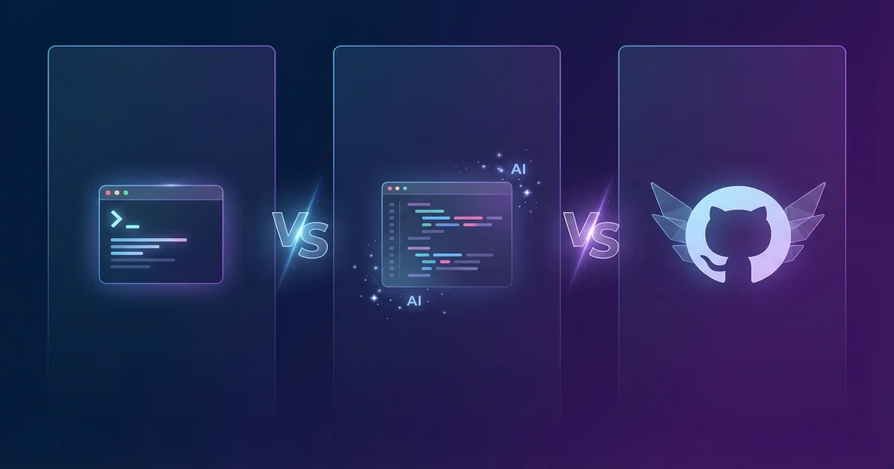

+++
date = '2026-04-03T10:00:00+08:00'
draft = false
title = 'Claude Code、Cursor、Copilot 三强争霸：2026 年该怎么选？'
description = '从国内开发者视角深度对比 Claude Code、Cursor 和 GitHub Copilot。定价分析、基准测试、Kimi K2.5 争议真相，以及不同场景下的工具组合建议。'
toc = true
tags = ['Claude Code', 'Cursor', 'GitHub Copilot', 'AI Coding Tools', 'Comparison']
keywords = ['Claude Code 对比 Cursor', 'Cursor 对比 Copilot', 'AI 编程工具对比', '2026 最好的 AI 编程工具', 'Cursor Kimi K2.5 争议']

[[params.faqItems]]
question = "Claude Code、Cursor 和 Copilot 哪个最好？"
answer = "没有绝对的最好。Claude Code 在多文件重构和复杂推理上遥遥领先；Cursor 的 IDE 一体化体验最顺滑；Copilot 兼容性最广、入门最便宜。2026 年多数专业开发者同时使用两个以上工具。"

[[params.faqItems]]
question = "三个工具加起来要多少钱？"
answer = "最经济的组合：Copilot Free + Cursor Hobby = 0 元。最主流的组合：Cursor Pro（$20）+ Claude Code Max 5x（$100）= $120/月。换算成人民币约 860 元/月，对全职开发者来说，一次复杂重构节省的时间就能回本。"

[[params.faqItems]]
question = "Cursor 的 Composer 2 到底是不是 Kimi K2.5？"
answer = "是的。2026 年 3 月社区在 API 响应中发现了 kimi-k2p5 模型标识符。Cursor 后来承认 Composer 2 基于 Moonshot AI 的 Kimi K2.5 开源模型做了 RL 微调，但声称只有 25% 的算力来自基座模型。争议焦点在于 Kimi K2.5 的许可证要求月收入超 2000 万美元时需要显著标注，而 Cursor 月收入已超 1.66 亿美元。"

[[params.faqItems]]
question = "国内网络能正常用这三个工具吗？"
answer = "GitHub Copilot 在国内可直连使用，体验最稳定。Cursor 需要稳定的国际网络，因为要连接多个模型 API。Claude Code 同样需要国际网络访问 Anthropic API。如果网络条件受限，Copilot 是最可靠的选择。"

[[params.faqItems]]
question = "2026 年 SWE-bench 跑分谁最高？"
answer = "截至 2026 年 3 月：Claude Opus 4.6（Claude Code 背后的模型）得分 80.8%，GPT-5.2（Copilot 可用）80.0%，Cursor Composer 2 在 SWE-bench Multilingual 上 73.7%。但跑分不等于实际体验——上下文窗口、工具链集成、错误恢复能力同样重要。"
+++

2026 年 4 月，AI 编程工具的混战已经收敛到三强格局：**Claude Code**、**Cursor** 和 **GitHub Copilot**。每周都有人问我"到底该用哪个"，而我的回答永远是"看你怎么用"。

这不是一篇功能清单式的对比文章。我用了这三个工具八个月，踩过各种坑，花了不少冤枉钱。这篇文章讲的是：三种完全不同的 AI 编程理念，各自的真实成本，以及什么场景该押注哪个工具。

## 三种理念，三条路线

先别急着比功能。这三个工具的底层设计信念就不一样：

| 工具 | 设计理念 | 使用方式 | 核心赌注 |
|------|---------|---------|---------|
| **Claude Code** | 终端原生 Agent | 命令行 | AI 应该在系统层面运作，不应被编辑器限制 |
| **Cursor** | IDE 原生 AI | VS Code 魔改版 | AI 应该融入编辑器的每个操作 |
| **GitHub Copilot** | 万能插件 | 各种 IDE 的扩展 | AI 应该去开发者已经在的地方 |

**Claude Code** 的逻辑是：最强的 AI 编程体验应该是一个自主 Agent——它能读你的整个代码库，跑命令，改文件，自我纠错——全程在终端完成。它不在乎你用什么编辑器。

**Cursor** 的逻辑是：最好的 AI 编程体验应该在 IDE 里面——行内补全、多文件编辑、Agent 模式，全部嵌入编辑器。它 fork 了 VS Code，从底层围绕 AI 重建。

**GitHub Copilot** 的逻辑是：大多数开发者不会换 IDE。它支持 VS Code、JetBrains 全家桶、Neovim、Xcode、Eclipse。用最广的兼容性换最大的市场覆盖。

三种思路都有道理，关键看你的工作方式。

## 定价：算笔明白账

官网的价格表好看，但真实开销是另一回事。

### GitHub Copilot

| 方案 | 月费 | 你得到什么 |
|------|------|----------|
| Free | 免费 | 2000 次补全/月，50 条对话 |
| Pro | $10 | 无限补全，300 次高级请求 |
| Pro+ | $39 | 1500 次高级请求，全模型（Claude Opus 4、o3） |
| Business | $19/人 | 团队管理，SSO |
| Enterprise | $39/人 | 自定义模型，审计日志 |

**重度用户的真实花费**：$10-39/月。免费版对学生和业余项目足够了。Pro 是大多数个人开发者的甜点。Pro+ 只有你经常需要 Opus 级模型才值得。

### Cursor

| 方案 | 月费 | 你得到什么 |
|------|------|----------|
| Hobby | 免费 | 有限的补全和 Agent 请求 |
| Pro | $20 | $20 额度池，前沿模型，MCP，云 Agent |
| Pro+ | $60 | 3 倍额度（$60 池） |
| Ultra | $200 | 10 倍额度，优先体验 |
| Teams | $40/人 | SSO，管理后台 |

**重度用户的真实花费**：$20-60/月。2025 年中 Cursor 改成了额度制，Auto 模式（Cursor 自己的模型路由）在付费方案里不限量。手动选 Claude Sonnet 或 GPT-4 才从额度池扣钱。多数 Pro 用户 $20 额度够用——除非你一天 Agent 模式开七八个小时。

### Claude Code

| 方案 | 月费 | 你得到什么 |
|------|------|----------|
| Pro | $20 | 基础 Claude Code，标准限速 |
| Max 5x | $100 | 5 倍 Token 配额（~88K tokens/5 小时窗口） |
| Max 20x | $200 | 20 倍 Token 配额（~220K tokens/5 小时窗口） |

**重度用户的真实花费**：$100-200/月。Claude Code Pro（$20）只够轻度使用——每天大概 30-60 分钟的 Agent 编程就会碰限速。每天重度使用的开发者几乎都升级到 Max 5x（$100）。这是 AI 编程工具里性价比飞跃最大的一次升级。

### 实际月度预算参考

| 开发者类型 | 推荐组合 | 月费 | 人民币约 |
|-----------|---------|------|---------|
| 学生/业余 | Copilot Free + Cursor Hobby | $0 | 0 |
| 普通开发者 | Copilot Pro + Cursor Pro | $30 | ¥215 |
| 重度用户（主流选择） | Cursor Pro + Claude Code Max 5x | $120 | ¥860 |
| 高强度自主编程 | Cursor Pro + Claude Code Max 20x | $220 | ¥1,580 |
| 团队（每人） | Copilot Business + Cursor Teams | $59 | ¥425 |

2026 年专业开发者最常见的组合是 **Cursor Pro + Claude Code Max 5x**，月费 $120。Cursor 负责日常编辑，Claude Code 负责啃硬骨头。更多关于 Claude Code 与 Copilot 搭配使用的分析，可以看我们的 [Claude Code vs Copilot 深度对比](/posts/ai/2026-03-05-claude-code-vs-copilot/)。

## 跑分对比：2026 年 3 月数据

跑分不能代表一切，但能建立一个基线：

### SWE-bench Verified（2026 年 3 月）

| 模型/工具 | 得分 | 备注 |
|----------|------|------|
| Claude Opus 4.6（Claude Code） | 80.8% | 总榜第二，仅次于 Opus 4.5 的 80.9% |
| GPT-5.2（Copilot Pro+ 可用） | 80.0% | OpenAI 表现不俗 |
| Gemini 3.1 Pro | 80.6% | Google 最强，Copilot 可用 |
| Claude Sonnet 4.6 | 79.6% | 中端模型逼近旗舰 |
| Cursor Composer 2 | 73.7%* | *SWE-bench Multilingual，不同测试集 |

### 跑分没告诉你的事

SWE-bench 测的是在开源仓库上修 Bug 的能力。它测不了：

- **上下文窗口利用率**——Claude Code 的 100 万 Token 上下文能读懂你整个代码库。Cursor 分块处理。Copilot 被聊天窗口限制。
- **Agent 循环质量**——工具在 10 步以上的任务中如何从错误中恢复、自我纠正。
- **IDE 集成体验**——没有跑分能衡量凌晨三点 Tab 补全的丝滑程度。

想看更多维度的对比，包括 Windsurf、Antigravity 等七个工具的测评，可以看 [2026 年 AI 编程 Agent 全面对比](/posts/ai/2026-03-10-ai-coding-agents-comparison-2026/)。

## Kimi K2.5 事件：Cursor 的信任危机

这件事必须正面讲，因为它直接影响你对工具的信任判断。

### 事情经过

2026 年 3 月 19 日，Cursor 高调发布 Composer 2，号称自研编程模型。三天后，一个开发者在 API 响应中发现了模型标识符：`kimi-k2p5-rl-0317-s515-fast`。

翻译一下：**Composer 2 的基座是 Moonshot AI（月之暗面）的开源模型 Kimi K2.5**。

### Cursor 怎么回应的

Cursor 副总裁 Lee Robinson 承认 Composer 2 确实基于开源模型，但强调"只有约 25% 的算力来自基座模型"，其余是 Cursor 自己的训练。他还表示这是与 Fireworks AI 的合法商业合作。

### 为什么这事很严重

Kimi K2.5 的修改版 MIT 许可证白纸黑字写着：**月收入超过 2000 万美元的产品必须显著标注**。Cursor 的母公司 Anysphere 年收入超过 20 亿美元，月收入超 1.66 亿美元——超过阈值八倍还多。截至 2026 年 4 月，Cursor 的界面上没有任何 Kimi K2.5 的标注。

### 这对选择工具意味着什么

三家公司在透明度上的差异很明显：

- **Anthropic**（Claude Code）：公开模型卡片、系统提示词、详细能力文档。你用的是什么模型，一清二楚。
- **GitHub/Microsoft**（Copilot）：提供模型选择——你选 GPT-4、Claude、Gemini，选什么就跑什么。
- **Cursor**：通过自己的模型路由，你未必知道实际在跑什么模型。Composer 2 是最典型的例子。

如果你在乎"我的代码到底被哪个模型处理"，这是一个真实的差异化因素。如果你只看结果质量，Composer 2 确实好用——争议不影响它的能力。

关于 Composer 2 的技术架构和 Kimi 事件的更多细节，看我们的 [Cursor Composer 2 深度评测](/posts/ai/2026-04-04-cursor-composer-2-review/)。

## 场景对决：谁在什么时候赢

### Claude Code 赢在哪

- **多文件重构**："把这个服务重命名，更新所有导入，修好测试，跑一遍。"一条指令搞定，因为它在文件系统层面操作，100 万 Token 上下文窗口让它看得见全貌。
- **架构决策**："这里该不该用事件溯源？"Claude Code 能读完你整个代码库，理解数据流，给出针对性建议——不是教科书式的泛泛而谈。
- **自主任务执行**："给 API 加分页，更新前端，写测试。"Claude Code 规划、执行、自我纠错、交付。你审核 diff 就行，不用全程盯着。
- **CI/CD 和 DevOps**：在终端里跑构建、跑测试、分析日志、修问题。IDE 工具碰不了这些场景。

想深入了解 Claude Code 的用法，看 [Claude Code 完全指南](/posts/ai/2026-01-14-claude-code-guide/)。

### Cursor 赢在哪

- **日常编码**：行内补全、多光标 AI 编辑，打字—接受的自然流畅感无人能敌。感觉你的大脑多了一个预读缓冲区。
- **快速原型**："做一个 React 组件实现 X 功能。"Composer 模式生成，你预览，你迭代。反馈循环以秒计。
- **团队协作**：Cursor Rules 文件、共享模型配置、统一的 IDE 体验——比终端工具更容易统一团队。
- **多模型灵活性**：在同一界面里切换 Claude、GPT、Gemini 和 Composer 2。没有其他工具有这种广度。

关于 Cursor 的最佳实践，看 [Cursor Agent 最佳实践指南](/posts/ai/2026-01-19-cursor-agent-best-practices/)。

### GitHub Copilot 赢在哪

- **你不想换 IDE**：用 JetBrains？Neovim？Xcode？Copilot 是唯一在所有这些环境里都能跑的 AI 助手。
- **预算有限**：$10/月无限补全，AI 编程入门性价比之王。学生和初级开发者的第一选择。
- **GitHub 原生工作流**：Copilot 和 Issues、PR、Actions 深度集成。如果你的团队活在 GitHub 生态里，Copilot Agent 模式能自动处理 Issue。
- **企业合规**：审计日志、IP 保障、SOC 2。Copilot 是最容易过安全和法务审批的选择。
- **国内网络友好**：三个工具里，Copilot 是唯一不需要额外网络配置就能直连使用的。

## 各自的软肋

讲完优势，必须讲劣势，否则这篇文章就没有价值。

### Claude Code 的短板

- **贵**。Max 20x 月费 $200，是三者中最贵的。而且你还可能碰限速。
- **没有 IDE 集成**。纯终端操作。想要打字时的行内补全？对不起，它不提供。
- **学习曲线**。终端优先的方式让习惯 GUI 的开发者不适应。没有预览面板，没有可视化。

### Cursor 的短板

- **VS Code 绑定**。Cursor 是 VS Code 的 fork。你用 IntelliJ、PyCharm、GoLand？那意味着要换掉整个开发环境。
- **透明度问题**。Kimi K2.5 事件伤害了信任。用"Auto"模式时，你不总是知道哪个模型在处理你的代码。
- **额度焦虑**。额度制意味着重度用户时刻在心里算剩多少钱。任务做到一半额度用完，体验很差。

### GitHub Copilot 的短板

- **Agent 能力偏弱**。Copilot 的自主编程能力落后 Claude Code 和 Cursor 至少半年。多文件自主编辑不够可靠。
- **高级请求限制**。Pro 方案 300 次高级请求看着多，用 Agent 模式一天就烧完。
- **依赖外部模型**。Copilot 的质量完全取决于你选的第三方模型。它没有自己的前沿模型。

## 我的实际工作流

单工具思维已经过时了。这是我真实的一天：

**上午深度工作（Claude Code）**：复杂任务——重构一个模块、从设计文档实现新功能、排查棘手的生产问题。我描述问题，Claude Code 规划执行。我审核结果。

**白天编码（Cursor）**：写新代码、迭代实现、快速修复。Cursor 的行内补全和 Composer 模式让我保持心流状态。需要换个模型视角时，侧边栏一键切换。

**代码评审和 GitHub 工作流（Copilot）**：PR 评审、Issue 分类、快速理解不熟悉的代码。Copilot 的 GitHub 集成意味着这些任务不需要离开浏览器。

这套三件套组合月费 $140（Cursor Pro + Claude Code Max 5x + Copilot Free）。听着不少，但换算一下：Claude Code 20 分钟完成的复杂重构，手动做要 3-4 小时。一次就回本。

## 选择决策树

还是拿不定主意？按这个来：

1. **学生或业余开发者？** Copilot Free + Cursor Hobby。费用：0。
2. **主要在 IDE 里写代码？** Cursor Pro 做主力。加 Copilot Pro（$10）做备用补全。
3. **每天都有复杂的多文件任务？** 加 Claude Code Max 5x（$100）。这是其他工具做不到的事。
4. **离不开 JetBrains 或 Xcode？** Copilot Pro+（$39）是你的最佳选择。Cursor 和 Claude Code 不在这些 IDE 里跑。
5. **团队需要企业级功能？** Copilot Enterprise 或 Cursor Teams。Claude Code 的团队功能还在成熟中。
6. **在乎 AI 模型透明度？** Claude Code > Copilot > Cursor。

## 下半年会怎样

几个我认为大概率会发生的事：

- **Claude Code** 会推出某种形式的 IDE 集成（可能是 VS Code 扩展），补上最大短板
- **Cursor** 必须正面回应透明度问题，竞争对手不会放过这一点
- **GitHub Copilot** 会大幅提升 Agent 能力——微软的资源保证了这一点
- **Google Antigravity 的免费策略**会迫使三家都提供更大方的免费版
- **双工具组合**会成为行业标准——开发者会为一个 IDE 工具 + 一个终端 Agent 做预算

最好的工具是适合你的工作方式的那个。对 2026 年 4 月的大多数专业开发者来说，答案是 Cursor 负责日常编辑 + Claude Code 负责重活。但这个领域每个季度都在变，适合你的答案取决于跑分衡量不了的因素。

---

*最后更新：2026 年 4 月 4 日。定价和跑分基于截稿时的数据。更广泛的对比（包括 Windsurf、Antigravity、Kiro、Codex CLI）请看 [2026 年 AI 编程 Agent 七工具全面对比](/posts/ai/2026-03-10-ai-coding-agents-comparison-2026/)。*
