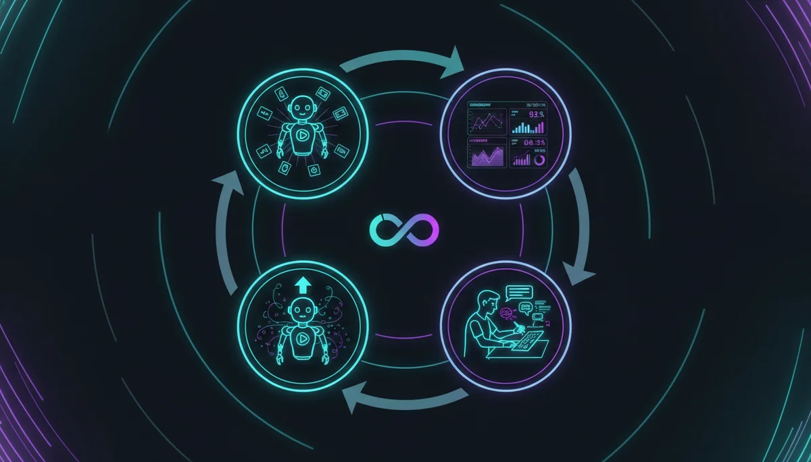
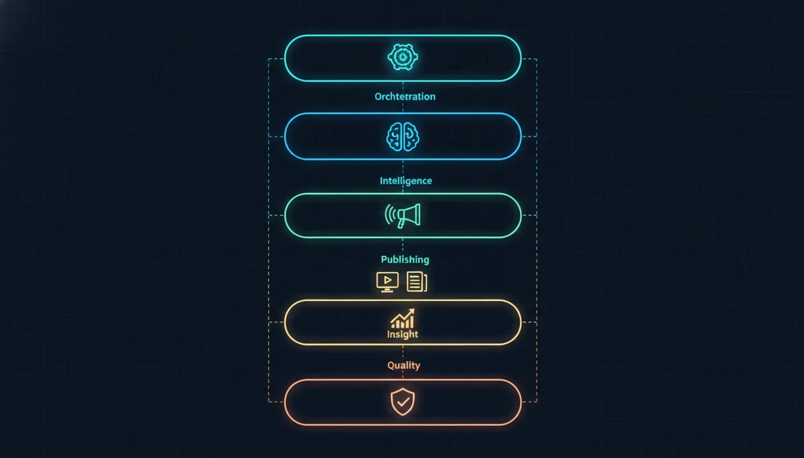
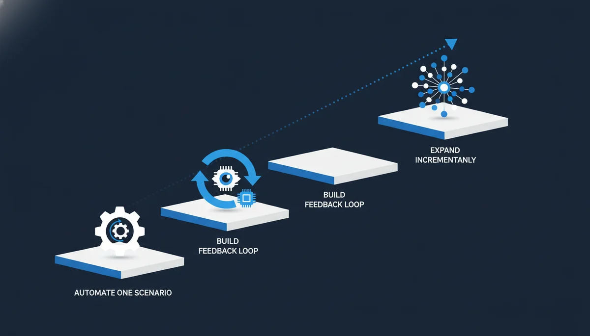

+++
date = '2026-04-04T18:00:00+08:00'
draft = false
title = '一个人+AI Agent 月增 2000 客户：Paperclip 营销自动化实战拆解'
description = 'AI Agent 营销自动化实战：Postiz 创始人用 Paperclip + Claude Code 搭起 4 个 AI 员工的虚拟营销部，一个人月增 2000 客户、MRR 做到 $45K，API 成本仅 $50-200/月。拆解三条自动化流水线与全自动化的 3 个坑。'
toc = true
tags = ['AI Agent', 'Marketing Automation', 'Paperclip', 'Claude Code', 'Solo Founder']
keywords = ['AI Agent 营销自动化', 'Paperclip 是什么', 'AI 替代营销团队', '一个人创业 AI 工具', 'Skill 系统', 'AI 内容营销', 'Claude Code 营销']

[[params.faqItems]]
question = "Paperclip 是什么工具？"
answer = "Paperclip 是一个开源的 AI Agent 编排平台，你可以在上面创建多个 AI 员工（基于 Claude Code 等），给他们分配角色、目标和定时任务，让整个团队自动运转。2026 年 3 月上线，3 周内 GitHub 30K stars。"

[[params.faqItems]]
question = "AI Agent 真的能替代营销团队吗？"
answer = "不能完全替代。AI 擅长量产（社媒排期、趋势追踪、SEO 文章生成），但品牌策略、危机公关、需要情感共鸣的内容仍然需要人。正确模式是 AI 负责量产、人类负责品控。Nevo David 自己也说：别指望 AI 视频会爆火。"

[[params.faqItems]]
question = "非技术创始人能用 Paperclip 吗？"
answer = "有门槛。Paperclip 需要自己部署 Node.js 服务，配置 Skill 和 Routine。非技术创始人可以先从 Postiz 这类 SaaS 工具入手做社媒自动化，等有技术合伙人再考虑 Paperclip 级别的编排。"

[[params.faqItems]]
question = "AI 生成的内容直接发布会有什么问题？"
answer = "会有信任惩罚。University of Florida 研究表明，消费者知道内容是 AI 生成后，信任度下降、互动变弱、甚至产生道德厌恶。多个大品牌因 AI 广告被嘲讽 AI slop 而遭用户抵制。建议所有 AI 内容必须经过人工审核和润色。"

[[params.faqItems]]
question = "搭建 AI 营销自动化大概需要多少成本？"
answer = "Nevo 的全套栈主体是开源免费的（Paperclip + Postiz 开源版）。核心成本是 Claude API 调用费，根据内容量大约 $50-200/月。对比雇一个营销人员每月 $3000-8000，ROI 非常高——前提是你有能力搭建和维护工作流。"
+++

一个人的"营销部"，月增 2000 客户，MRR 做到 $45K。这不是融了几千万的团队，是一个创始人加一个刚招的 DevRel，外加四个"永不下班"的 AI 员工。

Postiz 创始人 Nevo David 上个月在 X 上发了一篇长文，记录了他怎么用 Paperclip（一个开源 AI Agent 编排平台）接管了整个营销部门。他说体验"像是违法的"。我仔细拆解了他的做法后发现，最值得学的不是他用了什么工具，而是他怎么把这些工具**编排**成一台自动运转的机器。

这篇文章不是 Paperclip 教程，而是从 Nevo 的案例中提炼出**你今天就能用的编排思路**——即使你不用 Paperclip，换成任何其他 Agent 平台，核心逻辑都一样。

## 从"个人助手"到"虚拟团队"：AI 用法正在发生质变

2026 年初，AI 助手赛道爆发。[OpenClaw](/posts/ai/2026-02-12-openclaw-usage-tutorial/) 能连 Telegram、操控电脑，从回邮件到砍健身房会费无所不能。这类工具的核心逻辑是把你的各种服务"挂"到一个 AI 上，让它替你跑日常事务。

但 Nevo 很快撞上了一堵墙：OpenClaw 是**一对一**的——"我指挥 AI 干活"。可如果他想让 AI 生成 TikTok 视频，然后 DevRel 在上面加评论改进呢？如果他想让多个 AI 之间互相传递任务呢？

这就是"一对一"和"多对多"的本质区别。一对一就像一个老板带着一个全能秘书，秘书很能干但只听你一个人的。多对多则像一个真正的团队——AI 和人之间的任务是双向流动的，甚至 AI 可以反过来给你布置任务："这条视频数据很好，建议追加同类内容"。

我自己在[搭建博客自动化工作流](/posts/ai/2026-03-30-harness-engineering-guide/)的过程中也有同样的感受。当你只有一个 AI 帮你写文章的时候，它是工具。当你有一个 AI 写文章、一个 AI 生成封面图、一个 AI 做 SEO 分析、一个 AI 分发到各平台，而且它们之间能互相传递上下文和结果——这就不是工具了，这是一支团队。

从 Copilot 到 Agent，AI 的自主权在急剧增长。ChatGPT 时代是"我说一句，你做一步"。现在的 AI Agent 是"我定个目标，你自己安排工作，每天自动跑，遇到问题来问我"。这个转变，是理解 Nevo 整个案例的前提。

## Nevo 的三条自动化流水线

Nevo 搭了三条并行的自动化流水线，分别解决拉新、留存和 SEO 三个问题。三条线共享同一个底层逻辑：**把重复性的内容生产从人工转移到 AI，人类只负责策略和审核。**

### 第一条线：TikTok 内容工厂

这条线最能体现 AI Agent 编排的威力。他在 Paperclip 里创建了一个 CMO Agent，给了这样一条指令：

> 查最新健身 TikTok 趋势 → 用 agent-media 生成视频或用 Larry 做轮播 → 通过 Postiz 排期发布 → 每个视频开一个 issue 跟踪

注意最后那句"每个视频开一个 issue"。这不是随便加的。

这里说的 issue，就是 GitHub Issues——你可以把它理解成一个"工单系统"。具体流程是这样的：AI 每生成一个视频，就自动开一个 issue（相当于建一个工单），标题类似"健身视频 #37 - HIIT 入门"。然后 Paperclip 的定时任务每天跑一次，把每个视频的播放数据（播放量、完播率等）自动写到对应 issue 的评论里。Nevo 或他的 DevRel 看到数据后，在 issue 下面加批注——"这个开头太慢了"、"BGM 不对"、"竖屏构图再调调"。AI 下次生成视频时，会读取这些 issue 里的历史评论，学到"上次哪些好、哪些差"，下一批就更好。

通俗打个比方：AI 是个实习生，issue 就是他的工作日志。每做完一件事就记一笔，老板看完在下面批注。实习生下次干活前先翻翻之前的批注，就不会重复犯错。没有这个系统会怎样？AI 跑了 100 个视频，但完全不知道哪些好哪些差——因为它没有记忆。每次都从零开始，永远停在"第一天实习生"的水平。

这里最聪明的设计是什么？是那个 **issue 系统形成了人机协作的飞轮**：AI 生成 → 数据反馈 → 人工点评 → AI 学习 → 下一轮更好。第一批视频可能很粗糙，但第十批就会像样得多。这和我在博客运营中用的思路完全一样——我给 [blog-writer Skill](/posts/ai/2026-01-08-claudecode-skill-guide/) 加了"逐段打磨"机制，AI 写完一段就自检一段，不合格就当场重写，而不是一口气生成全文。

不过 Nevo 也诚实地说了：别指望这些 AI 生成的视频会爆火——"如果这么容易，每个人都能做了。"关键是**量**。一个人要做一周的内容量，AI 几分钟搞定。省下来的时间，用来做真正需要人类创意的事。轮播图他建议不要直接自动发，而是手动配音乐再发。这说明他很清楚 AI 的天花板在哪里。

### 第二条线：GitHub Commits 驱动留存

Nevo 说了一句大实话："如果用户不流失，Postiz 早该赚几百万了。"做过 SaaS 的人都懂——**留存永远比拉新重要**。

他的做法特别巧：用 GitHub commits 驱动产品更新通知。流程是这样的——

1. 把 Discord、Telegram、Slack、MailChimp 等渠道都连上 Postiz
2. 给 Claude Code 装上 GitHub Skill
3. 创建 Routine：每天检查最新 commits，识别值得公告的功能更新
4. AI 写完公告后先提交给 Nevo 过目（保留了人工审核环节），然后推送到所有渠道

这个场景的精妙之处在于：**触发源是研发行为本身**。只要工程师在正常写代码、正常提交，营销那边就自动跟上。研发和营销之间的信息差，被 AI Agent 抹平了。我之前做产品的时候，最头疼的就是"新功能做完了但忘了告诉用户"。工程师觉得发布了就完事了，但用户根本不知道你上了什么新东西。

### 第三条线：SEO 内容自动化

同样的思路做 SEO：GitHub 有新 commits → AI 提取功能更新 → 传给 distribb 生成 SEO 优化文章 → 发布到 WordPress。

Nevo 特别建议用 distribb 这类专业服务而不是直接让 AI 写文章，原因很实在：distribb 会帮你做关键词密度、文章结构、meta tags、内链外链——这些你让通用 AI 做很难做到位。他甚至写了一个 WordPress Skill，用 wp-json API 直接操作 WordPress 后台，连管理界面都不用打开。

这里有一个判断我认为非常正确：**AI 擅长的是"从结构化信息生成内容"，而不是"从零创造有灵魂的内容"**。把 AI 放对位置，让专业工具干专业的事，这才是高效的做法。我自己的 [博客增长实践](/posts/ai/2026-03-10-ai-coding-agents-comparison-2026/) 也印证了这一点——AI 生成的初稿必须经过人工的判断框架和逐段打磨，否则出来的就是千篇一律的"AI 味"文章。

## Nevo 的 6 层工具栈：可组合的乐高架构

把 Nevo 的工具栈拆开看，会发现一个很清晰的分层架构：

| 层级 | 工具 | 角色 |
|------|------|------|
| **编排层** | Paperclip | Agent 调度、任务分配、Routine 管理 |
| **智能层** | Claude Code | 底层推理引擎 |
| **发布层** | Postiz | 社媒排期发布 |
| **内容层** | agent-media / Larry / distribb | 视频、轮播、SEO 文章生成 |
| **洞察层** | Virlo | 趋势监测 |
| **质量层** | GStack | 文案去 AI 味 |

这套架构最有意思的特点是**可组合性**——每一层都可以独立替换。不想用 Postiz 发帖？换 Buffer。不想用 distribb 做 SEO？换自己的方案。底层模型从 Claude 换成 GPT？改个配置就行。像乐高积木一样，每一块可以独立替换，但组合在一起就是一台完整的机器。

而 Paperclip 的 Routine 系统就是把所有积木固定在一起的底板。没有 Routine，每次都要手动触发 Agent；有了 Routine，整个流程就像上了发条一样自动运转。

这让我想到一个更深层的观察：在 AI Agent 领域，[线束（Harness）比模型重要](/posts/ai/2026-03-30-harness-engineering-guide/)。LangChain 不换模型只改 Harness，就从 TerminalBench 第 30 名升到第 5 名。Nevo 的 6 层架构本质上就是一个精心设计的 Harness——Claude Code 只是其中一层，真正决定效果的是外面那 5 层的编排。

## Skill 系统：AI 世界的 App Store

Nevo 用了一个很形象的比喻：

> Skill 就像黑客帝国里 Neo 学功夫——一个 Markdown 文件喂进去，Agent 瞬间就会了。

安装方式一行命令：`npx skills add gitroomhq/postiz-agent`。Nevo 装了 Postiz（社媒排期）、agent-media（UGC 图片）、Larry（TikTok 轮播）、Virlo（趋势监测）、GStack（去 AI 味）这几个核心 Skill。

这里有一个趋势值得关注：**Skill 正在变成 AI Agent 世界的 App Store**。Nevo 在文末呼吁大家在评论区提交自己的 SaaS Skill，他会测试后加到 Paperclip 里。这种社区驱动的 Skill 生态，和十年前手机 App 生态的早期一模一样。

我自己的博客运营也深度依赖 [Skill 系统](/posts/ai/2026-04-02-mcp-vs-skills-claude-code/)——blog-writer、blog-cover-image、blog-illustrator、blog-growth 这些 Skill 串联起来，就是一条从选题到发布的完整流水线。Skill 本质上是给 AI 喂一份"操作手册"，你喂得越细，AI 干活越靠谱。

不过 Nevo 也提到了一个小痛点：Paperclip 的 Skill 需要给每个 Agent 单独安装，没有"全局 Skill"的概念。他的解决方案是直接把 Skill 装在 Claude Code 上，这样所有 Agent 都能自动继承。这个 workaround 很实用，说明平台还在成熟中。

他还提到 MCP（Model Context Protocol）作为 Skill 的替代方案。如果某个服务没有现成的 Skill，可以通过 [MCP 连接](/posts/ai/2026-04-02-mcp-vs-skills-claude-code/)。两种方式各有优势：Skill 更轻量、更容易分享；MCP 更标准化、连接更多外部服务。

## 全自动化的三个坑

分析完 Nevo 的成功经验，我也要诚实地指出全自动化的几个陷阱——这些不是理论推测，是真实发生过的问题。

### 坑一：没有反馈循环的 AI 会重复犯错

Nevo 的 issue 系统是整个架构的命脉。如果没有这个环节——AI 跑了一百个视频，根本不知道哪些好哪些差，只会重复犯同样的错误。我见过太多人搭了 AI 自动化流程，但不建反馈机制，结果 AI 产出的内容质量永远停在第一天的水平。

反馈循环不需要很复杂。最简单的方式：每个 AI 产出物对应一个跟踪记录（issue、Notion 页面、甚至 Google Sheet 一行），人工定期打分+评论。AI 下次执行时读取这些反馈。这就够了。

### 坑二：AI 内容直接发布的信任惩罚

University of Florida 2026 年 3 月的研究显示：消费者知道内容是 AI 生成后，不仅信任度下降，还会产生"道德厌恶"（moral disgust）。多个大品牌的 AI 广告被用户嘲讽为"AI slop"，评论区充满抵制声音。

在一项大规模研究中，AI 生成的内容在 109 万次展示中仅获得 1,381 次点击——CTR 只有 0.13%。这比我博客优化前 0.33% 的 CTR 还低一倍多。

Nevo 其实做对了一件事：他给关键环节保留了审批（留存通知先过目再发），轮播图建议手动配音乐。这不是多余的步骤，而是质量的生命线。**AI 负责量产，人类负责品控**——这才是正确的人机协作方式。

### 坑三：多 Agent 失控

Paperclip 的一个已知问题是：当多个 Agent 同时运行且没有良好的任务隔离时，可能出现两个 Agent 做同一件事、或者 Agent 陷入递归循环疯狂烧 API 的情况。据报告，曾有案例在 4 小时内产生了 40,000 次 API 调用。

Paperclip 通过原子化的 task checkout 和预算控制来缓解这个问题，但这也意味着你需要花时间做好 Agent 的职责划分和预算上限设置。这不是装上就能跑的工具，需要持续调优。

## 你今天就能开始的 3 步

不需要等到搭好 Paperclip 的完整架构。从最小可行的自动化开始：

**第一步：选一个场景自动化**

我推荐从"GitHub commits → 产品更新推送"开始。原因：触发源明确（commit 就是触发器）、输出格式标准（一段公告文字）、风险最低（加个审核环节就行）。

如果你没有产品，从"每周自动生成行业趋势摘要发到社交媒体"开始也可以。关键是**只选一个场景**，不要一上来就全自动化。

**第二步：建反馈循环**

给你的 AI 产出物建一个跟踪系统。可以简单到一个 Google Sheet：日期、内容标题、AI 产出质量评分（1-5 分）、改进建议。AI 下次执行时带上这些历史数据。

Nevo 用 issue 系统做这件事，你也可以用 Notion、Linear、甚至 GitHub Issues。形式不重要，关键是形成**人审 → AI 学 → 下次更好**的闭环。

**第三步：逐步扩展**

第一条自动化线跑稳了（至少 2 周），再加第二条。三条线都稳定了，再考虑用 Paperclip 这类编排平台统一管理。

从简单到复杂的路径：单个 AI 脚本 → n8n/Zapier 工作流 → Claude Code + Skill → Paperclip 编排平台。每一步都比上一步复杂一个数量级，确保你在每一层都站稳了再往上走。

## 什么不该交给 AI

最后说说边界。以下这些事情，2026 年的 AI 做不好，强行自动化会出大问题：

- **品牌定位和战略**——AI 能执行你的策略，但不能替你想策略。"我们是什么品牌"这个问题只有人能回答
- **危机公关**——需要情商、判断力和对人性的理解，AI 在这方面是负分
- **需要真实情感的内容**——用户能分辨出"真人分享的故事"和"AI 编的故事"，后者会触发信任惩罚
- **法律和合规相关**——AI 幻觉在这个领域的代价是灾难级的

Nevo 的聪明之处在于，他很清楚地画了这条线：AI 做 80% 的苦力活（内容量产、排期、监测），人做 20% 真正需要灵感的事。这个比例对大多数创始人来说是合理的。

## 2026 年的营销部，只有两种形态

一种是 10 个人的传统团队，一种是 1 个人 + AI Agent 团队。

但请注意——后者不是"不需要人"，而是"人的角色变了"。你不再写帖子、剪视频、排日程。你审核 AI 写的帖子、给 AI 剪的视频打分、调整 AI 排的日程。从"执行者"变成"品控者"，这不是偷懒，这是效率。

而真正稀缺的能力，不是会用哪个 AI 工具，而是**编排能力**——知道把哪些 AI 组合成什么流程、在哪里保留人工、怎么设计反馈循环。Nevo 的优势不在于他写了多好的代码，而在于他知道怎么把 Paperclip + Postiz + 一堆 Skill 组合成一台自动运转的营销机器。

这种编排能力，会成为未来创始人的核心竞争力。

## 相关阅读

- [Harness Engineering：Agent 外围系统比模型更重要](/posts/ai/2026-03-30-harness-engineering-guide/)
- [MCP vs Skills：Claude Code 两种扩展方式怎么选](/posts/ai/2026-04-02-mcp-vs-skills-claude-code/)
- [OpenClaw 使用教程](/posts/ai/2026-02-12-openclaw-usage-tutorial/)
- [Claude Code Skill 开发指南](/posts/ai/2026-01-08-claudecode-skill-guide/)
- [5 款 AI 编程工具实测对比](/posts/ai/2026-04-03-claude-code-vs-cursor-vs-copilot/)

**相关资源：**
- [Paperclip 官方网站](https://paperclip.ing/)
- [Paperclip GitHub 仓库](https://github.com/paperclipai/paperclip)
- [Postiz 社交媒体平台](https://postiz.com/)
- [Nevo David 原文（X）](https://x.com/wickedguro/status/2039344437374156948)
