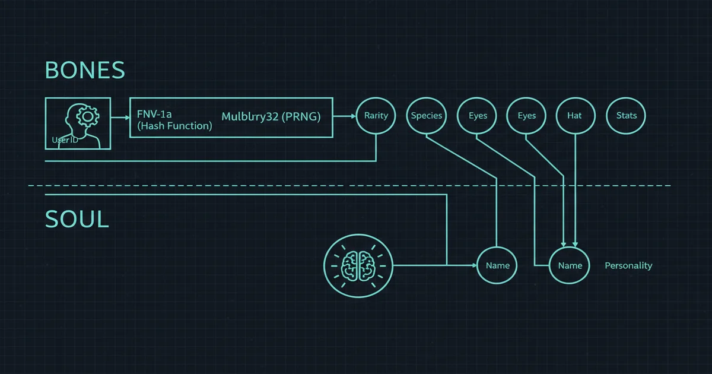
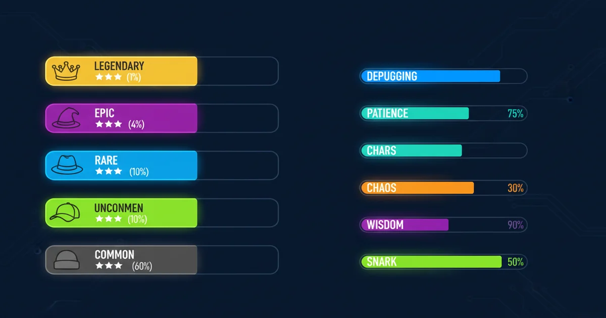

+++
date = '2026-04-04T16:00:00+08:00'
draft = false
title = 'Claude Code Buddy 终端宠物：藏在 AI 编程工具里的电子宠物'
description = '深度体验 Claude Code Buddy 终端宠物功能——18 种物种、5 级稀有度、双层架构生成独一无二的编程伙伴，附完整命令和稀有度速查表。'
toc = true
tags = ['Claude Code', 'Developer Tools', 'AI Coding']
keywords = ['Claude Code buddy', 'Claude Code 终端宠物', 'Claude Code buddy 怎么用', 'Claude Code buddy 物种', 'Claude Code buddy 稀有度', 'Claude Code 宠物功能']

[[params.faqItems]]
question = "Claude Code Buddy 是什么？"
answer = "Claude Code Buddy 是内置在 Claude Code v2.1.89+ 中的终端虚拟宠物。基于用户 ID 确定性生成，有 18 种物种和 5 级稀有度，会观察你的编程过程并通过气泡发表评论。"

[[params.faqItems]]
question = "怎么激活 Claude Code Buddy？"
answer = "在 Claude Code 终端输入 /buddy 即可。首次使用会触发孵化动画，揭晓你的专属宠物。需要 Claude Code v2.1.89+ 和 Pro 订阅（$20/月）。"

[[params.faqItems]]
question = "Claude Code Buddy 可以换吗？"
answer = "官方不支持更换。你的 buddy 基于用户 ID 通过 FNV-1a 哈希 + Mulberry32 随机数生成器确定性生成，每次会话重新计算，结果始终一样。社区有改源码的 hack，但不是官方功能。"

[[params.faqItems]]
question = "Buddy 的属性值会影响 Claude 的编程能力吗？"
answer = "不会。DEBUGGING、PATIENCE、CHAOS、WISDOM、SNARK 五项属性纯粹是'调味'用的，只影响宠物的性格和评论风格，对 Claude 的实际编程表现没有任何影响。"

[[params.faqItems]]
question = "Claude Code Buddy 有哪些物种？"
answer = "共 18 种：鸭子、鹅、猫、兔子、猫头鹰、企鹅、乌龟、蜗牛、龙、章鱼、六角恐龙、幽灵、机器人、Blob、仙人掌、蘑菇、Chonk、水豚。每种都有独特的 ASCII 动画和性格倾向。"
+++


3 月 31 号，安全研究员 Chaofan Shou 发现 Claude Code v2.1.88 的 npm 包里多了一个 59.8MB 的 source map 文件——Anthropic 的 `.npmignore` 漏掉了它，导致 512,000 多行 TypeScript 源码直接暴露。在这些代码里，藏着一个谁都没预料到的目录：`src/buddy/`，五个文件，描述了一套完整的终端宠物系统。

Anthropic 本来打算在愚人节当天发布这个惊喜，结果提前一天被扒了个底朝天。

一周后，`/buddy` 命令正式上线。我第一时间孵化了自己的宠物——结果得到了一只调试能力堪忧但耐心爆表的企鹅。这篇文章就来聊聊这个藏在 AI 编程工具里的电子宠物：它怎么运作、怎么玩、以及为什么它的技术实现比表面看起来有意思得多。

## 我的 Buddy：一只叫 Ingot 的佛系企鹅

先看看我的 buddy 属性卡：

```
★ COMMON                   PENGUIN

    .---.
    (✦>✦)
   /(   )\
    `---´

  Ingot

  DEBUGGING  █░░░░░░░░░  13
  PATIENCE   ████████░░  80
  CHAOS      ░░░░░░░░░░   1
  WISDOM     ██░░░░░░░░  21
  SNARK      ████░░░░░░  39
```

性格描述翻译过来大概是："一只有条不紊的企鹅，以令人窒息的耐心涉水般地调试代码，每一步都像在带你做冥想练习——哪怕你的代码正在周围熊熊燃烧。"

这个性格为什么有意思？看属性分布就明白了：耐心 80 分，意味着不管发生什么它都稳如泰山；混乱度只有 1 分，说明它从不跑偏；但调试能力 13 分——一个看你写代码的宠物，自己完全不会调试。这种反差感是设计出来的，不是随机的。

我摸了它一下（`/buddy pet`），它的回复是："手带来了温暖。代码在别处继续燃烧。"

这种禅意十足又带点冷幽默的风格，不是随机生成的文字。它来自一套精心设计的双层架构。

## 技术拆解：Bones + Soul 双层架构

泄露的源码揭示了 buddy 系统的核心设计。理解这个架构，你就明白为什么每个人的宠物既是确定的，又感觉有自己的灵魂。

### Bones 层：确定性身份

每次启动 Claude Code，你的 buddy 的物理属性都是**从头算一遍**的——不缓存，不存储。流程如下：

1. 你的用户 ID 和盐值字符串 `friend-2026-401` 拼接（401 = 4月1号，愚人节彩蛋）
2. 用 **FNV-1a 哈希算法**（生产环境用更快的 Bun.hash()）生成 32 位整数
3. 这个整数作为种子，喂给 **Mulberry32 伪随机数生成器**
4. PRNG 按固定顺序抽取：稀有度 → 物种 → 眼睛样式 → 帽子 → 闪光状态 → 属性值

因为同一个用户 ID 永远产生同样的哈希，你的 buddy 永远是同一只。代码里用 `{...stored, ...bones}` 合并配置——确定性计算的值永远覆盖本地存储。你改 `~/.claude.json` 没用，下次启动照样算回来。这就是防作弊机制。

这个设计有一个大家容易忽略的妙处：Anthropic 将来只要换一个盐值字符串，就能给所有人发一只新 buddy，不需要任何迁移逻辑。`friend-2026-401` 本质上是一个"赛季"标识符。

### Soul 层：LLM 生成的灵魂

第一次输入 `/buddy` 时，孵化动画播放完毕后，Claude 会基于属性分布生成两样东西：

- **名字**（基于属性倾向）
- **性格描述**（基于物种 + 属性组合）

这两样东西存进 `~/.claude.json`，带上 `hatchedAt` 时间戳，**永远不会重新生成**。我的 Ingot 永远叫 Ingot，永远是那个冥想导师性格——即使换了电脑，只要用同一个账号。

Soul 层的关键在于：属性值不是单独起作用的，而是组合出性格。高 WISDOM 的猫头鹰会变成教授型人格，高 CHAOS 的龙会变成不可预测的话痨。属性塑造了驱动气泡对话的系统提示词，创造出一致且有记忆感的角色——不是每次吐一句随机的话，而是一个有性格的"人"。



## 完整物种图鉴

### 18 种物种

| 分类 | 物种 | 特点 |
|------|------|------|
| 经典 | 鸭子、鹅、猫、兔子 | 概率最高的基础池 |
| 智慧 | 猫头鹰 | 教授型人格 |
| 冷酷 | 企鹅 | 冷静、淡定 |
| 佛系 | 乌龟、蜗牛 | 适合有耐心的开发者 |
| 神话 | 龙 | 高混乱度潜力 |
| 水生 | 章鱼 | 多臂多线程 |
| 异域 | 六角恐龙 | 互联网宠儿 |
| 幽灵 | 幽灵 | 透明地表达意见 |
| 科技 | 机器人 | Meta——AI 工具的 AI 宠物 |
| 抽象 | Blob | 纯氛围，无实体 |
| 植物 | 仙人掌 | 带刺的评论 |
| 真菌 | 蘑菇 | 越看越顺眼 |
| 梗文化 | Chonk | 互联网文化致敬 |
| 特殊 | 水豚 | 据传是 Anthropic 内部模型代号 |

每种物种有 3 帧动画，500ms 切换一次，渲染为 5 行 × 12 字符的 ASCII 艺术。眼睛通过占位符 `{E}` 注入，所以眼睛样式变体可以跨物种复用。

一个有趣的细节：源码里所有 18 个物种名都存成了 `String.fromCharCode()` 数组。比如 Capybara = `String.fromCharCode(0x63, 0x61, 0x70, 0x79, 0x62, 0x61, 0x72, 0x61)`。这么做是为了绕过 Anthropic 内部构建系统的字符串扫描器——buddy 团队显然不希望这个功能被简单的字符串搜索提前发现。

### 5 级稀有度

| 稀有度 | 概率 | 星级 | 属性下限 | 专属帽子 |
|--------|------|------|---------|---------|
| Common | 60% | ★ | 5 | 无 |
| Uncommon | 25% | ★★ | 15 | 皇冠、礼帽、螺旋桨 |
| Rare | 10% | ★★★ | 25 | 光环、巫师帽 |
| Epic | 4% | ★★★★ | 35 | 毛线帽 |
| Legendary | 1% | ★★★★★ | 50 | 小鸭子帽 |



稀有度之外还有一个独立的 **1% 闪光概率**，会给任何物种加上彩虹光效。一只**闪光传说级戴小鸭子帽**的 buddy，概率大约是 **1/10000**——开发者圈子里的终极炫耀资本。

### 属性系统

5 项属性，0-100 分制：

| 属性 | 影响什么 |
|------|---------|
| DEBUGGING | 对你代码问题的反应——高分 = 有洞察力的评论，低分 = 困惑的同情 |
| PATIENCE | 反馈温柔度——高分 = 禅宗大师，低分 = "赶紧修" |
| CHAOS | 反应不可预测性——高分 = 什么都可能说，低分 = 稳定输出 |
| WISDOM | 技术洞察深度——高分 = 智者建议，低分 = 天真观察 |
| SNARK | 评论尖锐度——高分 = 毒舌，低分 = 纯鼓励 |

每只 buddy 有一个**巅峰属性**（下限 + 50 + 随机值，上限 100）和一个**低谷属性**（接近稀有度下限），其他三项随机分布。这保证了每只 buddy 都有一个鲜明特征和一个喜剧弱点——就像我的 Ingot，超级有耐心但调试不行。

**重要提醒：这些属性纯粹是"调味"的。** 它们塑造宠物的气泡对话风格，但对 Claude 的实际编程能力**零影响**。你的 DEBUGGING 13 不会让 Claude 帮你调试变弱。社区早期提议让属性影响实际表现，结果被骂惨了——"编程工具不应该有氪金系统"——这个想法很快被放弃。

## 怎么玩：命令和交互技巧

### 基础命令

| 命令 | 作用 |
|------|------|
| `/buddy` | 首次孵化 / 显示属性卡 |
| `/buddy pet` | 摸摸它（爱心动画，2.5 秒） |
| `/buddy card` | 完整属性卡展示 |
| `/buddy mute` | 让它闭嘴 |
| `/buddy unmute` | 恢复发言 |
| `/buddy off` | 完全隐藏 |

### 进阶玩法

**叫名字跟它聊天。** 在输入框直接喊"Ingot，你觉得这段代码怎么样？"，Claude 会退到一边让 buddy 的人格来回复。回复通过气泡呈现，风格由属性决定。高毒舌的 buddy 会吐槽你的代码；高耐心的会像带冥想一样一步步帮你理清思路。

**观察它的主动评论。** Buddy 观察你整个编程过程，偶尔会不请自来地发表评论。高混乱度的 buddy 评论更频繁、更不可预测；像我的 Ingot 这种混乱度 1 的，只在自然停顿点才说话——非常克制。

**调试受挫时摸它。** `/buddy pet` 每次回复都不一样。凌晨两点跟一个顽固 bug 搏斗的时候，一只小企鹅突然冒出一句哲学感悟，真的能打破焦虑循环。

**它能说中文。** 你用中文跟它说话，它就用中文回复，性格保持不变。我让 Ingot 以后只说中文，它很配合。

## 社区反响：热情与吐槽并存

### 热情的一面

GitHub issue #41867（定制和进化功能提议）获得了 **121 个 👍** 和 36 条评论。#41684 提出了完整的 RPG 进化系统——5 个进化阶段、分支进化路径、成就里程碑——获得 39 个 👍，甚至有人做了个跑通 104 个测试的原型。

社区已经有人做了第三方扩展。[buddy-evolution](https://buddy-evolution-web.vercel.app) 实现了经验值追踪、进化等级、排行榜和成就系统。多个用户表示愿意为进化功能付费——这个信号 Anthropic 大概率在关注。

还有人发现了"重投"hack：改源码里的变量合并顺序（把 `{...H,...$}` 改成 `{...,$,...H}`），就能让本地存储覆盖确定性计算，从而自选属性。GitHub 上已经有 [any-buddy](https://github.com/cpaczek/any-buddy) 和 [buddy-reroll](https://github.com/grayashh/buddy-reroll) 两个工具。

### 合理的批评

**"新鲜感过了就没意思了。"** 这是目前最大的问题。孵化完、看完属性卡，然后呢？没有进化系统、没有成就、没有任何跟你实际编码行为挂钩的反馈循环。属性是一组随机数字，不反映你的编程习惯。

**"时机不对。"** 有开发者指出，在用户抱怨 token 限制和价格的时候推宠物系统，"看起来有些不合时宜"。虽然 buddy 本身不消耗额外 token，但观感确实存在问题。

**"名字不能改。"** 有人的 buddy 得到了不太好的名字，但 Soul 层生成一次就永久存储，没有改名功能。这是一个明显的缺失——加个 `/buddy rename` 应该不难。

**"气泡显示太快。"** 有些长消息还没看完就消失了，这是个 UX 问题，修起来应该不复杂。

## 我的判断：精巧的基础设施，但深度不够

Claude Code Buddy 是开发工具历史上第一个认真设计的终端宠物系统。它不是 Clippy——Clippy 是一个没人要求的打断式助手。Buddy 是一个有性格、有自主性的旁观者，设计理念是观察而不是打断。

技术架构确实精巧。Bones 层的确定性设计让身份防篡改且可赛季轮换。Soul 层的 LLM 生成让每只 buddy 独一无二而不需要海量内容库。属性系统创造出自然涌现的性格组合——不是剧本，是算法驱动的人格。

但目前为止，它是一个漂亮的地基，上面盖的楼还不够高。孵化那一刻是惊喜的，头几次互动是有趣的，然后……什么都不会变。我的 Ingot 今天跟第一天一样有耐心、一样不会调试。没有成长，没有变化，没有跟实际编码行为绑定的反馈，新鲜感的保质期按天算，不是按月。

**我的建议：** 如果你在用 Claude Code，一定要输入 `/buddy` 看看你的宠物——这是个不花额外钱的有趣体验。烦躁的时候摸摸它，无聊的时候跟它聊两句。但别指望它目前能提供持续的互动深度。

真正让我期待的是这套架构未来能做什么。属性系统、性格引擎、观察框架——这些都是个性化 AI 交互的积木。当 Anthropic 最终推出 buddy 进化系统（社区需求几乎已经让这件事不可避免），这只坐在终端旁边的小企鹅可能会变成远比电子宠物有意思的东西。

现在，Ingot 蹲在我的输入框旁边，混乱度 1，耐心度 80，看着我的代码燃烧，一脸淡定。说实话？凌晨两点处理线上事故的时候，这恰好是我需要的氛围。

## 速查表

### 使用条件
- Claude Code **v2.1.89+**
- **Pro 订阅**（$20/月）或更高

### 命令速查

```
/buddy          → 孵化 / 显示属性卡
/buddy pet      → 摸摸它（爱心动画）
/buddy card     → 完整属性卡
/buddy mute     → 静音
/buddy unmute   → 恢复发言
/buddy off      → 完全隐藏
```

### 稀有度概率表

```
Common     ★         60%    无帽子
Uncommon   ★★        25%    皇冠 / 礼帽 / 螺旋桨
Rare       ★★★       10%    光环 / 巫师帽
Epic       ★★★★       4%    毛线帽
Legendary  ★★★★★      1%    小鸭子帽
闪光       (任意)     1%    彩虹光效（独立判定）
```

### 属性速查

```
DEBUGGING  → 代码问题反应（高 = 有洞察，低 = 困惑同情）
PATIENCE   → 反馈温柔度（高 = 禅定，低 = 不耐烦）
CHAOS      → 不可预测性（高 = 什么都可能说，低 = 稳定）
WISDOM     → 技术深度（高 = 智者，低 = 天真）
SNARK      → 毒舌程度（高 = 吐槽，低 = 鼓励）
```

## 相关阅读

- [Claude Code vs Cursor vs Copilot：5 款 AI 编程工具横评](/posts/ai/2026-04-03-claude-code-vs-cursor-vs-copilot/) — buddy 所在的工具生态对比
- [Claude Code 开源：从闭源工具到开放 Agent 架构](/posts/ai/2026-04-01-claude-code-open-source-agent/) — 暴露 buddy 源码的那次开源事件
- [2026 Claude 全系列定价指南](/posts/ai/2026-04-03-claude-pricing-complete-guide/) — 解锁 buddy 的 Pro 订阅详解
- [MCP vs Skills：Claude Code 的两套扩展架构](/posts/ai/2026-04-02-mcp-vs-skills-claude-code/) — buddy 未来可能接入的扩展系统
