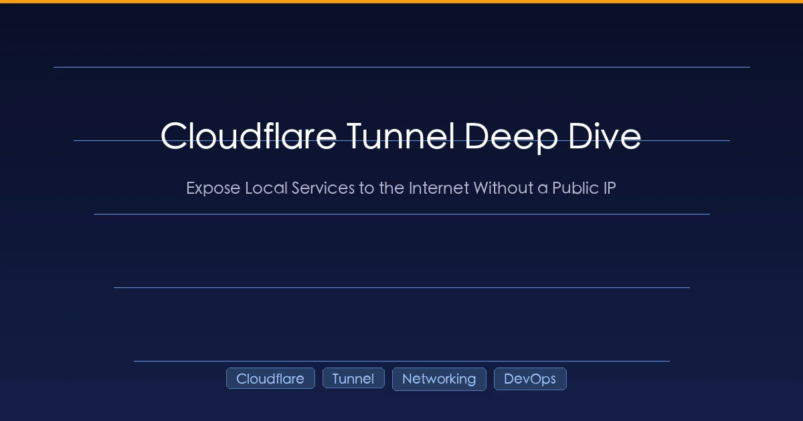

+++
date = '2026-04-04T00:30:00+08:00'
draft = false
title = 'Expose Localhost to the Internet: SSH Tunnels, frp, and Cloudflare Tunnel'
description = 'Three battle-tested ways to expose local dev services to the internet without a public IP — SSH reverse tunnels, frp, and Cloudflare Tunnel. Full setup guides, architecture deep dives, and a practical comparison.'
toc = true
tags = ['Cloudflare', 'Networking', 'DevOps', 'Tunneling']
keywords = ['expose localhost', 'Cloudflare Tunnel', 'SSH reverse tunnel', 'frp tunnel', 'ngrok alternative', 'NAT traversal', 'internal network penetration']
+++



Last week I needed a colleague overseas to test a feature running on my local machine. My laptop had no public IP, sat behind a home router's NAT, and I wasn't about to open port forwards on a network I share with my family. Sounds familiar?

This problem — making a local service reachable from the public internet — comes up constantly in software development. Webhook testing, mobile QA on real devices, client demos, cross-region collaboration. The need is universal, yet the networking reality makes it surprisingly hard.

I've spent the past few years working with three different approaches to solve this, each with distinct trade-offs. This article walks through all three — not as a shallow comparison, but with the full architecture, complete setup steps, and the gotchas I ran into along the way.

## The Problem: Why Your Localhost Can't Be Reached

The root cause is NAT (Network Address Translation). Your ISP assigns your router a public IP address (or worse, a shared one via CGNAT), and your router assigns private addresses like `192.168.x.x` to each device. When traffic arrives at your router from the internet, it has no idea which internal device should receive it — unless you've explicitly configured port forwarding.

Port forwarding technically works, but it has serious practical issues: you need admin access to the router, a static IP from your ISP (most don't offer this), and you're punching a hole in your firewall that stays open 24/7. For a development use case, this is overkill and a security risk.

The elegant solution to this problem is **reverse tunneling** — instead of waiting for inbound connections (which NAT blocks), your machine initiates an outbound connection to a relay, and the relay forwards traffic back through that established connection. All three approaches in this article use this principle, but they implement it very differently.

## Three Approaches at a Glance

Before diving into the details, here's the landscape:

| Approach | Core idea | What you need |
|----------|-----------|---------------|
| **SSH Reverse Tunnel** | Use SSH's built-in `-R` flag to create a tunnel through a public server | A VPS with a public IP |
| **frp** | A dedicated self-hosted tunneling daemon with multi-protocol support | A VPS with a public IP |
| **Cloudflare Tunnel** | A managed tunnel service that uses Cloudflare's global CDN as the relay | A domain on Cloudflare (free) |

The first two require you to own or rent a public server. The third doesn't. But each excels in different scenarios, and understanding why will save you from picking the wrong tool.

## Approach 1: SSH Reverse Tunnel

SSH is the Swiss Army knife of server management, and its reverse tunnel feature is one of its most underrated capabilities. If you already have a VPS, this approach requires zero additional software.

### The Mechanism

When you run a normal SSH connection (`ssh user@server`), your machine connects outward to the server. The connection is bidirectional — data flows both ways. The `-R` flag tells SSH to also listen on a port **on the server side** and forward any traffic it receives back through the SSH connection to your local machine.

```
┌──────────────┐                    ┌──────────────┐
│ Your Machine │──── SSH (outbound) ──→│ Public Server │
│ localhost:8080│←── traffic flows ←──│ :8080 (listen)│
└──────────────┘   back through the  └──────────────┘
                   same connection         ↑
                                     Users connect here
```

The beautiful part: **your machine never needs a public IP.** It initiates the connection outward (which NAT allows), and then traffic piggybacks on that same connection in reverse. It's like making a phone call — you don't need a listed number to dial someone, and once the call connects, both sides can talk.

### Complete Setup

**Step 1: Open the reverse tunnel**

On your local machine:

```bash
ssh -R 8080:127.0.0.1:8080 user@server-ip
```

This maps port 8080 on the server to port 8080 on your local machine. As long as the SSH session is alive, any request to `server-ip:8080` gets forwarded to `localhost:8080` on your laptop.

Add keep-alive parameters to prevent idle disconnections:

```bash
ssh -R 8080:127.0.0.1:8080 \
    -o ServerAliveInterval=60 \
    -o ServerAliveCountMax=3 \
    user@server-ip
```

**Step 2: Set up Nginx on the server for domain-based access**

Raw IP + port works for quick tests, but for anything serious you'll want a proper domain with HTTPS. Configure Nginx on the server:

```nginx
server {
    listen 80;
    server_name app.example.com;

    location / {
        proxy_pass http://127.0.0.1:8080;
        proxy_set_header Host $host;
        proxy_set_header X-Real-IP $remote_addr;
        proxy_set_header X-Forwarded-Proto $scheme;
        proxy_set_header X-Forwarded-For $proxy_add_x_forwarded_for;

        # WebSocket support (needed for Vite HMR, Socket.IO, etc.)
        proxy_http_version 1.1;
        proxy_set_header Upgrade $http_upgrade;
        proxy_set_header Connection "upgrade";
    }
}
```

Add HTTPS with Let's Encrypt:

```bash
sudo certbot --nginx -d app.example.com
```

**Step 3: Point DNS**

Create an A record: `app.example.com → server-ip`

**Step 4: Verify the full chain**

```
User visits https://app.example.com
  → DNS resolves to your server
  → Nginx receives the request, proxies to 127.0.0.1:8080
  → SSH tunnel carries the request to your laptop's port 8080
  → Local service responds, data flows back through the same path
```

### The Achilles' Heel: Connection Stability

SSH tunnels are fragile. A network hiccup, a laptop sleep cycle, a router reboot — any of these kills the tunnel silently. You won't know it's dead until someone reports your site is down.

The standard fix is `autossh`, a wrapper that monitors the SSH connection and restarts it when it dies:

```bash
brew install autossh    # macOS
sudo apt install autossh  # Ubuntu

autossh -M 20000 -R 8080:127.0.0.1:8080 \
    -o ServerAliveInterval=60 \
    -o ServerAliveCountMax=3 \
    -N user@server-ip
```

The `-M 20000` flag creates a monitoring channel on port 20000. `autossh` sends heartbeats through it and restarts the tunnel if they stop arriving. The `-N` flag skips opening a shell (we only need the tunnel, not an interactive session).

This works, but it's a band-aid. SSH was designed for interactive sessions, not persistent infrastructure tunnels. Which brings us to a tool that was.

### When to Use SSH Tunnels

- You already have a VPS and don't want to install anything else
- Quick, temporary access — "let me show you this for 10 minutes"
- You need to tunnel non-HTTP protocols (SSH natively supports TCP)
- Your environment restricts what software you can install

## Approach 2: frp (Fast Reverse Proxy)

Where SSH tunnels are a repurposed tool, [frp](https://github.com/fatedier/frp) is purpose-built for this exact problem. It's a self-hosted reverse proxy that supports HTTP, HTTPS, TCP, UDP, and even peer-to-peer connections. It's been around since 2017, has 90k+ GitHub stars, and is widely used in production by DevOps teams who want full control over their tunneling infrastructure.

### Architecture

frp uses a client-server model:

- **frps** (server): Runs on your public VPS, accepts client connections, listens for incoming traffic
- **frpc** (client): Runs on your local machine, connects out to frps, registers which local services to expose

```
┌──────────────┐                    ┌──────────────┐
│ Your Machine │──── frp tunnel ──→ │ Public Server │
│  frpc        │    (persistent)    │  frps        │
│ localhost:8080│←── traffic ←──────│ :80 (vhost)  │
└──────────────┘                    └──────────────┘
                                          ↑
                                    Users connect here
```

Unlike SSH, frp is designed for persistent connections from the ground up. It handles reconnection, multiplexing, and protocol negotiation natively.

### Complete Setup

**Step 1: Deploy frps on your public server**

Download frp from [GitHub releases](https://github.com/fatedier/frp/releases) and create the server configuration:

```toml
# frps.toml
bindPort = 7000
vhostHTTPPort = 80
vhostHTTPSPort = 443
```

Three lines. `bindPort` is where frpc connects. `vhostHTTPPort` and `vhostHTTPSPort` are where user traffic arrives.

Start it:

```bash
./frps -c frps.toml
```

**Step 2: Configure frpc on your local machine**

```toml
# frpc.toml
serverAddr = "server-ip"
serverPort = 7000

[[proxies]]
name = "web-frontend"
type = "http"
localPort = 8080
customDomains = ["app.example.com"]

[[proxies]]
name = "web-api"
type = "http"
localPort = 3000
customDomains = ["api.example.com"]
```

Start it:

```bash
./frpc -c frpc.toml
```

**Step 3: Point DNS**

Create A records for your domains pointing to the server's IP:

```
app.example.com → server-ip
api.example.com → server-ip
```

That's it. `http://app.example.com` now reaches your local port 8080.

### Adding HTTPS

You have two options. The simpler one is putting Nginx in front of frps and letting Nginx handle TLS termination — the same pattern as the SSH approach. The alternative is frp's built-in HTTPS plugin:

```toml
[[proxies]]
name = "web-https"
type = "https"
customDomains = ["app.example.com"]

[proxies.plugin]
type = "https2http"
localAddr = "127.0.0.1:8080"
crtPath = "/path/to/cert.pem"
keyPath = "/path/to/key.pem"
```

### The Killer Feature: TCP and UDP Tunneling

This is where frp pulls ahead of both SSH and Cloudflare Tunnel. It can tunnel **any TCP or UDP traffic**, not just HTTP:

```toml
# Expose local SSH for remote access
[[proxies]]
name = "my-ssh"
type = "tcp"
localIP = "127.0.0.1"
localPort = 22
remotePort = 6022

# Expose a game server
[[proxies]]
name = "game-server"
type = "udp"
localIP = "127.0.0.1"
localPort = 27015
remotePort = 27015
```

After this, `ssh -p 6022 user@server-ip` connects directly to your local machine. Database access, Redis, custom TCP protocols — frp handles all of them.

### When to Use frp

- You need TCP or UDP tunneling (databases, SSH, game servers)
- You want full control over the relay infrastructure
- You're running this in a team environment and need custom access controls
- Privacy matters — you don't want traffic routing through a third party

The trade-off is clear: frp gives you more power and control, but you're responsible for maintaining the server, managing TLS certificates, and handling uptime.

## Approach 3: Cloudflare Tunnel

What if you didn't need a server at all?

[Cloudflare Tunnel](https://developers.cloudflare.com/cloudflare-one/networks/connectors/cloudflare-tunnel/) takes the reverse tunnel concept and replaces the "public server" with Cloudflare's global network of 300+ data centers. You run a lightweight daemon called `cloudflared` on your machine, it connects outward to Cloudflare, and Cloudflare handles everything else — DNS, TLS, routing, high availability.

The result: **zero infrastructure to manage, and it's free.**

### How It Works Under the Hood

This is worth understanding in detail, because it explains both the strengths and limitations of this approach.

When `cloudflared` starts, it doesn't open a single connection — it establishes **four persistent, post-quantum encrypted connections** to at least **two distinct Cloudflare data centers**. You can see this in the startup logs:

```
INF Registered tunnel connection connIndex=0 ... location=hkg08
INF Registered tunnel connection connIndex=1 ... location=hkg09
INF Registered tunnel connection connIndex=2 ... location=hkg09
INF Registered tunnel connection connIndex=3 ... location=hkg11
```

Why four connections to two data centers? Redundancy. If one connection drops, three remain. If an entire data center goes offline, the other still serves traffic. This is infrastructure-grade reliability that would cost you significant effort to replicate with SSH or frp.

All four connections are outbound from your machine. Your firewall doesn't need any inbound rules. The connections use TLS 1.3 with post-quantum cryptography — encryption algorithms designed to withstand future quantum computer attacks. You get this by default without configuring anything.

**The request lifecycle:**

```
User visits https://app.example.com
  1. DNS resolves to Cloudflare's Anycast IP (via auto-created CNAME)
  2. Cloudflare's nearest edge node receives the HTTPS request
  3. Cloudflare identifies the tunnel responsible for this hostname
  4. Request is forwarded through the nearest cloudflared connection
  5. cloudflared proxies the request to localhost:8080
  6. Response returns through the same path
```

The user never knows they're talking to a laptop behind NAT. Cloudflare handles TLS termination, so your local service can run plain HTTP — Cloudflare takes care of the certificate.

### Complete Setup

**Prerequisites:** A domain with DNS managed by Cloudflare (the free plan works fine).

**Step 1: Install cloudflared**

```bash
# macOS
brew install cloudflared

# Linux (Debian/Ubuntu)
curl -L https://github.com/cloudflare/cloudflared/releases/latest/download/cloudflared-linux-amd64.deb -o cloudflared.deb
sudo dpkg -i cloudflared.deb

# Windows
winget install --id Cloudflare.cloudflared

# Verify
cloudflared --version
```

**Step 2: Authenticate**

```bash
cloudflared tunnel login
```

A browser window opens. Select the domain you want to use and authorize. This saves a certificate to `~/.cloudflared/cert.pem`.

**Step 3: Create a tunnel**

```bash
cloudflared tunnel create my-tunnel
```

This generates a tunnel UUID and saves credentials to `~/.cloudflared/<UUID>.json`. Think of the UUID as the tunnel's identity — it's a persistent object that exists even when `cloudflared` isn't running.

**Step 4: Write the configuration**

Create `~/.cloudflared/config.yml`:

```yaml
tunnel: <UUID>
credentials-file: /path/to/.cloudflared/<UUID>.json

ingress:
  - hostname: app.example.com
    service: http://localhost:8080
  - hostname: api.example.com
    service: http://localhost:3000
  - service: http_status:404
```

The ingress rules work like a reverse proxy — first match wins. The final catch-all rule is mandatory; it tells Cloudflare what to do with requests that don't match any hostname.

Validate the config:

```bash
cloudflared tunnel ingress validate
```

**Step 5: Set up DNS**

```bash
cloudflared tunnel route dns my-tunnel app.example.com
```

This automatically creates a CNAME record in your Cloudflare DNS: `app.example.com → <UUID>.cfargotunnel.com`. You can also do this manually in the Cloudflare dashboard.

**Step 6: Start the tunnel**

```bash
cloudflared tunnel run my-tunnel
```

Done. `https://app.example.com` now serves your local port 8080, with a valid TLS certificate, through Cloudflare's global network.

### Advanced Configuration

**Fine-tuning ingress rules:**

```yaml
ingress:
  - hostname: app.example.com
    service: http://localhost:8080
    originRequest:
      connectTimeout: 30s
      noTLSVerify: true
      httpHostHeader: app.example.com
      keepAliveConnections: 10
      keepAliveTimeout: 90s
```

**Running as a system service** (auto-start on boot, auto-restart on crash):

```bash
# macOS
sudo cloudflared service install
sudo launchctl start com.cloudflare.cloudflared

# Linux
sudo cloudflared service install
sudo systemctl enable cloudflared
sudo systemctl start cloudflared
```

**Monitoring:** `cloudflared` exposes Prometheus-compatible metrics at `http://127.0.0.1:20241/metrics` by default. Plug this into Grafana for tunnel health dashboards.

**WebSocket support:** Works out of the box. Vite HMR, Socket.IO, and other WebSocket-based tools work through the tunnel without any extra configuration.

### Production-Grade Features

Cloudflare Tunnel isn't just a dev tool. Here's what makes it production-ready:

**High availability with replicas.** Run the same tunnel on multiple machines using the same credentials file:

```bash
# Machine A
cloudflared tunnel run my-tunnel

# Machine B (same credentials)
cloudflared tunnel run my-tunnel
```

Each replica opens four connections. You can run up to 25 replicas (100 connections). Traffic routes to the nearest healthy replica automatically.

**Zero-downtime config updates.** Start a new replica with updated config, wait for it to register, then stop the old one. No dropped requests.

**Access control with Cloudflare Access.** Add authentication in front of your tunnel without touching application code — email OTP, Google/GitHub SSO, IP allowlists, device posture checks. Incredibly useful for exposing internal tools without a VPN.

### When to Use Cloudflare Tunnel

- You don't have (or don't want to maintain) a public server
- You want TLS handled automatically
- You need high availability without building it yourself
- You're already using Cloudflare for DNS
- You want access control without modifying your application

The trade-off: you're routing all traffic through Cloudflare. For most use cases this is fine — they're one of the largest CDN providers in the world. But if you have strict data sovereignty requirements or need TCP/UDP tunneling, this isn't the right fit.

## Real-World Gotchas

Regardless of which approach you choose, there are common pitfalls that will bite you.

### "Blocked request — host not allowed"

Modern dev servers (Vite, Next.js, Webpack Dev Server) reject requests from hostnames they don't recognize. When traffic arrives as `app.example.com` instead of `localhost`, the server returns a 403.

**Vite** — add to `vite.config.ts`:
```typescript
server: {
  allowedHosts: ['app.example.com'],
}
```

**Next.js** — add to `next.config.js`:
```javascript
module.exports = {
  allowedDevOrigins: ['app.example.com'],
}
```

### 502 Bad Gateway (Cloudflare Tunnel)

This means Cloudflare reached `cloudflared` successfully, but `cloudflared` couldn't connect to your local service. Check:

- Is the local service actually running?
- Is the port in `config.yml` correct?
- On some systems, `localhost` and `127.0.0.1` resolve differently — try switching between them

### DNS Timeout Errors (Cloudflare Tunnel)

You might see this during startup:

```
ERR Failed to fetch features error="lookup cfd-features.argotunnel.com: i/o timeout"
```

This is non-fatal. `cloudflared` tries to resolve Cloudflare's internal service discovery domain through your local DNS. If it fails, it just skips optional feature negotiation. The tunnel works fine regardless.

### Performance Considerations

Any tunneling approach adds latency. SSH and frp add one hop (through your server). Cloudflare Tunnel routes through Cloudflare's nearest edge node, which is usually fast but can be slower if the nearest node is far away.

Practical tips for better performance:

- Enable compression on your local server (gzip/brotli)
- For Cloudflare Tunnel, check the `location` field in startup logs — it shows which data center you're connected to
- If you have a VPS geographically close to your users, SSH or frp will likely be faster than routing through Cloudflare
- For static assets, Cloudflare's caching can actually make things faster than a direct connection

## Choosing the Right Tool

After using all three approaches in real projects, here's how I think about the decision:

| Dimension | SSH Tunnel | frp | Cloudflare Tunnel |
|-----------|-----------|-----|-------------------|
| Needs a public server | Yes | Yes | No |
| Extra software | None (SSH built-in) | frps + frpc | cloudflared |
| Auto-reconnect | No (needs autossh) | Built-in | Built-in |
| TLS certificates | Manual | Manual or plugin | Automatic |
| TCP/UDP tunneling | Yes | Yes | HTTP/HTTPS only |
| Multi-service routing | Separate SSH sessions | Single config | Single config |
| Global CDN / edge network | No | No | Yes (300+ cities) |
| Setup complexity | Low | Medium | Medium |
| Ongoing maintenance | Medium (connection fragility) | Medium (server uptime) | Low |
| Cost | VPS ($5-20/mo) | VPS ($5-20/mo) | Free |
| Data sovereignty | Full control | Full control | Through Cloudflare |

**My decision framework:**

- **"I need a URL right now, for 10 minutes"** — SSH reverse tunnel. One command, no setup.
- **"I need TCP/UDP tunneling"** — frp. It's the only option here that handles arbitrary protocols well.
- **"I have a server close to my users"** — SSH or frp. Direct routing beats CDN detours when latency matters.
- **"I want it to just work, permanently, with zero maintenance"** — Cloudflare Tunnel. No server to maintain, no certs to renew, no connections to babysit.
- **"I need full control over the infrastructure"** — frp. Self-hosted, configurable, no third-party dependency.

There's no universally "best" choice. I use SSH tunnels for quick throwaway access, and Cloudflare Tunnel for anything that needs to stay up reliably. frp fills the gap when I need protocols that Cloudflare doesn't support.

## Wrapping Up

The problem of exposing localhost to the internet has been solved many times over, but the solutions sit on a spectrum from minimal (SSH) to managed (Cloudflare). Understanding the trade-offs lets you pick the right tool without over-engineering or under-building.

If you take away one thing from this article: **all three approaches use the same fundamental trick** — your machine connects outward, and traffic flows back through that established connection. The difference is in who manages the relay, how resilient the connection is, and what protocols are supported.

Start with whatever matches your constraints today. You can always switch later — the ingress pattern (reverse proxy → local service) is the same regardless of which tunnel sits in the middle.

## Related Reading

- [Chrome DevTools MCP: AI-Powered Browser Debugging](/posts/ai/2026-03-17-chrome-devtools-mcp-guide/) — Debug web apps with AI assistance
- [Tmux Guide for AI Development](/posts/ai/2026-03-03-tmux-guide-ai-development/) — Terminal multiplexing for dev workflows
- [AI Dev Environment Setup](/posts/ai/2026-03-10-ai-dev-environment-setup/) — Complete setup guide for AI-powered development
- [MCP Protocol Explained](/posts/ai/2026-02-28-mcp-protocol-explained/) — Understanding the Model Context Protocol
