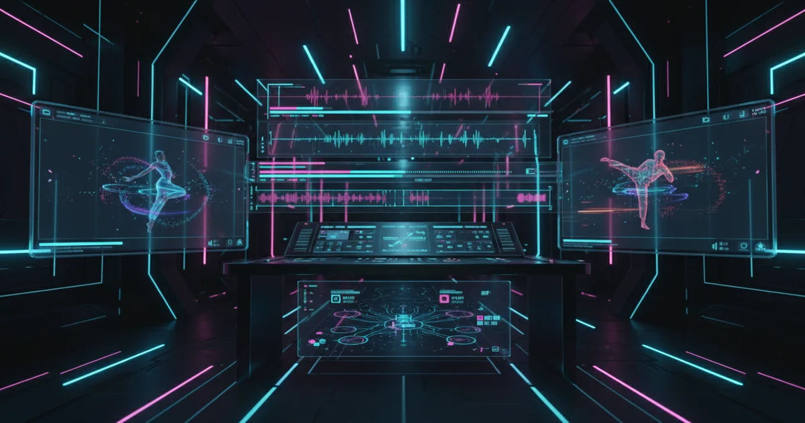

+++
date = '2026-04-04T10:00:00+08:00'
draft = false
title = 'Seedance 2.0 Deep Dive: ByteDance AI Video Model That Tops Sora and Veo'
description = 'Complete guide to ByteDance Seedance 2.0: the #1 ranked AI video model beating Sora 2 and Veo 3. Architecture deep dive, honest quality assessment, step-by-step access guide for international users, and the IP controversy explained.'
toc = true
tags = ['Seedance', 'AI Video', 'ByteDance', 'AI Tools', 'Video Generation']
keywords = ['seedance 2.0', 'bytedance ai video', 'seedance 2.0 review', 'ai video generation 2026', 'seedance vs sora', 'seedance vs veo', 'seedance 2.0 capcut', 'bytedance seedance', 'ai video generator', 'seedance pricing', 'dreamina ai video', 'how to use seedance 2.0']

[[params.faqItems]]
question = "Is Seedance 2.0 free to use?"
answer = "Yes, Seedance 2.0 currently offers free limited-time access globally through CapCut and Dreamina. For API access, pricing is approximately ¥46 per million tokens (about ¥1 or $0.14 per 15-second video). A paid CapCut Pro subscription provides higher usage limits."

[[params.faqItems]]
question = "How does Seedance 2.0 compare to Sora 2 and Veo 3?"
answer = "Seedance 2.0 ranks #1 on the Artificial Analysis text-to-video leaderboard with Elo 1,269, beating Veo 3, Sora 2, and Runway Gen-4.5 in blind evaluation. Its key advantages are native audio-video synchronization and multi-reference input (up to 12 files), though it currently maxes out at 2K resolution while Kling 3.0 supports native 4K."

[[params.faqItems]]
question = "Can I use Seedance 2.0 outside of China?"
answer = "Yes, through two routes. CapCut (available globally on desktop and mobile) added Seedance 2.0 as a free limited-time feature in March 2026 — this is the easiest path for international users with no Chinese phone number needed. Dreamina (dreamina.jianying.com) also works internationally. The VolcEngine API currently requires a Chinese phone number for signup, but BytePlus ModelArk (the international version) is expected to open global API access in Q2 2026."

[[params.faqItems]]
question = "Can I use Seedance 2.0 through an API?"
answer = "Yes. Seedance 2.0 is available through ByteDance's VolcEngine Ark platform (requires Chinese phone number) and will be available via BytePlus ModelArk (international) in Q2 2026. The API supports text, image, video, and audio inputs with up to 12 reference files per request. Pricing is about $0.14 per 15-second clip."
+++



In February 2026, ByteDance released **Seedance 2.0**. Within weeks, it hit **#1 on the Artificial Analysis text-to-video leaderboard** — beating Google Veo 3, OpenAI Sora 2, and Runway Gen-4.5 in blind human evaluation.

If you are reading this from outside China, you have probably heard the buzz but face a wall of confusion: What is Dreamina? What is VolcEngine? Can you even sign up without a Chinese phone number? Is there legal risk from the Disney controversy?

This guide is written specifically for international users. It covers the technical architecture in depth, gives an honest assessment of what works and what does not, provides a step-by-step access guide, and explains the IP controversy so you can make informed decisions.

## First: Understanding ByteDance's AI Ecosystem

This is the biggest barrier for non-Chinese users, so let us clear it up first. ByteDance's AI products form a confusing web of brands. Here is the map:

```
ByteDance (parent company)
├── Seed Team (AI research lab)
│   ├── Seedance 2.0 ← the video model (what this article is about)
│   ├── Seedream ← image generation model
│   └── Seed-TTS ← text-to-speech model
│
├── Consumer Products (where you USE the models)
│   ├── CapCut / 剪映 ← video editor (GLOBAL, English UI)
│   ├── Dreamina / 即梦 / Jimeng ← AI creation platform (GLOBAL, English UI)
│   ├── Doubao / 豆包 ← ChatGPT competitor (China-focused)
│   └── TikTok / 抖音 ← social video (GLOBAL)
│
└── Developer Platforms (where you ACCESS the API)
    ├── VolcEngine / 火山引擎 ← cloud platform (China, Chinese phone required)
    └── BytePlus ← international cloud platform (global API coming Q2 2026)
```

**Why this matters:** When someone says "use Seedance 2.0," they could mean three completely different things:

1. **Use it in CapCut** — easiest for international users, free, no Chinese phone needed
2. **Use it in Dreamina** — more control, still accessible globally
3. **Use the API via VolcEngine** — most powerful, but currently requires Chinese phone number

The model is the same across all three. The access path is different.

## Technical Architecture: Why Joint Generation Is a Real Breakthrough

Most articles describe Seedance 2.0's architecture as "unified multimodal audio-video joint generation" and move on. That phrase actually encodes a fundamental technical decision worth understanding.

### The Problem with Cascade Pipelines

Every other major video model (Sora 2, Runway Gen-4.5) uses what researchers call a **cascade pipeline**:

```
Step 1: Text → Video frames (diffusion model)
Step 2: Video frames → Audio (separate model)
Step 3: Audio + Video → Alignment (post-processing)
```

This approach has three structural problems:

**Problem 1: Information loss at each handoff.** The video model generates frames without knowing what sounds should accompany them. The audio model receives frames without knowing the original intent. Each model only sees the output of the previous step, not the full picture.

**Problem 2: Alignment is always approximate.** Post-hoc lip sync alignment works by detecting mouth shapes in generated video and stretching/compressing audio to match. This creates subtle but perceptible artifacts — the "uncanny valley" of AI video where lips move almost right but not quite.

**Problem 3: No bidirectional influence.** In real video, sound and image influence each other. A character's facial expression changes *because* of the emotion in their voice. A camera cut happens *because* of a musical beat. Cascade pipelines cannot model this bidirectional relationship because each step is unidirectional.

### How Joint Generation Solves This

Seedance 2.0 processes audio and video **in the same forward pass through the same model**:

```
Text + References → [Single Unified Model] → Video frames + Audio waveform
                                               (generated simultaneously)
```

This means:

- **Lip movements are generated *with* the speech**, not aligned after. The model learns the statistical relationship between phonemes and mouth shapes during training, producing them together at inference.
- **Sound effects are causally linked to visual events.** When the model generates a foot hitting the ground, it simultaneously generates the impact sound — because it learned that these co-occur in training data.
- **Music and visual rhythm are co-generated.** Beat drops produce camera cuts. Crescendos produce sweeping camera movements. This is not post-hoc syncing — it is generative correlation.

### The Trade-Off

Joint generation requires **a much larger model** trained on **paired audio-video data** (not just video). This is why it took ByteDance longer to reach this point — curating millions of hours of high-quality paired audio-video training data is expensive and complex.

It also means the model has a harder optimization target: generating two modalities simultaneously means neither reaches the absolute peak quality that a single-modality model could achieve. In practice, Seedance 2.0's video quality without audio consideration would likely be slightly lower than a hypothetical video-only version of the same model. ByteDance accepted this trade-off because the perceptual quality of synchronized audio-video exceeds the sum of its parts.

### The @-Tag Reference System

The second architectural innovation is the multi-reference input system. Instead of a single prompt → single output pipeline, Seedance 2.0 accepts a **composite input** of up to 12 reference files:

| Reference type | Max count | Max size | Purpose |
|----------------|-----------|----------|---------|
| Images | 9 | 30MB each | Character appearance, scene composition, style |
| Videos | 3 | 50MB each, 2-15s total | Camera movement, choreography, motion |
| Audio | 3 | 15MB each, ≤15s | Soundtrack, voiceover, sound effects |

These are referenced in your prompt with `@image1`, `@video1`, `@audio1` tags. The model fuses them into a coherent output:

```
@image1 (a character reference photo — front-facing, clear lighting)
@video1 (a dance choreography clip — 8 seconds)  
@audio1 (a hip-hop beat — 128 BPM)

A hip-hop dancer matching @image1's appearance performs the choreography 
from @video1, perfectly synchronized to the beat of @audio1. 
Urban rooftop at golden hour, drone shot pulling back to reveal cityscape.
```

**Why this matters technically:** Most video models take one image reference at most. The multi-reference system means Seedance 2.0 is not just generating from text — it is *compositing* across modalities. This is a different computational problem that requires attention mechanisms capable of cross-referencing between disparate input types (pixel space for images, temporal sequences for video, spectral features for audio).

**Practical tip:** Reference strength (how closely the output matches references) defaults to around 75%. Set it to 70-80% for natural results. Above 90%, characters look frozen and unnatural. Below 60%, the model drifts too far from references.

## Honest Quality Assessment: What Actually Works

After reading marketing materials and independent evaluations, here is an honest breakdown organized by what you will actually care about.

### What Seedance 2.0 Does Genuinely Well

**Native audio sync.** This is the real competitive moat. Side-by-side with Sora 2, the difference in lip sync quality is immediately visible. Sora 2's lips move in the general vicinity of speech; Seedance 2.0's lips move with the precision of a dubbed film. For any use case where characters speak, this alone justifies choosing Seedance 2.0.

**Multi-shot narrative coherence.** Give Seedance 2.0 a single prompt describing a sequence (establishing shot → dialogue → reaction shot), and it generates multiple connected scenes with consistent characters. No other model does this natively. You would normally need to generate each shot separately and pray the character looks the same.

**Character consistency.** When you provide a reference image, the character maintains identity across different angles, lighting, and poses significantly better than Sora 2 or Runway Gen-4.5. Not perfect — hair details and accessories can drift — but notably stronger than competitors.

**Beat-synced music videos.** Upload a music track, and the model generates visuals timed to the beat. This is not gimmicky — it analyzes tempo, beat drops, and structural changes in the music. For social media content creators making TikTok-style videos, this is production-ready.

**Price.** At ~$0.14 per 15-second clip via API, Seedance 2.0 is 7-10x cheaper than Sora 2 ($0.10/second) or Veo 3 ($0.05/second). For batch generation workflows, this cost difference is enormous.

### What Seedance 2.0 Does Poorly

**Resolution.** Maximum 2K output. Kling 3.0 does native 4K at 60fps. Veo 3 does native 4K. For any use case targeting cinema or broadcast quality, 2K is a significant limitation. You can upscale, but AI upscaling introduces its own artifacts.

**Fast motion and complex physics.** ByteDance explicitly acknowledges this in their documentation. Rapid camera movements, fast-moving objects (martial arts, sports), falling/pouring liquids, and cloth dynamics produce visible artifacts. This is common across all video models but worth emphasizing because Seedance 2.0's marketing showcases carefully selected slow/medium-motion clips.

**Multi-person lip sync.** Single-person lip sync is excellent. Two or more people speaking in the same frame? Unreliable. One character's lips will sync, the other's will approximate. For multi-speaker scenes, the workaround is generating each character's footage separately and compositing.

**Text in scenes.** Signs, screens, book titles — any text visible in the generated video will be garbled or nonsensical. This is a universal AI video limitation but important to state: add text in post-production, never in the prompt.

**Duration.** Maximum 15 seconds per generation. Sora 2 does 20 seconds. For longer content, you need to generate clips and stitch them together, which introduces transition challenges.

**Prompt following for complex instructions.** Like all current video models, Seedance 2.0 follows the first 2-3 instructions in your prompt well and increasingly ignores later ones. A prompt with 8 specific requirements will hit maybe 4-5 of them. Structure prompts with the most important elements first.

### The Benchmark Reality Check

Seedance 2.0's Elo 1,269 on Artificial Analysis is real and meaningful — it comes from blind human evaluation, not self-reported metrics. But three caveats:

1. **Elo ratings are aggregate.** Seedance 2.0 wins *on average* across many prompts. For specific prompt types (extreme close-ups, fast action, 4K output), other models may win.
2. **Audio advantage inflates perceived quality.** In blind evaluation, a video with good audio *feels* better even if the visual quality is slightly lower. Seedance 2.0's Elo partially reflects its audio advantage, not purely superior visuals.
3. **ByteDance's SeedVideoBench-2.0 is proprietary.** They control the test set, the evaluation criteria, and the results. Only the Artificial Analysis rankings (independent) should inform purchasing decisions.

## Step-by-Step Access Guide for International Users

This section exists because no other English-language guide explains this clearly.

### Path 1: CapCut (Easiest — No Chinese Phone Needed)

**Best for:** Quick experiments, social media content, people who want to try without commitment.

1. **Download CapCut** from [capcut.com](https://www.capcut.com/) (desktop) or your app store (mobile)
2. **Create an account** using email or Google/Apple sign-in — no Chinese phone number required
3. **Open a project** and look for the AI video generation feature
4. **Select Seedance 2.0** as the generation model (it may be labeled "Dreamina" or "AI Video" depending on your CapCut version)
5. **Enter your prompt** and optionally upload reference images
6. **Generate** — expect 30-120 seconds for a 10-second clip

**Current limits:** Free users get a limited number of daily generations (varies by region, typically 3-10 per day). CapCut Pro subscription increases this.

**Gotcha:** Not all CapCut features are available in all regions. If you do not see AI video generation, try the desktop version first — mobile rollout is still in progress for some countries.

### Path 2: Dreamina (More Control — No Chinese Phone Needed)

**Best for:** Creators who want the full multi-reference input system, professional workflows.

1. **Visit** [dreamina.jianying.com](https://dreamina.jianying.com/) (international) or [jimeng.jianying.com](https://jimeng.jianying.com/) (China)
2. **Sign up** with email — international signup works without a Chinese phone number
3. **Navigate to Video Generation** in the creation menu
4. **Upload references** using the @-tag system (images, videos, audio)
5. **Write your prompt** in English (Dreamina supports English prompts even though the UI may partially show Chinese)
6. **Configure settings:** duration (5-15s), aspect ratio (16:9, 9:16, 1:1), audio on/off
7. **Generate and download**

**Gotcha:** Dreamina's UI is bilingual but inconsistently translated. Some menus, tooltips, and error messages appear in Chinese even when set to English. Use browser translation (Chrome built-in) for anything unclear.

**Gotcha 2:** Dreamina uses a credit system. Free accounts receive daily credits. Running out means waiting until the next day or upgrading to a paid plan.

### Path 3: API via VolcEngine (Most Powerful — Chinese Phone Required)

**Best for:** Developers building products, batch generation, automation workflows.

**The hard truth:** As of April 2026, the VolcEngine API requires a Chinese phone number for account registration. There is no workaround. This is the single biggest barrier for international developers.

**What you need:**
1. A Chinese phone number (some developers use services like DingXin or virtual Chinese numbers — reliability varies)
2. Visit [volcengine.com](https://www.volcengine.com/) and register
3. Navigate to the Ark platform → Model list → Seedance 2.0
4. Create an API key
5. Fund your account (Alipay or WeChat Pay — another barrier for international users)

**API call example:**

```python
import requests
import json

API_KEY = "your-volcengine-api-key"
ENDPOINT = "https://ark.cn-beijing.volces.com/api/v3/video/generations"

response = requests.post(
    ENDPOINT,
    headers={
        "Authorization": f"Bearer {API_KEY}",
        "Content-Type": "application/json"
    },
    json={
        "model": "seedance-2.0",
        "prompt": "A golden retriever running through autumn leaves in slow motion, warm sunlight filtering through trees, leaves scattering in the dog's wake",
        "duration": 10,
        "resolution": "1080p",
        "aspect_ratio": "16:9",
        "audio": True
    }
)

result = response.json()
video_url = result["data"]["video_url"]  # Download within 1 hour (signed URL)
print(f"Video ready: {video_url}")
```

**Pricing:** ~¥46/million tokens ≈ ¥1 (~$0.14) per 15-second video. Significantly cheaper than competitors.

**The hope for international developers:** BytePlus (ByteDance's international cloud platform) is expected to launch global API access in Q2 2026. This would eliminate the Chinese phone number and payment method barriers. No confirmed date yet.

### Path 4: Third-Party API Providers

Several third-party platforms have already integrated Seedance 2.0 and offer it with standard international payment:

- **[fal.ai](https://fal.ai/)** — Cloud inference platform, pay-per-use, credit card accepted
- **Replicate** — May add Seedance 2.0 (check their model list)

This is often the most practical path for international developers right now — you trade a small markup for the convenience of English documentation, credit card billing, and standard REST APIs.

## The IP Controversy: What You Need to Know

This is not a footnote. If you plan to use Seedance 2.0 professionally, understand the legal landscape.

### What Happened

**February 13, 2026:** Disney sent ByteDance a cease-and-desist letter, alleging Seedance 2.0 was trained on Disney content (films, TV shows, character designs) without authorization or compensation.

**March 2026:** Paramount/Skydance filed a similar complaint, specifically citing Star Trek and South Park.

**March 16, 2026:** US Senators Marsha Blackburn and Peter Welch demanded ByteDance shut down Seedance 2.0 entirely, framing it as both an IP violation and a national security concern (given TikTok's existing regulatory scrutiny).

### ByteDance's Response

1. Restricted generation from **real faces** — you cannot upload a photo of a real person and generate video of them
2. Added content filters to block generation using **recognizable copyrighted characters** in CapCut
3. Stated they would "strengthen safeguards against intellectual property violations"

### What This Means for You

**If you are a US-based company:** Consult your legal team before using Seedance 2.0 outputs in commercial products. The model's training data provenance is not publicly documented, and using outputs from a model under active IP litigation carries risk — even if your specific prompt does not reference copyrighted content.

**If you are an individual creator:** The practical risk is low for original content (your own characters, scenes, stories). The risk increases if you deliberately try to generate content resembling copyrighted properties.

**If you are a developer building on the API:** Same IP uncertainty applies to your users' outputs. Consider your terms of service and indemnification language.

**The broader context:** This controversy is not unique to Seedance 2.0. OpenAI, Stability AI, and others face similar lawsuits. But ByteDance's position is politically complicated by the TikTok/national security narrative, which may lead to stricter regulatory action against Seedance specifically — regardless of whether its IP practices are materially different from competitors.

## Competitive Landscape: A Nuanced View

Simple feature tables are misleading. Here is a scenario-based comparison:

### "I need to create a talking-head video with lip sync"

**Winner: Seedance 2.0.** Its joint audio-video generation produces the most natural lip sync. Veo 3 is second. Sora 2 and Runway are notably worse.

### "I need 4K cinema-quality output"

**Winner: Kling 3.0.** Native 4K at 60fps with a globally available API ($0.075/second). Seedance 2.0 maxes out at 2K.

### "I need the longest possible clip"

**Winner: Sora 2.** 20-second maximum vs Seedance 2.0's 15 seconds. For narrative content, those 5 extra seconds matter.

### "I need to match video to a music track"

**Winner: Seedance 2.0.** Beat synchronization is a first-class feature, not an afterthought. No competitor does this natively.

### "I need a globally accessible API with English docs and credit card billing"

**Winner: Runway Gen-4.5 or Kling 3.0.** Both have mature international APIs. Seedance 2.0's API is China-first; international access requires third-party providers or waiting for BytePlus.

### "I need the cheapest per-clip cost for batch generation"

**Winner: Seedance 2.0.** At ~$0.01/second, it is 5-10x cheaper than any competitor. For generating thousands of clips (e.g., personalized marketing at scale), the cost advantage is decisive.

### Summary Table

| Feature | Seedance 2.0 | Sora 2 | Veo 3 | Kling 3.0 | Runway Gen-4.5 |
|---------|-------------|--------|-------|-----------|----------------|
| Max resolution | 2K | 1080p | 4K | **4K@60fps** | 4K |
| Max duration | 15s | **20s** | 8s | 10s | 10s |
| Native audio | **Joint generation** | Post-process | **Yes** | No | No |
| Multi-reference | **12 files** | 1 image | 1 image | 3 files | 1 image |
| Multi-shot | **Yes** | No | No | No | No |
| Character consistency | **Strong** | Fair | Good | Good | Fair |
| Lip sync quality | **Excellent** | Fair | Good | Fair | None |
| International API | China only (Q2 global) | **Global** | **Global** | **Global** | **Global** |
| Cost per 15s clip | **~$0.14** | ~$1.50 | ~$0.75 | ~$1.13 | ~$0.75 |
| IP litigation risk | **Active disputes** | Active disputes | Low | Low | Active disputes |

## Advanced Prompt Engineering

Seedance 2.0 responds to prompts differently than text-only models. Here are patterns that produce measurably better results.

### Structure Prompts Like a Shot List

Film professionals describe shots in a specific order: subject → action → camera → lighting → mood. Seedance 2.0 follows this pattern:

```
Subject: A woman in a charcoal wool coat, mid-30s, dark hair
Action: Walking slowly through a rain-soaked street, pausing to look at a storefront
Camera: Tracking shot from 45 degrees, gradually pushing in to medium close-up
Lighting: Warm neon reflections on wet pavement, cool blue ambient
Audio: Light rain, distant traffic, muffled jazz from inside the store
Mood: Contemplative, urban solitude, Edward Hopper atmosphere
```

**Why this order matters:** The model processes prompt tokens sequentially. Front-loaded information (subject, action) gets the strongest attention. Camera and lighting information in the middle gets moderate attention. Mood descriptors at the end act as soft modifiers. If you put mood first, the model focuses on atmosphere at the expense of specific subject details.

### The Reference Strength Equation

When using @-tag references, think of reference strength as a spectrum:

| Strength | Result | Best for |
|----------|--------|----------|
| 90-100% | Near-exact reproduction | Consistent characters in series |
| 70-80% | Faithful but natural | Most use cases (recommended default) |
| 50-60% | Inspired by, with creative freedom | Style transfer, artistic interpretation |
| 30-40% | Loose influence | Background mood, ambient reference |

**The common mistake:** Setting all references to 100%. This produces technically accurate but lifeless video — characters look like cardboard cutouts because the model has no room for natural variation in pose, expression, and lighting adaptation.

### Negative Prompting

Seedance 2.0 supports negative prompts (instructions for what to avoid). Effective negative prompts:

```
Negative: blurry, low quality, distorted faces, extra fingers, 
watermark, text overlay, slow motion unless specified
```

**What works:** Physical artifact avoidance (blurry, distorted, extra limbs).
**What does not work:** Conceptual negation ("no violence" often makes the model *think about* violence and accidentally include it). Instead of "no X," describe what you *want*.

## Who Should Use Seedance 2.0 — And Who Should Not

### Use Seedance 2.0 If:

- Your primary need is **characters speaking with lip sync** — nothing else comes close
- You are creating **music videos or beat-synced content** — the beat alignment is production-ready
- You need **multi-shot narrative consistency** — no other model maintains character identity across shots
- You are working on **high-volume batch generation** — the cost advantage is 5-10x
- You are comfortable with **Chinese tech ecosystem** or using third-party API providers

### Do Not Use Seedance 2.0 If:

- You need **4K or cinema-quality resolution** — use Kling 3.0 or Veo 3
- You need **clips longer than 15 seconds** — use Sora 2
- You need a **globally accessible API with English documentation right now** — use Runway or Kling
- You are a **US company in a regulated industry** with low risk tolerance for IP litigation
- You need **real-time or near-real-time generation** — all current models are too slow, but Seedance 2.0 (cloud-only, no local inference) has no path to real-time

## What Comes Next

ByteDance's Seed team ships at a pace that makes Western AI labs look slow. Seedance 1.0 launched mid-2025. 1.5 came months later. 2.0 arrived in February 2026 with a fundamental architecture change. Based on ByteDance's public statements and hiring patterns:

- **Q2 2026:** Global API via BytePlus ModelArk — this removes the Chinese phone number barrier
- **2026 H2:** 4K output support and longer generation (30+ seconds)
- **2026 H2:** Improved multi-person scenes and more complex physics
- **Integration into TikTok's creator tools** — which would give Seedance 2.0 the largest distribution platform of any AI video model

The competitive dynamic is clear: ByteDance is leveraging its content ecosystem (TikTok, CapCut) to distribute Seedance 2.0 to hundreds of millions of users. Sora 2 has OpenAI's brand. Veo 3 has Google's infrastructure. But neither has a native video creation platform with a billion users. ByteDance does.

## Related Reading

- [Mac Mini M4 AI Image Generation: ComfyUI vs Draw Things](/posts/ai/2026-02-15-mac-mini-local-image-generation/) — Local AI image generation benchmarks on Apple Silicon
- [Google Antigravity Review 2026](/posts/ai/2026-03-10-google-antigravity-review/) — Another major AI tool launch from a tech giant
- [AI Coding Agents Comparison 2026](/posts/ai/2026-03-10-ai-coding-agents-comparison-2026/) — How AI agents compare across different domains
- [OpenAI Symphony: Autonomous Coding Deep Dive](/posts/ai/2026-03-05-openai-symphony-autonomous-coding/) — ByteDance's biggest competitor's AI strategy
