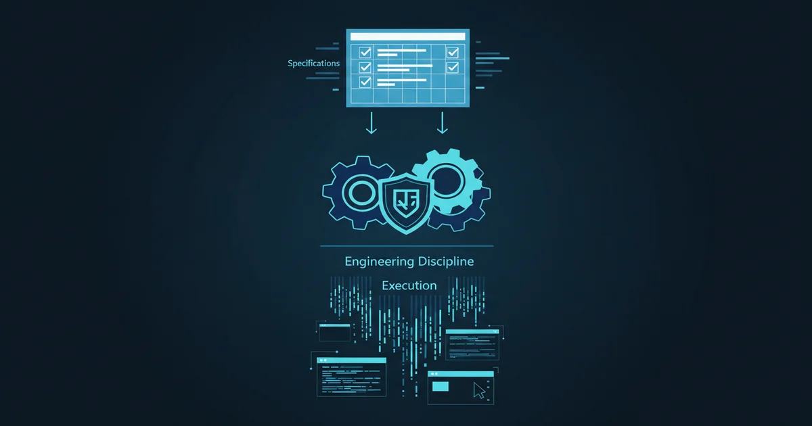
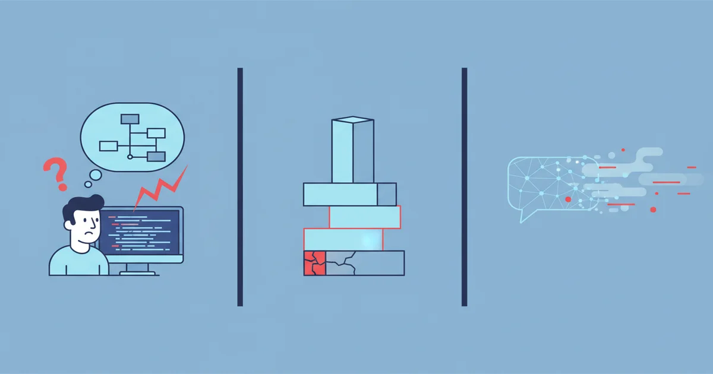
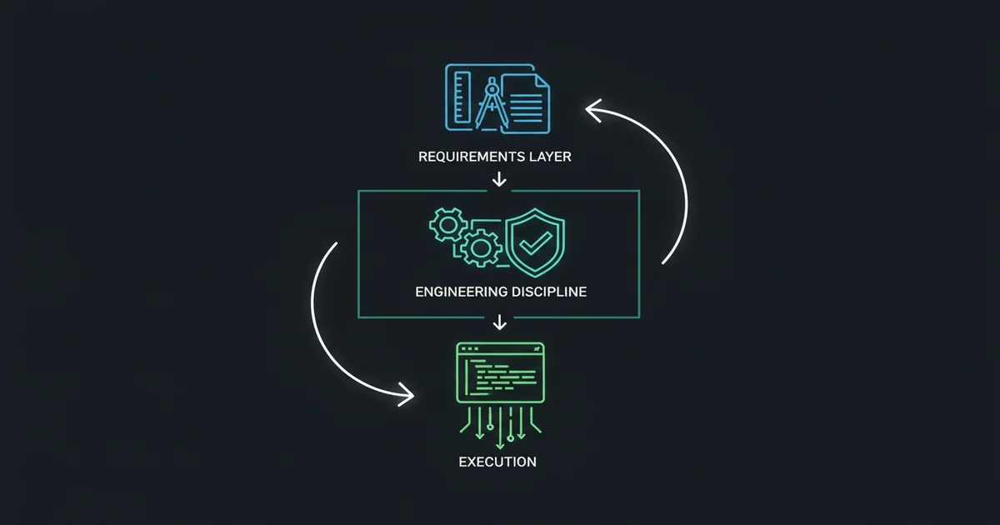
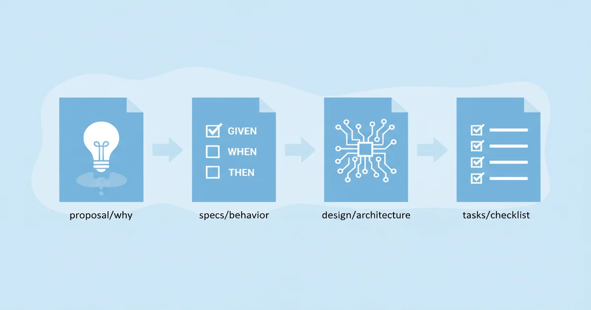
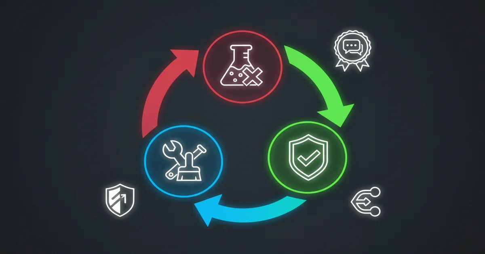
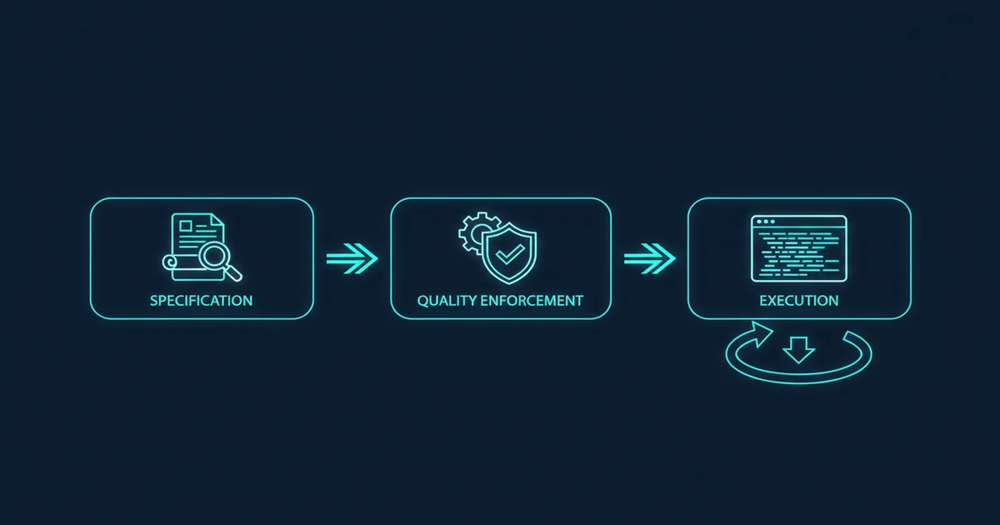
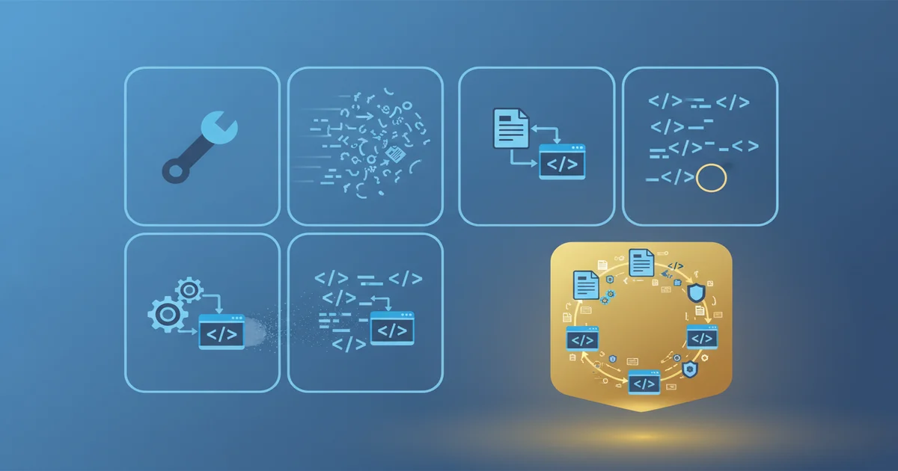
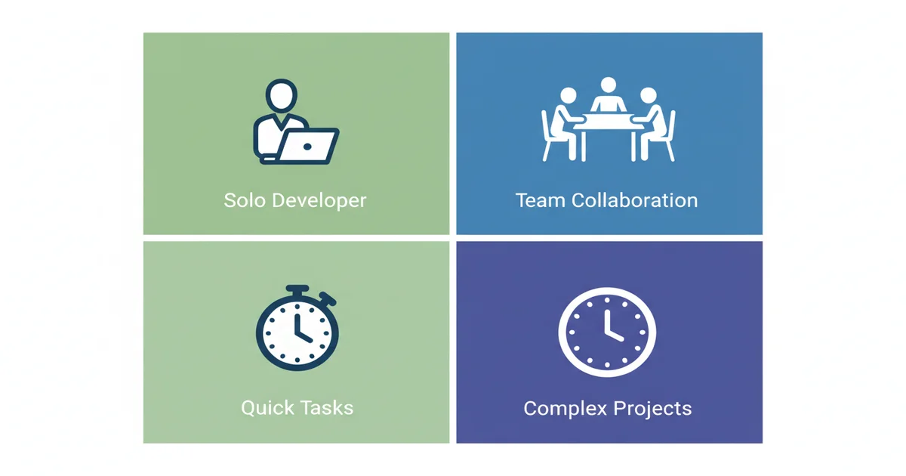

+++
date = '2026-04-09T10:00:00+08:00'
draft = false
title = 'Claude Code + OpenSpec + Superpowers：AI 编程的三件套，何时该用、何时别碰'
description = '深度拆解 Claude Code、OpenSpec、Superpowers 三者协同的真实价值与适用边界。包含决策矩阵、5 步工作流、命令速查表，帮你判断什么时候该用全套、什么时候只需部分。'
toc = true
tags = ['Claude Code', 'OpenSpec', 'Superpowers', 'AI Development', 'Spec-Driven Development']
keywords = ['Claude Code OpenSpec Superpowers', 'OpenSpec 教程', 'Superpowers 使用指南', 'AI 编程工作流', 'spec-driven development 中文', 'Claude Code 协同开发', 'OpenSpec vs Superpowers']

[[params.faqItems]]
question = "OpenSpec 和 Superpowers 有什么区别？"
answer = "OpenSpec 管'做什么'——把需求转成可追溯的规范文档（proposal、spec、design、tasks）。Superpowers 管'怎么做'——强制执行 TDD、代码审查、子代理并行开发等工程纪律。前者是蓝图，后者是施工规范，解决完全不同的问题。"

[[params.faqItems]]
question = "三个工具一起用会不会太重？"
answer = "如果你的任务不到 4 小时，用全套反而更慢——光 OpenSpec 的 propose→refine→validate 就要 30-60 分钟。建议：快速原型只用 Claude Code，中型任务加 Superpowers，大型/团队项目才上全套。"

[[params.faqItems]]
question = "OpenSpec 怎么安装？"
answer = "npm install -g @fission-ai/openspec@latest，然后在项目目录运行 openspec init。需要 Node.js 20.19.0+。初始化时选择你使用的 AI 工具（Claude Code、Cursor 等）。"

[[params.faqItems]]
question = "Superpowers 和 OpenSpec 可以分开用吗？"
answer = "可以。单独用 Superpowers 适合不需要决策追溯的个人项目；单独用 OpenSpec 适合需要规范但不依赖 Claude Code 子代理能力的场景。但两者结合的效果远大于单独使用。"

[[params.faqItems]]
question = "这套工作流适合初学者吗？"
answer = "工具能大幅降低编码门槛，但你仍需能看懂生成的代码、理解架构决策、识别安全问题。建议初学者先单独学 Claude Code，熟练后再逐步加入 Superpowers 和 OpenSpec。"
+++



## 你大概率踩过这三个坑

如果你用过 Claude Code 或类似的 AI 编程工具，下面三个场景一定不陌生。

**场景一：AI 做的不是你想要的。** 你说"加个用户登录功能"，AI 给你做了 Session 认证——但你要的是 JWT。你说"扫码支付"，AI 直接对接了真实支付 SDK——你只是想做个演示。每次返工都在烧 Token 和时间，而且你往往要到看完代码才发现方向错了。

**场景二：AI 跳过测试直接写代码。** Claude Code 能力很强，但它的默认行为是"收到需求就动手"。不创建 Git 分支、不写测试、不做代码审查——能出活，但出了事你根本不知道哪里有问题。搞砸了还不好回滚，因为它直接改的是你的主分支。

**场景三：做过的决策消失了。** 为什么选了 bcrypt 而不是 argon2？为什么接口前缀是 `/api` 而不是 `/v1`？上周你做的决策，关掉聊天窗口就没了。三个月后回来维护，完全想不起当初的考量。团队里新来个人，更是一脸懵。

这三个问题不是靠写更好的 prompt 能解决的——它们需要**不同层面的工具**来分别应对。这就是今天要聊的三件套：Claude Code + OpenSpec + Superpowers。



## 第一层：认识这三个工具

### Claude Code：住在终端里的 AI 程序员

[Claude Code](https://code.claude.com/docs/) 是 Anthropic 公司推出的命令行 AI 编程工具。和 ChatGPT 网页版或 Cursor 编辑器不同，Claude Code 工作在终端中——它能直接读取你的项目文件、理解代码结构、执行 shell 命令、写代码、跑测试、管理 Git。你可以让它自主完成"创建项目→写代码→跑测试→提交代码"的全流程，而不只是在聊天框里给你贴代码片段。

它很强，但也有上面说的那些问题：需求理解可能有偏差、不一定遵守工程纪律、决策不留痕。所以它需要搭档。

**前提**：需要 Claude Pro（20 美元/月）、Team 或 Enterprise 订阅，免费版不支持。

### OpenSpec：把一句话需求变成四份标准文档

[OpenSpec](https://openspec.dev/) 是 Fission AI 团队开发的开源框架，专门解决**场景一**的问题。它的核心理念是"Spec-Driven Development"——在写任何代码之前，先把需求变成结构化的规范文档。

你说"我要一个用户登录功能"，OpenSpec 帮你展开成：

- **proposal.md**：为什么做、做什么、**不做什么**（Out of Scope 是最关键的部分——明确不做什么，才能防止 AI 自作主张）
- **specs/**：行为规格（每个功能用 GIVEN/WHEN/THEN 描述预期行为）
- **design.md**：技术选型和决策理由（选了什么、为什么选、放弃了什么）
- **tasks.md**：任务清单（拆成 2-5 分钟可完成的具体步骤）

OpenSpec 不绑定任何 AI 工具，支持 20+ 个编程助手。但和 Claude Code 配合效果最好，因为 Claude Code 的子代理能力可以按 tasks.md 并行执行任务。

### Superpowers：给 AI 套上工程纪律的技能框架

[Superpowers](https://github.com/obra/superpowers) 是 Jesse Vincent 和 Prime Radiant 团队开发的开源技能框架（GitHub 14 万+ 星），专门解决**场景二**的问题。它不是独立工具，而是一组安装到 Claude Code 里的"技能"，让 Claude Code 自动遵循专业软件工程实践。

装上 Superpowers 后，Claude Code 会"变了个人"——不再收到需求就直接写代码。它有一组核心技能，**单独使用 Superpowers 时**大多数情况下会自动触发：

| 技能 | 什么时候用 | 触发方式 |
|------|-----------|---------|
| brainstorming | 创建新功能、构建组件前，先探索需求和设计 | 单独使用时自动触发 |
| writing-plans | 有明确需求，需要拆解多步实施计划 | 单独使用时自动触发 |
| test-driven-development | 实现功能或修 bug 前，先写测试 | 需在 CLAUDE.md 中明确要求 |
| systematic-debugging | 遇到 bug、测试失败、异常行为 | 需在 CLAUDE.md 中明确要求 |
| code-reviewer | 完成一个主要步骤后做代码审查 | 需在 CLAUDE.md 中明确要求 |
| dispatching-parallel-agents | 有多个独立任务可以并行处理 | 2+ 个无依赖任务时 |
| verification-before-completion | 准备说"搞定了"之前，先跑验证 | 需在 CLAUDE.md 中明确要求 |

> **重要纠正**：OpenSpec 和 Superpowers 是两套独立系统，**不会自动串联**。使用 `/opsx:apply` 实施任务时，Superpowers 的 TDD、code-review 等技能**不会自动介入**。如果你希望在 apply 过程中执行 TDD 等工程纪律，需要在项目的 CLAUDE.md 中明确写入规则，例如：`使用 /opsx:apply 实施任务时，必须采用 TDD 方式：先写失败测试，再写实现代码`。

两者结合使用时，**规划阶段由 OpenSpec 主导，编码阶段由 Superpowers 主导**，各管各的阶段：

```
OpenSpec 负责：              Superpowers 负责：
  想清楚做什么                  写代码时怎么做好
┌──────────┐               ┌──────────────┐
│ explore  │               │ brainstorming │ ← 被 propose 替代
│ propose  │               │ writing-plans │ ← 被 tasks.md 替代
│ apply ───┼─────────────→ │ TDD          │ ← 需在 CLAUDE.md 中要求
│          │               │ debugging    │ ← 需在 CLAUDE.md 中要求
│          │               │ verification │ ← 需在 CLAUDE.md 中要求
│ archive  │               │ code-review  │ ← 需在 CLAUDE.md 中要求
└──────────┘               └──────────────┘
```

OpenSpec 的 propose 已经把需求探索和设计决策做完了（proposal.md + design.md + specs + tasks.md），所以 Superpowers 的 brainstorming 和 writing-plans 自然被替代。但进入 apply 编码阶段后，Superpowers 的 TDD、debugging、verification、code-review **不会自动介入**——你需要在项目的 CLAUDE.md 中明确写入这些要求，Claude Code 才会在 apply 过程中遵循这些工程纪律。

如果你没有用 OpenSpec，直接跟 Claude Code 说"帮我加个用户登录功能"，那 Superpowers 就全程主导——brainstorming 先问清楚需求，writing-plans 拆解任务，然后 TDD 先写测试再写代码。

**一句话总结**：OpenSpec 管规划，Superpowers 管编码纪律，Claude Code 负责执行。两个装在同一个项目里完全不冲突，各管各的阶段。



## 第二层：装起来，让三件套能跑

认识完了，我们把它们装好。四步搞定，每步都有验证方法。

### 第 1 步：安装 Claude Code

```bash
# macOS / Linux / WSL
curl -fsSL https://claude.ai/install.sh | bash

# Windows PowerShell
irm https://claude.ai/install.ps1 | iex

# 验证
claude --version
# 应该输出版本号，比如 2.1.41
```

### 第 2 步：安装 OpenSpec

需要 Node.js 20.19.0+（运行 `node --version` 检查）。

```bash
# 全局安装
npm install -g @fission-ai/openspec@latest

# 进入你的项目目录，初始化（会提示选择 AI 工具，选 Claude Code）
cd your-project
openspec init
```

初始化后项目多出一个 `openspec/` 目录：

```
your-project/
├── openspec/
│   ├── specs/           # 当前系统规范
│   ├── changes/         # 进行中的变更
│   │   └── archive/     # 已完成的变更归档
│   └── AGENTS.md        # AI 自动读取的指令
└── ...（你的代码）
```

### 第 3 步：安装 Superpowers

Superpowers 装在 Claude Code 内部：

```bash
# 启动 Claude Code
claude

# 在交互界面中执行
> /plugin install superpowers@claude-plugins-official
```

下次启动看到 `You have Superpowers` 就说明装好了。

### 第 4 步：配置三者协同

在项目的 `.claude/settings.json` 中添加：

```json
{
  "mcpServers": {
    "openspec": {
      "command": "npx",
      "args": ["-y", "@fission-ai/openspec-mcp"]
    }
  },
  "permissions": {
    "allow": [
      "Bash:openspec:*",
      "Bash:npm:*",
      "Bash:git:*"
    ]
  }
}
```

**验证**：启动 Claude Code，输入"帮我看看 OpenSpec 和 Superpowers 是否安装好了"。两个都正常的话，Claude Code 会告诉你它检测到了 OpenSpec 目录和 Superpowers 技能。

## 第三层：先跑一遍，感受全流程

装好了，先别急着理解原理——**先让它跑起来**，在体感中理解每个工具在干什么。我们做一个用户认证 API（Express + MongoDB + JWT），跟着命令走就行。

### 3.1 用 OpenSpec 把需求变成规范

```bash
claude
> /opsx:propose 用户认证 API，技术栈 Express + MongoDB + JWT。
> 功能：用户注册（用户名+邮箱+密码）、用户登录（返回 JWT Token）、
> 获取当前用户信息（需要鉴权）。
> 安全要求：密码 bcrypt 加密，私有接口 JWT 鉴权。
```

OpenSpec 会在 `openspec/changes/user-auth/` 下生成四份文档。**你要做的事**：打开 `proposal.md`，看看 Out of Scope 部分——确认 AI 没有自作主张加"第三方登录"、"密码找回"等你没要的功能。

如果需要补充细节（比如密码长度限制）：

```bash
> /opsx:refine
> 补充：密码长度 6-20 位，用户名长度 3-15 位，
> 接口统一返回 {success: true/false, data/message: ...} 格式
```

校验规范无误：`/opsx:validate`

**这一步你获得了什么**：一份结构化的、所有人都能看懂的开发蓝图。AI 后续的所有工作都基于这份蓝图，而不是基于你的一句话描述。



### 3.2 规划阶段已完成，进入编码纪律

还记得前面说的分工吗？**规划阶段 OpenSpec 主导，编码阶段 Superpowers 主导**。

上一步的 `/opsx:propose` 已经把需求探索和设计决策都做完了——密码用什么算法、JWT 过期时间、数据库 ORM 选择等等，都记录在了 `design.md` 里。这相当于 Superpowers 的 brainstorming 和 writing-plans 已经被 OpenSpec 覆盖了。

所以接下来进入 `/opsx:apply` 时，如果你在 CLAUDE.md 中配置了 TDD 等要求，Superpowers 的工程纪律就会在编码过程中生效：TDD（先写测试再写代码）、debugging（遇到问题系统化排查）、verification（完成前验证）、code-review（提交前审查代码质量）。**注意：这些不是自动触发的，需要你在 CLAUDE.md 中明确要求。**

**这一步你获得了什么**：所有设计决策都记录在 `design.md` 中。三个月后回来，你能清楚看到当初为什么选了 bcrypt 而不是 argon2——**场景三的问题就这么解决了**。

### 3.3 确认计划、让 AI 自动执行

Brainstorming 完成后，Superpowers 自动生成任务计划（`tasks.md`），类似这样：

```markdown
## 任务 1：项目初始化（2 分钟）
- [ ] npm init，安装 express, mongoose, jsonwebtoken, bcryptjs, dotenv

## 任务 2：数据库连接（3 分钟）
- [ ] 创建 src/config/db.js，实现 MongoDB 连接

## 任务 3：用户模型（5 分钟）
- [ ] 创建 src/models/User.js，定义字段约束，实现密码加密钩子
- [ ] 编写单元测试

## 任务 4：鉴权中间件（3 分钟）
- [ ] 创建 src/middleware/auth.js，实现 JWT 验证

## 任务 5：API 路由（10 分钟）
- [ ] POST /api/register、POST /api/login、GET /api/user
- [ ] 编写集成测试

## 任务 6：项目入口（2 分钟）
- [ ] 创建 src/app.js，配置中间件、挂载路由、启动服务
```

**花 5 分钟通读一遍**，检查顺序是否合理、有没有遗漏。确认后输入：

```bash
> Plan 确认，开始执行
```

如果你在 CLAUDE.md 中要求了 TDD，Superpowers 会进入 subagent-driven-development 模式——为每个任务启动子代理，每个子代理都**走 TDD 流程**（先写测试，测试失败，再写实现，测试通过，做 Code Review）。你可以看到实时进度：

```
[Task 1/6] 项目初始化 ✓
[Task 2/6] 数据库连接
  ├─ 写测试 → 失败（RED）✓
  ├─ 写实现 → 通过（GREEN）✓
  ├─ Code Review → 通过 ✓
  └─ Git 提交 ✓
[Task 3/6] 用户模型 ...
```

**这一步你获得了什么**：AI 在隔离的 Git 分支上、按照你在 CLAUDE.md 中定义的规范、走着 TDD 流程在干活。搞砸了可以直接丢弃分支，不会影响你的主代码。**场景二的问题也解决了**。



### 3.4 验证 + 归档

```bash
# 验证实现是否符合规范
> /opsx:verify
# 输出：所有任务完成，无 CRITICAL 问题

# 归档变更——千万别忘了这一步
> /opsx:archive
```

归档会把变更的规范合并到主规范中。**忘了这一步，下次开发新功能时 AI 读取的还是旧规范，可能重复实现已有功能。**

### 3.5 启动项目，验证成果

```bash
npm install
node src/app.js
# 输出：服务运行在端口 5000

# 测试注册
curl -X POST http://localhost:5000/api/register \
  -H "Content-Type: application/json" \
  -d '{"username":"testuser","email":"test@example.com","password":"123456"}'
# 返回：{"success":true,"data":{"id":"...","username":"testuser","email":"test@example.com"}}
```

到这里，从一句话需求到可运行的 API，全流程跑完了。你的工作是：确认需求 → 回答设计问题 → Review 计划 → 验证结果。核心代码由 AI 按规范生成。



## 第四层：理解为什么三个缺一不可

跑通了一遍，你可能会想：真有必要这么麻烦吗？不能只用 Claude Code？或者只用其中两个？

可以，但你会掉回前面说的那些坑里。先看一张表，搞清楚 OpenSpec 和 Superpowers 到底哪里重叠、哪里互补：

| 能力 | OpenSpec | Superpowers |
|------|:---:|:---:|
| 需求探索 | ✅ propose | ✅ brainstorming |
| 任务拆解 | ✅ tasks.md | ✅ writing-plans |
| **规范文档持久化** | ✅ specs/ + archive/ | ❌ 对话关闭就没了 |
| **决策可追溯** | ✅ design.md 留痕 | ❌ 聊天记录里翻 |
| **TDD 强制** | ❌ | ✅ 先写测试再写代码 |
| **代码审查** | ❌ | ✅ 自动 code-review |
| **Git 分支隔离** | ❌ | ✅ worktree |
| **系统化调试** | ❌ | ✅ systematic-debugging |
| **完成前验证** | ❌ | ✅ verification |

重叠的只有前两行（需求探索和任务拆解），剩下的**完全互补**。网上有人说"两个重复了，选一个就行"——说这话的人要么没用过 Superpowers 的 TDD 和 Code Review（以为它只是个 brainstorming 工具），要么没用过 OpenSpec 的 archive（以为它只是个文档生成器）。

理解了这张表，再看每种组合缺什么就很清楚了。



### 只用 Claude Code：快但乱

开发速度最快，但没有规范约束。一位开发者的实际经历是：团队里不同人用 Claude Code 生成的代码，有的接口返回 `{code: 200, data: ...}`，有的返回 `{success: true, result: ...}`——前端对接时每个接口都要单独适配，痛苦至极。更严重的是，有人忘了给密码加密、有人忘了给私有接口加鉴权，这些安全问题要到测试甚至上线后才暴露。

### OpenSpec + Claude Code（缺 Superpowers）：有蓝图但没工头

你的规范写得再好，Claude Code 在执行过程中可能"自由发挥"偏离规范。没有在 CLAUDE.md 中要求 TDD、没有要求 Code Review、没有 Worktree 隔离——规范和实现之间缺少一个"执法者"。相当于画了完美的建筑图纸，但施工队不按图施工，你又没有监理。

### Superpowers + Claude Code（缺 OpenSpec）：有纪律但没方向

Superpowers 的 Brainstorming 会问你需求细节，TDD 会确保代码质量，但它的计划是基于当次对话的理解。对话一关，所有的需求理解和设计决策全部消失。下次迭代又要从头说明一遍需求，而且没有可复用的规范文档给团队共享。

### 三者组合：蓝图 + 监理 + 施工队

```
OpenSpec（需求层）→ Superpowers（纪律层）→ Claude Code（执行层）
   │                    │                      │
   ├─ proposal.md       ├─ Brainstorming       ├─ 写代码
   ├─ specs/            ├─ TDD 强制            ├─ 跑测试
   ├─ design.md         ├─ Code Review         ├─ Git 操作
   └─ tasks.md          └─ Subagent 并行       └─ 安装依赖
```

OpenSpec 把需求锚定成可追溯的文档 → Superpowers 确保 AI 按文档执行且有质量保障 → Claude Code 高效落地代码。形成"规范 → 执行 → 验证 → 归档"的闭环。三个工具各管一层，任何一层缺失，这个闭环就断了。

这里有个很多人忽略的关键设计：**OpenSpec 的 spec 输出只有约 250 行，而类似的 Spec Kit 工具输出约 800 行**。这不是功能缺失——是刻意控制长度。规范太长没人看，AI 也会丢失上下文。正确的 Spec 描述行为，不描述实现：

```markdown
# 正确：描述行为
需求：用户登录
- GIVEN 有效凭证
- WHEN 提交登录表单
- THEN 返回 JWT Token

# 错误：描述实现
实现 login 函数：
1. 导入 bcrypt
2. 调用 bcrypt.compare
3. 如果成功，调用 jwt.sign
```

Spec 管的是"要什么结果"，不管"怎么写代码"。后者是 Superpowers + Claude Code 的事。

另一个反直觉的设计在 Superpowers 这边：**它的 TDD 技能会删除在测试之前写的代码**。不是警告你，是直接删掉。这看起来激进，但解决了一个真实问题——AI 总是先写实现再补测试，补出来的测试只是在"验证代码确实是这么写的"而不是"验证代码确实做了该做的事"。

## 第五层：更大的案例——看三件套的上限在哪

前面的用户认证 API 是"新手体验版"，下面看两个更大的案例，展示三件套在复杂项目中的真实表现。

### 案例一：一天内搭完一个博客系统

需求：用 Next.js + PostgreSQL 搭一个技术博客，要有认证、文章 CRUD、Markdown 渲染、评论功能。目标一天完成。

工作流分成四个独立的 OpenSpec 变更**并行推进**：

```
9:00-11:35   用户认证（6 个任务）→ archive
11:35-13:30  文章管理（8 个任务）→ archive
14:30-16:00  Markdown 渲染（4 个任务）→ archive
16:00-18:00  评论功能（7 个任务）→ archive
```

最终产出：约 2500 行代码、87% 测试覆盖率、23 个 Git 提交、上线后一周零 Bug。

时间分配值得关注：**需求对齐占 19%，设计规划占 13%，代码执行占 56%，验证修复占 12%。** 三分之一的时间花在"写代码之前"——但正是这三分之一，让剩下三分之二的执行时间几乎没有返工。这是很多人不理解的地方：前期花时间对齐需求和设计，不是在浪费时间，而是在**提前消灭返工**。

### 案例二：支付收银台——审查发现 11 个问题

一位开发者用三件套从零构建一个支付收银台演示项目（React + FastAPI + MySQL），这个案例最能体现规范审查的价值。

他用 `/opsx:propose` 一条指令生成了全套规范文档，然后用 Superpowers 的 Brainstorming 从**架构师、测试工程师、开发工程师**三个视角审查。结果在一行代码都没写之前，就发现了 **11 个问题**：

- **高优先级**：缺少按订单号查询的接口（前端没法查订单）、API 缺少参数验证（任何人都能注入非法数据）
- **中优先级**：依赖列表不完整、数据库缺索引（查询会很慢）
- **低优先级**：未明确单用户演示模式、缺少测试数据准备步骤

如果这些问题是在代码写完后才发现，修复成本至少是现在的 5-10 倍。通过一轮审查 + 自动修复，任务从 50+ 个扩展到 74 个，覆盖了所有遗漏。最终核心功能 100% 可用，13 个任务组、74 个具体任务，只剩部署工作没做。

**这个案例的关键启示**：三件套的价值不仅在于"帮你写代码"，更在于"帮你在写代码之前发现你自己都没想到的问题"。这是纯用 Claude Code 做不到的——因为 Claude Code 收到需求就开始写了，它不会停下来三个视角审查你的需求是否完整。

## 第六层：知道什么时候不该用



到这里，你可能已经对三件套很有好感了。但我必须泼一盆冷水：**不是所有项目都适合上全套**。过度工程化和工程化不足一样有害。

| 场景 | 推荐组合 | 理由 |
|------|----------|------|
| 快速原型 / 探索性实验（<2h） | 只用 Claude Code | 需求还没定，写 Spec 是浪费时间 |
| 个人中型功能（2-8h） | Claude Code + Superpowers | TDD 和 Worktree 隔离防翻车，不需要决策追溯 |
| 团队中型功能（4-16h） | 全套 | 多人协作需要 Spec 对齐和决策留痕 |
| 大型项目 / 多功能并行 | 全套 + 并行 Worktree | OpenSpec 支持多个变更并行开发互不冲突 |
| 一次性脚本 | 只用 Claude Code | 没有维护需求，不需要流程 |
| 学习/教学 | 全套 | 完整流程本身就是最好的教材 |

**我的建议是从 Claude Code + Superpowers 两件套开始**，不要一上来就三件套全上。Superpowers 的 TDD 和 Code Review 对任何项目都有价值，而 OpenSpec 只在"需要团队协作或长期维护"的场景下才能体现优势。先用两件套养成工程纪律的习惯，等你觉得"决策追溯"成了真实瓶颈时再加 OpenSpec——那时候你会自然理解它的价值。

### 容易踩的 5 个坑

**坑 1：Spec 写成了伪代码。** Spec 描述行为（GIVEN/WHEN/THEN），不描述实现（导入什么模块、调用什么函数）。写太细会限制 AI 的实现选择空间，更新成本极高。

**坑 2：完成后忘了 archive。** 这是我自己踩过的坑。做完功能兴奋地开始下一个，忘了 `/opsx:archive`。下次开新会话，AI 读取的还是旧规范，把已经实现的功能又做了一遍。**养成习惯：每个功能完成后，archive 是最后一个动作。**

**坑 3：跳过 Brainstorming。** Superpowers 的 Brainstorming 不是闲聊——它在帮你和 AI 对齐技术决策。跳过这步，AI 会基于自己的猜测选技术方案，你到 Review 代码时才发现方向不对，修改成本已经很高了。

**坑 4：不看 Plan 就确认执行。** 花 5 分钟通读 `tasks.md`。检查任务顺序是否合理（JWT 工具函数应该在登录 API 之前）、有没有遗漏、验收标准是否清晰。这 5 分钟能省 1-2 小时返工。

**坑 5：30 分钟的需求上全套流程。** propose→brainstorm→plan→execute→verify→archive 全走完可能要 2 小时。**工具服务于目标，不是目标服务于工具。**

## 速查参考

### 命令速查表

**Core Profile（默认）**：

| 阶段 | 命令 | 作用 |
|------|------|------|
| 探索 | `/opsx:explore` | 进入探索模式，和 AI 一起思考和调研问题 |
| 需求 | `/opsx:propose <功能描述>` | 生成 proposal + spec + design + tasks |
| 执行实现 | `/opsx:apply` | 根据规范逐任务实施代码 |
| 归档 | `/opsx:archive` | 合并 Delta Spec，归档变更 |

最简流程：**propose → apply → archive**。explore 按需使用。

> **注意**：网上一些文章提到的 `/opsx:refine`、`/opsx:validate`、`/opsx:ff` 等命令**不在默认的 core profile 中**。如需使用 verify、sync、continue 等扩展命令，需要通过 `openspec config profile` 切换到 expanded profile，再运行 `openspec update` 安装额外的 skill 文件。对大多数场景，core 的四个命令就够了。如果想修改已生成的 proposal.md、design.md、tasks.md，直接编辑文件即可，不需要专门的 refine 命令。

### 新手上手路线图

```
第 1 周：只用 Claude Code
  → 熟悉终端中与 AI 协作的感觉

第 2 周：加上 Superpowers
  → 体验 TDD、Code Review、Worktree 的价值
  → 感受"有纪律的 AI"和"没纪律的 AI"的区别

第 3 周起：按需加入 OpenSpec
  → 当你发现"每次都要重复解释需求"或"团队里其他人看不懂我的代码逻辑"
  → 就是引入 OpenSpec 的时机
```

## 最终判断

这套组合的本质，是**把人类工程师的最佳实践（需求对齐、TDD、Code Review、决策记录）编码成 AI 必须遵守的规则**。不是让 AI 自由发挥，而是让 AI 在约束下创造。

但请记住三点：

1. **从小开始**。Claude Code → 加 Superpowers → 按需加 OpenSpec。不要第一天就全套上。
2. **工具不能替代判断**。AI 生成的代码你必须能读懂、能 Review、能识别问题。工具提升的是效率，不是能力。
3. **不要让流程成为枷锁**。30 分钟的任务不需要全套流程，快速原型不需要写 Spec。灵活选择合适的组合，才是真正的工程成熟度。

三者协同的终极目标不是"让 AI 帮你写更多代码"，而是**让 AI 写的代码像人类工程师写的一样可靠、可维护、可追溯**。这个目标是否值得额外的工具投入，取决于你的项目规模和团队需求——现在你有了做判断的框架，也有了上手实操的路径。

---

**Related Reading:**

- [Superpowers 深度解析：让 Claude Code 变身高级工程师的技能框架](/posts/ai/2026-02-01-superpowers-deep-dive/)
- [CLAUDE.md 终极指南：把 AI 助手训练成你的理想同事](/posts/ai/2026-02-28-claude-code-claudemd-guide/)
- [Harness Engineering：不换模型，只改 Harness 就能大幅提升 AI Agent 效果](/posts/ai/2026-03-30-harness-engineering-guide/)
- [Claude Code 完全指南：从入门到精通](/posts/ai/2026-02-28-claude-code-complete-guide/)
