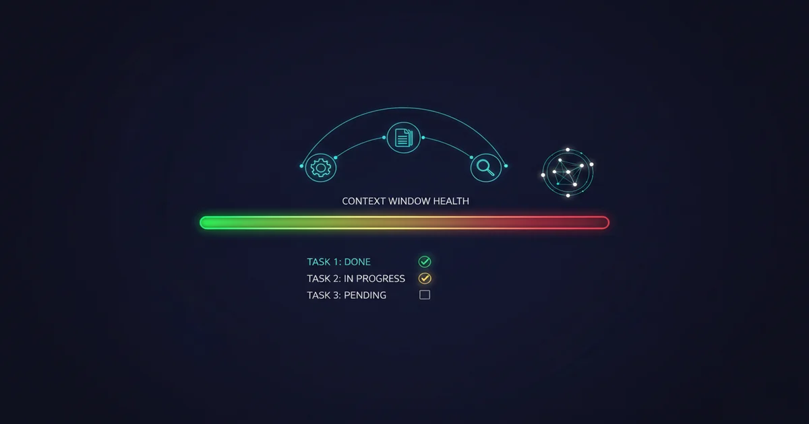
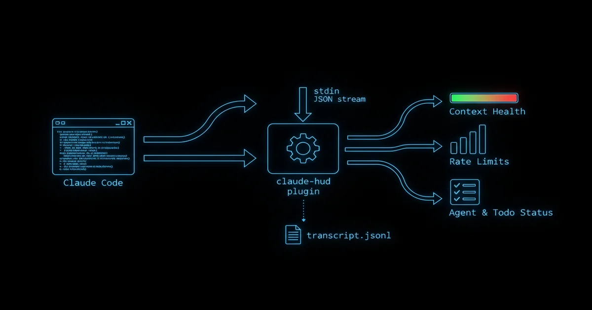
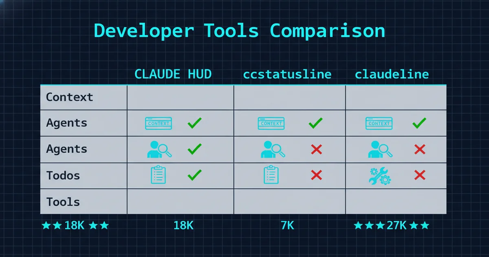

+++
date = '2026-04-10T10:00:00+08:00'
draft = false
title = 'Claude HUD 是什么？3 分钟装好 Claude Code 状态栏插件（2026）'
description = 'Claude HUD 是 Claude Code 的开源状态栏插件，实时显示 context 用量、rate limit 消耗和 agent 状态，18000+ stars。本文给出 3 分钟安装命令、推荐配置和 ccstatusline 对比。'
toc = true
tags = ['Claude Code', 'Developer Tools', 'Productivity', 'AI Coding']
keywords = ['claude hud 是什么', 'claude hud 安装', 'claude-hud', 'claude hud', 'claude code hud', 'claude code 状态栏', 'claude code 状态栏插件', 'claude code 上下文窗口', 'claude code 插件推荐', 'claude code 用量监控', 'claude code rate limit']

[[params.faqItems]]
question = "Claude HUD 是什么？"
answer = "Claude HUD 是一个开源的 Claude Code 插件，在终端底部显示实时状态栏，包括上下文窗口用量、rate limit 消耗、工具活动和 agent 状态。"

[[params.faqItems]]
question = "Claude HUD 怎么安装？"
answer = "在 Claude Code 中依次运行 /plugin marketplace add jarrodwatts/claude-hud、/plugin install claude-hud、/reload-plugins，最后运行 /claude-hud:setup 完成配置。配置后重启 Claude Code，状态栏就会出现在输入框下方，全程约 3 分钟。"

[[params.faqItems]]
question = "Claude HUD 免费吗？"
answer = "完全免费，MIT 开源协议，GitHub 上已有 18000+ stars。"

[[params.faqItems]]
question = "Claude HUD 和 ccstatusline 选哪个？"
answer = "Claude HUD 侧重功能性（agent 追踪、任务进度、上下文健康度），ccstatusline 侧重颜值（Powerline 字体、主题系统）。日常开发推荐 Claude HUD，追求终端美观选 ccstatusline。"

[[params.faqItems]]
question = "API Key 用户能用 Claude HUD 吗？"
answer = "可以，但只有上下文监控能用。Rate limit 监控需要 Claude 订阅账号（Pro/Max/Team），API Key 用户是按量计费，没有 rate limit 数据可显示。"
+++



你有没有遇到过这种情况：Claude Code 写着写着，突然开始重复你十分钟前给的指令，或者产出的代码和它自己早先的决策矛盾？这就是 context window 饱和的症状——而在没有监控的情况下，你完全没有预警。

我每天用 Claude Code 写代码，对工作流改善最大的不是换模型、不是调 prompt、也不是优化 CLAUDE.md，而是装了一个叫 [Claude HUD](https://github.com/jarrodwatts/claude-hud) 的插件。用一句话描述它：**Claude Code 的 htop**。htop 让你看到 CPU、内存和进程状态，Claude HUD 让你看到 context 健康度、工具活动、agent 状态和任务进度。

这个插件 2026 年 1 月发布至今，已经拿到 **18,000+ stars** 和 782 forks，是 Claude Code 生态中最火的插件。社区的反应出奇一致："这功能为什么不是 Claude Code 自带的？"

## 问题：在 200K Token 的黑箱里盲飞

Claude Code 的终端界面几乎不告诉你 session 的内部状态。你可以输入 `/context` 查看 token 用量，但这是一个手动、中断性的操作，给你一个数字却没有趋势和预警。没有监控时，你会遇到三个真实问题：

**Context 退化是渐进的，然后突然崩塌。** 当 context 用量超过 85%，Claude 的回复质量会明显下降——它会丢失对话早期的架构决策、重复自己、犯之前不会犯的错误。问题是你没有任何视觉指示器告诉你什么时候越过了这条线，你只能在输出质量已经崩了之后才意识到。

**Rate limit 的惊喜代价很高。** 如果你是 Claude Max 订阅用户（$100-200/月），claude.ai、Claude Code 和 Claude Desktop 共享同一个 rate limit。我见过开发者在一个 Claude Code session 里把 5 小时配额全部烧光都不知道，然后在急需修 bug 的时候被限速。没有一个用量条盯着你，这种事发生的频率比谁都愿意承认的要高。

**Agent 活动完全不可见。** Claude Code 在处理复杂任务时会频繁 spawn subagent。但你看不到有几个在跑、在干嘛、跑了多久。一个卡在循环里的 subagent 会默默吃掉你的 context 和 rate limit，而你在那里干等，以为一切在正常推进。

## Claude HUD 到底展示了什么

Claude HUD 在你的 Claude Code 输入框下方渲染一个持久状态栏。默认的两行显示长这样：

```
[Opus] │ my-project git:(main*)
Context █████░░░░░ 45% │ Usage ██░░░░░░░░ 25% (1h 30m / 5h)
```

第一行：模型、项目路径、git 分支。第二行：两个关键指标——context 健康度（从绿到黄到红）和订阅 rate limit 消耗。

打开可选行后还能看到更多：

```
◐ Edit: auth.ts | ✓ Read ×3 | ✓ Grep ×2        ← 工具活动
◐ explore [haiku]: Finding auth code (2m 15s)    ← Agent 状态
▸ Fix authentication bug (2/5)                   ← 任务进度
```

技术关键点：Claude HUD 使用的是 **Claude Code 的原生 token 数据**，不是估算。它通过 Claude Code 的 statusline API 接收 JSON 流（约每 300ms 一次），同时解析 session transcript 获取工具和 agent 活动。没有网络调用、没有后台进程、除了配置文件没有持久化状态。



## 3 分钟安装配置

在运行中的 Claude Code session 里操作：

**第一步：安装插件**

```bash
/plugin marketplace add jarrodwatts/claude-hud
/plugin install claude-hud
/reload-plugins
```

**第二步：运行引导配置**

```bash
/claude-hud:setup
```

这会自动写入 statusline 配置。配置完**重启 Claude Code**。

**第三步：自定义（可选）**

```bash
/claude-hud:configure
```

引导配置器让你选择预设、切换单个元素、保存前预览效果。

### 平台踩坑提醒

**Linux 用户**：安装时如果报 `EXDEV: cross-device link not permitted`，是因为 `/tmp` 在独立文件系统上。先执行：

```bash
mkdir -p ~/.cache/tmp && TMPDIR=~/.cache/tmp claude
```

然后在这个 session 里安装。这是 [Claude Code 平台的已知限制](https://github.com/anthropics/claude-code/issues/14799)，不是 Claude HUD 的 bug。

**Windows 用户**：如果 setup 说找不到 JavaScript 运行时，先装 Node.js：

```powershell
winget install OpenJS.NodeJS.LTS
```

## 我的实际配置推荐

试过所有预设后，我日常用的是 **Essential** 预设 + 以下微调：

```json
{
  "lineLayout": "expanded",
  "pathLevels": 2,
  "display": {
    "showModel": true,
    "showContextBar": true,
    "contextValue": "both",
    "showUsage": true,
    "showTools": true,
    "showAgents": true,
    "showTodos": true,
    "showCost": true,
    "showDuration": true
  },
  "gitStatus": {
    "enabled": true,
    "showDirty": true,
    "showAheadBehind": true
  }
}
```

为什么这样配：

- **`contextValue: "both"`** 同时显示百分比和绝对值（`45% (45k/200k)`）。光看百分比没意义——你不知道你的 session 是 200K 还是 1M 的 context window。
- **`showTools` 和 `showAgents` 都开了**，因为我经常跑多 agent 工作流，需要看到 subagent 什么时候卡住了。不开这个，我有过干等 5 分钟结果 agent 在循环 grep 搜索的经历。
- **`showCost: true`** 给你 session 费用估算。如果你在意每个 session 的开销，这个数字很有参考价值。
- **`showAheadBehind: true`** 在 git 状态里显示。我忘记推送 commit 就结束 session 的次数不想数了，看到 `↑3` 就是一个有效提醒。

## 竞品对比：选哪个？

Claude HUD 不是唯一的 statusline 插件。截至 2026 年 4 月的格局：



| 特性 | Claude HUD (18K ★) | ccstatusline (7K ★) | claudeline (27 ★) |
|------|-------------------|--------------------|--------------------|
| **定位** | Session 可观测性 | 视觉定制 | 极简主义 |
| **语言** | JavaScript/Node.js | JavaScript/Node.js | Go（单二进制） |
| **Context 追踪** | ✅ 原生 token 数据 | ✅ 原生 token 数据 | ✅ 原生 token 数据 |
| **Agent 追踪** | ✅ 运行状态 + 时长 | ❌ | ❌ |
| **任务进度** | ✅ 实时任务追踪 | ❌ | ❌ |
| **工具活动** | ✅ 实时文件操作 | ✅ 基于 Widget | ❌ |
| **Powerline 字体** | ❌ | ✅ 内置主题 | ❌ |
| **配置方式** | JSON + 引导向导 | TUI 安装器 | TOML 配置 |
| **中文标签** | ✅ 可选 | ❌ | ❌ |

**我的推荐**：如果你主要关心"知道 session 在干嘛"——context 健康度、agent 监控、任务追踪——选 Claude HUD。如果你关心"终端要好看"——Powerline 字体、主题预设——选 ccstatusline。两者解决的是不同问题。Claude HUD 的 agent 和 todo 追踪能力在竞品中没有对标，这也是 18K vs 7K stars 差距的核心原因。

顺便说一句，Claude HUD 支持中文标签，这在国内开发者中是个加分项。在 `/claude-hud:configure` 里选择 `中文` 就行。

## 什么时候不该装

说清楚边界：

**偶尔用 Claude Code 的人**（一周几次、每次问几个问题），不需要。短 session 不会碰到 context 或 rate limit 的问题。

**API Key 用户**，Claude HUD 最值钱的 rate limit 监控功能不可用。API Key 按量计费，没有配额限制。你只能用 context 追踪，少了一半价值。

**企业代理环境**，usage limit 追踪可能不准。插件本身不发网络请求，但 Claude Code 的数据管道可能受代理影响。

**平台风险真实存在。** Claude HUD 依赖 Claude Code 的 statusline API 和插件系统。如果 Anthropic 自己做了内置监控面板（看社区呼声，大概率会做），这个插件就多余了。目前版本号还是 0.0.9，属于早期软件，预期会有 breaking changes。

## 更大的图景：可观测性是刚需

Claude HUD 的爆火揭示了 2026 年 AI 编程工具的一个真实状态：我们在让这些工具处理越来越复杂的任务——多文件重构、agent 间协调、数小时的编码 session——但围绕"理解 AI 在做什么"的工具生态远没有跟上。

Context window 是任何 AI 编码 session 最关键的资源，而在 Claude HUD 出现之前，管理它是一场猜谜游戏。一个第三方插件填补了这个缺口，18,000 个开发者蜂拥而至安装它——这足以告诉 Anthropic 他们在内置可观测性方面的优先级应该是什么。

如果你在用 Claude Code 做任何严肃的开发工作，今天就装 Claude HUD。3 分钟、免费、省掉你不知道在发生的 session 退化。光是那个 context 进度条——看着它从绿色慢慢变黄——就改变了我管理 session 的方式。我现在会主动开新 session，而不是等质量退化后再被动应对。

## 相关阅读

- [Claude Code 完全指南：从安装到高级工作流](/zh/posts/ai/2026-02-28-claude-code-complete-guide/) — 全面的安装和使用指南
- [CLAUDE.md 最佳实践：配置你的 AI 编码助手](/zh/posts/ai/2026-03-05-claude-code-claudemd-best-practices/) — 优化 CLAUDE.md 获得更好效果
- [Claude Code vs Cursor vs Copilot：2026 年 AI 编程工具横评](/zh/posts/ai/2026-04-03-claude-code-vs-cursor-vs-copilot/) — Claude Code 与竞品对比
- [Claude Code Hooks 指南：自动化开发工作流](/zh/posts/ai/2026-02-28-claude-code-hooks-guide/) — 用 Hooks 扩展 Claude Code
- [Claude Code Rate Limit 详解](/zh/posts/ai/2026-02-28-claude-rate-limits/) — 理解和管理你的用量限制
