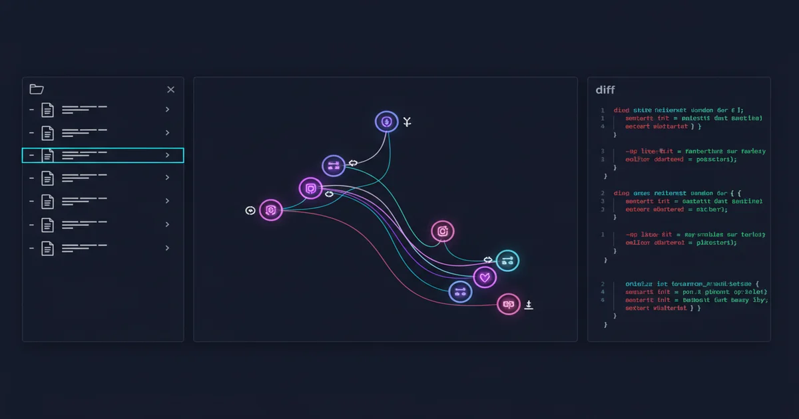
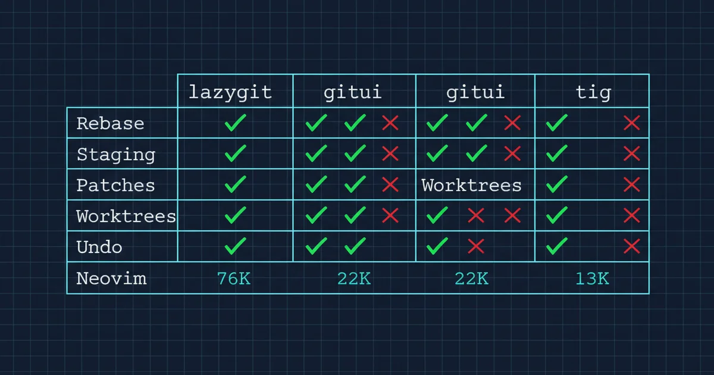
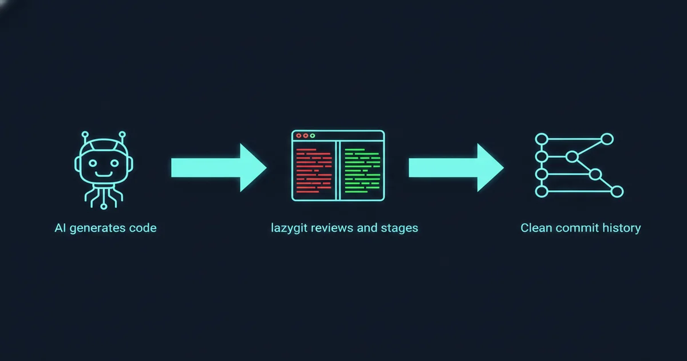

+++
date = '2026-04-10T14:00:00+08:00'
draft = false
title = 'Lazygit：用了就回不去的终端 Git 神器'
description = 'Lazygit 把 interactive rebase、逐行 staging 这些痛苦的 Git 操作变成按键操作。76K stars、8 年迭代，这篇文章告诉你为什么它值得学、怎么用、什么时候不该用。'
toc = true
tags = ['Developer Tools', 'Git', 'Terminal', 'Productivity']
keywords = ['lazygit 教程', 'lazygit 安装', 'lazygit 快捷键', 'git 终端工具', 'lazygit neovim', 'lazygit 使用指南', 'git TUI 推荐']

[[params.faqItems]]
question = "Lazygit 是什么？"
answer = "Lazygit 是一个开源的终端 Git 界面，用键盘操作替代复杂的 Git 命令。76K+ GitHub stars，Go 语言编写，支持 macOS/Linux/Windows。"

[[params.faqItems]]
question = "Lazygit 怎么安装？"
answer = "macOS 用 brew install lazygit，Ubuntu 用 sudo apt install lazygit，Windows 用 winget install lazygit。安装后在任意 Git 仓库中运行 lazygit 即可。"

[[params.faqItems]]
question = "Lazygit 和 gitui 选哪个？"
answer = "Lazygit 功能更全（interactive rebase、custom patches、worktree 管理），生态更好（Neovim 插件、自定义命令）。Gitui 启动更快、内存更低。日常开发推荐 lazygit，超大仓库考虑 gitui。"

[[params.faqItems]]
question = "Lazygit 能替代 GitKraken 吗？"
answer = "对终端开发者来说可以。Lazygit 处理 staging、rebase、cherry-pick、冲突解决都不需要离开终端。但 GUI 客户端在大规模可视化 diff 和 PR 管理上仍有优势。"

[[params.faqItems]]
question = "Lazygit 需要多久上手？"
answer = "大约 2 天。第一天会觉得比命令行慢，第二天开始适应，第三天明显更快。先学 4 个键：space（暂存）、c（提交）、s（squash）、ctrl+z（撤销）。"
+++



Git 的 interactive rebase 是这样的：你运行 `git rebase -i HEAD~5`，等编辑器弹出一个临时 TODO 文件，手动把 `pick` 改成 `squash` 或 `fixup`，调整行顺序，保存退出，然后祈祷没打错字。想要逐行暂存？运行 `git add -p`，一个一个 hunk 看过去，如果 hunk 粒度不对，你要手动编辑 patch 文件。想修改三个 commit 之前的提交？得先 interactive rebase 标记 edit，改完 amend，再 continue。

这不是什么罕见操作。我每周要做好几次。每一次都像用记事本做手术。

[Lazygit](https://github.com/jesseduffield/lazygit) 解决了这个问题。在 lazygit 里，interactive rebase 是按 `i` 然后用 `s` squash、`d` drop、`ctrl+k`/`ctrl+j` 调整顺序。逐行暂存是在 diff 视图里按 `space`。修改旧 commit 是 `shift+a`。没有临时文件、没有 patch 编辑、没有祈祷。

这个项目 2018 年启动，到现在拿到 **76,000+ stars**，最新版本 v0.61.0 在 2026 年 4 月 6 日发布。赞助者里有 [DHH](https://github.com/dhh)（Rails 创始人）和 [Tobias Lütke](https://github.com/tobi)（Shopify CEO）。在我的工具箱里，lazygit 是继 tmux 之后对工作效率改善最大的终端工具。

## "我会命令行 Git 就够了"——真的吗？

很多资深开发者觉得学了 Git 命令就不需要 TUI。这个想法忽略了一个关键问题：**Git 的界面在它最强大的功能上主动跟你作对**。

以 interactive rebase 为例——公认 Git 最强大的功能之一。原生工作流需要你：(1) 输入 rebase 命令，(2) 等编辑器打开，(3) 在 TODO 文件里手动编辑文本，(4) 保存退出，(5) 处理冲突，(6) 继续 rebase。每一步都是上下文切换，每一步都可能打错字然后进入混乱的错误状态。而且如果你想调整 commit 顺序，你在做的是**在一个你再也不会看到的文件里剪切粘贴文本行**——这是 2026 年。

Lazygit 把这变成了直接操作。你看到 commit 列表，用快捷键移动它们，确认。心智模型和实际操作一致："我想把这个 commit 移到那个上面"变成按 `ctrl+k`，而不是思考文本行在临时文件里的位置。

**操作频率决定了工具摩擦是否可接受。** 如果你一个月 rebase 一次，命令行够用。但如果你每周 rebase 好几次——如果你在意提交历史的整洁度，你应该这样做——累积的摩擦是巨大的。我估算 lazygit 每天帮我节省 15-20 分钟，主要因为我不再因为 CLI 操作的开销而犹豫做正确的事（squash fixup commits、按逻辑重排 commits）。

## 改变工作方式的核心功能

Lazygit 有几十个功能，但真正改变工作方式的是这几个：

### 逐行暂存

在 diff 视图里按 `space` 暂存单行，按 `v` 进入可视模式选择范围，按 `a` 选择整个 hunk。这是让我彻底告别 `git add -p` 的功能——`git add -p` 强制你按顺序看 hunk，粒度不对还要手动编辑 patch。

实际影响：我现在的 commit 粒度细多了。以前经常因为逐行暂存太麻烦，直接 `git add` 整个文件。现在我常规操作是把一个文件的改动拆成 2-3 个 commit，每个 commit 讲一个清晰的故事，整个过程不到一分钟。这不是小改善——它改变了你的 Git 历史质量。

### Interactive Rebase 变成直接操作

按 `i` 开始 interactive rebase，然后用 `s`（squash）、`f`（fixup）、`d`（drop）、`e`（edit）、`ctrl+k`（上移）、`ctrl+j`（下移）。完成后按 `m` 选 "continue"。没有编辑器，没有 TODO 文件，没有文本操作。

更强大的是：你可以不显式开始 rebase，直接在 commit 上按 `s` squash 它。Lazygit 在后台处理 interactive rebase。这种设计让你疑惑为什么 Git CLI 不是这样工作的。

### 修改旧 Commit

在任意 commit 上按 `shift+a`，用当前暂存的改动修改那个 commit。Lazygit 在后台跑 interactive rebase，但你完全看不到。对于那种"写了两个 commit 后才发现忘了一个相关改动"的场景，一个按键搞定，不需要创建 fixup commit 再手动 rebase。

### 撤销/重做

按 `ctrl+z` 撤销上一个 Git 操作。光这一个功能就值了。对不可逆操作的恐惧是 Git 最大的摩擦来源之一，有了安全网你会更愿意尝试 rebase、reset 这些"危险"操作。

## 安装 + 核心键位速查

### 安装

```bash
# macOS
brew install lazygit

# Ubuntu/Debian
sudo apt install lazygit

# Arch Linux
pacman -S lazygit

# Windows
winget install lazygit

# 任何有 Go 的平台
go install github.com/jesseduffield/lazygit@latest
```

装完后在任意 Git 仓库里运行 `lazygit`（或设个 alias `lg`）。

### 键位速查表

这是我希望第一天就有的速查表，20 个键覆盖 90% 日常操作：

| 操作 | 按键 | 上下文 |
|------|------|--------|
| **暂存文件** | `space` | 文件面板 |
| **暂存单行** | `space` | 暂存视图（行） |
| **暂存整个 hunk** | `a` | 暂存视图 |
| **提交** | `c` | 文件面板 |
| **用编辑器提交** | `C` | 文件面板 |
| **修改最近提交** | `A` | 文件面板 |
| **修改旧提交** | `shift+a` | Commits 面板 |
| **Squash 提交** | `s` | Commits 面板 |
| **Fixup 提交** | `f` | Commits 面板 |
| **删除提交** | `d` | Commits 面板 |
| **上移 commit** | `ctrl+k` | Commits 面板 |
| **下移 commit** | `ctrl+j` | Commits 面板 |
| **复制 commit (cherry-pick)** | `shift+c` | Commits 面板 |
| **粘贴 commit (cherry-pick)** | `shift+v` | Commits 面板 |
| **开始 interactive rebase** | `i` | Commits 面板 |
| **切换分支** | `space` | 分支面板 |
| **新建分支** | `n` | 分支面板 |
| **推送** | `P` | 任意面板 |
| **拉取** | `p` | 任意面板 |
| **撤销** | `ctrl+z` | 任意面板 |
| **搜索/过滤** | `/` | 任意面板 |

学习曲线是真实但短暂的。前两天会觉得比命令行慢，第三天开始明显更快。**不要试图一次记住所有键**——先学 `space`（暂存）、`c`（提交）、`s`（squash）、`ctrl+z`（撤销），其他的按需加。

## 竞品对比：怎么选？

终端 Git TUI 有三个真正的选手：



| 特性 | lazygit (76K ★) | gitui (22K ★) | tig (13K ★) |
|------|----------------|---------------|-------------|
| **定位** | 完整 Git 管理 | 快速 Git 管理 | 只读浏览 |
| **语言** | Go | Rust | C |
| **Interactive rebase** | ✅ 完整可视化 | ❌ 有限 | ❌ 无 |
| **逐行暂存** | ✅ 可视选择 | ✅ Hunk 级别 | ❌ 只读 |
| **Custom patches** | ✅ 提取/移动 patch | ❌ | ❌ |
| **Worktree 管理** | ✅ 创建和管理 | ❌ | ❌ |
| **撤销/重做** | ✅ ctrl+z | ❌ | ❌ |
| **Neovim 插件** | ✅ lazygit.nvim | ❌ | ❌ |
| **自定义命令** | ✅ 灵活系统 | ❌ | ❌ |
| **启动速度** | 快 | 更快 | 最快 |

**选 lazygit**：想要最深的 Git 集成、用 Neovim、需要 interactive rebase 和 custom patches。覆盖大部分开发者。

**选 gitui**：主要在超大仓库工作，启动速度和内存占用敏感，不需要 interactive rebase。Rust 写的，初始加载明显更快。

**选 tig**：主要需要浏览历史、blame、diff，不做写操作。Tig 是查看器不是管理器——和 lazygit 互补而非竞争。

**留在 GUI 客户端**（GitKraken/Tower/Fork）：需要可视化 PR review、大规模 side-by-side diff、不是终端原生用户。

## 在 AI 编程时代的定位



这是大部分 lazygit 文章没讲到的角度：2026 年开发者工作流已经根本性地转向 AI 辅助编码。[Claude Code](/posts/ai/2026-02-28-claude-code-complete-guide/)、Cursor 这些工具生成代码的速度让 Git 操作更频繁而不是更少。当 AI agent 一次改了 15 个文件做重构，你需要快速 review、选择性暂存、按逻辑单元提交。

Lazygit 完美适配这个工作流。Claude Code 完成多文件改动后，我打开 lazygit review 每个文件，逐行暂存，创建结构化 commit。替代方案——对每个逻辑单元运行 `git diff`、`git add -p`、`git commit`——需要 3-4 倍时间。

[Neovim 集成](https://github.com/kdheepak/lazygit.nvim)让这更丝滑。我在 Neovim 配置里绑定了 `<leader>gg`：

```lua
-- lazy.nvim 插件配置
{
  "kdheepak/lazygit.nvim",
  keys = {
    { "<leader>gg", "<cmd>LazyGit<cr>", desc = "打开 LazyGit" },
  },
}
```

一个快捷键在 Neovim 里打开 lazygit 浮动窗口，review、暂存、提交、推送，然后回到编辑器，全程不离开终端。在 AI 生成代码、人类策划 commit 的时代，lazygit 就是那个策划工具。

对于 [Claude Code worktree 工作流](/posts/ai/2026-02-28-claude-code-worktree-guide/)，lazygit 的 worktree 支持（分支面板按 `w`）特别有用。你可以可视化地创建、切换、管理 worktree——我在多个 Claude Code session 跑不同 feature 分支时每天都在用。

## 什么时候不该用 Lazygit

直说边界：

**超大仓库会卡。** 如果你的仓库大到 `git status` 需要 10 秒以上（比如 nixpkgs 或 chromium 级别的 monorepo），lazygit 的 UI 会在每个操作上冻住，因为它要等 Git 命令完成才更新界面。没有办法限制作用范围到子目录。这种仓库还是得用命令行加 sparse checkout。

**Git 初学者不要从这里开始。** Lazygit 抽象得太好，你可以不理解底层就用它。这很危险。如果你不知道 interactive rebase 在命令层面做了什么，出问题时你会束手无策——lazygit 的撤销不能修复所有事。先学基础命令，再升级到 lazygit。

**企业 CI/CD 流程用不上。** 如果你的 Git 交互主要是脚本化的（CI pipeline、自动发布、git hooks），lazygit 加不了任何价值。它是面向人的工具，不是面向自动化的。

**PR review 能力有限。** Lazygit 没有 GitHub/GitLab PR 集成，不能从里面 review、评论或合并 PR。这些还是需要 `gh pr` 命令、GUI 客户端或 Web 界面。

## 现在就开始

如果你看到这里还没装 lazygit，我的建议：

1. **装它**（macOS: `brew install lazygit`）
2. **在真实项目里跑它**（`lazygit` 或 `lg`）
3. **学四个键**：`space`（暂存）、`c`（提交）、`s`（squash）、`ctrl+z`（撤销）
4. **完整用一天再做判断**——第一个小时会觉得比现有工作流慢
5. **如果用 Neovim 加上插件**——浮动窗口集成是 game changer

过渡成本大约两天的轻微不适。收益是职业生涯剩余时间里更快、更自信的 Git 操作。这个 trade 我每次都愿意做。

## 相关阅读

- [Claude Code 完全指南](/posts/ai/2026-02-28-claude-code-complete-guide/) — 和 lazygit 搭配最好的 AI 编码工具
- [Claude Code Worktree 指南](/posts/ai/2026-02-28-claude-code-worktree-guide/) — lazygit 让 worktree 工作流可视化
- [AI 开发工作流实战指南](/posts/ai/2026-01-19-ai-dev-workflow/) — lazygit 在现代开发中的定位
- [高频提交策略](/posts/ai/2026-03-10-high-frequency-commits/) — 为什么频繁、干净的提交很重要
- [tmux 指南：AI 开发环境](/posts/ai/2026-03-03-tmux-guide-ai-development/) — 和 lazygit 互补的终端复用器
