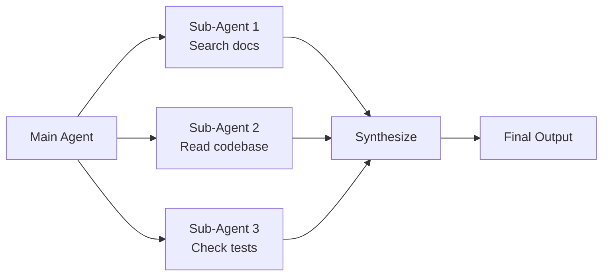
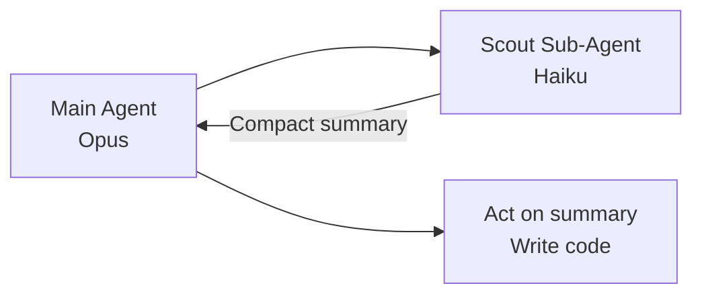
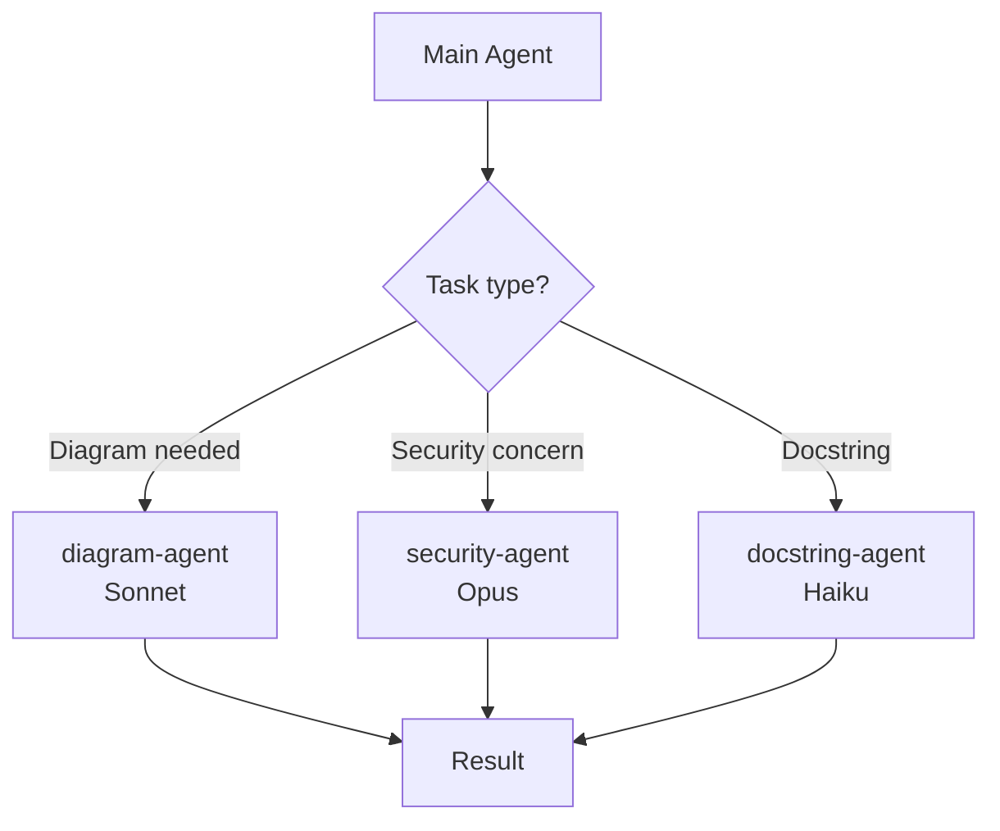
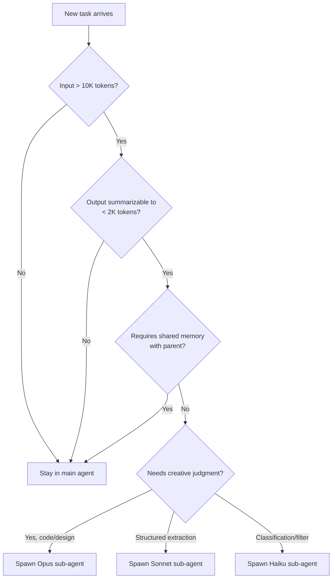

+++
date = '2026-04-13T10:00:00+08:00'
draft = false
title = 'Sub-Agent Architecture for AI Coding Harnesses: When to Spawn, How to Route, What It Costs'
description = 'Most teams use sub-agents as a speed hack. The real value is context garbage collection. A practical guide to sub-agent architecture, Opus/Sonnet/Haiku routing, isolation strategies, and the cost-quality tradeoffs nobody talks about.'
toc = true
tags = ['Harness Engineering', 'Sub-Agents', 'Claude Code', 'AI Agents', 'AI Engineering']
keywords = ['sub-agent architecture', 'claude code subagents', 'when to use sub-agents', 'opus sonnet haiku routing', 'agent orchestration patterns', 'multi-agent vs single agent', 'context isolation strategy', 'sub-agent cost optimization']

[[params.faqItems]]
question = "When should I actually use a sub-agent instead of staying in the main agent?"
answer = "Spawn a sub-agent when three conditions are met: the task reads far more context than it produces, the output can be summarized in a few hundred tokens, and the main agent does not need to see intermediate steps. Classic cases are codebase search, doc lookup, log triage, and parallel file analysis. Do not spawn sub-agents for multi-step reasoning that depends on shared memory, because each sub-agent starts with a cold context and cannot inherit the main agent's working hypotheses."
[[params.faqItems]]
question = "Is a multi-agent system always better than a single big agent?"
answer = "No. Cognition's public writeup on Devin showed that naive multi-agent architectures often perform worse than a single agent because sub-agents lose alignment on fuzzy goals. The right mental model is that sub-agents are a context garbage collection mechanism, not a parallel speedup. Use them to throw away noise, not to split thinking. Multi-agent beats single-agent only when the tasks are truly independent and the hand-off contract is precise."
[[params.faqItems]]
question = "How do I choose between Opus, Sonnet, and Haiku for sub-agents?"
answer = "Route by the complexity of the decision, not by the size of the input. Opus for generation that requires judgment (code, architecture, writing). Sonnet for structured extraction and summarization where accuracy matters but creativity does not. Haiku for deterministic filtering, classification, and large-volume read-only passes. A common mistake is using Opus as the orchestrator and Sonnet for code generation. Invert that. Let Sonnet or Haiku drive exploration and route the final write back to Opus."
[[params.faqItems]]
question = "What does a sub-agent actually cost compared to one big context window?"
answer = "Each sub-agent spawn incurs a cold-start cost: the system prompt, CLAUDE.md, and any injected instructions are re-tokenized per call. If your sub-agent only processes 2000 tokens of real work, the overhead can exceed the work. The break-even is roughly 10,000 tokens of input per spawn. Below that, stay in the main agent. Above that, sub-agents pay for themselves in recovered context window and focused attention."
[[params.faqItems]]
question = "How is a sub-agent different from a skill, tool, or MCP server?"
answer = "A tool is a single deterministic function call. An MCP server bundles related tools behind a standardized protocol. A skill is a loadable instruction package that lives inside the same agent. A sub-agent is a separate LLM invocation with its own context window, its own system prompt, and no access to the parent's working memory. The key distinguishing feature of a sub-agent is context isolation: whatever it reads, thinks, or computes does not pollute the parent."
+++


This is **Part 3** of the [Harness Engineering series](/posts/ai/2026-03-30-harness-engineering-guide/). Part 1 framed the thesis (Agent = Model + Harness). [Part 2](/posts/ai/2026-03-31-harness-claudemd-guide/) went deep on `CLAUDE.md`, the single most important *feedforward* control. This article goes deep on a structural decision most teams get wrong: **when to spawn a sub-agent, how to route it, and what it actually costs.**

Here is the thesis up front, because you will not read it anywhere else in this form:

> **Sub-agents are not a parallel speed hack. They are a context garbage collection mechanism.** The point is to throw noise away, not to split thinking.

Most engineering teams reach for sub-agents the first time they hit a context window limit, or the first time a task feels "big." They fan out, they parallelize, they marvel at how fast things go — and then spend the next month debugging why outputs keep drifting from each other. The failure mode is predictable: sub-agents that should have stayed in the main thread got fired off, and a single decision that needed shared working memory got split across three cold-started processes that never saw each other's evidence.

The goal of this article is to give you a decision framework, a concrete routing table across Opus / Sonnet / Haiku, and a cost model, so you stop spawning sub-agents by instinct and start spawning them for reasons you can name.

## Three Myths That Burn Money

Before the patterns, let us kill the common misconceptions. Each of these burns real tokens and real time in production.

### Myth 1: "More sub-agents means faster completion"

This is the first mistake teams make, and it is intuitive enough that you have to talk yourself out of it. Parallel execution *can* be faster, but every sub-agent spawn carries a fixed overhead: the system prompt is re-tokenized, `CLAUDE.md` is re-loaded, tool schemas are re-injected, and the new agent has to re-orient from zero. If your sub-agent task only does 2,000 tokens of real work, the cold-start tax may exceed the work itself.

In practice I benchmark this at roughly **10,000 input tokens per spawn** as the break-even point. Below that, you pay more in orchestration overhead than you save. Above that, sub-agents start winning — not because they are fast, but because they free the main agent from having to hold that context at all.

Cognition published a widely-referenced post-mortem on their Devin architecture in which they admitted that naive multi-agent systems "do not work" on real tasks: the agents drift out of alignment on fuzzy objectives, because natural language hand-offs between LLMs are lossy. Their recommendation was counterintuitive: prefer a single agent with a large context window over a multi-agent swarm, unless you have a precise hand-off contract.

### Myth 2: "Sub-agents should always use the cheapest model"

The second mistake is symmetric to the first: teams assume sub-agents are "secondary" work and therefore should run on Haiku to save money. This misunderstands what determines quality.

Model selection should be **routed by decision complexity, not by input volume**. A sub-agent reading 100,000 tokens of logs and emitting a 200-token classification does not need a frontier model — Haiku is excellent at that shape of work. But a sub-agent that refactors a 2,000-line module needs Opus-class judgment, even though the input is small. Routing by size rather than by task nature is how you end up with Haiku writing production code and Opus summarizing logs. That is backwards.

### Myth 3: "The orchestrator should be the smartest model"

The third mistake is the most expensive: running Opus as the orchestrator and Sonnet as the worker. This feels natural — the "brain" makes decisions, the "hands" do work — but it inverts the actual cost structure.

Orchestration is mostly routing logic and state tracking. It does not require frontier reasoning. The heavy cognitive work happens at the leaf nodes: writing code, making architectural trade-offs, synthesizing a judgment from fragmented evidence. Run Sonnet or even Haiku as the orchestrator. Save Opus for the final generation step where judgment actually compounds.

When I restructured my own blog pipeline from "Opus orchestrator + Sonnet workers" to "Sonnet orchestrator + Opus writer + Haiku searchers," end-to-end token cost dropped by roughly 60% and output quality measurably improved, because Opus was now being used where it mattered instead of being spent on dispatch logic.

## The Mental Model: Context Garbage Collection

If you take one idea away from this article, take this: **a sub-agent is a fresh heap**. You fork off an isolated process, let it churn through whatever mess it needs (reading twenty files, running grep, inspecting logs), extract a compact summary, and let the whole thing get garbage-collected. The parent agent never sees the mess.

This is why the primary use cases for sub-agents all share one shape: **high input, low output, stateless**. Consider:

- **Codebase search.** The sub-agent reads dozens of files to answer "which module handles webhook retries?" and returns a three-sentence answer. The parent is spared 30K tokens of source code it does not need to remember.
- **Doc triage.** The sub-agent reads the official docs for a library, finds the three relevant API signatures, and hands them back. The parent gets the signatures, not the 80K-token doc site.
- **Log analysis.** The sub-agent scans a 500K-token log file, identifies the failing pattern, and reports the stack trace. The parent keeps working in a clean context.

In each case, the sub-agent's job is to *summarize and throw away*. That is the garbage collection framing. You are not parallelizing for speed. You are protecting the main agent's working memory from context pollution — the slow, invisible killer of agent performance on long tasks.

Conversely, this framing also tells you when **not** to use a sub-agent. If the "waste" you would throw away is actually load-bearing context that the main agent will need downstream, sub-agents cost you more than they save, because the parent will just have to re-fetch or re-derive it anyway.

## Three Architecture Patterns (Pick One, Know Why)

In production harness design I see three patterns. Each has a clear use case and a clear failure mode.

### Pattern 1: Fan-Out / Gather (Parallel Workers)

The classic pattern: the orchestrator dispatches N independent tasks to N sub-agents, waits for all results, and synthesizes.



**When it works:** Tasks are truly independent. The hand-off contract is well-defined (each sub-agent returns a structured summary). Latency matters and you can afford the parallel spawn cost.

**When it fails:** Tasks have hidden dependencies. Sub-Agent 2 needed to know what Sub-Agent 1 found. You get three plausible-looking outputs that contradict each other.

**Rule of thumb:** Only use this pattern when you can write the hand-off schema *before* spawning. If the sub-agent's output shape depends on what it discovers, stay in the main agent.

### Pattern 2: Scout-Then-Act (Sequential Isolation)

The orchestrator first spawns a cheap sub-agent to explore, collects a summary, then acts on the summary itself.



**When it works:** The exploration is mostly I/O bound and the decision afterward needs judgment. Common shape: use Haiku to map the codebase, use Opus to write the fix. This is the highest-leverage pattern in most harnesses I have built — the scout is cheap, fast, and disposable; the act step gets a clean, summarized world.

**When it fails:** The main agent needs to see the raw evidence, not the summary. Happens with subtle bugs where "the summary missed it" turns out to be the root cause.

### Pattern 3: Specialist Delegation (Skill-Like Sub-Agents)

The orchestrator treats sub-agents as typed specialists — `diagram-agent`, `security-reviewer`, `docstring-writer` — each with its own system prompt and tool access policy.



**When it works:** You have recurring task types that benefit from specialized context and tool restrictions. This is the pattern Claude Code uses for its built-in sub-agents, and it maps cleanly onto the [Claude Code agent teams](/posts/ai/2026-02-22-claude-code-agent-teams/) model.

**When it fails:** You over-proliferate specialists. Seven sub-agents, each invoked twice a month, each requiring its own `CLAUDE.md` section, each drifting in prompt quality. Treat this pattern like microservices — only extract a specialist when the same task shape has been handled three times inline.

## The Routing Decision Tree

Given a candidate task, here is the flow I actually use to decide whether to spawn a sub-agent and which model to use:



This is not a theoretical framework — it is the flowchart I run before every spawn. The first three questions are about *whether* to delegate. The last is about *to whom*. Teams that skip the first three and go straight to model selection are the teams with runaway token bills.

## Opus / Sonnet / Haiku Routing Table

Here is a concrete routing table for the three Claude models, based on task shape. Use it as a starting calibration; your own benchmarks will shift the boundaries.

| Task Shape | Example | Model | Why |
|---|---|---|---|
| Code generation with architectural judgment | Refactor module, add feature with trade-offs | Opus | Generation quality compounds over many tokens; cheap models produce subtle errors that cost hours downstream |
| Structured extraction from long documents | Pull API signatures from 80K-token docs | Sonnet | Accuracy matters but no creative synthesis needed |
| Large-volume classification / filtering | Triage 500 log lines into buckets | Haiku | Deterministic pattern matching, high throughput wins |
| Code review (finding issues) | Review PR for bugs and style | Sonnet | Strong pattern recognition, Opus overkill unless arch review |
| Architecture review (trade-offs) | Should we use Redis or Postgres for this queue? | Opus | Judgment is the entire output |
| Docstring / comment generation | Add JSDoc to 50 functions | Haiku | Mechanical transformation from code to prose |
| Search and summarize | "Find everywhere we handle webhook retries" | Sonnet | Needs light reasoning to judge relevance |
| Simple YAML / JSON transformation | Convert config format | Haiku | Deterministic, no judgment needed |
| Writing commit messages or PR descriptions | Summarize diff into human prose | Sonnet | Good enough prose, 10x cheaper than Opus |

The pattern: **route creativity and judgment to Opus, route throughput and precision to Haiku, and route everything else to Sonnet by default.**

## A Concrete Cost Model

Teams blow their token budget on sub-agents because they never do the arithmetic. Here it is:

```
Sub-agent cost per spawn =
    (system_prompt_tokens + claude_md_tokens + tool_schema_tokens) × input_price
  + (work_input_tokens) × input_price
  + (output_tokens) × output_price
```

The first line is the **cold-start tax** and it is the part people forget. If your project's `CLAUDE.md` is 1,500 tokens and your tool schemas are another 2,000, every sub-agent spawn starts with 3,500 tokens already consumed before the task begins. Spawn ten sub-agents in a session and you have burned 35,000 tokens on overhead.

Concrete numbers using Sonnet pricing (input $3/M tokens) as a worked example:

- **Main-agent work**, no sub-agent: 20K tokens context + 2K output = 62¢
- **One Haiku scout** (reading 50K token codebase, returning 500 tokens): 3.5K overhead + 50K × $0.80/M + 0.5K × $4/M ≈ 4.3¢, and main-agent context stays clean
- **Fan-out of 5 Sonnet workers** on 5K inputs each: 5 × (3.5K + 5K) × $3/M = 12.8¢ overhead, versus doing it serially for 19¢ saved latency but same tokens

**Break-even rule:** if your work-to-overhead ratio is less than 3:1, stay in the main agent. Below that, the cold-start tax dominates and you are paying for orchestration that delivers no context benefit.

I recommend logging `tokens_spent_on_overhead / tokens_spent_on_work` per sub-agent spawn and surfacing it in your harness's observability layer. If that ratio creeps above 0.3, your delegation strategy is broken.

## What Sub-Agents Are Not

Because the terminology is slippery, let me draw the lines against adjacent concepts in the harness ecosystem:

- **Tools** are deterministic function calls. A tool does not think. `read_file(path)` is a tool.
- **[MCP servers](/posts/ai/2026-02-20-mcp-protocol-guide/)** bundle tools behind a standardized protocol. An MCP server exposes tools; it does not own an LLM invocation.
- **[Skills](/posts/ai/2026-02-28-claude-code-skills-guide/)** are loadable instruction packages that live inside the same agent's context. A skill is a *prompt extension*; it runs in the parent's context, not in an isolated one.
- **Sub-agents** are separate LLM invocations with their own context window and (usually) their own system prompt. The distinguishing feature is **context isolation**: whatever the sub-agent reads, thinks, or computes does *not* pollute the parent.

If you find yourself asking "should this be a skill or a sub-agent?", the test is: does the parent need to remain unaware of the intermediate reasoning? If yes, sub-agent. If no, skill.

## Safety and Security Implications

Sub-agents inherit something that most teams underestimate: **tool permissions**. If your main agent can execute shell commands and write files, your sub-agents can too, unless you explicitly scope them down. A compromised prompt injection that makes its way into a sub-agent's input (say, via a retrieved web page) can trigger destructive actions the parent would have blocked.

The defensive pattern: define sub-agents with **least-privilege tool allowlists**. A `search-agent` should have `read_file` and `grep` — nothing more. A `docstring-agent` should have `read_file` and `edit_file` but no shell access. This maps onto the broader [Claude Code security model](/posts/ai/2026-02-22-claude-code-security/), and sub-agent scoping is where that model earns its keep.

## A Concrete Example: My Blog Pipeline

To make this concrete, here is how I restructured my own blog-writing harness using these principles. The `blog-writer` used to be a single fat agent that did research, wrote prose, drew diagrams, and generated cover images. It worked, but a single session burned through 200K+ tokens on Opus.

The new architecture:

- **Orchestrator:** Sonnet. Reads the task, decides which sub-skills to invoke, synthesizes final output.
- **Research sub-agent:** Haiku with `web_search` and `read_file`. Scans source material, returns a 1K-token structured summary.
- **Writer sub-agent:** Opus with read/write access to the article directory. Receives the summary and the judgment framework, writes the prose.
- **Diagram sub-agent:** Sonnet, scoped to mermaid code generation only.
- **Cover sub-agent:** Sonnet, scoped to prompt generation for image models.

Result: same output quality, roughly **60% lower token cost**, and much faster iteration because Opus is no longer re-reading its own 50K-token research dump every turn. The main agent stays small and stays clean. That is the garbage collection framing in action.

## When Not to Use Sub-Agents (Honest Trade-Offs)

Because "what not to do" is the most valuable half of any framework, here are the scenarios where sub-agents are actively wrong:

- **Iterative debugging.** You are hunting a bug, forming hypotheses, testing them, refining. Each step informs the next. Spawning a sub-agent here breaks your working memory — the sub-agent cannot inherit the hypothesis you just formed, so it has to re-derive everything from a summary that by definition does not contain your hypothesis yet.
- **Short tasks under ~5K tokens of input.** The cold-start tax eats the benefit. Just do it inline.
- **Tasks with ambiguous success criteria.** If you cannot define the sub-agent's return schema before spawning it, you do not know enough about the task to delegate it. Keep it in the main agent until the shape becomes clear.
- **When the parent will re-read everything the sub-agent read.** Happens more than you think. If the sub-agent returns "here are the 5 files that matter" and then the parent opens all 5 and re-reads them, you just paid for the same work twice.

The honest version of this is: sub-agents are a power tool, and most tasks do not need a power tool. Default to the main agent. Spawn only when you can name the specific pollution you are trying to prevent.

## Key Takeaways

- Sub-agents are a **context garbage collection mechanism**, not a parallel speedup. The value is isolation of noise, not wall-clock time.
- **Break-even is around 10K input tokens** per spawn. Below that, the cold-start tax eats the benefit.
- **Route by decision complexity**, not input volume: Opus for generation and judgment, Sonnet for structured work, Haiku for filtering and classification.
- **Invert the naive orchestrator-worker pattern**: put Sonnet on top and Opus at the leaves, not the other way around.
- **Pick a pattern** (fan-out, scout-then-act, specialist delegation) before you spawn. Scout-then-act is the highest-leverage default.
- **Measure overhead ratio.** If `overhead_tokens / work_tokens > 0.3`, your delegation strategy is broken.

If you implement one thing from this article, implement the routing decision tree. Print it, stick it next to your monitor, and run every task through it before reaching for `spawn_subagent()`. You will spawn fewer sub-agents. You will also spend less, ship faster, and lose fewer hours to agents that drifted out of alignment because you split a decision that should have stayed whole.

## Related Reading

- [Harness Engineering: Why the System Around Your AI Agent Matters More Than the Model](/posts/ai/2026-03-30-harness-engineering-guide/) — Part 1 of this series, the framing piece.
- [How to Write CLAUDE.md Files That Actually Work](/posts/ai/2026-03-31-harness-claudemd-guide/) — Part 2, the feedforward control that shapes every sub-agent spawn.
- [Claude Code Agent Teams: Building Multi-Agent Systems](/posts/ai/2026-02-22-claude-code-agent-teams/) — practical patterns for specialist delegation.
- [Claude Code Skills Guide](/posts/ai/2026-02-28-claude-code-skills-guide/) — when to use a skill instead of spawning a sub-agent.
- [Claude Code Security Model](/posts/ai/2026-02-22-claude-code-security/) — why sub-agent tool allowlists matter.
- [AI Agent Memory Systems](/posts/ai/2026-02-21-ai-agent-memory-systems/) — the other half of the isolation story.

## External References

- [Cognition's Devin post-mortem on multi-agent systems](https://cognition.ai/blog/dont-build-multi-agents) — the canonical argument for "do not build multi-agents unless you have to."
- [Anthropic Claude Code sub-agents documentation](https://docs.claude.com/en/docs/claude-code/sub-agents) — official patterns and configuration.
- [OpenAI Agents SDK](https://github.com/openai/openai-agents-python) — the evolution of OpenAI's Swarm framework toward explicit hand-offs.
