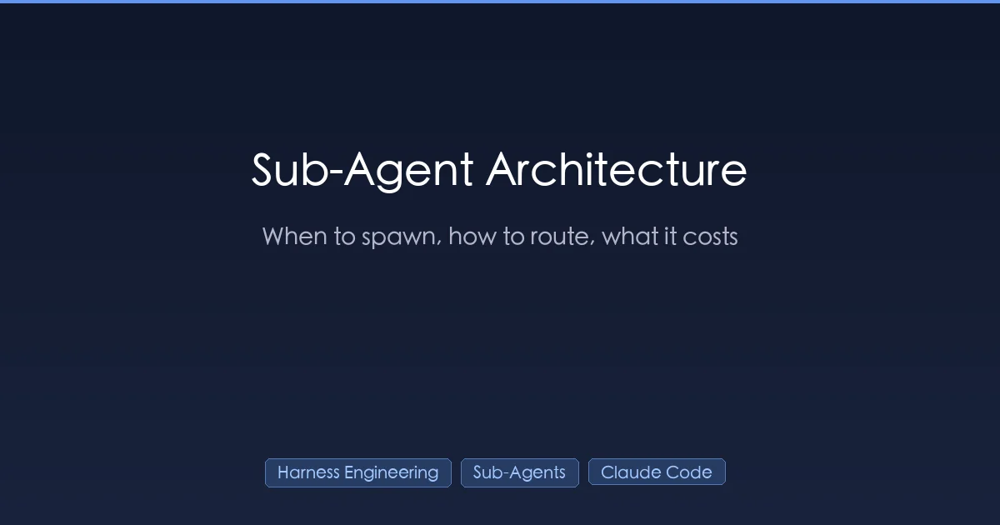
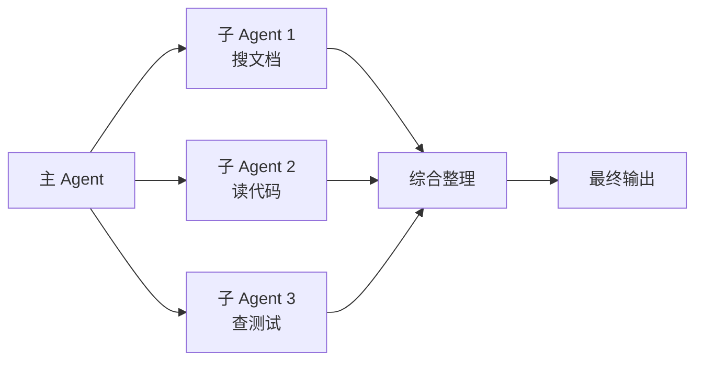
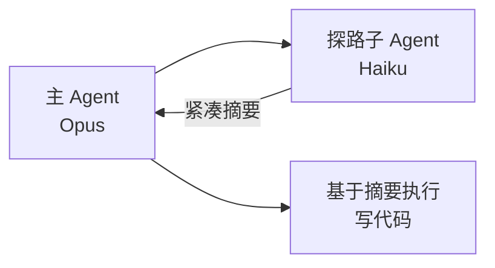
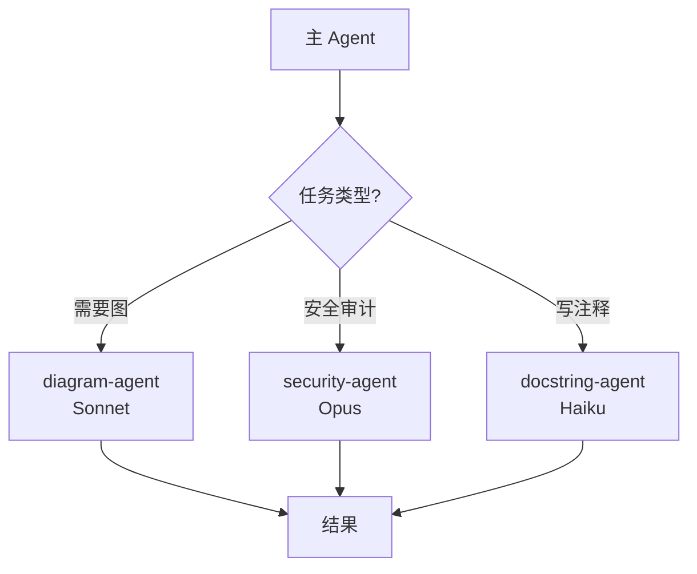
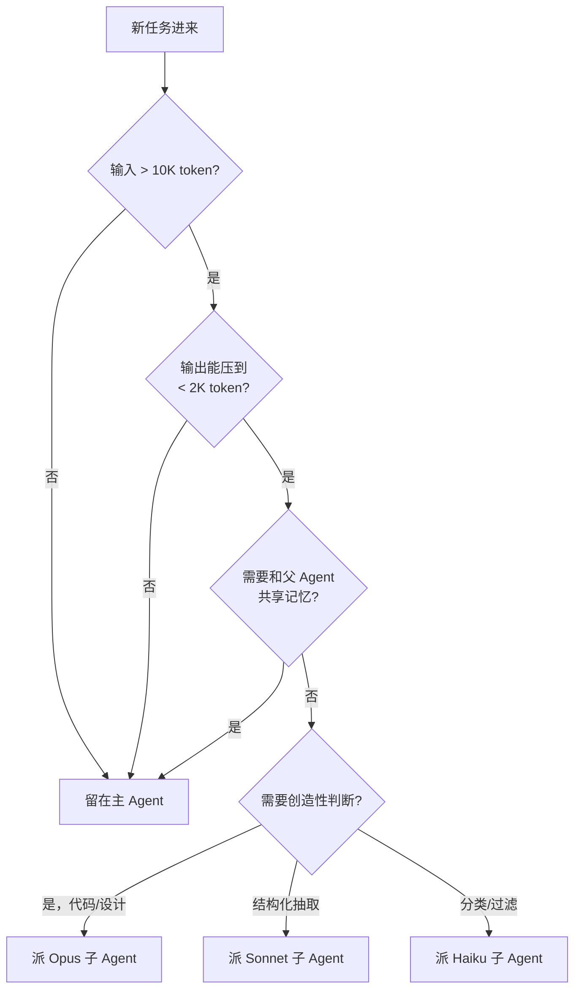

+++
date = '2026-04-13T10:00:00+08:00'
draft = false
title = 'Sub-Agent 架构设计：什么时候该拆子 Agent，Opus/Sonnet/Haiku 怎么分工'
description = 'Sub-Agent 架构的本质是上下文垃圾回收，不是并行加速器。实测经验：每次 spawn 至少 10000 token 输入才划算，Sonnet 做调度、Opus 做最终生成、Haiku 做扫描的路由让成本降约 60%。附决策树、三种编排模式与模型分工表。'
toc = true
tags = ['Harness Engineering', 'Sub-Agents', 'Claude Code', 'AI Agents', 'AI Engineering']
keywords = ['Sub-Agent 架构', 'Claude Code 子 Agent', '子 Agent 怎么用', 'Opus Sonnet Haiku 分工', 'AI Agent 编排模式', '多 Agent 协作', '上下文隔离', '子 Agent 成本优化', '子 Agent 最佳实践']

[[params.faqItems]]
question = "什么时候应该拆 Sub-Agent？"
answer = "满足三个条件同时成立时才拆：(1) 任务读的上下文远多于产出；(2) 产出能压缩到几百 token 以内；(3) 主 Agent 不需要看到中间过程。典型场景是代码库搜索、文档定位、日志分流、多文件并行分析。不要在需要共享工作记忆的多步推理里拆子 Agent——子 Agent 启动时是冷上下文，无法继承主 Agent 刚形成的判断。"
[[params.faqItems]]
question = "多 Agent 系统一定比单 Agent 好吗？"
answer = "不是。Cognition 团队在 Devin 的公开复盘里明确说过：朴素的多 Agent 架构在真实任务上经常比单 Agent 差，因为子 Agent 之间对模糊目标会失去对齐。正确的心智模型是：Sub-Agent 是「上下文垃圾回收」机制，不是并行加速器。它的价值是帮主 Agent 扔掉噪声，不是把思考切碎。只有当子任务真正独立、交接契约清晰时，多 Agent 才会赢过单 Agent。"
[[params.faqItems]]
question = "Sub-Agent 怎么在 Opus / Sonnet / Haiku 之间选？"
answer = "按「决策复杂度」路由，不要按「输入体量」路由。需要判断力的生成任务（写代码、写方案、做架构选型）上 Opus；结构化抽取和摘要（准确但不需要创造力）上 Sonnet；确定性的过滤、分类、大批量扫描上 Haiku。最常见的错配是：主 Agent 用 Opus 做调度、子 Agent 用 Sonnet 写代码。应该反过来——让便宜模型探路，把 Opus 留到最终生成那一步。"
[[params.faqItems]]
question = "Sub-Agent 实际成本比单个大上下文高多少？"
answer = "每次 spawn 都有冷启动开销：system prompt、CLAUDE.md、工具 schema 都要重新计 token。如果子 Agent 只处理 2000 token 的真实工作，光是开销就能超过工作本身。经验盈亏平衡点大约是「每次 spawn 至少 10,000 token 输入」。低于这个量级就留在主 Agent 里做。高于这个量级，子 Agent 才真正通过释放主 Agent 上下文赚回成本。"
[[params.faqItems]]
question = "Sub-Agent 和 Skill、Tool、MCP 有什么区别？"
answer = "Tool 是一个确定性的函数调用，不带思考。MCP Server 是一组工具的标准化封装。Skill 是加载到当前 Agent 上下文里的指令包，它是「prompt 扩展」，和主 Agent 共用上下文。Sub-Agent 是一次独立的 LLM 调用，有自己的上下文窗口、自己的 system prompt、无法访问父 Agent 的工作记忆。区分的关键是上下文隔离：凡是子 Agent 读过、想过、算过的东西，都不会污染父 Agent。"
+++



这是 [Harness Engineering 系列](/zh/posts/ai/2026-03-30-harness-engineering-guide/) 的**第三篇**。第一篇讲了框架（Agent = 模型 + Harness），[第二篇](/zh/posts/ai/2026-03-31-harness-claudemd-guide/) 拆了 `CLAUDE.md` 这个最重要的前馈控件，这篇讲的是多数团队都做错了的结构决策：**什么时候该拆 Sub-Agent、怎么路由、到底花多少钱**。

先给结论，这个结论你大概率在别的地方看不到：

> **Sub-Agent 不是"并行加速器"，它是"上下文垃圾回收机制"。它的本质是帮你扔掉噪声，不是帮你切碎思考。**

我见过太多团队，第一次撞上上下文窗口上限、或者第一次觉得"这任务好大"，就条件反射式地去 fan-out 子 Agent。短期看确实快，长期看三个月后在 debug 为什么几个子 Agent 的输出互相打架。失败模式几乎一模一样：明明该留在主 Agent 里做的决策，被拆出去丢进了三个冷启动的进程里，谁也看不到谁的证据。

这篇文章的目标是把"凭感觉 spawn"变成"能说出理由才 spawn"。我会给你一张决策树、一张 Opus/Sonnet/Haiku 路由表、一个成本计算公式，这些东西都是我在自己的博客写作管线里真刀真枪跑出来的。

## 三个烧钱的误区，先拆了

进入模式之前，先干掉最常见的三个误解。每一个都在生产环境里烧真金白银。

### 误区一："子 Agent 越多越快"

这是团队最容易犯的第一个错，而且直觉上非常合理，必须主动说服自己才能绕过。并行执行**有可能**更快，但每次 spawn 都有固定开销：system prompt 重新算 token、`CLAUDE.md` 重新加载、工具 schema 重新注入、新 Agent 要从零重新定位一遍。如果子任务实际只有 2000 token 的有效工作量，冷启动税可能直接超过工作本身。

我自己跑下来的经验值是：**每次 spawn 至少 10,000 token 输入**才值得。低于这个量级，调度开销反而比节省的多；超过这个量级，子 Agent 才开始真正赢——而且赢的不是速度，是"让主 Agent 完全不用承载这段上下文"。

Cognition 团队在 Devin 的架构复盘里写过一段被广泛引用的话：朴素的多 Agent 系统在真实任务上"不 work"，因为 Agent 之间对模糊目标会失去对齐——用自然语言在 LLM 之间交接信息本身是有损的。他们的建议反直觉：**宁可用一个大上下文窗口的单 Agent，也别用松散的多 Agent swarm**，除非你能把交接契约写死。

### 误区二："Sub-Agent 当然要用最便宜的模型"

第二个错和第一个刚好对称：团队默认子 Agent 是"辅助劳动"，应该用 Haiku 省钱。这是对质量来源的误判。

模型选择要**按决策复杂度路由，不是按输入体量**。一个子 Agent 读 10 万 token 日志、返回 200 token 分类结果——这活 Haiku 干得漂亮。但一个子 Agent 要重构 2000 行代码，输入虽然小，需要的判断力却是 Opus 级。按体量路由，最后就是 Haiku 在写生产代码、Opus 在总结日志，彻底反了。

### 误区三："调度层要用最聪明的模型"

第三个错是最贵的：让 Opus 当调度器，让 Sonnet 干活。这感觉很自然——"大脑"做决策、"手脚"执行——但它把真实的成本结构彻底倒置了。

调度工作大部分是路由逻辑 + 状态跟踪，不需要前沿推理。真正消耗认知力的工作发生在叶子节点：写代码、做架构权衡、从零碎证据里综合判断。**让 Sonnet 甚至 Haiku 当调度器，把 Opus 留到最终生成那一步**，判断力才会复利。

我把自己的博客写作管线从"Opus 调度 + Sonnet 执行"改成"Sonnet 调度 + Opus 写作 + Haiku 搜索"之后，端到端 token 成本下降约 60%，输出质量反而有肉眼可见的提升——因为 Opus 终于被用在该用的地方，不再花在"你去读一下那个文件"这种调度话术上。

## 核心心智模型：上下文垃圾回收

如果这篇文章你只带走一个概念，就带这个：**Sub-Agent 是一片崭新的堆内存**。你 fork 出一个隔离进程，让它在里面随便乱翻（读 20 个文件、grep、看日志），榨出一个紧凑摘要，然后让整个进程被垃圾回收。父 Agent 从头到尾看不到那摊烂摊子。

这就是为什么 Sub-Agent 的主力场景都有一个共同形状：**输入大、输出小、无状态**。举几个典型：

- **代码库搜索**：子 Agent 读几十个文件回答"哪个模块处理 webhook 重试？"，返回三句话。父 Agent 省掉 30K token 原本要背的源码。
- **文档分流**：子 Agent 把某个库的官方文档通读，抓出相关的三个 API 签名交回来。父 Agent 拿到签名，不用扛 80K token 的文档站。
- **日志分析**：子 Agent 扫 500K token 的日志、定位失败模式、报告堆栈。父 Agent 始终在干净上下文里工作。

每一种，子 Agent 的工作都是**摘要后丢弃**。这就是"垃圾回收"的框架。你不是在为速度做并行，你是在保护主 Agent 的工作记忆不被上下文污染——这是长任务里那种缓慢、隐形、最致命的 Agent 性能杀手。

反过来说，这个框架也告诉你**什么时候不该拆**：如果你想"扔掉"的东西其实是主 Agent 接下来需要的承重上下文，那子 Agent 反而更贵——因为父 Agent 还得重新拿一次。

## 三种编排模式（选一种，说得出为什么）

生产级 harness 设计里我常见到三种模式。每一种都有明确的适用场景和失败模式。

### 模式一：Fan-Out / Gather（并行派工）

经典模式：调度器把 N 个独立任务甩给 N 个子 Agent，等齐结果后综合。



**什么时候好用**：任务真正独立。交接契约提前写死（每个子 Agent 返回结构化摘要）。你在意延迟且 spawn 开销能摊平。

**什么时候翻车**：任务之间有隐藏依赖。子 Agent 2 其实需要知道子 Agent 1 查到了什么。结果你拿到三个看起来都合理、但彼此矛盾的结论。

**经验法则**：只有当你**能在 spawn 之前把交接 schema 写出来**，才用这个模式。如果子 Agent 的输出形状要看它发现什么才能定，留在主 Agent 里做。

### 模式二：Scout-Then-Act（串行隔离）

调度器先派一个便宜的子 Agent 探路，拿回摘要后自己动手。



**什么时候好用**：探索阶段基本是 I/O 密集、决策阶段需要判断力。常见形态：Haiku 探代码库地形，Opus 写修复代码。**这是我做过的大多数 harness 里杠杆最高的一个模式**——探路便宜快速可抛弃，执行步拿到的是干净的、已摘要的世界。

**什么时候翻车**：主 Agent 需要看原始证据而不是摘要。微妙 bug 里经常发生——"摘要漏掉了那个细节"往往就是根因所在。

### 模式三：Specialist Delegation（专家化委派）

调度器把子 Agent 当成类型化的专家——`diagram-agent`、`security-reviewer`、`docstring-writer`——每个有自己的 system prompt 和工具权限。



**什么时候好用**：你有反复出现的任务类型，能从专用上下文和工具限制里受益。这也是 Claude Code 官方内置子 Agent 的模式，和 [Claude Code Agent Teams](/zh/posts/ai/2026-02-22-claude-code-agent-teams/) 的设计一脉相承。

**什么时候翻车**：专家化过度。七个子 Agent，每个一个月调用两次，每个要维护自己的 `CLAUDE.md` 片段，每个 prompt 质量都在缓慢漂移。把这个模式当微服务看待——**同一形态的任务至少在主 Agent 里处理过三次之后，才值得抽成专家子 Agent**。

## 路由决策树

给定一个候选任务，我真实在用的决策流是这样：



这不是理论框架，这是我每次 spawn 之前真跑一遍的流程图。前三个问题决定**要不要拆**，最后一个决定**派给谁**。跳过前三个直接选模型的团队，就是 token 账单失控的团队。

## Opus / Sonnet / Haiku 路由表

按任务形状给三个模型的具体路由建议。拿它当起点，你自己的 benchmark 会进一步调整边界。

| 任务形状 | 举例 | 模型 | 理由 |
|---|---|---|---|
| 需要架构判断的代码生成 | 重构模块、带 trade-off 的功能 | Opus | 生成质量在长 token 上会复利，便宜模型犯的细微错下游要花几小时补 |
| 长文档里做结构化抽取 | 从 80K token 文档里拉 API 签名 | Sonnet | 要准确不需要创造，Opus 浪费 |
| 大批量分类 / 过滤 | 给 500 条日志分桶 | Haiku | 确定性模式识别，吞吐量取胜 |
| 代码 review（找问题） | 审 PR 找 bug 和风格 | Sonnet | 模式识别够强，除非架构 review 否则 Opus 过量 |
| 架构 review（做权衡） | 队列用 Redis 还是 Postgres | Opus | 判断力就是全部输出 |
| 生成注释 / docstring | 给 50 个函数补 JSDoc | Haiku | 代码到散文的机械转换 |
| 搜索并摘要 | "找出所有处理 webhook 重试的地方" | Sonnet | 需要轻量推理判断相关性 |
| 简单 YAML / JSON 转换 | 转换配置格式 | Haiku | 确定性、不需判断 |
| 写 commit message / PR 描述 | 把 diff 摘要成人话 | Sonnet | 够用的散文、比 Opus 便宜 10 倍 |

规律是：**创造力和判断力路由到 Opus，吞吐量和精度路由到 Haiku，其他默认走 Sonnet。**

## 具体成本模型

团队的 token 预算在子 Agent 上崩盘，根本原因是从来没算过这笔账。算一下就清楚了：

```
子 Agent 单次 spawn 成本 =
    (system_prompt_tokens + claude_md_tokens + tool_schema_tokens) × 输入单价
  + (work_input_tokens) × 输入单价
  + (output_tokens) × 输出单价
```

第一行是**冷启动税**，也是大家最容易忘的一块。如果你项目的 `CLAUDE.md` 是 1500 token，工具 schema 再 2000 token，那每次 spawn 在任务还没开始之前已经烧掉 3500 token。一个会话里 spawn 十次，光是开销就烧了 35K token。

用 Sonnet 的价格（输入 $3/M）举个具体例子：

- **主 Agent 直接干**：20K 上下文 + 2K 输出 ≈ 62 美分
- **一次 Haiku 探路**（读 50K 代码库，返回 500 token）：3.5K 开销 + 50K × $0.80/M + 0.5K × $4/M ≈ 4.3 美分，而且主 Agent 上下文全程干净
- **5 个 Sonnet 子 Agent 并行**，每个 5K 输入：5 × (3.5K + 5K) × $3/M = 12.8 美分开销，相比串行节省的是延迟而不是 token

**盈亏平衡经验法则**：如果"工作量 / 开销"的比值小于 3:1，留在主 Agent 里做。低于这个线，冷启动税占主导，你在为调度付钱却没拿到任何上下文隔离收益。

我建议在 harness 的可观测层记录 `overhead_tokens / work_tokens` 这个比例，并按子 Agent 分桶展示。**如果这个数长期高于 0.3，你的委派策略就是坏的**。

## Sub-Agent 不是什么

因为这套术语滑溜得很，我给出和相邻概念的清晰边界：

- **Tool** 是确定性的函数调用。Tool 不思考。`read_file(path)` 是 tool。
- **[MCP Server](/zh/posts/ai/2026-02-20-mcp-protocol-guide/)** 把一组 tool 封装在标准协议后面。MCP Server 暴露 tool，它本身不发起 LLM 调用。
- **[Skill](/zh/posts/ai/2026-02-28-claude-code-skills-guide/)** 是加载到当前 Agent 上下文里的指令包。Skill 是 **prompt 扩展**——跑在父 Agent 的上下文里，**不隔离**。
- **Sub-Agent** 是独立的一次 LLM 调用，有自己的上下文窗口和（通常）独立的 system prompt。关键特征是**上下文隔离**：子 Agent 读过、想过、算过的东西，**不会**污染父 Agent。

如果你在纠结"这个应该做成 skill 还是 sub-agent？"，判据只有一条：**父 Agent 是否需要对中间推理过程保持无感知？** 需要隔离——sub-agent；不需要——skill。

## 安全与权限含义

Sub-Agent 会继承一件大多数团队低估的东西：**工具权限**。如果主 Agent 能执行 shell、能写文件，你的子 Agent 默认也能，除非你显式缩权。如果一段 prompt injection 从外部内容（比如抓回来的网页）钻进子 Agent 的输入里，它就能触发父 Agent 本会拦截的破坏性操作。

防御模式很简单：**子 Agent 用最小权限白名单定义**。`search-agent` 只给 `read_file` 和 `grep`，别的不给。`docstring-agent` 给 `read_file` 和 `edit_file`，不给 shell。这就是 [Claude Code 安全模型](/zh/posts/ai/2026-02-22-claude-code-security/) 在子 Agent 上真正落地的地方——没有权限边界的子 Agent 就是带着主 Agent 全部权限的小号。

## 一个具体案例：我的博客写作管线

讲点真的。我自己的博客 harness 按上面这套原则重构过。原本的 `blog-writer` 是一个大胖子 Agent：调研、写稿、画图、生图全自己来。能跑，但单次会话要烧 200K+ Opus token。

新架构：

- **调度器**：Sonnet。读任务、决定调哪些子 skill、综合最终输出。
- **调研子 Agent**：Haiku + `web_search` + `read_file`。扫素材，回吐 1K token 的结构化摘要。
- **写作子 Agent**：Opus，对文章目录有读写权限。拿到摘要和判断框架，写正文。
- **画图子 Agent**：Sonnet，权限只限 mermaid 代码生成。
- **封面子 Agent**：Sonnet，只生成给图像模型的 prompt。

结果：同等输出质量，token 成本降了大约 **60%**，迭代速度也快得多——因为 Opus 不再每轮都在重新读自己 50K token 的调研 dump。主 Agent 小而干净。这就是"上下文垃圾回收"在生产里的样子。

## 什么时候**不要**用 Sub-Agent（诚实说边界）

"什么时候不该用"比"什么时候该用"更有价值。以下是我踩过坑的场景：

- **迭代式 debug**。你在追一个 bug，形成假设 → 验证 → 修正。每一步喂下一步。这里 spawn 子 Agent 会打断工作记忆——子 Agent 根本继承不到你刚形成的假设，它只能从摘要重新推导，而摘要定义上就不包含那个假设。
- **输入小于 5K token 的短任务**。冷启动税直接吃掉收益。就地干完。
- **成功标准模糊的任务**。如果你不能在 spawn 之前定义子 Agent 的返回 schema，说明你对任务的理解还不够，就不够资格委派。留在主 Agent 里摸到清楚。
- **父 Agent 会把子 Agent 读过的东西再读一遍**。比你想得常见。子 Agent 返回"这 5 个文件要紧"，然后父 Agent 把这 5 个文件全打开重读一遍——你刚花了两次 token 做同一件事。

老实说，Sub-Agent 是个动力工具，大多数任务不需要动力工具。**默认留在主 Agent。能说出"我要隔离哪段污染"才 spawn**。

## 带走的东西

- Sub-Agent 是**上下文垃圾回收机制**，不是并行加速器。价值在隔离噪声，不在墙钟时间。
- **盈亏平衡约 10K token 输入**。低于这条线，冷启动税吃掉收益。
- **按决策复杂度路由**，不按输入体量：Opus 做生成和判断，Sonnet 做结构化，Haiku 做过滤分类。
- **反转天真的"调度-工人"直觉**：Sonnet 在上层，Opus 在叶节点。
- **先选模式再 spawn**（fan-out / scout-then-act / specialist）。Scout-then-act 是杠杆最高的默认选项。
- **记录开销比**。如果 `overhead_tokens / work_tokens > 0.3`，你的委派策略坏了。

如果这篇文章你只落地一件事，就落地那张路由决策树。打印出来贴在显示器旁边，每个任务都走一遍流程再决定要不要 `spawn_subagent()`。你会 spawn 得更少、花得更少、跑得更快，也会少掉很多因为"一个本不该拆的决策被拆开了"而互相打架的子 Agent。

## 相关阅读

- [Harness Engineering 完全指南](/zh/posts/ai/2026-03-30-harness-engineering-guide/) — 系列第一篇，总体框架。
- [CLAUDE.md 最佳实践：写得少才是写得好](/zh/posts/ai/2026-03-31-harness-claudemd-guide/) — 系列第二篇，前馈控件，决定每个子 Agent 的初始"世界观"。
- [Claude Code Agent Teams：多 Agent 系统实战](/zh/posts/ai/2026-02-22-claude-code-agent-teams/) — 专家化委派模式的具体落地。
- [Claude Code Skills 指南](/zh/posts/ai/2026-02-28-claude-code-skills-guide/) — 什么时候用 Skill 代替 Sub-Agent。
- [Claude Code 安全模型](/zh/posts/ai/2026-02-22-claude-code-security/) — 子 Agent 工具白名单为什么重要。
- [AI Agent 记忆系统](/zh/posts/ai/2026-02-21-ai-agent-memory-systems/) — 隔离的另一半故事。

## 外链参考

- [Cognition 团队对多 Agent 系统的复盘](https://cognition.ai/blog/dont-build-multi-agents) — "别做多 Agent，除非迫不得已"的经典论证。
- [Anthropic Claude Code Sub-Agent 官方文档](https://docs.claude.com/en/docs/claude-code/sub-agents) — 官方模式和配置说明。
- [OpenAI Agents SDK](https://github.com/openai/openai-agents-python) — OpenAI Swarm 框架向显式 handoff 演进的方向。
