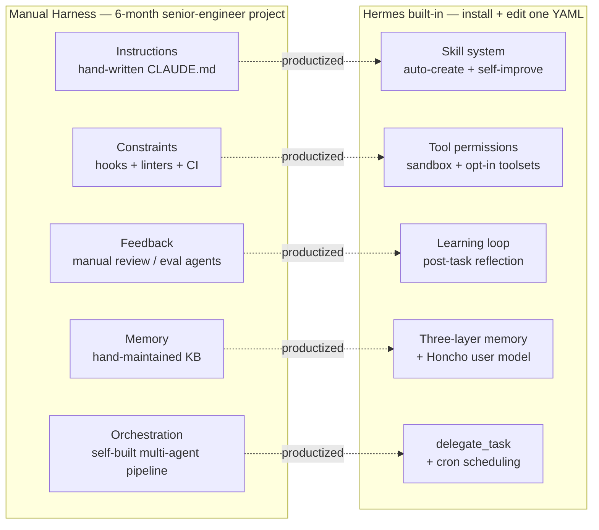
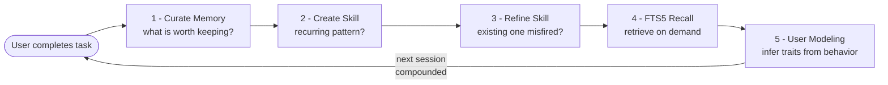
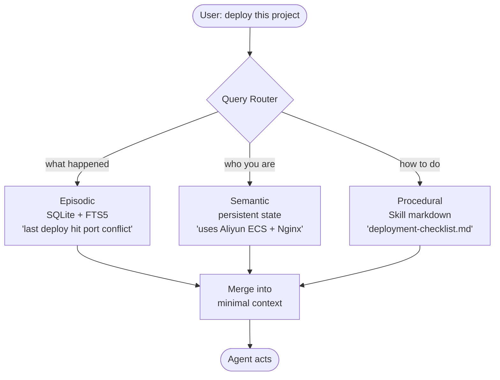

+++
date = '2026-04-14T10:00:00+08:00'
draft = false
title = 'Hermes Agent Review 2026: Nous Research Setup + Best Models'
description = "Nous Research Hermes Agent v0.9.0 hands-on review (April 2026): 27K+ GitHub stars, installation guide on $5 Hetzner VPS, best models for the harness (Claude Haiku / DeepSeek), Claude Code integration, and harness engineering pattern explained."
toc = true
tags = ['AI Agent', 'Hermes Agent', 'Nous Research', 'Harness Engineering', 'MCP']
keywords = ['hermes agent review', 'hermes agent v0.9', 'hermes agent nous research', 'hermes agent installation guide 2026', 'hermes agent harness engineering', 'best model for hermes agent nous research 2026', 'hermes agent vs claude code', 'hermes agent github stars 2026', 'hermes agent current version april 2026']

[[params.faqItems]]
question = "What is Hermes Agent?"
answer = "Hermes Agent is an open-source AI agent framework released by Nous Research in February 2026, licensed under MIT. It ships with the full Harness Engineering stack built in — a self-evolving learning loop, three-layer memory, auto-generated Skills, 40+ native tools, and 12+ messaging gateways. Two months after launch it crossed 27,000 GitHub stars. The tagline is literal: The Agent That Grows With You."

[[params.faqItems]]
question = "How is Hermes Agent different from Claude Code or OpenAI Agent?"
answer = "Claude Code is an interactive coding tool — you sit at the terminal and drive it. Hermes is an autonomous background engine — you deploy it on a $5 VPS and it runs 24/7, remembering you across sessions, writing its own Skills, and self-improving. They solve different problems. Most serious users will run both: Claude Code as the day shift for interactive work, Hermes as the night shift for persistent tasks like code review, research, and digest generation."

[[params.faqItems]]
question = "What is new in Hermes Agent v0.9.0 the everywhere release?"
answer = "Shipped April 13, 2026. Highlights: Termux/Android mobile support, iMessage and WeChat integrations, Fast Mode optimization for OpenAI and Anthropic endpoints, a background process monitor, and a local web dashboard. The two weeks preceding release saw 209 PRs merged and 81 issues resolved — exceptional activity for an open-source agent project."

[[params.faqItems]]
question = "How much does it cost to run Hermes Agent 24/7?"
answer = "Hermes itself is MIT-licensed and free. Deployment costs depend on compute and model. The cheapest stable setup: a ~$4-5/month VPS (Hetzner CX22, DigitalOcean, Vultr) plus OpenRouter API credits routed to Claude Haiku or DeepSeek. Expect under $10/month total for light-to-moderate use. Memory footprint is under 500MB without a local LLM."

[[params.faqItems]]
question = "Is a self-improving agent safe? What if it learns bad behaviors?"
answer = "Hermes has three built-in constraints: Skill files are plain readable markdown (not black-box weights) so you can audit any change, memory data lives in a local SQLite file you can inspect or delete, and tool permissions run through a sandbox with an explicit toolset whitelist. Technically the self-improvement is auditable and reversible. The practical limit is whether you actually review the changes — most users never will. Nous Research committed to user-control-first design, but the MIT license grants you the right to audit, not a guarantee that you exercise it."
+++


Nous Research just shipped Hermes Agent v0.9.0 "the everywhere release" on April 13, 2026. Two months after the initial launch the repo is sitting at 27,000+ GitHub stars, and the two weeks preceding v0.9.0 saw 209 PRs merged and 81 issues closed. That is an unusual cadence for an open-source agent project, and I think it is worth unpacking why this one matters beyond the release-note excitement.

I have been running Hermes on a $5 Hetzner box alongside my usual Claude Code workflow for the past week. This review is based on that, plus a careful read of the 63-page Chinese-language handbook "Hermes Agent: From Beginner to Mastery" (v260407) that walks through every subsystem.

My take: **Hermes is the first personal AI agent that ships with the harness already built in**. Every other agent I have used — Claude Code, Cursor, Aider, OpenClaw — requires you to hand-craft the harness yourself. CLAUDE.md, hooks, memory files, workflows. Hermes automates all five layers and lets the harness grow with you.

If you are already deep into AI agent tooling, this is the release to pay attention to in April 2026.

## What Nous Research actually shipped

Before getting to the hands-on parts, a quick grounding in what Nous Research is and why that matters.

Nous Research is one of the more quietly respected open-source AI labs. They do not publish paper volume like DeepMind. They do not raise Series C money like Anthropic. What they do is ship well-tuned open-weight models — the Hermes 3 family (8B, 14B, 70B, 405B) is considered one of the best fine-tune lineages in 2025–2026 — entirely through post-training rather than building foundations from scratch.

That philosophy carries over to Hermes Agent. The product thesis is explicit: **with open-source tools and any LLM API, an individual should be able to deploy an agent that rivals commercial offerings**. MIT license. No hosted-SaaS dependency. No vendor lock-in. Your data stays in `~/.hermes/` on your own machine.

The core capabilities as of v0.9.0 (numbers cross-checked against the official handbook and the GitHub release notes):

| Dimension | Hermes Agent v0.9.0 |
|-----------|--------------------|
| GitHub stars | 27,000+ (two months post-launch) |
| Built-in tools | 40+ |
| Platform gateways | 12+ (Telegram, Discord, Slack, WhatsApp, Signal, iMessage, WeChat, CLI, Termux, and more) |
| MCP apps reachable | 6,000+ via Model Context Protocol |
| Max concurrent sub-agents | 3 (deliberate hard limit) |
| Min deployment cost | ~$5/month VPS |
| Memory footprint | <500MB (without local LLM) |
| License | MIT (fully open source) |

## The core thesis: Harness Engineering, productized

To understand why Hermes matters, you need the context on [Harness Engineering](/posts/ai/2026-03-10-ai-coding-agents-comparison-2026/) — the argument that took over AI agent discourse in early 2026.

The short version: the LangChain team ran an experiment where they held the model constant (GPT-5.2-Codex) and only adjusted the surrounding "harness" — the instructions, constraints, feedback loops, memory, and orchestration around the model. Score on their internal benchmark moved from 52.8% to 66.5%. Ranking jumped from outside the top 30 to top 5. Zero model changes.

Mitchell Hashimoto (Terraform creator) gave the discipline a name: **Harness Engineering**. His method was blunt: every time the AI makes a mistake, add one rule to CLAUDE.md. Over weeks, the file becomes a precise specification of your project's unwritten rules. The agent transforms from a confused newcomer into a seasoned team member.

The problem with Harness Engineering as a methodology is that **execution is entirely manual**. You write the CLAUDE.md. You configure the hooks. You build the memory system. You design the feedback loops. Harness Engineering tells you what to do; it does not do it for you.

This is where Hermes takes a product-level position. The harness has five components, and Hermes builds them all in:

| Harness Layer | Manual Implementation | Hermes Built-in System |
|---------------|----------------------|------------------------|
| Instructions | Hand-written CLAUDE.md / AGENTS.md | Skill system (markdown, auto-created + self-improving) |
| Constraints | Hooks / linters / CI | Tool permissions + sandboxed execution + opt-in toolsets |
| Feedback | Manual review / evaluator agents | Self-improvement learning loop (post-task reflection) |
| Memory | Hand-maintained knowledge base | Three-layer memory (session/persistent/skill) + Honcho user modeling |
| Orchestration | Self-built multi-agent pipeline | `delegate_task` sub-agents + cron scheduling |

— Adapted from "Hermes Agent: From Beginner to Mastery" handbook v260407



The left column is a six-month project for a senior engineer. The right column is `curl install.sh | bash` followed by editing one YAML file. This is what "the first AI agent that ships with the harness built in" means concretely.

## Unpacking "the agent that grows with you"

The slogan is easy to skim past. Let me make it concrete because I think it is the most distinctive thing about Hermes relative to Claude Code, OpenClaw, or the forthcoming OpenAI Agent SDK.

### The learning loop has five stages

Every completed task triggers a reflection cycle:

1. **Curate memory** — decide what from this conversation is worth persisting
2. **Create Skill** — if this is a recurring pattern, extract a reusable Skill file
3. **Refine Skill** — if an existing Skill misfired, update it
4. **FTS5 recall** — the next session retrieves relevant history via full-text search, not by dumping everything into context
5. **User modeling** — the optional Honcho module infers your traits from behavior patterns

None of these five are individually novel. Memory systems exist. Skill files exist. Full-text search is ancient. User modeling is well-worn territory. What is novel is **wiring them into a closed loop that runs automatically**. The handbook uses a flywheel metaphor, which I think is accurate: each loop makes the next loop slightly better, and the improvements compound.



The handbook gives a concrete example that I found sharp (quoting loosely from §03):

> The first time you ask Hermes to write a Python scraper, it produces a working script. But the style is not yours, the variable naming is not your convention, the error handling is not how you would do it. Normal — it does not know you yet.
>
> By the tenth time, everything has changed. It knows you prefer `httpx` over `requests`. It knows you like error logs written to files rather than printed to stderr. It knows your project structure, your function length preferences, your test file conventions. **Nobody taught it these. It learned on its own.**

Compare this with Claude Code's CLAUDE.md model. In Claude Code, the human writes rules and the AI follows them. In Hermes, the AI observes patterns and writes Skills; the human has veto power but does not need to maintain them. I wrote about this tradeoff in my [CLAUDE.md vs README](/posts/ai/2026-01-31-claudemd-vs-readme/) piece — the Claude Code approach gives you more control, the Hermes approach lowers the cost of getting started to near zero.

Neither is strictly better. If you have the discipline to maintain a carefully-written CLAUDE.md, you get more precision. If you do not, Hermes gives you 70% of the value with zero maintenance cost.

### Three-layer memory: the architecture choice that matters

This is where Hermes visibly differentiates from ChatGPT's "memory" feature and even Claude Code's auto-memory.

- **Session memory (episodic)** — every turn written to SQLite with FTS5 full-text indexing. Answers "what happened?"
- **Persistent memory (semantic)** — distilled state about who you are: preferences, habits, tool chains. Answers "who are you?"
- **Skill memory (procedural)** — markdown files under `~/.hermes/skills/` capturing how to do recurring tasks. Answers "how do I do X?"

These correspond to the three memory types cognitive science identifies in humans (episodic, semantic, procedural). It is not a gimmick — the mapping forces different storage, retrieval, and update strategies for each type.

The critical design decision is **retrieve-on-demand instead of load-everything**. When a new session starts, Hermes does not pack the last month of conversations into the context window. It runs an FTS5 search against the current topic and pulls only the relevant fragments. This is why a Hermes installation can accumulate months of conversation history without degrading response latency — something ChatGPT's memory does not solve.



For the comparison that matters most to AI agent developers:

| Dimension | Claude Code | Hermes Agent |
|-----------|-------------|--------------|
| Memory format | CLAUDE.md + auto-memory text files | SQLite + FTS5 index + Skill files |
| Write mechanism | Manual for CLAUDE.md, semi-auto for auto-memory | Fully automatic with manual override |
| Retrieval | Load CLAUDE.md at startup | On-demand FTS5 retrieval |
| Granularity | Project-level | Global + project-level |
| User modeling | None (you write the preferences) | Automatic via Honcho |
| Procedural memory | Inline in CLAUDE.md | Separate Skill files, self-improving |
| Cross-project sharing | `~/.claude/CLAUDE.md` for globals | All memory is global by default |
| Storage ceiling | CLAUDE.md suggested under a few KB | SQLite, practically unbounded |

— Adapted from handbook v260407 §04

Claude Code's model gives you more deterministic control (you wrote the rules, you know what they say). Hermes' model gives you lower activation energy and automatic adaptation (the rules emerge from your actual behavior).

## Hands-on installation and the three deployment paths

The handbook walks through three installation paths. I tried all three over the past week. Summary:

### Path 1: local install — 5 minutes to first conversation

```bash
curl -fsSL https://raw.githubusercontent.com/NousResearch/hermes-agent/main/scripts/install.sh | bash
```

Handles Python, Node.js, and all dependencies. Runs on macOS, Linux, WSL2. On my MacBook it took 3 minutes including the Python env setup.

Minimum viable `~/.hermes/config.yaml`:

```yaml
model:
  provider: openrouter
  api_key: sk-or-xxxxx
  model: anthropic/claude-sonnet-4

terminal: local

gateway:
  telegram:
    token: YOUR_BOT_TOKEN
```

One command to start:

```bash
hermes
```

### Path 2: Docker — clean isolation

```bash
docker pull nousresearch/hermes-agent:latest
docker run -v ~/.hermes:/opt/data nousresearch/hermes-agent:latest
```

The `-v ~/.hermes:/opt/data` mount maps the container data volume to your host. Every piece of Hermes state — memory, Skills, config — lives under `~/.hermes/`. You can delete the container and the data survives. I like this design a lot more than agents that scatter state across `~/.config/`, `~/Library/`, and a hidden app data directory.

### Path 3: $5 VPS for 24/7 operation — the real use case

This is the deployment that unlocks what Hermes is actually for. If you only use it on your laptop when you are online, Claude Code is simpler and faster. Hermes earns its keep when **it works while you sleep**.

Recommended (per handbook §07):

| Provider | Monthly | Notes |
|----------|---------|-------|
| Hetzner CX22 | ~$4 | Best value, EU nodes |
| DigitalOcean Droplet | $5 | Singapore/US West |
| Vultr | $5 | Tokyo low-latency |

Ubuntu 22.04 LTS, SSH in, run the same install script. Without a local LLM, memory usage stays below 500MB, so $5 is plenty.

### The provider decision — critical caveat for April 2026

Per the handbook §07 (and I have confirmed this separately): **as of April 2026, Anthropic blocked third-party tools from accessing Claude via subscription (Pro/Max) accounts**. Hermes, OpenClaw, and similar agent frameworks are all affected. You can still use Claude via pay-as-you-go API keys, but the cost profile is materially worse than subscription access.

My recommended sequence for new users:

1. **Start with OpenRouter** — 200+ models, trivial to switch, no lock-in
2. **Settle on a primary model after a week**, then direct-connect to save middleware fees
3. **If cost-sensitive**, route Hermes to Claude Haiku or DeepSeek for most turns
4. **If privacy-sensitive**, run Ollama locally with Hermes 3 8B — API cost drops to zero but you need 16GB+ of VRAM

## What v0.9.0 "the everywhere release" actually adds

The v0.9.0 headline features reflect a clear product direction: **the agent should live wherever you already live**, not force you into a new UI.

- **Termux / Android support** — a full Hermes instance on your Android phone, useful for privacy-first mobile setups
- **iMessage integration** — Apple users can talk to Hermes through the system iMessage app (US market)
- **WeChat integration** — community-maintained WeChat Bot for the Chinese market
- **Fast Mode for OpenAI and Anthropic** — an optimization path that reduces learning-loop token overhead on these two providers, lowering per-turn cost by a measurable amount
- **Background process monitor** — visibility into what sub-agents are running and what they are doing
- **Local web dashboard** — `http://localhost:port` opens a management UI to inspect memory, Skills, and task history

Of these, I think **Fast Mode** is the most strategically important. The handbook notes that Hermes' learning-loop value compounds with usage frequency — a light user gets marginal benefit, a heavy user gets significant benefit. Fast Mode reduces the marginal cost of every interaction, which makes heavy usage more sustainable. This is compounding on compounding.

The Termux/iMessage/WeChat expansion is also strategically interesting. It is a bet that **the next interface war is not a UI war, it is an integration war**. If Hermes can answer you in whichever messaging app you already use, the activation cost for new users drops toward zero.

## Where Hermes fits in the 2026 agent landscape

Anyone paying attention to AI agents in 2026 has heard of three products that actually matter: Claude Code, OpenClaw, and now Hermes. I have written about the first two in depth — [Claude Code open-source agent analysis](/posts/ai/2026-04-01-claude-code-open-source-agent/) and the [OpenClaw multi-agent guide](/posts/ai/2026-02-23-openclaw-multi-agent-guide/). They are not competitors in the naive sense. They represent three different philosophies about what an AI agent should be.

| Dimension | Claude Code | OpenClaw | Hermes Agent |
|-----------|-------------|----------|--------------|
| Core philosophy | Interactive coding partner | Config-as-behavior framework | Autonomous background engine |
| Your role | Sit at terminal, drive it | Write config files defining behavior | Deploy, occasionally audit |
| Memory model | CLAUDE.md + auto-memory | Multi-layer (SOUL.md + daily logs + semantic search) | Three-layer self-improving |
| Skill source | Manual install | ClawHub 44,000+ community skills | Agent-created + community Hub |
| Run mode | On-demand launch | On-demand launch | 24/7 background |
| Deployment | Local CLI (subscription) | Local CLI (free + API fees) | $5 VPS / Docker / serverless |
| Audit transparency | Medium (CLAUDE.md is static) | High (SOUL.md fully declarative) | Medium (Skills auto-change, but diffable) |

When to use which:

- **Writing new features, refactoring, debugging** → Claude Code. You want real-time feedback and human judgment in the loop.
- **Team-standardized agent with audit trail** → OpenClaw. SOUL.md is fully declarative, perfect for compliance.
- **24/7 code review, digests, monitoring** → Hermes. Cron scheduling + GitHub MCP + persistent memory.
- **Personal knowledge assistant across months of research** → Hermes. This is the canonical use case.
- **Community bot, customer support agent** → Hermes. 12+ gateway support means one agent, multiple entry points.
- **Rapid prototype, one-off tasks** → Claude Code. Low activation energy, fast iteration.
- **Long-term content projects** → Hermes + Claude Code together. Hermes accumulates research and style preferences, Claude Code does the writing.

The last row is the combination that most experienced users converge on, and it is also the combination I now run. I went into depth on this workflow in my [OpenClaw vs AI Agents comparison](/posts/ai/2026-03-05-openclaw-vs-ai-agents/).

## The uncomfortable question about self-improving agents

I want to end on the chapter the handbook itself chose to close with (§17): **what is the ceiling on self-improving agents?**

On paper the improvements seem safe. Skills are markdown, not opaque neural weights. You can `diff` any change. Memory lives in SQLite, you can inspect and delete any row. Tool permissions are sandboxed with explicit whitelists. The self-improvement is technically auditable and technically reversible.

But there is a gap between "you can audit this" and "you will audit this". The handbook is candid about it:

> Will you really check which Skills Hermes edited every day? Will you audit its memory database? Probably not. The appeal of deploying Hermes is that you do not have to babysit it. If you are going to review its self-improvements daily, what is the difference from manually maintaining your Skills?

This is the Kief Morris "in the loop / on the loop / out of the loop" distinction applied to self-improving agents. Hermes' default deployment is effectively "out of the loop for the improvements, on the loop for the outputs". Most users will drift toward fully out-of-the-loop because that is the path of least resistance.

My honest assessment: **for individual users with clear feedback signals, this works fine**. You notice when the output is wrong, you correct it, the agent learns. For ambiguous domains or domains where you lack the expertise to judge correctness, the self-improvement has no reliable ground truth. The agent can get faster and more confident at the wrong thing.

Nous Research's design choice was user-control-first: MIT license, local data, readable Skills. They gave you the rights. They cannot guarantee you exercise them. That is not a criticism of Hermes — it is the structural reality of any self-improving system.

## Should you install it?

My recommendation matrix:

- **You use Claude Code heavily and wish it remembered you across projects** → install Hermes this weekend
- **You want a private AI assistant that runs on your own hardware** → Hermes is the cleanest option in April 2026
- **You do content work (research, writing, digest generation) that benefits from persistent memory** → install Hermes alongside Claude Code
- **You want a community bot or multi-platform assistant** → Hermes' 12+ gateways make this trivial
- **You are enterprise and need SOC2-grade auditability** → stay with OpenClaw, Hermes' self-modifying Skills complicate audit
- **You do one-off tasks and do not care about cross-session memory** → stick with Claude Code or ChatGPT

The $5/month downside case is that you end up with a VPS subscription you cancel in a month. The upside case is that you experience, for the first time, an AI assistant that actually remembers you — and you cannot go back. I think that is a worthwhile bet to take.

## References and further reading

Internal deep-dives:

- [OpenClaw multi-agent guide](/posts/ai/2026-02-23-openclaw-multi-agent-guide/) — OpenClaw capability overview
- [OpenClaw vs AI Agents ecosystem](/posts/ai/2026-03-05-openclaw-vs-ai-agents/) — agent tool landscape 2026
- [AI coding agents comparison 2026](/posts/ai/2026-03-10-ai-coding-agents-comparison-2026/) — Claude Code / Cursor / OpenClaw benchmarks
- [Claude Code open source agent era](/posts/ai/2026-04-01-claude-code-open-source-agent/) — how open source is reshaping agent tooling
- [CLAUDE.md vs README](/posts/ai/2026-01-31-claudemd-vs-readme/) — why instruction files matter

First-party sources:

- [Hermes Agent on GitHub](https://github.com/nousresearch/hermes-agent) (v0.9.0 source)
- [Hermes Agent official site](https://hermes-agent.nousresearch.com/)
- [Nous Research](https://nousresearch.com/)
- [agentskills.io standard](https://agentskills.io/) — cross-agent Skill interoperability

---

One concession for intellectual honesty: I have been running Hermes for a week, not six months. Some of my conclusions about the long-term compounding effect of the learning loop are extrapolated from the handbook's claims and my early signals, not lived experience. Check back in Q3 2026 for the longer view. For now, if you have been waiting for an open-source agent that ships with the full harness built in, Hermes is the first one that qualifies, and v0.9.0 is a good release to start with.
