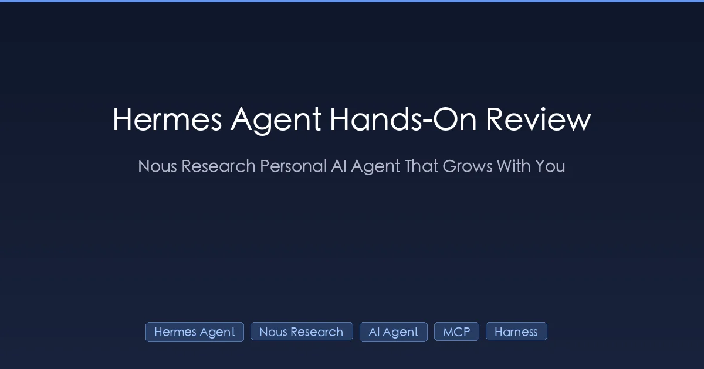
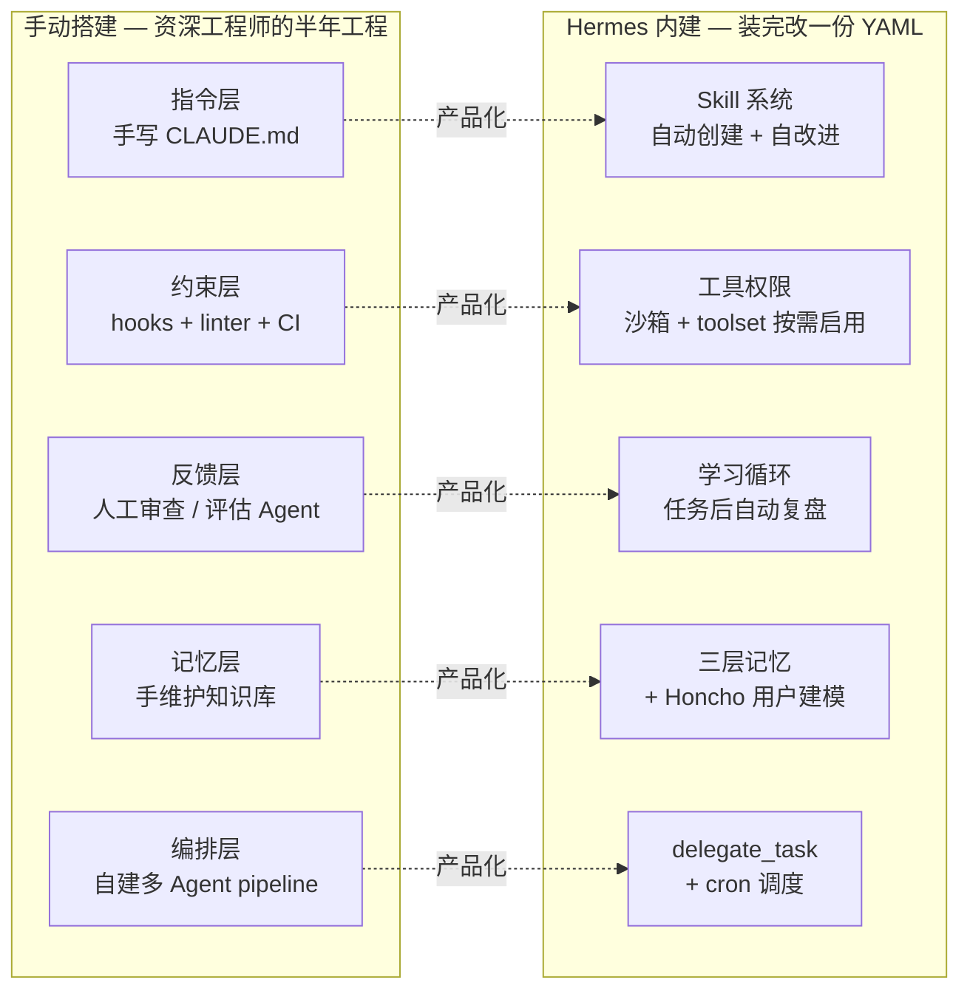
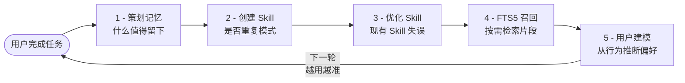

+++
date = '2026-04-14T10:00:00+08:00'
draft = false
title = 'Hermes Agent 完全指南 2026：Nous Research 出品的"会成长"的个人 AI 代理'
description = 'Hermes Agent 是 Nous Research 开源的自改进 AI 代理，出厂就带缰绳、会自己写 Skill、三层记忆跨会话连续。本文基于官方 PDF 教程 v260407 讲清楚怎么装、怎么用、和 Claude Code 有什么区别。'
toc = true
tags = ['AI Agent', 'Hermes Agent', 'Nous Research', 'Harness Engineering', 'MCP']
keywords = ['Hermes Agent 教程', 'Nous Research AI 代理', '个人 AI agent', 'Hermes Agent 安装', 'AI agent 会成长', 'Hermes Agent 和 Claude Code 区别', 'Hermes Agent v0.9.0', '自改进 Agent']

[[params.faqItems]]
question = '''Hermes Agent 是什么？'''
answer = '''Hermes Agent 是 Nous Research 在 2026 年 2 月开源的 AI 代理框架，MIT 许可。它最大的特点是"出厂就带缰绳"——内置了学习循环、三层记忆、Skill 系统、40+ 工具和多平台接入，不需要你手写 CLAUDE.md 或配置 hooks，Agent 会自己从使用中进化。两个月 GitHub 冲到 27000+ stars。'''

[[params.faqItems]]
question = '''Hermes Agent 和 Claude Code 有什么区别？'''
answer = '''Claude Code 是"交互式编码工具"——你坐在终端前，它实时回应你。Hermes 是"自主后台引擎"——你部署到 $5 VPS 后它 24/7 运行、自己记忆、自己写 Skill、自己改进。我的判断是：Claude Code 是白天团队，Hermes 是夜班团队。两者不是替代关系，是分工关系。'''

[[params.faqItems]]
question = '''Hermes Agent 怎么安装？最便宜要多少钱？'''
answer = '''三种方式：一键脚本（curl 安装脚本到 bash）、Docker、$5/月 VPS。Hermes 本身 MIT 开源免费，你只付 LLM API 调用费。最省钱方案是 Hetzner CX22（~$4/月）+ OpenRouter 走 Claude Haiku 或 DeepSeek，整套 24/7 在线月成本 $10 以内。'''

[[params.faqItems]]
question = '''v0.9.0 the everywhere release 有什么新东西？'''
answer = '''2026-04-13 发布的 v0.9.0 主打"无处不在"：Termux 移动端和 Android 支持、iMessage 和 WeChat 集成、OpenAI/Anthropic 的 Fast Mode、后台进程监控、本地 Web 仪表板。过去两周合并 209 个 PR，解决 81 个 issue，活跃度在开源 Agent 项目里数一数二。'''

[[params.faqItems]]
question = '''自改进 Agent 会不会失控？'''
answer = '''技术上有三重约束：Skill 文件是可读 markdown（不是黑箱权重）、记忆数据在本地 SQLite（你能直接看和删）、工具权限有沙箱。你能看到 Agent 改了什么、能回滚、能删除。但"你能看到代码"和"你看了代码"是两回事，真正的边界是你愿意让它自改进到什么程度。Nous Research 选了"用户控制优先"，MIT 许可给你审计权利，但不保证你行使这个权利。'''
+++



OpenClaw 的龙虾热还没散，Hermes Agent 就来了。

两个月 27000+ stars，2026 年 4 月 13 日刚发布 v0.9.0 "the everywhere release"，过去两周合并 209 个 PR、解决 81 个 issue。看着很热闹，但你可能跟我第一反应一样：龙虾我都还没搞明白，又来一个？

我花了一周时间把 Hermes 从头到尾拆了一遍，又对照读完了花叔那本《Hermes Agent 从入门到精通》(v260407) 的 63 页教程。结论是：**Hermes 不是又一只龙虾，它在做一件我们一直讨论但没人做成产品的事——把 Harness Engineering 的五个组件全内建了，而且让缰绳自己长大。**

如果你在用 Claude Code，这不是让你换工具的文章。如果你用过 OpenClaw，Hermes 也不是龙虾的升级版。它解决的是另一个问题：**你不在场的时候，Agent 怎么继续干活并变得越来越懂你。**

这篇文章不替 PDF 教程，教程 63 页的细节我消化过但不照抄。我想回答的是三个问题：它到底是个什么物种？值不值得装？什么人适合？

## 一句话讲清 Hermes Agent 是什么

**Hermes Agent = 自改进学习循环 + 三层记忆 + 自主 Skill 系统 + 40+ 内置工具 + 多平台 Gateway**，全部 MIT 开源，部署到 $5 VPS 就能 7×24 跑。

它的官方 slogan 是 "The Agent That Grows With You"——会成长的 Agent。这句话很容易被当营销词读过去，但拆开看：

- **会成长** = 它每次完成任务后会自动复盘，决定什么该记住、什么该提炼成 Skill、现有 Skill 需不需要优化
- **和你一起** = 它记得你是谁、知道你的偏好、理解你的工作习惯，而不是每次从零开始

我在《[OpenClaw vs AI Agents 生态全景](/zh/posts/ai/2026-03-05-openclaw-vs-ai-agents/)》里聊过 2026 年 Agent 赛道的几条路线。当时我没看到 Hermes 这种把 Harness Engineering 产品化的做法。它和 OpenClaw 的差别可以用一句话总结：**OpenClaw 是你养出来的龙虾，Hermes 是自己会长大的龙虾。一个靠你用心喂养，一个靠自己从经验中学习。**

核心数据（都摘自《Hermes Agent 从入门到精通》教程 v260407 并和官方仓库核对过）：

| 指标 | 数据 |
|------|------|
| GitHub stars | 27,000+（发布两个月） |
| 内置工具 | 40+ |
| 支持平台 | 12+（v0.9.0 加入 Termux/iMessage/WeChat） |
| MCP 可接入 | 6,000+ 应用 |
| 子 Agent 并发 | 最多 3 个 |
| 最低部署成本 | $5/月 VPS |
| 内存占用 | <500MB（不跑本地 LLM） |
| 许可证 | MIT（完全开源） |

## 为什么这次不一样：从 Harness Engineering 到出厂就带缰绳

如果你读过我之前那篇《[AI 编码 Agent 2026 横评](/zh/posts/ai/2026-03-10-ai-coding-agents-comparison-2026/)》，可能记得一个观点：2026 年初 AI 编码圈的共识是"瓶颈不是模型，是环境"——LangChain 团队用同一个 GPT-5.2-Codex，只调整缰绳配置，成绩从 52.8% 涨到 66.5%，排名从 Top 30 跳到 Top 5。

Mitchell Hashimoto（Terraform 创始人）给这事命了名：Harness Engineering。他的做法很朴素——每次 AI 犯错，就加一条规则到 CLAUDE.md，让它永远不再犯同一个错。

但方法论有一个问题：**执行全靠人**。你得自己写 CLAUDE.md、自己配 hooks、自己搭记忆系统、自己设计工作流。

Hermes 做的事情就一件：把 Harness 的五个组件全部内建了，而且自动运转。

| Harness 五组件 | 手动实现方式 | Hermes 内建系统 |
|----------------|-------------|-----------------|
| 指令层 | 手写 CLAUDE.md / AGENTS.md | Skill 系统（markdown，自动创建+自改进） |
| 约束层 | 配置 hooks / linter / CI | Tool permissions + sandbox + toolset 按需启用 |
| 反馈层 | 人工审查 / 评估者 Agent | 自改进学习循环（任务完成后自动复盘） |
| 记忆层 | 手动维护 knowledge base | 三层记忆（会话/持久/Skill）+ Honcho 用户建模 |
| 编排层 | 自己搭多 Agent pipeline | 子 Agent 委派 + cron 调度 |

—— 摘自《Hermes Agent 从入门到精通》教程 v260407



看左列和右列的对比。左边全是手动操作，你得是一个有经验的工程师才能搭出来。右边是开箱即用，装完就有。

**这就是"出厂就带缰绳"的字面意思**：你不需要像 Mitchell 那样每次犯错加一条规则。Hermes 会自己观察、自己总结、自己写入 Skill、自己在下次调用时应用这些规则。人的参与从"持续写规则"变成"偶尔审查一下"。

## 核心机制：学习循环是怎么转起来的

这是 Hermes 最值得琢磨的部分。很多 Agent 都说"我有记忆"，但 Hermes 的记忆是活的，它的 Skill 也是活的。

学习循环有五个环节：策划记忆 → 创建 Skill → Skill 自改进 → FTS5 召回 → 用户建模。单看每个都不新鲜，但串起来形成了一个持续改进的飞轮。



举一个 PDF 里的真实例子（摘自教程 §03）：

> 假设你第一次让 Hermes 帮你写一个 Python 爬虫。它会写出一个能用的脚本，但风格可能不是你喜欢的，变量命名可能跟你的习惯不一样，错误处理方式也未必符合你的预期。挺正常的，毕竟它不认识你。
>
> 到了第十次，情况完全不同。它知道你偏好用 httpx 而不是 requests，知道你习惯把错误日志写到文件而不是打印到终端，知道你的项目结构通常在 src/ 目录下按模块划分，知道你讨厌过长的函数。**没有人教它这些。它是自己学会的。**

这个过程的关键在于**用户反馈被沉淀为 Skill 文件**。你每次的修改（把 `进行优化` 改成 `优化一下`，把 `综上所述` 删掉）都会被 Hermes 观察记录，然后写入 `~/.hermes/skills/` 下的对应 markdown 文件。下次再调用时，那条规则已经内化。

我在《[Claude Code 最佳实践](/zh/posts/ai/2026-01-06-claudecode-best-practices/)》里写过，Claude Code 的 CLAUDE.md 也能做类似的事，但区别是：**CLAUDE.md 是人编写的，AI 执行；Skill 是 AI 编写的，人可以覆盖**。前者控制力更强，后者门槛为零。

### 三层记忆：从金鱼到老友

大多数 AI 聊天工具的记忆像金鱼，上一轮说的话下一轮就忘了。Hermes 用三层架构解决：

- **第一层 会话记忆（情景记忆）**：回答"发生了什么"。每轮对话写入 SQLite + FTS5 全文索引。关键设计是**按需检索而不是全量加载**——新对话开始时不把过去所有历史都塞进来，而是根据当前话题 FTS5 搜索相关片段。
- **第二层 持久记忆（语义记忆）**：回答"你是谁"。存的不是对话内容，是从对话中提炼的持久状态：编码偏好、项目结构习惯、常用工具链、工作时间规律。
- **第三层 Skill 记忆（程序性记忆）**：回答"怎么做事"。每个 Skill 是 `~/.hermes/skills/` 下一个 markdown 文件，可读可编辑。

这三层对应认知科学里的三种记忆类型（情景/语义/程序性）。PDF 里给了一个很直观的例子：你说"帮我部署这个项目"，Hermes 会先 FTS5 搜索会话记忆，找到上次部署时遇到的端口冲突问题（情景）；再查持久记忆，知道你用的是阿里云 ECS、Nginx 反向代理（语义）；最后加载 `deployment-checklist.md` 这个 Skill，按验证过的步骤执行（程序性）。三层各司其职。

**重点**：FTS5 是 SQLite 的全文搜索扩展，所有数据存在本地 `~/.hermes/` 目录下。没有云端同步，搬家时拷贝这个目录就行。对比 ChatGPT 那种"看起来有记忆但其实每次都重新加载全部历史"的做法，Hermes 是按需检索，数据库积累几个月对话也不会变慢。

## 怎么装：三种方式，5 分钟到 24/7

安装方式三选一，以下步骤全部基于官方教程 v260407 §07。

### 方式一：本地安装（5 分钟上手）

```bash
# 官方一键脚本
curl -fsSL https://raw.githubusercontent.com/NousResearch/hermes-agent/main/scripts/install.sh | bash
```

脚本会自动处理 Python、Node.js 和所有依赖。macOS、Linux、WSL2 都能跑。

装完编辑 `~/.hermes/config.yaml`：

```yaml
model:
  provider: openrouter          # 模型提供商
  api_key: sk-or-xxxxx          # 你的 API Key
  model: anthropic/claude-sonnet-4  # 使用的模型

terminal: local                 # 本地执行代码
```

最后启动：

```bash
hermes
```

没错，就一个词。

### 方式二：Docker（隔离干净）

```bash
docker pull nousresearch/hermes-agent:latest
docker run -v ~/.hermes:/opt/data nousresearch/hermes-agent:latest
```

`-v ~/.hermes:/opt/data` 这个参数把容器的数据卷映射到宿主机，所有状态（记忆、Skill、配置）都存在 `~/.hermes/` 一个目录下。容器删了数据不丢。

### 方式三：$5 VPS 24/7 运行（推荐的长期方案）

这是 Hermes 真正的使用场景。如果你只是偶尔在笔记本上玩玩，那 Claude Code 够用了。Hermes 的价值在于**你睡觉的时候它也在干活**。

推荐配置（摘自教程 v260407 §07）：

| VPS 提供商 | 月费 | 说明 |
|-----------|------|------|
| Hetzner CX22 | ~$4/月 | 性价比最高，欧洲节点 |
| DigitalOcean Droplet | $5/月 | 新加坡/美西节点 |
| Vultr | $5/月 | 东京节点延迟低 |

选 Ubuntu 22.04 LTS，SSH 登录后跑一键脚本，和本地安装一模一样。不跑本地模型的话内存占用不到 500MB，$5 的机器绰绰有余。

### 关于 provider 的一个重要提醒

从 PDF §07 里我看到一条很关键的信息——**2026 年 4 月起，Anthropic 封禁了第三方工具通过 Claude 订阅 (Pro/Max) 访问 Claude**。Hermes、OpenClaw 等 Agent 框架都受影响。

这意味着你不能再用 Claude Code 的订阅账号给 Hermes 共用，只能走 API key 按量付费。但按 API 付费成本会高得多。我的建议：

1. **起步阶段用 OpenRouter**，200+ 模型可选，灵活切换试手感
2. **确定常用模型后再直连对应 API** 省中间费
3. **国内用户**可以考虑 z.ai/智谱的 GLM-5
4. **隐私敏感**可以在 VPS 上跑 Ollama + 开源模型（需 16GB 以上内存）

## v0.9.0 "the everywhere release"：2026-04-13 刚发布

这是昨天的新闻。v0.9.0 叫 "the everywhere release"，直译是"无处不在版"。过去两周 209 个 PR 合并、81 个 issue 解决，重点是把 Hermes 搬到所有你能想到的消息入口。

核心新特性：

- **Termux / Android 移动端**：在安卓手机上跑一个完整的 Hermes 实例，配合 Termux 做本地终端
- **iMessage 集成**：苹果用户可以直接在系统 iMessage 里和 Hermes 对话（国外场景）
- **WeChat 集成**：通过社区扩展的 WeChat Bot 接入
- **Fast Mode for OpenAI and Anthropic**：针对 OpenAI/Anthropic 优化的快速响应模式，减少学习循环的 token 消耗
- **后台进程监控**：可视化当前有多少子 Agent 在跑、每个在做什么
- **本地 Web 仪表板**：`http://localhost:port` 打开一个管理界面，看记忆、Skill、任务历史

这里有一个很 Nous Research 的设计哲学：**不是我来就我家，是你在哪我去哪**。传统 Agent 工具要求你打开它的界面。Hermes 的思路是让 Agent 藏在你原本就在用的入口后面——Telegram、微信、iMessage、Discord。你甚至意识不到自己在和一个"AI Agent"对话。

我个人最看重的是 Fast Mode。PDF 里提过学习循环的问题：**它的效率和使用频率直接相关**。如果你一周只用一两次，改进会很慢。Fast Mode 降低了单次调用的延迟和成本，让"高频使用"这件事更可持续。

## 实操场景：Hermes 在我工作流里的位置

讲了这么多机制，问题来了：你到底拿它干什么？

我现在同时用 Claude Code、Hermes 和 [OpenClaw](/zh/posts/ai/2026-02-23-openclaw-multi-agent-guide/) 三个工具。它们的分工是这样的：

**Claude Code（白天团队）**：实时编码。我坐在终端前，它写代码、跑测试、提交 git。核心价值是实时的代码生产力。

**Hermes（夜班团队）**：我不在场的事。PDF §13 给了一个典型场景我觉得很好（原文略简化）：

> 早上 9 点打开电脑，Telegram 弹出三条消息。不是同事发的，是 Hermes 发的：
> - "昨晚 23:17，main 分支有一个 PR 合并，新增 387 行代码。审查了一下有两个问题：auth 模块的 token 过期逻辑没处理边界情况，测试覆盖率从 82% 掉到 76%。详细报告已存到项目 Skill 里。"
> - "凌晨 2:40，CI 流水线跑了一轮回归测试，3 个用例失败。2 个是昨天那个 PR 引入的，1 个是已知的 flaky test。"
> - "今天的日报初稿已生成，基于昨天的 4 个 commit 和 2 个 PR。需要你确认后发送。"

这就是 Hermes 最擅长的事：**cron 调度 + GitHub MCP + 记忆系统**让它在你睡觉时持续工作。

**OpenClaw（标准化配置）**：企业合规和团队协作场景。SOUL.md 一目了然，可审计可复制。详见《[OpenClaw 多 Agent 实战指南](/zh/posts/ai/2026-02-23-openclaw-multi-agent-guide/)》。

## MCP 集成：连接 6000+ 外部应用

Hermes 内置 40 多个工具已经能打了，但真实工作场景远不止这些。MCP（Model Context Protocol）让 Hermes 接入 GitHub、数据库、Slack、Jira 等 6000 多个外部服务，不用写一行适配代码。

接入 GitHub MCP 的完整配置（摘自教程 v260407 §11）：

```yaml
mcp_servers:
  github:
    command: "npx"
    args: ["-y", "@modelcontextprotocol/server-github"]
    env:
      GITHUB_PERSONAL_ACCESS_TOKEN: "ghp_xxxxx"
    allowed_tools:       # per-server 工具过滤
      - "list_issues"
      - "create_issue"
      - "get_pull_request"
      - "create_pull_request_review"
```

注意 `allowed_tools` 字段——即使 GitHub MCP Server 提供了删除仓库、修改设置等高权限工具，Hermes 也只会用你白名单里的几个。**最小权限原则在 Agent 时代比以往任何时候都重要**。

我在《[Skill 和 MCP 的关系](/zh/posts/ai/2026-01-06-skill&mcp/)》里详细聊过这两者的配合。简单说：MCP 解决"能连什么"，Skill 解决"怎么用"。两者配合效果最好。

## 和其他 AI Agent 工具怎么选：不是选择题

写到这里，你可能想问：我已经在用 Claude Code 了，还要装 Hermes 吗？

我的判断（完全同意 PDF §16 的定位）：**三个工具不是三条路，是三匹马**。你要做的不是挑一匹，是搞清楚谁拉货、谁赶路、谁看家。

| 维度 | Claude Code | OpenClaw | Hermes Agent |
|------|-------------|----------|--------------|
| 核心理念 | 交互式编码 | 配置即行为 | 自主后台+自改进 |
| 你的角色 | 坐在终端前指挥 | 写配置文件定义行为 | 部署后偶尔检查 |
| 记忆机制 | CLAUDE.md + auto-memory | 多层记忆（SOUL.md + Daily Logs） | 三层自改进记忆 |
| Skill 来源 | 手动安装 | ClawHub 44000+ | Agent 自创+社区 Hub |
| 运行模式 | 按需启动 | 按需启动 | 24/7 后台运行 |
| 部署方式 | 本地 CLI（订阅制） | 本地 CLI（免费+API 费） | $5 VPS / Docker / Serverless |

—— 综合自《Hermes Agent 从入门到精通》教程 v260407

什么场景用哪个（PDF §16 给的对照表我基本认同）：

- **写新功能、重构代码** → Claude Code（需要实时反馈和人的判断）
- **给团队搭标准化 Agent** → OpenClaw（SOUL.md 一目了然，可审计可复制，参考《[Claude Code 开源 Agent](/zh/posts/ai/2026-04-01-claude-code-open-source-agent/)》）
- **7×24 小时代码审查** → Hermes（cron 调度 + GitHub MCP，无人值守）
- **个人知识助手** → Hermes（三层记忆跨会话积累，越用越懂你）
- **搭客服/社区 Bot** → Hermes（原生 12+ 平台 Gateway，多端互通）

## 什么人适合装 Hermes

读到这里，你大概能判断自己该不该装。我总结 4 种适合的人：

1. **你用过 Claude Code 或 OpenClaw，想要一个能自主跑后台任务的 Agent**。不是你坐在旁边盯着的那种，是你睡觉它也在干活的那种。
2. **你对 Harness Engineering 了解，好奇这套方法论被产品化之后是什么样子**。Hermes 是目前唯一把 Harness 五组件全内建的 Agent。
3. **你想在自己的 VPS 上部署一个私有 AI Agent**，数据不离开自己的服务器。MIT 开源，完全自托管。
4. **你做内容创作、个人知识管理、或者运营类工作**，需要一个能持续积累你的风格和偏好的助手。Claude Code 做单篇文章很好，但第十篇和第一篇表现差不多；Hermes 第十篇已经比第一篇好太多了。

**不适合装的人**：

- 只是想快速验证一次性任务（翻译一段话、写个小脚本）→ 用 ChatGPT / Claude Code 就够了
- 不想折腾 VPS 和配置文件 → 用 Claude Code 或 Cursor 订阅制更省心
- 企业合规场景需要完全可审计的行为 → 用 OpenClaw 的 SOUL.md 配置更透明

## 避坑清单：几个值得提前知道的限制

读 PDF 的过程中我标记了几个容易踩的坑，提前说：

1. **记忆没有自动过期机制**。如果你长期使用，`~/.hermes/` 目录会持续增长。建议定期检查大小、清理过时的 Skill 文件。这是一个已知待改进点。
2. **记忆可能被"污染"**。Hermes 在早期对话里误记住的错误信息（比如错以为你偏好 Python 2）会持续影响后续行为。**所以定期审查记忆很必要**——看看 `~/.hermes/skills/` 下有哪些 Skill，删掉不合适的。
3. **3 个并发子 Agent 是硬限制**。Nous Research 测试发现超过 3 个子 Agent 后主 Agent 的汇总质量会急剧下降。不是算力问题，是大模型在整合过多独立信息源时的注意力分散问题。
4. **Fast Mode 只对 OpenAI 和 Anthropic 生效**。国内模型和 Ollama 本地模型用不上这个优化。
5. **Skill 之间可能冲突**。两个 Skill 触发条件重叠时，Hermes 会优先选匹配度更高的，但结果不一定符合你的预期。遇到行为异常先检查是不是 Skill 冲突。

## 最后一个问题：自改进 Agent 能走多远

PDF 最后一章（§17）花叔提了一个尖锐问题：自改进 Agent 的天花板在哪里？

他的判断我完全赞同：**天花板不在技术，在反馈信号**。

Hermes 的自改进循环依赖一个关键假设——它能判断自己的改进是好是坏。它改了一个 Skill，下次任务做得更好了，这就是正反馈。但"更好"是谁定义的？

如果你在场给反馈，循环是有效的。如果你不在场，Agent 只能用自己的评估标准。它觉得这次回复更快了、更准了。但"快"和"准"不等于"对"。有些错误需要领域知识才能发现。**Agent 不知道自己不知道什么。**

这对 Hermes 用户的实操启示是：**部署不等于放手**。至少核心场景要保留人工 review 的习惯。PDF 里花叔的判断我觉得很准：

> 最好的状态可能是：让 Agent 在"怎么做"上自改进，你只管"做什么"和"别做什么"。这不是偷懒，是另一种 on the loop。

## 带走这份决策框架

这是你今天能用上的（截图保存那种）：

```
□ 只是想快速写代码           → Claude Code
□ 给团队定制 Agent，要可审计  → OpenClaw
□ 想要 24/7 在线的私人助手    → Hermes Agent
□ 长期内容项目，要积累风格    → Hermes + Claude Code 组合
□ 数据不能离开自己服务器      → Hermes（MIT 自托管）
□ 企业合规，SOC2/HIPAA       → OpenClaw（行为可预测）

安装路径（Hermes）：
1. $5/月 VPS（Hetzner/DigitalOcean/Vultr）
2. curl 一键脚本安装
3. config.yaml 填 OpenRouter API Key
4. 配 Telegram Bot token
5. 最后一步：定期审查 ~/.hermes/skills/ 和 persistent memory
```

## 相关阅读

想把 AI Agent 这条线打通的话，我建议顺着这几篇读：

- 《[OpenClaw 多 Agent 实战指南](/zh/posts/ai/2026-02-23-openclaw-multi-agent-guide/)》—— OpenClaw 的核心能力全景
- 《[OpenClaw vs AI Agents 生态全景](/zh/posts/ai/2026-03-05-openclaw-vs-ai-agents/)》—— 2026 年 Agent 工具生态对比
- 《[AI 编码 Agent 2026 横评](/zh/posts/ai/2026-03-10-ai-coding-agents-comparison-2026/)》—— Claude Code / Cursor / OpenClaw 实测对比
- 《[Claude Code 开源 Agent 新时代](/zh/posts/ai/2026-04-01-claude-code-open-source-agent/)》—— 开源 Agent 的生态变化

外部一手资料：

- [Hermes Agent GitHub](https://github.com/nousresearch/hermes-agent)（v0.9.0 源码）
- [Hermes Agent 官方站](https://hermes-agent.nousresearch.com/)
- [Nous Research 官网](https://nousresearch.com/)
- [agentskills.io 标准](https://agentskills.io/)（Skill 互通协议）

---

写到这里我想坦白一件事：我对"自改进 Agent"这件事既兴奋又保留。兴奋是因为 Hermes 确实把 Harness Engineering 做成了一个产品，按教程装下来整套 $10 之内就能跑。保留是因为我还没在自己的工作流里跑满三个月——很多判断需要时间才能显现。

但如果你已经用 Claude Code 半年、对 "AI 能帮我做多少事" 开始有感觉，Hermes 值得你花一个周末装起来跑。最坏的情况是你多了一个 $5/月的 VPS 服务，删了就是。最好的情况是你第一次体验到什么叫"AI 真的在记得我"。
