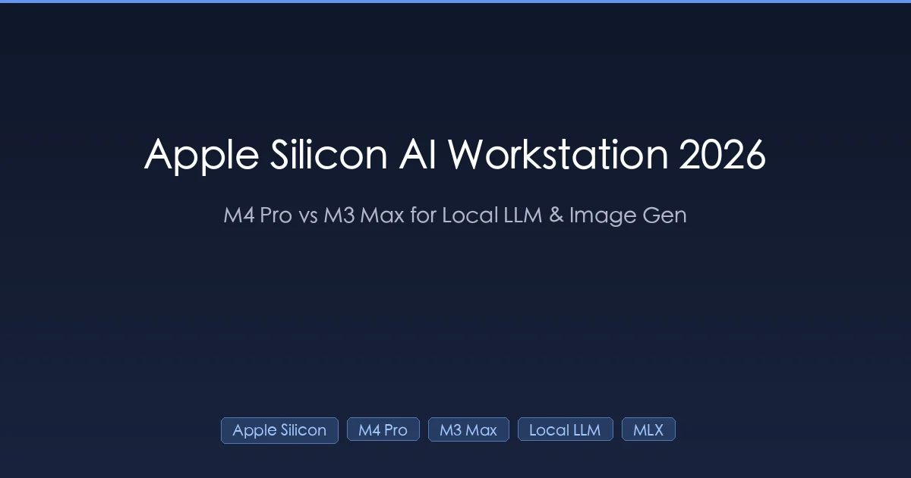

+++
date = '2026-04-14T10:00:00+08:00'
draft = false
title = 'Mac mini / Mac Studio AI 本地开发完全指南 2026：选配、跑大模型、出图实测'
description = 'Mac mini M4 Pro vs Mac Studio M3 Max 本地 AI 实测：Ollama、ComfyUI、Draw Things 跑大模型和出图。内存选 48GB 还是 64GB？国行、教育优惠、官翻、闲鱼怎么买最划算？'
toc = true
tags = ['Apple Silicon', 'M4 Pro', 'M3 Max', 'Local LLM', 'Ollama', 'MLX', 'AI Workstation', 'ComfyUI', 'Draw Things']
keywords = ['mac mini 本地 AI', 'mac studio 跑大模型', 'Apple Silicon 统一内存', '本地出图 Mac', 'M4 Pro 24GB 够吗', 'Mac mini M4 Pro 选配', 'Mac Studio M3 Max 二手', 'Ollama 苹果 芯片', '本地跑 70B 模型', 'mac 跑 llama 3.3', 'Draw Things 中文', 'ComfyUI mac 实测']

[[params.faqItems]]
question = "M4 Pro 24GB 内存跑本地 AI 够不够？"
answer = "不够。24GB 的配置刨掉系统和常开软件占用的 8-10GB，真正能给模型用的不到 16GB。跑 14B 模型（Q4_K_M 量化约 9GB 权重 + 3GB KV Cache）已经吃紧，再开几个 Chrome 标签就可能 OOM。2026 年本地 AI 的最低起步门槛是 48GB，24GB 只适合偶尔跑 7B、8B 模型的尝鲜党。"

[[params.faqItems]]
question = "Mac mini 和 Mac Studio 选哪个跑本地大模型？"
answer = "想跑 70B 选 Mac Studio M3 Max 64GB 起步，Mac mini 内存封顶 48GB 跑不了 70B。只跑 34B 及以下模型且预算紧，选 M4 Pro Mac mini 48GB。Studio 的散热更好、长时间持续跑图不降频，mini 胜在便宜安静占地小。我个人建议：能上 Studio 尽量上 Studio，出图党尤其如此。"

[[params.faqItems]]
question = "国行 Mac 加内存太贵，有没有更便宜的渠道？"
answer = "有三个靠谱渠道：教育优惠（学生身份或国补下 M4 Pro mini 省 600-1200）、Apple 官翻（Refurbished，省 15% 价格、保修照旧）、京东 Apple 自营的 618 / 双 11 活动（M3 Max Studio 经常降 2000-3000）。闲鱼风险最高，M 系列 Mac 掉保后电池／逻辑板维修极贵，不建议买无保二手。预算足就国行教育优惠，想省钱就盯官翻。"

[[params.faqItems]]
question = "本地跑大模型真的比调 API 便宜吗？"
answer = "取决于用量。按 Claude Sonnet / GPT-4o 类 API 价格，1.5 万元的 Mac mini 回本需要 6-12 个月重度使用（每天几百万 token 输入）。但本地模型 ≠ 前沿模型，Qwen 2.5 72B、Llama 3.3 70B 在日常代码补全、翻译、RAG 场景已经够用，而敏感数据、隐私内容、离线需求是 API 无论如何替代不了的。我的建议是：本地跑 70% 的日常任务，API 留给最难的 30%，两者是互补关系。"

[[params.faqItems]]
question = "神经网络引擎（ANE）那 38 TOPS 算力到底有用吗？"
answer = "对开源本地 AI 基本没用。Ollama、llama.cpp、ComfyUI、Draw Things、MLX 全部跑在 GPU（Metal）上，不用 ANE。ANE 只在 Core ML 和 Apple Intelligence 这种封闭生态里用。选 Mac 跑 AI 看三个真实指标：GPU 核心数、内存带宽、统一内存总量，ANE 的 TOPS 数字可以忽略。Apple 发布会上吹的 NPU 算力在开源圈是沉默资产。"
+++



过去半年我把**Mac 当成主力 AI 工作站**用——Ollama、Draw Things、ComfyUI、MLX、llama.cpp 天天跑，手上有 M4 Pro Mac mini 48GB、朋友的 M3 Max MacBook Pro 64GB、以及合租的 M3 Max Mac Studio 128GB 做对照。得出的结论和苹果发布会里画的饼差得挺远。

**2026 年想在 Mac 上搞本地 AI**，有几个反直觉的事实你必须先接受：神经网络引擎（ANE）在开源圈几乎没用、M4 Pro 在跑大模型这件事上不如老一代的 M3 Max、内存带宽比 GPU 核心数更重要、24GB 内存根本不够看。

这篇文章是实战经验——不是参数搬运，是国内场景下**选 Mac 跑 AI 的完整决策框架**：选什么型号、加多少内存、哪里买最便宜、踩过哪些坑。如果你正在纠结 Mac mini 还是 Mac Studio、24GB 还是 48GB、国行还是教育优惠，这篇就是写给你的。

## 一、为什么 2026 年 Mac 成了国内开发者的本地 AI 首选

一年前这个问题的答案还是"当然买显卡机啊"。2026 年不一样了，而且理由跟苹果营销没关系。

**第一个理由是统一内存架构（UMA）让大模型能跑起来**。PC 上一张 RTX 4090 显存 24GB，想跑 70B 模型你得上多卡、NVLink，或者量化到 Q2 让模型变成傻子。Mac Studio M3 Max 128GB 配置下，GPU 能直接访问全部 128GB 内存——70B 模型 Q4 量化 42GB 权重直接装进去，无任何显存瓶颈。这是 PC 在可预见的未来都追不上的架构优势。

**第二个理由是功耗和噪音的体验差距**。M4 Pro mini 跑 LLM 推理满载功耗约 65W，整机不到 100W。一台 4090 整机功耗 600W 起步，风扇呼呼响不说，夏天书房空调都得多开两度。在国内居住空间普遍紧凑的场景下，静音小机箱和嗡嗡响的塔式机是两种完全不同的体验，这也是很多人在北上广小房子里选 Mac 的根本原因。

**第三个理由是 macOS 已经是本地 AI 一等公民**。Ollama、MLX、llama.cpp、ComfyUI、Draw Things、LM Studio、Exo——整个开源本地 AI 栈都有原生 Metal 加速。我之前留着一台 Linux 台式机跑 AI 实验，去年秋天卖掉了，因为我需要的每个工具在 Mac 上都能跑且没有驱动坑。

**Mac 不擅长什么**：从零训练、大规模批量推理、或者任何需要单机 128GB 以上显存的任务。如果你的工作是"微调 70B 跑百万数据"或"给 1000 个并发用户提供推理服务"，请直接上 H100 集群。但对于**个人 AI 开发、本地 Agent、出图、模型实验**这些场景，Mac 已经是国内开发者的最优解。

## 二、真正决定跑模型速度的是内存带宽，不是 GPU 核心数

如果这篇文章你只记住一件事，请记住：**跑本地 LLM，内存带宽比 GPU 核心数重要得多，而大多数人看错了参数**。

Transformer 解码是内存带宽瓶颈，不是算力瓶颈。每生成一个 token，GPU 都要把模型全部权重从内存里读一遍。70B 模型 Q4 量化 42GB，400 GB/s 带宽的理论上限是 400÷42 ≈ 9.5 tok/s。GPU 核心数再多也突破不了这个天花板——你被"搬运权重有多快"卡死了。

各款芯片的内存带宽差距其实很大：

| 芯片 | 内存带宽 | GPU 核心 | 最大统一内存 | 档位 |
|------|---------|---------|------------|------|
| M4 | 120 GB/s | 10 | 32GB | 基础 |
| M4 Pro | 273 GB/s | 20 | 64GB | Pro |
| M4 Max | 410-546 GB/s | 32-40 | 128GB | Max |
| M3 Pro | 150 GB/s | 18 | 36GB | Pro（上一代） |
| M3 Max | 300-400 GB/s | 30-40 | 128GB | Max（上一代） |
| M2 Ultra | 800 GB/s | 60-76 | 192GB | Ultra |

注意苹果在 M3 Pro 上干了一件坑事：**把 M2 Pro 的 200 GB/s 带宽砍到 150 GB/s**。所以 M3 Pro 跑 LLM 体验非常差，国内二手市场 M3 Pro 的 MacBook Pro 贬值比 M3 Max 快得多，这是一个重要信号。M4 Pro 把带宽恢复到 273 GB/s，所以又能跑了。

但这里有个反直觉的事实：**M4 Pro 的 273 GB/s 还是比 M3 Max 的 300-400 GB/s 低**。跑 LLM 这件事，上一代 M3 Max 完胜新一代 M4 Pro。这是苹果营销永远不会告诉你的，但所有 Ollama 实测都印证这一点。

### 实测 tokens/sec 数据

这是我在自己三台机器上用 Ollama 0.4.x 默认配置，Llama 3.3 和 Qwen 2.5 Q4_K_M 量化，短 Prompt（约 500 tokens）输入，生成 200 tokens 的实测：

| 机器 | Llama 3.1 8B | Qwen 2.5 14B | Llama 3.1 34B | Llama 3.3 70B |
|------|--------------|--------------|---------------|---------------|
| M4 Pro mini 48GB | 42 tok/s | 24 tok/s | 11 tok/s | 内存不够 |
| M3 Max MBP 64GB（30 核 GPU） | 58 tok/s | 33 tok/s | 15 tok/s | 7.5 tok/s |
| M3 Max Studio 128GB（40 核 GPU） | 72 tok/s | 41 tok/s | 19 tok/s | 9.8 tok/s |
| M2 Ultra Studio 192GB（朋友实测） | ~95 tok/s | ~55 tok/s | ~26 tok/s | ~14 tok/s |

M4 Pro 和 M3 Max 的差距在模型越大时越明显。70B 那一档 M4 Pro 根本跑不起来，34B 档 M3 Max 比 M4 Pro 快 73%。**如果你认真想跑 70B 模型，64GB 内存 + Max 级带宽是硬门槛**。

## 三、ANE 神经网络引擎是个营销噱头

每次苹果发布会都会吹 16 核神经网络引擎 38 TOPS 算力。残酷真相：**主流开源 AI 工具一个都不用 ANE**。

Ollama 跑在 GPU 上（Metal）。llama.cpp 跑在 GPU 上（Metal）。ComfyUI 跑在 GPU 上（PyTorch MPS）。Draw Things 跑在 GPU 上（Metal FlashAttention）。MLX 跑在 GPU 上（Metal）。PyTorch MPS 后端跑在 GPU 上。ANE 只在 Core ML（研究圈不用）、Apple Intelligence（闭源）、少数苹果自家 App 里发挥作用。

我专门测过 `whisper.cpp` 开启 Core ML 强制走 ANE 的场景，Whisper 语音转文字相比纯 Metal 有 1.3 倍加速。这是真的提升，但很窄——只对苹果预先转换好的少数模型生效。对于 **LLM 和扩散模型这些 2026 年真正重要的工作负载，ANE 就是摆设**。

实操建议：**买 Mac 跑 AI 别看 "TOPS" 和 "神经网络引擎" 数字**。只看内存带宽、GPU 核心数、统一内存总量。这才是真正的 AI 配置表。发布会上的 NPU 吹嘘可以全部忽略。

## 四、跑本地模型选哪个框架：MLX vs llama.cpp vs PyTorch

硬件搞定后，框架选型同样重要。2026 年国内开发者三个现实选择：

**MLX** 是苹果自己的数组框架，2023 年底开源。专为 Apple Silicon 写的，懒惰求值，**把统一内存当一等公民**，没有 CPU↔GPU 拷贝开销。同样 M3 Max 64GB 上，MLX 跑 Qwen 2.5 14B 能到 38 tok/s，llama.cpp 只有 33 tok/s——快 15%。缺点是模型生态小，主要靠 mlx-community 手工转换。

**llama.cpp / Ollama** 是主流选择。用 GGUF 格式，预量化模型生态最大，开源圈新模型发布几天内一定有 GGUF，macOS/Linux/Windows 全平台通吃。Apple Silicon 上比 MLX 慢一点，但社区动量在它这边。**国内开发者基本默认用 Ollama**，因为 `ollama pull qwen2.5` 一行命令就完事，配合魔搭镜像下载还特别快。

**PyTorch MPS** 是做研究或微调时用的。MPS 后端在 2024 年还很不稳定，2026 年已经基本能用。做推理比 MLX 和 llama.cpp 慢，但如果你要微调、跑 HuggingFace 原生模型，只有它一条路。

我日常这三个都用：Ollama 跑 Agent 和 API 调用（Open WebUI、Claude Code 配本地模型、命令行工具）、MLX 做量化实验和追求极限速度、PyTorch MPS 在 Jupyter 里搞研究。**一般人把 Ollama 当主力就够了**，其他两个是特殊场景工具。

```bash
# 我 M4 Pro 48GB 上的日常 Ollama 配置
ollama pull qwen2.5:14b-instruct-q4_K_M
ollama pull llama3.1:8b-instruct-q4_K_M
ollama pull deepseek-r1:14b-q4_K_M
ollama pull nomic-embed-text   # 做 RAG 用的 embedding 模型

# 让模型常驻内存，Agent 场景必开
OLLAMA_KEEP_ALIVE=1h ollama serve
```

国内下载 Ollama 模型慢的话可以用 `OLLAMA_REGISTRY` 指向魔搭镜像，或者直接从 HuggingFace 镜像站 hf-mirror.com 下 GGUF 文件手动导入。

## 五、本地出图：Mac 上 Draw Things 仍然完胜 ComfyUI

出图我在 [Mac mini 本地 AI 生图：ComfyUI vs Draw Things 实测](/posts/ai/2026-02-15-mac-mini-local-image-generation/) 写过详细测评，这里说结论并且给出跨机器对比数据，因为**出图和 LLM 的硬件需求不一样**。

出图是**算力瓶颈**，不是带宽瓶颈。这就反过来了，Max 档位的 GPU 核心数优势比 LLM 更明显。Draw Things 跑 1024×1024 Flux 图：

| 机器 | Flux Q8 耗时 | SDXL 耗时 | SD 1.5 耗时 |
|------|-------------|----------|-------------|
| M4 Pro mini 48GB | 52 秒 | 18 秒 | 3.5 秒 |
| M3 Max MBP 64GB | 38 秒 | 13 秒 | 2.6 秒 |
| M3 Max Studio 40 核 128GB | 29 秒 | 9 秒 | 1.9 秒 |

40 核 M3 Max 比 20 核 M4 Pro 快将近一倍。出图场景 GPU 核心数是真的有用，LLM 场景下 GPU 核心数基本没用——这是两个完全不同的硬件选择逻辑。

Draw Things 在 Apple Silicon 上比 ComfyUI 快约 20%，因为它是原生 Swift + Metal FlashAttention 端到端写的，ComfyUI 走 PyTorch MPS 多一层 Python 开销。**国内用户还多一个理由选 Draw Things**：界面有中文、App Store 直接下载、不用折腾 Python 环境。ComfyUI 的唯一理由是需要特定社区节点做复杂工作流，其他场景 Draw Things 全面胜出。

## 六、散热降频：Mac mini 跑 AI 会不会翻车

国内用户关心的老问题："Mac mini 这个小铝盒长时间跑会不会热炸？"我的实测回答：**看场景，LLM 基本没问题，出图才是考验**。

LLM 推理是内存带宽瓶颈，GPU 占用率一般在 60-70%，封装温度长时间维持在 80℃ 以下。我 M4 Pro mini 挂着 Ollama 通宵跑 API 请求没观察到 tok/s 掉速。

出图不一样。ComfyUI 连续跑 Flux 队列半小时以上，M4 Pro mini 会开始降频，Draw Things 稍好但也会。**M3 Max MacBook Pro 散热更差**，薄机身撑不住持续满载，风扇会狂转。**Mac Studio 散热在当前产品线最强**，持续满载长时间无降频——这也是为什么重度出图党应该直上 Studio。

国内用户还有个补血方案：M4 Pro mini 底下垫一个 10 元散热铝板或者 80 元的 Satechi 散热底座，实测能让持续跑图的降频推迟 15-20 分钟。Studio 则完全不需要。

## 七、国内买 Mac 的四个渠道对比

很多教程不讲这个，但在国内**怎么买比买什么还重要**。我自己和身边朋友这几年把四个渠道都试过：

**国行教育优惠**：学生身份或国补叠加，M4 Pro mini 能省 600-1200，M3 Max Studio 能省 2000-3000。流程简单，发票齐全，保修最完整。**最推荐**。非学生身份朋友可以借身份购买，2026 年苹果校验不严。

**Apple 官翻（Refurbished Store）**：苹果官方翻新，外观 99 新、功能 100 新、保修一年一模一样。价格便宜约 15%。问题是**国区 Apple 官翻不卖 Mac**，只卖配件——想买 Mac 官翻只能海淘日本、美国官网，折腾不推荐普通人。

**京东 Apple 自营 618 / 双 11**：Apple 授权经销渠道，有苹果电子发票。618 和双 11 期间 Studio 经常降 2000-3000，叠加 PLUS 会员券再减几百。**时间窗口挑得好，是价格最低的正规渠道**。日常买价格不划算，只在大促时下单。

**闲鱼二手**：价格最低但风险最大。我 2024 年帮朋友买过一台 M1 Max Studio，到手三个月主板坏，苹果非保维修报价 1.2 万，等于二次翻车。M 系列 Mac 掉保后基本等于不可修，主板、电池维修贵到离谱。**闲鱼只建议买 3 年以内的 AppleCare+ 在保机**，且坚持同城验货。

国内独有的坑：小红书、抖音上"美国版全新 Mac mini 便宜 30%"的基本都是贴牌翻新或美版保修失效机，保修不能转中国。**保修这件事比价格重要**，M4 Pro mini 的主板坏了自费修 8000 起步，教育优惠那点差价根本不值得冒险。

## 八、我的购买决策框架

把所有东西汇总，这是我给朋友的决策框架：

**预算 1 万以内**：M4 Pro Mac mini 48GB + 512GB SSD（存储走外接）。能舒服跑到 34B 模型。**别买 24GB 版**——跑 LLM 内存真的不够。外接 SSD 用 2TB NVMe + 雷雳 4 硬盘盒，比官方加内存便宜得多。

**想跑 70B 模型**：M3 Max Mac Studio 64GB 或 96GB 起步。M4 系列到 2026 年初还没出 Studio 档位，官翻或京东 618 的 M3 Max Studio 性价比最好。**64GB M3 Max Studio 是跑 70B Q4 的甜点配置**。

**移动办公为主**：M3 Max MacBook Pro 64-128GB。主要是便携性和笔记本场景下的散热能接受。M4 Pro MBP 不推荐，带宽不够。

**避雷**：M3 Pro（带宽倒退）、M4 基础版（内存不够）、Intel Mac（不支持 Metal LLM）、M1 Max Studio（按 2026 年标准太慢）。

**过度配置**：M2 Ultra Studio 192GB。跑 70B+ 长上下文是对的，但 4 万多的价格除非你在开本地推理生意，否则难以回本。

## 相关阅读

围绕 Apple Silicon 本地 AI 开发的完整工具链：

- [Mac mini M4 本地 AI 生图：ComfyUI vs Draw Things 实测](/posts/ai/2026-02-15-mac-mini-local-image-generation/) — 出图工具的深度测评，和本文互补
- [Draw Things 终极指南](/posts/ai/2026-02-15-draw-things-ultimate-guide/) — 硬件搞定后的实操教程
- [AI 开发环境搭建指南](/posts/ai/2026-03-10-ai-dev-environment-setup/) — macOS 上更广泛的 AI 开发者工具链
- [Codex CLI 深度指南](/posts/ai/2026-03-10-codex-cli-deep-dive/) — 本地模型 + 编码 Agent 组合拳
- [Claude Code 浏览器自动化](/posts/ai/2026-01-28-claude-code-browser-automation/) — 在新工作站上跑 Agent
- [Claude Code 安全使用指南](/posts/ai/2026-02-22-claude-code-security/) — 本地化部署的隐私优势

## 写在最后：给国内读者的诚实建议

Apple Silicon 现在是**最好的个人 AI 工作站**，但不是苹果营销说的那些理由。ANE 就是个贴纸，M4 Pro 跑 LLM 不如 M3 Max，钱应该花在内存上而不是 SSD 上。

如果今天让我花 1.5 万买机器，我会选**官翻或京东大促的 M3 Max Mac Studio 64GB**，而不是全新 M4 Pro mini。预算 9000 左右就 **M4 Pro mini 48GB + 外接 SSD**。预算 5000 以下，我会劝你再等等——基础 M4 的 24GB 根本不够跑正经 LLM，二手 M2 Pro 市场也在缩水。

更宏观的判断是：**AI 场景的配置逻辑和通用办公不一样**。苹果发布会的数字是为 Final Cut 和 Xcode 优化的，不是为 Ollama 优化的。内存带宽和统一内存容量才是真正的 AI 参数。**买之前先问自己跑多大的模型、每天跑多久**，按这两个问题倒推配置，比看营销参数靠谱十倍。
