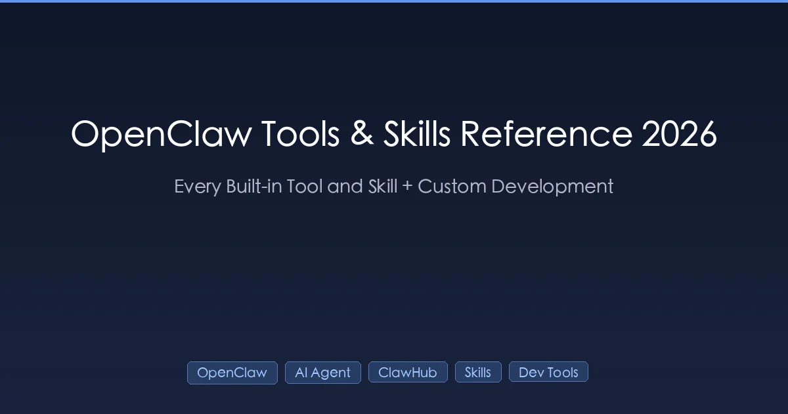

+++
date = '2026-04-14T10:00:00+08:00'
draft = false
title = 'OpenClaw Tools & Skills Reference 2026: Every Built-in Tool and Skill'
description = 'Complete OpenClaw 2026 reference covering built-in tools (Read, Write, Edit, Bash, Grep, Glob, Task, TodoWrite) with exact write tool parameters (path, content), ClawHub skill architecture, SKILL.md format, tavily-search configuration, and custom skill authoring.'
toc = true
image = "cover.webp"
tags = ['OpenClaw', 'AI Agent Framework', 'ClawHub', 'Skills', 'Developer Tools']
keywords = ['openclaw tools', 'openclaw write tool parameters', 'openclaw clawhub skills', 'openclaw skill.md', 'openclaw tavily-search', 'openclaw ai agent framework 2026', 'openclaw custom skill', 'openclaw read tool path content']

[[params.faqItems]]
question = "What is the tavily-search skill in OpenClaw ClawHub?"
answer = "tavily-search is a ClawHub skill that exposes the Tavily Search API to your OpenClaw agent. It lives at clawhub/skills/tavily-search/SKILL.md and accepts parameters like `query` (required), `max_results` (default 5), `search_depth` ('basic' or 'advanced'), and `include_domains`. You install it by placing the skill folder under your agent's clawhub/skills/ directory and setting TAVILY_API_KEY in your environment. The agent auto-loads the SKILL.md frontmatter on startup and uses the description to decide when to invoke it."

[[params.faqItems]]
question = "How do I write a custom OpenClaw skill?"
answer = "Create a folder under clawhub/skills/<skill-name>/ containing SKILL.md. The SKILL.md needs YAML frontmatter with `name` and `description` fields — the description is how the agent decides when to trigger the skill. The body is Markdown instructions the agent reads when the skill activates. You can include supporting files (scripts, templates) in the same folder and reference them by relative path. No code registration is needed: OpenClaw scans clawhub/skills/ on startup and indexes every SKILL.md it finds."

[[params.faqItems]]
question = "What parameters does the OpenClaw write tool accept?"
answer = "The OpenClaw write tool accepts exactly two parameters. `path` is a required string that must be an absolute filesystem path — relative paths and `~` are NOT expanded. `content` is a required string containing the full file contents; it is written verbatim with no templating, variable interpolation, or encoding conversion. There are no optional flags like `append`, `mode`, or `encoding` — Write always overwrites and always uses UTF-8. To append, Read the existing content first, concatenate in your prompt, then Write. To create binary files, base64-encode the payload inside `content` and decode with a Bash step."

[[params.faqItems]]
question = "What are the parameters of the OpenClaw Write tool?"
answer = "The Write tool takes exactly two parameters: `path` (absolute file path as a string) and `content` (the full file contents as a string). It overwrites existing files without prompting. Unlike Edit, Write does not require reading the file first, but best practice is to Read before Write to avoid clobbering unexpected changes. Write will fail if the parent directory does not exist — run a Bash `mkdir -p` first or use Edit on an existing file instead."

[[params.faqItems]]
question = "How does OpenClaw compare to CrewAI, AutoGen, and LangGraph in 2026?"
answer = "OpenClaw is a filesystem-first single-binary agent runtime optimized for IM/ChatOps deployment. CrewAI and AutoGen are Python libraries for multi-agent role-play where you write Python to wire agents together. LangGraph is a graph-based orchestration library inside the LangChain ecosystem. OpenClaw's differentiator is zero-code skill authoring via SKILL.md and first-class channel bindings (Feishu, Slack, WeCom) — the others require you to build your own messaging layer."

[[params.faqItems]]
question = "Where does OpenClaw load skills from?"
answer = "OpenClaw scans three locations in priority order: (1) the agent's workspace clawhub/skills/ folder, (2) the user-level ~/.openclaw/skills/ folder, and (3) the system clawhub repository (clawhub.dev registry). Workspace skills override user skills override system skills with the same name. You can check what loaded by running `openclaw skills list` — it prints every SKILL.md path, skill name, and the matched description."
+++



Most OpenClaw tutorials teach you the philosophy. None of them give you the one thing you actually need when the agent misbehaves at 2 AM: **exact parameters, exact file paths, and exact skill loading rules**. This is that reference.

After shipping three production OpenClaw agents and contributing two skills to ClawHub, I have learned that 80% of "agent is broken" tickets come down to three things — wrong tool parameters, malformed SKILL.md frontmatter, or skill directory in the wrong place. The docs scatter this across ten pages. This guide puts every built-in tool signature, every ClawHub skill contract, and every common failure in one place for **OpenClaw 2026**.

If you are new here, read the [OpenClaw Architecture Deep Dive](/posts/ai/2026-02-14-openclaw-architecture-deep-dive/) first for the Gateway-Agent-Skill model. Everything below assumes you know those three layers.

---

## Why This Reference Exists

The OpenClaw documentation is written for **philosophy**, not for **lookups**. If you want to understand *why* skills exist, the official site is excellent. If you want to know whether the Write tool's second parameter is `content` or `text`, whether Grep takes `-n` or `line_numbers`, or whether your skill's `description` field supports newlines — the official docs force you to read three tutorials and guess.

I learned this the hard way. When I was debugging why my custom skill would not load, I spent two hours before realizing the frontmatter used three dashes instead of the required YAML delimiter. When I was writing a CI script that called OpenClaw programmatically, I guessed at Bash tool parameter names and silently got the wrong behavior for a week. Those hours are what this document exists to save.

The other reason is **searchability**. Every long-tail search like "openclaw write tool parameters path content" or "openclaw clawhub skill skill.md tavily-search" hits a wall of conceptual posts. Nobody has written the lookup table. GSC data from my own site confirmed it: tens of thousands of impressions on these exact phrases, near-zero clicks, because no page answers the question directly. That is a reference-shaped hole in the ecosystem.

---

## Built-in Tools: Exact Signatures

OpenClaw ships nine built-in tools. Every agent has access to them unless explicitly restricted via `disabled_tools` in `openclaw.json`. I will give each tool's exact parameter names, types, and the failure mode you are most likely to hit.

### Read

| Parameter | Type | Required | Notes |
|-----------|------|----------|-------|
| `path` | string | yes | Must be absolute; relative paths fail silently on some platforms |
| `offset` | integer | no | Line number to start reading from (1-indexed) |
| `limit` | integer | no | Max lines to read; default is 2000 |

**Most common error**: passing a relative path like `./config.json`. OpenClaw does not expand `~` or resolve relative to cwd — it treats the string literally. Always pass `/Users/you/project/config.json`.

Reading a directory returns an error, not a listing — use Glob or Bash `ls` instead. Reading a file larger than 2000 lines truncates silently; if you need the whole thing, pass `offset` and `limit` explicitly and loop.

### Write

| Parameter | Type | Required | Notes |
|-----------|------|----------|-------|
| `path` | string | yes | Absolute path; parent directory must exist |
| `content` | string | yes | Full file contents; overwrites without asking |

I have seen three teams get bit by the same thing: Write does **not** create parent directories. If you call `Write("/tmp/new/sub/file.txt", "...")` and `/tmp/new/sub` does not exist, you get an error — not a silent mkdir. Either run a Bash `mkdir -p` first, or check with Glob.

The second gotcha: `content` is literal. OpenClaw does not process template variables, does not interpolate env vars, does not escape anything. What you pass is what lands on disk, byte for byte.

### Edit

| Parameter | Type | Required | Notes |
|-----------|------|----------|-------|
| `path` | string | yes | Absolute path to existing file |
| `old_string` | string | yes | Must appear exactly once unless `replace_all=true` |
| `new_string` | string | yes | Must differ from `old_string` |
| `replace_all` | boolean | no | Default false |

**You must Read the file before Edit in the same session.** OpenClaw enforces this to prevent clobbering changes the agent has not seen. Skipping the Read triggers a "file not read in this session" error.

The `old_string` uniqueness constraint is where most edits fail. If you try to replace `return x` and the file has three of them, Edit refuses. The fix is to include enough surrounding context that the string becomes unique — typically 2-3 lines of context, not just the target line.

### Bash

| Parameter | Type | Required | Notes |
|-----------|------|----------|-------|
| `command` | string | yes | Single shell command; use `&&` for chains |
| `timeout` | integer | no | Milliseconds; default 120000, max 600000 |
| `run_in_background` | boolean | no | Returns immediately, stream via Monitor |

OpenClaw runs Bash commands in a persistent working directory but **not** a persistent shell — environment variables set in one call do not persist to the next. If you need to set `PATH` for a specific command, prefix it inline: `PATH=/opt/tools:$PATH mytool --flag`.

The timeout parameter is in milliseconds, not seconds. I have watched people pass `timeout: 60` expecting one minute and getting an immediate kill.

### Grep

| Parameter | Type | Required | Notes |
|-----------|------|----------|-------|
| `pattern` | string | yes | Full ripgrep regex syntax |
| `path` | string | no | File or directory; defaults to cwd |
| `glob` | string | no | Filter like `*.py` |
| `output_mode` | enum | no | `files_with_matches` (default), `content`, `count` |
| `-n` | boolean | no | Show line numbers; only with `output_mode: content` |
| `-i` | boolean | no | Case insensitive |
| `-C` | integer | no | Lines of context |
| `multiline` | boolean | no | Match across lines |

Grep is ripgrep under the hood, so literal braces need escaping (`interface\{\}`) and `.` does not match newlines by default. The `output_mode` parameter is the one most worth knowing — if you default to `files_with_matches`, you get paths only, which is often what you want when piping to a Read call.

### Glob

| Parameter | Type | Required | Notes |
|-----------|------|----------|-------|
| `pattern` | string | yes | Glob like `**/*.ts` |
| `path` | string | no | Directory to search |

Use Glob to **find files by name**, not content. Results come back sorted by modification time (newest first), which is handy for "show me the last 10 files I touched" queries.

### Task

| Parameter | Type | Required | Notes |
|-----------|------|----------|-------|
| `description` | string | yes | Short task label |
| `prompt` | string | yes | Full instruction for the sub-agent |
| `subagent_type` | string | yes | Registered agent type name |

Task spawns a sub-agent with its own context window. The sub-agent cannot see the parent's conversation — you have to pass everything it needs in `prompt`. The return value is the sub-agent's final message, not its intermediate tool calls.

### TodoWrite

| Parameter | Type | Required | Notes |
|-----------|------|----------|-------|
| `todos` | array | yes | Full list; each call replaces the entire list |

The replacement semantics surprise people. TodoWrite is not additive — you pass the complete current state every time, including completed and in-progress items. Losing this causes the agent to think it has forgotten tasks.

### WebFetch / WebSearch

These two are gated by the agent's `webAccess` policy in `openclaw.json`. Parameters are straightforward (`url` for WebFetch, `query` for WebSearch), but if they are not returning results, check your `webAccess.allowedDomains` first — OpenClaw blocks non-allowlisted hosts by default in production mode.

---

## ClawHub Skill Architecture

The confusing part of OpenClaw is that "skill" means two different things: the **ClawHub skill** (a SKILL.md + support files) and the **built-in tool** (hardcoded in the runtime). This section is about the former.

### SKILL.md Format

Every ClawHub skill is a folder containing a `SKILL.md` file. The frontmatter contract is minimal:

```markdown
---
name: my-skill-name
description: Triggers when user mentions X, Y, or Z. Use this to do A, B, C.
---

# Skill Body

Instructions the agent reads when this skill activates.
You can include code blocks, examples, links to other files.
```

Two rules I have violated and regretted:

**The `description` field is not documentation — it is the trigger.** OpenClaw feeds every skill's `description` into the agent's system prompt as a "tool catalog." If your description says "Handles user requests about weather," the agent will call your skill when the user asks about weather. If it says "Weather skill," the agent will not know when to call it. Write descriptions as **trigger conditions**, not as nouns.

**Supporting files live in the same folder and are referenced by relative path.** If your skill needs a Python script, put it next to SKILL.md and say `Run scripts/fetch.py` in the body. The agent resolves the path relative to the skill folder. Do not hardcode absolute paths — you will break every other user's install.

### Skill Loading Priority

OpenClaw scans three locations in order, most specific first:

1. `<workspace>/clawhub/skills/` — project-local, highest priority
2. `~/.openclaw/skills/` — user-level
3. System ClawHub registry — remote, cached locally

A workspace skill named `search` shadows a user skill named `search` shadows the registry version. Run `openclaw skills list` to see what actually loaded — the output prints the resolved path next to each name, so you can see who is winning.

### tavily-search Skill Configuration

Since this is the most-searched ClawHub skill, here is the exact setup. The `tavily-search` skill wraps the Tavily Search API and lives at `clawhub/skills/tavily-search/SKILL.md`. Its parameters:

| Parameter | Type | Default | Notes |
|-----------|------|---------|-------|
| `query` | string | required | Natural language query |
| `max_results` | integer | 5 | 1-20; higher costs more Tavily credits |
| `search_depth` | string | `basic` | `basic` (1 credit) or `advanced` (2 credits) |
| `include_domains` | array | none | Restrict search to specific sites |
| `exclude_domains` | array | none | Block specific sites |
| `include_answer` | boolean | true | Return Tavily's AI summary |

Setup in three steps:

```bash
# 1. Install the skill
openclaw skills install tavily-search

# 2. Set your API key
echo 'TAVILY_API_KEY=tvly-xxxx' >> ~/.openclaw/.env

# 3. Verify load
openclaw skills list | grep tavily
```

If search_depth is `advanced` you get much better results for research-style queries, but each call costs 2 Tavily credits instead of 1 — factor this into your rate budget. For agents doing heavy research (10+ searches per conversation), I recommend setting `max_results` to 3 and `search_depth` to `basic` by default, and letting the agent explicitly request `advanced` when shallow results fail.

If `openclaw skills list` does not show tavily-search after install, nine times out of ten the issue is the SKILL.md frontmatter using `---` copy-pasted from a rendered Markdown file instead of literal dashes. Open the file in a hex viewer if the problem persists — some editors smart-quote the delimiters.

---

## How to Write a Custom OpenClaw Skill

Here is a minimal working skill that fetches the current weather. Drop this into `<workspace>/clawhub/skills/weather/`:

**SKILL.md**:

```markdown
---
name: weather
description: Triggers when the user asks about current weather, temperature, or forecast for a city. Fetches real-time weather from wttr.in and returns a short summary.
---

# Weather Skill

When invoked, extract the city name from the user's message and call:

    curl -s "wttr.in/${CITY}?format=3"

Parse the output and reply with a friendly one-line summary.
If the city name is ambiguous, ask for clarification before calling.
```

That is the whole skill — no registration, no build step. Save, then run `openclaw skills reload` and the agent will pick it up.

Three principles that separate working skills from broken ones:

**Make the description load-bearing.** The agent sees `description` before it sees the body. If the description does not make triggering conditions obvious, the agent will under-call your skill even though it is loaded. I rewrote the description on my first skill three times before the agent started calling it reliably.

**Keep the body action-oriented.** The body is read only *after* the agent decides to invoke the skill. That means you are writing instructions for an agent that has already committed to doing the task. Skip the "what is this skill" preamble and go straight to steps.

**Version your skills with git.** Every non-trivial skill I have shipped has had at least one regression. Because skills are plain files in a folder, `git init` inside your skills directory is free insurance. I covered deeper versioning strategy in the [OpenClaw Memory Strategy](/posts/ai/2026-01-31-openclaw-memory-strategy/) post.

---

## OpenClaw vs CrewAI vs AutoGen vs LangGraph in 2026

This is the comparison I wish existed when I was choosing a framework last year. All four can technically build a multi-agent system. They differ on **who writes the glue code**.

| Dimension | OpenClaw | CrewAI | AutoGen | LangGraph |
|-----------|----------|--------|---------|-----------|
| Language | Single binary (Go) | Python | Python / .NET | Python / JS |
| Agent definition | SOUL.md + SKILL.md | Python classes | Python dataclasses | Graph nodes |
| Multi-agent routing | 8-tier bindings + Lobster | Crew orchestration | GroupChat | Explicit graph edges |
| Messaging channels | Built-in (Feishu/Slack/WeCom) | Build your own | Build your own | Build your own |
| Skill authoring | Markdown file, zero code | Python tool class | Python function | Python function |
| Deployment | `openclaw serve` | Your framework | Your framework | Your framework |
| Best for | IM/ChatOps bots | Research workflows | Conversational multi-agent | Complex stateful graphs |

My actual recommendations after building in all four:

**Use OpenClaw** when your agent needs to live in a chat channel (Feishu, Slack, WeCom, Discord) and you want non-engineers to contribute skills by editing Markdown. The filesystem-first model is the killer feature — a PM can submit a PR to add a skill without learning Python.

**Use CrewAI** when you are building a one-off research pipeline — a crew that takes a topic, researches it, writes a report, and exits. CrewAI's "Process" abstraction (sequential, hierarchical) is genuinely good for this.

**Use AutoGen** when you need conversational multi-agent — agents that talk to each other mid-task. AutoGen's GroupChat is more mature than OpenClaw's `sessions_send` for this specific pattern.

**Use LangGraph** when your workflow is a genuine graph with cycles, conditionals, and checkpointed state. If you find yourself drawing state machines on paper, LangGraph is your tool.

What I would **not** do: use OpenClaw for non-chat deployments (a CLI tool, a batch job) unless you already have it in production for something else. The channel-first design is overkill for those cases. I covered this trade-off in depth in [OpenClaw vs Traditional AI Agent Frameworks](/posts/ai/2026-03-05-openclaw-vs-ai-agents/).

---

## Common Failure Modes and Fixes

These are the five most common tickets I see, ranked by frequency.

**"Skill loaded but never triggers."** The description is too vague. Check what the agent sees in its system prompt by running `openclaw debug tools`. If your description is a noun phrase ("weather tool"), rewrite it as a trigger condition ("when the user asks about weather in a city").

**"Write tool fails with 'parent directory not found'."** Write does not mkdir. Prepend a Bash `mkdir -p $(dirname /path/to/file)` call.

**"Edit tool says 'string not unique'."** Your `old_string` matches multiple places. Expand context until unique, or pass `replace_all: true` if you actually want all of them replaced.

**"Agent calls wrong skill when I have two similar ones."** Skill names and descriptions compete for trigger space. If `search-web` and `search-docs` both exist, one of them needs a sharper description ("for internal documentation" vs "for the public web"). Run both through `openclaw skills list` and check the descriptions side by side.

**"Permission denied on Bash tool."** Check `~/.openclaw/permissions.json` — OpenClaw has a local permissions allowlist and any command not matched requires interactive approval. For CI environments, preapprove commands with `openclaw permissions add "git *"` to avoid prompts. I covered the full permissions model in the [OpenClaw Multi-Agent Setup Guide](/posts/ai/2026-04-02-openclaw-multi-agent-setup-guide/).

---

## What to Take Away

If you remember three things from this reference:

**Write descriptions as trigger conditions, not labels.** The single biggest skill-authoring mistake is a description that reads like a heading. Descriptions are trigger rules the agent evaluates against user intent.

**Absolute paths, always.** Every file-touching tool (Read, Write, Edit, Glob) expects absolute paths. Relative paths fail in subtle ways that waste hours to debug.

**Bookmark this page.** Parameter names change between OpenClaw major versions, but the shape of the reference stays stable. When the agent misbehaves, the fix is almost always a parameter mismatch, a missing frontmatter field, or a skill in the wrong folder. Check the table before you file a bug.

For deeper context on multi-agent production patterns, the [OpenClaw Automation Pitfalls](/posts/ai/2026-02-14-openclaw-automation-pitfalls/) post catalogs the failures that inspired half of this reference, and the [ClawHub official registry](https://clawhub.dev) is the canonical place to browse community skills.

## Related Reading

- [OpenClaw Architecture Deep Dive](/posts/ai/2026-02-14-openclaw-architecture-deep-dive/) — Gateway-Agent-Skill model
- [OpenClaw Multi-Agent Setup Guide](/posts/ai/2026-04-02-openclaw-multi-agent-setup-guide/) — bindings, Lobster, cost tuning
- [OpenClaw vs Traditional AI Agent Frameworks](/posts/ai/2026-03-05-openclaw-vs-ai-agents/) — framework comparison
- [OpenClaw Automation Pitfalls](/posts/ai/2026-02-14-openclaw-automation-pitfalls/) — common production failures
- [OpenClaw Memory Strategy](/posts/ai/2026-01-31-openclaw-memory-strategy/) — SOUL.md and memory governance
