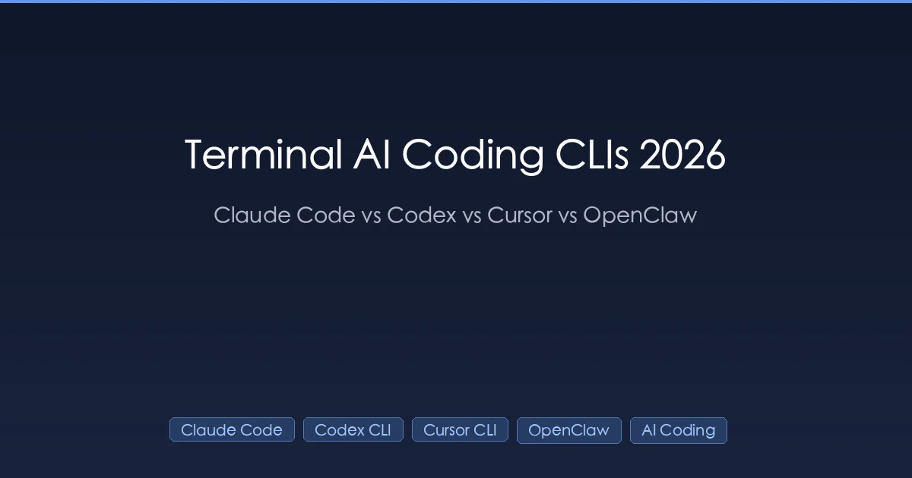
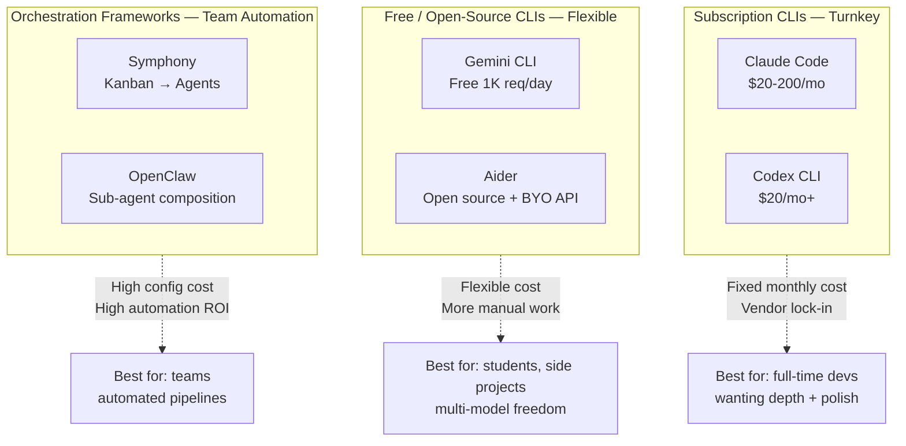
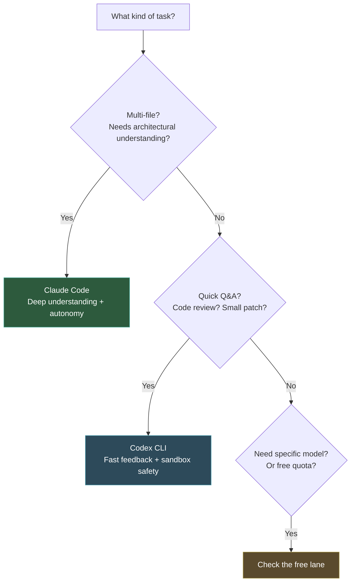

+++
date = '2026-04-14T10:00:00+08:00'
draft = false
title = 'Terminal AI Coding Tools 2026: Three Lanes, Not One Race'
description = 'Deep comparison of Claude Code, Codex CLI, Gemini CLI, and Aider. Instead of a flat feature table, this guide maps the 2026 terminal AI landscape into three lanes — subscription, free/open-source, and orchestration — with budget-based combo recommendations.'
toc = true
tags = ['Claude Code', 'Codex CLI', 'Gemini CLI', 'Aider', 'AI Coding Tools', 'Terminal']
keywords = ['terminal AI coding tools 2026', 'Claude Code vs Codex CLI', 'Gemini CLI free tier', 'Aider AI coding', 'best AI CLI tool 2026', 'AI coding agents comparison', 'terminal coding agent guide', 'Claude Code vs Gemini CLI']

[[params.faqItems]]
question = "Which terminal AI coding tool is best in 2026?"
answer = "It depends on budget and workflow. Zero budget: Gemini CLI (free 1,000 requests/day) + Aider (open source). $40/month: Claude Code Pro + Codex CLI. Heavy use: Claude Code Max $200/month. No single tool wins all scenarios."

[[params.faqItems]]
question = "Is Claude Code's context window really 1 million tokens?"
answer = "Not on subscription plans. Pro and Max plans have a 200K token context window. The 1M token window is only available via API calls to Claude Opus 4.6 / Sonnet 4.6, billed per token. Many comparison articles confuse these two numbers."

[[params.faqItems]]
question = "Is Gemini CLI good enough for real development work?"
answer = "Yes, for light to moderate use. The free tier offers 1,000 requests/day with Gemini 2.5 Pro and a 1M token context window. Its Google Search grounding pulls in live documentation. The main limitation is weaker autonomous agent capability compared to Claude Code."

[[params.faqItems]]
question = "What makes Aider different from Claude Code?"
answer = "Aider is model-agnostic (works with Claude, GPT, Gemini, or local models) and git-first (every AI edit becomes an automatic commit). Claude Code is model-locked to Claude but offers stronger autonomous agent capability. Aider gives you flexibility and auditability; Claude Code gives you depth and autonomy."

[[params.faqItems]]
question = "Should I use a terminal AI tool or an IDE tool like Cursor?"
answer = "Both. Terminal CLIs excel at long autonomous tasks, SSH remote environments, and CI/CD integration. IDE tools excel at inline completions and visual context. They complement each other rather than compete."
+++

Almost every "terminal AI coding tools comparison" makes the same structural error: put four tools in a flat table, compare features row by row, conclude "it depends on your needs." This framing is misleading.

The 2026 terminal AI coding landscape has **diverged into distinct species**. These tools differ in architecture philosophy, pricing model, and target user. Comparing Claude Code (a $200/month autonomous agent) against Gemini CLI (free, 1,000 requests per day) on "feature count" is like comparing a Tesla Model 3 to a city bus by "number of seats."

This guide does not do flat comparisons. It maps the landscape into three lanes, explains what each lane optimizes for, then dives into each tool's real capability boundaries — not the numbers on the marketing page, but the limits you actually hit in practice. The payoff: budget-matched combo recommendations at the end.

## Three Lanes, Not One Race

The 2026 terminal AI coding tool market has stratified into three lanes with fundamentally different competitive logic.

**Subscription lane** (Claude Code, Codex CLI): you pay a monthly fee, you get a polished agent with built-in file operations, shell execution, and code search. The selling point is "it just works." The cost is vendor lock-in — Claude Code only uses Claude models, Codex CLI only uses GPT models.

**Free/open-source lane** (Gemini CLI, Aider): you pay nothing (or only API usage fees) and gain flexibility. Gemini CLI has Google's free quota; Aider connects to any LLM. The selling point is "cheap and flexible." The cost is weaker autonomous agent capability — many tasks require manual guidance.

**Orchestration lane** (Symphony, OpenClaw): not tools for interactive terminal coding, but frameworks for multi-agent automation. Symphony watches your Linear board, spawns Codex agents, delivers PRs. OpenClaw lets you compose sub-agents with bounded scopes. The selling point is "team-scale automation." The cost is configuration complexity.

**Your first decision is not "which tool is best" but "which lane am I in."** If you are a budget-constrained student, debating Claude Code vs Codex CLI is a waste of time — look at the free lane. If you are a tech lead needing team automation, comparing Gemini CLI vs Aider misses the point — look at the orchestration lane.

## Subscription Lane: Claude Code vs Codex CLI

These two form the 2026 first tier. They share common traits: rich built-in tool sets, autonomous multi-step planning and execution, polished user experience. Their design philosophies diverge sharply.

### Claude Code: Depth-First

Claude Code's core bet is **autonomy**. Give it a complex task, and it plans steps, reads files, analyzes code, edits, runs tests — you can let it run for 40 minutes in the background and check the result later.

**Real capability boundaries:**

| Dimension | Official | In Practice |
|-----------|----------|-------------|
| Context window | 200K (subscription) / 1M (API) | Pro's 200K handles 30-50K line repos; beyond that, use Max or API |
| Models | Opus 4.6 / Sonnet 4.6 | Sonnet handles 80% of daily tasks; Opus for deep reasoning |
| SWE-bench | 80.8% Verified | Cross-file refactoring success rate is noticeably higher than competitors |
| Agent Teams | Parallel sub-agents | Effective for independent subtasks; weak when tasks have dependencies |
| MCP support | Native | 800+ community servers; strongest extensibility ecosystem |

**A critical error in many comparison articles**: listing Claude Code's context window as "1 million tokens." This is inaccurate. Subscription plans (Pro $20/mo, Max $100-200/mo) have a **200K token window**. The 1M window is only available via [Agent SDK](/posts/ai/2026-04-17-claude-agent-sdk-guide/) or direct API calls to Claude Opus 4.6 / Sonnet 4.6, billed per token. This distinction matters — if your repo exceeds 50K lines and you need full-codebase understanding, 200K may not suffice, and the cost model for API access is fundamentally different from a monthly subscription.

**Real pricing:**

- Pro: $20/mo with usage caps (roughly 2-3 hours of moderate daily use)
- Max 5x: $100/mo, 5x Pro's quota
- Max 20x: $200/mo, 20x Pro's quota, for heavy users

My experience: **most independent developers are fine on Pro.** Unless you hit rate limits multiple days per week, you don't need Max. For a detailed cost analysis, see my [Claude pricing guide](/posts/ai/2026-04-03-claude-pricing-complete-guide/).

### Codex CLI: Speed-First

Codex CLI's core bet is **fast feedback loops**. Every interaction should be as short and snappy as possible. It was rewritten in Rust for performance and defaults to sandboxed execution — code runs in isolation, not directly on your filesystem.

**Real capability boundaries:**

| Dimension | Official | In Practice |
|-----------|----------|-------------|
| Context window | Model-dependent | GPT-5 series ~200K; prefers short-context fast iteration |
| Speed | Rust-native CLI | Feels 30-50% faster than Claude Code, especially first response |
| Sandbox | On by default | Secure but adds a confirmation step that slows long tasks |
| MCP support | Partial | Has its own plugin format; MCP ecosystem weaker than Claude Code's |
| Sub-agents | Supported | Can split tasks for parallel execution |

**Codex CLI's sandbox is a double-edged sword.** Security is genuinely better — AI-generated code runs in isolation, never touching your files directly. But this means every time you want to apply AI changes, you need an explicit "confirm and apply" step. For quick Q&A and code review, this friction is invisible. For 20-step autonomous tasks, it measurably slows you down.

**Real pricing:**

- Bundled with ChatGPT Plus ($20/mo), usage-capped
- ChatGPT Pro ($100-200/mo) gives 5-20x quota
- API: codex-mini input $1.50/M tokens, output $6/M, 75% cache discount

### Choosing Between Them

Don't choose one. **Install both and use them for what they're best at.**

My usage split over three months: roughly 70% Claude Code (context-heavy refactors, complex bugs, new features), 30% Codex CLI (quick reviews, formatting, small patches). Combined cost: $40/month — $160 less than Claude Code Max alone.

## Free / Open-Source Lane: Gemini CLI vs Aider

This lane is 2026's biggest variable. A year ago, "free AI coding tools" essentially meant "toys." Now Gemini CLI and Aider cover substantial real-world development scenarios.

### Gemini CLI: Google's Free Power Play

Gemini CLI is Google's 2026 power move — open source, free, 1M context, built-in Google Search grounding. Its positioning is clear: capture entry-level users who currently pay for Claude Code or Codex CLI.

**Real capability boundaries:**

| Dimension | Numbers | In Practice |
|-----------|---------|-------------|
| Free quota | 1,000 req/day, 60/min | Sufficient for light-to-moderate dev; heavy users may exhaust it by afternoon |
| Model | Gemini 2.5 Pro (Flash on free tier) | Reasoning weaker than Claude Opus but adequate for most tasks |
| Context window | 1M tokens | 5x larger than Claude Code subscription's 200K — the real killer feature |
| Google Search | Native grounding | Real-time documentation and Stack Overflow lookup; occasionally pulls outdated answers |
| MCP | Supported | Ecosystem growing rapidly |
| Sub-agents | Not supported | Single-agent architecture; you manage task decomposition manually |

Gemini CLI's biggest advantage is not that it is free — it is that **1M tokens + free** is a combination no one else offers. Claude Code needs API billing to reach 1M tokens. Gemini CLI gives it to you for nothing. If you work on a mid-to-large codebase (50-100K lines) and need the AI to understand the full picture without paying $200/month, Gemini CLI is currently the only option.

**Real limitations:** No sub-agents means complex multi-step tasks require manual decomposition. Output quality on deep reasoning tasks falls short of Claude Opus. The free tier runs Gemini Flash, not Gemini 3 Pro — the reasoning gap is real.

### Aider: The Open-Source Swiss Army Knife

Aider takes a fundamentally different approach: model-agnostic, tool-free, git-first. The tool itself is free and open source. You bring your own API key for any LLM — Claude, GPT, Gemini, or local models. Every AI edit automatically becomes a git commit with a descriptive message.

**Real capability boundaries:**

| Dimension | Numbers | In Practice |
|-----------|---------|-------------|
| Model support | Any LLM API | Claude, GPT, Gemini, local models — full flexibility |
| Cost | Tool free, API self-funded | ~$30-60/mo with Claude API; cheaper with Gemini API |
| Language support | 100+ languages | Python, JS, TS, Go, Rust, Ruby, and dozens more |
| Git integration | Auto-commit every edit | Complete AI operation history; instant rollback |
| Chat modes | code/architect/ask/help | Architect mode designs before coding — higher quality |
| Autonomy | Low to moderate | More like "AI pair programming" than fully autonomous agent |

Aider's git-first philosophy is its most distinctive asset. Every AI edit is a clean commit — you can see exactly what changed, why, and when. Claude Code can commit too, but its changes tend to be large batches of file modifications in a single commit, much coarser-grained than Aider's step-by-step history. If you feel uneasy about AI making changes you can't trace, Aider's granular commits provide a level of auditability that nothing else matches.

**Real limitations:** Aider's autonomy is noticeably weaker than Claude Code's. You cannot say "find and fix this bug" and walk away. Aider needs you present, guiding each step — it is more of a very capable pair programmer than an independent agent.

### Gemini CLI vs Aider

| Your Situation | Pick |
|---------------|------|
| Zero budget | Gemini CLI (generous free quota) |
| Want to switch models freely | Aider (connects to any API) |
| Want full auditability of AI changes | Aider (git-first, every step committed) |
| Need to look up latest docs/APIs | Gemini CLI (Google Search grounding) |
| Large repo needing 1M context | Gemini CLI (free 1M window) |

You can also use both — Aider with the Gemini API costs nearly nothing.

## Orchestration Lane: Symphony and OpenClaw

This lane is a different category entirely. Symphony and OpenClaw are not tools for interactive terminal coding — they are frameworks for **multi-agent automation at team scale**.

**OpenAI Symphony** is an Elixir-based open-source framework. Its core logic: monitor your Linear/Jira board → spawn a Codex agent for each issue → agent writes code and opens a PR → human reviews. It targets replacing "assign issue to developer," not replacing the developer at the terminal. Currently in engineering preview (15.2K GitHub stars), not production-ready.

**OpenClaw** is an open-source Claude Code alternative supporting sub-agent composition and custom skills. Its unique capability: decomposing complex tasks across multiple agents with bounded scopes — something Claude Code cannot do natively. The cost is a steep learning curve. See my [OpenClaw multi-agent guide](/posts/ai/2026-02-23-openclaw-multi-agent-guide/) for details.

**When to enter the orchestration lane:** when your team has 20+ PRs per day needing AI-assisted review/generation, or when you have large volumes of repetitive automation tasks. Before that threshold, the configuration overhead is not justified.

## Budget-Based Recommendations

### $0/month: Students and Newcomers

**Gemini CLI (primary) + Aider (backup)**

Gemini CLI's 1,000 free requests/day with a 1M token context window is the best gift to zero-budget developers in 2026. Aider supplements it when quotas run out, connecting to cheaper APIs like Gemini's paid tier or Claude Haiku.

This combination's ceiling is surprisingly high. Gemini 2.5 Pro's 1M context means medium projects can fit the entire repo — something even Claude Code Pro's 200K cannot do.

### $40/month: Independent Developers

**Claude Code Pro ($20) + Codex CLI Plus ($20)**

The highest-ROI combination I have validated. Claude Code handles the 70% of work benefiting from depth and long context — cross-file refactors, complex bugs, architectural changes. Codex CLI handles the 30% that is fast back-and-forth — reviews, formatting, patches.

For a detailed comparison of these two, see [Claude Code vs Codex CLI](/posts/ai/2026-02-19-claude-code-vs-codex/).

### $200/month: Heavy Users

**Claude Code Max 20x ($200)**

At 5+ hours of daily coding with frequent large-repo work, Max 20x's unlimited quota pays for itself. Agent Teams handle parallel subtasks, MCP extends to databases and browsers. You no longer need a second tool.

Note: even Max 20x has a 200K context window. For repos exceeding 50K lines that need full-codebase understanding, consider the [Agent SDK](/posts/ai/2026-04-17-claude-agent-sdk-guide/) for 1M API access.

## When Terminal CLIs Are Not the Answer

Honest boundary conditions:

**You need inline completions and real-time suggestions.** Use Cursor or GitHub Copilot. Terminal CLIs excel at "understand a task and execute it," not "guess what you're typing." The two are complementary, not competing.

**Your team has no terminal habit.** Forcing terminal CLIs on team members uncomfortable with the command line decreases productivity. Let the team build trust with IDE-embedded AI first; introduce terminal CLIs when they naturally need background autonomous tasks.

**Pure Windows environment.** Every terminal AI CLI works better on macOS/Linux. WSL2 is not optional on Windows — it is required.

**Unstable network.** Claude Code and Codex CLI are latency-sensitive; disconnections during long tasks lose progress. In unstable network conditions, consider Aider — its git-first approach means every step is committed, making recovery straightforward.

## The 2026 Landscape

Terminal AI coding competition in 2026 is no longer "which tool is strongest" — it is **three lanes, each maturing independently**.

In the subscription lane, Claude Code holds first place with 80.8% SWE-bench Verified and the strongest agent autonomy. Codex CLI holds second with Rust-native speed and sandbox safety. Both are safe long-term investments.

In the free lane, Gemini CLI's killer combination of 1,000 free daily requests and 1M context is rapidly capturing entry-level users. Aider's model-agnostic git-first approach offers the most technical freedom.

In the orchestration lane, Symphony is still in engineering preview and OpenClaw's community is growing but the onboarding remains steep. This lane's breakout moment is likely 2027.

**If you make one decision today:** figure out which lane you belong to (budget? usage volume? team?), then choose within that lane. Do not compare across lanes.

---

## Related Reading

- [Claude Code Complete Guide](/posts/ai/2026-02-28-claude-code-complete-guide/) — Claude Code fundamentals
- [Claude Code vs Codex CLI: Same Task, Two Runs](/posts/ai/2026-02-19-claude-code-vs-codex/) — Fine-grained subscription lane comparison
- [Claude Pricing Guide 2026](/posts/ai/2026-04-03-claude-pricing-complete-guide/) — Pro/Max/API cost estimation
- [Claude Agent SDK Guide](/posts/ai/2026-04-17-claude-agent-sdk-guide/) — Getting 1M context via API
- [OpenClaw Multi-Agent Guide](/posts/ai/2026-02-23-openclaw-multi-agent-guide/) — Orchestration lane deep dive
- [5 AI Coding Tools in Action](/posts/ai/2026-04-03-claude-code-vs-cursor-vs-copilot/) — Broader AI coding tool landscape
