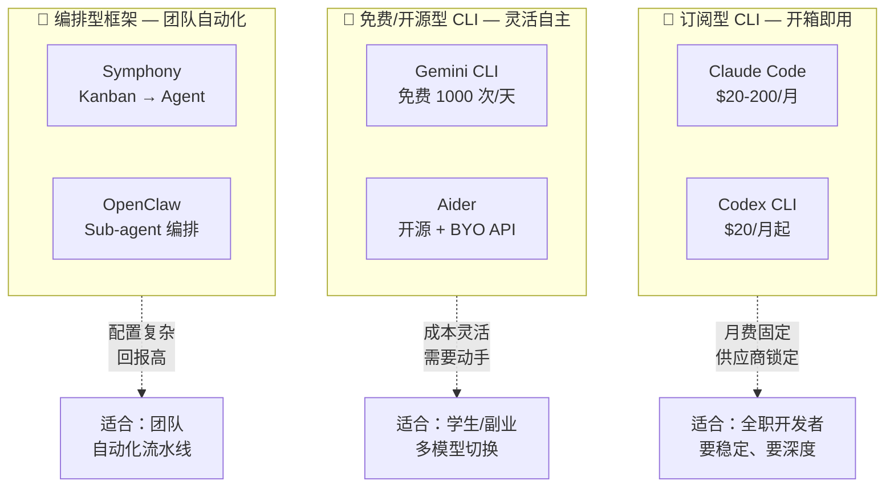
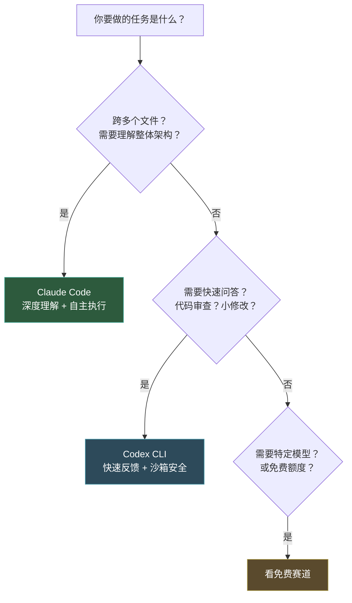

+++
date = '2026-04-14T10:00:00+08:00'
draft = false
title = '2026 终端 AI 编程工具深度横评：Claude Code、Codex CLI、Gemini CLI、Aider 怎么选'
description = '从架构哲学到真实定价，深度拆解 2026 年 4 款主流终端 AI 编程 CLI 的能力边界。不做扁平对比，按三赛道分层给出 $0/$40/$200 三档预算的组合推荐。'
toc = true
tags = ['Claude Code', 'Codex CLI', 'Gemini CLI', 'Aider', 'AI Coding Tools', 'Terminal']
keywords = ['终端 AI 编程工具', 'AI 编程工具对比 2026', 'Claude Code 对比 Codex CLI', 'Gemini CLI 免费', 'Aider AI 编程', 'AI CLI 工具推荐', '终端编程工具哪个好', '2026 AI 编程工具横评']

[[params.faqItems]]
question = "2026 年终端 AI 编程工具哪个最好？"
answer = "取决于你的预算和场景。预算为零选 Gemini CLI（免费 1000 次/天）+ Aider（开源免费）；月预算 $40 选 Claude Code Pro + Codex CLI；需要处理大型仓库跨文件重构选 Claude Code Max。没有通吃所有场景的单一工具。"

[[params.faqItems]]
question = "Claude Code 上下文窗口到底是 200K 还是 100 万？"
answer = "订阅版（Pro/Max）上下文窗口是 200K token。100 万 token 仅在通过 API 调用 Claude Opus 4.6 / Sonnet 4.6 时可用。很多对比文章搞混了这两个数字。"

[[params.faqItems]]
question = "Gemini CLI 免费额度够日常开发用吗？"
answer = "够轻中度使用。免费额度是每天 1000 次请求、每分钟 60 次，使用 Gemini 2.5 Pro 模型和 100 万 token 上下文窗口。对学生和副业项目完全够用，重度开发可能需要升级付费额度。"

[[params.faqItems]]
question = "Aider 和 Claude Code 有什么区别？"
answer = "Aider 是模型无关的开源工具，可以接 Claude、GPT、Gemini 等任何 LLM API，核心哲学是 git-first（每次 AI 编辑自动 commit）。Claude Code 绑定 Claude 模型，核心哲学是 Agent 自主性（自己规划和执行多步任务）。Aider 更灵活但自主性弱，Claude Code 更强大但锁定供应商。"

[[params.faqItems]]
question = "终端 AI 编程工具和 Cursor、Copilot 这类 IDE 工具比有什么优势？"
answer = "三个结构性优势：长任务可以后台跑几十分钟不怕 IDE 崩溃；原生支持 SSH 远程和 Docker 环境；可以脚本化嵌入 CI/CD 流程。劣势是没有内联补全和视觉预览。建议 IDE 工具和终端 CLI 都装，它们互补不互斥。"
+++

几乎所有"终端 AI 编程工具对比"文章都犯同一个错误：把 4-5 个工具放在一张表格里，逐行比功能，最后说"没有最好的，看你需求"。

这种对比方式是误导。2026 年的终端 AI 编程工具已经**分化成了完全不同的物种**——它们的架构哲学不同、定价模型不同、目标用户不同。把 Claude Code（月费 $200 的自主 Agent）和 Gemini CLI（每天 1000 次免费）放在同一张表里比"功能数量"，就像用"座位数"来对比特斯拉 Model 3 和公交车。

这篇文章不做扁平对比。我会先把工具分层，解释每一层在优化什么，然后深入拆解每个工具的真实能力边界——不是官方宣传页上的数字，而是实际使用中会碰到的限制。最后按预算给出组合方案。

## 三条赛道，不是一场比赛

2026 年的终端 AI 编程工具已经分成了三条赛道，每条赛道的竞争逻辑完全不同。

**订阅型**（Claude Code、Codex CLI）：你付月费，它给你一个开箱即用的 Agent，内置文件操作、命令执行、代码搜索。核心卖点是"不用折腾"。代价是供应商锁定——Claude Code 只能用 Claude 模型，Codex CLI 只能用 GPT 模型。

**免费/开源型**（Gemini CLI、Aider）：你不付月费（或只付 API 使用费），换来更大的灵活性。Gemini CLI 有 Google 给的免费额度，Aider 可以接任何 LLM。核心卖点是"省钱+灵活"。代价是自主 Agent 能力偏弱，很多事需要你手动引导。

**编排型**（Symphony、OpenClaw）：不是给人用的终端交互工具，而是让多个 Agent 自动完成任务的框架。Symphony 监控你的 Linear 看板，自动 spawn Codex Agent 写代码提 PR。OpenClaw 让你编排 sub-agent 执行复杂工作流。核心卖点是"团队级自动化"。代价是配置复杂，不适合个人日常。

**你的第一个选型决策不是"哪个工具好"，而是"我属于哪条赛道"。**如果你是预算有限的学生，在订阅型赛道里纠结 Claude Code 和 Codex CLI 的区别是浪费时间——你应该看免费赛道。如果你是需要团队自动化的技术主管，在免费赛道里挑 Gemini CLI 还是 Aider 也没意义——你应该看编排赛道。

下面按赛道深度拆解。

## 订阅型赛道：Claude Code vs Codex CLI

这两个是 2026 年终端 AI 编程的第一梯队。它们的共同特征是：内置丰富的工具集（文件读写、命令执行、代码搜索），Agent 能自主规划和执行多步任务，用户体验打磨得最好。但设计哲学完全不同。

### Claude Code：深度优先

Claude Code 的核心信仰是**自主性**——给它一个复杂任务，它会自己规划步骤、读取文件、分析代码、编辑修复、运行测试，你甚至可以放在后台跑 40 分钟回来看结果。

**实际能力边界**：

| 维度 | 官方数字 | 实际体验 |
|------|---------|---------|
| 上下文窗口 | 200K token（订阅）/ 1M（API） | Pro 计划的 200K 处理 3-5 万行仓库够用；超过这个规模需要 Max 或 API |
| 模型 | Opus 4.7 / Sonnet 4.6 | Opus 4.7（2026-04-16 发布）编码能力比 4.6 提升 13%，新增 task budgets 和 xhigh effort level；Sonnet 处理 80% 日常任务 |
| SWE-bench | 80.8%+（Opus 4.7 进一步提升） | 在真实项目上，跨文件重构的成功率明显高于竞品 |
| Agent Teams | 支持并行子 Agent | 对独立子任务有效，有依赖的任务并行效果差 |
| MCP 支持 | 原生支持 | 社区生态 800+ 服务器，扩展性最强 |

Opus 4.7 还引入了两个对 Agent 工作流很有价值的新能力：**task budgets**（让模型看到 token 预算倒计时，在长任务中合理分配资源而不是中途截断）和 **xhigh effort level**（在 high 和 max 之间新增一档，给你更细粒度的质量/成本控制）。Claude Code 还新增了 `/ultrareview` 命令做更彻底的代码审查。

**很多对比文章的一个关键错误**：把 Claude Code 的上下文窗口写成"100 万 token"。这是不准确的。订阅版（Pro $20/月、Max $100-200/月）的上下文窗口是 **200K token**。100 万 token 仅在通过 [Agent SDK](/zh/posts/ai/2026-04-17-claude-agent-sdk-guide/) 或 API 直接调用 Claude Opus 4.6 / Sonnet 4.6 模型时可用，而且需要按 token 付费。这个区别很重要——如果你的仓库超过 5 万行，200K 可能不够用，而升级到 API 调用的成本完全不同于月费订阅。

**真实定价**：

- Pro：$20/月，有使用量上限（大约每天 2-3 小时中等强度使用）
- Max 5x：$100/月，Pro 的 5 倍额度
- Max 20x：$200/月，Pro 的 20 倍额度，适合重度用户

我的经验是：**大多数独立开发者 Pro 就够了**。除非你每天写代码超过 5 小时且频繁触发限速，否则不需要升 Max。关于 Claude Code 的定价策略和用量估算，我在[定价完全指南](/zh/posts/ai/2026-04-03-claude-pricing-complete-guide/)中有详细分析。

### Codex CLI：速度优先

Codex CLI 的核心信仰是**快速反馈**——每次交互尽可能短、尽可能快，让你保持对话节奏。它用 Rust 重写了 CLI 内核，并且默认在沙箱中执行代码，不直接修改你的文件系统。

**实际能力边界**：

| 维度 | 官方数字 | 实际体验 |
|------|---------|---------|
| 上下文窗口 | 取决于模型 | GPT-5 系列约 200K，实际使用中偏好短上下文快迭代 |
| 速度 | Rust 原生 | 体感上比 Claude Code 快 30-50%，尤其是首次响应 |
| 沙箱执行 | 默认开启 | 安全但需要额外步骤确认修改，影响长任务效率 |
| MCP 支持 | 部分支持 | 有自己的插件格式，MCP 生态弱于 Claude Code |
| 子 Agent | 支持 | 可以拆分任务给多个 Agent 并行 |

**Codex CLI 的沙箱是双刃剑**。安全性确实好——AI 写的代码在隔离环境跑，不会直接改你的文件。但这意味着每次你想让 AI 的修改生效，都需要一个"确认应用"的步骤。对于快速 Q&A 和代码审查来说这无所谓，但对于需要 AI 连续执行 20 步的长任务来说，这个沙箱摩擦会显著拖慢速度。

**真实定价**：

- 捆绑在 ChatGPT Plus（$20/月）中，有使用量限制
- ChatGPT Pro（$100-200/月）给 5-20 倍额度
- API 按 token 计费：codex-mini 输入 $1.50/M token，输出 $6/M token，缓存命中打 75% 折

### Claude Code vs Codex CLI：怎么选

不要选一个。**两个都装，互补使用**。

我过去三个月的使用数据：约 70% 的任务用 Claude Code（需要理解上下文的重构、bug 修复、新功能开发），30% 用 Codex CLI（快速代码审查、格式化、小 patch）。两者月费合计 $40，比单独用 Claude Code Max 省 $160。

## 免费/开源赛道：Gemini CLI vs Aider

这条赛道是 2026 年最大的变量。一年前"免费 AI 编程工具"基本等于"玩具"，现在 Gemini CLI 和 Aider 的能力已经能覆盖大量真实开发场景。

### Gemini CLI：Google 的免费大招

Gemini CLI 是 Google 在 2026 年放出的重磅——开源、免费、1M 上下文、内置 Google Search grounding。它的定位很清晰：用免费额度抢 Claude Code 和 Codex CLI 的入门用户。

**实际能力边界**：

| 维度 | 数字 | 实际体验 |
|------|------|---------|
| 免费额度 | 1000 次/天，60 次/分钟 | 轻中度开发完全够用，重度可能午后就用完 |
| 模型 | 免费用 Gemini 2.5 Pro（Flash） | 推理能力弱于 Claude Opus 但够用 |
| 上下文窗口 | 1M token | 比 Claude Code 订阅版的 200K 大 5 倍，这是真正的杀手锏 |
| Google Search | 原生 grounding | 可以实时搜索最新文档和 Stack Overflow，查 API 用法极快 |
| MCP 支持 | 支持 | 生态在快速增长 |
| 子 Agent | 不支持 | 单 Agent 架构，无法拆分任务 |

Gemini CLI 最大的优势不是"免费"——是**1M token 上下文 + 免费**这个组合。Claude Code 要拿到 1M 上下文需要走 API（按 token 计费），而 Gemini CLI 免费给你。如果你的项目是一个中大型仓库（5-10 万行代码），需要 AI 理解全局但又不想每月花 $200，Gemini CLI 是目前唯一的选择。

**真实局限**：

不支持子 Agent 意味着复杂多步任务需要你手动拆分引导。输出质量在深度推理任务上弱于 Claude Opus——特别是需要"自己发现问题然后修复"的场景。Google Search grounding 虽然强大但偶尔会把过时的 Stack Overflow 答案混进来。免费版用的是 Gemini Flash 而非 Gemini 3 Pro，推理能力有差距。

### Aider：开源界的瑞士军刀

Aider 走的是完全不同的路线——它不绑定任何模型供应商，工具本身免费，你用自己的 API key 接任何 LLM。核心哲学是 **git-first**：每次 AI 编辑都自动创建一个 git commit，附带描述性的 commit message。

**实际能力边界**：

| 维度 | 数字 | 实际体验 |
|------|------|---------|
| 模型支持 | 任何 LLM API | Claude、GPT、Gemini、本地模型都能接 |
| 价格 | 工具免费，API 自费 | 用 Claude API 约 $30-60/月，用 Gemini API 更便宜 |
| 语言支持 | 100+ 种 | Python/JS/TS/Go/Rust/Ruby 等全覆盖 |
| Git 集成 | 每次编辑自动 commit | 完整 AI 操作历史，随时回滚 |
| Chat 模式 | code/architect/ask/help | architect 模式先做设计再写代码，比直接写质量更高 |
| 自主性 | 低-中 | 更像"AI 辅助的结对编程"，不像 Claude Code 那样全自主 |

Aider 的 git-first 哲学是它最独特的优势。每次 AI 编辑都是一个干净的 commit，你可以精确看到 AI 改了什么、为什么改、什么时候改。Claude Code 虽然也能 commit，但它的修改历史是"一大堆文件变更打包成一个 commit"，粒度比 Aider 粗得多。如果你对 AI 修改有"不放心"的感觉，Aider 的逐步 commit 会让你安心很多。

**真实局限**：

Aider 的自主性明显弱于 Claude Code。Claude Code 可以说"找到这个 bug 并修复它"，然后去喝咖啡回来看结果。Aider 更需要你在旁边一步步引导——它更像一个很强的结对编程伙伴，而不是一个可以独立工作的 Agent。对于追求"放手让 AI 干活"的用户，Aider 会让你觉得太需要手动操作。

### Gemini CLI vs Aider：怎么选

| 你的情况 | 选谁 |
|---------|------|
| 不想花任何钱 | Gemini CLI（免费额度大） |
| 想自由切换模型 | Aider（接任何 API） |
| 在意 AI 修改的可控性 | Aider（git-first 每步可回滚） |
| 需要搜索最新文档/API | Gemini CLI（Google Search grounding） |
| 大仓库需要 1M 上下文 | Gemini CLI（免费给 1M） |

两个也可以同时用——Aider 接 Gemini API 的成本几乎为零。

## 编排型赛道：Symphony 和 OpenClaw

这条赛道和前两条赛道不是同一个东西。Symphony 和 OpenClaw 不是让你在终端里"和 AI 对话写代码"的工具——它们是让**多个 AI Agent 自动完成团队级任务**的编排框架。

**OpenAI Symphony** 是一个 Elixir 写的开源框架，核心逻辑是：监控你的 Linear/Jira 看板 → 自动为每个 issue 生成一个 Codex Agent → Agent 写代码提 PR → 人类审核。它的目标不是替代你在终端写代码，而是替代"把 issue 分配给开发者"这个环节。目前还在工程预览阶段（GitHub 15.2k stars），不适合生产使用。

**OpenClaw** 是开源的 Claude Code 替代品，支持 sub-agent 编排和自定义 skill。它的独特能力是让你把复杂任务拆分给多个有边界约束的子 Agent，这是 Claude Code 原生不支持的。代价是上手曲线陡——你需要自己写 `CLAUDE.md` 和 skill 配置。关于 OpenClaw 的多 Agent 架构，我在[多 Agent 编排指南](/zh/posts/ai/2026-02-23-openclaw-multi-agent-guide/)中有详细分析。

**什么时候进入编排赛道**：当你的团队每天有超过 20 个 PR 需要 AI 辅助审查/生成，或者你有大量重复性自动化任务时。在此之前，编排赛道的配置复杂度不值得。

## 按预算的推荐方案

所有工具拆完了，最后按预算给具体方案。

### $0/月：学生和入门者

**Gemini CLI（主力）+ Aider（辅助）**

Gemini CLI 每天 1000 次免费请求、1M 上下文窗口、Google Search grounding——这是 2026 年对零预算开发者最好的礼物。Aider 作为补充，在 Gemini CLI 的免费额度用完时，可以切换到更便宜的 API（比如 Gemini API 的付费额度或 Claude Haiku）。

这个组合的能力上限不低。Gemini 2.5 Pro 的 1M 上下文意味着中型项目你可以把整个仓库塞进去，这是付费的 Claude Code Pro（200K）都做不到的。

### $40/月：独立开发者

**Claude Code Pro（$20）+ Codex CLI Plus（$20）**

这是我验证过 ROI 最高的组合。Claude Code Pro 负责需要深度理解的任务——跨文件重构、复杂 bug 修复、架构级改动。Codex CLI 负责快速任务——代码审查、格式化、小 patch、快速问答。

两者互补的核心逻辑：Claude Code 深但慢，Codex CLI 快但浅。70% 用 Claude Code，30% 用 Codex CLI。如果 Claude Code Pro 的额度不够用（连续两周触发限速），再考虑升 Max。

关于 [Claude Code 和 Codex CLI 的细粒度对比](/zh/posts/ai/2026-02-19-claude-code-vs-codex/)，我有专门的文章。

### $200/月：重度开发者

**Claude Code Max 20x（$200）**

如果你每天编程超过 5 小时、频繁处理大型仓库、需要 Agent 长时间自主运行，Max 20x 的不限量价值才真正体现。这个价位不再需要第二个工具——Claude Code 的 Agent Teams 可以并行处理子任务，MCP 扩展可以连接数据库和浏览器，功能覆盖足够全面。

不过要注意：即使是 Max 20x，上下文窗口仍然是 200K。如果你的仓库超过 5 万行且需要全局理解，考虑用 [Agent SDK](/zh/posts/ai/2026-04-17-claude-agent-sdk-guide/) 走 API 获得 1M 上下文。

## 什么时候终端 CLI 不是答案

诚实说边界。以下场景终端 AI 编程工具不是最优选择：

**你需要内联补全和实时代码建议** → 用 Cursor 或 GitHub Copilot。终端 CLI 擅长的是"理解任务并执行"，不是"你打字时猜你想写什么"。两种工具互补而非互斥。

**你的团队还没有终端习惯** → 强推终端 CLI 给不习惯命令行的团队成员会导致效率下降而不是提升。先让团队用 IDE 内的 AI 工具建立信任，等他们自然开始需要"后台跑长任务"时再引入终端 CLI。

**纯 Windows 环境** → 所有终端 AI CLI 在 macOS/Linux 上的体验都优于 Windows。如果必须在 Windows 上使用，WSL2 是必选项，不是可选项。

**网络不稳定的地区** → Claude Code 和 Codex CLI 对网络延迟敏感，长任务中断线会丢失执行进度。如果你在网络不稳定的环境下工作，考虑 Aider（它的恢复机制更好，因为每步都有 git commit）。

## 2026 年的格局判断

终端 AI 编程工具在 2026 年的竞争已经不是"哪个工具最强"——而是**三条赛道各自成熟**。

订阅赛道里，Claude Code 凭借 Opus 4.7（4 月 16 日刚发布，编码 benchmark 比 4.6 再提升 13%）和最强的 Agent 自主性稳居第一，Codex CLI 凭借 Rust 重写的速度优势和沙箱安全性占据第二。这两个是"你今天可以放心长期投入的选择"。

免费赛道里，Gemini CLI 凭借 1000 次/天免费 + 1M 上下文的杀手级组合，正在快速蚕食入门用户市场。Aider 凭借模型无关和 git-first 哲学，成为技术选型自由度最高的选择。

编排赛道还在早期——Symphony 处于工程预览阶段，OpenClaw 的社区在增长但上手门槛高。这条赛道的爆发期大概在 2027 年。

**如果你今天只做一个决定**：先搞清楚你属于哪条赛道（预算？用量？团队？），然后在那条赛道里选。不要跨赛道对比。

---

## Related Reading

- [Claude Code 完全入门指南](/zh/posts/ai/2026-02-28-claude-code-complete-guide/) — Claude Code 基础功能详解
- [Claude Code vs Codex CLI 同一任务双跑](/zh/posts/ai/2026-02-19-claude-code-vs-codex/) — 两大订阅工具的细粒度实测
- [Claude 定价完全指南 2026](/zh/posts/ai/2026-04-03-claude-pricing-complete-guide/) — Pro/Max/API 的用量估算
- [Claude Agent SDK 实战指南](/zh/posts/ai/2026-04-17-claude-agent-sdk-guide/) — 用 API 获取 1M 上下文的方式
- [OpenClaw 多 Agent 编排指南](/zh/posts/ai/2026-02-23-openclaw-multi-agent-guide/) — 编排赛道的深度实践
- [5 款 AI 编程工具实测对比](/zh/posts/ai/2026-04-03-claude-code-vs-cursor-vs-copilot/) — 更广维度的 AI 编程工具对比
