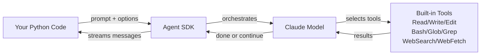
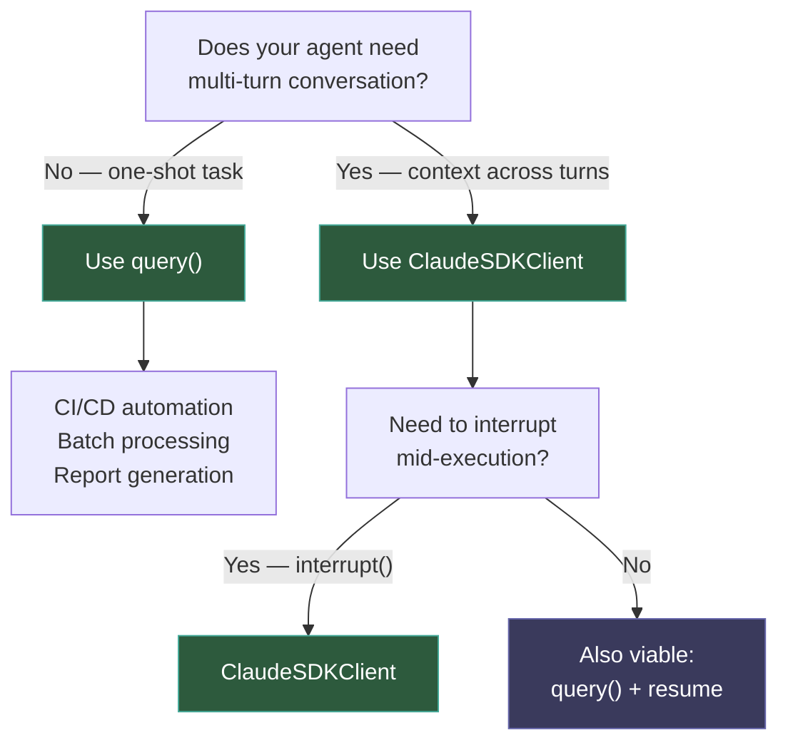
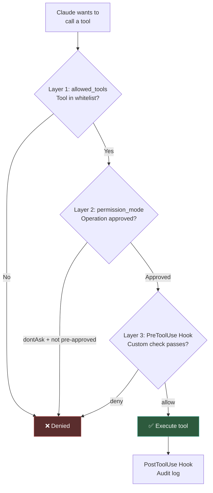

+++
date = '2026-04-17T10:00:00+08:00'
draft = false
title = 'Claude Agent SDK: Build Production AI Agents in Python (2026 Guide)'
description = 'A practical guide to building AI agents with Claude Agent SDK. Covers query() vs ClaudeSDKClient, MCP tool integration, three-layer permission control, and production deployment patterns.'
toc = true
tags = ['Claude Code', 'AI Agent', 'Agent SDK', 'Python', 'MCP']
keywords = ['claude agent sdk', 'claude agent sdk tutorial', 'build ai agent python', 'claude agent sdk guide 2026', 'claude code sdk production', 'ai agent development']

[[params.faqItems]]
question = "What is the difference between Claude Agent SDK and Anthropic Client SDK?"
answer = "The Client SDK requires you to implement the tool execution loop yourself (call tool → get result → feed back). The Agent SDK includes 10+ built-in tools (file I/O, shell commands, code search) and orchestrates them autonomously. You describe the task; Claude decides which tools to use."

[[params.faqItems]]
question = "Can I use my Claude Pro or Max subscription with the Agent SDK?"
answer = "No. The Agent SDK only accepts API key billing. You cannot use claude.ai Pro or Max subscription quotas. Anthropic blocked OAuth token extraction in January 2026."

[[params.faqItems]]
question = "When should I use query() vs ClaudeSDKClient?"
answer = "Use query() for one-shot tasks like CI/CD bug fixes or report generation — each call creates a fresh session. Use ClaudeSDKClient for multi-turn conversations where the agent needs to remember previous context across exchanges."

[[params.faqItems]]
question = "How much does running an Agent SDK task cost?"
answer = "It depends on the model and task complexity. Sonnet handles simple tasks for $0.01-0.1. Opus complex tasks can reach $1-5. Always set max_budget_usd to cap spending and prevent runaway costs."

[[params.faqItems]]
question = "Does the Agent SDK require Claude Code CLI installed separately?"
answer = "No. The pip install claude-agent-sdk package bundles the Claude Code CLI automatically. However, you need Node.js 18+ runtime installed on your system."
+++


Most AI agent frameworks make you implement the boring parts: tool execution loops, file permission handling, command timeout management. You spend more time on plumbing than on the actual agent logic.

The Claude Agent SDK takes a different approach. Instead of giving you an LLM API and saying "build your own tools," it exposes the exact same toolchain that powers Claude Code — Read, Write, Edit, Bash, Glob, Grep, WebSearch — as a Python (and TypeScript) library. Claude decides which tools to use, executes them, observes results, and continues autonomously.

The result? A file-reading, code-editing, command-running agent in three lines of Python:

```python
from claude_agent_sdk import query

async for message in query(prompt="Find and fix the bug in auth.py"):
    print(message)
```

But "it works in a demo" is not the same as "it works in production." This guide covers the architecture decisions that matter: when `query()` falls short and you need `ClaudeSDKClient`, how to extend agents with custom MCP tools, and how to build the three-layer permission system that keeps your agent from doing things it shouldn't.

## Architecture: Why This Isn't Just Another API Wrapper

If you have built agents with the [Anthropic Client SDK](https://docs.anthropic.com/en/api/client-sdks), you have written this loop:

```python
# Client SDK: you own the tool loop
response = client.messages.create(...)
while response.stop_reason == "tool_use":
    result = your_tool_executor(response.tool_use)  # You implement this
    response = client.messages.create(tool_result=result, **params)
```

This looks simple, but the `your_tool_executor` function hides enormous complexity. File operations need permission boundaries. Shell commands need timeout handling and security sandboxing. Code search needs to handle large repos without blowing up memory. Each tool is a mini-project.

The Agent SDK's key insight: **Claude Code already solved these problems**. Hundreds of thousands of developers use Claude Code daily to read files, edit code, and run tests. Those tool implementations are battle-tested. The SDK wraps that entire runtime into a Python package.



What you gain: no tool implementation, no execution loop, no permission edge cases. What you give up: it only works with Claude models, it requires Node.js 18+ runtime (the SDK shells out to the Claude Code CLI), and it bills via API key only — no subscription quota.

## Setup in 5 Minutes

### Prerequisites

- Python 3.10+ (3.12 recommended)
- Node.js 18+ (the SDK bundles Claude Code CLI, which requires Node.js runtime)
- Anthropic API key from the [Console](https://platform.claude.com/)

### Installation

```bash
# With uv (faster)
uv init my-agent && cd my-agent
uv add claude-agent-sdk

# With pip
python3 -m venv .venv && source .venv/bin/activate
pip install claude-agent-sdk
```

### API Key Configuration

```bash
export ANTHROPIC_API_KEY=your-api-key
```

**Critical limitation**: the Agent SDK only accepts API key billing. You cannot use Pro or Max subscription quotas. In January 2026, Anthropic [blocked OAuth token extraction](https://news.ycombinator.com/item?id=47118260), closing the workaround that some developers relied on. Budget accordingly: a complex Opus task can cost $1-5 per run.

For enterprise environments, the SDK supports three cloud providers:

| Provider | Environment Variable | Billing |
|----------|---------------------|---------|
| AWS Bedrock | `CLAUDE_CODE_USE_BEDROCK=1` | AWS account |
| Google Vertex AI | `CLAUDE_CODE_USE_VERTEX=1` | GCP account |
| Microsoft Azure | `CLAUDE_CODE_USE_FOUNDRY=1` | Azure account |

## query(): One-Shot Tasks Done Right

`query()` creates a fresh session per call. Claude autonomously uses tools to complete the task, then the session ends. This is the right choice for independent, self-contained tasks.

```python
import asyncio
from claude_agent_sdk import query, ClaudeAgentOptions, AssistantMessage, ResultMessage


async def main():
    async for message in query(
        prompt="Review utils.py for crash-causing bugs and fix them.",
        options=ClaudeAgentOptions(
            allowed_tools=["Read", "Edit", "Glob"],
            permission_mode="acceptEdits",
        ),
    ):
        if isinstance(message, AssistantMessage):
            for block in message.content:
                if hasattr(block, "text"):
                    print(block.text)
        elif isinstance(message, ResultMessage):
            print(f"\nDone in {message.duration_ms}ms, cost: ${message.total_cost_usd:.4f}")


asyncio.run(main())
```

Three parameters control everything:

**`allowed_tools`** is your whitelist. Only tools listed here are pre-approved. If you omit `Bash`, Claude cannot execute shell commands — period. This is your first line of defense.

**`permission_mode`** determines behavior for approved tools. `"acceptEdits"` auto-approves file modifications without confirmation. `"dontAsk"` silently denies anything not pre-approved — ideal for headless CI/CD.

**`prompt`** is natural language. No JSON schemas, no tool ordering. Claude figures out the execution plan.

### Built-in Tool Reference

| Tool | What It Does | Use Case |
|------|-------------|----------|
| **Read** | Read any file | Code review, config inspection |
| **Write** | Create new files | Report generation, scaffolding |
| **Edit** | Precise edits to existing files | Bug fixes, refactoring |
| **Bash** | Execute shell commands | Tests, git, package management |
| **Glob** | Pattern-match file paths | Find all `*.py`, `src/**/*.ts` |
| **Grep** | Regex search file contents | Find TODOs, function calls |
| **WebSearch** | Search the internet | Documentation, latest info |
| **WebFetch** | Fetch and parse web pages | API docs, changelogs |
| **Monitor** | Watch background script output | Log monitoring, long tasks |
| **AskUserQuestion** | Ask user for clarification | Critical decisions |

### Where query() Falls Short

`query()` is stateless. Each call is an independent session:

```python
# This fails: second query has no memory of the first
async for msg in query(prompt="Read auth.py"):
    pass
async for msg in query(prompt="Now find all callers of it"):
    pass  # Claude doesn't know what "it" refers to
```

If your workflow is "do one thing and exit" — CI/CD pipelines, batch processing, report generation — `query()` is perfect. For anything requiring conversational context, you need `ClaudeSDKClient`.

## ClaudeSDKClient: Multi-Turn Conversations

The most common mistake when building a chatbot with the Agent SDK: calling `query()` in a loop and wondering why Claude has no memory. That is by design — `query()` creates a new session every time.

`ClaudeSDKClient` maintains a persistent session. Claude remembers files read, analysis performed, and conversation history across multiple exchanges.

```python
import asyncio
from claude_agent_sdk import ClaudeSDKClient, ClaudeAgentOptions, AssistantMessage, TextBlock


async def main():
    options = ClaudeAgentOptions(
        allowed_tools=["Read", "Glob", "Grep", "Edit"],
        permission_mode="acceptEdits",
    )

    async with ClaudeSDKClient(options=options) as client:
        # Turn 1: read and understand the code
        await client.query("Read the authentication module in src/auth/")
        async for message in client.receive_response():
            if isinstance(message, AssistantMessage):
                for block in message.content:
                    if isinstance(block, TextBlock):
                        print(f"Claude: {block.text}")

        # Turn 2: analyze based on Turn 1 context
        await client.query("Find all callers and check for missing error handling")
        async for message in client.receive_response():
            if isinstance(message, AssistantMessage):
                for block in message.content:
                    if isinstance(block, TextBlock):
                        print(f"Claude: {block.text}")

        # Turn 3: fix issues found in Turn 2
        await client.query("Fix the error handling issues you just found")
        async for message in client.receive_response():
            if isinstance(message, AssistantMessage):
                for block in message.content:
                    if isinstance(block, TextBlock):
                        print(f"Claude: {block.text}")


asyncio.run(main())
```

The "it" in Turn 2 works because Claude remembers Turn 1. The "issues you just found" in Turn 3 works because Claude remembers Turn 2. This is what stateful sessions give you.

### Decision Framework: query() vs ClaudeSDKClient



There is a middle ground: `query()` with `resume` lets you chain sessions without `ClaudeSDKClient`:

```python
from claude_agent_sdk import query, ClaudeAgentOptions, SystemMessage

session_id = None

# First query: capture session ID
async for message in query(prompt="Read auth.py", options=options):
    if isinstance(message, SystemMessage) and message.subtype == "init":
        session_id = message.data["session_id"]

# Resume with full context
async for message in query(
    prompt="Find all callers",
    options=ClaudeAgentOptions(resume=session_id),
):
    print(message)
```

This works but is less ergonomic — you manage session IDs manually and cannot use `interrupt()` to cancel a running task.

## Extending Agents with MCP Tools

Built-in tools handle file operations and code search. Real-world agents often need more: database queries, API calls, browser automation. That is where MCP (Model Context Protocol) comes in.

I covered MCP fundamentals in a [previous article](/posts/ai/2026-02-20-mcp-protocol-guide/). Here I will focus on the two patterns specific to the Agent SDK.

### Pattern 1: Connect External MCP Servers

```python
import asyncio
from claude_agent_sdk import query, ClaudeAgentOptions


async def main():
    async for message in query(
        prompt="Open example.com and describe what you see",
        options=ClaudeAgentOptions(
            mcp_servers={
                "playwright": {
                    "command": "npx",
                    "args": ["@playwright/mcp@latest"],
                }
            }
        ),
    ):
        if hasattr(message, "result"):
            print(message.result)


asyncio.run(main())
```

The SDK spawns the MCP server process, discovers its tools, and lets Claude invoke them as needed. [Hundreds of MCP servers](https://github.com/modelcontextprotocol/servers) exist for databases, browsers, Slack, GitHub, and more.

For building your own MCP servers, see my [Python MCP Server tutorial](/posts/ai/2026-03-05-build-mcp-server-python/).

### Pattern 2: Inline Tools with @tool Decorator

For 3-5 custom tools, you do not need a separate MCP server. Define them inline:

```python
import asyncio
from claude_agent_sdk import tool, create_sdk_mcp_server, ClaudeAgentOptions, query


@tool("check_health", "Check service health status", {"service_name": str})
async def check_health(args):
    service = args["service_name"]
    # Replace with your actual health check logic
    return {
        "content": [
            {"type": "text", "text": f"Service '{service}' is healthy (42ms response)"}
        ]
    }


@tool("restart_service", "Restart a service", {"service_name": str, "force": bool})
async def restart(args):
    service = args["service_name"]
    force = args.get("force", False)
    return {
        "content": [
            {"type": "text", "text": f"Service '{service}' restarted (force={force})"}
        ]
    }


ops_server = create_sdk_mcp_server(
    name="ops-tools",
    version="1.0.0",
    tools=[check_health, restart],
)


async def main():
    async for message in query(
        prompt="Check if the auth service is healthy. If it is down, restart it.",
        options=ClaudeAgentOptions(
            mcp_servers={"ops": ops_server},
            allowed_tools=[
                "mcp__ops__check_health",
                "mcp__ops__restart_service",
            ],
        ),
    ):
        if hasattr(message, "result"):
            print(message.result)


asyncio.run(main())
```

Note the `allowed_tools` naming convention: `mcp__<server_name>__<tool_name>`. This lets you precisely control which custom tools the agent can access.

The `@tool` + `create_sdk_mcp_server()` pattern is my recommended approach for small tool sets. It is simple, type-safe, and runs in-process. For 10+ tools or cross-project reuse, build a standalone MCP server instead.

## Three-Layer Permission Control

An agent that can read files, execute commands, and edit code without permission controls is a liability. The Agent SDK provides three defense layers. I recommend enabling all of them.

### Layer 1: allowed_tools — Whitelist

The most direct control: only listed tools are pre-approved.

```python
# Read-only analyst: absolutely safe
options = ClaudeAgentOptions(allowed_tools=["Read", "Glob", "Grep"])

# Code modifier: can edit but not execute commands
options = ClaudeAgentOptions(allowed_tools=["Read", "Edit", "Glob", "Grep"])

# Full automation: use with caution
options = ClaudeAgentOptions(allowed_tools=["Read", "Write", "Edit", "Bash", "Glob", "Grep"])
```

### Layer 2: permission_mode — Behavioral Policy

| Mode | Behavior | Best For |
|------|----------|----------|
| `"acceptEdits"` | Auto-approve file edits, ask for other actions | Development |
| `"dontAsk"` | Silently deny anything not in allowed_tools | Headless CI/CD |
| `"bypassPermissions"` | Skip all permission checks | Sandboxed Docker |
| `"default"` | Requires `can_use_tool` callback | Custom approval flows |

**My recommendation**: use `"dontAsk"` with precise `allowed_tools` in production. An agent that reports "permission denied" is better than one that executes something it should not have.

### Layer 3: Hooks — Runtime Interception

Hooks let you inject custom logic before and after tool execution — audit logging, dangerous operation blocking, parameter modification.

```python
from datetime import datetime
from claude_agent_sdk import query, ClaudeAgentOptions, HookMatcher


async def audit_log(input_data, tool_use_id, context):
    file_path = input_data.get("tool_input", {}).get("file_path", "unknown")
    with open("./agent-audit.log", "a") as f:
        f.write(f"{datetime.now()}: {input_data.get('tool_name')} -> {file_path}\n")
    return {}


async def block_system_files(input_data, tool_use_id, context):
    file_path = input_data.get("tool_input", {}).get("file_path", "")
    if file_path.startswith("/etc/") or file_path.startswith("/system/"):
        return {"decision": "deny", "message": "System file modification blocked"}
    return {"decision": "allow"}


options = ClaudeAgentOptions(
    allowed_tools=["Read", "Edit", "Glob", "Grep"],
    permission_mode="acceptEdits",
    hooks={
        "PreToolUse": [HookMatcher(matcher="Edit|Write", hooks=[block_system_files])],
        "PostToolUse": [HookMatcher(matcher="Edit|Write", hooks=[audit_log])],
    },
)
```

For a deeper dive into hooks, see my [Claude Code Hooks guide](/posts/ai/2026-02-18-claude-code-hooks-guide/).

### How the Three Layers Work Together



## Complete Example: Code Review Agent

Here is a fully runnable agent that scans a codebase, analyzes quality issues, and generates a structured report.

```python
"""
code_reviewer.py — Automated code review agent
Usage: python code_reviewer.py [target_directory]
"""

import asyncio
import sys
from claude_agent_sdk import query, ClaudeAgentOptions, AssistantMessage, ResultMessage


REVIEW_PROMPT = """You are a senior code reviewer. Analyze the code in the current directory and produce a structured review report.

## Review checklist:
1. **Security**: SQL injection, XSS, command injection, hardcoded secrets
2. **Error handling**: unhandled exceptions, missing edge cases
3. **Performance**: O(n²) loops, unnecessary DB queries, memory leaks
4. **Code quality**: dead code, duplicated logic, unclear naming

## Output format:
Create a file called `review-report.md` with:
- Executive summary (1 paragraph)
- Critical issues (must fix)
- Warnings (should fix)
- Suggestions (nice to have)
- Statistics (files scanned, issues found by category)

Be specific: include file paths, line numbers, and code snippets for every issue.
"""


async def main():
    target_dir = sys.argv[1] if len(sys.argv) > 1 else "."

    print(f"Scanning: {target_dir}")

    async for message in query(
        prompt=REVIEW_PROMPT,
        options=ClaudeAgentOptions(
            allowed_tools=["Read", "Glob", "Grep", "Write"],
            permission_mode="acceptEdits",
            cwd=target_dir,
            max_turns=30,
            max_budget_usd=2.0,
        ),
    ):
        if isinstance(message, AssistantMessage):
            for block in message.content:
                if hasattr(block, "text"):
                    print(block.text)
                elif hasattr(block, "name"):
                    print(f"  [Tool] {block.name}")
        elif isinstance(message, ResultMessage):
            print(f"\nReview complete: {message.duration_ms / 1000:.1f}s, ${message.total_cost_usd:.4f}, {message.num_turns} turns")


if __name__ == "__main__":
    asyncio.run(main())
```

Two safety parameters to note:

- **`max_turns=30`** caps tool invocations. Prevents infinite loops where Claude repeatedly reads the same file.
- **`max_budget_usd=2.0`** is a hard dollar cap. The agent stops if it hits $2, even mid-task. This is your last line of defense against runaway costs.

## Subagents: Delegating Specialized Tasks

For complex workflows, split the work across specialized subagents. The main agent coordinates; subagents focus on narrow tasks.

```python
import asyncio
from claude_agent_sdk import query, ClaudeAgentOptions, AgentDefinition


async def main():
    async for message in query(
        prompt="Review this codebase: use security-auditor for vulnerabilities and style-checker for code quality.",
        options=ClaudeAgentOptions(
            allowed_tools=["Read", "Glob", "Grep", "Agent"],
            agents={
                "security-auditor": AgentDefinition(
                    description="Security expert that finds vulnerabilities",
                    prompt="Find security issues: injection, XSS, hardcoded secrets, unsafe deserialization.",
                    tools=["Read", "Glob", "Grep"],
                ),
                "style-checker": AgentDefinition(
                    description="Code quality reviewer for style and maintainability",
                    prompt="Check naming conventions, dead code, and excessive complexity.",
                    tools=["Read", "Glob", "Grep"],
                ),
            },
        ),
    ):
        if hasattr(message, "result"):
            print(message.result)


asyncio.run(main())
```

`allowed_tools` must include `"Agent"` for subagent dispatch to work. Each subagent gets its own tool whitelist — the security auditor does not need write access, so it only gets Read/Glob/Grep.

For a deeper look at Claude Code's subagent architecture, see my [subagent architecture deep dive](/posts/ai/2026-04-13-harness-subagent-architecture/).

## Production Hardening

Three things separate "works in development" from "safe in production."

### Cost Control

```python
options = ClaudeAgentOptions(
    max_budget_usd=5.0,          # Hard dollar cap per run
    max_turns=50,                 # Max tool invocations
    model="claude-sonnet-4-6",   # Sonnet is 10x cheaper than Opus
)
```

Model selection is your biggest cost lever. Most automation tasks work fine with Sonnet. Reserve Opus for tasks that require deep reasoning — architecture design, complex debugging. Opus 4.7 (released April 16, 2026) improves coding benchmarks 13% over 4.6 and adds task budgets (token countdown that prevents long tasks from being cut off) and the xhigh effort level. Note: Opus 4.7 requires Agent SDK v0.2.111+. In my experience: code review → Sonnet, architectural refactoring → Opus.

### Error Handling

```python
from claude_agent_sdk import ClaudeSDKError, CLINotFoundError, ProcessError

try:
    async for message in query(prompt="Fix the bug", options=options):
        if isinstance(message, ResultMessage) and message.is_error:
            print(f"Agent error: {message.result}")
            break
        print(message)
except CLINotFoundError:
    print("Node.js 18+ required. Install it first.")
except ProcessError as e:
    print(f"Process failed (exit {e.exit_code}): {e.stderr}")
except ClaudeSDKError as e:
    print(f"SDK error: {e}")
```

### Sandbox Isolation

For production, run agents inside Docker containers:

```python
options = ClaudeAgentOptions(
    permission_mode="bypassPermissions",  # Safe inside disposable containers
    sandbox={"type": "docker", "image": "node:18-slim"},
    cwd="/workspace",
)
```

`bypassPermissions` is dangerous on a host machine but safe in a disposable container — everything vanishes when the container is destroyed. This is the recommended pattern for CI/CD.

## When Not to Use the Agent SDK

The Agent SDK is powerful, but it is not the right tool for every job.

**Simple Q&A chatbot** → Use the [Anthropic Client SDK](https://docs.anthropic.com/en/api/client-sdks). The Agent SDK bundles file operation capabilities you will not use, and the CLI runtime adds startup overhead to every call.

**Multi-model flexibility** → The Agent SDK only supports Claude. If you need to switch between OpenAI, Gemini, and Claude, use LangChain or LlamaIndex.

**High-concurrency scenarios** (100+ requests/second) → Each `query()` spawns a CLI process. At high concurrency, process overhead dominates. Use the Client SDK with your own tool loop for better control.

**Subscription-only budget** → The SDK does not support Pro/Max subscription billing. If your budget is a $20/month Pro subscription, stick with the Claude Code CLI for interactive use.

## The Core Insight

The Agent SDK's value proposition is not "another way to call Claude." It is a shift in the agent development mental model: from **"I orchestrate tool calls"** to **"I define boundaries and permissions."**

You do not write tool executors. You do not manage the agent loop. You do not handle file permissions or command timeouts. Claude Code's team already solved those problems for hundreds of thousands of daily users.

Your job is two decisions:

1. **What tools does the agent get?** (allowed_tools whitelist)
2. **How much freedom does the agent have?** (permission_mode + hooks + max_budget)

Three lines to start. Thirty lines to production. The gap is smaller than you think.

---

## Related Reading

- [Claude Code Complete Guide](/posts/ai/2026-02-28-claude-code-complete-guide/) — If you are new to the Claude Code ecosystem
- [Build MCP Servers in Python](/posts/ai/2026-03-05-build-mcp-server-python/) — Advanced custom tool development
- [Claude Code Hooks Guide](/posts/ai/2026-02-18-claude-code-hooks-guide/) — Deep dive into runtime interception
- [Subagent Architecture Deep Dive](/posts/ai/2026-04-13-harness-subagent-architecture/) — Multi-agent collaboration patterns
- [MCP Protocol Guide](/posts/ai/2026-02-20-mcp-protocol-guide/) — MCP fundamentals and ecosystem
- [Claude Code Common Mistakes](/posts/ai/2026-02-25-claude-code-mistakes/) — Pitfalls in the Claude Code ecosystem
