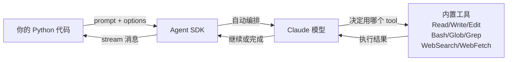
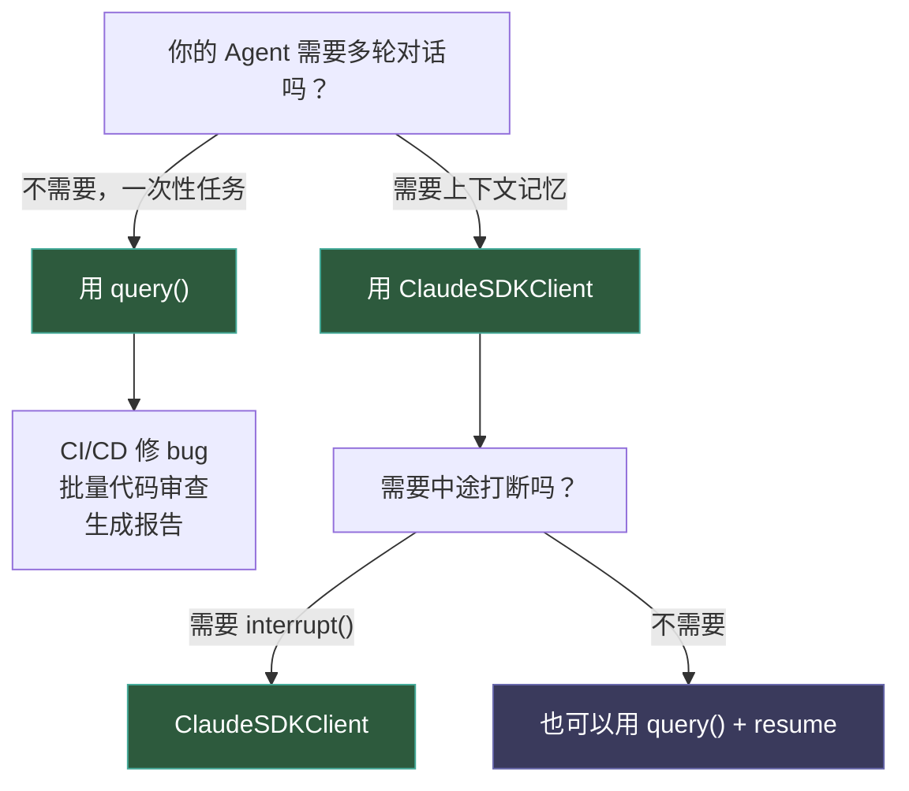
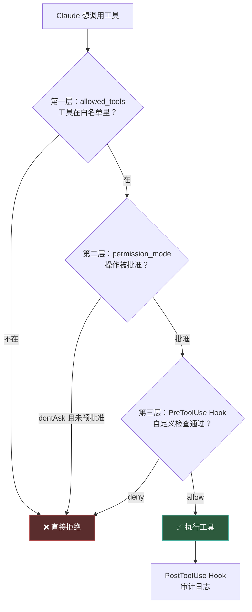

+++
date = '2026-04-17T10:00:00+08:00'
draft = false
title = 'Claude Agent SDK 实战指南：3 行 Python 搭建生产级 AI Agent'
description = '从 pip install 到生产部署，手把手教你用 Claude Agent SDK 搭建能读写文件、执行命令、多轮对话的 AI Agent。含完整代码、权限管控和避坑指南。'
toc = true
tags = ['Claude Code', 'AI Agent', 'Agent SDK', 'Python', 'MCP']
keywords = ['claude agent sdk', 'claude agent sdk 教程', 'ai agent 开发 python', 'claude agent sdk 实战', 'claude code sdk 搭建', 'ai agent 从零开始']

[[params.faqItems]]
question = "Claude Agent SDK 和 Anthropic Client SDK 有什么区别？"
answer = "Client SDK 需要你自己实现 tool execution loop（工具调用→结果回传→再调用的循环），Agent SDK 内置了 10+ 工具（文件读写、命令执行、代码搜索等）并自动编排执行，你只需要描述任务，Claude 自己决定用哪些工具。"

[[params.faqItems]]
question = "Claude Agent SDK 支持用订阅额度（Pro/Max）吗？"
answer = "不支持。Agent SDK 只接受 API Key 计费，不能使用 claude.ai 的 Pro 或 Max 订阅额度。2026 年 1 月 Anthropic 已封堵了 OAuth token 提取方式。"

[[params.faqItems]]
question = "Claude Agent SDK 的 query() 和 ClaudeSDKClient 怎么选？"
answer = "query() 适合一次性任务（CI/CD 修 bug、生成报告），每次调用都是新会话；ClaudeSDKClient 适合需要多轮对话和上下文记忆的交互式应用。如果你的 Agent 需要'记住上一轮说了什么'，必须用 ClaudeSDKClient。"

[[params.faqItems]]
question = "Agent SDK 运行一次大概花多少钱？"
answer = "取决于模型和任务复杂度。Sonnet 模型简单任务约 $0.01-0.1，Opus 模型复杂任务可达 $1-5。建议使用 max_budget_usd 参数设置硬上限，防止 Agent 跑飞。"

[[params.faqItems]]
question = "Agent SDK 需要安装 Claude Code CLI 吗？"
answer = "不需要手动安装。pip install claude-agent-sdk 会自动捆绑 Claude Code CLI，开箱即用。但你需要 Node.js 18+ 运行时环境。"
+++


一个能读写文件、执行终端命令、搜索代码库的 AI Agent，用 Python 写需要几行代码？

如果你用 LangChain，大概 80 行——定义 tool schema、实现 tool executor、写 agent loop、处理异常。如果你用 CrewAI，大概 50 行——还得理解它的 Agent/Task/Crew 三层抽象。

用 Claude Agent SDK？**3 行**。

```python
from claude_agent_sdk import query

async for message in query(prompt="Find and fix the bug in auth.py"):
    print(message)
```

这不是玩具代码。这 3 行背后，Claude 会自动读取文件、分析 bug、编辑修复——不需要你写任何 tool execution loop。

但 90% 的教程到这里就结束了。真正把 Agent 推向生产，你还需要搞懂 3 件事：多轮对话的 `ClaudeSDKClient`、权限管控的三层防御、以及 MCP 自定义工具。这篇文章把这些全覆盖。

## Agent SDK 到底解决了什么问题

如果你用过 [Anthropic Client SDK](https://docs.anthropic.com/en/api/client-sdks) 构建 Agent，一定写过这样的循环：

```python
# 传统方式：你来写 tool loop
response = client.messages.create(...)
while response.stop_reason == "tool_use":
    result = your_tool_executor(response.tool_use)  # 你实现
    response = client.messages.create(tool_result=result, **params)
```

这个循环看起来简单，实际上藏着大量工作：你得实现每个 tool 的执行逻辑（文件读写？命令执行？代码搜索？），处理异常和超时，管理上下文窗口，决定什么时候该停。这就是为什么 LangChain 生态里有上百个 tool wrapper——因为每个人都在重复造这个轮子。

Agent SDK 的核心思路是：**把 Claude Code 已经验证过的工具链直接暴露为 API**。Claude Code 每天被几十万开发者用来读文件、改代码、跑测试，这些工具的实现已经经过了大量实战打磨。Agent SDK 不是重新实现了一套工具，而是把 Claude Code 的 Read、Write、Edit、Bash、Glob、Grep、WebSearch 等 10+ 内置工具原封不动地交给你的 Python 程序。

这意味着什么？你不用写 tool executor，不用管文件权限边界，不用处理命令执行的超时和安全——这些 Claude Code 已经帮你解决了。你只需要做两件事：**描述任务**和**定义权限边界**。



## 环境搭建：5 分钟上手

### 前置条件

- Python 3.10+（推荐 3.12）
- Node.js 18+（SDK 底层依赖 Claude Code CLI 运行时）
- Anthropic API Key（从 [Console](https://platform.claude.com/) 获取）

为什么需要 Node.js？因为 Agent SDK 底层调用的是 Claude Code CLI（一个 Node.js 应用），`pip install` 会自动捆绑它，但运行时需要 Node.js 环境。这是很多人踩的第一个坑——Python 装好了，跑起来报错才发现缺 Node.js。

### 安装

```bash
# 推荐用 uv（更快的包管理器）
uv init my-agent && cd my-agent
uv add claude-agent-sdk

# 或者用传统 pip
python3 -m venv .venv && source .venv/bin/activate
pip install claude-agent-sdk
```

### 配置 API Key

```bash
export ANTHROPIC_API_KEY=your-api-key
```

**重要：Agent SDK 只接受 API Key 计费**。不能用 claude.ai 的 Pro 或 Max 订阅额度。2026 年 1 月 Anthropic [封堵了 OAuth token 提取](https://news.ycombinator.com/item?id=47118260)，所以别想着省钱用订阅。一次 Opus 模型的复杂任务可能花 $1-5，Sonnet 模型简单任务约 $0.01-0.1。

如果你在企业环境，SDK 也支持三种第三方认证：

| 云平台 | 环境变量 | 说明 |
|--------|---------|------|
| AWS Bedrock | `CLAUDE_CODE_USE_BEDROCK=1` | 走 AWS 账单 |
| Google Vertex AI | `CLAUDE_CODE_USE_VERTEX=1` | 走 GCP 账单 |
| Microsoft Azure | `CLAUDE_CODE_USE_FOUNDRY=1` | 走 Azure 账单 |

## query()：一次性任务的最佳选择

`query()` 是 Agent SDK 最简单的入口。每次调用创建一个新会话，Claude 在这个会话里自主使用工具完成任务，然后结束。

### 基础用法

```python
import asyncio
from claude_agent_sdk import query, ClaudeAgentOptions, AssistantMessage, ResultMessage


async def main():
    async for message in query(
        prompt="Review utils.py for bugs that would cause crashes. Fix any issues.",
        options=ClaudeAgentOptions(
            allowed_tools=["Read", "Edit", "Glob"],
            permission_mode="acceptEdits",
        ),
    ):
        if isinstance(message, AssistantMessage):
            for block in message.content:
                if hasattr(block, "text"):
                    print(block.text)
        elif isinstance(message, ResultMessage):
            print(f"\n--- 完成 ---")
            print(f"耗时: {message.duration_ms}ms")
            print(f"花费: ${message.total_cost_usd:.4f}")


asyncio.run(main())
```

这里有三个关键参数：

1. **`allowed_tools`**：预批准哪些工具。只列了 Read、Edit、Glob，Claude 就只能用这三个。没列 Bash，它就无法执行终端命令——这是你的第一层权限控制。

2. **`permission_mode`**：决定 Claude 对已批准工具的使用行为。`"acceptEdits"` 表示自动批准文件编辑操作，不弹确认。

3. **`prompt`**：自然语言描述任务。不需要写 JSON schema，不需要指定工具调用顺序——Claude 自己判断。

### 内置工具速查

| 工具 | 功能 | 典型场景 |
|------|------|---------|
| **Read** | 读取任意文件 | 代码审查、配置检查 |
| **Write** | 创建新文件 | 生成报告、创建配置 |
| **Edit** | 精确编辑已有文件 | Bug 修复、重构 |
| **Bash** | 执行终端命令 | 跑测试、git 操作、安装依赖 |
| **Glob** | 按模式搜索文件 | 找到所有 `*.py` 文件 |
| **Grep** | 正则搜索文件内容 | 找 TODO、找函数调用 |
| **WebSearch** | 搜索互联网 | 查文档、查最新信息 |
| **WebFetch** | 抓取网页内容 | 读取 API 文档、解析页面 |
| **Monitor** | 监听后台脚本输出 | 日志监控、长时任务跟踪 |
| **AskUserQuestion** | 向用户提问 | 需要人工确认的关键决策 |

### query() 的局限

`query()` 是无状态的——每次调用都是全新的会话。这意味着：

```python
# ❌ 这样不行：第二次 query 不知道第一次读了什么
async for msg in query(prompt="Read auth.py"):
    pass
async for msg in query(prompt="Now find all callers of it"):
    pass  # Claude 不知道 "it" 是什么
```

如果你的场景是"执行一个独立任务然后结束"——CI/CD 修 bug、生成代码审查报告、批量重构——`query()` 完美适用。但如果你需要多轮对话、需要 Claude 记住之前的上下文，就必须用 `ClaudeSDKClient`。

## ClaudeSDKClient：多轮对话的正确姿势

很多人用 Agent SDK 构建的第一个"聊天机器人"就翻车了——用 `query()` 循环调用，每轮都是新会话，Claude 什么都不记得。这不是 bug，是 `query()` 的设计。

`ClaudeSDKClient` 才是多轮对话的正确方式。它维护一个持久会话，Claude 在多轮交互中记住文件内容、分析结果和对话历史。

```python
import asyncio
from claude_agent_sdk import ClaudeSDKClient, ClaudeAgentOptions, AssistantMessage, TextBlock


async def main():
    options = ClaudeAgentOptions(
        allowed_tools=["Read", "Glob", "Grep", "Edit"],
        permission_mode="acceptEdits",
    )

    async with ClaudeSDKClient(options=options) as client:
        # 第一轮：读取并理解代码
        await client.query("Read the authentication module in src/auth/")
        async for message in client.receive_response():
            if isinstance(message, AssistantMessage):
                for block in message.content:
                    if isinstance(block, TextBlock):
                        print(f"Claude: {block.text}")

        # 第二轮：基于上一轮的理解继续分析
        await client.query("Find all places that call it and check for missing error handling")
        async for message in client.receive_response():
            if isinstance(message, AssistantMessage):
                for block in message.content:
                    if isinstance(block, TextBlock):
                        print(f"Claude: {block.text}")

        # 第三轮：执行修复
        await client.query("Fix the error handling issues you just found")
        async for message in client.receive_response():
            if isinstance(message, AssistantMessage):
                for block in message.content:
                    if isinstance(block, TextBlock):
                        print(f"Claude: {block.text}")


asyncio.run(main())
```

注意第二轮的 "it"——Claude 知道你指的是上一轮读取的认证模块。这就是 `ClaudeSDKClient` 和 `query()` 的根本区别。

### query() vs ClaudeSDKClient 决策流程



`query()` 也支持通过 `resume` 参数恢复之前的会话：

```python
# 方式二：用 query() + resume 实现多轮
session_id = None

async for message in query(prompt="Read auth.py", options=options):
    if isinstance(message, SystemMessage) and message.subtype == "init":
        session_id = message.data["session_id"]

# 恢复上一个会话继续
async for message in query(
    prompt="Now find all callers",
    options=ClaudeAgentOptions(resume=session_id),
):
    print(message)
```

但这种方式不如 `ClaudeSDKClient` 直觉——你得自己管理 session_id，而且不支持 `interrupt()` 中断正在执行的任务。

## 用 MCP 扩展 Agent 能力

内置工具覆盖了文件操作和代码搜索，但真实场景往往需要更多：查数据库、调 API、操作浏览器。这就是 MCP（Model Context Protocol）的用武之地。

关于 MCP 的基础概念，我在[之前的文章](/posts/ai/2026-02-20-mcp-protocol-guide/)中有详细介绍。这里聚焦 Agent SDK 中的两种 MCP 用法。

### 方式一：连接外部 MCP Server

```python
import asyncio
from claude_agent_sdk import query, ClaudeAgentOptions


async def main():
    async for message in query(
        prompt="Open heyuan110.com and take a screenshot",
        options=ClaudeAgentOptions(
            mcp_servers={
                "playwright": {
                    "command": "npx",
                    "args": ["@playwright/mcp@latest"],
                }
            }
        ),
    ):
        if hasattr(message, "result"):
            print(message.result)


asyncio.run(main())
```

`mcp_servers` 字典的 key 是服务器名，value 是启动配置。SDK 会自动启动这个进程、发现它提供的工具、让 Claude 按需调用。你可以连接[数百个现成的 MCP Server](https://github.com/modelcontextprotocol/servers)——数据库、浏览器、Slack、GitHub 等等。

如果你对构建自己的 MCP Server 感兴趣，可以参考我的 [Python MCP Server 搭建教程](/posts/ai/2026-03-05-build-mcp-server-python/)。

### 方式二：用 @tool 装饰器自定义工具

不想搭完整的 MCP Server？可以直接在 Python 里定义工具：

```python
import asyncio
from claude_agent_sdk import tool, create_sdk_mcp_server, ClaudeAgentOptions, query


@tool("check_service_health", "Check if a service is running", {"service_name": str})
async def check_health(args):
    """检查服务健康状态——这里替换成你的真实逻辑"""
    service = args["service_name"]
    # 实际场景：调用 HTTP endpoint、检查进程、查询数据库
    return {
        "content": [
            {"type": "text", "text": f"Service '{service}' is running (response time: 42ms)"}
        ]
    }


@tool("restart_service", "Restart a service", {"service_name": str, "force": bool})
async def restart(args):
    """重启服务——生产环境中要加权限校验"""
    service = args["service_name"]
    force = args.get("force", False)
    return {
        "content": [
            {"type": "text", "text": f"Service '{service}' restarted (force={force})"}
        ]
    }


# 把自定义工具打包成 MCP Server
ops_server = create_sdk_mcp_server(
    name="ops-tools",
    version="1.0.0",
    tools=[check_health, restart],
)


async def main():
    async for message in query(
        prompt="Check if the auth service is healthy. If not, restart it.",
        options=ClaudeAgentOptions(
            mcp_servers={"ops": ops_server},
            allowed_tools=[
                "mcp__ops__check_service_health",
                "mcp__ops__restart_service",
            ],
        ),
    ):
        if hasattr(message, "result"):
            print(message.result)


asyncio.run(main())
```

注意 `allowed_tools` 里的命名格式：`mcp__<server_name>__<tool_name>`。这是 SDK 的约定——确保你能精确控制哪些自定义工具被批准使用。

`@tool` 装饰器 + `create_sdk_mcp_server()` 这个组合拳是我最推荐的扩展方式：简单、类型安全、不需要单独起进程。适合 3-5 个自定义工具的场景。如果你有 10+ 个工具或需要跨项目复用，还是建议搭独立的 MCP Server。

## 权限管控：把 Agent 关进笼子

一个能读写文件、执行命令的 Agent 如果没有权限管控，就是一颗定时炸弹。Agent SDK 提供了三层防御体系，我建议全部启用。

### 第一层：allowed_tools — 白名单

最直观的控制——只列出 Agent 可以用的工具：

```python
# 只读分析 Agent：绝对安全
options = ClaudeAgentOptions(
    allowed_tools=["Read", "Glob", "Grep"],
)

# 代码修改 Agent：能编辑但不能执行命令
options = ClaudeAgentOptions(
    allowed_tools=["Read", "Edit", "Glob", "Grep"],
)

# 全自动 Agent：能做任何事（谨慎！）
options = ClaudeAgentOptions(
    allowed_tools=["Read", "Write", "Edit", "Bash", "Glob", "Grep"],
)
```

### 第二层：permission_mode — 行为模式

| 模式 | 行为 | 适用场景 |
|------|------|---------|
| `"acceptEdits"` | 自动批准文件编辑，其他操作需确认 | 开发环境 |
| `"dontAsk"` | 不在 allowed_tools 里的直接拒绝 | 无人值守的 CI/CD |
| `"bypassPermissions"` | 跳过所有权限检查 | 沙箱环境（Docker 内） |
| `"default"` | 需要你提供 `can_use_tool` 回调 | 自定义审批流程 |

**我的建议**：生产环境用 `"dontAsk"` + 精确的 `allowed_tools`。宁可 Agent 报错"没有权限"，也不要让它自作主张执行了不该执行的操作。

### 第三层：Hooks — 运行时拦截

Hooks 让你在工具执行前后插入自定义逻辑——记录审计日志、拦截危险操作、修改参数。

```python
from datetime import datetime
from claude_agent_sdk import query, ClaudeAgentOptions, HookMatcher


async def audit_log(input_data, tool_use_id, context):
    """记录所有文件修改操作到审计日志"""
    file_path = input_data.get("tool_input", {}).get("file_path", "unknown")
    with open("./agent-audit.log", "a") as f:
        f.write(f"{datetime.now()}: {input_data.get('tool_name')} -> {file_path}\n")
    return {}


async def block_system_files(input_data, tool_use_id, context):
    """禁止修改系统目录文件"""
    file_path = input_data.get("tool_input", {}).get("file_path", "")
    if file_path.startswith("/etc/") or file_path.startswith("/system/"):
        return {"decision": "deny", "message": "System file modification blocked"}
    return {"decision": "allow"}


async def main():
    async for message in query(
        prompt="Refactor the project for better code quality",
        options=ClaudeAgentOptions(
            allowed_tools=["Read", "Edit", "Glob", "Grep"],
            permission_mode="acceptEdits",
            hooks={
                "PreToolUse": [
                    HookMatcher(matcher="Edit|Write", hooks=[block_system_files])
                ],
                "PostToolUse": [
                    HookMatcher(matcher="Edit|Write", hooks=[audit_log])
                ],
            },
        ),
    ):
        if hasattr(message, "result"):
            print(message.result)
```

关于 Hooks 的更多用法和最佳实践，可以参考我的 [Claude Code Hooks 完全指南](/posts/ai/2026-02-18-claude-code-hooks-guide/)。

### 三层防御组合



## 实战项目：代码审查 Agent

理论讲完，来一个完整可运行的项目。这个 Agent 能扫描指定目录的代码，分析质量问题，生成结构化报告。

```python
"""
code_reviewer.py — 自动代码审查 Agent
用法: python code_reviewer.py [目标目录]
"""

import asyncio
import sys
from claude_agent_sdk import query, ClaudeAgentOptions, AssistantMessage, ResultMessage


REVIEW_PROMPT = """You are a senior code reviewer. Analyze the code in the current directory and produce a structured review report.

## Review checklist:
1. **Security**: SQL injection, XSS, command injection, hardcoded secrets
2. **Error handling**: unhandled exceptions, missing edge cases
3. **Performance**: O(n²) loops, unnecessary DB queries, memory leaks
4. **Code quality**: dead code, duplicated logic, unclear naming

## Output format:
Create a file called `review-report.md` with:
- Executive summary (1 paragraph)
- Critical issues (must fix)
- Warnings (should fix)
- Suggestions (nice to have)
- Statistics (files scanned, issues found by category)

Be specific: include file paths, line numbers, and code snippets for every issue.
"""


async def main():
    target_dir = sys.argv[1] if len(sys.argv) > 1 else "."

    print(f"🔍 Scanning: {target_dir}")
    print("---")

    async for message in query(
        prompt=REVIEW_PROMPT,
        options=ClaudeAgentOptions(
            allowed_tools=["Read", "Glob", "Grep", "Write"],
            permission_mode="acceptEdits",
            cwd=target_dir,
            max_turns=30,
            max_budget_usd=2.0,  # 硬限制：最多花 $2
        ),
    ):
        if isinstance(message, AssistantMessage):
            for block in message.content:
                if hasattr(block, "text"):
                    print(block.text)
                elif hasattr(block, "name"):
                    print(f"  [Tool] {block.name}")
        elif isinstance(message, ResultMessage):
            print(f"\n--- Review complete ---")
            print(f"Duration: {message.duration_ms / 1000:.1f}s")
            print(f"Cost: ${message.total_cost_usd:.4f}")
            print(f"Turns: {message.num_turns}")


if __name__ == "__main__":
    asyncio.run(main())
```

注意两个关键参数：

- **`max_turns=30`**：限制 Agent 最多执行 30 轮工具调用。防止 Claude 陷入死循环（比如反复读同一个文件）。
- **`max_budget_usd=2.0`**：硬限制美元上限。Agent 花了 $2 还没完成就强制终止。这是防止"跑飞烧钱"的最后一道防线。

运行：

```bash
python code_reviewer.py ./src
```

Agent 会自动：Glob 找到所有源码文件 → Read 逐个读取 → Grep 搜索已知的安全隐患模式 → Write 生成 review-report.md。整个过程你只需要等待。

## 子 Agent：让 Agent 分派任务

复杂任务可以拆分给多个专门化的子 Agent。主 Agent 负责协调，子 Agent 各司其职。

```python
import asyncio
from claude_agent_sdk import query, ClaudeAgentOptions, AgentDefinition


async def main():
    async for message in query(
        prompt="Review this codebase: use the security-auditor for vulnerabilities and the style-checker for code quality.",
        options=ClaudeAgentOptions(
            allowed_tools=["Read", "Glob", "Grep", "Agent"],
            agents={
                "security-auditor": AgentDefinition(
                    description="Security expert that finds vulnerabilities",
                    prompt="Find security issues: injection, XSS, hardcoded secrets, unsafe deserialization.",
                    tools=["Read", "Glob", "Grep"],
                ),
                "style-checker": AgentDefinition(
                    description="Code quality reviewer for style and maintainability",
                    prompt="Check code quality: naming conventions, dead code, excessive complexity.",
                    tools=["Read", "Glob", "Grep"],
                ),
            },
        ),
    ):
        if hasattr(message, "result"):
            print(message.result)


asyncio.run(main())
```

注意 `allowed_tools` 里必须包含 `"Agent"`——这是子 Agent 调用的前提。每个子 Agent 有独立的工具白名单，安全审计 Agent 不需要写文件能力，就只给 Read/Glob/Grep。

如果你对 Claude Code 的子 Agent 架构感兴趣，我在[子 Agent 架构深度解析](/posts/ai/2026-04-13-harness-subagent-architecture/)中有更详细的分析。

## 生产化三板斧

从"能跑"到"敢上生产"，还差三件事。

### 1. 成本控制

```python
options = ClaudeAgentOptions(
    max_budget_usd=5.0,     # 单次运行硬上限
    max_turns=50,            # 最大工具调用轮次
    model="claude-sonnet-4-6",  # Sonnet 比 Opus 便宜 10 倍
)
```

模型选择是最大的成本杠杆。大多数自动化任务用 Sonnet 就够了，只有需要深度推理的复杂任务才值得上 Opus。我的经验是：代码审查用 Sonnet，架构设计用 Opus。

### 2. 错误处理

```python
from claude_agent_sdk import (
    ClaudeSDKError,
    CLINotFoundError,
    ProcessError,
)

try:
    async for message in query(prompt="Fix the bug", options=options):
        if isinstance(message, ResultMessage) and message.is_error:
            print(f"Agent error: {message.result}")
            break
        print(message)
except CLINotFoundError:
    print("Error: Node.js 18+ required. Install it first.")
except ProcessError as e:
    print(f"Process failed (exit {e.exit_code}): {e.stderr}")
except ClaudeSDKError as e:
    print(f"SDK error: {e}")
```

### 3. 沙箱隔离

生产环境强烈建议在 Docker 容器内运行 Agent：

```python
options = ClaudeAgentOptions(
    permission_mode="bypassPermissions",  # 容器内可以放开
    sandbox={"type": "docker", "image": "node:18-slim"},
    cwd="/workspace",  # 容器内的工作目录
)
```

`bypassPermissions` 在本机上很危险，但在一次性容器里是安全的——容器销毁后一切都消失。这也是 CI/CD 场景的推荐做法。

## 什么时候不该用 Agent SDK

Agent SDK 很强大，但不是万能的。以下场景用其他方案更合适：

**简单 Q&A 聊天机器人** → 用 [Anthropic Client SDK](https://docs.anthropic.com/en/api/client-sdks)。Agent SDK 内置了大量文件操作能力，对纯对话场景来说太重了。你在为用不到的能力付费（SDK 启动就要加载 CLI 运行时）。

**需要用 OpenAI/Gemini 模型** → Agent SDK 只支持 Claude。如果你需要模型切换能力，用 LangChain 或 LlamaIndex。

**超高并发场景**（每秒 100+ 请求） → Agent SDK 每个 query 都启动一个 CLI 进程，不适合高并发。用 Client SDK + 自己的 tool loop 更可控。

**需要订阅计费** → SDK 不支持 Pro/Max 订阅额度。如果你的预算只有 $20/月的 Pro 订阅，用 Claude Code CLI 交互式就好。

## 总结：从 3 行到生产

Agent SDK 的核心价值不是"又一个 LLM API wrapper"，而是**把经过大量实战验证的工具链交给你的 Python 程序**。你不用再写 tool executor、不用管文件安全边界、不用处理命令超时——这些 Claude Code 团队已经替你踩过了。

你需要做的判断只有两个：

1. **给 Agent 什么工具**（allowed_tools 白名单）
2. **给 Agent 多大权限**（permission_mode + hooks + max_budget）

如果你正在做 CI/CD 自动化、内部工具开发、或者任何需要"AI 操作文件系统"的场景，Agent SDK 是目前门槛最低的选择。3 行代码上手，30 行代码进生产。

---

## Related Reading

- [Claude Code 完全入门指南](/posts/ai/2026-02-28-claude-code-complete-guide/) — 如果你对 Claude Code 本身还不熟悉
- [Python MCP Server 搭建教程](/posts/ai/2026-03-05-build-mcp-server-python/) — 自定义工具的进阶方式
- [Claude Code Hooks 完全指南](/posts/ai/2026-02-18-claude-code-hooks-guide/) — Hooks 权限管控的详细用法
- [子 Agent 架构深度解析](/posts/ai/2026-04-13-harness-subagent-architecture/) — 多 Agent 协作的设计模式
- [MCP 协议完全指南](/posts/ai/2026-02-20-mcp-protocol-guide/) — MCP 的基础概念和生态
- [Claude Code 常见错误与避坑指南](/posts/ai/2026-02-25-claude-code-mistakes/) — 使用 Claude Code 生态的常见坑
