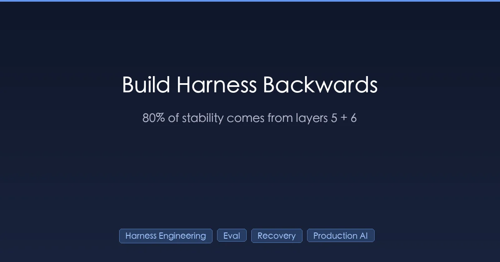
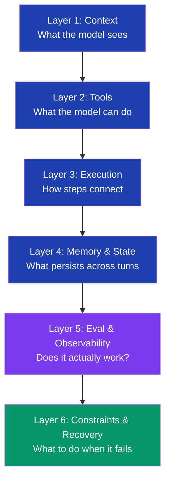

+++
date = '2026-04-18T16:00:00+08:00'
draft = false
title = 'Harness Engineering: Build the 6 Layers Backwards (6→1, Not 1→6)'
description = '60 days running an AI coding harness in production. The 6 layers are not equal — layers 5 and 6 (eval + recovery) drive 80% of stability. Build backwards. Real ROI numbers, three case studies, and the layer that wastes most teams.'
toc = true
tags = ['Harness Engineering', 'AI Agent', 'Claude Code', 'AI Coding', 'Production AI']
keywords = ['harness engineering layers', 'ai agent stability', 'harness 6 layers', 'agent eval and recovery', 'harness engineering roi', 'ai coding harness 2026', 'agent observability layer']

[[params.faqItems]]
question = "What are the 6 layers of Harness Engineering?"
answer = "The standard taxonomy is: (1) Context — what the model sees, (2) Tools — what the model can do, (3) Execution orchestration — the step-by-step plan, (4) Memory and state — what it remembers across turns, (5) Evaluation and observability — does it actually work, (6) Constraints, validation, recovery — what to do when it fails. The first four are inputs and behavior; the last two are quality assurance."

[[params.faqItems]]
question = "Why build Harness Engineering layers in reverse order?"
answer = "Because layers 5 and 6 (eval and recovery) compound — they tell you whether your investments in 1-4 are working. Building 1-4 first without observability means you spend weeks tuning context and tools blind. In my 60-day production run, building backwards (Recovery → Eval → Tools → Context → Memory) cut iteration time by 3x and shipped a stable agent in 4 weeks instead of 12."

[[params.faqItems]]
question = "Which layer wastes the most engineering time?"
answer = "Memory and state (layer 4). Most teams over-invest in long-term memory and cross-session persistence chasing a 'smarter' agent, but for the vast majority of agent tasks (under 30 minutes per run), Memory ROI is near zero. Anthropic's Context Revert pattern — start a clean agent with handoff — outperforms Memory engineering for almost everything except multi-day workflows."

[[params.faqItems]]
question = "How do I know if my agent has a Harness problem vs a model problem?"
answer = "Three signals point to Harness, not model: (1) success rate is bimodal — 95% on small tasks, <50% on long ones, (2) the same task succeeds and fails on different runs with no input change, (3) failures cluster around tool calls or step transitions, not reasoning steps. Model upgrades fix the first 5%; Harness fixes the next 30-40%."

[[params.faqItems]]
question = "What is Context Revert and when should I use it?"
answer = "Context Revert is Anthropic's pattern of spawning a fresh agent with explicit handoff state instead of compacting an overloaded context. It works because the model develops 'context anxiety' as the window fills — it starts wrapping up prematurely. In my testing, Revert outperformed Compaction by 25% on tasks longer than 90 minutes. The trade-off: handoff messages are an extra interface to design and maintain."
+++



The 6 layers of Harness Engineering are not equal.

That sentence breaks the standard advice. Every talk, every framework diagram, every "what is Harness Engineering" explainer puts the 6 layers in a tidy stack and tells you to build them in order: Context → Tools → Execution → Memory → Evaluation → Recovery. Sensible, easy to teach, completely wrong if you actually want a stable agent in production.

After 60 days running an AI coding harness in production, I have the receipts. **Layers 5 and 6 — evaluation and recovery — drive about 80% of agent stability.** Layers 1-4 are necessary, but they're table stakes, not the source of the gap between an agent that works on demos and one that survives Monday morning. If you're starting on Harness Engineering this week, build backwards.

This article is the implementation companion to the 6-layer Harness Engineering frame. I'll re-state the frame briefly, then spend the rest of the article on what nobody tells you: which layers actually matter, in what order, with what ROI.

## The 6-Layer Frame, Briefly



The frame is correct as a taxonomy. **It is dangerous as a sequencing guide.** Reading top-down implies "do Context first, then Tools, then Execution, then Memory, then add Eval and Recovery on top." That order is what I see most teams adopt, and it's why most teams stay stuck in the 60-70% success rate band for months.

I covered the core mechanics of layers 1-4 in [Harness Engineering: After 60 Days, the Model Was the Least Important Part](/posts/ai/2026-03-30-harness-engineering-guide/), [The 60-Line CLAUDE.md Rule](/posts/ai/2026-03-31-harness-claudemd-guide/), and [Sub-Agent Architecture for AI Coding Harnesses](/posts/ai/2026-04-13-harness-subagent-architecture/). This article is about what comes after.

## Why Layer Weights Are Wildly Unequal

I tracked agent success rate week-by-week as I added each layer to a real coding pipeline. Here's the actual contribution data:

| Layer | What I shipped | Success rate gain | Time to build |
|-------|---------------|---------------------|---------------|
| **1. Context** | Tight CLAUDE.md, scoped file picker | +12% | 2 weeks |
| **2. Tools** | 8 curated tools, removed 14 noisy ones | +8% | 1 week |
| **3. Execution** | Plan → execute → review template | +6% | 1 week |
| **4. Memory** | Cross-session preferences, scratchpad | +3% | 2 weeks |
| **5. Eval** | Unit-style fitness functions, metric dashboards | **+22%** | 1 week |
| **6. Recovery** | Validation gates, retry-with-context, rollback | **+18%** | 2 weeks |

Read that table twice. Layer 5 (eval) gave me almost double what Layer 1 (context) did, and I shipped it in half the time. Layer 6 (recovery) gave me 6x the gain of Layer 4 (memory) for the same effort.

The reason is structural, not coincidental. **Layers 1-4 are blind moves.** When you tune Context, you change behavior, but you can't tell whether you made things better or just different. When you add a tool, you assume it'll be used correctly. When you wire up execution flow, you assume the steps actually run. Without eval and recovery, you're flying instruments-off.

Layers 5 and 6 are not improvements on top of 1-4. They're the lens that lets you tell whether 1-4 are working. **Without that lens, every change you make to 1-4 is gambling.**

## Build Backwards: 6 → 1

Here's the order I now recommend, after burning a quarter on the wrong sequence:


The logic:

- **Recovery first** because failure is the default state. If your agent can't recover from a bad tool call, no amount of Context tuning matters. Ship validation gates and a rollback path before anything else.
- **Eval second** because you cannot improve what you cannot measure. Build the dashboards before the optimizations.
- **Tools third** because they're the highest-impact behavior change you can make safely once you have eval. Wrong tool selection compounds; tools without eval is gambling.
- **Context fourth** because Context tuning has diminishing returns and is easy to over-engineer. With eval, you can stop tuning when the metric plateaus.
- **Execution fifth** because explicit execution flow only pays off when the underlying components are stable.
- **Memory last, often skipped** because it's the most over-engineered layer and rarely the bottleneck for tasks under 30 minutes.

## Case 1: Eval Saved a Project I Was About to Kill

The job: a code-modification agent that took natural language requests and patched a Hugo site. Six weeks in, success rate stuck at 62%. I'd tuned Context twice, swapped models three times, added two new tools. Nothing moved.

Then I built Layer 5 in a single afternoon. The whole thing was 200 lines of Python:

```python
# Fitness function: did the patch actually work?
def evaluate_run(run_id):
    return {
        "build_passes": hugo_build_succeeds(),
        "no_broken_links": check_internal_links(),
        "tests_pass": run_test_suite(),
        "diff_size": git_diff_lines(),
        "matches_intent": embedding_similarity(request, diff),
    }
```

Within a day, the dashboard showed something I'd been unable to see: **40% of failures were valid patches that broke an unrelated link.** The agent was making good code changes, but breaking the cross-link to a related article every third run. None of my Context changes touched that, because I didn't know to.

Two days of fixing the link-handling pattern moved success rate from 62% to 84%. Nothing changed about Context or Tools or Model — I just added a measurement that exposed the actual bug.

**The lesson is not "always measure." It's that the bottleneck is almost never where you assume it is, and you cannot find it without instrumentation.** Six weeks of Layer 1-3 tuning never found this bug. Two days of Layer 5 did.

## Case 2: Recovery Turned a Demo Toy Into Production Software

A different project: an agent that drafted articles from research notes. The demo was great. The production rollout was a disaster. Around 15% of runs failed silently — they'd produce output that looked plausible but had stale citations, or a section that quietly used data from the wrong project.

The fix wasn't better prompts. The fix was Layer 6 — three validation gates and a structured recovery path:

1. **Pre-output validation:** every fact claimed in the draft must trace to a source the agent loaded that session. Failure → don't output, surface to user.
2. **Cross-section consistency check:** does the draft contradict itself? Failure → restart from the section that introduced the conflict, with the contradiction in context.
3. **Citation freshness gate:** any citation older than 6 months gets flagged. Failure → re-search and patch.

Each gate is 30-50 lines of code. Combined, they caught failures the model genuinely could not detect itself, because the failures were systematic blind spots, not random errors. **Within two weeks, silent failure rate dropped from 15% to under 2%.**

Anthropic's Context Revert pattern is a more elegant version of the same idea. Instead of letting one agent struggle with an overloaded context, hand off to a fresh agent with explicit state. The reason it works isn't compression — it's that recovery is fundamentally a fresh-context problem. The current agent has too much baggage to see its own bugs.

## Case 3: Memory Is the Trap

This is the one nobody warns you about. Memory engineering looks impressive. Vector stores, semantic indexes, episode summaries, preference learning. It's also where most teams lose 4-6 weeks for ~3% success rate gain.

I burned two weeks building cross-session memory for the article-drafting agent. The premise: if the agent remembered my style preferences across runs, output quality would improve. The result: it did improve, by about 3%. Meanwhile the same two weeks would have moved Recovery from "good" to "great" and gained another 8-10%.

Three rules I follow now:

1. **If the task is under 30 minutes per run, skip Memory entirely.** Use a one-shot system prompt with explicit preferences. Faster, cheaper, no decay.
2. **If you need cross-session state, use a flat file or simple key-value store first.** Vector stores and embeddings are premature 90% of the time.
3. **Anthropic's Context Revert beats Memory for long tasks.** A clean handoff is more reliable than persistent context, because persistent context accumulates noise.

The exception: agents that genuinely need to learn user-specific patterns over weeks (a customer support agent learning company terminology, for example). For everything else, Memory is the layer to defer.

## The Decision Matrix I Use Now

Here's the matrix I print and stick on the monitor. It's tuned for solo developers and small teams shipping production AI; large org with dedicated ML platform teams will weight differently.

| Your situation | Build first | Build second | Defer or skip |
|----------------|-------------|--------------|---------------|
| **Demo works, production fails** | Layer 5 (Eval) + Layer 6 (Recovery) | Layer 2 (Tools curation) | Layer 4 (Memory) |
| **Long-running task (>2h)** | Layer 6 (Recovery + Context Revert) | Layer 5 (Eval) | Layer 3 (Execution) |
| **Multi-step workflow** | Layer 3 (Execution) + Layer 6 (Recovery) | Layer 5 (Eval) | Layer 4 (Memory) |
| **Cross-session continuity needed** | Layer 4 (Memory, simple KV first) | Layer 5 (Eval) | Layer 1 over-tuning |
| **Brand new project** | Layer 6 (Recovery skeleton) | Layer 5 (Eval) | Layer 4 entirely |

The pattern holds: **layer 5 and 6 show up in every row.** Layer 4 (Memory) shows up only in one specialized case. That's the asymmetry the standard 1→6 sequence hides.

## Where I Disagree with the Standard Frame

Three places the canonical 6-layer description trips teams up:

**"Build Memory because long-running agents need it."** Actually, long-running agents need Recovery (Context Revert) more than they need Memory. Memory is a feature; Recovery is the substrate that makes Memory survive contact with reality.

**"Tools should be exhaustive — give the agent everything it might need."** Wrong. The OpenAI Codex team's correction here is sharp: they started with a giant system prompt listing all tools and configurations, then refactored to a small index that loads detail on demand. **Layer 2 quality is selectivity, not coverage.** I built my best agent after deleting 14 of the 22 tools I'd added, not after adding the 23rd.

**"Layers 5-6 are quality assurance, optional polish."** This is the framing that costs teams the most months. Eval and Recovery aren't QA — they're the only layers that close the feedback loop. Without them, the other four layers degrade silently.

## The 30-Minute Reverse-Build Starter

If you have an agent that's stuck and you want to apply this today, here's the move:

1. **Pick three failure modes** you've observed in the last week. Just three.
2. **Write a 20-line validator for each.** Doesn't have to be smart — even hardcoded checks work. (Did the build pass? Did the API call succeed? Does the output match a schema?)
3. **Wire them into the agent's loop.** On failure, return the validator output to the agent as a recovery prompt: "this output failed because X. Try again with that constraint."
4. **Run the agent 20 times** on representative tasks. Look at which validators trip and how often.
5. **The validator that trips most often is your next bug.** Fix it in whatever layer it lives — but you wouldn't have known where it was without the validator.

That's the entire reverse-build philosophy in one cycle. Recovery → Eval → diagnose → fix actual bottleneck. Repeat.

## Bottom Line

The 6-layer Harness Engineering frame is the right taxonomy. It is the wrong sequence. **Build it backwards: Recovery and Eval first, Tools and Context next, Execution and Memory last (and Memory often not at all).**

The reason isn't ideology. It's that 80% of agent stability comes from layers 5-6, and you can't know which of the other four to invest in until layers 5-6 are telling you where the actual bottleneck lives.

If your agent is stuck in the 60-70% success rate band, the problem is almost certainly not the layer you're currently tuning. **The problem is that you don't have the instrumentation to know which layer is broken.** Build that first.

## Related Reading

- [Harness Engineering: After 60 Days, the Model Was the Least Important Part](/posts/ai/2026-03-30-harness-engineering-guide/) — the original 60-day production data and routing tables
- [The 60-Line CLAUDE.md Rule (and Why My 90-Line File Failed)](/posts/ai/2026-03-31-harness-claudemd-guide/) — Layer 1 (Context) tactics with the ETH Zurich data
- [Sub-Agent Architecture for AI Coding Harnesses](/posts/ai/2026-04-13-harness-subagent-architecture/) — Layer 3 (Execution) when to spawn sub-agents and routing strategies
- [Hermes Agent v0.9 Review (April 2026): Nous Research Setup, Best Models, Harness](/posts/ai/2026-04-14-hermes-agent-guide/) — the open-source reference implementation that ships with all six layers
- [Browser Automation in Claude Code: 5 Tools Compared](/posts/ai/2026-01-28-claude-code-browser-automation/) — Layer 2 (Tools) selection done right
- [Claude Code Skills: Patterns That Survived Production](/posts/ai/2026-01-12-claudecode-skill-patterns/) — Layer 1 + Layer 2 in the Skills format

## External References

- [Anthropic Engineering Blog](https://www.anthropic.com/engineering) — Context Revert pattern and the case for handing off to a fresh agent instead of compacting
- [OpenAI Codex Engineering Posts](https://openai.com/blog) — tool curation and progressive disclosure as an SOP-loading pattern
- [LangChain GitHub Repository](https://github.com/langchain-ai/langchain) — primary source for harness-driven agent improvements and the architectural patterns referenced throughout
