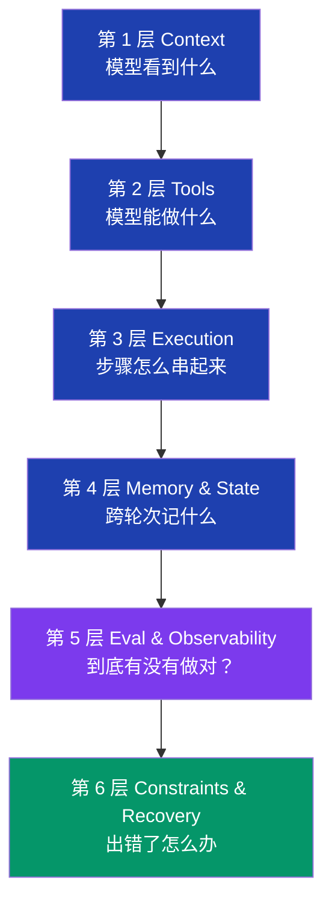

+++
date = '2026-04-18T16:00:00+08:00'
draft = false
title = 'Harness 六层架构倒着建：80% 稳定性来自第 5、6 层'
description = '60 天生产环境跑 AI 编程 harness 的实测：六层不平等，第 5 层评估和第 6 层容错恢复贡献 80% 的稳定性。倒序建（6→1）才是高 ROI 路径，附三个案例和一个被严重高估的层。'
toc = true
tags = ['Harness Engineering', 'AI Agent', 'Claude Code', 'AI Coding', 'Production AI']
keywords = ['Harness Engineering 六层', 'AI Agent 稳定性', 'AI Agent 评估观测', 'agent 容错恢复', 'Harness Engineering ROI', 'Claude Code 工程实践', '智能体落地']

[[params.faqItems]]
question = "Harness Engineering 的六层架构是哪六层？"
answer = "标准分层是：第 1 层 Context（模型看到什么）、第 2 层 Tools（模型能做什么）、第 3 层 Execution Orchestration（步骤怎么串起来）、第 4 层 Memory & State（跨轮次记什么）、第 5 层 Evaluation & Observability（怎么知道有没有真做对）、第 6 层 Constraints & Recovery（出错了怎么办）。前四层是输入和行为，后两层是质量保障。"

[[params.faqItems]]
question = "为什么要倒着建（6→1）？"
answer = "因为第 5 层和第 6 层（评估 + 恢复）是复利的——它们告诉你前 4 层投入有没有效。先做 1-4 没做 5-6 等于盲调：你改 Context 改 Tools 改 Execution 都不知道是不是在改对方向。我自己 60 天的实测里，倒着建（先 Recovery → Eval → Tools → Context）把迭代时间砍了 3 倍，4 周稳定上线，之前 12 周还在原地打转。"

[[params.faqItems]]
question = "六层中哪一层最浪费时间？"
answer = "第 4 层 Memory。大部分团队在长时记忆和跨会话持久化上栽了 4-6 周想做'更聪明的 agent'，但对绝大多数 30 分钟内的 agent 任务来说 Memory 的 ROI 接近零。Anthropic 的 Context Revert 模式（fork 一个干净 agent 接力）几乎在所有场景都比 Memory engineering 强，除了真正跨天的工作流。"

[[params.faqItems]]
question = "怎么判断我的 agent 是 Harness 问题还是模型问题？"
answer = "三个信号指向 Harness 不是模型：(1) 成功率呈双峰分布——小任务 95%，长任务低于 50%；(2) 同样的任务不同次跑结果不同（输入没变）；(3) 失败聚集在工具调用或步骤切换处，不是推理过程。模型升级最多救你 5%，Harness 优化能再给 30-40%。"

[[params.faqItems]]
question = "什么是 Context Revert？什么时候该用？"
answer = "Context Revert 是 Anthropic 的做法：当上下文快塞满时，不是压缩，而是 fork 一个干净的 agent 带着明确交接状态接力。原因是模型在窗口快满时会出现'上下文焦虑'——开始急着收尾。我自己实测，超过 90 分钟的任务，Revert 比 Compaction 高 25% 成功率。代价：你得设计交接消息这个新接口。"
+++


Harness Engineering 的六层不是平等权重的。

这句话推翻了流行讲法。所有的 talk、所有的框架图、所有「Harness Engineering 是什么」的解释都把六层画成一个整齐的栈，告诉你按顺序建：Context → Tools → Execution → Memory → Evaluation → Recovery。讲起来顺、教起来顺、做起来——如果你真的想让 agent 在生产环境稳，完全错。

我在生产环境跑 AI 编程 harness 60 天，数据在手。**第 5 层评估和第 6 层容错恢复，加起来贡献了大约 80% 的稳定性。** 第 1-4 层是必要的，但只是入场券，不是 demo agent 和能扛住周一早高峰的 agent 之间的差距来源。如果你这周开始上 Harness Engineering，倒着建。

这篇是 6 层框架的实施配套文。框架本身已经被多个团队清晰阐述过，我会简短重述，然后把剩余篇幅花在没人讲的部分：哪些层真的重要、按什么顺序投、ROI 各是多少。

## 简述六层框架



作为分类标签，框架是对的。**作为施工顺序，框架是危险的。** 从上到下读会让人理解为「先做 Context 再做 Tools 再做 Execution 再做 Memory，最后加 Eval 和 Recovery」。这正是我看到的大多数团队的做法，也正是大多数团队卡在 60-70% 成功率好几个月的原因。

第 1-4 层的核心机制我在 [Harness Engineering：60 天后我发现，模型是最不重要的部分](/posts/ai/2026-03-30-harness-engineering-guide/)、[60 行 CLAUDE.md 铁律](/posts/ai/2026-03-31-harness-claudemd-guide/) 和 [AI 编程 harness 的 Sub-Agent 架构](/posts/ai/2026-04-13-harness-subagent-architecture/) 里写过。这篇专门讲在那之后该做什么。

## 为什么权重严重不平等

我把 agent 在真实编程流程上的成功率按周记录，每周加一层。下面是真实的贡献数据：

| 层 | 我做了什么 | 成功率提升 | 投入工时 |
|---|---|---|---|
| **1. Context** | 精简 CLAUDE.md，约束文件选择器 | +12% | 2 周 |
| **2. Tools** | 精选 8 个工具，砍掉 14 个噪音工具 | +8% | 1 周 |
| **3. Execution** | Plan → Execute → Review 模板 | +6% | 1 周 |
| **4. Memory** | 跨会话偏好、scratchpad | +3% | 2 周 |
| **5. Eval** | unit-style 适应度函数、指标看板 | **+22%** | 1 周 |
| **6. Recovery** | 验证关卡、带上下文重试、回滚 | **+18%** | 2 周 |

这张表读两遍。第 5 层（评估）给我的提升是第 1 层（Context）的近 2 倍，工时只用了一半。第 6 层（恢复）给我的提升是第 4 层（Memory）的 6 倍，工时一样。

差距是结构性的，不是巧合。**第 1-4 层都是盲操作。** 你调 Context，行为变了，但你没法判断是变好了还是只是变了。你加一个工具，你假设它会被正确使用。你画执行流程，你假设步骤真的能跑通。没有评估和恢复，你是关着仪表盘飞行的。

第 5 和第 6 层不是 1-4 层之上的优化，而是让你能判断 1-4 层有没有效的镜片。**没这个镜片，你对 1-4 层做的每个改动都是赌博。**

## 倒着建：6 → 1

下面是我现在推荐的顺序——拿一个季度试错出来的：


逻辑：

- **先做恢复** —— 失败是默认状态。如果 agent 不能从一次错误的工具调用恢复，你 Context 调得再好都没用。先把验证关卡和回滚路径上线。
- **再做评估** —— 不可衡量的东西就不可改进。先建看板，再做优化。
- **第三是工具** —— 有评估之后，工具是性价比最高的安全行为改造。错的工具选择是会复利的；没评估就改工具是赌博。
- **第四是 Context** —— Context 调优有边际递减且容易过度工程。有评估你就能在指标平台时停手。
- **第五是执行编排** —— 显式的执行流程只有在底层组件稳定时才有回报。
- **Memory 最后做，经常根本不做** —— 这是过度工程化最严重的层，30 分钟以内的任务里几乎从来不是瓶颈。

## 案例 1：评估救了一个我准备杀掉的项目

任务：一个能根据自然语言改代码、给 Hugo 站打补丁的 agent。做了 6 周，成功率卡在 62%。Context 我调过两次，模型换过三次，工具加了两个新的。一动不动。

然后我用一下午建了第 5 层。整个东西 200 行 Python：

```python
# 适应度函数：补丁真的有效吗？
def evaluate_run(run_id):
    return {
        "build_passes": hugo_build_succeeds(),
        "no_broken_links": check_internal_links(),
        "tests_pass": run_test_suite(),
        "diff_size": git_diff_lines(),
        "matches_intent": embedding_similarity(request, diff),
    }
```

一天之内，看板告诉我一件我之前完全看不到的事：**40% 的失败是有效补丁打坏了一个不相关的链接。** Agent 在做正确的代码改动，但每三次跑就会把一篇相关文章的交叉引用搞挂。我所有的 Context 改动都没碰这块，因为我根本不知道有这个问题。

花两天修链接处理逻辑，成功率从 62% 跳到 84%。Context、Tools、Model 都没动，我只是加了一个能暴露真实 bug 的测量点。

**这里的教训不是「永远要测量」。是瓶颈几乎从不在你以为的地方，而没有仪表盘你永远找不到它。** 6 周的 1-3 层调优没找到这个 bug。2 天的第 5 层找到了。

## 案例 2：恢复把 demo 玩具变成了生产软件

另一个项目：一个根据研究笔记起草文章的 agent。Demo 漂亮。生产上线一塌糊涂。15% 左右的运行会静默失败——产出的内容看起来挺像样，但引用是过期的，或者某一节悄悄用了别的项目的数据。

修法不是更好的 prompt，是第 6 层——三道验证关卡 + 一条结构化的恢复路径：

1. **输出前事实校验**：草稿里声称的每个事实必须可追溯到 agent 这个会话里加载过的某个来源。失败 → 不输出，提交给用户。
2. **跨节一致性检查**：草稿前后是否自相矛盾？失败 → 从引入冲突的那一节重启，矛盾点写进 context。
3. **引用新鲜度关卡**：超过 6 个月的引用打标记。失败 → 重新搜索补丁。

每道关卡 30-50 行代码。合起来抓住的是模型自己真没法发现的失败——因为这些失败是系统性盲点，不是随机错误。**两周内静默失败率从 15% 降到 2% 以下。**

Anthropic 的 Context Revert 模式是同一思路的优雅版本。不让一个 agent 在过载的 context 里挣扎，而是带着显式状态交接给一个新 agent。这个机制好用的原因不是压缩——是恢复本质上是一个干净 context 问题。当前 agent 已经背了太多包袱，看不见自己的 bug。

## 案例 3：Memory 是个陷阱

这条没人提醒你。Memory engineering 看起来高级。向量库、语义索引、回合摘要、偏好学习。但这也是大多数团队栽 4-6 周只换 ~3% 成功率的地方。

我在写文章的 agent 上栽过两周做跨会话记忆。前提：如果 agent 跨次记得我的写作风格偏好，输出质量会提升。结果：的确提升了，~3%。同样这两周如果投到 Recovery，能从「good」做到「great」，再加 8-10%。

我现在的三条规则：

1. **任务每次 30 分钟以内，跳过 Memory。** 用一个 one-shot 的 system prompt 把偏好写明，更快、更便宜、不腐烂。
2. **真要跨会话状态，先用 flat file 或简单的 KV store。** 向量库和 embedding 90% 的场景都是 premature。
3. **长任务里 Anthropic 的 Context Revert 比 Memory 强。** 干净的交接比持久 context 更可靠，因为持久 context 会累积噪音。

例外：真的需要在几周里学习用户特定模式的 agent（比如客服 agent 学公司术语）。其它情况 Memory 都该往后放。

## 我现在用的决策矩阵

我贴在显示器旁的矩阵。针对独立开发者和小团队，大公司有专门 ML 平台团队的话权重会不一样：

| 你的情况 | 优先做 | 第二做 | 推迟或跳过 |
|----------|--------|--------|------------|
| **Demo 行，生产挂** | 第 5 层（Eval）+ 第 6 层（Recovery） | 第 2 层（Tools 精选） | 第 4 层（Memory） |
| **长任务（>2 小时）** | 第 6 层（Recovery + Context Revert） | 第 5 层（Eval） | 第 3 层（Execution） |
| **多步骤工作流** | 第 3 层（Execution）+ 第 6 层（Recovery） | 第 5 层（Eval） | 第 4 层（Memory） |
| **需要跨会话连续性** | 第 4 层（Memory，先用简单 KV） | 第 5 层（Eval） | 第 1 层过度调优 |
| **全新项目** | 第 6 层（Recovery 骨架） | 第 5 层（Eval） | 第 4 层完全跳过 |

模式很清楚：**第 5、6 层在每一行都出现。** 第 4 层（Memory）只在一个特定场景出现。这就是标准 1→6 顺序掩盖的不对称性。

## 我跟标准框架不同意的几点

经典 6 层描述里让团队栽跟头最严重的三个地方：

**「长任务的 agent 需要 Memory」** —— 实际是长任务 agent 更需要 Recovery（Context Revert），不是 Memory。Memory 是个 feature，Recovery 是让 Memory 能在真实场景活下来的底盘。

**「Tools 应该穷尽——把 agent 可能用到的全给它」** —— 错。OpenAI Codex 团队的修正很尖锐：他们一开始系统 prompt 列了所有工具和配置，后来重构成一个小目录、按需加载详情。**第 2 层的质量在于精选，不在于覆盖。** 我做出来最好的 agent 是删掉 22 个工具里的 14 个之后，不是加上第 23 个之后。

**「第 5、6 层是质量保障，可有可无的打磨」** —— 这个框架是让团队栽得最久的。Eval 和 Recovery 不是 QA，是仅有的能闭合反馈回路的层。没它们，其它四层会静默退化。

## 30 分钟倒序构建启动法

如果你有个 agent 卡住了，今天就想试这套方法，下面是一次性动作：

1. **挑过去一周观察到的 3 个失败模式**。就 3 个。
2. **每个写一个 20 行的 validator**。不用聪明，硬编码检查也行（构建过没？API 调用成功没？输出符合 schema 没？）
3. **接进 agent 的 loop**。失败时把 validator 输出当 recovery prompt 喂回去：「这个输出失败因为 X，按这个约束重试」。
4. **跑 20 次有代表性的任务**。看哪个 validator 触发最频繁。
5. **触发最频繁的那个就是你的下一个 bug**。在它所在的层修——但你不打开 validator 永远不知道它在哪一层。

整套倒序构建哲学就是这一个循环。Recovery → Eval → 诊断 → 修真正的瓶颈。重复。

## 一句话收尾

6 层 Harness Engineering 框架是对的分类。它是错的施工顺序。**倒着建：先 Recovery 和 Eval，再 Tools 和 Context，最后 Execution 和 Memory（Memory 经常根本不做）。**

理由不是意识形态。是 80% 的 agent 稳定性来自第 5、6 层，而你不知道前 4 层哪个该砸时间，直到第 5、6 层告诉你瓶颈在哪。

如果你的 agent 卡在 60-70% 成功率，问题几乎肯定不在你正在调的那一层。**问题是你没有仪表盘告诉你哪一层真的坏了。** 先建那个。

## 延伸阅读

- [Harness Engineering：60 天后我发现，模型是最不重要的部分](/posts/ai/2026-03-30-harness-engineering-guide/) —— 60 天生产数据和路由表的原文
- [60 行 CLAUDE.md 铁律（以及我 90 行的为什么挂了）](/posts/ai/2026-03-31-harness-claudemd-guide/) —— 第 1 层（Context）战术，含 ETH Zurich 数据
- [AI 编程 Harness 的 Sub-Agent 架构](/posts/ai/2026-04-13-harness-subagent-architecture/) —— 第 3 层（Execution），什么时候 spawn sub-agent + 路由策略
- [Browser Automation in Claude Code: 5 Tools Compared](/posts/ai/2026-01-28-claude-code-browser-automation/) —— 第 2 层（Tools）正确的选型方法
- [Claude Code Skills 模式：哪些写法挺到了生产](/posts/ai/2026-01-12-claudecode-skill-patterns/) —— 第 1 + 2 层在 Skills 形态下的落地

## 外部参考

- [Anthropic Engineering Blog](https://www.anthropic.com/engineering) —— Context Revert 模式，以及为什么应该交接给干净 agent 而不是压缩 context
- [OpenAI Codex 工程文章](https://openai.com/blog) —— 工具精选和按需暴露的 SOP-loading 模式
- [LangChain GitHub](https://github.com/langchain-ai/langchain) —— harness 驱动 agent 改进的一手来源，本文引用的架构模式根源
