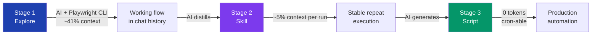
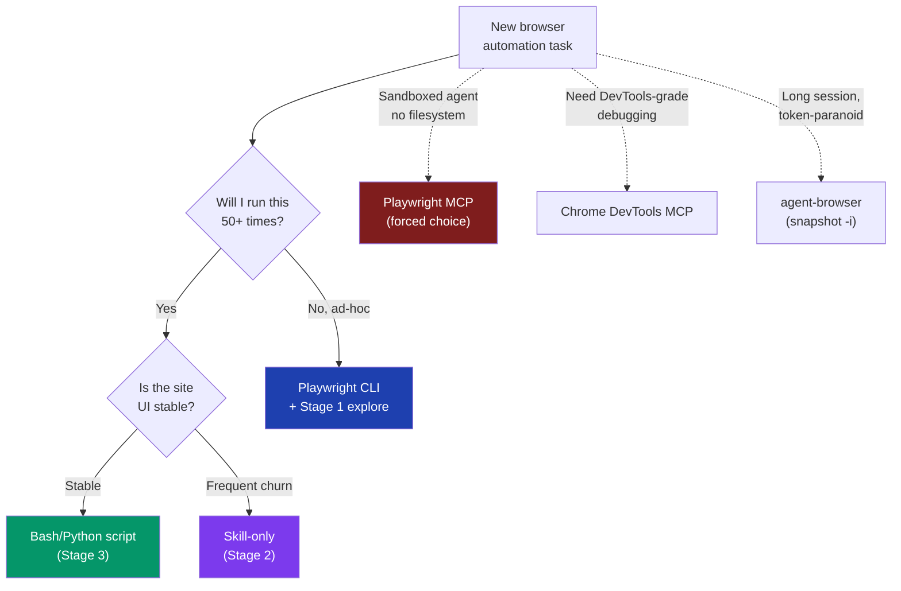

+++
date = '2026-04-18T10:00:00+08:00'
draft = false
title = 'Playwright CLI + Skills: 0-Token Browser Automation Pattern'
description = 'Browser automation costs collapse in 3 stages — explore with AI (41% context), freeze as a Skill (5%), ship as a script (0 tokens). Hands-on Playwright CLI vs MCP data, real cases.'
toc = true
tags = ['Playwright CLI', 'Browser Automation', 'Claude Code', 'Skills', 'AI Agent']
keywords = ['playwright cli skill', 'playwright cli vs mcp', 'zero token browser automation', 'claude code browser skill 2026', 'playwright cli skill tutorial', 'ai browser automation cost', 'browser automation skill pattern']

[[params.faqItems]]
question = "Why does Playwright CLI use 4x fewer tokens than Playwright MCP?"
answer = "MCP injects the entire accessibility tree, console logs and tool schema into the model context every step. CLI saves snapshots to disk and returns only file paths and refs (@e1, @e2). The model reads what it needs via grep instead of carrying everything in context. In Microsoft's own 10-step benchmark MCP burned ~114K tokens versus CLI's ~27K — a 4x reduction that compounds over long sessions."

[[params.faqItems]]
question = "What is the 3-stage pattern for browser automation with Skills?"
answer = "Stage 1: let the AI explore the task freely with Playwright CLI (typically 30-50% of context window). Stage 2: have the AI distill the working flow into a Skill (subsequent runs cost ~5% of context, a 10x reduction). Stage 3: once stable, freeze the Skill into a Bash or Python script (0 tokens — the AI is no longer in the loop). Each stage trades flexibility for cost."

[[params.faqItems]]
question = "When should I still use MCP instead of Playwright CLI?"
answer = "Three cases. (1) Sandboxed agents without filesystem write access — they cannot persist snapshots so they need MCP's in-context model. (2) When you need DevTools-grade debugging (network throttling, performance traces) — Chrome DevTools MCP is purpose-built for this. (3) When the agent must reason over the full DOM in a single call (rare, but happens for visual diff or layout work). Otherwise CLI wins on cost and stability."

[[params.faqItems]]
question = "How do I install Playwright CLI as a Claude Code Skill?"
answer = "Install Node.js 20+, then run npm install -g @playwright/cli followed by playwright-cli install --skills. The --skills flag drops a ready-made Skill into ~/.claude/skills/ that teaches Claude how to use the CLI verbs (open, snapshot, click, fill, screenshot). For Codex, rename the .claude folder to .codex and run /skills."

[[params.faqItems]]
question = "Will my browser automation get my account banned?"
answer = "Real risk on any site with anti-bot detection (Amazon, Cloudflare-protected sites, banking, social platforms). Use Playwright CLI's --persistent flag to reuse a real Chrome profile (cookies, fingerprint, history), add randomized delays between clicks, never run headless on hostile sites, and keep request rate under what a human could plausibly do. For high-stakes scraping switch to commercial proxy + fingerprint solutions — this pattern is for personal automation, not production scraping at scale."
+++


The cheapest AI browser automation in 2026 uses **zero AI calls**.

That sentence sounds wrong. We pay for AI agents precisely so we don't have to write scripts. But after running browser automation through Claude Code, Codex and a few other harnesses for the past few months, I've ended up with the opposite conclusion: **the AI is the most expensive part of the loop, and you should remove it as soon as the task stops changing.**

This is the pattern I've converged on — explore once with AI, freeze the working flow into a Skill (10x cheaper), then freeze the Skill into a script (zero tokens). It's not a tooling story, it's a cost-curve story. Below is the architecture, the data, three real cases, and the five pitfalls nobody warns you about.

## The 3-Stage Pattern: Explore → Skill → Script

Every browser automation I've shipped follows the same shape.



The cost curve is not linear. It's a step function:

| Stage | Per-run cost | When to stay here |
|-------|--------------|-------------------|
| **Explore** | 30-50% of context window | Task spec is still moving; you're learning the site |
| **Skill** | 3-7% of context | You'll repeat the task 5-50 times with small variations |
| **Script** | 0 tokens | Task is fully deterministic; you'll run it 50+ times or schedule it |

Most tutorials stop at Stage 1 and call it "AI automation." They're leaving an order of magnitude on the table. The real engineering decision is **how aggressively you push tasks down the cost curve.**

## Why MCP Is the Wrong Default in 2026

If you're still defaulting to `playwright-mcp` because that's what every Reddit post recommended in 2025, you're paying a tax. The 2026 numbers are brutal.

The clean comparison is on the same task — Microsoft published a 10-step benchmark in February. I re-ran it on my own machine and the gap held up:

| Tool | Tokens (10-step task) | Page snapshot cost | Failure mode |
|------|------------------------|---------------------|--------------|
| **Playwright MCP** | ~114,000 | Full a11y tree per step | Context overflow on long sessions |
| **DevTools MCP** | ~50,000 | DOM + network log inline | Same — context bloat |
| **Playwright CLI** | ~27,000 | Snapshot to disk, ref-based | Needs filesystem access |
| **agent-browser** | ~7,000 | `snapshot -i` returns only interactives | Chrome-only, fewer escape hatches |

A 4x gap between MCP and CLI on a small task becomes a 16x gap on a long session because MCP keeps re-injecting the page state every turn. I've watched a 2-hour MCP session blow through 800K tokens for what a CLI session did in 60K.

The mechanism is unglamorous. **CLI saves the snapshot to disk and returns a path. MCP stuffs the snapshot into your context.** That's it. Same browser, same Playwright underneath, completely different bill.

I covered the full 5-tool comparison in [Browser Automation in Claude Code: 5 Tools Compared](/posts/ai/2026-01-28-claude-code-browser-automation/) — this article is about what to do once you've picked CLI: how to compress further with Skills and Scripts.

## Stage 1 → Stage 2: The Skill Distillation Move

The single most underrated skill (pun intended) in AI automation is **knowing when to stop letting the AI think.**

Here's the move. After your first successful exploratory run, before you close the chat, you say:

> "Distill the working steps above into a reusable Skill in ~/.claude/skills/. Include the verbatim CLI commands that worked, the timing waits I needed to add, the selectors that turned out unstable, and the data parsing that ended up correct. Skip the false starts."

The AI writes a `SKILL.md` that looks like an ops runbook. Next time you run a similar task, it loads that runbook in <100 tokens and follows the proven path.

In my own measurements:

- **First exploration of "scrape product reviews to CSV":** 41% of a 200K context window
- **Second run with the Skill loaded:** 5% of context
- **Third run on a different product:** 6% (the Skill generalized)

That's not 10x because Anthropic optimized something. That's 10x because **the AI stopped re-discovering the same site quirks every time.**

The Skill quality matters more than the harness. A bad Skill is worse than no Skill — it sends the AI down a path that no longer works and you spend tokens debugging your own runbook. Two rules I follow:

1. **Always re-distill after the third successful run.** The first version always misses something. The third run, when the AI has hit two more edge cases, is when you should regenerate.
2. **Strip the explanations.** Skills should be commands and "if X then Y" rules, not prose. If the Skill reads like a blog post, the AI will treat it like one and ignore parts.

For the deeper skill-writing patterns I lean on, see [Claude Code Skills: Patterns That Survived Production](/posts/ai/2026-01-12-claudecode-skill-patterns/).

## Stage 2 → Stage 3: When to Drop AI Entirely

This is where most people stop. They've got a Skill, the runs are cheap, life is good. But if the task is truly deterministic — same site, same selectors, same output format — the AI is still doing work it doesn't need to do.

The Stage-3 prompt is shorter than you'd expect:

> "Convert this Skill into a standalone Bash script. Use raw `playwright-cli` commands. Hardcode the URLs and selectors. Add `sleep` calls where the Skill says to wait. Output the same CSV format. Make it cron-able."

You get back a 60-line shell script that does exactly what the Skill did, costs nothing per run, and survives Claude Code being down.

Three things make this stage controversial:

1. **You lose flexibility.** If the site's HTML changes, the script breaks silently. The Skill version would have noticed and adapted. **Mitigation:** add a one-line `playwright-cli snapshot --json | jq '.title'` sanity check at the top of the script. If it doesn't match the expected page, exit non-zero and let cron alert you.
2. **You lose introspection.** When something goes wrong, there's no AI to ask "what did you try?" **Mitigation:** log every command's exit code to a file. The next time it breaks, hand the log back to Claude with the script — it'll diagnose in one round.
3. **You miss new affordances.** The site might add a faster API; the Skill version would have noticed; the script never will. **Mitigation:** re-run the Stage-1 exploration once a quarter to see if the script's approach is still optimal.

These are real costs. But for a task you run daily, **paying $0 in tokens for a year and a half-day re-explore once a quarter beats paying $40/month forever.**

## Real Case 1: Scraping Product Reviews to CSV

The job: open a product page, click through paginated reviews, extract author/rating/date/text, write a clean CSV. I run this for two competitor-monitoring workflows.

**Stage 1 — first run, no Skill:**

```bash
# What the AI ended up doing after some flailing
playwright-cli open "https://example.com/product/123" --persistent --headed
playwright-cli snapshot -i  # found the "load more" button as @e47
playwright-cli click @e47
playwright-cli wait-for "Reviews loaded"  # added after 3 timeouts
# ... repeat until done ...
playwright-cli get-text @e51 --json > reviews-raw.json
```

Cost: 41% of a 200K context window. The AI burned tokens on three things — finding the right pagination selector (the obvious one was a fake button), figuring out the lazy-load timing, and parsing the date format (the site mixed two formats).

**Stage 2 — distilled Skill:**

```markdown
# Skill: scrape-product-reviews

Use Playwright CLI with --persistent. The real "load more" is the
second button matching role=button name=/more reviews/i, not the
first (the first is a fake CTA). Wait 1.2s after each click — the
site lazy-loads with a debounce. Dates come in two formats; parse
"X days ago" relative to today, parse "MMM DD, YYYY" absolute.
Output CSV with columns: author, rating, date_iso, text.
```

Second run on the same product: 5% of context. The AI loaded the Skill, executed the proven path, and wrote the CSV in one pass.

**Stage 3 — frozen script:**

After running Stage 2 four more times across different products, the variation across products turned out to be just the URL. So I had Claude convert it to a 70-line bash script. It runs nightly via cron. Token cost: zero. The script has been running for six weeks; it's broken once (the site changed the rating element from a `span` to a `div`), and the fix took 10 minutes via the log-and-replay pattern above.

## Real Case 2: Auto-Publishing Markdown to Social

The job: take a Markdown blog post, publish it to a social platform that has a quirky rich-text editor. The trap: the editor mangles direct Markdown paste, and pasting HTML leaves image placeholders that need to be manually replaced with uploaded files.

**Why this case is interesting:** it's the first one where Stage 3 *cannot* be a single script. The image upload step inherently needs file paths that change per article. The right freeze point is a hybrid — Python preprocessor + Skill-driven Playwright CLI for the upload dance.

**Stage 1 → Stage 2 distillation produced a Skill that does this:**

1. Run a Python preprocessor that downloads remote images locally, converts the Markdown to HTML via Pandoc, and ensures every image is in its own paragraph.
2. Use Playwright CLI to open the editor, paste the HTML, then for each image placeholder: click it, click upload, select the matching local file by index.
3. Verify the post preview renders correctly before publishing.

Stage 2 runs at ~7% context per article. I tried Stage 3 — pure script — and it broke too often because the editor's element refs aren't stable across page reloads. **Lesson: sites with frequent UI churn deserve to stay at Stage 2.** The cost of a Stage-3 break (silent failure) is worse than the 7% per run.

This is the case where the 3-stage pattern shows its real value. **The pattern is not "always go to Stage 3." It's "know which stage the task belongs in."**

## Real Case 3: Web App Regression Testing on a Cron

The job: every night, run a smoke test against my own web app — sign up, create a thing, edit it, delete it, log out. Catch regressions before users do.

Here the AI does double duty. **It writes the tests by reading the code.** The prompt:

> "Read the routes in src/routes/. For each user-facing flow, write a Playwright CLI command sequence that simulates a real user. Output a Markdown test plan with one section per flow. Include negative cases (invalid email, oversized upload)."

The AI generates a test plan that's essentially Stage 2 — a Skill that *describes* what to do, not yet a script. Then a separate prompt converts it to Stage 3:

> "Turn this test plan into a single Bash script that runs each flow sequentially. Exit non-zero on any failure. Capture screenshots on failure. Output a JSON summary."

Cron runs the script nightly. If it exits non-zero, I get a notification with the screenshots and the summary. The AI is not in the runtime loop — it's only invoked when I update routes (regenerate tests) or when a test fails (diagnose from logs + screenshot).

Cost over six weeks: $0 in token spend on test execution. ~$3 total in occasional regenerations and diagnoses.

If you want to combine this with scheduled triggers, [OpenClaw's cron-style agent runner](/posts/ai/2026-01-31-openclaw-claude-code-workflow/) is the cleanest option — it'll run your script and pipe failures back to an AI for one-shot diagnosis.

## Tool Selection: The Decision Matrix I Actually Use

Three tools cover 95% of cases. The rest is noise. Here's the matrix I keep on a sticky note:



Quick guidance:

- **Default for anything new: Playwright CLI.** Cheapest, most flexible, easiest to push down to a script later.
- **Long sessions where every token counts: agent-browser.** The `snapshot -i` flag returns only interactive elements (200-400 tokens vs 13K for full snapshot). I covered the architecture in [Vercel Agent Browser](/posts/ai/2026-01-13-vercel-agent-browser/).
- **You have no shell access (sandboxed agent, web-based assistant): MCP is your only path.** Don't fight it.
- **Debugging a perf or network issue: Chrome DevTools MCP.** The CLI tools don't expose request waterfalls or memory snapshots properly.

What I no longer recommend:

- **Browser-use as a default.** Great for one-shots, but its fixed Python dependency stack and "always loaded" agent loop fight the Stage-3 pattern.
- **Custom Puppeteer scripts.** Outside niche cases (specific Chrome extensions, BiDi protocol features), Playwright is strictly better in 2026.

## 5 Pitfalls No Tutorial Warns You About

The tutorials make this look frictionless. It isn't. After shipping a dozen of these, here are the five things that have bitten me hardest.

### 1. The Anti-Bot Wall (will eventually ban you)

Every site over a certain size runs bot detection. Cloudflare, Datadome, PerimeterX. Headless Chromium gets flagged immediately. Even headed Chrome gets flagged if you don't reuse a real profile.

**Mitigations that actually work:**

- Always run with `--persistent` against a real Chrome profile. The cookies, history, fingerprint, and extension state make you look human.
- Add `sleep` between clicks (humans take 0.5-3s, not 50ms).
- Never run more than ~30 actions/minute against a single domain.
- For anything serious, switch to a residential proxy + commercial fingerprinting library. This pattern is for personal automation, not industrial scraping.

I had a script silently shadow-banned for two weeks before I noticed the extracted data was missing fields. That's the failure mode — sites don't block you, they just feed you garbage.

### 2. Skill Quality Compounds Linearly, Then Collapses

A first-draft Skill is wrong about something. The AI follows it, hits the wrong thing, takes a corrective action, and you think the Skill works. It "works" in the sense that the task completes — but every run now carries the cost of the corrective action.

The pattern: **Skill quality erodes silently.** You won't notice until the per-run cost creeps from 5% to 15% over a few weeks. The fix is the re-distill rule — every third successful run, regenerate the Skill from the latest chat history.

### 3. Login State Drifts Faster Than You Think

`--persistent` keeps you logged in until the site rotates session cookies. For most consumer sites that's 7-30 days. The script will then run silently, hit a login wall, and produce empty output.

**Add a sentinel.** First command in every script: navigate to a protected URL and check that a known logged-in element exists. If not, exit non-zero with a message that says "re-auth needed." Five extra lines, prevents weeks of silently broken jobs.

### 4. Parallelism Will Bite You

The temptation: run 10 of these in parallel to scrape 10 products at once. The reality: Playwright CLI's daemon doesn't isolate sessions cleanly across parallel invocations. Cookies bleed, downloads collide, and you get a mess that's hard to debug.

If you need parallelism, spawn N separate `--persistent` profiles in N separate working directories, each with its own daemon. agent-browser handles this slightly better but still not great. **Sequential is the safe default.**

### 5. Timeouts Are Where Scripts Die

The Stage-3 script will work 50 times, then fail because a page took 6 seconds to load instead of 4. Hard timeouts are brittle.

Use the `wait-for` pattern with a generous ceiling and a check for a known post-load element, not a fixed sleep. The Skill should bake this in; if it doesn't, that's a sign your Skill is too thin and you should re-distill.

## How to Start Tomorrow

If you're convinced and want to try this on a real task today, here's the 30-minute starting move.

1. **Pick a task you do weekly that involves a browser.** Scraping a dashboard, posting to a forum, exporting a report. Anything you've ever copy-pasted.
2. **Install Playwright CLI:** `npm i -g @playwright/cli && playwright-cli install --skills`. The `--skills` flag drops a working Skill into Claude Code immediately.
3. **Run the task as Stage 1:** open a Claude Code session, describe what you want, let it use the CLI. Keep the chat open when it works.
4. **Distill before closing:** "Save this flow as a Skill in ~/.claude/skills/." That single instruction saves you 10x next week.
5. **After the third successful Stage-2 run**, decide: stable enough for Stage 3, or stay at Stage 2? The matrix above tells you.

Don't try to design Stage 3 upfront. The whole point of the pattern is **you don't know what's stable until you've run it a few times.** Let the cost curve drive the decision.

## Bottom Line

The mental model that's served me best in 2026: **AI is a discovery tool, not a runtime.** Every time you finish discovering, freeze.

Playwright CLI is the right primitive because it's snapshot-to-disk by default, which makes Stage 1 cheap enough to be willing to run, and makes Stage 3 trivial to extract because the commands are just shell. Skills are the right intermediate format because they're the ops-runbook level of detail — granular enough to replay, coarse enough to survive small site changes.

If you take one thing from this article: **stop letting AI re-explore solved problems.** The 10x is sitting there, waiting for the prompt "distill this into a Skill."

## Related Reading

- [Browser Automation in Claude Code: 5 Tools Compared](/posts/ai/2026-01-28-claude-code-browser-automation/) — full token benchmarks across MCP, CLI, agent-browser, browser-use, DevTools MCP
- [Vercel Agent Browser: AI-Native Browser Automation CLI](/posts/ai/2026-01-13-vercel-agent-browser/) — when to prefer agent-browser over Playwright CLI
- [Claude Code Skills: Patterns That Survived Production](/posts/ai/2026-01-12-claudecode-skill-patterns/) — how to write Skills that don't decay
- [Claude Code + Skills + Subagent: A Working Architecture](/posts/ai/2025-12-26-claudecode-skillsubagent/) — composing Skills with subagent isolation
- [OpenClaw + Claude Code Workflow](/posts/ai/2026-01-31-openclaw-claude-code-workflow/) — pairing scheduled triggers with the 3-stage pattern

## External References

- [Playwright CLI documentation](https://playwright.dev/) — Microsoft's official docs for the 2026 CLI release
- [Vercel agent-browser on GitHub](https://github.com/vercel-labs/agent-browser) — Rust-based daemon architecture
- [Better Stack: Playwright CLI vs MCP benchmark](https://betterstack.com/community/guides/ai/playwright-cli-vs-mcp-browser/) — independent token consumption analysis
- [TestDino: Playwright CLI and MCP integration with AI agents](https://testdino.com/blog/playwright-cli-vs-mcp/) — practical setup guide

## Series Navigation

This is Part 4 of the **Browser Automation for AI Agents** series — the arc from headless drivers, to attaching to your real browser, to cutting the token bill, to sharing your logged-in session:

1. [Vercel Agent Browser](/posts/ai/2026-01-13-vercel-agent-browser/) — a snapshot-driven CLI built for agents, not test suites
2. [Browser Automation in Claude Code: 5 Tools Compared](/posts/ai/2026-01-28-claude-code-browser-automation/) — the field map: token cost, speed, stability
3. [Chrome DevTools MCP Setup 2026](/posts/ai/2026-03-17-chrome-devtools-mcp-guide/) — attaching to your real browser, and the port 9222 traps
4. **This article**: Playwright CLI + Skills: 0-Token Automation — the pattern that removes the MCP token tax
5. [Claude Code Screenshot MCP Setup](/posts/ai/2026-07-21-claude-code-screenshot-mcp-frontend-debugging/) — the frontend debugging loop, 10,220 vs 65 tokens
6. [ubrowser Review](/posts/ai/2026-07-27-ubrowser-review/) — the right design trapped in an abandoned repo
7. ego lite Review: Your Logged-In Browser, Handed to Claude Code (coming next) — handing agents your logged-in session through Spaces
