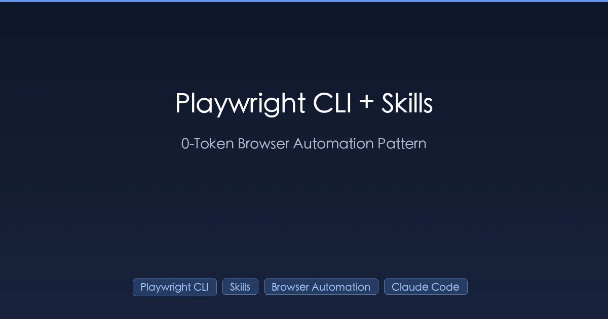
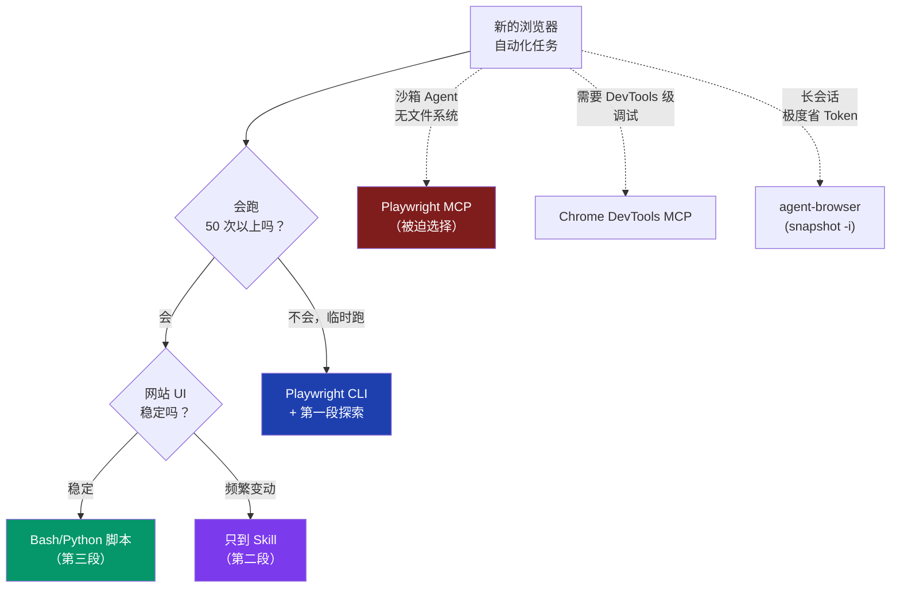

+++
date = '2026-04-18T10:00:00+08:00'
draft = false
title = 'Playwright CLI + Skill 三段式：把 AI 浏览器自动化做到 0 Token'
description = '浏览器自动化的成本要分三段降——AI 探索（消耗 41% 上下文）、提炼成 Skill（5%）、固化成脚本（0 Token）。Playwright CLI vs MCP 4 倍 Token 差实测，3 个真实案例和 5 个没人告诉你的坑。'
toc = true
tags = ['Playwright CLI', 'Browser Automation', 'Claude Code', 'Skills', 'AI Agent']
keywords = ['Playwright CLI Skill', 'Playwright CLI 教程', 'Playwright CLI vs MCP', 'AI 浏览器自动化', 'Claude Code 浏览器自动化', '0 Token 自动化', 'Skill 三段式']

[[params.faqItems]]
question = "Playwright CLI 为什么比 Playwright MCP 省 4 倍 Token？"
answer = "MCP 每一步都把完整的可访问性树、控制台日志、工具 schema 全部塞进上下文。CLI 把 snapshot 写到磁盘，只返回文件路径和 ref（@e1、@e2），AI 用 grep 按需读取。微软官方 10 步任务基准测试中，MCP 烧了约 11.4 万 Token，CLI 只用了约 2.7 万——4 倍差距，长会话里会进一步放大到 10 倍以上。"

[[params.faqItems]]
question = "Skill 三段式具体怎么操作？"
answer = "第一段：让 AI 配合 Playwright CLI 自由探索任务（一般会消耗 30-50% 上下文）。第二段：让 AI 把走通的流程提炼成 Skill 文件（再次执行只要 5% 上下文，10 倍效率提升）。第三段：流程稳定后，把 Skill 固化成 Bash/Python 脚本（0 Token，AI 完全退出循环）。每段都用灵活性换成本。"

[[params.faqItems]]
question = "什么场景下还要继续用 MCP？"
answer = "三种场景。一是沙箱里的 Agent 没有文件系统写权限——存不了 snapshot 只能用 MCP。二是需要 DevTools 级别的调试（网络节流、性能 trace）——Chrome DevTools MCP 是为这个设计的。三是需要在单次调用里基于完整 DOM 推理（少见，视觉对比或布局类任务偶尔需要）。其它情况 CLI 在成本和稳定性上都更好。"

[[params.faqItems]]
question = "Playwright CLI 怎么作为 Skill 装到 Claude Code？"
answer = "先装 Node.js 20+，然后 npm install -g @playwright/cli，最后跑 playwright-cli install --skills。--skills 参数会把现成的 Skill 装到 ~/.claude/skills/，让 Claude 知道怎么用 CLI 命令（open、snapshot、click、fill、screenshot 等）。Codex 用户把 .claude 文件夹改名成 .codex，然后输入 /skills 配置即可。"

[[params.faqItems]]
question = "用浏览器自动化会被网站封号吗？"
answer = "在有反爬的网站上风险很大（亚马逊、Cloudflare 防护站点、银行、社交平台都会检测）。一定要带 --persistent 复用真实 Chrome 配置（cookie、指纹、历史都在）、点击之间加随机延时、坏脾气的网站上不要 headless 跑、请求频率压在人类能做到的范围内。商业级抓取必须配代理池 + 指纹混淆方案——本文这套方法是给个人自动化用的，不是工业级爬虫。"
+++



2026 年最省 Token 的 AI 浏览器自动化方案是 **0 次 AI 调用**。

这句话听起来有点反常识。我们花钱买 AI Agent 不就是为了不用自己写脚本吗？但过去几个月我把浏览器自动化跑遍了 Claude Code、Codex 和几个其它 harness，反复实测之后，结论恰恰相反：**AI 是整个循环里最贵的部分，任务一旦稳定下来，就该把 AI 从循环里拿掉。**

这是我现在收敛下来的范式——AI 探索一次、把走通的流程提炼成 Skill（成本降 10 倍）、再把 Skill 固化成脚本（0 Token）。它不是「教你用某个工具」的故事，是「成本曲线怎么走」的故事。下面是架构、数据、3 个真实案例和 5 个没人提前告诉你的坑。

## 三段式：探索 → Skill → 脚本

我做过的每一个浏览器自动化任务，最后都收敛成同一个形状。


成本曲线不是线性的，是阶梯式的：

| 阶段 | 单次成本 | 什么时候停在这一段 |
|------|---------|-------------------|
| **探索** | 30-50% 上下文窗口 | 任务边界还在变；你正在摸熟这个网站 |
| **Skill** | 3-7% 上下文 | 任务会跑 5-50 次，每次有些小变化 |
| **脚本** | 0 Token | 任务完全确定；要跑 50 次以上或者要上定时任务 |

大部分教程止步于第一段就管它叫「AI 自动化」，等于把一个数量级的省钱机会扔在桌上。**真正的工程决策是：你愿意把任务在这条成本曲线上推多远？**

## 为什么 2026 年默认上 MCP 是错的

如果你现在还默认装 `playwright-mcp`——因为 2025 年的所有 Reddit 帖子都这么推荐——你正在交一笔智商税。2026 年的数据很残酷。

干净的对比是同一个任务跑两遍，微软 2026 年 2 月发了个 10 步基准测试，我自己机器上重跑了一遍，差距确认存在：

| 工具 | 10 步任务 Token | 单次页面快照成本 | 失败模式 |
|------|----------------|-----------------|---------|
| **Playwright MCP** | ~114,000 | 完整可访问性树 / 步 | 长会话上下文溢出 |
| **DevTools MCP** | ~50,000 | DOM + 网络日志内联 | 同上，上下文膨胀 |
| **Playwright CLI** | ~27,000 | snapshot 写盘，ref 引用 | 需要文件系统访问 |
| **agent-browser** | ~7,000 | `snapshot -i` 只返回交互元素 | 只支持 Chrome，逃生口少 |

小任务上 4 倍差距，长会话上会拉到 16 倍——因为 MCP 每一轮都重新塞一次页面状态。我亲眼看过一个 2 小时的 MCP 会话烧掉 80 万 Token，同样的事 CLI 会话 6 万搞定。

机制其实不性感：**CLI 把 snapshot 存到磁盘返回路径；MCP 把 snapshot 塞进你的上下文。** 就这点差别。同一个浏览器，下面也都是 Playwright，账单天差地别。

5 个工具的完整对比我在 [Browser Automation in Claude Code: 5 Tools Compared](/zh/posts/ai/2026-01-28-claude-code-browser-automation/) 里写过——这篇要讲的是选好 CLI 之后，**怎么用 Skill 和脚本进一步压缩成本**。

## 第一段 → 第二段：Skill 提炼这一手是分水岭

AI 自动化里被严重低估的一项「技能」（双关）是：**知道什么时候让 AI 停止思考。**

具体动作是这样的。第一次探索性运行成功后，关掉对话之前，你说：

> 「把上面走通的步骤提炼成可复用的 Skill，存到 ~/.claude/skills/。包括跑通的 CLI 命令原文、我让你加的等待延时、最后稳定的选择器、最终正确的数据解析。把走错的弯路扔掉。」

AI 会写出一份长得像运维 runbook 的 SKILL.md。下次遇到类似任务时，<100 Token 加载它，然后按已经验证过的路径执行。

我自己实测的数据：

- **第一次探索「抓取商品评论到 CSV」**：消耗 200K 上下文窗口的 41%
- **第二次带 Skill 跑同一个任务**：5% 上下文
- **第三次跑不同商品**：6%（Skill 成功泛化了）

10 倍效率提升不是 Anthropic 优化了什么模型，是**因为 AI 不再每次都重新踩同样的网站坑了。**

Skill 质量比 harness 重要得多。烂 Skill 比没 Skill 还糟——它会把 AI 带到一条已经不通的路上，你还得花 Token 调试自己的 runbook。我有两条铁律：

1. **第三次成功执行后必须重新蒸馏。** 第一版 Skill 一定漏了点东西。第三次跑完，AI 又踩了两个新边界，那时再生成才稳。
2. **删掉解释文字。** Skill 应该是命令 + 「if X then Y」规则的集合，不是散文。Skill 写得像博客，AI 就会当博客对待——选择性忽略某些段落。

更深的 Skill 写作模式我在 [Claude Code Skills 模式：哪些写法挺到了生产](/zh/posts/ai/2026-01-12-claudecode-skill-patterns/) 里写过。

## 第二段 → 第三段：什么时候彻底踢掉 AI

大部分人停在第二段——有 Skill 了，每次跑很便宜，挺好。但如果任务真的确定（同一个网站、同一组选择器、同一种输出格式），AI 还在做它根本不需要做的事。

第三段的 prompt 短得出乎意料：

> 「把这个 Skill 转成独立的 Bash 脚本。直接用 playwright-cli 命令。URL 和选择器都硬编码进去。Skill 说要等待的地方加 sleep。输出同样的 CSV 格式。让它能上 cron。」

返回一个 60 行的 shell 脚本，做的事和 Skill 一模一样，单次跑 0 Token，Claude Code 挂了也能用。

第三段有三个会让人犹豫的代价：

1. **失去灵活性。** 网站 HTML 一改，脚本就静默失败；Skill 版本本来会发现并自适应。**对策**：脚本顶部加一行 `playwright-cli snapshot --json | jq '.title'` 做 sanity check，对不上预期就 exit 非零，让 cron 通知你。
2. **失去可解释性。** 出问题时没有 AI 可以问「你刚才试了什么？」**对策**：每条命令的退出码都打到日志文件。下次坏了，把日志和脚本一起扔给 Claude，一轮就能诊断。
3. **错过新机会。** 网站可能加了更快的 API；Skill 版本会发现；脚本永远不会。**对策**：每个季度重跑一次第一段探索，看看脚本的方法是不是还最优。

这些代价是真实的。但对一个每天都要跑的任务，**一年付 0 Token + 每季度花半天重新探索一次，比每月付 ¥300 的 API 账单一辈子要划算多了。**

## 实战案例 1：抓商品评论存 CSV

任务：打开商品页、翻页加载评论、抽取「作者 / 评分 / 日期 / 正文」、写一份干净的 CSV。我用这个跑两套竞品监控工作流。

**第一段——首次跑，没有 Skill：**

```bash
# AI 折腾几次后最终走通的命令序列
playwright-cli open "https://example.com/product/123" --persistent --headed
playwright-cli snapshot -i  # 找到「加载更多」按钮是 @e47
playwright-cli click @e47
playwright-cli wait-for "Reviews loaded"  # 三次 timeout 后才加上
# ... 重复直到加载完 ...
playwright-cli get-text @e51 --json > reviews-raw.json
```

成本：200K 上下文的 41%。AI 把 Token 烧在三件事上——找对真正的翻页按钮（最显眼那个是个假按钮）、摸清楚懒加载的时序、解析两种混在一起的日期格式。

**第二段——蒸馏后的 Skill：**

```markdown
# Skill: scrape-product-reviews

用 Playwright CLI 加 --persistent。真正的「加载更多」按钮是
role=button name=/more reviews/i 匹配里的第二个，不是第一个
（第一个是个假的 CTA）。每次点击后等 1.2 秒——这个网站懒加载
带 debounce。日期有两种格式：相对时间「X days ago」按今天倒推，
绝对时间「MMM DD, YYYY」直接解析。CSV 列：author, rating,
date_iso, text。
```

第二次跑同一个商品：5% 上下文。AI 加载 Skill、按已验证路径执行、一次性写完 CSV。

**第三段——固化脚本：**

第二段在不同商品上跑了 4 次后，发现差异其实只是 URL。让 Claude 转成 70 行 bash 脚本，每晚 cron 跑一次。Token 成本：0。脚本上线 6 周，只坏过一次（网站把评分元素从 `span` 改成 `div`），按上面的「日志-回放」模式 10 分钟修好。

## 实战案例 2：自动发文到社交平台

任务：把一篇 Markdown 博客发到一个有怪癖的富文本编辑器。坑：编辑器会把直接粘贴的 Markdown 搞乱，粘 HTML 会留下图片占位符要手动替换成上传的图。

**这个案例有意思的地方：**它是第一个**第三段不能是单一脚本**的案例。图片上传步骤本质上需要每篇文章变化的文件路径。正确的固化点是混合的——Python 预处理 + Skill 驱动的 Playwright CLI 完成上传部分。

**第一段 → 第二段蒸馏出的 Skill 做这些事：**

1. 跑 Python 预处理脚本，把远程图片下到本地、用 Pandoc 把 Markdown 转成 HTML、确保每张图独占一段。
2. 用 Playwright CLI 打开编辑器、粘 HTML、对每个图片占位符：点它、点上传、按序号选对应的本地文件。
3. 发布前先看预览，确认渲染正确。

第二段每篇文章 ~7% 上下文。我试过第三段——纯脚本——崩得太频繁，因为编辑器的元素 ref 在页面重载之间不稳定。**经验：UI 变动频繁的网站，就该停在第二段。** 第三段坏掉的代价（静默失败）比每次 7% 更糟。

这是三段式范式真正显示价值的案例。**这个范式不是「永远推到第三段」，是「知道每个任务该停在哪一段」。**

## 实战案例 3：Web App 回归测试上 cron

任务：每晚跑一遍我自己 Web App 的冒烟测试——注册、创建一个东西、编辑、删除、登出。在用户发现之前找到回归。

这里 AI 兼两职。**它通过读代码自己写测试。** Prompt：

> 「读 src/routes/ 下的路由。每个面向用户的流程，写一段 Playwright CLI 命令序列模拟真实用户。输出一份 Markdown 测试方案，每个流程一节。包含负面用例（无效邮箱、超大上传）。」

AI 生成的测试方案本质上就是第二段——一份描述「做什么」的 Skill，还不是脚本。然后另一个 prompt 转第三段：

> 「把这份测试方案转成单一 bash 脚本，按顺序跑每个流程。任意失败就 exit 非零。失败时截图。输出 JSON 摘要。」

cron 每晚跑这个脚本。exit 非零就发通知，附上截图和摘要。AI 不在运行时循环里——只有我改路由（重新生成测试）或者测试挂了（看日志和截图诊断）的时候才会被调起来。

6 周下来，测试执行的 Token 花费：0。偶尔的重新生成和诊断总共 ~¥20。

如果想配上定时触发器，[OpenClaw 的 cron 风格 Agent runner](/zh/posts/ai/2026-01-31-openclaw-claude-code-workflow/) 是最干净的方案——它会跑你的脚本，失败时把上下文喂给 AI 一次性诊断。

## 我实际在用的工具决策矩阵

3 个工具覆盖 95% 的场景，剩下都是噪音。下面是我贴在显示器旁的便签：



简明指引：

- **新任务默认上 Playwright CLI。** 最便宜、最灵活、最容易后续推到脚本。
- **长会话每个 Token 都要省：agent-browser。** `snapshot -i` 只返回交互元素（200-400 Token，相比完整快照 13K）。架构细节我在 [Vercel Agent Browser](/zh/posts/ai/2026-01-13-vercel-agent-browser/) 写过。
- **没有 shell 访问（沙箱 Agent、网页助手）：MCP 是唯一选项。** 别硬刚。
- **调试性能或网络问题：Chrome DevTools MCP。** CLI 工具暴露不出请求瀑布图和内存快照。

我不再推荐的：

- **Browser-use 当默认。** 一次性任务不错，但它固定的 Python 依赖栈和「常驻 Agent loop」和第三段范式打架。
- **自定义 Puppeteer 脚本。** 除了少数场景（特定 Chrome 扩展、BiDi 协议特性），2026 年 Playwright 在所有维度都更好。

## 5 个教程不会告诉你的坑

教程让这看起来很丝滑。其实不是。出过十几个之后，下面 5 个是咬我最狠的。

### 1. 反爬墙（迟早会被封）

体量过线的网站都跑机器人检测：Cloudflare、Datadome、PerimeterX。Headless Chromium 一上来就被标记。Headed Chrome 不复用真实 profile 也会被标记。

**真正有效的对策：**

- 一定带 `--persistent` 用真实 Chrome profile。Cookie、历史、指纹、扩展状态都在，看起来才像人。
- 点击之间加 sleep（人类是 0.5-3 秒，不是 50 毫秒）。
- 单一域名上不要超过 ~30 操作 / 分钟。
- 严肃的抓取直接上住宅代理 + 商业指纹方案。本文这套是个人自动化用的，不是工业级抓取。

我有个脚本被静默 shadow ban 了两周才发现——抽出来的数据缺字段。**反爬的失败模式不是封你，是给你喂垃圾数据。**

### 2. Skill 质量是线性侵蚀，然后断崖

第一版 Skill 总会有个地方写错。AI 按它执行、点错地方、做了个补救动作、你以为 Skill 工作了。它确实「工作」了——任务完成了——但每次跑都带着补救动作的成本。

模式是：**Skill 质量是静默侵蚀的。** 你不会注意到，直到几周后单次成本从 5% 偷偷涨到 15%。对策就是上面说的「第三次成功后重蒸馏」铁律。

### 3. 登录态比你想的崩得快

`--persistent` 能保持登录，直到网站轮换 session cookie。大多数 C 端网站是 7-30 天。脚本会静默运行、撞到登录墙、产出空数据。

**加个哨兵。** 每个脚本第一条命令：访问一个需要登录的 URL，检查已知的「登录后才有」的元素是否存在。不存在就 exit 非零，提示「需要重新登录」。多写 5 行，避免几周静默坏掉的任务。

### 4. 并行会反咬你

诱惑：开 10 个并发抓 10 个商品。现实：Playwright CLI 的 daemon 在并行调用之间隔离不干净。Cookie 串、下载相互覆盖、调试地狱。

要并行就开 N 个独立 `--persistent` profile，分别在 N 个工作目录里、各自带 daemon。agent-browser 处理稍微好点但也不完美。**默认串行才是安全做法。**

### 5. 超时是脚本的死亡之地

第三段的脚本会跑 50 次没问题，第 51 次因为页面加载花了 6 秒而不是 4 秒就挂了。硬超时太脆。

用 `wait-for` 模式 + 宽容上限 + 检查已知的「加载完成」元素，不要用固定 sleep。Skill 应该把这个写进去；如果没有，说明你的 Skill 写得太薄，要重蒸馏。

## 明天就开始的 30 分钟动作

如果你被说服了，想今天就在真实任务上试一下，下面是 30 分钟启动动作。

1. **挑一个你每周都做的、涉及浏览器的任务。** 抓个 dashboard、发个论坛帖、导出个报表。任何你曾经手动复制粘贴过的事。
2. **装 Playwright CLI**：`npm i -g @playwright/cli && playwright-cli install --skills`。`--skills` 参数会立刻把可用 Skill 装进 Claude Code。
3. **当作第一段跑一遍**：开 Claude Code 会话、描述要做什么、让它用 CLI。跑通时不要关对话。
4. **关闭前蒸馏**：「把这个流程存为 ~/.claude/skills/ 下的一个 Skill。」就这一句话，下周帮你省 10 倍。
5. **第二段成功跑 3 次后**，决定：稳定到能上第三段，还是停在第二段？上面的矩阵告诉你。

不要预先设计第三段。这个范式的精髓就是**任务跑过几次之前你不知道哪些东西稳定。** 让成本曲线驱动决策。

## 一句话收尾

2026 年我自己用得最顺的心智模型：**AI 是发现工具，不是运行时。** 每次完成发现，立刻冻结。

Playwright CLI 是合适的原语，因为它默认就是「snapshot 写盘」——让第一段便宜到你愿意跑，让第三段提取轻松到只是 shell 命令。Skill 是合适的中间格式，因为它是运维 runbook 的颗粒度——细到能回放、粗到能扛住网站小变化。

如果这篇文章只能带走一句话：**不要让 AI 反复探索已经解决的问题。** 10 倍效率提升就摆在那里，等你说一句「把这个蒸馏成 Skill」。

## 相关阅读

- [Browser Automation in Claude Code: 5 Tools Compared](/zh/posts/ai/2026-01-28-claude-code-browser-automation/) — MCP / CLI / agent-browser / browser-use / DevTools MCP 五工具完整 Token 基准
- [Vercel Agent Browser：AI 原生浏览器自动化 CLI](/zh/posts/ai/2026-01-13-vercel-agent-browser/) — 什么时候应该选 agent-browser 而不是 Playwright CLI
- [Claude Code Skills 模式：哪些写法挺到了生产](/zh/posts/ai/2026-01-12-claudecode-skill-patterns/) — 怎么写不会侵蚀的 Skill
- [Claude Code + Skills + Subagent：可工作的架构](/posts/ai/2025-12-26-claudecode-skillsubagent/) — Skill 和 Subagent 隔离怎么组合
- [OpenClaw + Claude Code 工作流](/zh/posts/ai/2026-01-31-openclaw-claude-code-workflow/) — 三段式怎么配上定时触发器

## 外部参考

- [Playwright CLI 官方文档](https://playwright.dev/) — 微软 2026 CLI 版本官方文档
- [Vercel agent-browser GitHub](https://github.com/vercel-labs/agent-browser) — 基于 Rust 的 daemon 架构
- [Better Stack：Playwright CLI vs MCP 基准测试](https://betterstack.com/community/guides/ai/playwright-cli-vs-mcp-browser/) — 独立第三方 Token 消耗分析
- [TestDino：Playwright CLI 和 MCP 与 AI Agent 集成](https://testdino.com/blog/playwright-cli-vs-mcp/) — 实战配置指南

## 系列文章导航

这是「AI Agent 浏览器自动化」系列的第 4 篇。这条线的演进：headless 驱动 → 接管真实浏览器 → 把 token 砍到底 → 共享你的登录态：

1. [Vercel Agent Browser](/zh/posts/ai/2026-01-13-vercel-agent-browser/) — 为 Agent 而不是测试套件设计的 snapshot 式 CLI
2. [Claude Code 浏览器自动化：5 套方案实测对比](/zh/posts/ai/2026-01-28-claude-code-browser-automation/) — 这条线的地图：token 成本、速度、稳定性
3. [Chrome DevTools MCP 2026 配置教程](/zh/posts/ai/2026-03-17-chrome-devtools-mcp-guide/) — 接管真实浏览器，以及 9222 端口的坑
4. **本文**：Playwright CLI + Skill 三段式：0 Token 自动化 — 去掉 MCP token 税的三段式写法
5. [Claude Code 截图 MCP 配置](/zh/posts/ai/2026-07-21-claude-code-screenshot-mcp-frontend-debugging/) — 前端调试闭环，10,220 对 65 token
6. [ubrowser 实测](/zh/posts/ai/2026-07-27-ubrowser-review/) — 设计对了，仓库死了
7. ego lite 实测：把你登录好的浏览器交给 Claude Code（即将发布）— 用 Spaces 把登录态交给 Agent
