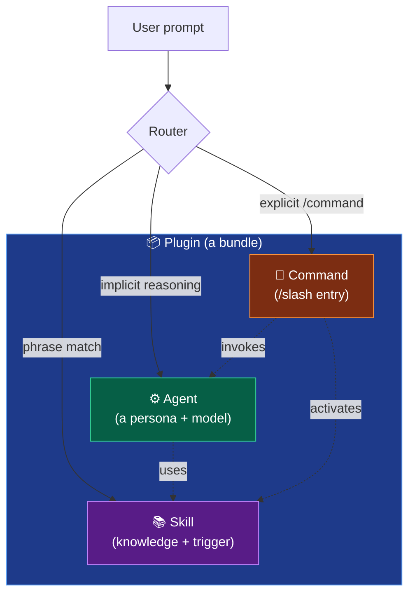
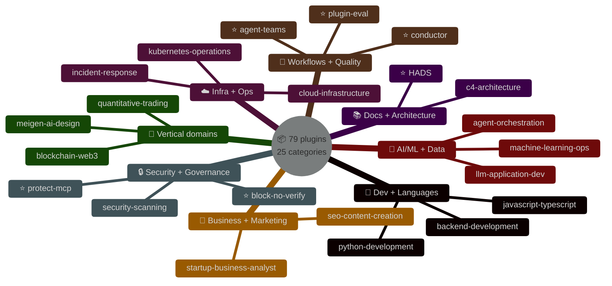
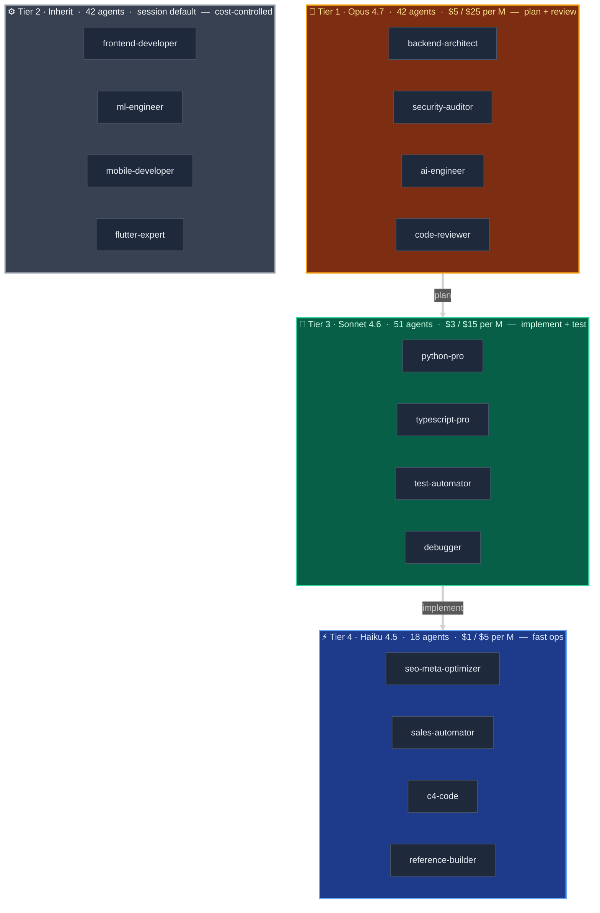

+++
date = '2026-04-21T10:00:00+08:00'
draft = false
title = 'wshobson/agents Deep Dive: What 184 Claude Code Agents Actually Do'
description = 'The 33.9K-star Claude Code plugin marketplace, audited component by component. 78 plugins, 184 agents, 150 skills — a scenario-driven install guide, the 6 moats nobody talks about, and why installing everything is a trap.'
toc = true
tags = ['Claude Code', 'AI Agent', 'Claude Skills', 'Plugin Marketplace', 'wshobson']
keywords = ['wshobson agents review', 'claude code plugins guide', 'claude code subagents', 'claude code skills catalog', 'wshobson agents install', 'plugin marketplace claude code', 'claude agent skills 2026']

[[params.faqItems]]
question = "What is the wshobson/agents repository?"
answer = "It is the largest Claude Code plugin marketplace on GitHub (33.9K stars as of April 2026), containing 78 focused plugins, 184 specialized agents, 150 skills, and 98 commands. It installs through the native /plugin marketplace add wshobson/agents command. Think of it as a catalog of pre-built personas and workflows, not a monolithic framework — you install only the plugins you need."

[[params.faqItems]]
question = "Should I install all 184 agents from wshobson/agents?"
answer = "No. The repository is built on a granular plugin design — installing everything violates the author's explicit intent and bloats your context. Pick 2-4 plugins for your current task stack. The scenario-to-plugin table in this article covers ten common tasks with recommended install sets."

[[params.faqItems]]
question = "What makes wshobson/agents different from VoltAgent or 0xfurai collections?"
answer = "All three ship around 100-200 agents covering similar development domains, so language packs (python-pro, rust-pro, etc.) are effectively commodities. wshobson's real moat is six engineering components competitors do not have: PluginEval (statistical quality scoring), Conductor (spec-driven workflow), Agent Teams (parallel multi-agent presets), protect-mcp (Cedar policy + Ed25519 signed receipts), block-no-verify (git hook guard), and HADS (token-efficient document markup)."

[[params.faqItems]]
question = "What is the difference between a plugin, an agent, and a skill?"
answer = "A plugin is a directory bundle declared in the marketplace. An agent is a Markdown persona file with a system prompt and model assignment (opus/sonnet/haiku) — it handles reasoning. A skill is a knowledge package with progressive disclosure metadata — it activates by trigger phrases in your prompt and injects domain guidance. Agents reason, skills inform; one plugin can ship both."

[[params.faqItems]]
question = "When should I write my own agent instead of installing one from wshobson/agents?"
answer = "Write your own when the task depends heavily on your repo's domain language, internal APIs, or business rules — a generic python-pro agent has no idea how your billing engine works. Install wshobson's when the task is standard (scaffold a FastAPI service, audit SAST findings, write a React component). Use PluginEval to benchmark your custom agents against the baseline."
+++


Someone sent me [wshobson/agents](https://github.com/wshobson/agents) last week and asked the question I keep hearing about hot AI repositories: **"OK, but what does it actually do?"**

33.9K stars, 3.7K forks, 184 specialized agents, 150 skills, 98 commands, 78 plugins. The README throws numbers at you. Trending lists put it at the top. Dev.to tutorials tell you to install it. None of them tell you what is actually inside, what to skip, or why the author's own design says **do not install everything**.

This post is the audit I wish existed when I first opened that repo. I went through every category, read the critical GitHub discussions, compared it to VoltAgent and 0xfurai (the closest competitors), and installed it on a real project. What follows is component-by-component: the 78 plugins mapped to 25 categories, a scenario table showing which 2-4 plugins to pick for ten common tasks, and the six engineering components that are the real moat — the ones competitors do not have and most readers miss because they are buried on page three of the docs.

## Why 33.9K stars can fool you into installing too much

Let me get the reverse-conventional-wisdom take out of the way: **do not run `/plugin install` on everything**. The repo's architecture document says this plainly — average plugin size is 3.6 components, single-responsibility is enforced, and "install only what you need" is the first line of the Quick Start. But a lot of readers see the star count, skim the README, and install ten plugins "just to have them available." That is the worst possible way to use this repo.

Two failures follow immediately. First, context bloat. Every installed plugin loads its agents, commands, and skill metadata into Claude Code's context — even if you never call them. Plugins are isolated, but their activation hooks and skill frontmatter still consume tokens on every session. Install 20 and you are burning 5-10K tokens before you type anything. Second, activation ambiguity. When you say "scaffold a Python service," Claude has to pick between `python-development`, `backend-development`, `api-scaffolding`, and `full-stack-orchestration`, all of which claim jurisdiction. The more you install, the worse the routing.

The correct mental model is the opposite: **think of `wshobson/agents` as a catalog, not a framework**. You browse 78 plugins, identify 2-4 that match your active task, install those, and uninstall when you move on. The same way you do not `apt install` every Debian package.

## The three-layer ecosystem: plugin vs agent vs skill

Before the catalog, clear up the terminology — this is the single biggest source of confusion I see in discussions about Claude Code repositories. Claude Code has three distinct abstractions that people keep conflating:



**Plugin**: the unit of install. A directory bundle declared in `.claude-plugin/marketplace.json` with a name, description, and pointers to agents/commands/skills. You install plugins, not the components inside them.

**Agent**: a Markdown file with YAML frontmatter declaring `name`, `description`, and a `model` assignment (`opus`, `sonnet`, `haiku`, or `inherit`). The body is a long system prompt — usually 200-500 lines of "you are an expert in X, your responsibilities are Y, your tools are Z." Agents are **reasoners**. Claude spawns them as subagents when a task matches their description.

**Skill**: a directory containing a `SKILL.md` file with YAML frontmatter (`name`, `description` with a "Use when..." clause). The body is domain guidance — best practices, templates, code patterns. Skills are **knowledge packages**. They activate on phrase matching (the description triggers injection) and stay dormant until needed. Progressive disclosure means only the metadata always loads; the body loads on activation; resources load on demand.

**Command**: a slash command like `/python-development:python-scaffold`. Explicit user entry point that usually invokes one or more agents and activates one or more skills.

One plugin can ship any combination. The `python-development` plugin ships 3 agents (python-pro, django-pro, fastapi-pro), 1 command (`/python-scaffold`), and 16 skills (async-python-patterns, python-testing-patterns, uv-package-manager, etc.). That is why "I installed python-development" loads far more than "python-pro." Understand this before you install anything.

## Every plugin, one line: the full 79-entry catalog

This is the reference section the repo's README should have opened with. I pulled the full `marketplace.json` (version 1.6.0, which declares 79 plugins — 78 local plus the external `qa-orchestra`) and distilled each one into a single line: what it does, and when to install it. If you are going to use this repo seriously, bookmark this section and come back when you pick up a new task.


<p style="text-align:center;color:#64748b;font-size:13px;margin-top:-10px">⭐ = moats competitors do not ship (2-3 representatives shown per cluster; full 79-entry catalog below)</p>

### 🎨 Development (6 plugins)

- **debugging-toolkit** — Interactive debugging, DX optimization, smart debugging workflows. *Install when* you want a general-purpose "why is this broken" toolkit on top of Claude Code.
- **backend-development** — Backend API design, GraphQL architecture, Temporal workflow orchestration, test-driven backend dev. Ships `backend-architect`, `graphql-architect`, `tdd-orchestrator`, `temporal-python-pro` + 9 backend skills. *Install when* you are designing REST/GraphQL services or microservices boundaries.
- **frontend-mobile-development** — Frontend UI + mobile app implementation across platforms. *Install when* building React/React Native/iOS/Android features.
- **multi-platform-apps** — Cross-platform app coordination (web + iOS + Android + desktop). Ships `frontend-developer`, `mobile-developer`, `ios-developer`, `flutter-expert`, `ui-ux-designer`. *Install when* your feature must ship to 3+ platforms with consistent behavior.
- **ui-design** — UI/UX design for mobile (iOS/Android/React Native) and web with design systems and accessibility baked in. 9 skills including design tokens, responsive, and platform-specific patterns. *Install when* you care about design system rigor, not just "make it look OK."
- **developer-essentials** — The everyday skill bundle: git advanced workflows, SQL optimization, error handling, code review, E2E testing, auth patterns, debugging strategies, monorepo management (Nx/Turborepo/Bazel). 11 skills, zero agents. *Install when* you want the "muscle memory" upgrades without adding a new persona.

### 📚 Documentation (4 plugins)

- **code-documentation** — Automated doc generation, code explanation, tutorial creation. Ships `docs-architect` (Opus) and `tutorial-engineer`. *Install when* writing internal engineering docs or developer onboarding content.
- **documentation-generation** — OpenAPI 3.1 spec generation, Mermaid diagram creation, changelog automation, ADR (Architecture Decision Records) writing. *Install when* you want machine-readable docs (specs, diagrams) generated from code.
- **c4-architecture** — The [C4 model](https://c4model.com/) pipeline: bottom-up code analysis → component synthesis → container mapping → context diagrams. Four specialized agents (c4-code Haiku, c4-component/container/context Sonnet). *Install when* you need rigorous system architecture docs for reviews or new-hire onboarding.
- **documentation-standards** — Ships the **HADS** skill (Human-AI Document Standard) for semantic Markdown tagging that cuts Claude's reading cost. *Install when* you maintain a large knowledge base Claude reads frequently.

### 🔄 Workflows (5 plugins)

- **git-pr-workflows** — Git workflow automation, PR enhancement, team onboarding. *Install when* you want consistent PR descriptions, conventional commit messages, and automated branch hygiene.
- **full-stack-orchestration** — End-to-end feature orchestration across backend → frontend → tests → security → deploy. The canonical multi-agent workflow. *Install when* tackling a feature that spans 5+ disciplines in one stroke.
- **tdd-workflows** — Red-green-refactor TDD cycles with integrated code review. *Install when* your team enforces TDD or you want the discipline enforced on AI-written code.
- **conductor** — Context-Driven Development: `/conductor:setup` → `/conductor:new-track` → `/conductor:implement` → `/conductor:revert`. Persistent project context across sessions. *Install when* you are doing multi-week feature work where re-prompting is expensive.
- **agent-teams** — Parallel multi-agent presets: `team-review`, `team-debug --hypotheses 3`, `team-feature`, `team-fullstack`, `team-research`, `team-security`, `team-migration`. Requires `CLAUDE_CODE_EXPERIMENTAL_AGENT_TEAMS=1` and tmux. *Install when* you want to parallelize reviews, debugging, or feature work across specialized agents.

### ✅ Testing (2 plugins)

- **unit-testing** — Automated pytest (Python) and Jest (JavaScript) generation with edge-case coverage. *Install when* adding a test suite to an undertested repo.
- **qa-orchestra** — External plugin (`/plugin install qa-orchestra`). 10 QA-lifecycle agents: orchestrator, environment-manager, functional-reviewer, test-scenario-designer, browser-validator, automation-writer. Chrome MCP live validation. *Install when* you need a full QA workflow, not just unit tests.

### 🔍 Quality (3 plugins)

- **comprehensive-review** — Multi-perspective code review: `architect-review` + `code-reviewer` + `security-auditor`, all Opus. *Install when* merging anything consequential or onboarding new contributors.
- **performance-testing-review** — Performance analysis, test coverage review, AI-powered code quality assessment. *Install when* investigating perf regressions or raising the coverage bar.
- **plugin-eval** — The statistical quality framework with 10 dimensions, anti-pattern detection, Wilson/Bootstrap CIs, and Elo ranking. CLI + slash commands (`/eval`, `/certify`, `/compare`). *Install when* your team ships internal plugins/skills and needs a CI gate for quality.

### 🛠️ Utilities (4 plugins)

- **code-refactoring** — Code cleanup, refactoring automation, technical-debt management with context preservation. *Install when* tackling a refactoring sprint.
- **dependency-management** — Dependency auditing, version bumps, security vulnerability scanning. *Install when* quarterly upgrade cycles or CVE triage.
- **error-debugging** — Error analysis, trace debugging, multi-agent problem diagnosis. Ships `debugger` and `error-detective` agents. *Install when* you are hunting a specific bug rather than doing broad profiling.
- **team-collaboration** — Team workflows, issue management, standup automation, DX optimization. Ships `dx-optimizer` agent. *Install when* improving team processes or automating standup/status reports.

### 🤖 AI & ML (4 plugins)

- **llm-application-dev** — LLM apps with LangGraph, RAG, vector search, AI agent architectures, tuned for Claude 4.6 and GPT-5.4. Ships `ai-engineer`, `prompt-engineer`, `vector-database-engineer` (all Opus) + 8 skills (langchain, prompt, RAG, eval, embeddings, similarity, vector tuning, hybrid search). *Install when* building any LLM-powered product.
- **agent-orchestration** — Multi-agent system optimization, agent improvement workflows, context management. *Install when* building compositional AI systems (agents calling agents).
- **context-management** — Context persistence, restoration, long-conversation management. Pairs with Conductor and Agent Teams. *Install when* your sessions run long enough to hit context limits.
- **machine-learning-ops** — ML training pipelines, hyperparameter tuning, model deployment, experiment tracking. Ships `ml-engineer`, `mlops-engineer`, `data-scientist` (all Opus). *Install when* doing traditional ML (not LLM) work.

### 📊 Data (2 plugins)

- **data-engineering** — ETL pipelines, data warehouses, batch/streaming architectures. 4 skills (Spark, dbt, Airflow, data quality). *Install when* building or optimizing data pipelines.
- **data-validation-suite** — Schema validation, data quality monitoring, streaming validation, API input validation. *Install when* you need confidence that dirty data will be caught at the boundary.

### 🗄️ Database (2 plugins)

- **database-design** — Database architecture, schema design, SQL optimization. Ships `database-architect` (Opus), `sql-pro` (Sonnet) + PostgreSQL table design skill. *Install when* designing a new schema from scratch.
- **database-migrations** — Migration automation, observability, cross-database migration strategies. Ships `database-admin`. *Install when* running a zero-downtime migration or consolidating data stores.

### 🚨 Operations (4 plugins)

- **incident-response** — Production incident management, triage, automated resolution. Ships `incident-responder` (Opus), `devops-troubleshooter`. 3 skills: postmortem writing, runbook templates, on-call handoff. *Install when* on-call or building an incident playbook.
- **error-diagnostics** — Error tracing, root-cause analysis, smart debugging for production. *Install when* diagnosing a specific production error (different from local debugging).
- **distributed-debugging** — Distributed system tracing and debugging across microservices. *Install when* a bug only reproduces across service boundaries.
- **observability-monitoring** — Metrics, logs, distributed tracing, SLI/SLO implementation, monitoring dashboards. Ships `observability-engineer`, `performance-engineer`, `network-engineer` + 4 skills (Prometheus, Grafana, Jaeger/Tempo tracing, SLO). *Install when* instrumenting a service or building dashboards.

### ⚡ Performance (2 plugins)

- **application-performance** — Application profiling, perf optimization, observability for frontend and backend. *Install when* investigating latency or throughput regressions.
- **database-cloud-optimization** — Database query optimization + cloud cost optimization in one bundle. *Install when* your AWS bill or your query p99 is rising and you want both profiled together.

### ☁️ Infrastructure (5 plugins)

- **deployment-strategies** — Deployment patterns (blue/green, canary), rollback automation, infrastructure templates. *Install when* designing deployment flows for a new service.
- **deployment-validation** — Pre-deployment checks, config validation, readiness assessment. *Install when* tightening CI gates before production.
- **kubernetes-operations** — K8s manifest generation, networking, security policies, GitOps, auto-scaling. Ships `kubernetes-architect` (Opus) + 4 skills (manifests, Helm, GitOps with ArgoCD/Flux, security policies). *Install when* working with K8s.
- **cloud-infrastructure** — AWS/Azure/GCP/OCI architecture, Terraform IaC, hybrid networking, multi-cloud cost optimization. Ships `cloud-architect`, `hybrid-cloud-architect`, `service-mesh-expert` (all Opus), `terraform-specialist`, `deployment-engineer` + 8 skills. *Install when* designing cloud topology or optimizing cloud spend.
- **cicd-automation** — GitHub Actions / GitLab CI configuration, pipeline orchestration. 4 skills: pipeline design, GitHub Actions templates, GitLab CI patterns, secrets management. *Install when* setting up or hardening CI/CD.

### 🔒 Security (6 plugins)

- **security-scanning** — SAST analysis, dependency vulnerabilities, OWASP Top 10, container security. Ships `security-auditor` (Opus), `threat-modeling-expert` (Opus) + 5 threat-modeling skills (STRIDE, attack trees, security requirements, threat mitigation, SAST config). *Install when* running security reviews or threat modeling.
- **security-compliance** — SOC2, HIPAA, GDPR validation, secrets scanning, compliance checklists, regulatory docs. *Install when* preparing for a compliance audit.
- **backend-api-security** — API hardening, authentication, authorization, rate limiting, input validation. Ships `backend-security-coder` (Opus). *Install when* writing or reviewing security-critical API code.
- **frontend-mobile-security** — XSS prevention, CSRF protection, CSP, mobile app security, secure storage. Ships `frontend-security-coder`, `mobile-security-coder` (both Opus). *Install when* writing user-facing code that handles auth tokens or sensitive data.
- **reverse-engineering** — Binary analysis, malware triage, firmware security — **for authorized research, CTF, and defensive work only**. 4 skills (binary analysis, memory forensics, protocol RE, anti-reversing). *Install when* doing security research you have explicit authorization for.
- **block-no-verify** — A PreToolUse hook that blocks `--no-verify`, `--no-gpg-sign`, and other bypass flags so AI cannot skip git hooks. *Install when* you use Claude Code in any repo with commit hooks (which is almost everyone).

### 🛡️ Governance (2 plugins)

- **protect-mcp** — Cedar policy enforcement + Ed25519 signed receipts for every tool call. Offline-verifiable audit trail via hash chaining. *Install when* you operate in regulated environments or need cryptographic proof of what your agents did.
- **signed-audit-trails** — Teaching skill: cookbook walkthrough of signed audit trails, SLSA composition, CI/CD integration. Companion to protect-mcp. *Install when* implementing your own audit trail, not just using protect-mcp's defaults.

### 🔄 Modernization (2 plugins)

- **framework-migration** — Framework upgrades, migration planning, architectural transformation. Ships `legacy-modernizer` + 4 skills (React modernization, Angular migration, DB migration, dependency upgrade). *Install when* migrating off an old framework version or switching frameworks.
- **codebase-cleanup** — Technical-debt reduction, dependency updates, refactoring automation. Ships `test-automator`. *Install when* tackling a cleanup sprint.

### 🌐 API (2 plugins)

- **api-scaffolding** — REST + GraphQL API scaffolding, framework selection. Ships `django-pro`, `fastapi-pro` + FastAPI templates skill. *Install when* bootstrapping a new API service.
- **api-testing-observability** — API testing automation, request mocking, OpenAPI doc generation, monitoring. Ships `api-documenter`. *Install when* hardening an existing API with tests, mocks, and observability.

### 📢 Marketing (4 plugins)

- **seo-content-creation** — SEO content writing, topic planning, E-E-A-T quality auditing. Ships `seo-content-writer` (Sonnet), `seo-content-planner` (Haiku), `seo-content-auditor`. *Install when* publishing product blog content.
- **seo-technical-optimization** — Meta tags, keywords, structured data, featured snippets. Four Haiku agents: `seo-meta-optimizer`, `seo-keyword-strategist`, `seo-structure-architect`, `seo-snippet-hunter`. *Install when* tuning on-page SEO.
- **seo-analysis-monitoring** — Content freshness analysis, keyword cannibalization detection, authority building. *Install when* auditing an existing content library.
- **content-marketing** — Content marketing strategy, web research, information synthesis. Ships `content-marketer`, `search-specialist`. *Install when* doing marketing research or content planning broader than SEO.

### 💼 Business (4 plugins)

- **business-analytics** — KPI tracking, financial reporting, data-driven decision making. 2 skills: KPI dashboard design, data storytelling. *Install when* building executive dashboards or metrics reporting.
- **startup-business-analyst** — TAM/SAM/SOM market sizing, 3-5 year financial modeling, team/hiring planning, SaaS metrics framework. 5 skills covering competitive analysis, market sizing, financial modeling, metrics, team composition. *Install when* drafting a pitch deck, business plan, or Series A readiness analysis.
- **hr-legal-compliance** — HR policies, legal templates (GDPR/SOC2/HIPAA), employment contracts. Ships `hr-pro`, `legal-advisor` (both Opus). *Install when* generating internal policy docs or compliance templates.
- **customer-sales-automation** — Customer support automation, sales pipeline, email campaigns, CRM integration. Ships `customer-support` (Sonnet), `sales-automator` (Haiku). *Install when* building support macros or sales outreach sequences.

### 💻 Languages (10 plugins)

- **python-development** — Python 3.12+, Django, FastAPI, async. Ships `python-pro`, `django-pro`, `fastapi-pro` + **16 skills** (async, testing, packaging, performance, uv, and more). *Install when* doing any serious Python work.
- **javascript-typescript** — JS/TS with ES6+, Node.js, modern web frameworks. Ships `javascript-pro`, `typescript-pro` + 4 skills (advanced types, Node backend patterns, testing, modern ES6+). *Install when* any JS/TS work.
- **systems-programming** — Rust, Go, C, C++ for performance-critical and low-level code. Ships `rust-pro`, `golang-pro`, `c-pro`, `cpp-pro` + 3 skills (rust-async, go-concurrency, memory-safety). *Install when* writing systems code.
- **jvm-languages** — Java, Scala, C# with enterprise patterns. Ships `java-pro`, `scala-pro`, `csharp-pro`. *Install when* in enterprise JVM or .NET land.
- **web-scripting** — PHP and Ruby for web apps. Ships `php-pro`, `ruby-pro`. *Install when* maintaining WordPress, Laravel, or Rails codebases.
- **functional-programming** — Elixir with OTP/Phoenix; Haskell with advanced types. Ships `elixir-pro`, `haskell-pro`. *Install when* writing Elixir services or Haskell-level type rigor matters.
- **julia-development** — Julia 1.10+, scientific computing, high-performance numerical code. *Install when* doing scientific/numeric work where Julia is the right tool.
- **arm-cortex-microcontrollers** — ARM Cortex-M firmware for Teensy/STM32/nRF52/SAMD, peripheral drivers, memory safety. Ships `arm-cortex-expert`. *Install when* embedded firmware work.
- **shell-scripting** — Production-grade Bash with defensive programming, POSIX compliance, testing (Bats, ShellCheck). 3 skills. *Install when* writing non-trivial shell scripts for production.
- **dotnet-contribution** — C#/.NET backend with ASP.NET Core, EF Core, Dapper. 1 skill (dotnet-backend-patterns). *Install when* .NET backend work.

### 🔗 Specialized verticals (one plugin each)

- **blockchain-web3** — Solidity smart contracts, DeFi protocols, NFT platforms, Web3 apps. 4 skills (DeFi templates, NFT standards, Solidity security, Web3 testing). *Install when* Web3 development (and you have a clear reason — these are narrow).
- **quantitative-trading** — Algorithmic trading, financial modeling, portfolio risk management, backtesting. Ships `quant-analyst` (Opus), `risk-manager`. 2 skills (backtesting, risk metrics). *Install when* building trading strategies or risk systems.
- **payment-processing** — Stripe, PayPal integration, subscription billing, PCI compliance. Ships `payment-integration`. 4 skills (Stripe, PayPal, PCI, billing automation). *Install when* implementing payments.
- **game-development** — Unity C# + Minecraft Bukkit/Spigot plugin development. 2 skills (Unity ECS, Godot GDScript). *Install when* game dev.
- **accessibility-compliance** — WCAG auditing, screen reader testing, inclusive design. Ships `accessibility-expert`, `ui-visual-validator`. 2 skills (WCAG audit, screen reader testing). *Install when* running an accessibility audit.
- **meigen-ai-design** — AI image generation with creative workflow orchestration, prompt engineering, MCP server for inspiration library. *Install when* doing visual asset generation as part of your product workflow.

Pattern you should see: **about 65% of the plugins are standard language/infrastructure domains any competing collection ships**. The remaining 35% — conductor, agent-teams, protect-mcp, signed-audit-trails, block-no-verify, plugin-eval, c4-architecture, documentation-standards (HADS), developer-essentials, startup-business-analyst, reverse-engineering, meigen-ai-design — is where this repo pulls away from its competitors. We dig into the top six next.

## The scenario table: 10 common tasks, which plugins to install

This is the table I wish the README opened with. Ten concrete tasks, and the minimal plugin set that handles each. If your task matches, install these two or three; do not install more.

| Task | Install | Why |
|------|---------|-----|
| Scaffold a FastAPI/Django Python service | `python-development` + `api-scaffolding` | Python-pro + django-pro + fastapi-pro agents; 16 skills (async, uv, testing, packaging) |
| Ship a Next.js + Node backend feature | `javascript-typescript` + `backend-development` | typescript-pro + nodejs-backend-patterns skill + REST/GraphQL design skill |
| Deploy to Kubernetes with GitOps | `kubernetes-operations` + `cicd-automation` | k8s-manifest-generator, helm-chart-scaffolding, gitops-workflow, github-actions-templates skills |
| Run multi-dimensional code review before merge | `comprehensive-review` + `agent-teams` | architect-review + code-reviewer + security-auditor agents; `/team-review` parallel dispatch |
| Fix a production incident (ongoing) | `incident-response` + `observability-monitoring` + `error-diagnostics` | incident-responder (Opus) + devops-troubleshooter + distributed-tracing skill |
| Build a RAG or LLM application | `llm-application-dev` + `context-management` | ai-engineer, vector-database-engineer, prompt-engineer agents; 8 RAG/embeddings skills |
| Harden an API against OWASP | `security-scanning` + `backend-api-security` | security-auditor, threat-modeling-expert; SAST, STRIDE, attack-tree skills |
| Migrate a legacy Angular or React app | `framework-migration` + `codebase-cleanup` | legacy-modernizer agent; react-modernization, angular-migration, dependency-upgrade skills |
| Run a structured spec-driven feature | `conductor` | Setup → Spec → Plan → Implement workflow; replaces ad-hoc prompting for bigger features |
| Publish SEO content for a product blog | `seo-content-creation` + `seo-technical-optimization` | seo-content-writer (Sonnet) + 4 Haiku SEO agents for meta/keyword/snippet/structure |

Two rules I follow: **never install more than four plugins concurrently** (context budget), and **uninstall when the task is done** (`/plugin` → remove). The marketplace metadata stays; the loaded context drops back to baseline.

## The 6 moats nobody talks about

Now the real value. If you strip out the language packs and infrastructure plugins — the commodity layer — six engineering components remain. These are the reasons to pick wshobson over VoltAgent or 0xfurai, because competitors do not ship them.

### 1. PluginEval — the only statistical quality framework

`/plugin install plugin-eval`. This is a plugin that evaluates other plugins. Three layers:

- **Layer 1 (Static)**: under 2 seconds, free, deterministic. Parses SKILL.md, checks frontmatter, detects anti-patterns like `BLOATED_SKILL`, `EMPTY_DESCRIPTION`, `ORPHAN_REFERENCE`, `OVER_CONSTRAINED`.
- **Layer 2 (LLM Judge)**: around 30 seconds, four API calls. Scores four semantic dimensions with anchored rubrics: triggering accuracy, output quality, scope calibration, orchestration fitness.
- **Layer 3 (Monte Carlo)**: around two minutes, fifty calls. Statistical robustness via bootstrap confidence intervals and Wilson score CIs. Elo ranking against a gold-standard corpus.

Then it outputs Bronze/Silver/Gold/Platinum badges and a letter grade. You can wire `--threshold 70` into CI so a PR that adds a skill below that score fails automatically. Competitors do not have this. Nobody else in the ecosystem has this. If you are building an internal plugin library for your team, this alone is worth installing the whole marketplace.

### 2. Conductor — context-driven development workflow

`/plugin install conductor`. This one turns Claude Code into a lightweight project management system. Commands:

- `/conductor:setup` — interactive wizard that captures product vision, tech stack, workflow rules, style guide. State persists across sessions.
- `/conductor:new-track` — generates a specification and phased implementation plan for a feature/bug/chore/refactor.
- `/conductor:implement` — executes the plan with TDD verification checkpoints.
- `/conductor:revert` — semantic revert (undo by track, phase, or task — not by git commit).

The philosophy is **Context → Spec & Plan → Implement**. Instead of prompting from scratch every time, you build a persistent project context that every subsequent agent invocation reads. For multi-week features with unclear requirements, it beats ad-hoc prompting by a large margin. It is also the closest thing Claude Code has to a "product manager mode."

### 3. Agent Teams — the experimental parallel multi-agent plugin

`/plugin install agent-teams`. This wraps Claude Code's experimental Agent Teams feature (requires `CLAUDE_CODE_EXPERIMENTAL_AGENT_TEAMS=1` and tmux). Seven presets:

- `team-review` — parallel code review across security, performance, architecture, testing, accessibility dimensions
- `team-debug` — hypothesis-driven debugging with competing hypotheses (3 parallel investigators)
- `team-feature` — parallel feature dev with strict file ownership boundaries (no merge conflicts)
- `team-fullstack` — coordinated backend + frontend + test + deploy
- `team-research` — parallel exploration across codebase and web
- `team-security` — OWASP + auth + deps + config audit in parallel
- `team-migration` — coordinated migration with correctness verification

The `team-debug --hypotheses 3` command is the clearest win. Instead of Claude trying one fix, three agents each pursue a different hypothesis, gather evidence, and a lead arbitrates based on what the evidence shows. For a class of "intermittent failure, not sure why" bugs, this shaves hours.

### 4. protect-mcp — Cedar policy + Ed25519 signed tool calls

`/plugin install protect-mcp`. This is the governance plugin. Enforces [Cedar policies](https://www.cedarpolicy.com/) on every MCP tool call and writes an Ed25519-signed receipt to an append-only hash-chained log. The receipt is offline-verifiable — regulators can audit your agent's tool calls without trusting your infrastructure.

This is the kind of component you ignore until your compliance team asks "prove every action your AI agent took last quarter." Almost no one else in the Claude Code ecosystem has thought about signed audit trails for tool calls. If your company is in finance, healthcare, or any regulated domain, this is the missing piece.

### 5. block-no-verify — the git hook guard

`/plugin install block-no-verify`. Tiny, boring, and essential. It is a PreToolUse hook that intercepts any Bash call containing `--no-verify`, `--no-gpg-sign`, or hook-bypass flags, and blocks it. The problem it solves: AI agents love to bypass failing pre-commit hooks to make CI green. This prevents that class of footgun in one install.

I have the same pattern hand-rolled in my own settings. Ripping out my custom code and using this plugin is on my todo list — it is maintained centrally, updated when new bypass flags ship, and documented. If you run Claude Code in any CI-adjacent context, install this today.

### 6. HADS — Human-AI Document Standard

A single skill inside `code-documentation`: **hads** (Human-AI Document Standard). Semantic Markdown tagging designed for token-efficient AI reading. The idea: annotate sections with machine-readable tags (`<<purpose>>`, `<<constraints>>`, `<<examples>>`) so Claude reads your docs in a fraction of the tokens while a human reads the raw Markdown without noise. This is small, but it is the first serious attempt at "docs as API for AI agents" I have seen shipped as a skill. If you maintain a large internal knowledge base that Claude reads, it is worth testing on a few documents to measure the token delta.

The takeaway: **the language packs are table stakes**. The six components above are what make this repo different from every other Claude Code collection on GitHub.

## 184 agents and the three-tier cost model

Now the agent layer. Every agent declares a `model` field that decides how expensive it is to run. The distribution:



**Tier 1 (42 Opus agents)** are the thinkers: `backend-architect`, `security-auditor`, `code-reviewer`, `ai-engineer`, `prompt-engineer`, `ml-engineer`, `database-architect`. They handle the decisions where wrong-ness is expensive — system design, threat modeling, code review catching architectural drift.

**Tier 2 (42 inherit)** defer to your session model. If you launched Claude Code with `--model sonnet`, they run on Sonnet; with `--model opus`, they upgrade. Frontend, mobile, and mid-tier agents live here. Use this tier when you want user-controlled cost.

**Tier 3 (51 Sonnet agents)** are the implementers: `python-pro`, `typescript-pro`, `rust-pro`, `test-automator`, `debugger`, `api-documenter`. They turn decisions into code at the cost/quality sweet spot.

**Tier 4 (18 Haiku agents)** are the fast operational layer: SEO meta optimizers, C4 code-level doc generators, sales email drafters, customer support templates. Anything with well-defined templates and low reasoning cost.

The design implication: **the repo assumes you compose across tiers**, not invoke a single agent. A real full-stack feature looks like `backend-architect` (Opus plans) → `python-pro` (Sonnet implements) → `test-automator` (Sonnet writes tests) → `security-auditor` (Opus reviews) → `deployment-engineer` (Sonnet ships) → `c4-code` (Haiku generates diagrams). Each step uses the right-priced model. That is the cost discipline the README buries under marketing language.

## 150 skills and how they actually activate

Skills are the least-understood layer in the Claude Code ecosystem, so here is what happens under the hood. When you install a plugin, its skill metadata (just the `name` + `description`) gets registered with Claude Code. The full skill body stays on disk, unloaded.

When you prompt something like "optimize this Python async function," Claude reads every registered skill description and checks if any match. Matches trigger injection: the skill body loads into context for that turn only. On the next turn, if no match, it drops out.

The 150 skills are distributed unevenly. The biggest skill libraries:

- **Python Development (16 skills)** — the heaviest. async-python-patterns, python-testing-patterns, python-packaging, python-performance-optimization, uv-package-manager, and more. If you do Python, install this plugin even if you only want one agent.
- **Developer Essentials (11 skills)** — git-advanced-workflows, sql-optimization-patterns, error-handling-patterns, code-review-excellence, e2e-testing-patterns, auth-implementation-patterns, debugging-strategies, and monorepo management for Nx/Turborepo/Bazel.
- **UI Design (9 skills)** — design-system-patterns, responsive-design, mobile-ios-design, mobile-android-design, react-native-design, interaction-design, visual-design-foundations.
- **Backend Development (9 skills)** — api-design-principles, architecture-patterns, microservices-patterns, plus Temporal workflow and CQRS/event-sourcing.
- **LLM Application Dev (8 skills)** — langchain-architecture, prompt-engineering-patterns, rag-implementation, llm-evaluation, embedding-strategies, similarity-search-patterns, vector-index-tuning, hybrid-search-implementation.
- **Cloud Infrastructure (8 skills)** — terraform-module-library, multi-cloud-architecture, cost-optimization, service mesh (Istio/Linkerd/mTLS).
- **Agent Teams (6 skills)** — the parallel coordination library: multi-reviewer-patterns, parallel-debugging, parallel-feature-development, task-coordination-strategies, team-communication-protocols, team-composition-patterns.

The distribution tells you where the author invested: LLM apps, backend architecture, developer workflows, and cloud/K8s ops are deeply covered; gaming, finance, and HR/legal have minimal skill support (1-2 each) and are mostly agent-only.

## The fair criticism: Discussion #42 was right

Not every agent in this repo is good. The repo's most-cited critical discussion is [#42 "Very generic agents"](https://github.com/wshobson/agents/discussions/42), where a user tested the agents on a service website and reported they produced mediocre output. The quote: *"they are too broad, very generic. An agent needs to be very specialized to create good result, it is not enough saying 'React component architecture (hooks, context, performance)', this says nothing to the LLM."*

The author's response was, essentially, "show me reproducible test cases." Which is fair — vague complaints are hard to improve on. But the substantive point is correct: a lot of the language-pro agents are capability sheets, not deep experts. Read `python-pro.md` and you get a 200-line list of "Python 3.12+ features, async patterns, uv, ruff, FastAPI, Django, pytest, Hypothesis, cProfile, NumPy..." That breadth means Claude has strong capability *recall* but thin capability *depth* on any given topic.

Where the repo compensates is through skills. `python-pro` agent + `async-python-patterns` skill + `python-testing-patterns` skill + `uv-package-manager` skill together produce much sharper output than the agent alone. If you installed `python-development` and saw generic output, check whether the skills activated — their trigger phrases have to match your prompt. "Write an async Python function" activates async-python-patterns; "implement this feature in Python" may not.

The bigger lesson: **do not expect an installed agent to outperform Claude's baseline on a task where your codebase's context matters more than the agent's system prompt**. A generic backend-architect cannot know your company's billing domain. Install it for scaffolding work, not for nuanced judgment calls on code you alone understand.

## Competing collections: where does wshobson sit?

For context, here are the closest alternatives and where each lands:

- **[VoltAgent/awesome-claude-code-subagents](https://github.com/VoltAgent/awesome-claude-code-subagents)**: 100+ agents, 10 categories. Clean, permission-scoped (Read-only vs Code-writing agents are tagged explicitly). Good if you want leaner surface area. No PluginEval, no Conductor, no Agent Teams.
- **[0xfurai/claude-code-subagents](https://github.com/0xfurai/claude-code-subagents)**: 100+ production-ready agents. Comparable scope. Same gap — no evaluation framework, no workflow plugins.
- **[rahulvrane/awesome-claude-agents](https://github.com/rahulvrane/awesome-claude-agents)**: more of a directory of agent collections than a single install. Useful for discovery, not for installation.

If all you want is language experts and domain agents, any of the three ship the same 80%. The reason to pick wshobson is the 20% that only it has: PluginEval, Conductor, Agent Teams, protect-mcp, block-no-verify, HADS, C4 documentation pipeline, reverse engineering, startup business analyst. Those are the moat. Everything else is commodity.

## My three recommended install recipes

Concrete starting points. Pick the one that matches your current work and do not install beyond it until you need to.

**Recipe A — Full-stack product engineer (5 plugins)**

```bash
/plugin install python-development              # or javascript-typescript
/plugin install backend-development
/plugin install comprehensive-review
/plugin install git-pr-workflows
/plugin install block-no-verify                 # cheap insurance
```

Covers 80% of product development tasks. Add `kubernetes-operations` if you deploy to K8s.

**Recipe B — Platform / infra team (6 plugins)**

```bash
/plugin install kubernetes-operations
/plugin install cloud-infrastructure
/plugin install cicd-automation
/plugin install observability-monitoring
/plugin install security-scanning
/plugin install protect-mcp                     # if you have audit requirements
```

This is the stack for SREs and platform engineers. Agent Teams (optional) helps for parallel incident response.

**Recipe C — AI app builder (4 plugins)**

```bash
/plugin install llm-application-dev
/plugin install context-management
/plugin install python-development
/plugin install agent-orchestration
```

RAG, LangChain, vector databases, prompt engineering. If you also build evaluations, add `plugin-eval` — the statistical framework generalizes beyond plugin quality to prompt evals.

## When to write your own agent instead

Three scenarios where installing is the wrong call:

1. **Your task depends on domain vocabulary only your team knows.** A generic `backend-architect` has no idea what a "billing dispute reversal" means in your codebase. Write a 50-line custom agent with three concrete examples from your repo; it will outperform any generic agent by a wide margin.
2. **The output needs to follow your company style guide or contract templates.** The generic `legal-advisor` agent writes generic legalese. Your template-bound documents need a custom agent loaded with your actual template library.
3. **You want reproducibility for evals or benchmarking.** Third-party agents change when the repo updates. If you are running evaluations that need to stay stable, vendor a snapshot of the agent into your repo rather than installing from the marketplace.

The correct workflow for all three: install wshobson's agent as a reference, copy it to your project's `.claude/agents/`, edit to inject your domain context, and benchmark the custom version against the original using PluginEval. That is the "use the marketplace as a starting point, not an endpoint" pattern.

## Summary: what you install, what you skip

The TL;DR after going through every component:

**Install if you want commodity competence fast**: language plugins (python-development, javascript-typescript, systems-programming), infrastructure (kubernetes-operations, cloud-infrastructure, cicd-automation), and quality (comprehensive-review). These are well-executed table stakes.

**Install if you want real differentiation**: plugin-eval (quality scoring), conductor (spec-driven workflow), agent-teams (parallel multi-agent), protect-mcp (signed audit trails), block-no-verify (git hook guard), and the HADS skill (token-efficient docs). These do not exist in competing collections.

**Skip unless you have a specific need**: niche vertical plugins (game-development, blockchain-web3, quantitative-trading, reverse-engineering, meigen-ai-design). These are well-scoped but narrow — install only if your domain matches exactly.

**Do not install**: all 78 plugins at once. That is the single biggest mistake, and it violates the repo's explicit design. The granular plugin architecture only works when you use it granularly.

I will cover a few more trending AI repos the same way — pick up the component-by-component audit, not the hype — as they come in. If you want another one triaged like this, the approach is above: scenarios first, hidden moats second, honest limits last.

---

## Related Reading

- [Harness Engineering: Build the 6 Layers Backwards](/posts/ai/2026-04-18-harness-six-layers-reverse-build/) — why eval + recovery layers drive 80% of agent stability
- [Harness Subagent Architecture](/posts/ai/2026-04-13-harness-subagent-architecture/) — the principles that subagent marketplaces implement
- [MCP vs Skills in Claude Code](/posts/ai/2026-04-02-mcp-vs-skills-claude-code/) — when to reach for each abstraction
- [Claude Code + OpenSpec + Superpowers](/posts/ai/2026-04-09-claude-code-openspec-superpowers/) — comparing spec-driven workflow ecosystems
- [Claude Agent SDK Guide](/posts/ai/2026-04-17-claude-agent-sdk-guide/) — building custom agents outside the marketplace
