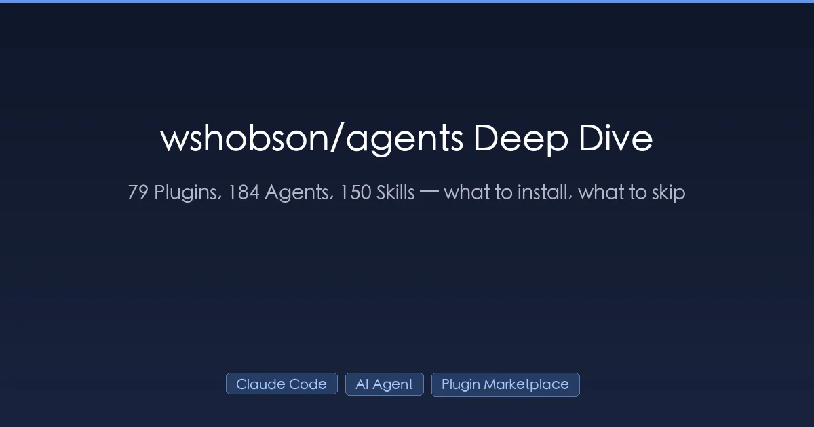
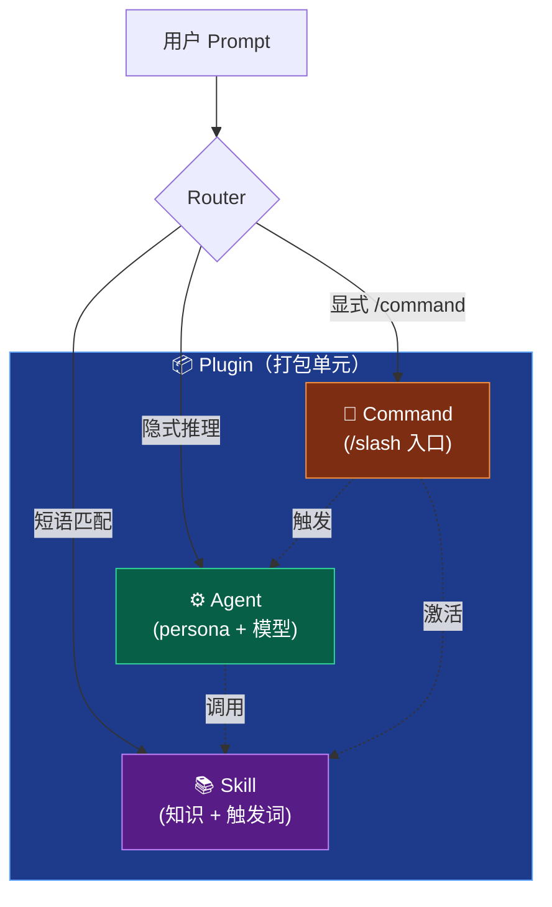
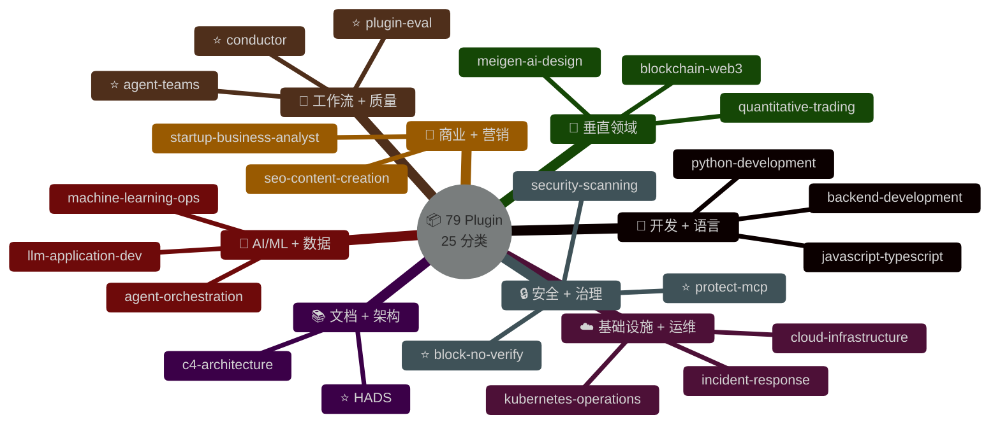
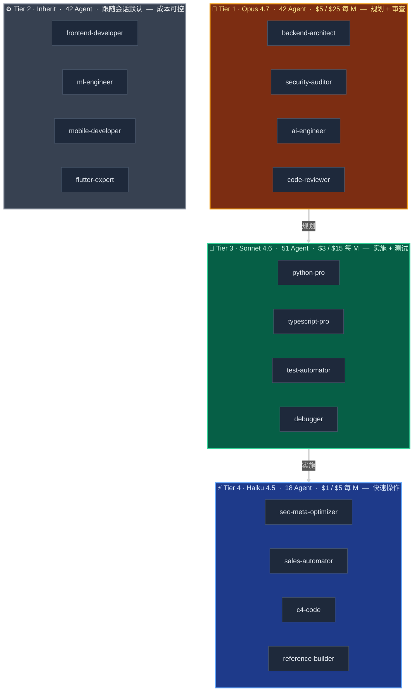

+++
date = '2026-04-21T10:00:00+08:00'
draft = false
title = '深度挖掘 wshobson/agents：33.9K Star 的 Claude Code 插件市场 79 个 Plugin 到底怎么用'
description = '33.9K Star 的 wshobson/agents 全仓库盘点：79 个 Plugin、184 个 Agent、150 个 Skill 的逐个解析，10 个场景该装哪些、6 个别家没有的独家组件、以及为什么不能全装。Claude Code 插件生态最完整的中文导览。'
toc = true
tags = ['Claude Code', 'AI Agent', 'Claude Skills', 'Plugin Marketplace', 'wshobson']
keywords = ['wshobson agents 中文', 'Claude Code 插件市场', 'Claude Code subagents', 'Claude Code skill 使用', 'wshobson 安装指南', 'Claude 插件推荐', 'Claude Agent 目录 2026']

[[params.faqItems]]
question = "wshobson/agents 是什么？"
answer = "它是 GitHub 上规模最大的 Claude Code 插件市场（2026 年 4 月 33.9K Star），包含 78 个细粒度 Plugin、184 个专业 Agent、150 个 Skill、98 个 Command。通过原生 /plugin marketplace add wshobson/agents 命令安装。把它理解成一个目录（像应用商店），不是框架——只装你当前任务需要的 2-4 个插件。"

[[params.faqItems]]
question = "要把 wshobson/agents 的 184 个 Agent 全装上吗？"
answer = "绝对不要。仓库的架构本身就基于 granular（细粒度）设计——全装会违反作者的显式设计意图、吃光你的上下文。针对当前工作栈挑 2 到 4 个插件即可。本文中的场景对照表覆盖了 10 个常见开发任务应该装哪些。"

[[params.faqItems]]
question = "wshobson/agents 和 VoltAgent、0xfurai 比有什么不同？"
answer = "三家都是 100-200 个 Agent，覆盖相似的开发领域，所以语言包（python-pro、rust-pro）其实是大路货。wshobson 真正的护城河是 6 个别家没有的工程化组件：PluginEval（统计学质量评分）、Conductor（规约驱动工作流）、Agent Teams（多 Agent 并行预设）、protect-mcp（Cedar 策略+Ed25519 签名审计）、block-no-verify（git hook 保护）、HADS（token 高效文档标记）。"

[[params.faqItems]]
question = "Plugin、Agent、Skill 这三个概念到底啥关系？"
answer = "Plugin 是打包单元，是 marketplace.json 里声明的目录，你装的是它。Agent 是带 YAML 元信息的 Markdown persona 文件，里面声明 model（opus/sonnet/haiku/inherit）和系统 prompt，负责推理判断。Skill 是知识包，带 progressive disclosure 元数据，根据你 prompt 里的关键词自动触发加载对应领域指导。一句话：Agent 负责推理，Skill 负责提供知识，一个 Plugin 可以同时带两者。"

[[params.faqItems]]
question = "什么情况下该自己写 Agent，而不是装 wshobson 的？"
answer = "当任务高度依赖你代码库的领域语言、内部 API、业务规则时——通用的 python-pro Agent 根本不知道你家 billing engine 怎么跑。装 wshobson 的适用于标准任务（搭 FastAPI 服务、审 SAST 扫描结果、写 React 组件）。如果你要写自定义 Agent，可以用 PluginEval 来对比自家 Agent 和基线版本的质量差异。"
+++



上周有人发 [wshobson/agents](https://github.com/wshobson/agents) 给我，问了那个我经常被问到的问题：**"这仓库到底是干啥的？"**

33.9K Star、3.7K Fork、184 个 Agent、150 个 Skill、98 个 Command、78 个 Plugin。README 用数字糊你一脸。热榜把它顶到第一屏。Dev.to 教程告诉你先装上。但没人告诉你里面到底装的是啥、该跳过哪些、以及为什么**作者自己的设计原则是不要全装**。

这篇文章是我当时打开这个 repo 时希望存在的那份使用手册。我把 25 个分类全走了一遍、读了最关键的几个 GitHub Issue 讨论、和 VoltAgent、0xfurai（最接近的竞品）做了对比、然后在一个真实项目里试装了一遍。下面按组件维度逐个交付：78 个 Plugin 映射到 25 个分类、一张覆盖 10 个常见任务的场景对照表、以及**6 个竞品没有的独家组件**——README 把这些藏到了第三页，大部分读者根本没翻到。

## 为什么 33.9K Star 可能骗你多装了插件

反套路的判断先摆在前头：**别上来就 `/plugin install` 把所有插件都装一遍**。仓库的架构文档说得很清楚——平均每个 Plugin 只含 3.6 个组件、单一职责原则被强制贯彻、Quick Start 第一行就是"只装你需要的"。但我看到太多读者被 Star 数字震撼后、只扫了一眼 README、随手就装了十来个 Plugin "以备不时之需"。这是用这个仓库最错的方式。

两种失败紧接着就来了。第一是**上下文膨胀**。每装一个 Plugin，它的 Agent、Command、Skill 元数据都会进入 Claude Code 的上下文——即便你从没调用过。Plugin 之间是隔离的，但激活钩子和 Skill frontmatter 每个会话都会占 token。装 20 个，你还没开始敲字就烧掉了 5-10K token。第二是**路由模糊化**。当你说"帮我搭一个 Python 服务"时，Claude 得在 `python-development`、`backend-development`、`api-scaffolding`、`full-stack-orchestration` 之间选一个——它们都声称自己管这件事。装得越多，路由错得越离谱。

正确的心智模型反过来：**把 `wshobson/agents` 当作目录（catalog），不是框架（framework）**。在 78 个 Plugin 里浏览、挑出和当前任务匹配的 2 到 4 个、装上、任务结束后卸载。和你不会 `apt install` 整个 Debian 仓库一个道理。

## 三层生态拆解：Plugin、Agent、Skill 到底啥关系

在开始目录之前，先把术语讲清楚——这是我在 Claude Code 相关讨论里看到的**最大困惑源**。Claude Code 有三个相互独立的抽象，很多人混为一谈：



**Plugin**：安装单元。一个在 `.claude-plugin/marketplace.json` 里声明的目录包，有名字、描述、以及指向内部 Agent/Command/Skill 的指针。你装的是 Plugin，不是里面的组件。

**Agent**：带 YAML frontmatter 的 Markdown 文件，frontmatter 声明 `name`、`description`、以及 `model`（`opus`/`sonnet`/`haiku`/`inherit`）。正文是一段 200-500 行的系统 prompt——"你是 X 领域专家、你的职责是 Y、你能用的工具是 Z"。Agent 是**推理者**。当任务匹配它的描述时，Claude 把它当作子 Agent 拉起来。

**Skill**：一个目录，里面有 `SKILL.md`，frontmatter 带 `name`、带 "Use when..." 的 `description`。正文是领域指导——最佳实践、模板、代码范式。Skill 是**知识包**。触发方式是短语匹配（description 命中就注入），不激活时处于休眠。Progressive disclosure 的意思是：只有元数据永远加载；正文激活时加载；资源按需加载。

**Command**：一个 slash 命令如 `/python-development:python-scaffold`。用户的显式入口，通常会调用若干 Agent 并激活若干 Skill。

一个 Plugin 可以带这三者任何组合。`python-development` 带 3 个 Agent（python-pro、django-pro、fastapi-pro）、1 个 Command（`/python-scaffold`）、16 个 Skill（async-python-patterns、python-testing-patterns、uv-package-manager 等等）。所以"我装了 python-development"远比"我装了 python-pro"加载的东西多。装东西之前先搞清这件事。

## 每个插件一行：79 条完整目录

这是 README 应该一开头就放的参考手册。我拉了完整的 `marketplace.json`（1.6.0 版本，声明有 79 个 Plugin——78 个本地的加上外部的 `qa-orchestra`），每个都浓缩成一行：干什么用、什么时候装。如果你认真用这个仓库，把这一节收藏起来，接到新任务时回来查。


<p style="text-align:center;color:#64748b;font-size:13px;margin-top:-10px">⭐ = 竞品没有的独家组件（每类仅列 2-3 个代表，完整 79 项见下面目录）</p>

### 🎨 开发类 Development（6 个）

- **debugging-toolkit** — 交互式调试、DX 优化、智能调试流程。*什么时候装*：想在 Claude Code 上叠加一套通用"为啥坏了"的调试工具。
- **backend-development** — 后端 API 设计、GraphQL 架构、Temporal 工作流编排、TDD 后端开发。内置 `backend-architect`、`graphql-architect`、`tdd-orchestrator`、`temporal-python-pro` 共 4 个 Agent + 9 个 Skill。*什么时候装*：设计 REST/GraphQL 服务或划分微服务边界。
- **frontend-mobile-development** — 前端 UI + 跨平台移动应用开发。*什么时候装*：构建 React/React Native/iOS/Android 功能。
- **multi-platform-apps** — 跨平台应用协调（Web + iOS + Android + 桌面）。内置 `frontend-developer`、`mobile-developer`、`ios-developer`、`flutter-expert`、`ui-ux-designer`。*什么时候装*：一个功能要在 3+ 平台同时发布并保持行为一致。
- **ui-design** — 移动（iOS/Android/React Native）和 Web 的 UI/UX 设计，自带设计系统和无障碍考量。9 个 Skill，覆盖设计 Token、响应式、平台特定范式。*什么时候装*：在意设计系统的严谨性，不只是"看起来能用"。
- **developer-essentials** — 日常技能合集：Git 高级用法、SQL 优化、错误处理、代码审查、E2E 测试、认证模式、调试策略、monorepo 管理（Nx/Turborepo/Bazel）。11 个 Skill、0 个 Agent。*什么时候装*：想获得"肌肉记忆"级升级但不想加新 persona。

### 📚 文档类 Documentation（4 个）

- **code-documentation** — 自动化文档生成、代码解释、教程创作。内置 `docs-architect`（Opus）、`tutorial-engineer`。*什么时候装*：写内部工程文档或新员工 onboarding 内容。
- **documentation-generation** — OpenAPI 3.1 规约生成、Mermaid 图生成、变更日志自动化、架构决策记录（ADR）。*什么时候装*：想从代码生成机器可读的文档（规约、图）。
- **c4-architecture** — 完整的 [C4 模型](https://c4model.com/) 流水线：自下而上代码分析 → 组件合成 → 容器映射 → 上下文图。4 个专用 Agent（c4-code 是 Haiku，c4-component/container/context 是 Sonnet）。*什么时候装*：需要为审查或新人 onboarding 生成严格的系统架构文档。
- **documentation-standards** — 提供 **HADS** Skill（Human-AI Document Standard）——语义化 Markdown 标签，降低 Claude 读文档的 token 消耗。*什么时候装*：维护一个 Claude 频繁读取的大型知识库。

### 🔄 工作流 Workflows（5 个）

- **git-pr-workflows** — Git 自动化、PR 增强、团队 onboarding 流程。*什么时候装*：想规范 PR 描述、约定式提交消息、自动化分支整洁。
- **full-stack-orchestration** — 后端 → 前端 → 测试 → 安全 → 部署的端到端功能编排。经典多 Agent 工作流。*什么时候装*：一次性处理横跨 5+ 学科的功能。
- **tdd-workflows** — 红绿重构的 TDD 循环，含代码审查。*什么时候装*：团队强制 TDD，或者想把这个纪律施加到 AI 写的代码上。
- **conductor** — Context-Driven Development：`/conductor:setup` → `/conductor:new-track` → `/conductor:implement` → `/conductor:revert`。项目上下文跨会话持久化。*什么时候装*：在做持续数周的功能开发、反复从头 prompt 太贵。
- **agent-teams** — 多 Agent 并行预设：`team-review`、`team-debug --hypotheses 3`、`team-feature`、`team-fullstack`、`team-research`、`team-security`、`team-migration`。需要 `CLAUDE_CODE_EXPERIMENTAL_AGENT_TEAMS=1` + tmux。*什么时候装*：想把代码审查、调试、功能开发并行化到多个专业 Agent 上。

### ✅ 测试 Testing（2 个）

- **unit-testing** — 自动生成 pytest（Python）、Jest（JavaScript）测试，覆盖边界情况。*什么时候装*：给一个测试严重不足的仓库补测试套件。
- **qa-orchestra** — 外部插件（`/plugin install qa-orchestra`）。10 个 QA 生命周期 Agent：orchestrator、environment-manager、functional-reviewer、test-scenario-designer、browser-validator、automation-writer 等。Chrome MCP 实时校验。*什么时候装*：需要完整 QA 流程，不只是单元测试。

### 🔍 质量 Quality（3 个）

- **comprehensive-review** — 多视角代码审查：`architect-review` + `code-reviewer` + `security-auditor`，全是 Opus。*什么时候装*：合并重要改动或给新贡献者看。
- **performance-testing-review** — 性能分析、测试覆盖率审查、AI 驱动的代码质量评估。*什么时候装*：调查性能回退或提升覆盖率门槛。
- **plugin-eval** — 10 维度的统计学质量评估框架、反模式检测、Wilson/Bootstrap 置信区间、Elo 排序。CLI + Slash 命令（`/eval`、`/certify`、`/compare`）。*什么时候装*：团队在内部发布插件/Skill、需要 CI 质量闸门。

### 🛠️ 通用工具 Utilities（4 个）

- **code-refactoring** — 代码清理、重构自动化、上下文保留式的技术债管理。*什么时候装*：做重构冲刺。
- **dependency-management** — 依赖审计、版本升级、安全漏洞扫描。*什么时候装*：季度升级或 CVE 处理。
- **error-debugging** — 错误分析、追踪调试、多 Agent 问题诊断。内置 `debugger`、`error-detective`。*什么时候装*：追具体的 bug，不是做广度剖析。
- **team-collaboration** — 团队工作流、Issue 管理、站会自动化、DX 优化。内置 `dx-optimizer`。*什么时候装*：改进团队流程或自动化站会/状态报告。

### 🤖 AI & ML（4 个）

- **llm-application-dev** — LangGraph + RAG + 向量检索 + AI Agent 架构，针对 Claude 4.6 和 GPT-5.4 调优。内置 `ai-engineer`、`prompt-engineer`、`vector-database-engineer`（全 Opus）+ 8 个 Skill（LangChain、prompt、RAG、评估、embedding、相似度、向量索引调优、混合检索）。*什么时候装*：做任何 LLM 产品。
- **agent-orchestration** — 多 Agent 系统优化、Agent 改进工作流、上下文管理。*什么时候装*：构建组合式 AI 系统（Agent 调 Agent）。
- **context-management** — 上下文持久化、恢复、长对话管理。和 Conductor、Agent Teams 搭配。*什么时候装*：会话长到会触发上下文限制。
- **machine-learning-ops** — ML 训练流水线、超参调优、模型部署、实验追踪。内置 `ml-engineer`、`mlops-engineer`、`data-scientist`（全 Opus）。*什么时候装*：做传统 ML（不是 LLM）。

### 📊 数据 Data（2 个）

- **data-engineering** — ETL 流水线、数据仓库、批/流架构。4 个 Skill（Spark、dbt、Airflow、数据质量）。*什么时候装*：构建或优化数据管线。
- **data-validation-suite** — Schema 校验、数据质量监控、流式校验、API 输入校验。*什么时候装*：需要在边界拦住脏数据。

### 🗄️ 数据库 Database（2 个）

- **database-design** — 数据库架构、Schema 设计、SQL 优化。内置 `database-architect`（Opus）、`sql-pro`（Sonnet）+ PostgreSQL 表设计 Skill。*什么时候装*：从零设计新 Schema。
- **database-migrations** — 迁移自动化、可观测性、跨库迁移策略。内置 `database-admin`。*什么时候装*：做零停机迁移或数据库整合。

### 🚨 运维 Operations（4 个）

- **incident-response** — 线上事故管理、分诊、自动化修复。内置 `incident-responder`（Opus）、`devops-troubleshooter`。3 个 Skill：事后复盘写作、Runbook 模板、On-call 交接。*什么时候装*：On-call 或搭建事故应对手册。
- **error-diagnostics** — 错误追踪、根因分析、生产环境智能调试。*什么时候装*：诊断具体的生产错误（和本地调试不同）。
- **distributed-debugging** — 跨微服务的分布式系统追踪与调试。*什么时候装*：一个 bug 只在服务边界处才复现。
- **observability-monitoring** — 指标、日志、分布式追踪、SLI/SLO 实施、监控大盘。内置 `observability-engineer`、`performance-engineer`、`network-engineer` + 4 个 Skill（Prometheus、Grafana、Jaeger/Tempo 追踪、SLO）。*什么时候装*：给一个服务埋点或构建 Dashboard。

### ⚡ 性能 Performance（2 个）

- **application-performance** — 应用剖析、性能优化、前后端可观测性。*什么时候装*：调查延迟或吞吐量回退。
- **database-cloud-optimization** — 数据库查询优化 + 云成本优化打包。*什么时候装*：AWS 账单或查询 p99 同时在涨，想一起剖析。

### ☁️ 基础设施 Infrastructure（5 个）

- **deployment-strategies** — 部署范式（蓝绿、金丝雀）、回滚自动化、基础设施模板。*什么时候装*：为新服务设计部署流。
- **deployment-validation** — 发布前检查、配置校验、就绪评估。*什么时候装*：在生产前收紧 CI 闸门。
- **kubernetes-operations** — K8s 清单生成、网络、安全策略、GitOps、自动扩缩。内置 `kubernetes-architect`（Opus）+ 4 个 Skill（清单、Helm、ArgoCD/Flux GitOps、安全策略）。*什么时候装*：做 K8s 工作。
- **cloud-infrastructure** — AWS/Azure/GCP/OCI 架构、Terraform IaC、混合云网络、多云成本优化。内置 `cloud-architect`、`hybrid-cloud-architect`、`service-mesh-expert`（全 Opus）、`terraform-specialist`、`deployment-engineer` + 8 个 Skill。*什么时候装*：设计云拓扑或优化云开销。
- **cicd-automation** — GitHub Actions/GitLab CI 配置、流水线编排。4 个 Skill：流水线设计、GitHub Actions 模板、GitLab CI 范式、Secret 管理。*什么时候装*：搭 CI/CD 或加固。

### 🔒 安全 Security（6 个）

- **security-scanning** — SAST 分析、依赖漏洞、OWASP Top 10、容器安全。内置 `security-auditor`（Opus）、`threat-modeling-expert`（Opus）+ 5 个威胁建模 Skill（STRIDE、攻击树、安全需求、威胁缓解、SAST 配置）。*什么时候装*：做安全审查或威胁建模。
- **security-compliance** — SOC2、HIPAA、GDPR 验证、Secrets 扫描、合规清单、监管文档。*什么时候装*：准备合规审计。
- **backend-api-security** — API 加固、认证、授权、限流、输入校验。内置 `backend-security-coder`（Opus）。*什么时候装*：写或审查安全敏感的 API 代码。
- **frontend-mobile-security** — XSS 防御、CSRF 保护、CSP、移动安全、安全存储。内置 `frontend-security-coder`、`mobile-security-coder`（都是 Opus）。*什么时候装*：写处理认证令牌或敏感数据的用户侧代码。
- **reverse-engineering** — 二进制分析、恶意样本分诊、固件安全——**仅限授权研究、CTF 比赛、防御性工作**。4 个 Skill（二进制分析、内存取证、协议逆向、反逆向）。*什么时候装*：做你有明确授权的安全研究。
- **block-no-verify** — PreToolUse 钩子，拦截 `--no-verify`、`--no-gpg-sign` 等跳过 git 钩子的 flag，防止 AI 绕过。*什么时候装*：在任何带 commit 钩子的仓库里用 Claude Code（也就是几乎所有人）。

### 🛡️ 治理 Governance（2 个）

- **protect-mcp** — 每个工具调用都走 Cedar 策略 + Ed25519 签名回执。基于哈希链的离线可验证审计追溯。*什么时候装*：你在受监管环境运营、需要对 Agent 行为提供密码学证明。
- **signed-audit-trails** — 教学式 Skill：签名审计追溯的 cookbook、SLSA 组合、CI/CD 集成。protect-mcp 的伴生品。*什么时候装*：自己实现审计追溯，不只是用 protect-mcp 默认配置。

### 🔄 现代化 Modernization（2 个）

- **framework-migration** — 框架升级、迁移规划、架构转型。内置 `legacy-modernizer` + 4 个 Skill（React 现代化、Angular 迁移、数据库迁移、依赖升级）。*什么时候装*：从旧版本框架迁走或换框架。
- **codebase-cleanup** — 技术债削减、依赖升级、重构自动化。内置 `test-automator`。*什么时候装*：做清理冲刺。

### 🌐 API（2 个）

- **api-scaffolding** — REST + GraphQL API 脚手架、框架选型。内置 `django-pro`、`fastapi-pro` + FastAPI 模板 Skill。*什么时候装*：从零开 API 服务。
- **api-testing-observability** — API 测试自动化、请求 Mock、OpenAPI 文档生成、监控。内置 `api-documenter`。*什么时候装*：为已有 API 加测试、Mock、可观测性。

### 📢 营销 Marketing（4 个）

- **seo-content-creation** — SEO 内容写作、选题规划、E-E-A-T 质量审计。内置 `seo-content-writer`（Sonnet）、`seo-content-planner`（Haiku）、`seo-content-auditor`。*什么时候装*：发布产品博客内容。
- **seo-technical-optimization** — Meta 标签、关键词、结构化数据、Featured Snippet。4 个 Haiku Agent：`seo-meta-optimizer`、`seo-keyword-strategist`、`seo-structure-architect`、`seo-snippet-hunter`。*什么时候装*：调站内 SEO。
- **seo-analysis-monitoring** — 内容时效性分析、关键词同类相食检测、权重建设。*什么时候装*：审计已有内容库。
- **content-marketing** — 内容营销策略、网页调研、信息综合。内置 `content-marketer`、`search-specialist`。*什么时候装*：做营销调研或比 SEO 更宽的内容规划。

### 💼 商业 Business（4 个）

- **business-analytics** — KPI 追踪、财务报表、数据驱动决策。2 个 Skill：KPI Dashboard 设计、数据叙事。*什么时候装*：构建高管 Dashboard 或指标报表。
- **startup-business-analyst** — TAM/SAM/SOM 市场尺寸、3-5 年财务模型、团队/招聘规划、SaaS 指标框架。5 个 Skill 覆盖竞争分析、市场尺寸、财务建模、指标、团队构成。*什么时候装*：写 pitch deck、商业计划书、Series A 就绪分析。
- **hr-legal-compliance** — HR 政策、法律模板（GDPR/SOC2/HIPAA）、雇佣合同。内置 `hr-pro`、`legal-advisor`（都是 Opus）。*什么时候装*：生成内部政策文档或合规模板。
- **customer-sales-automation** — 客户支持自动化、销售管线、邮件 Campaign、CRM 集成。内置 `customer-support`（Sonnet）、`sales-automator`（Haiku）。*什么时候装*：构建支持话术库或销售外呼序列。

### 💻 语言 Languages（10 个）

- **python-development** — Python 3.12+、Django、FastAPI、异步。内置 `python-pro`、`django-pro`、`fastapi-pro` + **16 个 Skill**（异步、测试、打包、性能、uv 等等）。*什么时候装*：做任何正经 Python 工作。
- **javascript-typescript** — ES6+、Node.js、现代 Web 框架。内置 `javascript-pro`、`typescript-pro` + 4 个 Skill（高级类型、Node 后端范式、测试、现代 ES6+）。*什么时候装*：JS/TS 任何工作。
- **systems-programming** — Rust、Go、C、C++ 用于性能关键和底层代码。内置 `rust-pro`、`golang-pro`、`c-pro`、`cpp-pro` + 3 个 Skill（Rust 异步、Go 并发、内存安全）。*什么时候装*：写系统代码。
- **jvm-languages** — Java、Scala、C# 企业范式。内置 `java-pro`、`scala-pro`、`csharp-pro`。*什么时候装*：在企业 JVM 或 .NET 环境。
- **web-scripting** — PHP 和 Ruby Web 应用。内置 `php-pro`、`ruby-pro`。*什么时候装*：维护 WordPress、Laravel、Rails。
- **functional-programming** — Elixir + OTP/Phoenix；Haskell 高级类型。内置 `elixir-pro`、`haskell-pro`。*什么时候装*：写 Elixir 服务或对 Haskell 级类型严谨性有要求。
- **julia-development** — Julia 1.10+、科学计算、高性能数值代码。*什么时候装*：做科学/数值工作且 Julia 是合适的工具。
- **arm-cortex-microcontrollers** — Teensy/STM32/nRF52/SAMD 的 ARM Cortex-M 固件开发、外设驱动、内存安全。内置 `arm-cortex-expert`。*什么时候装*：嵌入式固件工作。
- **shell-scripting** — 带防御式编程、POSIX 兼容、测试（Bats、ShellCheck）的生产级 Bash。3 个 Skill。*什么时候装*：写生产级非平凡 Shell 脚本。
- **dotnet-contribution** — ASP.NET Core、EF Core、Dapper 的 C#/.NET 后端。1 个 Skill（dotnet-backend-patterns）。*什么时候装*：.NET 后端。

### 🔗 特定垂直领域（每个 1 个）

- **blockchain-web3** — Solidity 智能合约、DeFi 协议、NFT 平台、Web3 应用。4 个 Skill（DeFi 模板、NFT 标准、Solidity 安全、Web3 测试）。*什么时候装*：Web3 开发（确认自己真需要——这些很窄）。
- **quantitative-trading** — 算法交易、金融建模、组合风险管理、回测。内置 `quant-analyst`（Opus）、`risk-manager`。2 个 Skill（回测框架、风险指标）。*什么时候装*：做交易策略或风控系统。
- **payment-processing** — Stripe、PayPal 集成、订阅计费、PCI 合规。内置 `payment-integration`。4 个 Skill（Stripe、PayPal、PCI、计费自动化）。*什么时候装*：接支付。
- **game-development** — Unity C# + Minecraft Bukkit/Spigot 插件。2 个 Skill（Unity ECS、Godot GDScript）。*什么时候装*：游戏开发。
- **accessibility-compliance** — WCAG 审计、读屏器测试、无障碍设计。内置 `accessibility-expert`、`ui-visual-validator`。2 个 Skill（WCAG 审计、读屏器测试）。*什么时候装*：做无障碍审计。
- **meigen-ai-design** — AI 图像生成 + 创意工作流编排 + 灵感库 MCP 服务。*什么时候装*：产品工作流包含视觉资产生成。

扫完你会看到一个规律：**大约 65% 的 Plugin 是竞品也都有的标准语言/基础设施领域**。剩下的 35%——conductor、agent-teams、protect-mcp、signed-audit-trails、block-no-verify、plugin-eval、c4-architecture、documentation-standards（HADS）、developer-essentials、startup-business-analyst、reverse-engineering、meigen-ai-design——才是这个仓库相对竞品拉开差距的部分。我们下面挖其中最关键的 6 个。

## 场景对照表：10 个常见任务该装哪些

这是我希望 README 开头就放的表。十个具体任务，每个对应最少的插件组合。如果你的任务匹配，就装这两三个，不要再装更多。

| 任务 | 装 | 为什么 |
|------|---------|-----|
| 搭一个 FastAPI/Django Python 服务 | `python-development` + `api-scaffolding` | python-pro + django-pro + fastapi-pro Agent；16 个 Skill（async、uv、测试、打包） |
| 上一个 Next.js + Node 后端功能 | `javascript-typescript` + `backend-development` | typescript-pro + nodejs-backend-patterns Skill + REST/GraphQL 设计 Skill |
| 部署到 Kubernetes + GitOps | `kubernetes-operations` + `cicd-automation` | k8s-manifest-generator、helm-chart-scaffolding、gitops-workflow、github-actions-templates Skill |
| 合并前多维度代码审查 | `comprehensive-review` + `agent-teams` | architect-review + code-reviewer + security-auditor Agent；`/team-review` 并行分发 |
| 修一个线上事故（进行时） | `incident-response` + `observability-monitoring` + `error-diagnostics` | incident-responder（Opus）+ devops-troubleshooter + distributed-tracing Skill |
| 构建 RAG 或 LLM 应用 | `llm-application-dev` + `context-management` | ai-engineer、vector-database-engineer、prompt-engineer Agent；8 个 RAG/embedding Skill |
| 加固 API 应对 OWASP | `security-scanning` + `backend-api-security` | security-auditor、threat-modeling-expert；SAST、STRIDE、攻击树 Skill |
| 迁移老 Angular/React 应用 | `framework-migration` + `codebase-cleanup` | legacy-modernizer Agent；react-modernization、angular-migration、dependency-upgrade Skill |
| 做规约驱动的功能开发 | `conductor` | Setup → Spec → Plan → Implement 工作流；替代临时 prompt |
| 为产品博客做 SEO 内容 | `seo-content-creation` + `seo-technical-optimization` | seo-content-writer（Sonnet）+ 4 个 Haiku SEO Agent 负责 meta/keyword/snippet/structure |

两条铁律：**同时装的插件不超过 4 个**（上下文预算），**任务结束后卸载**（`/plugin` 里移除）。Marketplace 元数据会保留，加载的上下文回到基线。

## 6 个别家没有的独家组件

语言包和基础设施插件剥掉后——大路货的那层——剩下六个工程化组件。这才是选 wshobson 而不是 VoltAgent 或 0xfurai 的理由，因为竞品确实没有。

### 1. PluginEval — 唯一的统计学质量框架

`/plugin install plugin-eval`。这是一个用来评估其他插件的插件。三层：

- **Layer 1（静态）**：2 秒内、免费、确定性。解析 SKILL.md、检查 frontmatter、检测 `BLOATED_SKILL`、`EMPTY_DESCRIPTION`、`ORPHAN_REFERENCE`、`OVER_CONSTRAINED` 等反模式。
- **Layer 2（LLM Judge）**：约 30 秒、4 次 API 调用。按带锚点的 rubric 对 4 个语义维度打分：触发准确性、输出质量、范围校准、编排适应性。
- **Layer 3（Monte Carlo）**：约 2 分钟、50 次调用。Bootstrap 置信区间和 Wilson score 置信区间做统计稳健性。对照金标准语料库做 Elo 排序。

然后输出 Bronze/Silver/Gold/Platinum 徽章 + 字母等级。你可以把 `--threshold 70` 接到 CI 里——加 Skill 的 PR 如果分数不够就自动失败。竞品没有。整个生态也没有第二家有这种东西。如果你在给团队建内部插件库，光凭这一点就值得装整个 marketplace。

### 2. Conductor — 上下文驱动开发工作流

`/plugin install conductor`。把 Claude Code 变成一个轻量项目管理系统。命令：

- `/conductor:setup` — 交互式向导，捕获产品愿景、技术栈、工作流规则、Style Guide。状态跨会话持久化。
- `/conductor:new-track` — 为功能/bug/杂活/重构生成规约和分阶段实施计划。
- `/conductor:implement` — 带 TDD 验证检查点执行计划。
- `/conductor:revert` — 语义化撤销（按 track、阶段、任务撤销，不是按 git commit）。

哲学是 **Context → Spec & Plan → Implement**。不是每次从头 prompt，而是构建跨会话持久的项目上下文，后续 Agent 调用都读它。需求不清晰的多周功能，它远胜于临时 prompt。也是 Claude Code 里最接近"产品经理模式"的东西。

### 3. Agent Teams — 实验性多 Agent 并行

`/plugin install agent-teams`。包装 Claude Code 的实验性 Agent Teams 特性（需要 `CLAUDE_CODE_EXPERIMENTAL_AGENT_TEAMS=1` + tmux）。7 个预设：

- `team-review` — 安全/性能/架构/测试/无障碍五个维度并行代码审查
- `team-debug` — 带竞争假设的调试（3 个并行调查员）
- `team-feature` — 带严格文件所有权边界的并行开发（无合并冲突）
- `team-fullstack` — 协同的后端 + 前端 + 测试 + 部署
- `team-research` — 代码库和网络的并行探索
- `team-security` — OWASP + 认证 + 依赖 + 配置并行审计
- `team-migration` — 带正确性验证的协同迁移

`team-debug --hypotheses 3` 是最直接的赢面。不是让 Claude 尝试一个修复，而是三个 Agent 各走一条假设、各自收集证据、lead Agent 根据证据仲裁。对于"间歇性失败、说不清原因"这类 bug，能省几个小时。

### 4. protect-mcp — Cedar 策略 + Ed25519 工具调用签名

`/plugin install protect-mcp`。治理插件。每个 MCP 工具调用都走 [Cedar 策略](https://www.cedarpolicy.com/)，并把 Ed25519 签名过的回执写进 append-only 的哈希链日志。回执可离线验证——监管机构审计你 Agent 的工具调用时不需要信任你的基础设施。

这是那种合规团队找上来问"证明你家 AI 上季度的每个动作"时才会想起的组件。Claude Code 生态里几乎没人想过给工具调用做签名审计。如果你在金融、医疗、或任何受监管领域，这是缺失的那块拼图。

### 5. block-no-verify — git hook 保护器

`/plugin install block-no-verify`。小、乏味、但必不可少。PreToolUse 钩子，拦截任何含 `--no-verify`、`--no-gpg-sign`、或钩子绕过 flag 的 Bash 调用，并阻止。它解决的问题是：AI Agent 超爱绕过失败的 pre-commit 钩子来让 CI 变绿。一次安装，一劳永逸。

我自己在 settings 里手搓过这个模式。把自己的实现换成这个插件这件事在我 todo list 上——它集中维护、新的绕过 flag 出现时会更新、文档齐全。任何在 CI 相邻上下文跑 Claude Code 的人今天就该装。

### 6. HADS — Human-AI Document Standard

`code-documentation` 里的单个 Skill：**hads**（Human-AI Document Standard）。为 token 高效 AI 阅读设计的语义化 Markdown 标签。思想是：给章节加机器可读的标签（`<<purpose>>`、`<<constraints>>`、`<<examples>>`），Claude 读你的文档用一小部分 token，人读原始 Markdown 不受干扰。小，但是我看到的**第一个以 Skill 形式认真实现"文档作为 AI Agent 的 API"**的尝试。如果你维护的知识库很大、Claude 频繁读取，值得拿几个文档试一下测 token 差。

带走的判断：**语言包是入门门槛**。上面这 6 个组件才是这个仓库区别于 GitHub 上其他 Claude Code 集合的关键。

## 184 个 Agent 的三档成本模型

现在看 Agent 层。每个 Agent 都在 frontmatter 声明 `model` 字段——决定了跑它多贵。分布：



**Tier 1（42 个 Opus Agent）** 是思考者：`backend-architect`、`security-auditor`、`code-reviewer`、`ai-engineer`、`prompt-engineer`、`ml-engineer`、`database-architect`。决策错了代价昂贵的场景——系统设计、威胁建模、捕捉架构漂移的代码审查。

**Tier 2（42 个 inherit）** 服从你的会话模型。如果你用 `--model sonnet` 启 Claude Code 就跑 Sonnet；用 `--model opus` 就升 Opus。前端、移动、中层 Agent 在这档。想让用户控制成本时用这档。

**Tier 3（51 个 Sonnet Agent）** 是实施者：`python-pro`、`typescript-pro`、`rust-pro`、`test-automator`、`debugger`、`api-documenter`。在性价比甜点把决策变成代码。

**Tier 4（18 个 Haiku Agent）** 是快速操作层：SEO meta 优化器、C4 Code 级文档生成器、销售邮件起草器、客服模板。任何模板明确、推理成本低的事。

设计意味着：**仓库假设你跨档组合**，不是调用单个 Agent。一个真实的全栈功能长这样：`backend-architect`（Opus 规划）→ `python-pro`（Sonnet 实施）→ `test-automator`（Sonnet 写测试）→ `security-auditor`（Opus 审查）→ `deployment-engineer`（Sonnet 发布）→ `c4-code`（Haiku 画图）。每一步用对价格的模型。这是 README 藏在营销话术下面的成本纪律。

## 150 个 Skill 到底怎么被触发

Skill 是 Claude Code 生态里最不被理解的一层，解释一下底层机制。你装一个插件时，它的 Skill 元数据（仅 `name` + `description`）注册给 Claude Code。完整 Skill body 留在磁盘上、不加载。

当你 prompt "优化这段 Python 异步函数"时，Claude 扫一遍所有注册过的 Skill 描述、看有没有命中。命中就触发注入：Skill body 加载进当前回合的上下文。下一回合如果不再命中、就退出。

150 个 Skill 分布很不均。最大的几个 Skill 库：

- **Python Development（16 个 Skill）** — 最重。async-python-patterns、python-testing-patterns、python-packaging、python-performance-optimization、uv-package-manager，等等。做 Python 的话装这个，哪怕你只想要其中一个 Agent。
- **Developer Essentials（11 个 Skill）** — git-advanced-workflows、sql-optimization-patterns、error-handling-patterns、code-review-excellence、e2e-testing-patterns、auth-implementation-patterns、debugging-strategies、加上 Nx/Turborepo/Bazel 的 monorepo 管理。
- **UI Design（9 个 Skill）** — design-system-patterns、responsive-design、mobile-ios-design、mobile-android-design、react-native-design、interaction-design、visual-design-foundations。
- **Backend Development（9 个 Skill）** — api-design-principles、architecture-patterns、microservices-patterns，加上 Temporal 工作流和 CQRS/事件溯源。
- **LLM Application Dev（8 个 Skill）** — langchain-architecture、prompt-engineering-patterns、rag-implementation、llm-evaluation、embedding-strategies、similarity-search-patterns、vector-index-tuning、hybrid-search-implementation。
- **Cloud Infrastructure（8 个 Skill）** — terraform-module-library、multi-cloud-architecture、cost-optimization、服务网格（Istio/Linkerd/mTLS）。
- **Agent Teams（6 个 Skill）** — 并行协同库：multi-reviewer-patterns、parallel-debugging、parallel-feature-development、task-coordination-strategies、team-communication-protocols、team-composition-patterns。

分布告诉你作者把力气押在哪里：LLM 应用、后端架构、开发者工作流、云/K8s 运维被深度覆盖；游戏、金融、HR/法务只有 1-2 个 Skill，基本只有 Agent。

## 承认短板：Discussion #42 的批评是对的

不是每个 Agent 都好。仓库里被引用最多的负面讨论是 [#42 "Very generic agents"](https://github.com/wshobson/agents/discussions/42)——一位用户把这些 Agent 测试在一个服务型网站上，报告输出质量很一般。原话：*"they are too broad, very generic. An agent needs to be very specialized to create good result, it is not enough saying 'React component architecture (hooks, context, performance)', this says nothing to the LLM."*

作者的回应基本是"给我可复现的测试用例"。这公平——模糊的抱怨很难改进。但实质点是对的：很多语言类 Pro Agent 是能力清单、不是深度专家。读一遍 `python-pro.md`，你得到的是 200 行 "Python 3.12+ 特性、async 范式、uv、ruff、FastAPI、Django、pytest、Hypothesis、cProfile、NumPy..."。这种广度意味着 Claude 有强的能力*召回*、但在任何单一话题上的*深度*很薄。

仓库通过 Skill 补偿。`python-pro` Agent + `async-python-patterns` Skill + `python-testing-patterns` Skill + `uv-package-manager` Skill 组合起来比只用 Agent 产出锐利得多。如果你装了 `python-development` 发现输出很泛，先检查 Skill 是否激活——它们的触发短语得匹配你的 prompt。"写一个异步 Python 函数"会激活 async-python-patterns；"用 Python 实现这个功能"可能不会。

更大的教训：**不要指望一个装好的 Agent 在"代码库上下文比 Agent 系统 prompt 更重要"的任务上胜过 Claude 基线**。一个通用 backend-architect 没法知道你公司的计费领域。装它做脚手架工作，不要拿它做需要你独有判断的事。

## 同类项目对比：wshobson 在哪个生态位

给你个参照系，最接近的替代和它们各自的位置：

- **[VoltAgent/awesome-claude-code-subagents](https://github.com/VoltAgent/awesome-claude-code-subagents)**：100+ Agent，10 个分类。干净、权限分级明确（只读 vs 写代码的 Agent 打了标签）。想要更精简的选这个。没有 PluginEval、没有 Conductor、没有 Agent Teams。
- **[0xfurai/claude-code-subagents](https://github.com/0xfurai/claude-code-subagents)**：100+ 生产级 Agent。范围相当。同样的空缺——没有评估框架、没有工作流插件。
- **[rahulvrane/awesome-claude-agents](https://github.com/rahulvrane/awesome-claude-agents)**：更像 Agent 集合的导航站，不是单独安装。用来发现，不用来装。

如果你想要的只是语言专家和领域 Agent，三家能交付的 80% 是一样的。选 wshobson 的理由是那 20%：PluginEval、Conductor、Agent Teams、protect-mcp、block-no-verify、HADS、C4 文档流水线、逆向工程、创业商业分析。这些是护城河。其他都是大路货。

## 我的三个推荐安装套餐

具体起手式。挑一个匹配你当前工作的，别往外扩直到真需要。

**套餐 A — 全栈产品工程师（5 个插件）**

```bash
/plugin install python-development              # 或 javascript-typescript
/plugin install backend-development
/plugin install comprehensive-review
/plugin install git-pr-workflows
/plugin install block-no-verify                 # 便宜的保险
```

覆盖 80% 的产品开发任务。如果部署到 K8s 加 `kubernetes-operations`。

**套餐 B — 平台/基础设施团队（6 个插件）**

```bash
/plugin install kubernetes-operations
/plugin install cloud-infrastructure
/plugin install cicd-automation
/plugin install observability-monitoring
/plugin install security-scanning
/plugin install protect-mcp                     # 如果有审计要求
```

SRE 和平台工程师的标配。Agent Teams 可选，对并行事故响应很有帮助。

**套餐 C — AI 应用开发者（4 个插件）**

```bash
/plugin install llm-application-dev
/plugin install context-management
/plugin install python-development
/plugin install agent-orchestration
```

RAG、LangChain、向量数据库、prompt 工程。如果你也做评估加 `plugin-eval`——它的统计学框架可以泛化到 prompt eval。

## 什么时候该自己写 Agent 而不是装现成的

三种场景装是错的：

1. **任务依赖只有你团队知道的领域词汇**。通用 `backend-architect` 没法知道你代码库里"计费纠纷冲销"是啥意思。写一个 50 行的自定义 Agent、放三个你仓库里的真实例子进去，大幅优于任何通用 Agent。
2. **输出需要符合你公司的 Style Guide 或合同模板**。通用 `legal-advisor` 写的是通用法律话。你基于模板的文档需要装载你真实模板库的自定义 Agent。
3. **你需要可复现性做评估或基线**。第三方 Agent 会随仓库更新而变。如果你跑的评估需要稳定，把 Agent 快照一份进你的仓库，不要从 marketplace 装。

三种场景的正确工作流：装 wshobson 的 Agent 作为参考、复制到你项目的 `.claude/agents/` 下、注入你的领域上下文、用 PluginEval 对比自定义版和原版的质量差。这才是"把 marketplace 当作起点而不是终点"的模式。

## 总结：装什么、跳过什么

全仓库过完后的 TL;DR：

**想快速拿到标准水准就装**：语言类插件（python-development、javascript-typescript、systems-programming）、基础设施（kubernetes-operations、cloud-infrastructure、cicd-automation）、质量（comprehensive-review）。这些是稳扎稳打的入门门槛。

**想拿到真正的差异化就装**：plugin-eval（质量评分）、conductor（规约驱动工作流）、agent-teams（并行多 Agent）、protect-mcp（签名审计追溯）、block-no-verify（git hook 保护）、HADS Skill（token 高效文档）。这些在竞品里不存在。

**除非有明确需求否则跳过**：垂直领域细分（game-development、blockchain-web3、quantitative-trading、reverse-engineering、meigen-ai-design）。这些范围清晰但很窄——领域匹配再装。

**不要做的事**：一次装所有 78 个插件。这是最大的单点错误，违反仓库的显式设计。细粒度插件架构只有在你细粒度使用时才有意义。

后面会用同样的方式拆解几个热门 AI 仓库——是组件级的审计、不是跟风——看到值得拆的会继续发。如果你有想拆的仓库，方法都在上面：先场景、再挖护城河、最后诚实说边界。

---

## 相关阅读

- [Harness Engineering：6 层倒着建，80% 稳定性来自第 5、6 层](/zh/posts/ai/2026-04-18-harness-six-layers-reverse-build/) — 为什么 eval + recovery 层驱动了 80% 的 Agent 稳定性
- [Harness Subagent 架构](/zh/posts/ai/2026-04-13-harness-subagent-architecture/) — 子代理市场背后的设计原则
- [MCP vs Skills in Claude Code](/zh/posts/ai/2026-04-02-mcp-vs-skills-claude-code/) — 什么时候用哪种抽象
- [Claude Code + OpenSpec + Superpowers](/zh/posts/ai/2026-04-09-claude-code-openspec-superpowers/) — 规约驱动工作流生态对比
- [Claude Agent SDK 指南](/zh/posts/ai/2026-04-17-claude-agent-sdk-guide/) — 在 marketplace 之外构建自定义 Agent
