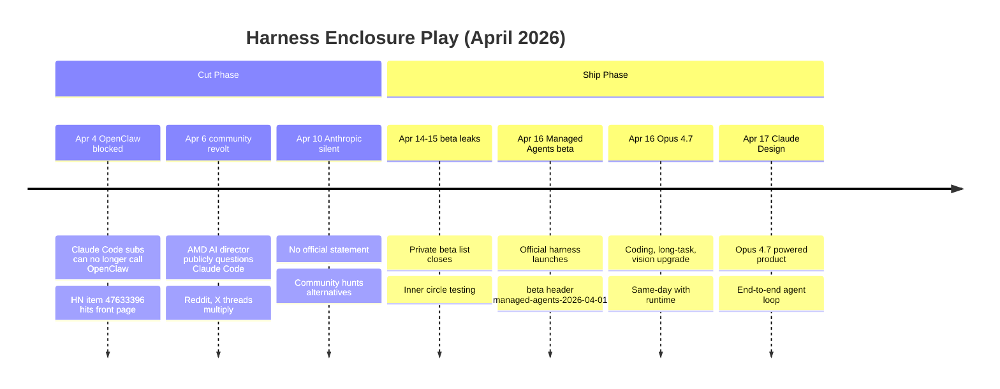
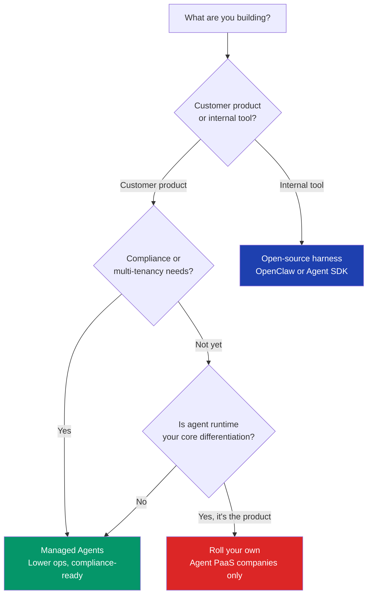

+++
date = '2026-04-24T09:00:00+08:00'
draft = false
title = 'Managed Agents vs OpenClaw: Anthropic Just Enclosed the Harness Layer in 12 Days'
description = 'On April 4 Anthropic blocked OpenClaw. On April 16 they shipped Managed Agents beta. 12 days between killing the community harness and shipping the official one. Platform enclosure, not coincidence. A field guide to the harness layer war and what it means for your stack.'
toc = true
tags = ['Claude Managed Agents', 'OpenClaw', 'Harness Engineering', 'AI Agent', 'Anthropic']

keywords = ['claude managed agents beta', 'openclaw banned anthropic', 'managed agents vs openclaw migration', 'harness layer lock in', 'anthropic platform enclosure', 'ai agent runtime 2026', 'claude agent sdk alternative', 'vendor lock in ai harness', 'agent runtime pricing', 'build vs buy agent harness']

[[params.faqItems]]
question = "Should OpenClaw users migrate to Managed Agents immediately?"
answer = "Not immediately — short term fine, mid term you must evaluate, long term depends on business shape. OpenClaw still works if you swap Claude Code subscription auth for a direct API key. The migration conversation is mid-term: if you are shipping a product that needs SOC2, multi-tenancy, or customer-facing SLA, Managed Agents pays for itself in reduced ops. If it's an internal tool or research POC, stay on OpenClaw — the migration cost outweighs the benefit."

[[params.faqItems]]
question = "How do Managed Agents and OpenClaw compare on cost?"
answer = "Managed Agents adds a managed runtime surcharge on top of API tokens (billed per sandbox CPU-second and memory GB-minute), projected to run 20-40 percent of token cost at GA. OpenClaw self-hosted only pays API tokens plus your own infrastructure. Managed looks 2x more expensive on paper. Fold in the engineering time to maintain isolation, timeouts, log plumbing, and retries — if that is more than 40 person-days per year, Managed Agents is already cheaper."

[[params.faqItems]]
question = "Is a multi-agent workflow built on OpenClaw portable to Managed Agents?"
answer = "No clean port. Managed Agents uses the official Anthropic harness (beta header `managed-agents-2026-04-01`), which differs from OpenClaw on sub-agent routing, skill loading, and MCP tool injection. Three migration work items dominate: rewrite multi-agent orchestration in Anthropic-native calls, refactor skills into `built_in_tools` plus `custom_tools` composition, translate CLAUDE.md-style context into `system` plus `context_files`. Budget 5-10 person-days for a medium-complexity project, not a weekend."

[[params.faqItems]]
question = "When does rolling your own harness make sense in 2026?"
answer = "Only three team shapes should roll their own: (1) infrastructure companies whose core business is selling agent runtime — if agent PaaS is your product, you need control. (2) Large engineering orgs with extreme custom needs (think Amazon internal, or a trading firm with millisecond-level latency requirements). (3) Research labs building experimentation platforms. For the other 90 percent, a rolled harness is an obligation to chase a trillion-dollar company's quarterly release cadence with your 3-engineer team. Don't."

[[params.faqItems]]
question = "Does this enclosure pattern apply to OpenAI and Google stacks too?"
answer = "Yes, and it's happening in parallel. Same month: OpenAI shipped Agents SDK 2.0 and Responses API, Google promoted Vertex AI Agent Builder to GA, Cursor 3 bundled a tighter IDE harness, Salesforce launched Headless Agent 360. Every major vendor is claiming the harness layer. The framing in this post — model is not the moat, harness is, and your choice is an ecosystem bet — holds regardless of which vendor you use. Replace 'Managed Agents' with 'Assistants API v2' for OpenAI or 'Vertex Agent Builder' for Google and the reasoning is identical."
+++


On April 4, Anthropic quietly blocked Claude Code subscriptions from calling OpenClaw. No announcement, no blog post. The community found out when the tools stopped working. The [HN thread](https://news.ycombinator.com/item?id=47633396) climbed past a thousand points in 48 hours. On April 16 — 12 days later — Anthropic launched Managed Agents in public beta: an official agent runtime with sandboxing, built-in tools, and a new beta header `managed-agents-2026-04-01`. Same day, Opus 4.7 shipped. Next day, Claude Design. A full agent-product stack landed in 48 hours, 12 days after the community alternative was cut off.

That's not coincidence. That's platform enclosure.

**Anthropic ran a textbook enclosure play in 12 days: kill the community harness, ship the official one.** If you're still benchmarking models to decide your 2026 AI stack, you're looking at the wrong layer. The harness — the runtime container that makes a model behave like a persistent agent — is where the 2026 competition is happening. Your harness choice is now an ecosystem bet, and vendor lock-in at the harness layer will dominate the next 18 months of AI platform economics. This post unpacks the 12 days, the enclosure logic, and how to make your harness choice with open eyes.

## The 12-Day Timeline



The April 4 block was notable for what it wasn't: no announcement, no reasoning. The Claude Code team silently changed policy on what subscription tokens could call. Support responses were vague enough to read as "policy update" without committing to an explanation. Contrast that with the April 16 launch — coordinated social, blog post, changelog, sample code, docs. The two postures were not accidental. The block was deliberately quiet because any explanation would reveal the enclosure logic; the launch was loud because it needed to capture the demand that the block had fabricated.

The April 16 product bundle is equally revealing. **Managed Agents is the center of gravity — not Opus 4.7, not Claude Design.** Managed Agents is a runtime container: Anthropic hosts the sandbox, pre-installs built-in tools (file system, shell, web browsing, code execution), and gives you an async API to submit an agent definition (system prompt, tool list, memory policy). Your agent runs in their sandbox, not yours. The Opus 4.7 release is packaging — long-task capability and vision improvements are exactly the features Managed Agents needs to differentiate. Shipping the model and runtime on the same day signals that Anthropic considers them a bundled product, not independent releases.

## Why OpenClaw Had to Die

To see why OpenClaw was intolerable to Anthropic, look at what the harness layer actually is.

### The Harness Layer in One Paragraph

If you've read [Harness Engineering: 60 days in](/posts/ai/2026-03-30-harness-engineering-guide/) or [Build the 6 Layers Backwards](/posts/ai/2026-04-18-harness-six-layers-reverse-build/), skip this. For new readers: models do reasoning; harness does everything else — context management, tool calling, step orchestration, error recovery, cross-turn memory, observability. A naked model can handle a 30-second one-shot. A well-built harness lets the same model complete 2-hour agentic coding tasks. Anthropic had Claude Code (a developer CLI) but no enterprise-grade harness product. That slot was empty until OpenClaw filled it.

### Three Things OpenClaw Did That Anthropic Couldn't Tolerate

**First, OpenClaw captured enterprise value**. OpenClaw's commercial clawdhub sold agent runtime directly to enterprises. Those enterprises paid OpenClaw, not Anthropic — even though the underlying model calls still hit Anthropic's API. Pricing power and customer relationship lived in OpenClaw's layer. An enterprise picking an agent platform said "we run on OpenClaw" — not "we run on Claude." The model became a commodity input in someone else's branded product.

**Second, OpenClaw built a plugin ecosystem**. By early April, clawdhub hosted 1,200+ skills, including tavily-search, find-skills, proactive-agent, and dozens of domain-specific components. I've written about the operational pitfalls in [OpenClaw Automation Pitfalls](/posts/ai/2026-02-14-openclaw-automation-pitfalls/) and the enterprise multi-agent setup in [OpenClaw Multi-Agent Setup Guide](/posts/ai/2026-04-02-openclaw-multi-agent-setup-guide/). Ecosystems have flywheel dynamics: once plugin count crosses a threshold, the platform becomes unreplaceable. **OpenClaw was 6-12 months away from being the VS Code of the agent era.** If Anthropic had let that happen, Claude would be "one of several model providers you can configure in OpenClaw" — a demotion from platform to commodity.

**Third, OpenClaw was actively reducing model lock-in**. In Q1 2026, OpenClaw shipped multi-model routing — the same skill could run on Claude, GPT-5, or DeepSeek. This was the knife edge. If users could one-click swap Claude for GPT-5, Anthropic's pricing power evaporated. The multi-model feature didn't just coexist with Anthropic's business model; it actively undermined it.

Anthropic had to move before OpenClaw's ecosystem crossed the critical mass threshold. **April 4 was not retaliation. It was a land grab, timed to happen before the opposing army was big enough to defend the territory.**

### The Timing Was Not Random

April 4 is exactly 12 days before the Managed Agents public beta. Managed Agents was in private beta from late March — the beta list was already stable by April 1. **Twelve days lets the community vent, amplifies demand for an alternative, and primes the launch reception.** By April 16, OpenClaw users had spent almost two weeks on HN and Reddit complaining about the lack of options. Managed Agents arrived as the answer to a question that Anthropic had themselves posed by blocking the prior answer.

We've seen this play before in tech history. Microsoft vs Netscape (bundled IE). Apple vs Flash (deprecated Flash, pushed HTML5 + App Store). AWS vs ElasticSearch (forked ES into OpenSearch). The pattern is consistent enough to be a playbook: **when a third party captures a key layer in your ecosystem, you have two options — acquire or extinguish. Anthropic chose extinguish.**

## Managed Agents: Capabilities, Pricing, Limits

Now the product itself. Three dimensions: what it does, what it costs, what it can't do.

### Capabilities: A Locked Sandbox

Managed Agents gives you a runtime container hosting a Claude-powered agent with these built-in tools:

- **File system** — sandboxed read/write with a 1 GB quota during beta
- **Shell** — command execution with network calls restricted to an allowlist
- **Web browsing** — controlled Playwright-based browser, no intranet access
- **Code execution** — Python and Node runtimes
- **Memory store** — key-value persistence across turns

Agent definition is submitted via API:

```python
from anthropic import Anthropic

client = Anthropic()
agent = client.managed_agents.create(
    model="claude-opus-4-7",
    system="You are a senior code reviewer.",
    tools=["file_system", "shell", "web_browsing"],
    custom_tools=[my_slack_notify],
    extra_headers={"anthropic-beta": "managed-agents-2026-04-01"},
)
run = client.managed_agents.runs.create(
    agent_id=agent.id,
    input="Review PR #123 and post findings to Slack",
)
```

The API shape matters. **You no longer have a synchronous `messages.create` loop.** You submit a run, Anthropic executes asynchronously, you receive the result via webhook or polling. This is the fundamental shift from stateless API to hosted runtime, and it forces architectural choices on your application side — retry logic, idempotency, webhook security, result caching — that your prior Anthropic integration never needed.

### Pricing: The Runtime Is a New Line Item

Three-tier pricing structure:

1. **Token fees** — identical to standard API, at Opus 4.7 list rates
2. **Runtime fees** — sandbox CPU-seconds plus memory GB-minutes, discounted during beta but projected at 20-40 percent of token cost at GA
3. **Built-in tool fees** — web browsing charged per page, code execution per CPU-second, separately metered

Back-of-envelope for a complex code review: 5 minutes of execution, 20K output tokens, 10 page loads. Opus 4.7 during beta lands around USD 0.80-1.20 per invocation. The same task on OpenClaw self-hosted costs roughly USD 0.30-0.50 in tokens plus your infrastructure. **Managed looks 2x more expensive until you fold in operations labor. Once you do, the break-even point is somewhere between 40 and 80 person-days of ops per year.** Most product teams hit that threshold in their first quarter of running an agent system in production.

### Limits: The Beta Reality

Five hard limits worth writing down:

- **Max 4-hour runs** during beta (will relax at GA)
- **10 concurrent runs** default, raisable for enterprise
- **No sandbox persistence** across runs — state must go through the memory store
- **No intranet access** — private APIs require a custom tool bridge
- **No custom Docker images** — you get the Anthropic-provided runtime, period

The last one is the ceiling. **You cannot customize the execution environment.** Need a specific Python wheel? Can't install it. Need a custom browser fingerprint? Not supported. Managed Agents is a general-purpose sandbox optimized for general tasks. Specialized workloads hit the wall fast. This is the first thing I expect Anthropic to fix — custom runtimes in 6-9 months, probably tied to enterprise pricing.

## What OpenClaw Users Should Actually Do

You have three real paths, not two.

**Path 1: Stay on OpenClaw, switch auth to API key.** The April 4 block targeted Claude Code subscription tokens specifically — direct API keys still work. Swap your OpenClaw auth config from OAuth to API key, billing moves from subscription to pay-per-use, functionality is unaffected. This is the zero-cost holding pattern. Appropriate if you want to watch the situation develop without commitment.

**Path 2: Migrate to Managed Agents.** If you ship a product, charge customers, or need SOC2, the ops savings justify migration cost. Three work blocks: rewrite multi-agent orchestration into Anthropic-native calls, refactor skills into `built_in_tools` plus `custom_tools`, translate CLAUDE.md rules into `system` plus `context_files`. Budget 5-10 person-days for a medium project. **Migration priority: compliance needs > multi-tenancy > personal use > pure internal tooling.** If you're in the first two buckets, migrate now. The last two can wait.

**Path 3: Migrate to the Claude Agent SDK or another OSS harness.** If you want to stay on Anthropic but not get locked into Managed Agents, the [Claude Agent SDK](/posts/ai/2026-04-17-claude-agent-sdk-guide/) is Anthropic's lower-level SDK — you build the harness, the SDK provides Claude-specific primitives. Maximum control, maximum engineering load. LangGraph and CrewAI are also candidates, though neither has OpenClaw's plugin depth. This path suits teams that need Claude model access but cannot accept the Managed Agents execution model (async runs, no custom runtime, vendor hosting).

**My recommendation**: before deciding, answer one question — **does your business care who owns the agent runtime?** If customers care, if compliance cares, if your business model depends on it — go to Managed Agents or roll your own. If none of those apply, stay on OpenClaw with an API key and save yourself the migration. Don't migrate because of community sentiment. Migrate because the technical reality of your product demands it.

## The Broader Harness Enclosure: April 2026 in Context

Zoom out. The same month every major vendor made a harness-layer play:

| Vendor | April 2026 move | Harness slot claimed |
|--------|-----------------|----------------------|
| Anthropic | Managed Agents beta + OpenClaw block | Official agent runtime |
| OpenAI | Agents SDK 2.0 + Responses API | Developer workflow framework |
| Cursor | Composer 2 + tighter IDE binding | IDE-side agent runtime |
| Salesforce | Headless Agent 360 | Enterprise app integration |
| Microsoft | Copilot Studio upgrade | Low-code orchestration |
| Google | Vertex AI Agent Builder GA | Cloud-side agent platform |

**No new frontier models launched this month.** Opus 4.7 was an incremental upgrade, GPT-5 and Gemini 3 held steady. Every major competitive move was in the harness layer. That alignment is not subtle — it's the clearest signal yet that the industry has shifted its competitive frontier.

I covered one slice of this in [wshobson/agents deep dive](/posts/ai/2026-04-20-wshobson-agents-deep-dive/) — a 33.9K-star plugin marketplace is itself an ecosystem bet on the harness layer. [OpenClaw vs AI Agents](/posts/ai/2026-03-05-openclaw-vs-ai-agents/) benchmarks different open-source harnesses. [OpenClaw Multi-Agent Guide](/posts/ai/2026-02-23-openclaw-multi-agent-guide/) is the operational playbook for running community harnesses in production. **The connective tissue across these articles: every harness choice a developer makes today is a bet on which ecosystem survives the next 18 months.**

Why is it the harness, not the model? Because model quality has flattened. Opus 4.7, GPT-5, and Gemini 3 are within 5 points on major coding benchmarks — users perceive them as roughly equivalent for most tasks. When the product commoditizes, the only differentiation left is how the product gets integrated into work — the harness. **Whichever vendor builds the stickiest harness, with the deepest ecosystem and the highest switching cost, wins the next cycle.** Blocking OpenClaw was about denying competitors the ability to build an ecosystem on top of Claude. The strategic objective is permanence — make the harness layer Anthropic's, not a third party's.

## A Three-Tier Harness Decision Framework

Here's the actionable output — a decision framework you can apply today.



**Tier 1: Managed Agents (official).** For most customer-facing products. Pros: compliance, low ops, sync with Claude model updates. Cons: vendor lock-in, runtime cost, limited customization. **Pick this for: SaaS products, enterprise AI apps, customer-facing services.**

**Tier 2: Open-source harness (Claude Agent SDK, OpenClaw, LangGraph).** For internal tooling, research, budget-constrained work. Pros: control, multi-model portability, lower direct cost. Cons: ops burden, compliance work, dependent on community health. **Pick this for: internal automation, R&D tools, personal projects.** Be clear-eyed: the OpenClaw block proved that **the long-term viability of any OSS harness is not under your control.** Any harness can be cut off at the platform layer on 24 hours' notice. Plan your abstractions so a forced migration is 2 weeks of work, not 2 quarters.

**Tier 3: Roll your own harness.** Three team shapes only — infrastructure companies selling agent PaaS, large orgs with extreme custom needs, research labs. **For 90 percent of teams, roll-your-own is the wrong choice.** You will spend a year chasing one quarter of Anthropic's release cadence. Context management, retry logic, observability plumbing — every hour spent on these is an hour not spent on your product. If you're not one of the three shapes above, don't.

**A today-usable checklist:**

- Customer product + compliance → Managed Agents
- Customer product + no lock-in concerns → Managed Agents (lower ops wins)
- Customer product + must support multiple models → LangGraph or Claude Agent SDK with a model abstraction
- Internal tool + team knows Claude → Claude Agent SDK
- Internal tool + need plugin ecosystem → OpenClaw (API key path)
- Agent runtime is the product → Roll your own
- Everything else → Don't roll your own

## What Happens Next: 18-Month Predictions

If the enclosure analysis is right, these are likely outcomes in the next 18 months.

**First, OpenClaw pivots or gets acquired.** With the subscription funnel cut, OpenClaw's growth curve is halved. Three futures: pivot to full multi-model (decouple from Anthropic entirely), get acquired by Anthropic or Microsoft cheap, or wither. I'd bet on "multi-model pivot plus Microsoft acquisition" — Microsoft needs a counter to Managed Agents and GitHub Copilot Chat isn't it.

**Second, Managed Agents opens custom runtimes.** The "no custom Docker image" limit is untenable for enterprise. Expect Anthropic to open custom runtimes in 6-9 months, gated behind enterprise pricing. This is when the real revenue inflection happens — custom runtimes are how enterprise committed spend gets justified.

**Third, cross-vendor harness APIs standardize.** OpenAI, Google, and Anthropic Managed Agent products will converge on API shape — async runs, built-in tools, sandbox. Once shape standardizes, **abstraction middleware returns**. LiteLLM did this for the model layer; the harness equivalent is coming. This is a real opportunity window for whoever ships it cleanly. If you're looking for a venture-scale bet in AI infrastructure, this is the slot.

**Fourth, enterprise AI budgets shift.** Today, roughly 95 percent of enterprise AI spend is model tokens. In 18 months, expect that to drop to 70 percent with 30 percent flowing to harness runtime, compliance, and observability. Every company building these adjacent layers captures the H2 2026 to 2027 spending wave.

**April 4 was not a policy tweak; it was a signal flare to the entire industry: the harness layer's window is closing, either claim a position or pick a side.** The Managed Agents beta 12 days later is Anthropic's official answer. Every developer now faces the same question: **which vendor's harness is my project betting on?** The answer should be explicit, documented, and made with full awareness that the ground under every OSS harness can shift in 24 hours. Bet with open eyes.

---

## Further Reading

- [Harness Engineering: After 60 Days, the Model Was the Least Important Part](/posts/ai/2026-03-30-harness-engineering-guide/)
- [The 60-Line CLAUDE.md Rule: Context Layer Engineering](/posts/ai/2026-03-31-harness-claudemd-guide/)
- [Harness Engineering: Build the 6 Layers Backwards](/posts/ai/2026-04-18-harness-six-layers-reverse-build/)
- [Sub-Agent Architecture for AI Coding Harnesses](/posts/ai/2026-04-13-harness-subagent-architecture/)
- [Claude Agent SDK: Scope and Boundaries](/posts/ai/2026-04-17-claude-agent-sdk-guide/)
- [OpenClaw Automation Pitfalls: Three Skills Aren't a Stack](/posts/ai/2026-02-14-openclaw-automation-pitfalls/)
- [OpenClaw Multi-Agent Setup Guide](/posts/ai/2026-04-02-openclaw-multi-agent-setup-guide/)
- [OpenClaw vs AI Agents: OSS Harness Capability Comparison](/posts/ai/2026-03-05-openclaw-vs-ai-agents/)
- [wshobson/agents Deep Dive: Where the 33.9K-Star Moat Actually Is](/posts/ai/2026-04-20-wshobson-agents-deep-dive/)

External links:

- [HN discussion: Anthropic no longer allowing Claude Code subscriptions to use OpenClaw](https://news.ycombinator.com/item?id=47633396)
- [Anthropic Managed Agents official docs](https://docs.anthropic.com/en/docs/agents/managed-agents)
- [Anthropic API Beta Headers reference](https://docs.anthropic.com/en/api/beta-headers)
