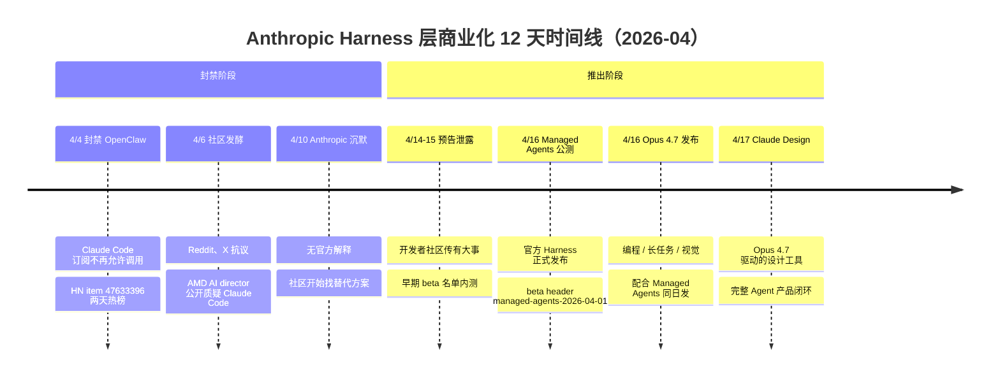
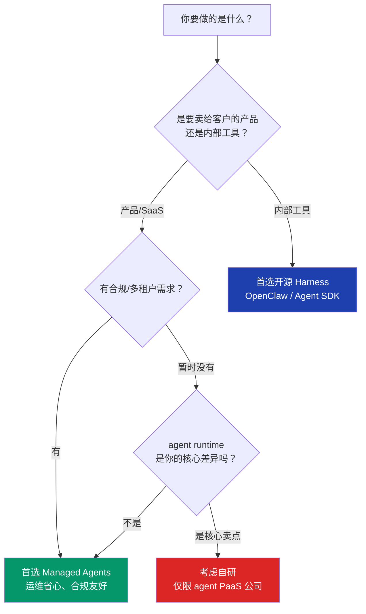

+++
date = '2026-04-24T09:00:00+08:00'
draft = false
title = 'Claude Managed Agents 发布 vs OpenClaw 被封：12 天组合拳看懂 Harness 层战争'
description = '4 月 4 日 Anthropic 封禁 OpenClaw，4 月 16 日官方推出 Managed Agents 公测。12 天组合拳不是巧合，是 Harness 层商业化围剿的明确信号。本文复盘时间线、拆解护城河逻辑，给出 OpenClaw 老用户的迁移决策框架。'
toc = true
tags = ['Claude Managed Agents', 'OpenClaw', 'Harness Engineering', 'AI Agent', 'Anthropic']

keywords = ['Claude Managed Agents 公测', 'OpenClaw 被封禁', 'Anthropic 封禁 OpenClaw', 'Managed Agents 和 OpenClaw 区别', 'Claude Harness 商业化', 'Harness 层护城河', 'OpenClaw 迁移 Managed Agents', '自研 Agent Harness 值不值', 'AI Agent 运行时', 'Claude Code 订阅封禁']

[[params.faqItems]]
question = "OpenClaw 用户要不要立刻迁到 Managed Agents？"
answer = "短期不用、中期必须评估、长期看你的业务性质。短期 OpenClaw 本身没死（只是 Claude Code 订阅不能再调它），用 API key 的场景还能跑；中期要评估的是：你现在的 harness 复杂度是不是已经够用 Managed Agents 覆盖、你愿不愿意把运行容器交给 Anthropic。如果是做产品要上线、要 SOC2、要多租户——Managed Agents 省下的运维成本远大于 lock-in 成本。如果是内部工具、研究 POC、或你本来就有运维团队——继续 OpenClaw 完全合理。"

[[params.faqItems]]
question = "Managed Agents 和 OpenClaw 价格差多少？"
answer = "Managed Agents 公测阶段在 API token 费用之外加了 managed runtime surcharge（按沙箱 CPU/内存分钟计费），预计 GA 后 runtime 成本在 token 费用的 20-40% 区间。OpenClaw 自托管只付基础设施（你自己的服务器）+ API token。表面看 OpenClaw 便宜，实际要算你花多少工时维护隔离、超时、清理、日志——如果这部分超过 40 人天每年，Managed Agents 已经划算。"

[[params.faqItems]]
question = "以前用 OpenClaw 写的多 Agent 工作流，Managed Agents 能平滑迁过去吗？"
answer = "不能平滑。Managed Agents 是 Anthropic 官方 harness（beta header `managed-agents-2026-04-01`），和 OpenClaw 的 Sub-Agent 调度模型、Skill 机制、MCP 注入方式都不一样。迁移的真实工作量主要在三块：(1) 多 Agent 编排逻辑要重写成 Anthropic 的原生调用，(2) Skills 要拆成 Managed Agents 支持的 built-in tools + custom tools 组合，(3) Claude.md 风格的上下文规则要翻译成 Managed Agents 的 system prompt + context files。粗估一个中等复杂度的项目迁过去 5-10 人天，不是一天能搞定的。"

[[params.faqItems]]
question = "Harness 自研值不值？三类团队的判断框架"
answer = "只有三种团队该自研：(1) 核心业务就是卖 agent runtime 的基础设施公司（比如你本身在做 agent PaaS），(2) 有极端定制需求且团队规模足够的大厂（比如 Amazon 内部、字节某些线），(3) 研究机构做实验平台。绝大部分公司不该自研——你自研一年相当于追着 Anthropic 一个季度的更新跑。对 90% 的团队来说，选型顺序是：官方 Managed Agents 优先 → 能接受的开源 harness（Claude Agent SDK、LangGraph）次之 → 自研只在前两个都不满足时才考虑。"

[[params.faqItems]]
question = "如果我不用 Claude，Managed Agents 的逻辑对 OpenAI / Gemini 用户有参考价值吗？"
answer = "有，而且正在同时发生。4 月同期 OpenAI 发布 Agents SDK 升级、Cursor 3 绑定更紧的 harness、Salesforce 推 Headless 360——所有大厂都在抢 Harness 层。对 OpenAI 用户，Assistants API v2 + Agents SDK 就是对标 Managed Agents 的产品。对 Gemini 用户，Vertex AI Agent Builder 是同样的位置。本文的判断框架（模型不是护城河、Harness 才是、选型是生态站队）对任何模型 vendor 都适用。"
+++


4 月 4 日，Anthropic 封禁了 Claude Code 订阅用户调用 OpenClaw 的权限。社区炸锅，HN 讨论帖 [item 47633396](https://news.ycombinator.com/item?id=47633396) 两天内涨到一千多 point。4 月 16 日——整整 12 天之后——Anthropic 推出 Managed Agents 公测，自己做的官方 Agent Harness，带沙箱、带 built-in tools、API 上新加了 beta header `managed-agents-2026-04-01`。同一天 Opus 4.7 也发了，编程、长任务、高分辨率视觉三条线全部升级。第二天 4 月 17 日，Claude Design 发布，Opus 4.7 驱动的设计产品。

这不是巧合。

**这是 Anthropic 12 天打完的一套组合拳：一手封禁社区方案、一手推出官方 Harness。** 如果你只盯着模型在看谁强谁弱，你错过了 2026 年 AI 工程真正重要的那场战争——**Harness 层才是下一个商业化战场**。Agent 时代，模型不是护城河。运行容器才是。这篇文章我要做的，就是把这 12 天拆开来看清楚：时间线、动机、对 OpenClaw 用户的实际影响、以及对整个开发者生态的长期信号。

## 时间线：12 天里到底发生了什么

我把 4 月 4 日到 4 月 17 日的关键节点整理成了一张图。先看全貌，再逐天拆解。



**4/4 的封禁动作本身没有官方声明**——Anthropic 是从 Claude Code 订阅的调用策略层面静默阻断 OpenClaw，用户发现工具突然不工作了才把事情闹上 HN。官方客服的回复模糊到接近"政策调整"，没解释具体理由。这个处理方式和 4/16 发布 Managed Agents 的宣传力度形成了刺眼的对比——一件事低调到让人怀疑是不是不敢承认，另一件事高调到 Anthropic 所有社交账号齐上阵。

**4/16 的产品组合也值得细看**。Managed Agents 是这套组合里真正重要的那块——它不是一个新模型、不是一个新 IDE，是一个**运行容器**。Anthropic 给你一个沙箱，里面预装了 file system、shell、web browsing 等 built-in tools，你只需要把你的 agent 定义（system prompt、tools、memory 策略）通过 API 提交过去，剩下的执行、隔离、超时、日志、容错全部由 Anthropic 托管。你不再需要自己维护 Docker、不需要自己搭隔离、不需要自己做 step orchestration——这些原本是 OpenClaw、Claude Agent SDK、LangGraph 这些框架在做的事。

**Opus 4.7 同日发并不是单纯的升级节奏**。它是 Managed Agents 的配套——长任务能力升级让 Agent 可以在沙箱里跑更久不中断，高分辨率视觉让浏览器自动化更稳，这两点都是 Managed Agents 这个运行容器的使用场景。把模型升级和运行容器发布绑在同一天，Anthropic 在告诉市场：**模型和 Harness 是绑定的产品，不是两个独立的东西**。

## 为什么 OpenClaw 必须死

要理解 Anthropic 为什么不能让 OpenClaw 继续跑，得先搞清楚 Harness 这一层到底是什么。

### Harness 层是什么

如果你已经读过我之前的 [Harness Engineering 60 天](/posts/ai/2026-03-30-harness-engineering-guide/) 和 [Harness 六层倒着建](/posts/ai/2026-04-18-harness-six-layers-reverse-build/)，这段你可以快速跳过。对新读者用一句话解释：**模型负责推理，Harness 负责让推理真的跑起来**——上下文管理、工具调用、步骤编排、错误恢复、跨轮次记忆、可观测性，这六层加起来就是 Harness。一个没有 Harness 的模型只能完成 30 秒内的 one-shot 任务；一个设计良好的 Harness 能让同一个模型完成 2 小时的复杂编程任务。

Anthropic 内部有 Claude Code 这个 Harness，但 Claude Code 是面向开发者的 CLI 工具、不是面向企业部署的运行时。真正企业级、多租户、带 SLA 的 Harness 产品，他们以前没有。**这个位置之前是 OpenClaw 在占着**。

### OpenClaw 到底做了什么让 Anthropic 忌惮

过去 6 个月，OpenClaw 做了三件让 Anthropic 难受的事：

**第一，吃了企业侧的价值捕获**。OpenClaw 的商业版 clawdhub 直接卖 agent runtime，企业客户付费给 OpenClaw、而不是付 Anthropic 的 API 费用——虽然底层调的还是 Anthropic API，但**定价权和客户关系都在 OpenClaw 手里**。企业选型一个 agent 平台，用户记住的是"我们用的是 OpenClaw"，不是"我们用的是 Claude"。

**第二，建立了插件生态**。到 4 月初 clawdhub 上已经有 1200+ 个 Skill，包括 tavily-search、find-skills、proactive-agent 这些高频组件。我在 [OpenClaw 自动化别踩坑](/posts/ai/2026-02-14-openclaw-automation-pitfalls/) 里写过这些组件怎么配、[OpenClaw 多 Agent 配置指南](/posts/ai/2026-04-02-openclaw-multi-agent-setup-guide/) 里讲了企业级部署的细节。一旦这个生态规模继续长大，OpenClaw 就是 Agent 时代的 VS Code——宿主层不可替代。**Anthropic 如果不出手，明年看到的就是 Claude 被降级为"OpenClaw 可选的模型 provider 之一"**。

**第三，开始降低 vendor lock-in**。OpenClaw 去年底开始支持 Anthropic + OpenAI + DeepSeek 多模型切换，同一个 Skill 可以在不同模型 provider 之间路由。这是最刺痛 Anthropic 的——如果用户可以一键把 Claude 换成 GPT-5，Anthropic 的定价权就没了。

Anthropic 必须在 OpenClaw 的插件生态突破临界点之前动手。**4/4 的封禁不是报复、是抢在对方上规模之前夺回控制权**。

### 为什么偏偏是 4 月 4 日

这个时间点也不是随机的。公开信息显示 Managed Agents 的 beta 名单大约在 3 月底开始内测，4/16 是预定的公测日期。**4/4 封禁 = 给自己留 12 天时间让社区情绪冷却 + 让内测 beta 用户跑完一轮数据**。等 Managed Agents 发布时，OpenClaw 用户已经在社区骂了 12 天、对替代方案的需求达到顶峰——Managed Agents 以"官方解决方案"的姿态出场，吃到的需求是预先培育好的。

这套打法在商业史上见过太多次：微软对 Netscape、苹果对 Flash、AWS 对 ElasticSearch、现在是 Anthropic 对 OpenClaw。**手法的一致性说明这不是个别公司的坏脾气，这是平台型公司的结构性行为**——当某个第三方开始在你的生态里抢关键位置时，你只有两个选择：收购或者扼杀。Anthropic 选了后者。

## Managed Agents 是什么：能力边界与定价

看了动机，现在看产品本身。我把 Managed Agents 公测的技术细节按三个维度拆开：能力、计费、限制。

### 能力：一个带锁的沙箱

Managed Agents 给你一个运行容器，里面是一个 Claude 驱动的 agent，预装以下 built-in tools：

- **File system**：读写沙箱内文件，有配额限制（公测期默认 1GB）
- **Shell**：执行 shell 命令，网络受限到白名单域名
- **Web browsing**：受控浏览器访问（基于 Playwright），不能访问内网
- **Code execution**：Python / Node 执行环境
- **Memory store**：跨轮次的 key-value 持久化

你的 agent 定义通过 API 提交：

```python
from anthropic import Anthropic
client = Anthropic()
agent = client.managed_agents.create(
    model="claude-opus-4-7",
    system="You are a senior code reviewer.",
    tools=["file_system", "shell", "web_browsing"],
    custom_tools=[my_slack_notify],
    extra_headers={"anthropic-beta": "managed-agents-2026-04-01"}
)
run = client.managed_agents.runs.create(
    agent_id=agent.id,
    input="Review PR #123 and post findings to Slack"
)
```

注意这个 API 的形态——**你不再有 "messages.create" 这种同步 loop**，你交一个 run task、Anthropic 异步执行、通过 webhook 或轮询拿结果。这是托管 runtime 和 stateless API 的根本区别，对应用架构的影响不小。

### 计费：runtime 成本是新增项

定价结构三层：

1. **Token 费用**：和普通 API 一样，按 Opus 4.7 当前定价
2. **Runtime 费用**：按沙箱的 CPU 秒 + 内存 GB-分钟计费，公测期有优惠但 GA 后估计是 token 费用的 20-40%
3. **Built-in tools 费用**：web browsing 按页面数、code execution 按 CPU 秒单独计

粗算一次复杂 code review 任务：5 分钟执行时间 + 20K token 输出 + 10 次网页访问，Opus 4.7 公测价估计 0.8-1.2 美元一次。OpenClaw 自托管同样任务只付 token 费用（大约 0.3-0.5 美元）加上你自己的服务器成本——**表面上 Managed Agents 贵两倍，实际上你要把运维工时折进来才是真实对比**。

### 限制：公测期的现实约束

公测期有几个硬限制必须知道：

- **单 run 最长 4 小时**（GA 后会放宽）
- **并发 run 数默认 10 个**（企业客户可以申请提高）
- **沙箱不能持久化状态**（跨 run 的持久化只能用 memory store）
- **内网访问完全禁止**（企业私有 API 要通过 custom tool 桥接）
- **无 custom Docker image**（只能用 Anthropic 预置的 runtime）

最后一条最关键——**你不能自定义运行环境**。你的 agent 需要一个特殊的 Python 包？对不起，装不上。你需要一个定制的浏览器指纹？做不到。Managed Agents 给的是一个"通用沙箱"，用于通用任务很好，用于特化场景就是天花板。

## 对 OpenClaw 老用户的影响：三种迁移路径

如果你现在手里有一个跑在 OpenClaw 上的项目，4/4 之后你的选择其实是三条路。

**路径一：留在 OpenClaw，切到 API key**。Claude Code 订阅不能调了，但直接用 Anthropic API key 还是可以的——把配置里的 auth 方式从 OAuth 换成 API key，功能完全不受影响，只是账单从订阅走改成 API 按量走。这是零成本过渡方案，适合短期观望。

**路径二：迁到 Managed Agents**。如果你是做产品、要对客户收费、要过 SOC2 审计，Managed Agents 的运维省心值得迁移成本。迁移主要三块工作：多 Agent 编排逻辑要重写成 Anthropic 原生调用、Skills 要拆成 built-in + custom tools 组合、CLAUDE.md 风格的规则要翻译成 system prompt + context files。一个中等复杂度项目估计 5-10 人天。**迁移优先级：有合规要求 > 有多租户 > 只是个人用 > 纯内部工具**。

**路径三：迁到 Claude Agent SDK 或其他开源 harness**。如果你既不想被 Anthropic 绑住、又不想继续依赖 OpenClaw，可以看 [Claude Agent SDK 入门](/posts/ai/2026-04-17-claude-agent-sdk-guide/)。Agent SDK 是 Anthropic 出的官方 SDK 但是偏底层——你自己搭 harness、SDK 只提供 Claude 特有的能力封装，控制力最强但工作量最大。LangGraph、CrewAI 也是候选，不过都没有 OpenClaw 的插件生态那么丰富。

**我的具体建议**：做决策前先问自己一个问题——**你的项目对"agent runtime 属于谁"这件事敏感吗？** 如果客户在意、合规在意、商业模式依赖这件事——去 Managed Agents 或自研。如果不敏感——留在 OpenClaw 用 API key 最省事。不要因为社区情绪跟风迁移。

## Harness 层的商业化博弈：同期发生的事

单看 Anthropic 的 12 天可能以为是偶然，但把视角拉开，**4 月同期所有主流厂商都在抢 Harness 层**：

| 厂商 | 4 月动作 | 抢的是什么位置 |
|------|---------|--------------|
| Anthropic | Managed Agents 公测 + 封 OpenClaw | 官方 agent runtime |
| OpenAI | Agents SDK 2.0 + Responses API | 开发者侧工作流框架 |
| Cursor | Composer 2 + 深度绑定 harness | IDE 侧 agent 运行时 |
| Salesforce | Headless Agent 360 | 企业应用侧 agent 集成 |
| Microsoft | Copilot Studio 升级 | 低代码侧 agent 编排 |
| Google | Vertex AI Agent Builder GA | 云侧 agent 平台 |

**这些产品有一个共同点：它们都是 Harness 层，不是模型层**。没人在这个月发新模型——Opus 4.7 只是 Claude 家的小升级，GPT-5、Gemini 3 都没动静。但每家都在围绕"如何让模型跑成一个持续的 agent"这件事做产品。

我在 [wshobson/agents 深度挖掘](/posts/ai/2026-04-20-wshobson-agents-deep-dive/) 里写过 33.9K Star 的插件市场，本质上也是 Harness 层的生态争夺——只不过是从"插件目录"这个切片切进去。[OpenClaw vs AI Agents](/posts/ai/2026-03-05-openclaw-vs-ai-agents/) 对比的是不同 harness 的能力边界。[OpenClaw 多 Agent 指南](/posts/ai/2026-02-23-openclaw-multi-agent-guide/) 讲的是怎么用社区 harness 搭多 agent 系统。**这些文章的共同底色都是：开发者现在做的每一个 harness 选型，都是在押注谁活得过下一个 18 个月**。

为什么是 Harness 层？因为模型本身开始同质化了。Opus 4.7、GPT-5、Gemini 3 在编程基准上的差距已经不到 5 分，用户感知上基本打平。差异化的唯一出路是"用模型怎么干活"——也就是 Harness。**谁能让开发者在自己的 Harness 里留下来、建出生态、产生切换成本，谁就赢了下一轮**。Anthropic 封 OpenClaw 的深层逻辑就是这个——不让其他人在 Claude 之上建生态。

## 我的判断：三层 Harness 选型框架

看完 12 天时间线和同期动作，我给一个可操作的选型框架。我把所有 Harness 方案分成三档，按"控制力 vs 运维成本"两个维度排列：



**第一档：官方 Managed Agents**。适用于大多数要对外卖产品的团队。优点：合规、省运维、和 Claude 模型升级同步。缺点：vendor lock-in、runtime 成本、自定义能力弱。**推荐给：SaaS 产品、企业 AI 应用、面向外部客户的服务**。

**第二档：开源 Harness（Claude Agent SDK、OpenClaw、LangGraph）**。适用于内部工具、研究项目、预算敏感场景。优点：控制力强、可多模型切换、成本低。缺点：运维成本、合规工作量、依赖社区活跃度。**推荐给：内部自动化、研发工具、个人项目**。但要心里清楚——**Anthropic 这次封 OpenClaw 已经证明开源 harness 的长期可持续性不由你说了算**，任何一个开源 harness 都可能在某一天被平台方切断访问。选型时就要想好"它被封了我怎么办"。

**第三档：自研 Harness**。只有三种团队该走这条路——做 agent PaaS 的基础设施公司、有极端定制需求的大厂、研究机构。**对 90% 的团队，自研是错的**。你自研一年追不上 Anthropic 一个季度的更新，花在 context management、retry logic、observability 这些基础功上的时间完全没回报。如果你不是上面三种团队，不要做这个决定。

**一个可以今天就用的决策清单**：
- 对外卖产品 + 要合规 → Managed Agents
- 对外卖产品 + 不在意 lock-in → Managed Agents（省运维）
- 对外卖产品 + 要多模型切换 → LangGraph 或 Claude Agent SDK
- 内部工具 + 团队熟 Claude → Claude Agent SDK
- 内部工具 + 要插件生态 → OpenClaw（API key 方案）
- 核心业务是 agent PaaS → 自研
- 其他所有场景 → 不要自研

## 接下来 18 个月会发生什么

最后给一个预测——如果你信我上面的分析，那么未来 18 个月这几件事大概率会发生：

**第一，OpenClaw 会转型或被收购**。被 Anthropic 封了订阅入口之后，OpenClaw 的增长曲线已经被拦腰斩。它要么转向多模型（完全脱钩 Anthropic）、要么被 Anthropic 或 Microsoft 低价收购、要么逐渐凋零。我押的是"转多模型 + 被微软收购"，因为微软正好缺一个对抗 Managed Agents 的牌。

**第二，Managed Agents 会开放 custom runtime**。公测期不能自定义 Docker image 是硬伤，企业客户的第一需求就是把自己的私有包带进沙箱。Anthropic 6-9 个月内会开这个口子，但会绑定到企业版定价。

**第三，同类产品会标准化**。OpenAI、Google、Anthropic 的 Managed Agents 类产品会在 API 形态上趋同——都是异步 run、built-in tools、sandbox。一旦标准化，**多供应商抽象层会回来**——类似 LiteLLM 对模型层做的事，harness 层也会有对应的中间件。这是机会点。

**第四，企业会为 Harness 付更多钱**。现在企业 AI 预算里 95% 在 token 费用上，18 个月后这个比例会降到 70%，剩下 30% 流向 Harness 运行时、合规、可观测性等配套。所有做这些配套的公司会吃到 2026 年下半年到 2027 年的红利。

**4/4 封 OpenClaw 不是一次普通的策略调整，是 Anthropic 向整个行业发了一个信号：Harness 层的窗口期正在关闭，要么占位、要么站队**。12 天后的 Managed Agents 发布是给行业看的第一个官方答案。接下来轮到每个开发者回答自己的问题：我的项目，押在谁的 Harness 上？

---

## 延伸阅读

- [Harness Engineering：60 天后我发现，模型是最不重要的部分](/posts/ai/2026-03-30-harness-engineering-guide/)
- [60 行 CLAUDE.md 铁律：Harness 上下文层的工程规范](/posts/ai/2026-03-31-harness-claudemd-guide/)
- [Harness 六层倒着建：80% 稳定性来自第 5、6 层](/posts/ai/2026-04-18-harness-six-layers-reverse-build/)
- [Sub-Agent 架构：AI 编程 harness 的多 agent 组织](/posts/ai/2026-04-13-harness-subagent-architecture/)
- [Claude Agent SDK 入门：官方 SDK 的能力边界](/posts/ai/2026-04-17-claude-agent-sdk-guide/)
- [OpenClaw 自动化别踩坑：装 3 个 Skill 不等于真的好用](/posts/ai/2026-02-14-openclaw-automation-pitfalls/)
- [OpenClaw 多 Agent 配置完整指南](/posts/ai/2026-04-02-openclaw-multi-agent-setup-guide/)
- [OpenClaw vs AI Agents：开源 harness 能力边界对比](/posts/ai/2026-03-05-openclaw-vs-ai-agents/)
- [wshobson/agents 深度挖掘：79 个插件的护城河在哪](/posts/ai/2026-04-20-wshobson-agents-deep-dive/)

外部链接：

- [HN 讨论帖：Anthropic no longer allowing Claude Code subscriptions to use OpenClaw](https://news.ycombinator.com/item?id=47633396)
- [Anthropic Managed Agents 官方文档](https://docs.anthropic.com/en/docs/agents/managed-agents)
- [Anthropic API Beta Headers 参考](https://docs.anthropic.com/en/api/beta-headers)
