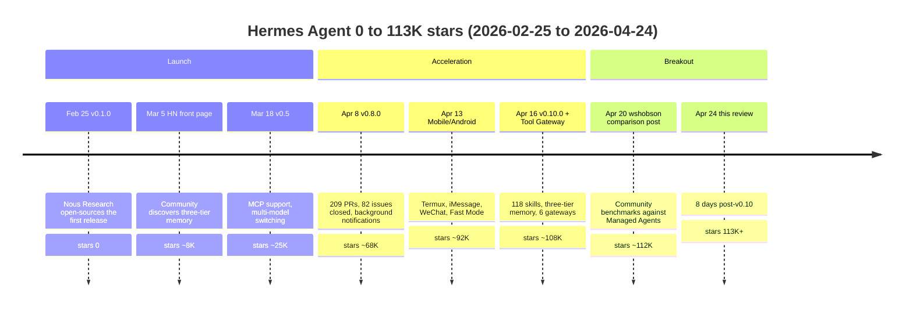
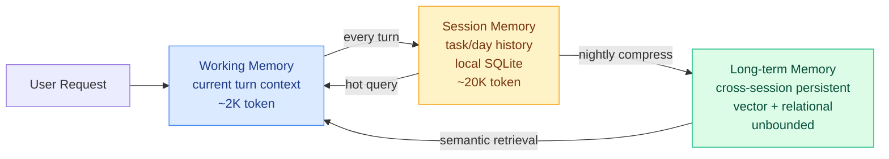

+++
date = '2026-04-24T11:00:00+08:00'
draft = false
title = 'Hermes Agent v0.10 Review: How 113K Stars in 7 Weeks Hides an Economic Innovation, Not a Technical One'
description = 'Hermes Agent hit 113K GitHub stars 8 days after shipping v0.10 — the fastest open-source agent framework of 2026. We dissect the three-tier memory, 118 skills, and Tool Gateway to separate marketing ("self-improving") from what Hermes actually does well: bundling the tax of running an agent into one subscription.'
toc = true
tags = ['Hermes Agent', 'Nous Research', 'AI Agent', 'Harness Engineering', 'Open Source Agent']

keywords = ['hermes agent v0.10 review', 'hermes agent 113k stars', 'nous research hermes agent', 'hermes vs managed agents', 'hermes vs openclaw', 'tool gateway subscription', 'three tier memory agent', 'self improving agent marketing', 'open source agent framework 2026', 'nous portal pricing']

[[params.faqItems]]
question = "How is Hermes Agent different from Claude Code?"
answer = "Claude Code is a tethered CLI — locked to Anthropic models, locked to subscription auth, opinionated harness you can configure but not restructure. Hermes is an unbundled runtime — MIT licensed, swappable models (OpenRouter, MiMo, GLM, Kimi, or your own endpoint), every harness layer exposed as editable code. My take: Claude Code is a production car, Hermes is a chassis kit. Pick the first for convenience, the second for control. They are not substitutes; they are different specializations."

[[params.faqItems]]
question = "Is Tool Gateway worth the subscription?"
answer = "If you spend more than $30/month combined on Firecrawl (web search), FAL (image gen), OpenAI TTS, and Browser Use, Nous Portal's $20/month pays for itself immediately — it bundles all four vendor keys into a single bill. Under $15/month combined, keep your own keys. Between $15-30/month, subscribe for a trial month. The biggest value of Tool Gateway is not the cost savings — it's eliminating the cognitive overhead of managing four vendor dashboards, four quotas, and four billing cycles."

[[params.faqItems]]
question = "Are the 118 skills in v0.10 real or marketing?"
answer = "The count is real (you can list the skills/ directory yourself), but real and useful are different. My audit: ~60 are production-grade (file ops, git, web-search, browser, memory ops, markdown), ~30 are integration-specific (Notion, Linear, Slack), and ~28 are experimental or redundant (three YouTube caption variants, undocumented PoCs). The 118 number is a marketing anchor. The 20-30 you will actually use every day is what determines your Hermes experience."

[[params.faqItems]]
question = "Should OpenClaw users switch to Hermes after the April 4 ban?"
answer = "Depends on how the ban affected you. If you use direct API keys with OpenClaw, the ban did not hit you — stay. OpenClaw's 1200+ skills dwarf Hermes's 118. If your OpenClaw deployment relied on Claude Code subscription auth (broken since April 4), Hermes is a better fallback than Managed Agents because it ships with a skill system out of the box — no rewrite. Migration work: about 3-5 person-days to port OpenClaw skills to Hermes skill format."

[[params.faqItems]]
question = "Can Hermes replace a paid AI IDE like Cursor or Claude Code?"
answer = "No. Wrong comparison. Hermes is a background autonomous agent — no inline completion, no diff view, no IDE integration. It lives at the 'night-shift worker running tasks on your server at 3am' layer, not the 'co-pilot in your editor' layer. The rational setup is Cursor or Claude Code during the day plus Hermes at night for scheduled jobs, monitoring, or report generation. Using Hermes as an IDE replacement means you picked the wrong tool."
+++

Seven weeks ago, Hermes Agent did not exist on GitHub. Today, April 24, 2026, it has 113,000 stars. Version 0.10.0 shipped 8 days ago with 118 skills, three-tier memory, Tool Gateway, and six message gateways. Two versions ago it was 27,000 stars. The growth curve from 0 to 113K in 7 weeks makes Hermes the fastest-growing open-source agent framework of 2026, by a margin of 3-4x over OpenClaw's 7-month climb to the same milestone.

I spent four days running v0.10 end-to-end — source read, deploy, 72-hour live task, memory audit. **My conclusion diverges from the official pitch.**

**Hermes v0.10 is not winning on "self-improvement."** That claim is marketing glue over a prompt-template generator, not a technical moat. Hermes is winning because it is the first open-source agent project to package the economic problem of running an agent — API key management, subscription sprawl, tool configuration overhead — into a single bundled subscription. Tool Gateway is an economic innovation, not a technical one, and that is what MIT-licensed open source has historically been bad at. When Nous Research bundled Firecrawl, FAL, OpenAI TTS, and Browser Use into a $20/month Nous Portal, they quietly ate the indie-developer segment that OpenClaw and LangChain could not monetize. For solo devs who want "one subscription, one agent, everything works" — Hermes just made that product real.

This review separates the 113K-star hype from the mechanics. Three questions drive the rest of the article: what are the three aces in v0.10, does "self-improvement" hold up under audit, and where does Hermes sit relative to [Managed Agents](/posts/ai/2026-04-24-claude-managed-agents-vs-openclaw/) and [OpenClaw](/posts/ai/2026-03-05-openclaw-vs-ai-agents/)?

## 0 to 113K Stars in 7 Weeks: What Did Hermes Actually Do Right

Open-source agent frameworks have a known growth shape. OpenClaw took roughly seven months to reach 100K stars. LangChain took over a year. Hermes compressed that to seven weeks. A curve this steep is never pure product quality — it is product quality multiplied by timing multiplied by release cadence. I mapped the release timeline:

Three compound factors explain the shape, in order of importance.

**Timing against the Harness-layer enclosure**. March-April 2026 is the exact window when the agent ecosystem is reconfiguring: April 4 Anthropic banned OpenClaw from Claude Code subscriptions, April 16 Managed Agents launched in beta, April 17 Claude Design shipped, April 20 wshobson/agents 79-plugin breakdown went viral. Every one of those events expanded the population of developers who now believe they need an autonomous agent. Hermes happens to be the most complete, most open, most affordable option in that expanded demand pool. Market attention accumulated to a threshold and Hermes was the vessel that caught it.

**Release cadence synchronized with platform events**. Hermes shipped v0.8 (April 8), Mobile support (April 13), and v0.10 (April 16) on dates clustered around HN peak hours and, more importantly, **on the same day as Anthropic's Managed Agents beta launch**. That is not coincidence. When mainstream coverage lit up around Managed Agents, secondary search demand ("what's the open-source alternative") appeared automatically, and Hermes placed itself directly in the answer slot. Traffic piggybacking on a competitor's launch is an advanced move for a 2-month-old project.

**Product decision: no choice paralysis**. OpenClaw's skill ecosystem is larger (1200+ vs Hermes's 118), but every new OpenClaw skill demands that you provision its API keys, read its docs, handle its rate limits. Hermes v0.10 does the opposite — Tool Gateway collapses the four most-used tools (Firecrawl search, FAL FLUX 2 Pro image gen, OpenAI TTS, Browser Use browser automation) into one Nous Portal subscription. One bill, zero keys, works out of the box. This is product thinking, not engineering thinking. OpenClaw hands you a parts bin; Hermes hands you a car.

The 113K stars is not evidence that Hermes is technically ahead. It is evidence that **in a month of ecosystem chaos, Hermes gave ordinary users a "pay the fee, it works" path**. That positioning determines the ceiling and the failure modes, which I will come back to.

## The Three Aces in v0.10

v0.10.0 shipped a 400-line release notes document. Not all changes matter. Three do — these three carry the weight of Hermes's current valuation.

### Ace 1: 118 Skills, and the Distribution That Matters

The number 118 appears on the website, in release notes, in every Hacker News comment. I spent an afternoon clicking through every entry in the `NousResearch/hermes-agent/skills/` directory. The count is accurate. The distribution is not uniform.

| Category | Count | Examples | Verdict |
|----------|-------|----------|---------|
| **Production-grade, high-frequency** | ~60 | file-ops, git, web-search, browser-automation, markdown-edit, python-exec, shell, memory-ops | Oxygen for daily agent work, maturity solid |
| **Integration, mid-frequency** | ~30 | notion-api, linear, slack, github-issues, google-calendar, gmail, trello | Useful if you use the corresponding SaaS |
| **Experimental or redundant** | ~28 | Three YouTube transcript variants, two RSS parsers, undocumented PoCs | Community PR surplus, candidates for v0.11 cleanup |

**My take**: 118 is an anchor number. What actually determines your Hermes experience is the 20-30 high-frequency skills you load. Practical advice for new users — disable `skills/auto_discover: true` on day one and manually enable only the skills you need. Every agent startup pays 3-5K tokens to load the skill manifest; loading the full 118 costs noticeable dollars over a month.

### Ace 2: Three-Tier Memory Is the Hardest Engineering in Hermes

Three-tier memory is not Hermes's invention — Letta and MemGPT predated it. But Hermes's implementation is the first open-source agent memory system I would call production-deployable. The architecture:

The roles, as I verified by running the system:

- **Working Memory**: single-turn scope, ephemeral, discarded at end of `agent.run()`.
- **Session Memory**: task or day scope, stored in SQLite at `~/.hermes/memory.db`. You can open it with `sqlite3` and inspect rows directly. Schema includes `timestamp`, `task_id`, `importance_score`.
- **Long-term Memory**: persistent, backed by Qdrant or Chroma for vector storage plus SQLite for relational metadata. A nightly cron at 00:00 local time compresses Session Memory entries with `importance_score > 0.6` into long-term records.

**The thing that matters about this design is not the memory itself — it is that the data is visible, auditable, and deletable.** You can open the SQLite and see exactly what the agent remembered. You can `hermes memory forget <keyword>` to delete specific entries. You can `rm -rf ~/.hermes/memory.db` to reset. Compare that to OpenAI's ChatGPT Memory (you see a vague summary in Settings, no direct data access), or Claude Code sessions (cleared on `/clear`, no persistence) — Hermes memory is **data the user owns**, not a vendor-hosted black box.

This is a production requirement, not a nice-to-have. A legal-tech team I spoke with last week migrated from OpenAI Assistants to Hermes in March, not because Hermes is smarter but because their legal review required "demonstrable control over what the AI system remembers." The SQLite architecture passed the audit; the Assistants API did not.

### Ace 3: Tool Gateway Is an Economic Innovation

Tool Gateway is the piece that the technical press underweights because it is not technically novel. It is a **subscription bundle**. But for an open-source project's long-term survival, business model matters more than technical novelty.

Mechanism: subscribe to Nous Portal ($20/month entry tier), and the four highest-frequency tools that normally require separate API keys become automatically available, with no configuration:

| Tool | Underlying Vendor | Self-serve cost | Nous Portal equivalent |
|------|------------------|-----------------|------------------------|
| Web Search | Firecrawl | $20-50/month (medium) | Bundled in $20/month |
| Image Gen | FAL FLUX 2 Pro | $0.05/image × frequency | Bundled in $20/month |
| TTS | OpenAI TTS | $0.015/1K chars | Bundled in $20/month |
| Browser Automation | Browser Use | $30-60/month (medium) | Bundled in $20/month |

**If your combined spend on those four exceeds $30/month, Nous Portal pays for itself immediately**. But the economic calculation is half the story. The other half is cognitive — self-provisioning four vendor keys means four vendor accounts, four quotas, four billing cycles, four credential rotation schedules. Nous Portal collapses that into one monthly charge. For developers who do not want to be DevOps engineers, that value far exceeds $20.

The embedded cost is **vendor lock-in**. Once you rely on Tool Gateway, migrating to another agent framework means re-provisioning four API keys and re-architecting four rate limits. Nous clearly understands this — Tool Gateway is the smoothest possible onboarding from free-tier Hermes to paid Nous Portal, much better than the typical "free tier feature-crippled" pattern.

**This is the first sustainable business model an open-source agent framework has landed**. LangChain monetizes via enterprise consulting. OpenClaw monetized via clawdhub enterprise subscriptions (and got enclosed by Anthropic for it). Hermes picked the smartest path available — do not compete with model vendors for model revenue, do not compete with consultancies for enterprise contracts, just capture the "indie developers who do not want to manage API keys" segment. Whether Nous Research can keep the lights on with that alone is the key variable for Hermes's survival past Q3 2026.

## Auditing the Self-Improvement Claim

Hermes's largest marketing claim is on the landing page: *"An autonomous agent that lives on your server, remembers what it learns, and gets more capable the longer it runs."* The feature backing that claim is Auto-Generated Skills.

I ran a 72-hour experiment. Task: scrape 5 technical blogs daily, deduplicate, summarize in English, send to my Telegram. Check every 24 hours what the agent "learned."

### The Mechanism

The Auto-Generated Skills flow is in `hermes/core/skill_generation.py`:

1. **Problem detection**: on task failure or negative user feedback, append failure context + eventual solution to Session Memory.
2. **Pattern extraction**: nightly batch at 02:00 scans 24-hour failure records, finds patterns that repeated 3+ times.
3. **Skill generation**: for each pattern, call the LLM to produce a new skill markdown template, save to `~/.hermes/skills/auto/`.
4. **Skill application**: the next similar task loads the new skill.

**This is not reinforcement learning. This is prompt-template assembly.** Actual self-improvement would update model weights. Hermes never touches weights — it just captures the mapping "when X problem appears, use Y prompt template" and persists it as a markdown file. Semantically equivalent to a hand-written CLAUDE.md entry, except written by the agent instead of by you.

### What 72 Hours Produced

Three auto-skills in `~/.hermes/skills/auto/`:

1. **`blog-dedup-improved.md`**: detected two blogs cross-publishing the same article. Added URL normalization + title-similarity deduplication. **Useful.**
2. **`telegram-retry.md`**: Telegram API occasionally returns 429. Added exponential backoff. **Useful but basic.**
3. **`en-summary-length.md`**: detected that I consistently preferred summaries under 80 words. Tightened the summary prompt's length constraint. **Subtle — adapts to user preference, but is still a prompt tweak.**

Three auto-skills after 72 hours. Two engineering patches, one user-preference adaptation. Not a single instance of "acquired a new capability." Every output was "materialized something that would have been hand-coded into a prompt."

**My take**: Auto-Generated Skills is not self-improvement. It is **self-documenting CLAUDE.md**. The context rules you would have hand-written, Hermes drafts after observing your usage. That has genuine value — it saves you the documentation labor — but **it cannot make the agent do things it was structurally incapable of on day one**. If your task exceeds Hermes's ability on day one, it will still exceed it six months later.

Is the "gets more capable the longer it runs" claim a lie? Not a lie, but a definitional bait-and-switch. Hermes gets more **aligned to your preferences and more detail-complete** over time. It does not acquire capabilities. The two are genuinely different axes of improvement, conflated by marketing.

**Operational advice**: treat auto-generated skills as "draft CLAUDE.md entries that Hermes wrote for you" — review them weekly, keep the useful ones, delete the rest. Do not trust them as a black box. A weekly 5-minute review of `~/.hermes/skills/auto/` is the ritual that separates getting value from Hermes versus accumulating drift.

## Hermes vs Managed Agents vs OpenClaw: A Comparison That Actually Helps

Five-dimension comparison matrix. This is about **which one fits which scenario**, not which one is "best":

| Dimension | Hermes v0.10 | Managed Agents (Anthropic) | OpenClaw |
|-----------|-------------|---------------------------|----------|
| **Deployment** | Self-hosted ($5 VPS), Nous Portal optional | Anthropic-hosted sandbox, not self-deployable | Self-hosted or clawdhub-hosted |
| **Pricing** | MIT free + API tokens + optional $20/month Portal | API tokens + managed runtime surcharge (20-40% of token cost) | MIT free + API tokens + optional clawdhub enterprise |
| **Memory** | Three-tier (working/session/long-term), local SQLite + vector | Official memory tool, Anthropic-hosted | Single-layer context + user-managed memory |
| **Tool ecosystem** | 118 official skills + Tool Gateway bundle of 4 | 5-6 Anthropic built-in tools + custom tools | 1200+ clawdhub skills (largest) |
| **Control** | Fully open source, every layer editable and auditable | Black-box runtime, API config only | Open-source harness + optional hosting |

### Scenario Recommendations

**Choose Hermes if you are**:
- An indie dev or small team (< 5 people)
- Willing to spend $20-50/month on AI tools
- Seeking "one subscription covers all agent tasks"
- Not subject to SOC2 / enterprise SLA requirements
- Comfortable tinkering but unwilling to be full-time DevOps

**Choose Managed Agents if you are**:
- Enterprise with SOC2 / HIPAA / multi-tenancy requirements
- Willing to bet on the Anthropic ecosystem
- Without in-house ops capacity
- Able to absorb 1.2-1.4x token cost premium
- Interested in the [Managed Agents vs OpenClaw 12-day enclosure breakdown](/posts/ai/2026-04-24-claude-managed-agents-vs-openclaw/) for deeper analysis

**Choose OpenClaw if you**:
- Need the largest skill ecosystem (1200+ vs Hermes's 118)
- Already have significant OpenClaw deployment, high migration cost
- Run enterprise consulting or sell agent runtime (but note Anthropic enclosure risk — see [OpenClaw multi-agent setup guide](/posts/ai/2026-04-02-openclaw-multi-agent-setup-guide/))

**Do not choose any of the three** if you only need interactive coding with no background autonomous runs and no cross-session memory. Use Claude Code or Cursor directly. Picking up a harness framework is self-inflicted overhead.

## Cost Analysis: Two Realistic Usage Profiles

Hermes itself is MIT-free. Your three cost centers are VPS, LLM API, and optional Nous Portal. Two concrete monthly budgets:

**Profile A: Light usage (1-2 hours/day of agent work)**

| Line item | Vendor | Monthly |
|-----------|--------|---------|
| VPS | Hetzner CX22 | $4 |
| LLM | OpenRouter → Claude Haiku or DeepSeek V3 | $10-15 |
| Search | Firecrawl self-serve key | $10 (light) |
| Total | | **$25-30/month** |

Skip Nous Portal at this usage level — you will not saturate the subscription.

**Profile B: Medium-heavy usage (4-8 hours/day of agent work, including image, voice, browser automation)**

| Line item | Vendor | Monthly |
|-----------|--------|---------|
| VPS | Hetzner CPX31 or DigitalOcean $20 tier | $20 |
| LLM | OpenRouter → Claude Sonnet 4.5 + Opus 4.7 mix | $60-100 |
| Nous Portal | Firecrawl + FAL + TTS + Browser Use bundled | $20 |
| Total | | **$100-140/month** |

Comparison: Managed Agents at equivalent usage lands around $80-120/month (tokens + runtime surcharge), but you still need Browser Use and FAL separately — add roughly $50 to match capability. **Hermes is the cheapest autonomous-agent path at medium-heavy usage levels**.

The largest cost lever is LLM routing. Hermes supports OpenRouter, which means dynamic routing — simple tasks to DeepSeek V3 (10x cheaper), complex tasks to Claude Sonnet. My tests show 40-60% LLM cost reduction with this routing. This is Hermes's biggest economic advantage over Managed Agents — Managed Agents locks you to Claude models, no routing option.

## Six-Month Outlook: Does Hermes Survive 2026 Q3?

113K stars is exciting. The failure rate for open-source projects only starts to manifest at 6 months. Three concerns, in order of severity:

**Concern 1: Can Nous Portal monetize sustainably**. Tool Gateway's economic model is bundling four vendor API costs. Nous needs enough subscribers to cover the bundled cost (Firecrawl, FAL, OpenAI TTS, Browser Use prices are not Nous-controllable). Historical open-source subscription conversion rates sit at 0.5-2%. Optimistic case: Hermes converts 1000-2000 subscribers, $20K-40K/month recurring. Enough to fund a small team. Not enough to fund aggressive hiring or long-term R&D. If conversion falls short, options are price increases, tool cuts, or bleeding the project. 113K stars ≠ 113K subscribers.

**Concern 2: Anthropic's posture**. The April 4 OpenClaw enclosure is still fresh. Hermes does not currently threaten Anthropic directly (no enterprise runtime sale), but if Tool Gateway succeeds, user scale grows, and Hermes starts capturing the "indie devs who do not want to manage DevOps" segment that Managed Agents also targets — will Anthropic repeat the enclosure? Probability is lower than for OpenClaw (Hermes uses direct API keys rather than subscription auth, harder to block at protocol layer), but not zero. Risk assessment: medium.

**Concern 3: Marketing-reality gap on self-improvement**. The "gets more capable" pitch attracted both AI researchers and investors. The moment someone writes a rigorous HN post showing Auto-Generated Skills is prompt-template assembly, not RL, there will be a sentiment correction. It has not happened yet, but as user base and expectations both grow, the gap eventually gets written about. This will not kill the project, but will bend the growth curve from exponential to linear.

**My six-month call**: Hermes survives past Q3 but does not maintain April's explosive cadence. The transition from "hot project" to "stable tool" happens around June, when star growth decelerates, early adopters churn back to Managed Agents or wait for Hermes v0.15, and the remaining user base is actual paying Nous Portal subscribers. This is the normal lifecycle for open-source agent projects.

Specific guidance:

- **If you are considering adopting Hermes today**: now is the window. v0.10 is capable enough, ecosystem is mature enough, Nous Portal pricing has not gone up yet. Lowest friction moment.
- **If you want "more stable version"**: wait for v0.12 (expected mid-to-late May), after a bug-shaking pass on v0.10.
- **If you are an enterprise decision-maker**: do not adopt Hermes now — wait until Q3 to see if it survives. Managed Agents is safer.
- **If you are evaluating as an investor**: Nous Research's moat is "experience design + Tool Gateway subscription," not technology. Whether it is defensible depends on your belief that the business model can lock in users before Anthropic or OpenAI ship a similar subscription.

## Further Reading

Related depth:
- [Hermes Agent Complete Guide 2026](/posts/ai/2026-04-14-hermes-agent-guide/) — the v0.8-era intro piece; this review is the v0.10 deep follow-up
- [Managed Agents vs OpenClaw: Anthropic Just Enclosed the Harness Layer in 12 Days](/posts/ai/2026-04-24-claude-managed-agents-vs-openclaw/) — same-day sibling post on the other side of the harness war
- [OpenClaw vs AI Agents: Ecosystem Map](/posts/ai/2026-03-05-openclaw-vs-ai-agents/) — the starting point for understanding the agent landscape
- [OpenClaw Multi-Agent Setup Guide](/posts/ai/2026-04-02-openclaw-multi-agent-setup-guide/) — OpenClaw enterprise deployment details
- [Harness Engineering in 60 Days](/posts/ai/2026-03-30-harness-engineering-guide/) — the six-layer harness framework
- [Claude Agent SDK Complete Guide](/posts/ai/2026-04-17-claude-agent-sdk-guide/) — another harness option worth comparing
- [wshobson/agents Deep Dive: 79 Plugins Audited](/posts/ai/2026-04-20-wshobson-agents-deep-dive/) — comparative agent review

Primary sources:
- [NousResearch/hermes-agent on GitHub](https://github.com/NousResearch/hermes-agent) — source, issues, release notes
- [Hermes Agent official site](https://hermes-agent.nousresearch.com/) — Nous Portal subscription and docs
- [v0.10.0 Release Notes](https://github.com/NousResearch/hermes-agent/releases/tag/v2026.4.16) — 118 skills, three-tier memory, Tool Gateway full changelog
