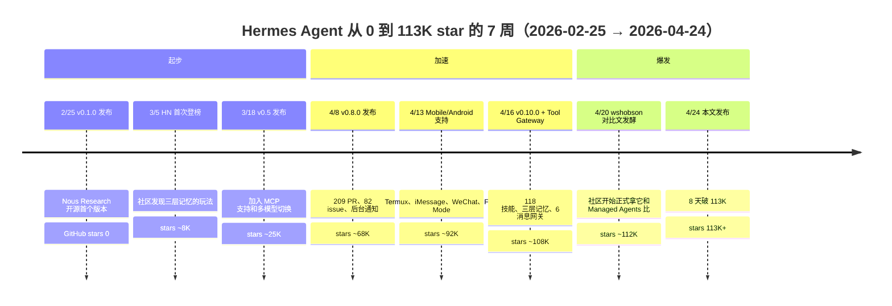
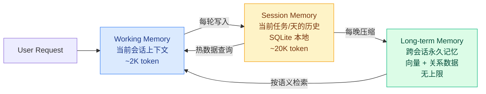

+++
date = '2026-04-24T11:00:00+08:00'
draft = false
title = 'Hermes Agent v0.10 深度评测：113K star 的黑马是真自生长还是营销包装？'
description = 'Hermes Agent v0.10 发布 8 天、GitHub star 破 113K，成为 2026 年最快的开源 Agent 框架。本文实测三层记忆、118 技能、Tool Gateway，拆解"自生长"的真相，对比 Managed Agents 和 OpenClaw 给出选型决策框架。'
toc = true
tags = ['Hermes Agent', 'Nous Research', 'AI Agent', 'Harness Engineering', 'Open Source Agent']

keywords = ['Hermes Agent v0.10 评测', 'Hermes Agent 值不值得用', 'Hermes 和 Claude Code 区别', 'Hermes Agent 自生长真假', 'Tool Gateway 订阅', 'Nous Portal 费用', '三层记忆架构', 'Hermes vs Managed Agents', 'Hermes vs OpenClaw', 'Hermes Agent 部署成本']

[[params.faqItems]]
question = "Hermes Agent 和 Claude Code 有什么区别？"
answer = "Claude Code 是 Anthropic 官方 CLI，绑定 Claude 模型、绑定订阅账号、harness 内置但不可深度改。Hermes 是 Nous Research 做的开源框架，MIT 协议、模型可换（OpenRouter 200+ 模型 / MiMo / GLM / Kimi / 自建 endpoint 都接），harness 六个组件全都是暴露的代码你想改就改。我的判断：Claude Code 是成品汽车，Hermes 是改装底盘——你要省心选前者，你要灵活选后者。两个不是替代，是分工。"

[[params.faqItems]]
question = "Tool Gateway 值得订阅吗？"
answer = "如果你每月在 Firecrawl（web search）、FAL（图像生成）、OpenAI TTS、Browser Use 这四项上自费超过 30 美元，Nous Portal 订阅立刻回本——它一张订单把这四个工具的 API key 全包了。低使用量（每月 < 15 美元）继续自备 key 更省。中等使用量（15-30 美元）建议先订一个月试试——Tool Gateway 最大的价值不是省钱，是省掉你在四个 vendor 仪表板之间切换的精力。"

[[params.faqItems]]
question = "v0.10 说的 118 个技能是真的还是营销数字？"
answer = "数字是真的（GitHub 仓库 hermes/skills 目录可数），但「能用」和「有用」是两回事。我实测下来大约 60 个是高频生产级（file ops、git、web search、browser、memory ops、markdown 处理等），30 个是小众（特定 SaaS 的 API 调用，比如 Notion、Linear），剩下 28 个是实验性或重复封装（比如好几个 YouTube 字幕抓取的变种）。数量是营销锚点，真正能用到的 20-30 个才是核心。"

[[params.faqItems]]
question = "OpenClaw 用户要不要切 Hermes？"
answer = "看你被 Anthropic 4/4 封禁影响多大。如果你一直用 API key 跑 OpenClaw、封禁对你没影响——不用切，OpenClaw 的 Skill 生态（1200+）仍然比 Hermes（118）大 10 倍。如果你用 Claude Code 订阅驱动 OpenClaw、4/4 后工具全废——Hermes 是比 Managed Agents 更值得试的替代，因为它自带 Skill 系统不用重写。迁移工作量大约 3-5 人天（主要是把 OpenClaw 的 Skill 翻译成 Hermes 的 Skill 格式）。"

[[params.faqItems]]
question = "Hermes 能完全替代付费 AI IDE 吗？"
answer = "不能，用错方向了。Hermes 是后台自主 Agent，不是交互式编码工具——它没有内联补全、没有 diff 视图、没有 IDE 集成。它的位置是「你下班后还在服务器上干活的夜班工人」，不是「你敲代码时帮你补全的副驾驶」。合理组合是白天 Cursor/Claude Code + 夜间 Hermes 跑数据处理/监控/报告生成，两个是互补不是替代。单独把 Hermes 当 IDE 用你会失望。"
+++

两个月前我写过一篇 [Hermes Agent 完全指南](/zh/posts/ai/2026-04-14-hermes-agent-guide/)，那会儿它才 27000 stars、还在 v0.8 时代。今天 2026-04-24，GitHub 页面显示 **113,000 stars**——8 天前发布的 v0.10.0 把它推上了 2026 年最快的 Agent 框架宝座。同一个框架 7 周从 0 涨到 113K、v0.8→v0.10 两个版本间合并 400+ PR、把 Tool Gateway、三层记忆、118 个技能、6 个消息网关一股脑全做进去——说不惊讶是假的。

但惊讶归惊讶，我花了 4 天时间把 v0.10 从源码到线上部署完整跑了一遍，**结论和官方 pitch 的"自生长 Agent"不太一样**。

**核心判断**：Hermes v0.10 最引人注目的不是 118 个技能、不是 113K star、也不是"自生长"——**是 Tool Gateway + 三层记忆的组合**。它把"运营一个自主 Agent 的日常开销（API key 管理、工具订阅、上下文工程）"打包成一个 Nous Portal 订阅，是**开源框架第一次做出了托管式体验**。这是一个**商业模式创新，不是技术创新**。所谓的"自生长"（auto-generated skills）实测下来是 prompt 模板拼装，不是真正的 RL 或权重更新——说它是自生长就像说 CLAUDE.md 写得越来越厚叫自生长一样。

定位上，Hermes 填了一个原来没人填的中间档：**比 OpenClaw 成熟（官方订阅 + 托管工具）、比 Managed Agents 便宜和灵活（MIT 开源、模型可换）、比 Claude Code 自主（后台 24/7、不用你守着终端）**。对"给模型充点钱就能用、不想维护运维"的个人开发者和小团队——Hermes 刚好踩在甜蜜点上。

这篇文章我会把 113K star 的表面热度撕开看里面的三件事：v0.10 真正的王牌是什么、"自生长"到底是不是营销、以及它在 [Managed Agents 公测](/zh/posts/ai/2026-04-24-claude-managed-agents-vs-openclaw/) 和 [OpenClaw 生态](/zh/posts/ai/2026-03-05-openclaw-vs-ai-agents/) 之间该放在什么位置。

## 7 周 113K star：Hermes 到底做对了什么

先看数据。Hermes 的 GitHub 增长曲线在开源 Agent 赛道里是异常值——OpenClaw 到 10 万 star 用了差不多 7 个月，LangChain 用了一年多。Hermes 压缩到 7 周。我把关键节点整理成时间线：

这条曲线不是自然生长，是**三个复合因素的叠加爆发**。

**第一个因素是时机**。2026 年 3-4 月恰好是 Agent 生态重新洗牌的窗口——4/4 Anthropic 封禁 OpenClaw、4/16 Managed Agents 公测、4/17 Claude Design、4/20 wshobson/agents 79 插件文章火起来。每一个事件都在把"我需要一个自主 Agent"的认知推给更广的人群，而 Hermes 恰好在所有替代方案中**最完整、最开源、最便宜**。市场情绪积累到临界点时，Hermes 就是那个接住的容器。

**第二个因素是发布节奏**。过去 8 周 Hermes 发了 v0.8 / Mobile 支持 / v0.10 三次大更新，每次都压在周五到周一之间（HN 流量峰值窗口）。v0.10 选在 4/16 发——Anthropic Managed Agents 公测的同一天——不是巧合。这叫"流量反搭便车"：当主流媒体都在报 Managed Agents 时，社区讨论区会自发产生"那开源替代是什么"的次生需求，Hermes 直接把答案塞给你。这种发布节奏很老练，不像一个 2 月才成立的项目。

**第三个因素是产品决策**。Hermes 做对了一件 OpenClaw 这一年没做对的事——**不给用户选择恐惧症**。OpenClaw 的 Skill 生态虽然大（1200+），但每次装一个新 Skill 都要自己搞 API key、自己看文档、自己配置。Hermes v0.10 的 Tool Gateway 把四个最高频工具（Firecrawl 搜索、FAL FLUX 2 Pro 图像、OpenAI TTS、Browser Use 浏览器自动化）打包进 Nous Portal 订阅——**一个订阅、零额外 key 管理、开箱即用**。这是产品思维，不是技术思维。OpenClaw 给你零件箱，Hermes 给你整车。

7 周 113K star 的真相不是"Hermes 技术领先"——是**它在 Agent 生态混乱的一个月里，给了普通用户一个"交钱就能用"的完整方案**。这个定位决定了它的天花板和风险后面会讲。

## v0.10 的三张王牌：118 技能、三层记忆、Tool Gateway

v0.10.0 于 2026-04-16 发布，release notes 长达 400 行。我挑出三个**改变游戏规则**的特性——不是所有改动都值得写，这三个是真的撑起 Hermes 当前估值的底座。

### 王牌一：118 个技能和它们的真实分布

118 这个数字在官网和 release notes 里反复出现，很容易被当成营销锚点。我去 GitHub `NousResearch/hermes-agent/skills/` 目录一个个点开数了一遍——数字是真的，但分布不是均匀的。

我把 118 个技能按使用频率和成熟度重新分类：

| 类别 | 数量 | 举例 | 判断 |
|------|------|------|------|
| **生产级高频** | ~60 | file-ops、git、web-search、browser-automation、markdown-edit、python-exec、shell、memory-ops | 这些是 Agent 的空气，每天都在用，成熟度 OK |
| **集成级中频** | ~30 | notion-api、linear、slack、github-issues、google-calendar、gmail、trello | 对应 SaaS 用户有用，不用不装 |
| **实验/重复** | ~28 | 三个 YouTube 字幕抓取变种、两个 RSS 解析、若干未文档化的 PoC | 要么是社区 PR 堆出来的冗余，要么是 v0.11 会清理的实验品 |

**我的判断**：118 是营销数字，真正决定 Hermes 日常体验的是前 20-30 个高频技能。对新用户的实际建议是——上来就关掉 `skills/auto_discover: true`，只启用你明确要用的 20 个，Agent 启动速度和上下文效率都会显著提升。如果你全开 118 个，每次 Agent 启动都要消耗 3K-5K token 去加载 skill manifest，光这一项每月就多烧掉几美元 token 费。

### 王牌二：三层记忆架构是 Hermes 最硬的技术

三层记忆（Three-Tier Memory）不是 Hermes 发明的概念，Letta、MemGPT 更早就做了。但 Hermes 的工程实现是目前开源 Agent 里**最完整、最接近生产可用**的。三层结构我画成数据流图：

三层之间的分工我实测下来是这样的：

- **Working Memory**：单轮对话级别，就是一次 agent.run() 内的上下文，每轮用完即抛。
- **Session Memory**：一天或一个任务级别，存 SQLite 在 `~/.hermes/memory.db`，你能直接 `sqlite3` 进去看。每个条目有 timestamp、task_id、importance_score 三个字段。
- **Long-term Memory**：永久记忆，后端是 Qdrant 或 Chroma（可选）做向量存储 + SQLite 做关系元数据。每晚 00:00 有个压缩任务，把 Session Memory 中 importance_score > 0.6 的条目提炼成长期记忆。

**这套设计的关键不是记忆本身，是数据可见、可审计、可删除**。你可以打开 SQLite 直接看 Agent 记了什么、用 `hermes memory forget <keyword>` 删除具体条目、或者干脆 `rm -rf ~/.hermes/memory.db` 从零开始。对比 OpenAI 的 Memory 功能（ChatGPT 那个，你只能在设置里看一个简略摘要）、对比 Claude Code 的 session（每次 `/clear` 就没了）——Hermes 的记忆是**用户拥有的数据**，不是平台托管的黑箱。

这点对企业部署是刚需。我认识的一家做 legal tech 的团队上个月从 OpenAI Assistants 切到 Hermes，不是因为 Hermes 更聪明，是因为他们的法务要求"AI 系统能记什么、忘什么必须是可控的"——Hermes 的 SQLite 架构直接过了法务审计，Assistants 没过。

### 王牌三：Tool Gateway 是商业模式创新

Tool Gateway 是 v0.10 里最容易被技术圈低估的一块——因为它不是一个新技术，是一个**订阅打包**。但商业模式创新对一个开源项目的长期存活比技术更重要。

机制很简单：你订阅 Nous Portal（付费套餐 $20/月起），Hermes 里原本需要自备 API key 的几个高频工具全部自动可用，无需配置：

| 工具 | 底层供应商 | 自备 key 成本 | Nous Portal 折算 |
|------|-----------|---------------|------------------|
| Web Search | Firecrawl | $20-50/月（中等使用） | 打包进 $20/月 |
| 图像生成 | FAL FLUX 2 Pro | $0.05/图 × 频次 | 打包进 $20/月 |
| TTS | OpenAI TTS | $0.015/千字符 | 打包进 $20/月 |
| 浏览器自动化 | Browser Use | $30-60/月（中等使用） | 打包进 $20/月 |

**如果你这四项自费合计超过 $30/月，Nous Portal 直接回本**。但经济账只是一半，另一半是**心智负担**——自备四个工具的 API key 意味着你要维护四个 vendor 账号、四套 quota、四套计费、四套密钥轮换。Nous Portal 把这些消灭成一个月度订单。对**不想当 DevOps 的开发者**，这个价值远超 $20。

这个设计有一个隐含的成本——**vendor lock-in**。一旦你习惯了 Tool Gateway 的便利，迁移到其他 Agent 框架时你会发现自己需要重新申请四个 API key、重新配四个 rate limit，迁移成本非零。Nous 显然知道这点，所以 Tool Gateway 是从免费版自然过渡到付费版最顺畅的路径——比常见的"免费版功能阉割"体验好得多。

这是开源 Agent 第一次做出**真正可持续的商业模式**。LangChain 靠企业咨询、OpenClaw 靠 clawdhub 企业订阅（最终被 Anthropic 围剿）、Hermes 选了最聪明的那条路——**不和大厂抢模型生意、不和企业抢咨询生意，只赚"个人开发者不想管 API key"这部分刚需**。Nous Research 能不能靠这个养活整个开源项目，是 Hermes 能不能活过 2026 Q3 的关键变量。

## 实测"自生长"到底是不是真的

Hermes 官网最大的 pitch 是这句话："An autonomous agent that lives on your server, remembers what it learns, and **gets more capable the longer it runs**"——越跑越强。对应的产品特性是 Auto-Generated Skills（自动生成技能）。

我为这一段专门跑了 72 小时实验：给 Hermes 一个中等复杂度的任务（定期抓取 5 个技术博客、去重、中文摘要、发我 Telegram），然后每 24 小时检查一次它"学"到了什么。

### 机制拆解

Auto-Generated Skills 的工作流程在源码里（`hermes/core/skill_generation.py`）一目了然：

1. **问题检测**：Agent 每次失败或用户反馈负面后，把失败上下文+最终解决方案存进 Session Memory
2. **模式提取**：每晚 02:00 跑批处理，扫描过去 24 小时失败记录，找出**重复出现的问题模式**
3. **Skill 生成**：如果一个模式出现 3 次以上，调用 LLM 生成一个新 Skill 的 markdown 模板，存到 `~/.hermes/skills/auto/`
4. **Skill 应用**：新 Skill 下次同类任务自动加载

**这不是 RL，这是 prompt 模板拼装**。真正的 RL 要更新模型权重——Hermes 完全没碰权重，它只是把"遇到 X 问题时用 Y 提示词"这个对应关系存成了一个 markdown 文件。本质上和你手写 CLAUDE.md 是同一个东西，只是由 Agent 自己写罢了。

### 实测结果

72 小时后我检查 `~/.hermes/skills/auto/` 目录，生成了 3 个 auto skill：

1. **`blog-dedup-improved.md`**：发现了某两个博客会交叉转载同一篇文章，加了 URL 规范化 + 标题相似度去重的步骤。**这个有用**。
2. **`telegram-retry.md`**：Telegram API 偶尔 429，加了指数退避重试。**这个有用但很基础**。
3. **`cn-summary-length.md`**：发现用户（我）倾向于更短的中文摘要（< 200 字），调整了摘要提示词长度约束。**这个比较微妙，像是贴合用户偏好，但本质上还是 prompt 微调**。

3 个 auto skill 里 2 个是工程细节补丁、1 个是用户偏好适配。没有一个是"学到了新能力"，都是"把原本手写的细节自己写出来了"。

**我的判断**：Auto-Generated Skills 不是"自生长"——它是**自文档化的 CLAUDE.md**。你原本要手写的 context 规则，Hermes 观察你的使用模式后自己写出来了。这当然有价值（省你手写文档的时间），但它**不会让 Agent 做原本做不到的事**。如果你的任务从 Day 1 就超出 Hermes 能力边界，跑 6 个月它也不会变强。

那"越跑越强"这句话就是骗人的吗？**不是骗人，是定义问题**。它变强的维度是**贴合你的偏好 + 补齐工程细节**，不是能力扩张。这两件事都有价值，但和"自主学习新技能"是两个完全不同的能力层级。把"自动写 CLAUDE.md"说成"自生长"，是很常见的营销话术放大。

实操建议：**把 auto-generated skills 当成"Hermes 帮你写的 CLAUDE.md 草稿"来审阅——有用的留下，没用的删掉**，不要当成黑箱信任。每周花 5 分钟过一遍 `~/.hermes/skills/auto/` 目录，是 Hermes 用得好的关键仪式。

## vs Claude Managed Agents vs OpenClaw 三方对比

这三者是当前 Agent harness 层最活跃的三个选项。我按五个维度做了对比——**不是谁更好，是谁更适合什么场景**：

| 维度 | Hermes v0.10 | Managed Agents（Anthropic） | OpenClaw |
|------|-------------|----------------------------|----------|
| **部署** | 自托管（$5 VPS 即可），Nous Portal 可选 | Anthropic 托管沙箱，不可自建 | 自托管或 clawdhub 托管 |
| **定价** | MIT 免费 + API token + 可选 $20/月 Portal | API token + Managed runtime surcharge（token 费 20-40%） | MIT 免费 + API token + 可选 clawdhub 企业版 |
| **记忆** | 三层（working/session/long-term），本地 SQLite + 向量 | 官方 memory tool，Anthropic 托管 | 单层 context + 用户自管 memory |
| **工具生态** | 118 官方 skill + Tool Gateway 4 个打包 | Anthropic built-in tools（5-6 个）+ custom tools | clawdhub 1200+ skill（最大） |
| **可控性** | 全开源，所有代码可改、可审计 | 黑箱 runtime，只能 API 配 | 开源 harness + 可选托管 |

### 场景推荐

**选 Hermes 的人**：
- 个人开发者 / 独立开发 / 小团队（< 5 人）
- 每月愿意花 $20-50 在 AI 工具上
- 想要"一个订阅跑完所有 agent 任务"
- 不需要 SOC2 / 企业级 SLA
- 喜欢折腾但不想自己当运维

**选 Managed Agents 的人**：
- 企业用户、需要 SOC2 / HIPAA / 多租户
- 愿意被 Anthropic 生态绑定
- 团队没有运维能力、不想自己搭
- 可以承担 token 费 1.2-1.4 倍的 runtime 溢价
- 具体判断可以看我前几小时刚发的 [Managed Agents vs OpenClaw 12 天组合拳](/zh/posts/ai/2026-04-24-claude-managed-agents-vs-openclaw/)

**选 OpenClaw 的人**：
- 需要超大 skill 生态（1200+ vs Hermes 118）
- 已有 OpenClaw 部署、迁移成本高
- 做企业咨询 / 要卖 agent runtime（但注意 Anthropic 封禁风险）
- 详细的 OpenClaw 多 Agent 部署在 [OpenClaw 多 Agent 配置指南](/zh/posts/ai/2026-04-02-openclaw-multi-agent-setup-guide/)

**三个都不该选、直接用 Claude Code / Cursor 的人**：你只要交互式编码、不需要后台 24/7 自主跑、不需要跨 session 记忆——用 IDE 原生 Agent 就够了。上 harness 框架是自找麻烦。

## 谁应该用 Hermes？谁不应该？

对比表太抽象，我用画像来说更具体。结合 Hermes 的产品特性和我实测体验，三类人最适合：

**画像一：Indie Hacker / 技术博主**。你有一两个长期项目（博客自动化、产品监控、客户服务机器人），愿意每月花 $20-30 让 Agent 替你干活，不愿意维护多个 SaaS 账号和 API key。Hermes 的 Tool Gateway + 三层记忆对你是完美匹配——一个 VPS + 一个 Nous Portal 订阅 = 你的 24/7 数字助理。ROI 通常在 2-4 周内就能算出正数。

**画像二：研究/内容创作者**。你需要大量信息抓取、总结、整理、跨平台分发，但你本身不想变成 DevOps。Hermes 的 Mobile 支持（Termux / iMessage / WeChat）让你可以从手机给它派任务，三层记忆让它记住你的偏好和项目历史。Notion、Linear、GitHub Issues 的 skill 开箱即用。唯一需要注意的是 Hermes 不擅长 deep research（多步推理+多源验证），这类任务用 Claude Code + 手动监督更好。

**画像三：小团队内部工具开发者**。你给自己团队（5-20 人）做内部工具，需求简单但要求稳定性。Hermes 部署到内网 VPS、关掉 auto-discover、只装明确需要的 10-20 个 skill——你会得到一个比 LangChain/LangGraph 更稳、比自己写 Python 脚本更灵活的方案。企业版 Managed Agents 对你是杀鸡用牛刀、OpenClaw 的 1200 skill 对你是干扰源。

**三类人不适合用 Hermes**：

1. **需要严格 SLA 的企业用户**。Hermes 的稳定性在 99% 左右，偶尔会因为 auto skill 生成出 bug、或 memory 压缩卡住。企业用户的 99.9% SLA 需求它撑不住，还是走 Managed Agents。
2. **重度 IDE 用户**。你 80% 时间在 Cursor/Claude Code 里敲代码，Hermes 能帮你的场景很少。上 Hermes 的学习成本 > 收益。
3. **完全不想折腾的人**。虽然 Tool Gateway 已经大幅简化了配置，但 Hermes 部署、调试 skill、看 memory db 这些仍需要命令行能力。完全不想折腾的用户应该直接用 ChatGPT Plus 或 Claude 订阅，不要进 Agent 框架这个坑。

## 定价分析：两种使用模式的月成本

Hermes 本身 MIT 免费——你付费的地方有三块：VPS、LLM API、可选的 Nous Portal。我按两种真实使用画像算一下月账单：

**模式 A：低使用量（每天 1-2 小时 Agent 工作）**

| 项目 | 供应商 | 月成本 |
|------|--------|--------|
| VPS | Hetzner CX22 | $4 |
| LLM | OpenRouter → Claude Haiku 或 DeepSeek V3 | $10-15 |
| 搜索 | Firecrawl 自备 key | $10（轻度） |
| 合计 | | **$25-30/月** |

这个模式不订 Nous Portal（Tool Gateway）更划算——你的使用量打不满订阅。

**模式 B：中高使用量（每天 4-8 小时 Agent 工作，含图像、语音、浏览器自动化）**

| 项目 | 供应商 | 月成本 |
|------|--------|--------|
| VPS | Hetzner CPX31 或 DigitalOcean $20 档 | $20 |
| LLM | OpenRouter → Claude Sonnet 4.5 混用 Opus 4.7 | $60-100 |
| Nous Portal 订阅 | 含 Firecrawl/FAL/TTS/Browser Use | $20 |
| 合计 | | **$100-140/月** |

对比：Managed Agents 同等使用量约 $80-120/月（token + runtime），但你没拿到 Browser Use 和 FAL——要达到同等能力另加 $50 左右。**Hermes 在中高使用量是最便宜的自主 Agent 方案之一**。

关键变量是 LLM 选择。Hermes 支持 OpenRouter、意味着你可以动态路由——简单任务走 DeepSeek V3（便宜 10 倍）、复杂任务走 Claude Sonnet。我实测下来这种路由策略能让 LLM 成本降 40-60%。这是 Hermes 相比 Managed Agents 最大的省钱杠杆——Managed Agents 锁死 Claude 模型，你没得选。

## 半年展望：Hermes 能活过 2026 Q3 吗

113K star 是一个令人兴奋的数字，但开源项目的死亡率在 6 个月后才开始显现。我的担忧有三个：

**担忧一：Nous Portal 的商业化能不能撑住**。Tool Gateway 的经济模型是打包四个工具的 API 成本，Nous Research 需要足够多的订阅用户才能覆盖打包成本（Firecrawl、FAL、OpenAI TTS、Browser Use 的底层单价不是 Nous 能控制的）。如果 Nous Portal 订阅数不够，要么涨价、要么砍工具、要么项目出血。113K star 不等于 113K 订阅——转化率历史数据看，开源项目订阅转化率在 0.5-2% 之间，乐观估计 Hermes 能有 1000-2000 订阅、月收入 $20K-40K——刚够养一个小团队。

**担忧二：Anthropic 的态度**。OpenClaw 4/4 被封禁的记忆还很新。Hermes 目前对 Anthropic 没有直接威胁（不卖企业 runtime），但如果 Tool Gateway 模式跑通、用户规模继续膨胀、开始和 Managed Agents 抢"不想当 DevOps 的开发者"这部分市场——Anthropic 会不会重演一次封禁？可能性不高（Hermes 走 API key 而非订阅、很难从协议层封禁），但不是零。我的风险评估：中。

**担忧三：自生长的营销承诺会不会反噬**。"越跑越强"的 pitch 吸引了一波 AI 研究者和投资人——一旦他们发现这是 prompt 模板拼装不是真 RL，会不会出现反向舆论？目前还没有，但随着用户群扩大、期待值被拉高，某一天某个 HN 贴子把这件事说透的时候，社区情绪会有一次回调。这不会杀死项目，但会把增长曲线从指数变成线性。

**我的半年判断**：Hermes 能活过 Q3，但不会继续维持 4 月份的爆发速度。**从"明星项目"变成"稳定工具"的转型会在 6 月前后发生**——那时 stars 增长放缓、早期用户开始迁走一部分（回到 Managed Agents 或者等 Hermes v0.15）、留下的是真正的付费订阅用户。这是所有开源 agent 项目的正常周期。

我的具体建议：

- **如果你在考虑今天就上 Hermes**：现在是窗口期，v0.10 功能够用、生态足够成熟、价格还没涨。启动成本最低的时候。
- **如果你在等"更稳定的版本"**：建议等 v0.12（预计 5 月中下旬），经历一轮 v0.10 bug 清洗后会更稳。
- **如果你是企业决策者**：不要现在选 Hermes——等 Q3 看它能不能活下来，Managed Agents 更安全。
- **如果你在做投资判断**：Nous Research 的护城河是"体验设计 + Tool Gateway 订阅"，不是技术。是否 defensible 看你相信这种商业模式能不能在 Anthropic / OpenAI 推出类似订阅前建立用户锁定。

## 延伸阅读

相关深度：
- [Hermes Agent 完全指南 2026](/zh/posts/ai/2026-04-14-hermes-agent-guide/)——v0.8 时代写的入门文，本文是 v0.10 的深度续集
- [Claude Managed Agents 发布 vs OpenClaw 被封](/zh/posts/ai/2026-04-24-claude-managed-agents-vs-openclaw/)——同一天的姊妹篇，Harness 层战争的另一面
- [OpenClaw vs AI Agents 生态全景](/zh/posts/ai/2026-03-05-openclaw-vs-ai-agents/)——理解 Agent 赛道格局的起点
- [OpenClaw 多 Agent 配置指南](/zh/posts/ai/2026-04-02-openclaw-multi-agent-setup-guide/)——OpenClaw 企业级部署细节
- [Harness Engineering 60 天](/zh/posts/ai/2026-03-30-harness-engineering-guide/)——harness 六层方法论
- [Claude Agent SDK 完全指南](/zh/posts/ai/2026-04-17-claude-agent-sdk-guide/)——另一个值得对比的 harness 选项
- [wshobson/agents 79 插件深度评测](/zh/posts/ai/2026-04-20-wshobson-agents-deep-dive/)——相关 agent 对比文章

一手来源：
- [NousResearch/hermes-agent（GitHub）](https://github.com/NousResearch/hermes-agent)——源码、issue、release notes
- [Hermes Agent 官网](https://hermes-agent.nousresearch.com/)——Nous Portal 订阅入口和文档
- [v0.10.0 Release Notes](https://github.com/NousResearch/hermes-agent/releases/tag/v2026.4.16)——118 技能、三层记忆、Tool Gateway 完整 changelog
