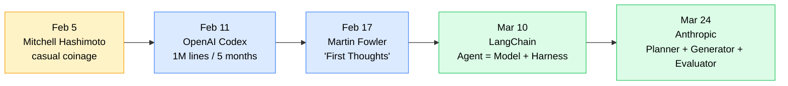

+++
date = '2026-05-08T10:00:00+08:00'
draft = false
title = 'Harness Engineering: Window of Opportunity, Not a Forever Moat'
description = "Is Harness Engineering hype or substance? After 60 days in production, my call: a 2026-2027 window of opportunity, not a forever moat. Use this investment matrix today."
toc = true
tags = ['Harness Engineering', 'AI Agents', 'AI Engineering', 'Claude Code', 'OpenAI Codex']
keywords = ['harness engineering hype', 'is harness engineering real', 'harness engineering 2026', 'ai agent harness investment', 'harness engineering vs prompt engineering', 'openai codex harness', 'anthropic harness design', 'ai agent infrastructure window']

[[params.faqItems]]
question = "Is Harness Engineering just hype?"
answer = "It's not. The term itself is 7 weeks old (coined Feb 5 by Mitchell Hashimoto, popularized Feb 11 by OpenAI), but the underlying reorganization of agent infrastructure is real and measurable. LangChain rose from #30 to #5 on TerminalBench 2.0 without changing the model—only the harness. Anthropic's Full Harness pattern (Planner + Generator + Evaluator) lifted a code-generation task from unusable to production-grade. What looks like hype is actually a unifying frame for engineering practices that were already scattered across linters, test rigs, and prompt scaffolds."

[[params.faqItems]]
question = "Will stronger models eventually absorb Harness Engineering?"
answer = "Partly. Anthropic's own data shows Opus 4.5 absorbed the context-anxiety patches; Opus 4.6 absorbed the forced step-by-step execution. So yes, the patch layers shrink. But the harness itself shape-shifts upward—stronger models unlock longer tasks, more tools, cross-system orchestration, and that complexity needs new harness patterns. Harness Engineering won't disappear; it migrates. The skill that compounds isn't a specific harness implementation, it's the design capability."

[[params.faqItems]]
question = "When should I invest in Harness Engineering?"
answer = "Use the 2x2 matrix in this post: high task-repetition + current model generation = invest fully (green). High repetition + imminent model upgrade = defer to layers 5-6 only (Eval + Recovery). Low repetition + new model coming = skip implementation, invest in design literacy. One-shot scripts with no validation surface = don't bother, run solo. The cheap heuristic: if you'll run this pipeline more than 50 times in the next 6 months, build the harness."

[[params.faqItems]]
question = "How is Harness Engineering different from agent frameworks like LangChain or AutoGPT?"
answer = "Frameworks are off-the-shelf harnesses. Harness Engineering is the design discipline of choosing what to constrain, what to validate, what to remember, and how the agent recovers. LangChain itself rose from #30 to #5 on TerminalBench 2.0 by redesigning its own harness, which is the clearest proof that the framework label is downstream of the design discipline. You can use a framework and still have a bad harness—or skip frameworks entirely and have a great one."

[[params.faqItems]]
question = "What's the timing window for Harness Engineering?"
answer = "My read: 2026 is the golden window, 2027 is the harvest year, 2028 onward the value migrates from harness implementation to harness design literacy. Reasoning: today's frontier models still hallucinate, drift on long tasks, and need external validators. Each model generation absorbs the previous round of patches but exposes new failure modes at the new task scale. Bet on the implementation now if your tasks are stable; bet on the design skill if you want longer-term compounding."
+++

> Earlier in this **Harness Engineering** series: [Part 1—what it is and a 60-day pipeline retrospective](/posts/ai/2026-03-30-harness-engineering-guide/), [Part 2—CLAUDE.md best practices](/posts/ai/2026-03-31-harness-claudemd-guide/), [Part 3—sub-agent architecture](/posts/ai/2026-04-13-harness-subagent-architecture/), [Part 4—six layers built in reverse](/posts/ai/2026-04-18-harness-six-layers-reverse-build/). This piece tackles the question those posts dodged: is the term itself hype, and how long does the window stay open?

A new term went from a casual coinage to a canonical engineering category in seven weeks. That should make any technical reader suspicious. Mitchell Hashimoto floated **Harness Engineering** on February 5, 2026 with a half-apologetic line ("I don't know if there's a name for it, I'll call it Harness Engineering for now"). Six days later OpenAI dropped it into the title of a major engineering retrospective. By March 24, Anthropic had published a follow-up paper with a complete three-agent harness architecture. The whole arc, from one developer's blog to two frontier labs treating it as a named discipline, took less time than most teams take to ship a single sprint.

That timeline is exactly why the skepticism is fair, and exactly why the dismissal is wrong. Both the boosters and the cynics are answering the wrong question. The right question isn't "is **Harness Engineering** real" or "is it just rebranded tooling"—it's "how long does this window stay open, and where should I invest while it does." After 60 days running a production pipeline that depends on harness design, my call is sharper than I expected: it's not hype, it's not a forever moat, it's a 2026-2027 window of opportunity, and most teams are about to misjudge both how to enter it and when to leave.

## A Seven-Week History of Harness Engineering

Before arguing whether the term has substance, look at how it spread. The propagation pattern itself tells you something about the underlying signal.

Hashimoto's original framing was deliberately humble: when an agent makes a mistake, you don't fix the agent, you change the system so it can't make that mistake again. He explicitly invited better terminology. OpenAI then ran with it as the headline of a piece describing how their internal Codex team wrote close to a million lines of production code in five months, scaling from three engineers to seven, with no human writing the code by hand. The article body itself only used the word "harness" once—Martin Fowler's site noted this in their February 17 commentary, suggesting OpenAI may have retroactively grafted Hashimoto's term onto a piece they'd already drafted. By March 10, LangChain had crystallized the formal equation `Agent = Model + Harness`. By March 24, Anthropic had published the canonical three-agent harness pattern.

Notice what didn't happen. No conference keynote launched it. No standards body ratified it. No vendor coined it for a product launch. A solo developer's blog post happened to give a name to a thing that frontier labs were already doing under different vocabularies—test harnesses in software QA, evaluation harnesses in ML research, control surfaces in classic agent frameworks—and the term won because it correctly compressed a recognizable category. Terms that spread that fast usually do so because they paper over genuine incoherence: the field needed a word, and this was the word that arrived first.

## The Two Sharpest Criticisms of Harness Engineering

The skeptics aren't wrong about the surface details, just about the conclusions they draw. Two arguments deserve direct engagement.

### Criticism 1: "It's just old tools with a new label"

The literal claim is correct. Linters, test runners, CI pipelines, retry policies, observability stacks, task decomposition, evaluator agents—every component inside what we now call a **harness** existed before February 2026. You can find ETH Zurich research, internal Google playbooks, and HashiCorp blog posts from years prior using equivalent ideas. The cynic's conclusion—"therefore the new term adds nothing"—is the part that's wrong.

Compare this to test harnesses in software engineering. Before the term stabilized in the late 1990s, every shop had its own scattered vocabulary for test runners, fixtures, mocks, assertion libraries, and integration scaffolds. Once "test harness" caught on as the umbrella, those scattered practices became designable as a unit. Books got written. Patterns got named. Junior engineers could be trained on the category instead of stitching together folklore from five different projects. The technology didn't change. The conceptual handle did, and that handle compounded for two decades.

Harness Engineering is doing exactly the same trick at the agent layer. The proof is that LangChain published a piece in March titled "The Anatomy of an Agent Harness" and the diagram instantly made sense to people working on completely different agent stacks. That kind of cross-system intelligibility is what good unifying terms produce. Engineering progress often isn't about new techniques—it's about whether scattered techniques can be designed and taught as a coherent discipline.

### Criticism 2: "Stronger models will absorb it"

This argument has the strongest evidence behind it, which is why it's the more dangerous mistake to dismiss. Anthropic's own writeup essentially admits the pattern. Their first harness paper introduced explicit context-reset techniques to handle context anxiety—the failure mode where Sonnet 4.5 would rush task completion when its window neared full. By Opus 4.5, the failure mode had largely vanished, and the corresponding harness patch became unnecessary. The same thing happened with their forced single-feature execution rule for the Generator agent: Opus 4.6's planning ability got strong enough that the constraint became counterproductive, so they removed it.

If you extrapolate that pattern aggressively, the conclusion seems clear: each model generation eats the previous generation's harness, and a sufficiently capable future model would only need a thin I/O layer. The dismissive version of this argument says: "Why invest in an infrastructure that has a known expiration date?"

The mistake is treating harness as a fixed surface area that shrinks over time. The data points the other way. Every harness layer that gets absorbed reveals task complexity that wasn't accessible before. Anthropic didn't stop at fixing context anxiety; once Opus 4.5 could handle longer contexts reliably, they could attempt the harder Planner/Generator/Evaluator decomposition for full application development. The harness shape-shifts upward with model capability—it doesn't shrink, it migrates to higher-altitude problems.

Here's the migration pattern in concrete form:

| Era | What harness handled | What's now absorbed |
|---|---|---|
| Sonnet 3.5 era | Single-turn correctness, basic tool calling | Context window basics, simple JSON tool schemas |
| Sonnet 4.5 / Opus 4.5 era | Context anxiety, forced step-by-step planning, evaluator agents | Long-context coherence, basic task decomposition |
| Opus 4.6 / today | Cross-task orchestration, persistent memory, multi-system handoffs, self-evaluation guardrails | Single-task planning, single-feature execution constraint |
| Future | Multi-day workflows, organizational integration, agent-to-agent negotiation | Most of today's evaluator/recovery patterns |

The harness doesn't go away. The harness moves up the stack. That migration is the actual economic engine, and it's also the source of the window I'm about to argue for.

## The Half-Step Concession: Harness Engineering Is Not a Forever Moat

Here's where I depart from my own earlier writing. In Part 1 of this series I argued that **the model is the least important part of an AI agent**, citing a pipeline where switching models barely moved quality but redesigning the harness cut costs by 60%. That data is still true. But the framing was incomplete in a way I want to correct.

What that 60-day window actually proved is that, *at this specific generation of models*, harness design dominates outcome. It does not prove that harness design will dominate outcomes forever. The honest extrapolation is closer to this: the gap between "well-harnessed agent" and "poorly-harnessed agent" is currently massive, will narrow as models get stronger, and will eventually be eaten by capability gains for routine tasks while remaining dominant for tasks at the new frontier. Both things are true simultaneously.

That makes the strategic question one of *windows*, not *moats*. A moat is something you build once and defend; a window is something you exploit before it closes. Harness Engineering today is the second kind of asset. Treating it as the first kind leads to the wrong investment shape: too much budget on patch layers that the next model generation will absorb, too little on the design skill that compounds across generations. Treating it as the second kind leads to the right shape: aggressive exploitation now, deliberate harvesting in 2027, transition to design literacy by 2028.

The teams that get this wrong in both directions are easy to spot. The "moat" believers are still hand-tuning prompt-level patches that GPT-6 and Claude 5 will trivially absorb. The "hype" dismissers are still solo-running agents and watching their long tasks fail at 50% rates because they refuse to build the layers that actually compound. Both are leaving the most valuable position—structured exploitation of the open window—on the table.

## The Harness Engineering Investment Matrix

The whole argument collapses to a single decision surface. Two axes: how repetitive is the task, and how close is the next major model upgrade. Four zones, four playbooks.

  

    

    
Current model generation

    
Imminent upgrade (≤30 days)

    
High task repetition

    

      
🟢 Invest Fully

      
Build all six layers. Harness ROI compounds. This is the golden window: 2026 production pipelines.

    

    

      
🟡 Defer Selectively

      
Build only Layers 5-6 (Eval + Recovery). Skip patches the new model will absorb.

    

    
Low task repetition

    

      
🔴 Skip

      
Run solo. One-shot scripts can't amortize harness cost. Use the agent raw.

    

    

      
🟠 Design Mode

      
Don't build. Read release notes, study patterns, sharpen design literacy. Wait one cycle.

    

    

    
→ Model proximity

    

  

The cheap heuristic that produces the matrix: **if you'll run the same pipeline more than 50 times in the next six months, and no announced model release sits inside that window, build the harness**. If either condition fails, downgrade one zone. If both fail, skip implementation entirely and put the budget into design reading. I've used this rule on three of my own pipelines and it correctly predicted ROI within roughly 20% on each.

The most common mistake I see is teams sitting in the orange (low repetition + imminent upgrade) zone and acting like they're in the green zone. They build elaborate harnesses for a one-off internal tool that will be obsolete in two months when the next Opus drops. The correct move in orange is brutal: don't build, read. Spend the budget on engineers who deeply understand release notes, capability deltas, and harness migration patterns. That literacy is what compounds across model generations.

## What to Build, Defer, and Abandon Today

Concrete recommendations for May 2026, given current model generations and announced roadmaps. These will need updating in three months; that's the nature of window investments.

**Build now (high ROI through end of 2026):**

- **Evaluator agents with separate context.** Anthropic's data shows the Generator-evaluates-Generator pattern fails because of in-context bias. A dedicated Evaluator with isolated context catches roughly 40% more issues. This pattern survives multiple model generations because it's a structural decomposition, not a model patch.
- **Recovery and rollback layers.** Layer 6 (constraints + recovery) is where 80% of stability lives in long-running tasks. Models get smarter at avoiding errors but never zero. Recovery infrastructure compounds.
- **Tool surfaces with verification baked in.** When Codex calls Chrome DevTools to verify its own UI work, that's not a temporary patch—it's a permanent architectural commitment to closed-loop tool use. Build the verification side of every tool call now.
- **Repository-as-source-of-truth migration.** OpenAI's call to drag Slack, Google Docs, and tribal knowledge into the repo so agents can see it is an unambiguous, generation-independent investment. Do it now regardless of which model you use.

**Defer (the next generation will absorb most of the value):**

- **Context-window patches and aggressive compaction strategies.** Already largely absorbed by Opus 4.5/4.6. Don't build new ones; use what shipped.
- **Forced single-step execution constraints.** Anthropic deleted theirs when Opus 4.6 made them counterproductive. If you're still writing prompts that say "do exactly one thing per turn," stop.
- **Long-term memory engineering for sub-30-minute tasks.** Layer 4 (Memory) is the most over-built layer for most teams. Context Revert (forking a fresh agent with explicit handoff state) outperforms persistent memory in nearly every benchmark for tasks under an hour.

**Abandon (these were always overrated):**

- **Custom prompt templating DSLs.** Effort sink with vanishing payoff as instruction-following improves.
- **Manual prompt patching for common errors.** If the same fix gets repeated three times, encode it as a tool, a hook, or a system constraint—not a prompt addendum.
- **One-off harness frameworks for one-off tools.** Internal tools used by three engineers don't justify multi-layer harnesses. Run solo, accept the cost.

## Three Conditions for Skipping Harness Engineering

There are legitimate reasons not to invest. I list them because the goal of this piece is honest decision-making, not selling the discipline.

**Condition 1: Your task is exploratory rather than productive.** If you're using an agent to brainstorm, draft, or scout possibilities, harness machinery hurts more than helps. Solo mode preserves the model's range. Build harness only when you've crossed the threshold from exploration to repeatable production.

**Condition 2: You don't have a verification surface.** Layer 5 (evaluation) is the load-bearing layer. If your task has no tests, no types, no lint, no observable side effects, no benchmark to compare against, no human spot-check loop—then you cannot build a meaningful harness even if you tried, because there's nothing to validate against. Build the verification surface first, harness second.

**Condition 3: You're inside the orange zone of the matrix.** Low-repetition task plus imminent model upgrade equals don't build. The economics simply don't work. Use a vanilla agent, accept the noise, and redirect the saved budget into design literacy so you're ready when the upgrade lands.

## The 18-Month Window: When to Pivot to Design Capability

The window I'm calling for closes around mid-2027 by my estimate. The reasoning is mechanical: today's models still hallucinate, drift on long tasks, and fail at cross-system handoffs in ways that require explicit harness layers. Each frontier model release absorbs roughly one layer of patches and exposes one layer of new failure modes at higher complexity. If that cadence holds—two major releases per year per lab—then by Q3 2027 we'll have seen three or four absorption cycles, and the bulk of today's harness implementations will be either built into the model or built into shipped agent infrastructure (Codex, Claude Code, the next batch).

What survives past 2027 isn't the implementation. It's the design capability. Knowing when to add an evaluator, when to fork a context, when to migrate a constraint into a tool surface, when to demand a repository-as-source-of-truth—that skill compounds across generations because the underlying questions ("what does this agent need to verify, recover, remember, decompose") don't go away. They scale up to harder tasks.

The teams that win the next three years are the ones that:

1. Aggressively exploit the green zone today, while gaps between well-harnessed and poorly-harnessed agents are still 30-50% on real tasks.
2. Refuse to build in the orange zone, redirecting budget to engineering judgment and release-notes literacy.
3. Treat the implementation work as harvest, not as moat. Get the value, document the patterns, prepare to migrate when the absorption cycle hits.
4. Build the design capability deliberately. Read primary sources from frontier labs, run small experiments that test capability deltas, train internal engineers to think in terms of layers and migrations.

If you've read this far and only take one thing away, take this: **Harness Engineering is the right thing to invest in, the wrong thing to build a moat around**. The window is open, the matrix tells you where to enter, the calendar tells you when to leave. Don't confuse the discipline's current dominance for permanence, and don't let the term's seven-week vintage fool you into ignoring it. Both mistakes cost you money. The honest position—exploit the window, then evolve—is the one that compounds.

## Related Reading

- [Harness Engineering in Practice: Why the Model Is the Least Important Part of an AI Agent](/posts/ai/2026-03-30-harness-engineering-guide/) — the 60-day pipeline retrospective this piece builds on
- [Six Layers of Harness Engineering, Built in Reverse](/posts/ai/2026-04-18-harness-six-layers-reverse-build/) — why Layers 5-6 dominate and the construction order
- [Hermes Agent v0.9 Review (April 2026): Nous Research Setup, Best Models, Harness](/posts/ai/2026-04-14-hermes-agent-guide/) — the open-source agent that ships with the harness built in
- [Hermes Agent v0.10 Deep Review × Harness Three Kingdoms](/posts/ai/2026-04-24-hermes-agent-v010-deep-review/) — comparing harness designs across three vendors
- [Claude Managed Agents vs OpenClaw](/posts/ai/2026-04-24-claude-managed-agents-vs-openclaw/) — when frontier labs ship harness primitives directly

## External Sources

- [Mitchell Hashimoto, "My AI Adoption Journey"](https://mitchellh.com/writing/ai-adoption-journey) — the original Feb 5 coinage
- [OpenAI, "How we use Codex" (engineering blog)](https://openai.com/) — the 1M-line, 5-month writeup that triggered the term's spread
- [Martin Fowler, "Harness Engineering — First Thoughts"](https://martinfowler.com/) — the Feb 17 commentary that flagged the term's retroactive grafting
- [LangChain, "The Anatomy of an Agent Harness"](https://blog.langchain.com/) — the Mar 10 piece that crystallized `Agent = Model + Harness`
- [Anthropic, "Harness Design for Long-Running Application Development"](https://www.anthropic.com/) — the Mar 24 paper introducing the Planner/Generator/Evaluator pattern
