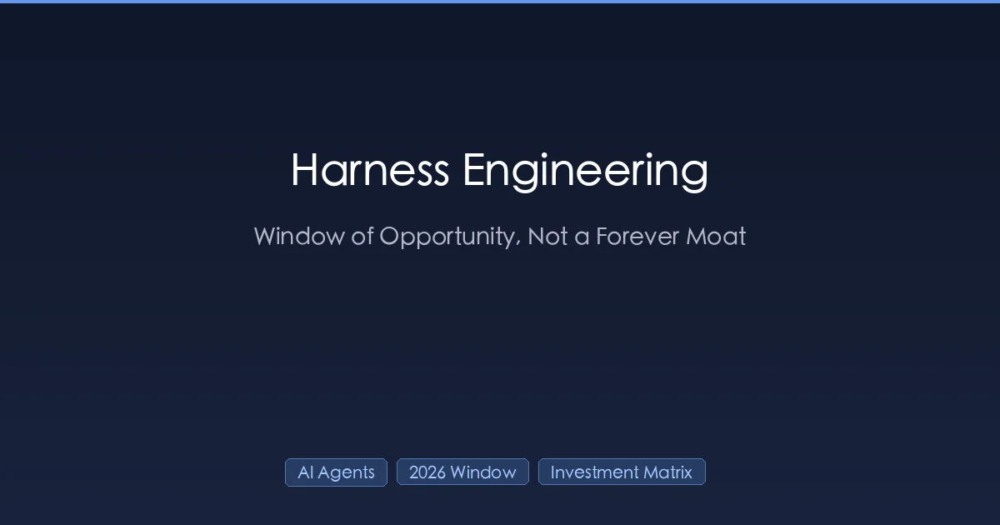
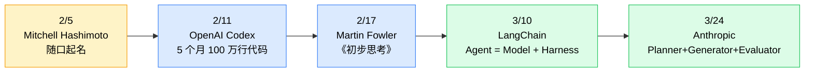

+++
date = '2026-05-08T10:00:00+08:00'
draft = false
title = 'Harness Engineering 是炒作还是红利期？投资象限决策框架（60 天实测）'
description = "一个 7 周前才被随口命名的词，怎么就成了大厂行业共识？60 天生产环境跑下来我的判断：不是噱头也不是永久护城河，是 2026-2027 红利窗口。附投资象限决策框架和现在就该建/缓/放弃的清单。"
toc = true
tags = ['Harness Engineering', 'AI Agents', 'AI Engineering', 'Claude Code', 'OpenAI Codex']
keywords = ['harness engineering 是不是炒作', 'harness engineering 中文', 'AI Agent 工程红利', 'harness engineering 窗口期', 'AI Agent 投资决策', 'harness engineering 实战', 'AI 编程工具投入产出比', 'claude code harness 设计']

[[params.faqItems]]
question = "Harness Engineering 到底是不是炒作？"
answer = "不是。这个词本身只有 7 周历史（2 月 5 日 Mitchell Hashimoto 随口起名，2 月 11 日 OpenAI 把它写进标题），但它指向的工程范式是真实可量化的。LangChain 不换模型只改 Harness，TerminalBench 2.0 排名从第 30 升到第 5；Anthropic 的 Full Harness 三 Agent 架构（Planner + Generator + Evaluator）把一个原本不可用的代码生成任务做到生产可用。看着像炒作的部分，其实是把过去散落在 Linter、测试夹具、提示词补丁里的零散工程实践统一到一个范式里——这本身就是工程进步。"

[[params.faqItems]]
question = "模型变强会不会让 Harness Engineering 没用？"
answer = "会吃掉一部分，但不会消失。Anthropic 自己的数据：Opus 4.5 吸收了上下文焦虑补丁，Opus 4.6 吸收了强制分步执行约束。但 Harness 不是缩小而是上移——更强的模型解锁了更长任务、更多工具、跨系统编排，这些复杂度需要新的 Harness 形态。永远沉淀的不是某个具体 Harness 实现，而是「Harness 设计能力」——什么时候加 Evaluator、什么时候 fork 上下文、什么时候把约束迁进工具层——这些判断跨越模型代差仍然有效。"

[[params.faqItems]]
question = "我应该什么时候投 Harness Engineering？"
answer = "用文中的投资象限矩阵：高任务重复度 + 当前模型代 = 满投（绿区），高重复 + 模型即将换代 = 只建第 5、6 层（Eval + Recovery），低重复 + 模型即将换代 = 不建实现，投设计能力（橙区），低重复 + 一次性脚本 = 直接 Solo 模式跑（红区）。简化启发式：未来 6 个月内同一条 pipeline 会跑超过 50 次、且窗口内没有已知模型升级，就建 Harness；任一条件不成立，降一个区位；两个都不成立直接放弃实现。"

[[params.faqItems]]
question = "Harness Engineering 的红利窗口期还有多久？"
answer = "我的估算是 2026 是黄金窗口、2027 是收割年、2028 之后价值从 Harness 实现迁移到 Harness 设计能力。逻辑：当前前沿模型仍在长任务上漂移、跨系统协作上失败，需要外部验证层；每个模型代际大致吸收上一轮的补丁但暴露新的失败模式。按两大厂每年两个主要版本的节奏推，到 2027 年 Q3 我们会经历 3-4 个吸收周期，今天的大部分 Harness 实现要么被模型内化要么被 Codex / Claude Code 这样的成品代理基础设施内化。窗口关闭前抓紧实现，窗口之后转向设计能力。"

[[params.faqItems]]
question = "Harness Engineering 和 LangChain 这种 Agent Framework 是一回事吗？"
answer = "不是。Framework 是货架上的成品 Harness，Harness Engineering 是「设计什么、约束什么、验证什么、怎么恢复」的设计纪律。LangChain 自己的实战就是最好的反例：他们没换模型，只是重新设计 Harness（包括如何拆解任务、如何接入工具、如何自我评估），就让 TerminalBench 2.0 分数从 52.8% 跳到 66.5%。你可以用 Framework 但 Harness 设计差，也可以不用任何 Framework 但 Harness 设计极好——Framework 标签是设计纪律下游的派生物。"
+++

> 这是 **Harness Engineering 系列第 5 篇**。前面 [第 1 篇讲是什么](/posts/ai/2026-03-30-harness-engineering-guide/)、[第 2 篇拆 CLAUDE.md](/posts/ai/2026-03-31-harness-claudemd-guide/)、[第 3 篇讲 Sub-Agent 架构](/posts/ai/2026-04-13-harness-subagent-architecture/)、[第 4 篇讲六层倒着建](/posts/ai/2026-04-18-harness-six-layers-reverse-build/)。这一篇要回答前 4 篇刻意绕开的问题——这个词本身是不是炒作，红利窗口还能开多久。

一个新词从一句"姑且这么叫"到被两家前沿大厂当作正式工程范式，只用了 7 周。这种传播速度任何一个搞技术的人看到都该心生警惕。Mitchell Hashimoto 在 2026 年 2 月 5 日的博客里几乎是带着歉意提了一句"我也不知道业界有没有公认的叫法，姑且管它叫 **Harness Engineering**"。6 天后 OpenAI 把这个词放进了一篇重磅工程复盘的标题里。3 月 24 日 Anthropic 发了第二篇 Harness 论文，给出完整的三 Agent 架构。整段弧线——从一个开发者的私人博客到被两家前沿实验室当作命名学科——比大多数团队完成一个 sprint 的时间还短。

正是这个时间线让"是炒作"的怀疑变得合理，也正是这个时间线让"全是炒作"的结论变得错误。鼓吹派和怀疑派都在回答错误的问题。真正该问的不是"**Harness Engineering** 是不是真的"也不是"是不是新瓶装旧酒"，而是"这个红利窗口能开多久、应该往哪儿投"。在生产环境跑了 60 天博客管线（依赖完整 Harness 设计）之后，我的判断比预期更尖锐：它不是炒作、不是永久护城河，是 2026-2027 这两年的过渡期工程红利窗口，绝大多数团队即将在两个方向上同时判断错——既错判了如何进场、也错判了什么时候该撤。

## Harness Engineering 7 周溯源史

在争论这个词有没有实质之前，先看它是怎么传开的。传播路径本身就在告诉你这背后的信号是真是假。

Hashimoto 当时的措辞是相当谦逊的：当 Agent 犯错的时候，你不去改 Agent，而是改造系统让它不可能再犯同样的错。他自己明确说过"如果有更好的词随时改口"。OpenAI 紧接着用这个词当标题发了一篇文章，描述他们 Codex 团队 5 个月内由 3 个工程师扩张到 7 个工程师、纯靠 Agent 写出近 100 万行生产代码、人不写一行的过程。但有意思的细节是 OpenAI 那篇文章正文里"harness"这个词只出现了一次——Martin Fowler 网站 2 月 17 日的评论文章把这个事点了出来，推测 OpenAI 可能是受 Hashimoto 启发后临时把这个词写进标题。3 月 10 日 LangChain 把公式 `Agent = Model + Harness` 正式给出。3 月 24 日 Anthropic 发出三 Agent 架构论文。

注意有几件事**没有发生**。没有任何大会主题演讲推动它。没有任何标准组织背书。没有任何厂商为某个产品发布造这个词。一个独立开发者的博客文章恰好给一类前沿实验室已经在做但叫法不一的工程范式起了名字——QA 领域早有 Test Harness、ML 研究里早有 Evaluation Harness、传统 Agent 框架里早有 Control Surface——这个词赢了，是因为它正确压缩了一个早就存在但散落各处的范畴。能在 7 周内传开的词，通常都是因为这个领域本来就需要一个名字，而它恰好是第一个到位的名字。

## 关于 Harness Engineering 的两把"是炒作"尖刀

怀疑派对表面细节的描述并没错，错的是他们从这些细节推出的结论。两个论点值得正面回应。

### 尖刀一："就是新瓶装旧酒"

这句话的字面陈述完全正确。Linter、测试运行器、CI 流水线、重试策略、可观测栈、任务拆解、评估 Agent——今天我们叫做 **Harness** 的每一个组件，都不是 2026 年 2 月才出现的。你能在 ETH Zurich 的研究、Google 内部 playbook、HashiCorp 几年前的博客里找到等价想法。怀疑派的结论"所以这个新词什么也没增加"才是错的部分。

把这件事和软件工程里的「测试夹具」（Test Harness）类比一下。在 1990 年代末这个词稳定下来之前，每家公司对测试运行器、测试夹具、Mock、断言库、集成框架都有自己的叫法。等"Test Harness"作为伞形概念被接受之后，那些散落的实践才**作为一个整体被设计**。书才被写出来，模式才被命名，初级工程师才能围绕这个范畴接受系统训练，而不是从五个不同项目里拼凑民间智慧。技术本身没变，概念抓手变了，这个抓手在接下来 20 年里持续复利。

Harness Engineering 在 Agent 这一层正在做完全相同的事。证据是 LangChain 3 月那篇《The Anatomy of an Agent Harness》画的架构图，让做完全不同 Agent 栈的人立刻能看懂——这种跨系统的可理解性，正是好的统一术语的产物。工程进步的本质常常不是发明了什么新技术，而是散落的技术能不能被作为一门连贯的学科去设计、去教授。

### 尖刀二："模型变强会把它吃掉"

这把刀有最强的证据支撑，所以也是最危险的轻易否定。Anthropic 自己的复盘几乎在承认这个模式。他们第一篇 Harness 论文里专门做了「上下文重置」（Context Reset）来处理 Sonnet 4.5 的"上下文焦虑"——窗口快满时模型急于结束任务的失败模式。到 Opus 4.5 这个失败模式基本消失，对应的 Harness 补丁就不再需要。同样的事情发生在他们对 Generator Agent 的「强制单功能点执行」约束上——Opus 4.6 的规划能力强到让这条约束适得其反，他们直接把它删掉了。

如果你激进地外推这个模式，结论看起来很清楚：每一代模型都会吃掉上一代的 Harness，足够强的未来模型只需要一层薄薄的 I/O 接口。这个论点的轻蔑版本是："为什么要投一个有明确过期日的基础设施？"

错误在于把 Harness 当成一个面积固定、随时间缩小的东西。数据指向相反方向。每一层被吸收的 Harness 都在解锁此前根本不可达的任务复杂度。Anthropic 不是修完上下文焦虑就停下来——一旦 Opus 4.5 能稳定处理长上下文，他们就能尝试更难的 Planner / Generator / Evaluator 全栈应用开发拆解。**Harness 不是缩小，是随模型能力上移**——它迁移到更高海拔的问题上。

下面这张表把这个迁移规律落地到具体形态：

| 时代 | Harness 处理什么 | 已经被吸收的 |
|---|---|---|
| Sonnet 3.5 时代 | 单轮正确性、基础工具调用 | 上下文窗口基本款、简单 JSON 工具 schema |
| Sonnet 4.5 / Opus 4.5 时代 | 上下文焦虑、强制分步规划、Evaluator Agent | 长上下文连贯性、基本任务拆解 |
| Opus 4.6 / 当下 | 跨任务编排、持久记忆、跨系统交接、自评估护栏 | 单任务规划、单功能点执行约束 |
| 未来一代 | 多日工作流、组织级集成、Agent 间协商 | 今天大部分 Evaluator / Recovery 模式 |

Harness 不会消失，Harness 会上移。这个迁移规律才是真正的经济引擎，也是我接下来要论证的窗口期的来源。

## 我要承认半步：Harness Engineering 不是永久护城河

这一节我要修正自己之前的写作。系列第 1 篇里我提出的观点是 **「模型是 AI Agent 里最不重要的部分」**，引用了一个 60 天 pipeline 的数据：换模型几乎不动质量，重新设计 Harness 把成本砍了 60%。那个数据现在依然有效。但当时的表述方式有一个我现在想纠正的不完整。

那个 60 天窗口真正证明的是——**在当下这一代模型上**——Harness 设计支配产出。它没有证明 Harness 设计会永远支配产出。诚实的外推应该是这样：今天「Harness 设计良好的 Agent」和「Harness 设计差劲的 Agent」之间的差距巨大，这个差距会随模型变强而收窄，最终会被新一代模型的能力增长在常规任务上吃掉，但在每一代新前沿任务上又重新出现差距。两件事是同时为真的。

这把战略问题从「护城河」改成了「窗口期」。**护城河是建好后防守的东西，窗口期是关上之前要利用的东西**。Harness Engineering 今天属于第二类资产。把它当第一类来对待会导致错误的投资形态——太多预算花在下一代模型会吸收的补丁层、太少预算花在跨代复利的设计能力上。把它当第二类对待会导致正确的形态——现在尽快利用，2027 收割阶段刻意榨干，2028 之后转向设计能力。

两个方向上都判错的团队很容易看出来。"护城河派"还在手工调那些 GPT-6 和 Claude 5 一来就会被秒杀的提示词级补丁。"炒作派"还在 Solo 跑 Agent 然后看着长任务在 50% 失败率上挣扎，因为他们拒绝建那些真正复利的层。两边都把最值钱的位置——**对开放窗口期的结构化利用**——白白让出去了。

## Harness Engineering 投资象限矩阵

整套论证最后压缩成一个决策面。两个轴：任务重复度有多高、距离下一代模型升级有多近。四个区，四套打法。

  

    

    
当前模型代

    
即将升级（≤30 天）

    
高任务重复度

    

      
🟢 满投

      
六层全建。Harness ROI 复利。这就是黄金窗口：2026 生产管线。

    

    

      
🟡 选择性缓投

      
只建第 5、6 层（Eval + Recovery）。跳过即将被新模型吸收的补丁。

    

    
低任务重复度

    

      
🔴 不投

      
Solo 模式跑。一次性脚本无法摊销 Harness 成本，直接裸用 Agent。

    

    

      
🟠 设计期

      
不建实现。读 release notes、研究模式、磨设计能力，等一个周期。

    

    

    
→ 模型升级临近度

    

  

把矩阵压成一个简单启发式：**未来 6 个月内同一条 pipeline 会跑超过 50 次、且窗口内没有已知模型升级——建 Harness**。任一条件不成立，往下降一个区位。两个都不成立，直接放弃实现把预算转到设计阅读上。我用这条规则在自己的三条管线上预测过 ROI，每条都在大约 ±20% 的误差内对得上。

我在国内团队身上看到最常见的判断错误，是坐在橙色区（低重复 + 模型即将换代）却在按绿区做事。他们为一个两个月后下一代 Opus 一上线就过期的内部一次性工具搭精雕细琢的多层 Harness。橙色区的正确动作是非常残忍的：**别建，去读**。把预算花在能深读 release notes、看懂能力差量、能复述 Harness 迁移模式的工程师身上。这种文献阅读能力才是跨代复利的部分。

## 现在该建什么、缓什么、放弃什么

下面是 2026 年 5 月的具体建议，假设当前模型代际和已公布路线图。这套清单 3 个月后需要更新，这是窗口期投资的本质。

**现在就建（到 2026 年底之前 ROI 都很高）**：

- **独立上下文的 Evaluator Agent**。Anthropic 数据显示 Generator 评 Generator 的方案因为上下文偏差而失败，独立上下文的 Evaluator 能多抓 ~40% 的问题。这个模式跨多代模型仍然有效，因为它是结构性拆解，不是模型补丁。
- **恢复和回滚层**。第 6 层（约束 + 恢复）撑起了长任务 80% 的稳定性。模型会越来越擅长避错但永远不可能零错。恢复基础设施是会复利的。
- **验证内嵌的工具表面**。Codex 调用 Chrome DevTools 验证自己的 UI 工作——这不是临时补丁，是封闭闭环工具调用的永久架构承诺。今天就把每一个工具调用的验证侧建好。
- **代码仓库作为唯一事实来源**。OpenAI 那条「把 Slack、Google Docs、老员工脑子里的部落知识统统拖进仓库让 Agent 看得见」的指令，是不依赖任何模型代际、不会过期的投资。立刻做，不管你用哪个模型。

**可以缓（下一代模型会吸收大部分价值）**：

- **上下文窗口补丁和激进压缩策略**。Opus 4.5 / 4.6 已经吸收得差不多了。别再写新的，用已经发布的就行。
- **强制单步执行约束**。Anthropic 在 Opus 4.6 上把它删了。如果你的提示词里还在写"每轮只做一件事"，立刻停。
- **30 分钟内任务的长期记忆工程**。第 4 层（Memory）是大部分团队过度建设最严重的层。对 1 小时以内的任务，Context Revert（fork 一个干净 Agent 带交接状态接力）几乎在所有 benchmark 上都赢过持久记忆。

**直接放弃（一直就被高估的几个东西）**：

- **自定义提示词模板 DSL**。指令跟随能力越强这层投入回报越接近零。
- **针对常见错误的手工提示词补丁**。同一个修复重复出现 3 次以上，把它编码成工具、Hook、或系统约束——不要写进提示词附录里。
- **为一次性工具搭一次性 Harness 框架**。3 个工程师用的内部工具不值得多层 Harness。Solo 跑，认成本。

## 三种情况不要建 Harness Engineering

不是所有场景都该投。我把这部分单独列出来，因为这篇的目的是诚实决策，不是推销这门学科。

**条件一：你的任务是探索性的而不是生产性的**。如果你是在用 Agent 头脑风暴、起草、侦察可能性，Harness 机制会伤多于帮。Solo 模式保留模型的发散范围。只在你已经从「探索」跨过「可重复生产」门槛之后再建 Harness。

**条件二：你没有验证表面**。第 5 层（评估）是承重层。如果你的任务没有测试、没有类型、没有 Lint、没有可观测副作用、没有可对比的 benchmark、没有人工抽查闭环——你不可能建有意义的 Harness 即使你想建，因为没有任何东西可以拿来验证。先建验证表面，再建 Harness。

**条件三：你坐在矩阵的橙色区**。低重复 + 模型即将升级 = 别建。经济账算不过来。用裸 Agent 跑、接受噪声、把省下的预算转到设计阅读上，这样下一代模型一上线你就有准备。

## 18 个月窗口期：什么时候转向设计能力

我估算的窗口大约在 2027 年中关闭。逻辑是机械的：今天的模型仍然会幻觉、长任务漂移、跨系统交接失败，需要显式的 Harness 层来补。每一代前沿模型大致吸收一层补丁，同时在更高复杂度上暴露新的失败模式。如果按"两家大厂每年两个主要版本"的节奏推，到 2027 年 Q3 会经历 3-4 个吸收周期，今天大部分 Harness 实现要么内化进模型，要么内化进 Codex / Claude Code 这些已发布的代理基础设施。

**2027 之后能跨代沉淀的不是实现，是设计能力**。知道什么时候加 Evaluator、什么时候 fork 上下文、什么时候把约束迁进工具层、什么时候要求仓库作为唯一事实来源——这种判断会跨代复利，因为底层问题（这个 Agent 需要验证什么、恢复什么、记住什么、怎么拆解）永远不会消失。它只会被 scale 到更难的任务上。

未来 3 年能赢的团队是这样的：

1. 在差距还在 30-50% 的真实任务上，狠狠利用绿色区的窗口红利。
2. 拒绝在橙色区建实现，把预算转到工程判断和 release notes 阅读能力上。
3. 把实现当作收割而不是护城河。拿走价值、记录模式、为吸收周期到来时的迁移做准备。
4. 刻意培养设计能力。读前沿实验室一手资料、做小实验测能力差量、培训内部工程师从「层」和「迁移」的角度思考。

如果这篇你只带走一个判断，请带走这个：**Harness Engineering 是值得投的方向，是错的护城河**。窗口开着、矩阵告诉你从哪儿进、日历告诉你什么时候撤。别把这门学科现在的支配地位当成永久存在，也别因为这个词只有 7 周历史就忽视它。两边的错都很贵。**诚实的姿势是「利用窗口、然后进化」**——这个姿势会复利。

## 相关阅读

- [Harness Engineering 实战：模型是 AI Agent 里最不重要的部分（60 天管线复盘）](/posts/ai/2026-03-30-harness-engineering-guide/) — 本文论证依赖的 60 天 pipeline 数据来源
- [Harness 六层架构倒着建：80% 稳定性来自第 5、6 层](/posts/ai/2026-04-18-harness-six-layers-reverse-build/) — Layer 5/6 为什么主导稳定性
- [Hermes Agent v0.10 深度评测 × Harness 三国杀](/posts/ai/2026-04-24-hermes-agent-v010-deep-review/) — 三家厂商 Harness 设计横向对比
- [Claude Managed Agents vs OpenClaw](/posts/ai/2026-04-24-claude-managed-agents-vs-openclaw/) — 大厂直接交付 Harness 原语意味着什么

## 一手资料

- [Mitchell Hashimoto《My AI Adoption Journey》](https://mitchellh.com/writing/ai-adoption-journey) — 2 月 5 日 Harness Engineering 这个词的原始出处
- [马克的技术工作坊《Harness Engineering 到底是什么？》（YouTube）](https://www.youtube.com/watch?v=7nCzfgDjSo8) — 中文圈最完整的概念梳理视频
- OpenAI 工程博客《How we use Codex》—— 5 个月 100 万行代码的复盘文章
- [Martin Fowler《Harness Engineering — First Thoughts》](https://martinfowler.com/) — 2 月 17 日发现 OpenAI 标题"事后嫁接"的评论
- [LangChain《The Anatomy of an Agent Harness》](https://blog.langchain.com/) — 3 月 10 日给出 Agent = Model + Harness 公式的文章
- [Anthropic《Harness Design for Long-Running Application Development》](https://www.anthropic.com/) — 3 月 24 日的三 Agent 架构论文
