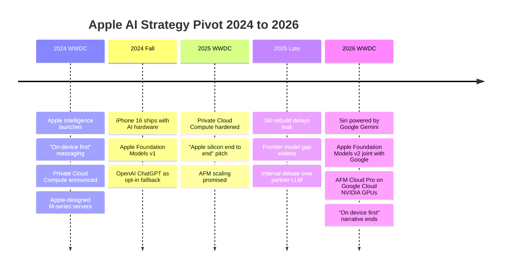

+++
date = '2026-06-09T10:00:00+08:00'
draft = false
title = "Apple's AI Capitulation at WWDC 2026: Gemini-Powered Siri and What It Means for Local AI"
description = "WWDC 2026 confirmed Apple's Siri now runs on Google Gemini, with Apple Foundation Models v2 trained jointly and AFM Cloud Pro hosted on Google Cloud NVIDIA GPUs. Why this is Apple's biggest strategic reversal since Intel-to-Apple-Silicon, and why local AI users on Ollama and MLX are the unexpected winners."
toc = true
tags = ['Apple WWDC 2026', 'Apple Intelligence', 'Google Gemini', 'Siri', 'Apple Foundation Models', 'Local AI', 'Apple Silicon', 'MLX', 'NVIDIA', 'Private Cloud Compute']
keywords = ['Apple WWDC 2026', 'Apple Intelligence Gemini', 'Apple Siri Google Gemini partnership', 'Apple Foundation Models v2', 'AFM Cloud Pro NVIDIA', 'Apple AI strategy pivot', 'local AI Apple Silicon 2026', 'MLX framework WWDC 2026', 'Apple Intelligence China', 'Apple Private Cloud Compute dead', 'Siri rebuild 2026', 'Apple Google AI deal', 'iOS 27 AI features', 'Apple AI capitulation', 'who won WWDC 2026']

[[params.faqItems]]
question = "Is Siri really powered by Google Gemini now after WWDC 2026?"
answer = "Yes. At WWDC 2026 on June 8, Apple confirmed the new Siri is powered by Google's Gemini models, and Apple Foundation Models v2 is being developed jointly with Google. Complex queries route to AFM Cloud Pro, which runs on Google Cloud using NVIDIA GPUs inside a confidential compute environment. Simple on-device queries still run a smaller distilled model locally. This is a hard reversal from Apple's 2024-2025 Private Cloud Compute story."

[[params.faqItems]]
question = "Did Apple kill Private Cloud Compute and its own server silicon?"
answer = "Apple has not formally killed Private Cloud Compute, but WWDC 2026 made it strategically irrelevant. The narrative has shifted from 'our own M-series servers in our own data centers' to 'confidential compute on Google Cloud with NVIDIA GPUs.' Apple still talks privacy, but the trust boundary now includes Google and NVIDIA. For practical purposes, Apple has stopped pretending it can compete with frontier LLM labs on its own."

[[params.faqItems]]
question = "What does the Apple-Google Gemini deal mean for MLX and local AI on Apple Silicon?"
answer = "It is genuinely good news for local AI users. Apple no longer has incentive to lock the system AI stack onto Apple Foundation Models or the Neural Engine, which means Ollama, llama.cpp, MLX, ComfyUI, and Draw Things will keep getting first-class access to unified memory and Metal without competing with a system AI hog. Apple Silicon hardware investment continues; software lock-in pressure drops. If you run local AI on a Mac, you are an unexpected winner."

[[params.faqItems]]
question = "Will Apple Intelligence work in China after the Google partnership?"
answer = "Apple has not announced China-specific arrangements at WWDC 2026, and Gemini is not available in mainland China. Realistically Apple will need a local partner (Baidu Ernie, Alibaba Qwen, or Tencent Hunyuan are the obvious candidates) to ship Apple Intelligence on China-region iPhones. Mainland users should expect a separate, behind-schedule rollout. The bigger pattern is the same as Apple Maps and ApplePay: the China stack is always a parallel build."

[[params.faqItems]]
question = "Who actually won WWDC 2026?"
answer = "Google and NVIDIA, by a wide margin. Google gets the search and intent data of every Siri query Apple cannot answer locally, plus deep integration with the most lucrative consumer base on earth. NVIDIA gets the compute contract for AFM Cloud Pro. Apple gets a Siri that finally works but downgrades from 'AI platform owner' to 'AI customer.' Apple Silicon users who run local AI also win, because Apple has lost the will to lock the on-device stack."
+++

On June 8, 2026, on the Apple Park stage, Apple confirmed something that would have been unthinkable two years ago: **the new Siri is powered by Google's Gemini models**, and the next generation of Apple Foundation Models is being co-developed with Google. Complex queries route to a service called **AFM Cloud Pro**, hosted on Google Cloud and running on **NVIDIA GPUs** inside a confidential compute environment.

For a company that spent 2024 and 2025 building an entire marketing narrative around **Private Cloud Compute** — Apple's own AI servers, in Apple's own data centers, running on Apple Silicon — this is the largest strategic reversal since the Intel-to-Apple-Silicon transition. And it goes in the opposite direction. The Apple Silicon transition was about taking control of the stack. WWDC 2026 is about giving the most valuable layer of the stack to a competitor.

I want to be direct: **Apple's "everything on device" story is dead**, the privacy argument has been quietly rewritten, and the real winners are Google, NVIDIA, and — counterintuitively — the open-source local AI community running Ollama, MLX, and ComfyUI on Apple Silicon. Let me explain why.

## What Apple Actually Announced at WWDC 2026

Strip away the keynote choreography and the substance is small. The new Siri ships across **iOS 27, iPadOS 27, macOS Golden Gate, watchOS 27, visionOS 27, CarPlay, and AirPods**. Under the hood, two things changed:

1. **A distilled on-device model handles simple queries** — fast, local, no network. Apple did not disclose the parameter count, the distillation ratio, or which devices get which model size. Treat any specific number you see in third-party coverage as a guess.
2. **Complex queries route to AFM Cloud Pro**, which is **Google Cloud + NVIDIA GPUs + confidential compute**. The "Apple Foundation Models v2" branding stays, but the model and the infrastructure are now joint with Google.

The peripheral features — Visual Intelligence, Safari tab organization with price-drop alerts, Photos AI editing (Cleanup, Extend, Spatial Reframe, with SynthID watermarking), redesigned Image Playground, smart Messages replies that mimic your writing style, natural-language Shortcuts creation, cross-app context awareness, Passwords app hardening, VoiceOver and Voice Control upgrades — are all real, but they are downstream consequences of the same architecture. None of them work without the Gemini-backed cloud path.

What Apple did **not** announce is more telling. There was no detailed roadmap for Private Cloud Compute. No new Apple-designed inference silicon. No frontier-model benchmark claim. No MLX framework updates with specifics (as of writing on June 9 morning, the developer documentation deeper than the keynote slides is not yet public). The keynote silence on these topics is the loudest signal of the day.

## The Apple AI Timeline: From "Everything On Device" to "Trust Google with the Hard Part"

To see how big a reversal this is, you have to remember what Apple was saying eighteen months ago.

Notice the shape: a two-year arc that started with the most ambitious vertical-integration story in consumer AI and ended with Apple paying Google to do the hard part. The Private Cloud Compute pitch was that Apple would build its own silicon for inference, run it in its own data centers, and prove cryptographically that nobody — not even Apple — could see your data. WWDC 2026 replaced that with **"confidential compute on Google Cloud with NVIDIA GPUs."** The technical primitive is plausible. The brand story is gone.

This matters because the brand story was the entire competitive moat. Apple's pitch in 2024 was "we are the only platform that does AI without surveilling you." In 2026 that pitch becomes "we are the only platform that does AI with Google as the inference provider, but with extra encryption." Try selling that to a consumer in one sentence. You cannot.

## Why This Was Probably Forced

Nobody at Apple wanted this. The most likely explanation, based on the public evidence, is that the Siri rebuild simply did not converge in time.

Through late 2025, multiple reporting threads suggested Apple's internal LLM scaling efforts were behind the frontier — the gap between Apple Foundation Models v1 and Gemini 2.x / GPT-5 / Claude 4 was widening, not closing. Apple's hardware advantage in unified memory does not translate cleanly to data center training scale, where NVIDIA's CUDA + interconnect stack still dominates by a wide margin. Apple's data corpus is also constrained by its privacy posture — the company genuinely does not have the training data that Google does.

When you cannot win the model layer, you have two options: ship a worse product, or partner. Apple shipped the original Siri rebuild promise in 2024, missed it in 2025, and could not afford to miss again in 2026. The Google deal is the cost of finally shipping.

The strategic cost is severe. Apple has effectively conceded that **the model layer is not a place it can compete**. That concession has implications for everything downstream: developer APIs, the App Store ecosystem of AI apps, future hardware (why build an AI accelerator if your stack runs on H100s in Google's data center?), and the position of M-series chips in the next decade of AI marketing.

## Why Local AI Users on Apple Silicon Just Won

Here is the counterintuitive part. **The open-source local AI community on Apple Silicon comes out of WWDC 2026 better off than they were on June 7.**

The reason is that until this week, there was a real risk that Apple would lock the on-device AI stack to Apple Foundation Models and the Neural Engine — the same way Apple has historically locked photography to its Image Signal Processor and audio to AudioToolbox. If Apple had succeeded in shipping a competitive on-device LLM, the next move would have been: deprecate the open APIs, tax the third-party ecosystem, push everything through ANE-accelerated AFM. That is the Apple playbook for every layer the company controls.

That risk just evaporated. Apple does not own the model layer anymore; it rents it from Google. The Neural Engine becomes a peripheral accelerator, not the centerpiece. **Ollama, llama.cpp, MLX, ComfyUI, Draw Things, LM Studio** — every tool that runs on Metal against unified memory — keeps doing exactly what it was doing, except now without competing against a Cupertino-flavored gravity well.

I covered the underlying hardware economics in [my Apple Silicon AI workstation deep-dive](/posts/ai/2026-04-14-mac-apple-silicon-ai-workstation/) — the short version is that memory bandwidth on M3 Max and above is what makes local 70B inference viable, and that hardware investment continues regardless of what happens at the OS layer. Apple is not going to stop selling M5 / M6 / M7 Macs with more unified memory. The chips keep getting better. The only thing that changed is that the system AI is no longer trying to be the chip's primary customer.

The second-order effect is even better. Apple's marketing pivot from "we do AI ourselves" to "we partner for the hard stuff" implicitly legitimizes the **pluralist** view of AI on the Mac: that the right answer is multiple specialized tools, locally controlled, swapped per task. That is exactly the world that [Mac mini local image generation](/posts/ai/2026-02-15-mac-mini-local-image-generation/) users and [Draw Things power users](/posts/ai/2026-02-15-draw-things-ultimate-guide/) already inhabit.

## The Real Winners and Losers Scorecard

| Player | Position Before WWDC 2026 | Position After | Net |
|--------|---------------------------|----------------|-----|
| Google | Frontier LLM provider with Android distribution | Frontier LLM provider with **iPhone + Android** distribution + Apple intent data | Massive win |
| NVIDIA | Compute supplier to OpenAI, Anthropic, xAI, Google | Now also the de facto compute for AFM Cloud Pro | Big win |
| Apple Silicon hardware team | Mac as AI workstation, growing slowly | Same, with one less competing internal narrative | Quiet win |
| Local AI open source (Ollama, MLX, llama.cpp) | Niche but growing, with a looming Apple platform risk | Same growth, platform risk reduced | Win |
| Apple Foundation Models team | Owns the on-device model stack | Maintains a distilled variant; cloud model is Google | Major demotion |
| Private Cloud Compute team | Building Apple's vertical AI stack | Strategic relevance unclear | Major demotion |
| OpenAI (previous opt-in partner) | Default ChatGPT fallback in iOS 18-19 | Likely sidelined by deeper Gemini integration | Loss |
| Consumer privacy narrative | "Apple does not see your data" | "Confidential compute on Google Cloud" | Lost |

If you want a one-line summary of the entire keynote: **Google bought Apple's intent data with a model API. NVIDIA sold the picks and shovels. Apple shipped a better Siri but stopped being an AI platform.**

## What the New "Privacy" Story Actually Means

Apple did not abandon the privacy pitch. It rewrote it.

The 2024 version was: your data never leaves the device unless absolutely necessary, and if it does, it goes to Apple's own servers running on Apple's own chips with end-to-end attestation. The 2026 version is: **your data never leaves the device unless absolutely necessary, and if it does, it goes to a confidential compute environment on Google Cloud running on NVIDIA GPUs with cryptographic isolation.**

The technical primitive — confidential compute, where the cloud operator cannot read tenant data even with full physical access — is real and credible. NVIDIA H100/H200/Blackwell with confidential compute is a legitimate architecture. The math works. The trust boundary is different from the 2024 version, but it is not nothing.

The problem is that the consumer differentiation collapses. In 2024 the pitch to a non-technical iPhone buyer was simple: **"Apple does not upload your stuff. Google does."** In 2026 that distinction is gone. Both are now "we encrypt the stuff we upload." Cryptographic nuance does not survive translation to a billboard ad. Apple has kept the technical posture and lost the marketing weapon.

For developers and serious users, the implication is more concrete: if you handle sensitive data and you used to rely on Apple's on-device promise, you now need to read the AFM Cloud Pro confidential compute attestation documents and decide whether Google's operational security is acceptable in your threat model. That is a different kind of work than the 2024 version, and Apple has not yet published the developer-facing details (the deeper docs are not out as of June 9 morning).

## What to Do If You Build on Apple Platforms

For developers shipping consumer apps that touch AI, my recommendation is to **stop assuming Apple will provide a competitive default LLM** and design accordingly.

Concretely:

1. **Treat Apple Intelligence as a routing target, not a model**. If your app needs a fast on-device action, fine, use the distilled model via the system APIs. If your app needs reasoning, summarization, or anything you actually care about quality on, do not assume the Apple-provided cloud path will beat your direct integration with the underlying provider. Ship your own.
2. **The Mac is now a much better local AI development machine than its keynote suggests**. Apple just removed its own AI ambitions from the calculus. Unified memory keeps growing, Metal keeps improving, the chips keep getting better. Build your own [agent harnesses](/posts/ai/2026-04-14-hermes-agent-guide/) and run them locally — the OS will not get in the way.
3. **Privacy stories need updating**. If your app's marketing leaned on "Apple Intelligence keeps your data on the device," that's no longer a clean claim. Either go more strict (local-only, MLX-based) or be honest that your AI features touch Google Cloud through Apple's pipe.
4. **The China iOS market just got more uncertain**. Gemini is unavailable in mainland China; Apple Intelligence in the PRC will need a local LLM partner, and the timeline is not Apple's to set. If you ship to China, plan for a separate AI experience that may lag the global version by quarters.

## What This Does Not Mean

A few things this announcement is **not**, despite the temptation to overread it.

It is not the end of Apple Silicon. Apple's chip roadmap is independent of its model strategy, and the M5 / M6 generations will keep pushing memory bandwidth and unified memory ceilings. Local AI on the Mac gets better every year because of hardware, not because of WWDC keynotes.

It is not the end of on-device AI broadly. The distilled local model is still real, and the **Visual Intelligence**, **Photos AI editing**, and **Smart Reply** features mostly run on-device. The on-device tier is just no longer the strategic story — it is the table stakes.

It is not Apple "giving up" in any dramatic sense. Apple is doing the thing every successful platform company eventually does when it loses a layer: partner, take the margin, and re-anchor competition somewhere it still wins (in Apple's case, the device, the OS integration, the privacy posture, and the ecosystem lock-in). This is not a death sentence; it is a downgrade from "AI platform owner" to "premium AI distribution channel."

But it is a downgrade, and the keynote choreography cannot hide that. The Apple Intelligence story that began on this same stage two years ago was about Apple winning AI on its own terms. WWDC 2026 was about Apple winning Siri by accepting that it would not win AI on its own terms. Those are very different stories.

## Bottom Line: The Strategic Reframe

If you remember one thing from WWDC 2026, remember this: **Apple just announced that it is not an AI platform. It is a customer of one.** Google is the platform now. NVIDIA is the infrastructure. Apple's role is distribution, integration, and the trust wrapper.

For end users this mostly does not matter — the new Siri will work better, the privacy posture is technically defensible, and the on-device features are real improvements. For developers building on the Mac, this is quietly excellent news: the platform risk to local AI just dropped meaningfully, and Apple Silicon hardware investment continues without a competing internal narrative. For investors and strategists, this is the biggest single-day repricing of Apple's AI ambitions since the iPhone 16 launch.

The pivot is done. The story changed on a Monday in June. The only question now is whether Apple ever tries again to own the model layer — and based on every signal in this keynote, the answer is probably not.

## Related Reading

- [Best Mac for Local LLM 2026: M4 Pro vs M3 Max Benchmarks](/posts/ai/2026-04-14-mac-apple-silicon-ai-workstation/) — Why Apple Silicon hardware investment matters more than Apple's software story
- [Mac mini Local Image Generation Guide](/posts/ai/2026-02-15-mac-mini-local-image-generation/) — The local AI workflow that does not care what Apple does at the OS layer
- [Draw Things Ultimate Guide](/posts/ai/2026-02-15-draw-things-ultimate-guide/) — Best-in-class Mac-native local image generation, fully independent of Apple Intelligence
- [Hermes Agent Engineering Guide](/posts/ai/2026-04-14-hermes-agent-guide/) — Building your own agent harnesses that route between local and frontier models, no system AI required
