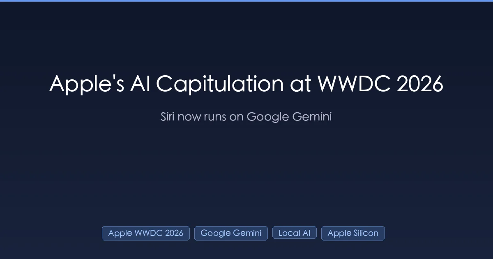
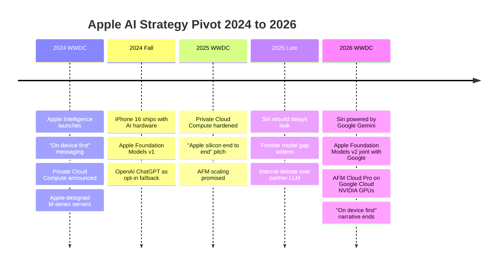

+++
date = '2026-06-09T10:00:00+08:00'
draft = false
title = 'Apple WWDC 2026: Siri Runs on Google Gemini — the Verdict'
description = "WWDC 2026 verdict: Siri now runs on Google Gemini and AFM Cloud Pro on NVIDIA GPUs in Google Cloud. Who won, who lost, why local AI on Macs comes out ahead."
toc = true
tags = ['Apple WWDC 2026', 'Apple Intelligence', 'Google Gemini', 'Siri', 'Apple Foundation Models', 'Local AI', 'Apple Silicon', 'MLX', 'NVIDIA', 'Private Cloud Compute']
keywords = ['Apple WWDC 2026', 'Apple Intelligence Gemini', 'Apple Siri Google Gemini partnership', 'Apple Foundation Models v2', 'AFM Cloud Pro NVIDIA', 'Apple AI strategy pivot', 'local AI Apple Silicon 2026', 'MLX framework WWDC 2026', 'Apple Intelligence China', 'Apple Private Cloud Compute dead', 'Siri rebuild 2026', 'Apple Google AI deal', 'iOS 27 AI features', 'Apple AI capitulation', 'who won WWDC 2026']

[[params.faqItems]]
question = "Is Siri really powered by Google Gemini now after WWDC 2026?"
answer = "Yes. At WWDC 2026 on June 8, Apple confirmed the new Siri is powered by Google's Gemini models, and Apple Foundation Models v2 is being developed jointly with Google. Complex queries route to AFM Cloud Pro, which runs on Google Cloud using NVIDIA GPUs inside a confidential compute environment. Simple on-device queries still run a smaller distilled model locally. This is a hard reversal from Apple's 2024-2025 Private Cloud Compute story."

[[params.faqItems]]
question = "Did Apple kill Private Cloud Compute and its own server silicon?"
answer = "Apple has not formally killed Private Cloud Compute, but WWDC 2026 made it strategically irrelevant. The narrative has shifted from 'our own M-series servers in our own data centers' to 'confidential compute on Google Cloud with NVIDIA GPUs.' Apple still talks privacy, but the trust boundary now includes Google and NVIDIA. For practical purposes, Apple has stopped pretending it can compete with frontier LLM labs on its own."

[[params.faqItems]]
question = "What does the Apple-Google Gemini deal mean for MLX and local AI on Apple Silicon?"
answer = "It is genuinely good news for local AI users. Apple no longer has incentive to lock the system AI stack onto Apple Foundation Models or the Neural Engine, which means Ollama, llama.cpp, MLX, ComfyUI, and Draw Things will keep getting first-class access to unified memory and Metal without competing with a system AI hog. Apple Silicon hardware investment continues; software lock-in pressure drops. If you run local AI on a Mac, you are an unexpected winner."

[[params.faqItems]]
question = "Will Apple Intelligence work in China after the Google partnership?"
answer = "Apple has not announced China-specific arrangements at WWDC 2026, and Gemini is not available in mainland China. Realistically Apple will need a local partner (Baidu Ernie, Alibaba Qwen, or Tencent Hunyuan are the obvious candidates) to ship Apple Intelligence on China-region iPhones. Mainland users should expect a separate, behind-schedule rollout. The bigger pattern is the same as Apple Maps and ApplePay: the China stack is always a parallel build."

[[params.faqItems]]
question = "Who actually won WWDC 2026?"
answer = "Google and NVIDIA, by a wide margin. Google gets the search and intent data of every Siri query Apple cannot answer locally, plus deep integration with the most lucrative consumer base on earth. NVIDIA gets the compute contract for AFM Cloud Pro. Apple gets a Siri that finally works but downgrades from 'AI platform owner' to 'AI customer.' Apple Silicon users who run local AI also win, because Apple has lost the will to lock the on-device stack."
+++

Apple WWDC 2026 will go down as the most expensive admission of defeat in the company's history — a two-hour keynote whose actual headline is that Apple quit trying to win AI. The proof fits in one sentence: **the new Siri runs on Google's Gemini models**, Apple Foundation Models v2 is being co-developed with Google, and complex queries route to **AFM Cloud Pro** — hosted on **Google Cloud**, running on **NVIDIA GPUs**, inside a confidential compute environment. Nobody leaked this. Apple said it out loud, on its own stage, on June 8.

Sit with what that replaces. This is the company that spent 2024 and 2025 selling **Private Cloud Compute**: Apple's own AI servers, in Apple's own data centers, on Apple's own silicon, with cryptographic proof that nobody — not even Apple — could see your data. The Intel-to-Apple-Silicon transition was about seizing the entire stack. WWDC 2026 is that move in reverse: handing the most valuable layer of the stack to the company Apple has fought longest.

Three calls, up front. One: this was forced, not chosen — the Siri rebuild didn't converge, and the deal is the price of finally shipping. Two: the winners are Google and NVIDIA, by a mile. Three — and this is the part nobody on stage would say — the group that quietly comes out ahead is the local AI crowd running Ollama, MLX, and ComfyUI on Apple Silicon. If that's you, the back half of this post is yours.

## The WWDC 2026 Facts, Minus the Stagecraft

Strip the keynote choreography and the substance fits on an index card. The new Siri ships across **iOS 27, iPadOS 27, macOS Golden Gate, watchOS 27, visionOS 27, CarPlay, and AirPods**. Under the hood, exactly two things changed:

1. **Simple queries stay local**, handled by a distilled on-device model — fast, offline, no network round-trip. Apple didn't disclose the parameter count, the distillation ratio, or which devices get which model size. Any specific number you've seen in third-party coverage is a guess.
2. **Hard queries go to AFM Cloud Pro**, which, stripped of its branding, is Google Cloud plus NVIDIA GPUs plus confidential compute. The "Apple Foundation Models v2" name survives; the model and the infrastructure underneath it are now joint with Google.

Everything else on stage — Visual Intelligence, Safari tab organization with price-drop alerts, Photos AI editing (Cleanup, Extend, Spatial Reframe, with SynthID watermarking), the redesigned Image Playground, Messages smart replies that mimic your writing style, natural-language Shortcuts creation, cross-app context awareness, Passwords hardening, VoiceOver and Voice Control upgrades — is real, but it's all downstream of the same two-tier architecture. None of it works without the Gemini-backed cloud path.

The silences were louder than the announcements. No Private Cloud Compute roadmap. No new Apple-designed inference silicon. No frontier-model benchmark claims — not a single number. No MLX framework specifics either (as of the morning of June 9, developer documentation deeper than the keynote slides still isn't public). When Apple has something, it brags. When it says nothing, believe the nothing.

## Two Years From "On-Device First" to "Google Does the Hard Part"

To feel the whiplash, rewind eighteen months and listen to what Apple was saying then.

The arc is brutal when you read it straight through: the most ambitious vertical-integration story in consumer AI, ending with Apple paying Google to do the hard part. And the brand story it torched was the entire competitive moat. The 2024 pitch was "we're the only platform that does AI without surveilling you." The 2026 pitch is "we're the only platform that does AI with Google as the inference provider, but with extra encryption." Try selling that in one sentence. You can't.

Why did Apple do it anyway? Because it had no choice. Through late 2025, multiple reporting threads pointed the same direction: Apple's internal LLM scaling was behind the frontier, and the gap between Apple Foundation Models v1 and Gemini 2.x / GPT-5 / Claude 4 was widening, not closing. Apple's unified-memory advantage doesn't translate to data-center training scale, where NVIDIA's CUDA-plus-interconnect stack still dominates outright. And Apple's training corpus is constrained by its own privacy posture — the company genuinely doesn't have Google's data.

When you can't win the model layer, you've got two options: ship a worse product, or partner. Apple promised the Siri rebuild in 2024, missed in 2025, and couldn't afford to miss again. The Google deal is what shipping finally cost.

That price is steeper than it looks. Apple has now conceded, in public, that **the model layer isn't a place it can compete** — and that concession cascades: into developer APIs, into the App Store's AI-app ecosystem, into future hardware (why design an AI accelerator when your stack runs on H100s in Google's data center?), and into what the M-series chip means in the next decade of Apple marketing.

## Who Actually Won WWDC 2026

Here's the scorecard, and it isn't close:

| Player | Position Before WWDC 2026 | Position After | Net |
|--------|---------------------------|----------------|-----|
| Google | Frontier LLM provider with Android distribution | Frontier LLM provider with **iPhone + Android** distribution + Apple intent data | Massive win |
| NVIDIA | Compute supplier to OpenAI, Anthropic, xAI, Google | Now also the de facto compute for AFM Cloud Pro | Big win |
| Apple Silicon hardware team | Mac as AI workstation, growing slowly | Same, with one less competing internal narrative | Quiet win |
| Local AI open source (Ollama, MLX, llama.cpp) | Niche but growing, with a looming Apple platform risk | Same growth, platform risk reduced | Win |
| Apple Foundation Models team | Owns the on-device model stack | Maintains a distilled variant; cloud model is Google | Major demotion |
| Private Cloud Compute team | Building Apple's vertical AI stack | Strategic relevance unclear | Major demotion |
| OpenAI (previous opt-in partner) | Default ChatGPT fallback in iOS 18-19 | Likely sidelined by deeper Gemini integration | Loss |
| Consumer privacy narrative | "Apple does not see your data" | "Confidential compute on Google Cloud" | Lost |

One line for the whole keynote: **Google bought Apple's intent data with a model API. NVIDIA sold the picks and shovels. Apple shipped a better Siri and stopped being an AI platform.**

The privacy row deserves a closer look, because Apple didn't drop the pitch — it rewrote it. The 2024 version: your data never leaves the device unless absolutely necessary, and when it does, it goes to Apple's own servers on Apple's own chips with end-to-end attestation. The 2026 version: same opening clause, but the destination is **a confidential compute environment on Google Cloud, on NVIDIA GPUs, with cryptographic isolation**.

To be fair, the technical primitive is real. Confidential compute — where the cloud operator can't read tenant data even with full physical access — is a credible architecture, and NVIDIA H100/H200/Blackwell support it legitimately. The math works. The trust boundary is different from 2024's, but it isn't nothing.

What collapsed is the consumer differentiation. In 2024, the pitch to a non-technical iPhone buyer was dead simple: **"Apple doesn't upload your stuff. Google does."** In 2026, both companies are saying "we encrypt what we upload," and cryptographic nuance doesn't survive translation to a billboard. Apple kept the technical posture and lost the marketing weapon.

If you handle sensitive data and you'd been leaning on Apple's on-device promise, this lands on your desk directly: you now need to read the AFM Cloud Pro confidential-compute attestation documents and decide whether Google's operational security clears your threat model. That's a different job than the 2024 version — and Apple hasn't published the developer-facing details yet (nothing deeper than the slides as of June 9 morning).

## The Winner Nobody Named: Local AI on Apple Silicon

Now the counterintuitive part, and the reason I'm not writing this as a eulogy. **The open-source local AI community on Apple Silicon walked out of WWDC 2026 better off than it walked in.**

Until this week, there was a live risk hanging over every local AI tool on the Mac: that Apple would lock the on-device AI stack to Apple Foundation Models and the Neural Engine, the same way it locked photography to its Image Signal Processor and audio to AudioToolbox. If Apple had shipped a competitive on-device LLM, the next moves write themselves — deprecate the open APIs, tax the third-party ecosystem, funnel everything through ANE-accelerated AFM. That's the Apple playbook for every layer it controls. It's not paranoia; it's pattern recognition.

That risk just evaporated. Apple doesn't own the model layer anymore — it rents it from Google. The Neural Engine becomes a peripheral accelerator instead of the centerpiece of a strategy. **Ollama, llama.cpp, MLX, ComfyUI, Draw Things, LM Studio** — every tool that runs on Metal against unified memory keeps doing exactly what it was doing, except without a Cupertino-flavored gravity well forming next door.

And the hardware side of the bargain doesn't change at all. I covered the economics in [my Apple Silicon AI workstation deep-dive](/posts/ai/2026-04-14-mac-apple-silicon-ai-workstation/): memory bandwidth on M3 Max and above is what makes local 70B inference viable, and that investment continues regardless of what happens at the OS layer. Apple isn't going to stop selling M5 / M6 / M7 Macs with ever more unified memory. The chips keep getting better. The only thing that changed is that the system AI stopped auditioning to be the chip's primary customer.

The second-order effect might be the best part. By pivoting from "we do AI ourselves" to "we partner for the hard stuff," Apple has implicitly blessed the **pluralist** model of AI on the Mac: multiple specialized tools, locally controlled, swapped per task. That's not a future scenario — it's the world that [Mac mini local image generation](/posts/ai/2026-02-15-mac-mini-local-image-generation/) users and [Draw Things power users](/posts/ai/2026-02-15-draw-things-ultimate-guide/) already live in. Apple just stopped pretending it wanted to replace it.

## Four Moves If You Build on Apple Platforms

The operating assumption to retire today: that Apple will provide a competitive default LLM. It won't. Design accordingly:

1. **Treat Apple Intelligence as a routing target, not a model.** Fast on-device action? Fine, hit the distilled model through the system APIs. Reasoning, summarization, anything where quality matters? Don't assume Apple's cloud path beats a direct integration with the underlying provider. Ship your own.
2. **The Mac is now a better local AI dev machine than the keynote suggests.** Apple just removed its own AI ambitions from the calculus. Unified memory keeps growing, Metal keeps improving. Build your own [agent harnesses](/posts/ai/2026-04-14-hermes-agent-guide/) and run them locally — the OS won't get in your way.
3. **Update your privacy story.** If your marketing leaned on "Apple Intelligence keeps your data on the device," that claim is no longer clean. Either go stricter — local-only, MLX-based — or say plainly that your AI features touch Google Cloud through Apple's pipe.
4. **Plan for China separately.** Gemini is unavailable in mainland China, so Apple Intelligence there will need a local LLM partner, on a timeline Apple doesn't control. If you ship to China, budget for a separate AI experience that may trail the global version by quarters.

## What This Isn't — and What It Is

Three overreads worth killing before they spread.

It's not the end of Apple Silicon. The chip roadmap is independent of the model strategy, and the M5 / M6 generations will keep pushing memory bandwidth and unified-memory ceilings. Local AI on the Mac gets better every year because of hardware, not keynotes.

It's not the end of on-device AI, either. The distilled local model is real, and **Visual Intelligence**, **Photos AI editing**, and **Smart Reply** mostly run on-device. The local tier just stopped being the strategic story. It's table stakes now.

And it's not Apple "giving up" in some dramatic, terminal sense. This is what every successful platform company does when it loses a layer: partner, take the margin, and re-anchor competition where it still wins — the device, the OS integration, the privacy posture, the ecosystem lock-in. Not a death sentence. A downgrade: from AI platform owner to premium AI distribution channel.

But a downgrade is what it is, and no amount of stagecraft hides it. The Apple Intelligence story that began on this same stage two years ago was about Apple winning AI on its own terms. WWDC 2026 was about Apple winning Siri by accepting that it won't.

So here's the one thing to remember: **Apple just told you it isn't an AI platform. It's a customer of one.** Google is the platform. NVIDIA is the infrastructure. Apple is distribution, integration, and the trust wrapper. For end users, mostly fine — Siri will finally work, and the on-device features are real improvements. For anyone building on the Mac, quietly excellent news — the platform risk to local AI just dropped hard, and the hardware keeps coming. For investors, the biggest single-day repricing of Apple's AI ambitions since the iPhone 16 launch.

The pivot is done. The story changed on a Monday in June. The only open question is whether Apple ever takes another run at owning the model layer — and everything in this keynote says no.

## Related Reading

- [Best Mac for Local LLM 2026: M4 Pro vs M3 Max Benchmarks](/posts/ai/2026-04-14-mac-apple-silicon-ai-workstation/) — Why Apple Silicon hardware investment matters more than Apple's software story
- [Mac mini Local Image Generation Guide](/posts/ai/2026-02-15-mac-mini-local-image-generation/) — The local AI workflow that does not care what Apple does at the OS layer
- [Draw Things Ultimate Guide](/posts/ai/2026-02-15-draw-things-ultimate-guide/) — Best-in-class Mac-native local image generation, fully independent of Apple Intelligence
- [Hermes Agent Engineering Guide](/posts/ai/2026-04-14-hermes-agent-guide/) — Building your own agent harnesses that route between local and frontier models, no system AI required
