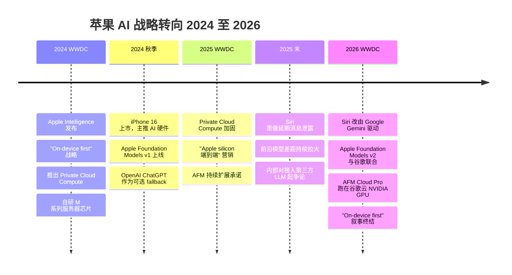

+++
date = '2026-06-09T10:00:00+08:00'
draft = false
title = 'Apple WWDC 2026 大转向：Siri 改用谷歌 Gemini，国行 iPhone 怎么办？'
description = 'WWDC 2026 苹果官宣 Siri 由谷歌 Gemini 驱动，Apple Foundation Models v2 与谷歌联合开发，AFM Cloud Pro 跑在谷歌云的 NVIDIA GPU 上。这是苹果从 Intel 转 Apple Silicon 之后最大的战略反转。国行 iPhone 用什么模型？要不要现在买 M5 Mac mini？本地 AI 用户为什么是赢家？'
toc = true
tags = ['Apple WWDC 2026', 'Apple Intelligence', 'Google Gemini', 'Siri', 'Apple Foundation Models', 'Local AI', 'Apple Silicon', 'MLX', 'NVIDIA', 'Private Cloud Compute']
keywords = ['Apple WWDC 2026', 'Apple Intelligence Gemini', '苹果 AI 用谷歌', 'Siri 谷歌 Gemini', 'Apple Foundation Models v2', '苹果 AI 路线转向', 'Apple Intelligence 中国', '国行 iPhone AI', 'Mac mini M5 本地 AI', '苹果统一内存 AI 2026', '苹果发布会 2026', 'AFM Cloud Pro', '苹果隐私 AI', '苹果 Google 合作', 'Siri 重做 2026']

[[params.faqItems]]
question = "WWDC 2026 之后 Siri 真的是谷歌 Gemini 在驱动吗？"
answer = '''是的。2026 年 6 月 8 日 WWDC 苹果官方确认：新 Siri 由 Google Gemini 驱动，Apple Foundation Models v2 与谷歌联合开发。复杂查询走 AFM Cloud Pro，跑在谷歌云的 NVIDIA GPU 上（机密计算环境）；简单本地任务由蒸馏小模型在设备上跑。这跟 2024-2025 年苹果一直讲的"Private Cloud Compute、自研服务器芯片"故事是一个 180 度反转。'''

[[params.faqItems]]
question = "国行 iPhone 用得了 Apple Intelligence 吗？Gemini 在中国大陆不能用啊。"
answer = '''WWDC 2026 苹果没公布中国大陆方案。Gemini 在大陆封禁，Apple Intelligence 中国版必然得换本地大模型供应商，候选基本就三家：百度文心、阿里通义、腾讯混元。参考 Apple Maps、Apple Pay、iCloud 的历史，国行版会单独搞一套，且时间表苹果说了不算——大概率会比全球版晚 1-2 个季度甚至更久。短期想体验完整 Apple Intelligence 的，海外版 iPhone + 海外 Apple ID 仍是唯一靠谱路线。'''

[[params.faqItems]]
question = "现在还该不该买 M5 Mac mini 搞本地 AI？"
answer = '''该买，而且 WWDC 2026 之后买的理由更强了，不是更弱。原因是苹果系统级 AI 不再跟你的 Ollama / MLX / Draw Things 抢算力——苹果模型层都让出去了，本地开源工具反而获得了更纯净的硬件资源。Apple Silicon 硬件路线没变，M5 / M6 还会继续堆统一内存和带宽。本地 70B 推理仍是 64GB 起步、跑 Qwen 2.5 / Llama 3.3 仍是当前性价比最高的方案。详见我之前写的 [M4 Pro vs M3 Max 实测](/zh/posts/ai/2026-04-14-mac-apple-silicon-ai-workstation/)。'''

[[params.faqItems]]
question = "苹果不是说一切隐私优先吗？现在数据要上传谷歌云，隐私故事还成立吗？"
answer = '''技术上成立，营销上完蛋。AFM Cloud Pro 用的是机密计算（confidential compute），技术原理是云端运营商在物理控制权下也读不到租户数据，NVIDIA H100/H200 支持这个能力。但消费者认知里"苹果不上传 vs 谷歌上传"的简单对比已经死了。2024 年的卖点是"苹果根本不传你的东西"，2026 年的卖点变成"我们传到谷歌云，但加密了"。这两句话在普通用户脑子里完全不是一回事，苹果保住了技术，丢了故事。'''

[[params.faqItems]]
question = "WWDC 2026 真正的赢家是谁？"
answer = '''Google 和 NVIDIA 大获全胜，Apple 降级。Google 拿到了 iPhone 用户每一次复杂查询的搜索意图数据——这是 Android + iPhone 双平台的搜索意图金矿；NVIDIA 拿到了 AFM Cloud Pro 的硬件订单。Apple 终于让 Siri 能用了，但从"AI 平台所有者"降级成"AI 客户"。意外的隐藏赢家是本地 AI 圈：Ollama、MLX、ComfyUI、Draw Things 这帮工具不再担心被苹果系统级 AI 锁死生态，Apple Silicon 硬件红利继续吃。'''
+++

2026 年 6 月 8 日凌晨（北京时间），Apple Park 的 WWDC 主题演讲上，苹果官宣了一件两年前完全无法想象的事：**新版 Siri 由 Google Gemini 驱动，下一代 Apple Foundation Models（v2）与谷歌联合开发**。复杂查询走一个叫 **AFM Cloud Pro** 的服务，部署在**谷歌云**，跑在 **NVIDIA GPU** 上，运行在机密计算（confidential compute）环境里。

对一家从 2024 年开始用整整两年时间反复讲"Private Cloud Compute、Apple 自己的服务器芯片、Apple 自己的数据中心"故事的公司来说，这是苹果自 Intel 转 Apple Silicon 之后最大的战略反转——而且方向相反。Apple Silicon 转型是把整个栈拿回自己手里，WWDC 2026 是把栈里最值钱的那一层让给了竞争对手。

我直接给结论：**苹果"一切都跑在设备上"的故事已经破产**，隐私叙事被悄悄改写了，真正的赢家是 Google、NVIDIA，以及——非常反直觉地——**国内本地 AI 用户**（用 Ollama、MLX、Draw Things 在 M 系列 Mac 上跑本地模型的那群人）。下面解释为什么。

## 一、WWDC 2026 苹果到底官宣了什么

把发布会舞台编排剥掉，实质内容很少。新 Siri 支持 **iOS 27、iPadOS 27、macOS Golden Gate、watchOS 27、visionOS 27、CarPlay、AirPods**。底层架构有两个关键变化：

1. **设备本地跑一个"蒸馏版"小模型**，处理简单快查询，不联网。苹果没公布参数量、蒸馏比例，也没说哪些设备本地跑、哪些必须走云。第三方报道里出现的具体数字，目前都是猜测。
2. **复杂查询走 AFM Cloud Pro**——本质就是 **谷歌云 + NVIDIA GPU + 机密计算**。"Apple Foundation Models v2"这个品牌名留着，但模型和基础设施都是和谷歌共建的。

外围功能——Visual Intelligence（问相机或屏幕里的内容）、Safari 标签智能整理 + 降价提醒、Photos AI 编辑（Cleanup / Extend / Spatial Reframe，带 SynthID 水印）、重新设计的 Image Playground、模仿用户写作风格的 Messages 智能回复、用自然语言创建快捷指令、跨 App 上下文感知、Passwords 凭据强化、VoiceOver 和 Voice Control 增强——都是真的，但全部是同一架构的下游产物。没有 Gemini 撑着的云端路径，这些功能没法工作。

苹果**没说**的事情更说明问题：没有 Private Cloud Compute 的新路线图、没有新的 Apple 自研推理芯片、没有任何前沿模型 benchmark 数字、MLX 框架的开发者细节也还没放出（我写这篇文章的时候，2026-06-09 上午，开发者文档比 keynote 幻灯片更深的内容还没公开）。这些沉默才是发布会当天最响的信号。

## 二、苹果 AI 路线史：从"一切都在设备上"到"难的事交给谷歌"

要看清这一反转有多大，得先回忆 18 个月前苹果是怎么讲这个故事的。

这个弧线的形状很清楚：两年时间，从消费 AI 史上最雄心勃勃的垂直整合故事，走到苹果付钱让谷歌干最难的部分。Private Cloud Compute 当年的卖点是"苹果自己造芯片做推理、自己开数据中心、用密码学证明谁都看不到你的数据，包括苹果自己"。WWDC 2026 把这个故事换成了**"机密计算，部署在谷歌云，跑在 NVIDIA GPU 上"**。技术原语是讲得通的，品牌故事没了。

这件事重要，因为品牌故事本来就是苹果的护城河。2024 年的卖点是"我们是唯一不监控你做 AI 的平台"，2026 年的卖点变成"我们是唯一让 Google 做推理、但加了一层加密的平台"。这种话在普通消费者面前是没法一句话讲清楚的。

## 三、为什么这事很可能是被迫的

苹果内部没有人想要这个结果。最合理的解释，结合公开信息看，是 Siri 重做就是没在时间窗口内做出来。

2025 年下半年开始，多个渠道的报道都指向同一个判断：苹果内部的 LLM 扩展进度落后于前沿——Apple Foundation Models v1 和 Gemini 2.x / GPT-5 / Claude 4 的差距是在拉大，不是在缩小。苹果在统一内存上的硬件优势没法干净地迁移到数据中心训练规模，那里 NVIDIA 的 CUDA + 互联生态仍然遥遥领先。苹果的训练数据也被自己的隐私立场限制——苹果是真的没有谷歌那种量级的训练语料。

模型层赢不了的时候，只有两条路：发个差产品，或者找合作伙伴。苹果在 2024 年承诺过 Siri 重做，2025 年跳票了一次，2026 年再跳票就完蛋。和谷歌的合作就是终于发出 Siri 的代价。

战略代价非常重。苹果实际上承认了**模型层不是自己能竞争的地方**。这个承认会传导到下游的一切：开发者 API、App Store 上 AI 应用的生态秩序、未来的硬件路线（既然推理跑在谷歌的 H100 上，那为什么还要自研 AI 加速器？）、以及 M 系列芯片在未来十年 AI 营销中的位置。

## 四、中国大陆用户独有的麻烦：国行 iPhone 怎么办

这是中文读者最该关心的部分。**WWDC 2026 苹果完全没提中国方案**，但这是一个回避不了的问题：Gemini 在中国大陆封禁，那国行 iPhone 的 Apple Intelligence 用什么模型？

参考苹果在中国的所有历史先例（Apple Maps、Apple Pay、iCloud 国内由云上贵州运营、App Store 中国区独立审核），我的预判是：**国行 iPhone 一定会接入本地大模型供应商**，但苹果说了不算，最终方案要看监管和合作伙伴谈判。三个最现实的候选：

1. **百度文心一言**：和苹果有历史合作（Apple Intelligence 1.0 阶段在中国本就在谈百度），但文心在国内大模型评测里现在不是第一梯队，能力跟 Gemini 2.x 差距明显。
2. **阿里通义千问**：开源版本 Qwen 在国际榜单上已经能跟前沿模型掰手腕（尤其是 Qwen2.5-Max 和 Qwen3），技术层面是最匹配的候选。
3. **腾讯混元**：微信生态绑定深，在中文场景上的本地化优势独家，但模型能力公开 benchmark 上偏弱。

最终很可能是**多家并存**：苹果搞一个国行专版 Apple Intelligence，类似搜索引擎那样可以让用户选择默认 LLM 供应商。但什么时候上线？苹果没说，监管批文什么时候下来更没人能保证。**国行版 Apple Intelligence 比全球版晚 1-2 个季度是乐观估计，晚一年也完全可能。**

短期内想体验完整 Apple Intelligence 的国内用户，唯一靠谱的路线还是**海外版 iPhone + 海外 Apple ID + 海外网络环境**。这条路有它的成本（保修、维修、配件、汇率），但目前是唯一能玩到完整功能的方式。

## 五、为什么国内本地 AI 用户是最大隐藏赢家

反直觉的部分来了。**国内用 Mac 跑本地 AI 的用户，从 WWDC 2026 走出来的位置比 6 月 7 日好得多。**

原因是这周之前一直有一个隐性风险：苹果可能把设备级 AI 完全锁死到 Apple Foundation Models 和神经网络引擎（ANE）上，就像 Apple 历史上把摄影锁死到自家 ISP、把音频锁死到 AudioToolbox 一样。如果 Apple Foundation Models 真的做出了一个有竞争力的本地大模型，下一步就会是：废掉开放 API、向第三方生态收"AI 税"、把所有东西都推到 ANE 加速的 AFM 上跑。这是苹果对所有它能控制的层做过的标准动作。

这个风险蒸发了。**苹果已经不拥有模型层了，是从谷歌租的**。神经网络引擎从此沦为外围加速器，不再是 AI 战略的中心。Ollama、llama.cpp、MLX、ComfyUI、Draw Things、LM Studio——所有跑 Metal、用统一内存的开源工具，继续做它们之前做的事，只不过现在不用和一个库比蒂诺味道的引力井打架了。

我在 [Apple Silicon 本地 AI 工作站实测那篇文章](/zh/posts/ai/2026-04-14-mac-apple-silicon-ai-workstation/) 里写过底层经济学——简短结论是：M3 Max 及以上的内存带宽是本地跑 70B 推理可行的前提，而这个硬件投入会继续，跟操作系统层发生什么完全无关。苹果不会停止卖更高内存的 M5、M6、M7 Mac，芯片还是会一年比一年强。变了的只是：系统级 AI 不再是芯片的首要客户。

二阶效应更妙。苹果从"我们自己做 AI"转成"难的事我们外包"，等于在营销上**默许了 Mac 上 AI 的多元主义**——正确答案是多个专用工具、本地控制、按任务切换。这正是 [Mac mini 本地出图](/zh/posts/ai/2026-02-15-mac-mini-local-image-generation/) 用户和 [Draw Things 重度用户](/zh/posts/ai/2026-02-15-draw-things-ultimate-guide/) 已经生活的世界。

## 六、要不要现在买 M5 Mac mini？我的决策框架

直接给推荐：

| 你的情况 | 推荐 | 理由 |
|---------|------|------|
| 已经有 M3/M4 Pro 48GB+ Mac | **不用换**，继续观望 M5 Studio | 内存带宽和容量没变化前，没有换机理由 |
| 想买首台 AI Mac，预算 1.5-2 万 | **M4 Pro mini 48GB 或等 M5 mini** | Pro 档够跑 34B 级模型，48GB 是底线 |
| 重度本地 AI（70B 推理 + 出图）| **M3 Max Studio 64-128GB 二手或官翻** | M5 Max Studio 短期不会出，M3 Max 仍是性价比之王 |
| 通勤 + 本地 AI 兼顾 | **M4 Max MacBook Pro 64GB+** | 带宽 410-546 GB/s，便携场景唯一选择 |
| 等下一代再买 | **可以等 M5 Studio**，但别等太久 | 苹果不再以 AI 为芯片主营销点，硬件代际差异会变小 |

WWDC 2026 之后的关键判断是：**苹果硬件投入的方向不变，但软件锁定的压力消失了**。这意味着今天买的任何 M 系列 Mac，未来三年都不会因为"系统级 AI 抢算力"或"开源工具被弃用"而贬值。从这个角度看，现在反而是配置本地 AI 工作站最稳的时间点。

国内购买渠道我之前在 [那篇 Mac AI 工作站文章](/zh/posts/ai/2026-04-14-mac-apple-silicon-ai-workstation/) 里给过详细对比，简短结论：教育优惠 > 京东 618/双 11 > 官翻 > 闲鱼无保二手。

## 七、苹果新版"隐私故事"到底是什么意思

苹果没有放弃隐私叙事，是改写了它。

**2024 版本**：你的数据不离开设备，除非绝对必要；如果离开，去苹果自己的服务器，跑在苹果自己的芯片上，用密码学证明谁都看不到。

**2026 版本**：你的数据不离开设备，除非绝对必要；如果离开，去**谷歌云上的机密计算环境，跑在 NVIDIA GPU 上，用密码学隔离**。

技术原语——机密计算，即云端运营商在物理控制权下也读不到租户数据——是真实的、可信的。NVIDIA H100/H200/Blackwell 支持机密计算是合法的架构。数学上成立。信任边界跟 2024 版不一样，但不是没有保障。

问题是消费者层面的差异化崩塌了。2024 年苹果给非技术 iPhone 买家的话术非常简单：**"苹果不上传你的东西，谷歌会。"** 2026 年这个差异消失了。两边都是"我们传上去的东西是加密的"。密码学微差别没法翻译成广告牌上的一句话。**苹果保留了技术姿态，但丢了营销武器。**

对开发者和重度用户来说，影响更具体：如果你的应用处理敏感数据、之前依赖苹果"端侧承诺"，现在你得自己去读 AFM Cloud Pro 的机密计算证明文档，判断谷歌的运营安全在你的威胁模型下能否接受。这跟 2024 年的工作量是不一样的，而且苹果到 6 月 9 日上午都还没放出开发者面向的细节。

## 八、对国内开发者的具体建议

如果你在 Apple 平台上做消费类 AI 应用，我的建议是**别再假设苹果会提供一个有竞争力的默认 LLM**，按这个前提重新设计：

1. **把 Apple Intelligence 当路由目标，不当模型**。需要一个快速本地动作就用系统 API 调蒸馏模型；需要推理、总结、任何质量敏感的任务，直接接你自己选的 LLM 供应商，别假设苹果的云端路径会比你直连更好。
2. **Mac 现在是比发布会暗示的更好的本地 AI 开发机**。苹果刚刚把自己的 AI 雄心从计算里拿掉了。统一内存还在涨、Metal 还在改、芯片还在升。本地搭你的 [Agent harness](/zh/posts/ai/2026-04-14-hermes-agent-guide/) 然后跑就行，OS 不会再来挡你。
3. **隐私文案要重新写**。如果你的应用之前主打"Apple Intelligence 让你的数据留在设备上"，这条卖点不干净了。要么走更严格的路线（纯本地、基于 MLX），要么诚实告诉用户你的 AI 功能会通过苹果的管道接触谷歌云。
4. **中国市场要做两套**。Gemini 在大陆不可用，国行 Apple Intelligence 会接本地 LLM 供应商（百度 / 阿里 / 腾讯之一或多个），时间表苹果说了不算。如果你的应用要上国行 App Store，准备好一个跟全球版可能差 1-2 个季度的中国 AI 体验方案。

## 九、这件事不意味着什么

发布会有几个事容易被过度解读，澄清一下。

**不是 Apple Silicon 完了**。苹果的芯片路线图跟模型战略是独立的，M5、M6 还会继续推统一内存和带宽上限。Mac 上的本地 AI 一年比一年好，是因为硬件，不是因为 WWDC keynote。

**不是端侧 AI 死了**。蒸馏本地模型是真的存在，**Visual Intelligence、Photos AI 编辑、智能回复**大部分功能是本地跑的。本地层只是不再是战略故事，变成了底线配置。

**不是苹果"放弃"了**。苹果在做每个成功平台公司在丢掉某一层之后都会做的事：合作、拿利润、在还能赢的地方（设备、OS 集成、隐私姿态、生态锁定）重新设定竞争。这不是死亡判决，是一次降级——从"AI 平台所有者"降到"溢价 AI 分发渠道"。

但确实是降级，发布会的舞台编排藏不住。两年前在同一个舞台上开启的 Apple Intelligence 故事，主题是苹果按自己的方式赢 AI。WWDC 2026 的主题是苹果接受了自己不能按自己的方式赢 AI、所以靠合作让 Siri 终于能用。这是两个完全不同的故事。

## 十、底线判断：战略重新框定

WWDC 2026 你只需要记住一件事：**苹果刚刚宣布自己不是 AI 平台。它是某个 AI 平台的客户**。Google 是平台，NVIDIA 是基础设施，苹果的角色是分发、集成和信任包装。

对终端用户来说，这件事多数时候不影响日常——新 Siri 会好用、隐私姿态技术上立得住、端侧功能确实改善了。对 Mac 上做开发的人来说，这是悄悄的好消息：本地 AI 的平台风险显著下降，Apple Silicon 硬件投入继续，没有内部 AI 雄心来抢路径。对投资人和战略分析师来说，这是 iPhone 16 发布以来苹果 AI 雄心最大的单日重定价。

转向完成了。故事在 6 月的一个周一改写。剩下唯一的问题是：苹果会不会再尝试把模型层拿回来——基于这场 keynote 的所有信号，答案大概率是不会了。

## 延伸阅读

- [2026 年 Mac 本地跑大模型实测：M4 Pro vs M3 Max](/zh/posts/ai/2026-04-14-mac-apple-silicon-ai-workstation/) — 苹果硬件路线为什么比软件故事更重要
- [Mac mini 本地出图完整指南](/zh/posts/ai/2026-02-15-mac-mini-local-image-generation/) — 跟苹果 OS 层做什么完全无关的本地 AI 工作流
- [Draw Things 终极指南](/zh/posts/ai/2026-02-15-draw-things-ultimate-guide/) — Mac 原生本地出图最佳选择，完全独立于 Apple Intelligence
- [Hermes Agent 工程指南](/zh/posts/ai/2026-04-14-hermes-agent-guide/) — 自建 Agent harness，按需路由本地和前沿模型，不依赖系统级 AI
