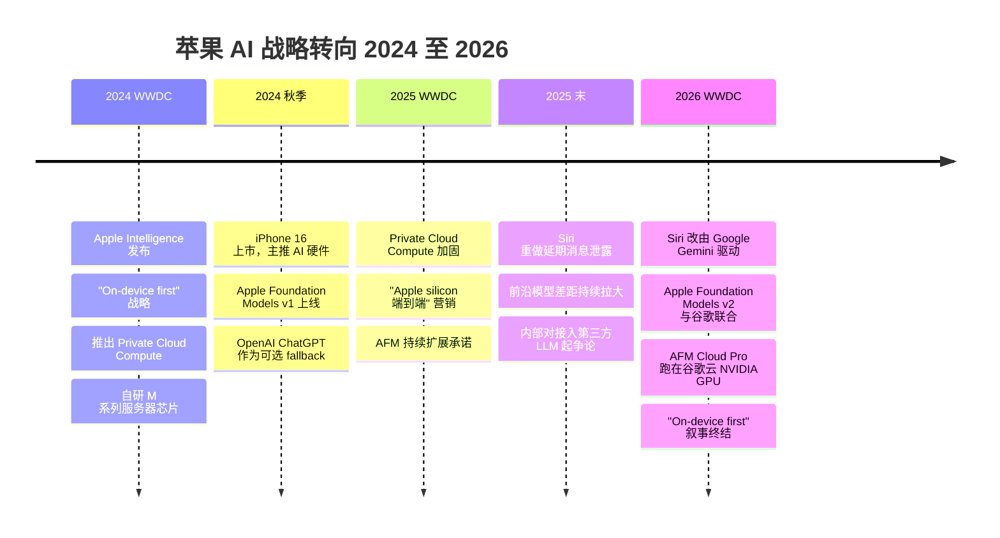

+++
date = '2026-06-09T10:00:00+08:00'
draft = false
title = 'Apple WWDC 2026 大转向：Siri 改用谷歌 Gemini，国行 iPhone 怎么办？'
description = 'WWDC 2026 快评：Siri 改由谷歌 Gemini 驱动，AFM Cloud Pro 跑在谷歌云的 NVIDIA GPU 上，苹果自研 AI 叙事终结。谁赢谁输、国行 iPhone 用什么模型、现在要不要买 M5 Mac mini 搞本地 AI，一文给出判断。'
toc = true
tags = ['Apple WWDC 2026', 'Apple Intelligence', 'Google Gemini', 'Siri', 'Apple Foundation Models', 'Local AI', 'Apple Silicon', 'MLX', 'NVIDIA', 'Private Cloud Compute']
keywords = ['Apple WWDC 2026', 'Apple Intelligence Gemini', '苹果 AI 用谷歌', 'Siri 谷歌 Gemini', 'Apple Foundation Models v2', '苹果 AI 路线转向', 'Apple Intelligence 中国', '国行 iPhone AI', 'Mac mini M5 本地 AI', '苹果统一内存 AI 2026', '苹果发布会 2026', 'AFM Cloud Pro', '苹果隐私 AI', '苹果 Google 合作', 'Siri 重做 2026']

[[params.faqItems]]
question = "WWDC 2026 之后 Siri 真的是谷歌 Gemini 在驱动吗？"
answer = '''是的。2026 年 6 月 8 日 WWDC 苹果官方确认：新 Siri 由 Google Gemini 驱动，Apple Foundation Models v2 与谷歌联合开发。复杂查询走 AFM Cloud Pro，跑在谷歌云的 NVIDIA GPU 上（机密计算环境）；简单本地任务由蒸馏小模型在设备上跑。这跟 2024-2025 年苹果一直讲的"Private Cloud Compute、自研服务器芯片"故事是一个 180 度反转。'''

[[params.faqItems]]
question = "国行 iPhone 用得了 Apple Intelligence 吗？Gemini 在中国大陆不能用啊。"
answer = '''WWDC 2026 苹果没公布中国大陆方案。Gemini 在大陆封禁，Apple Intelligence 中国版必然得换本地大模型供应商，候选基本就三家：百度文心、阿里通义、腾讯混元。参考 Apple Maps、Apple Pay、iCloud 的历史，国行版会单独搞一套，且时间表苹果说了不算——大概率会比全球版晚 1-2 个季度甚至更久。短期想体验完整 Apple Intelligence 的，海外版 iPhone + 海外 Apple ID 仍是唯一靠谱路线。'''

[[params.faqItems]]
question = "现在还该不该买 M5 Mac mini 搞本地 AI？"
answer = '''该买，而且 WWDC 2026 之后买的理由更强了，不是更弱。原因是苹果系统级 AI 不再跟你的 Ollama / MLX / Draw Things 抢算力——苹果模型层都让出去了，本地开源工具反而获得了更纯净的硬件资源。Apple Silicon 硬件路线没变，M5 / M6 还会继续堆统一内存和带宽。本地 70B 推理仍是 64GB 起步、跑 Qwen 2.5 / Llama 3.3 仍是当前性价比最高的方案。详见我之前写的 [M4 Pro vs M3 Max 实测](/zh/posts/ai/2026-04-14-mac-apple-silicon-ai-workstation/)。'''

[[params.faqItems]]
question = "苹果不是说一切隐私优先吗？现在数据要上传谷歌云，隐私故事还成立吗？"
answer = '''技术上成立，营销上完蛋。AFM Cloud Pro 用的是机密计算（confidential compute），技术原理是云端运营商在物理控制权下也读不到租户数据，NVIDIA H100/H200 支持这个能力。但消费者认知里"苹果不上传 vs 谷歌上传"的简单对比已经死了。2024 年的卖点是"苹果根本不传你的东西"，2026 年的卖点变成"我们传到谷歌云，但加密了"。这两句话在普通用户脑子里完全不是一回事，苹果保住了技术，丢了故事。'''

[[params.faqItems]]
question = "WWDC 2026 真正的赢家是谁？"
answer = '''Google 和 NVIDIA 大获全胜，Apple 降级。Google 拿到了 iPhone 用户每一次复杂查询的搜索意图数据——这是 Android + iPhone 双平台的搜索意图金矿；NVIDIA 拿到了 AFM Cloud Pro 的硬件订单。Apple 终于让 Siri 能用了，但从"AI 平台所有者"降级成"AI 客户"。意外的隐藏赢家是本地 AI 圈：Ollama、MLX、ComfyUI、Draw Things 这帮工具不再担心被苹果系统级 AI 锁死生态，Apple Silicon 硬件红利继续吃。'''
+++

WWDC 2026 是苹果十年来最大的一次公开认输——两个小时的 keynote，真正的头条只有一句话：苹果承认自己赢不了 AI 了。证据硬得不能再硬：**新版 Siri 由 Google Gemini 驱动**，Apple Foundation Models v2 与谷歌联合开发，复杂查询走 **AFM Cloud Pro**——部署在**谷歌云**，跑在 **NVIDIA GPU** 上，套一层机密计算环境。这不是爆料，是 2026 年 6 月 8 日苹果在 Apple Park 自己的舞台上亲口说的。

想想这句话取代的是什么。这家公司从 2024 年起花了整整两年讲 **Private Cloud Compute**：苹果自己的 AI 服务器、自己的数据中心、自己的芯片，外加密码学证明"谁都看不到你的数据，包括苹果自己"。当年 Intel 转 Apple Silicon 是把整个栈抢回自己手里，WWDC 2026 是同一个动作倒着做——把栈里最值钱的那一层，交给了斗得最久的对手。

先把三个判断摆出来。第一，这是被迫的，不是选的——Siri 重做没在时间窗口内收敛，谷歌协议是终于发货的代价。第二，赢家是 Google 和 NVIDIA，赢得毫无悬念。第三，也是台上没人会说的：闷声占便宜的是在 Apple Silicon 上跑 Ollama、MLX、ComfyUI 的本地 AI 玩家。如果你是这群人，这篇后半段都是写给你的。

## WWDC 2026 到底官宣了什么

把舞台编排剥掉，实质内容一张卡片就写得下。新 Siri 覆盖 **iOS 27、iPadOS 27、macOS Golden Gate、watchOS 27、visionOS 27、CarPlay、AirPods**，底层就改了两件事：

1. **简单查询留在本地**，由蒸馏版小模型处理——快、离线、不走网络。苹果没公布参数量、蒸馏比例，也没说哪些设备跑哪个尺寸。第三方报道里的任何具体数字，目前都是猜的。
2. **复杂查询走 AFM Cloud Pro**——撕掉品牌贴纸，就是谷歌云 + NVIDIA GPU + 机密计算。"Apple Foundation Models v2"这个名字留着，但模型和底下的基础设施都是跟谷歌共建的。

台上其它所有东西——Visual Intelligence、Safari 标签智能整理加降价提醒、Photos AI 编辑（Cleanup / Extend / Spatial Reframe，带 SynthID 水印）、重做的 Image Playground、模仿你写作风格的 Messages 智能回复、自然语言创建快捷指令、跨 App 上下文感知、Passwords 凭据强化、VoiceOver 和 Voice Control 增强——都是真的，但全是同一套双层架构的下游产物。没有 Gemini 撑着的云端路径，一个都跑不起来。

没说的比说了的更响。没有 Private Cloud Compute 新路线图，没有新的自研推理芯片，没有任何前沿模型 benchmark——一个数字都没有。MLX 框架的细节也没放出（截至 6 月 9 日上午，比 keynote 幻灯片更深的开发者文档还没公开）。苹果有货的时候一定会吹，它沉默的时候，你要信那个沉默。

## 两年时间，从"全都在设备上"到"难的交给谷歌"

想体会这个反转有多猛，把时间倒回 18 个月，听听苹果当时在说什么。

这条弧线连起来读非常残忍：消费 AI 史上最激进的垂直整合故事，结局是苹果付钱请谷歌干最难的部分。而它烧掉的品牌故事，本来就是护城河本身。2024 年的话术是"我们是唯一不监控你做 AI 的平台"，2026 年变成"我们是唯一让谷歌做推理、但多套一层加密的平台"。这话你试试一句讲给普通消费者听——讲不通的。

那苹果为什么还是干了？因为没得选。2025 年下半年起，多个渠道的报道指向同一个方向：苹果内部 LLM 扩展落后于前沿，Apple Foundation Models v1 和 Gemini 2.x / GPT-5 / Claude 4 的差距在拉大，不是在缩小。统一内存的硬件优势搬不进数据中心训练场——那里是 NVIDIA CUDA + 互联生态的天下。训练语料还被自己的隐私立场卡着脖子：苹果是真没有谷歌那个量级的数据。

模型层赢不了，路只有两条：发个差产品，或者找人合作。苹果 2024 年承诺了 Siri 重做，2025 年跳了一次票，2026 年再跳就没法收场。谷歌协议就是"终于发货"的账单。

这张账单比看上去更贵。苹果等于当众承认**模型层不是自己能竞争的地方**，而这个承认会层层传导：开发者 API、App Store 上 AI 应用的生态秩序、未来硬件路线（推理都跑在谷歌数据中心的 H100 上了，还自研 AI 加速器干嘛？）、还有 M 系列芯片在未来十年营销里的位置。

## 谁是 WWDC 2026 真正的赢家

记分牌摆出来，胜负毫无悬念：

| 玩家 | WWDC 2026 之前 | 之后 | 净结果 |
|--------|---------------------------|----------------|-----|
| Google | 前沿 LLM 供应商，只有 Android 分发 | 前沿 LLM 供应商，拿下 **iPhone + Android** 双分发 + 苹果意图数据 | 大胜 |
| NVIDIA | OpenAI、Anthropic、xAI、Google 的算力供应商 | 又拿下 AFM Cloud Pro 的事实算力订单 | 大赢 |
| Apple Silicon 硬件团队 | Mac 作为 AI 工作站，缓慢增长 | 不变，还少了一个抢资源的内部叙事 | 闷声赢 |
| 本地 AI 开源圈（Ollama、MLX、llama.cpp）| 小众但增长，头顶悬着苹果平台风险 | 增长照旧，平台风险解除 | 赢 |
| Apple Foundation Models 团队 | 拥有端侧模型栈 | 只剩维护一个蒸馏变体，云端模型是谷歌的 | 大降级 |
| Private Cloud Compute 团队 | 在建苹果的垂直 AI 栈 | 战略定位存疑 | 大降级 |
| OpenAI（前可选合作方）| iOS 18-19 的默认 ChatGPT fallback | 大概率被更深的 Gemini 集成边缘化 | 输 |
| 消费者隐私叙事 | "苹果看不到你的数据" | "谷歌云上的机密计算" | 没了 |

整场发布会一句话：**Google 用一个模型 API 买走了苹果的意图数据，NVIDIA 卖了铲子，苹果发了一个更好用的 Siri，同时不再是 AI 平台**。

隐私那一行值得单独展开，因为苹果没有放弃隐私话术，是改写了它。2024 版：数据非必要不出设备，出了也是去苹果自己的服务器、跑苹果自己的芯片、端到端可证明。2026 版：前半句照旧，但目的地换成了**谷歌云上的机密计算环境，跑在 NVIDIA GPU 上，密码学隔离**。

说句公道话，技术原语是真的。机密计算——云端运营商就算有完整物理控制权也读不到租户数据——是可信的架构，NVIDIA H100/H200/Blackwell 正经支持。数学上成立，信任边界跟 2024 版不一样，但不是裸奔。

塌掉的是消费者层面的差异化。2024 年对非技术用户的话术简单到爆：**"苹果不上传你的东西，谷歌会。"** 2026 年，两家说的都是"我们上传的东西加密了"——密码学的微妙差别写不上广告牌。苹果保住了技术姿态，丢了营销武器。

如果你的应用处理敏感数据、之前一直靠苹果的端侧承诺，这事直接落到你桌上：你得自己去读 AFM Cloud Pro 的机密计算证明文档，判断谷歌的运营安全过不过得了你的威胁模型。这跟 2024 年是两种工作量——而且苹果到 6 月 9 日上午都还没放出开发者细节。

## 最大的隐藏赢家：在 Mac 上跑本地 AI 的你

现在讲反直觉的部分，也是我不把这篇写成悼词的原因。**在 Apple Silicon 上跑本地 AI 的开源社区，从 WWDC 2026 走出来的位置比走进去时更好。**

这周之前，Mac 上每个本地 AI 工具头顶都悬着一个真实风险：苹果把设备级 AI 锁死到 Apple Foundation Models 和神经网络引擎（ANE）上——就像它把摄影锁进自家 ISP、把音频锁进 AudioToolbox 一样。如果苹果真做出了有竞争力的端侧大模型，后面的剧本不用编：废掉开放 API、向第三方生态收税、把一切推进 ANE 加速的 AFM。这是苹果对每一个它控制的层都干过的事。不是被害妄想，是模式识别。

这个风险刚刚蒸发了。苹果不再拥有模型层——它是从谷歌租的。ANE 从战略中心沦为外围加速器。**Ollama、llama.cpp、MLX、ComfyUI、Draw Things、LM Studio**——所有跑 Metal、吃统一内存的工具，继续干它们本来在干的事，只是隔壁那个库比蒂诺味的引力井不会再成形了。

硬件那半边的账一分没变。我在 [Apple Silicon 本地 AI 工作站实测](/zh/posts/ai/2026-04-14-mac-apple-silicon-ai-workstation/) 里算过：M3 Max 及以上的内存带宽是本地 70B 推理可行的前提，而这条硬件投入线跟 OS 层发生什么完全无关。苹果不会停卖统一内存越堆越高的 M5 / M6 / M7 Mac，芯片照样一年比一年强。唯一变了的是：系统级 AI 不再抢着当芯片的头号客户。

二阶效应可能是最妙的。苹果从"AI 我们自己干"转向"难的找伙伴"，等于在营销上默许了 Mac 上 AI 的**多元主义**：多个专用工具、本地控制、按任务切换。这不是什么未来场景——[Mac mini 本地出图](/zh/posts/ai/2026-02-15-mac-mini-local-image-generation/) 的用户和 [Draw Things 重度玩家](/zh/posts/ai/2026-02-15-draw-things-ultimate-guide/) 早就活在这个世界里了。苹果只是不再假装想取代它。

## 国行 iPhone 怎么办：中国大陆的独有麻烦

中文读者绕不开这一段。**WWDC 2026 苹果对中国方案只字未提**，但问题躲不掉：Gemini 在中国大陆封禁，国行 iPhone 的 Apple Intelligence 用什么模型？

看苹果在中国的所有历史先例——Apple Maps、Apple Pay、iCloud 交给云上贵州、App Store 中国区独立审核——我的预判是：**国行 iPhone 一定会接本地大模型供应商**，但苹果说了不算，最终方案看监管和合作谈判。最现实的候选就三家：

1. **百度文心一言**：和苹果有历史合作（Apple Intelligence 1.0 阶段在中国本就在谈百度），但文心目前在国内评测里不是第一梯队，跟 Gemini 2.x 差距明显。
2. **阿里通义千问**：开源版 Qwen 在国际榜单上已经能跟前沿模型掰手腕（尤其 Qwen2.5-Max 和 Qwen3），技术上是最匹配的候选。
3. **腾讯混元**：微信生态绑定深，中文场景本地化优势独家，但公开 benchmark 上模型能力偏弱。

最后很可能是**多家并存**：苹果搞一个国行专版 Apple Intelligence，像默认搜索引擎那样让用户选 LLM 供应商。但什么时候上线？苹果没说，监管批文更没人敢保证。**国行版比全球版晚 1-2 个季度是乐观估计，晚一年也完全可能。**

短期想体验完整 Apple Intelligence 的国内用户，靠谱路线还是只有一条：**海外版 iPhone + 海外 Apple ID + 海外网络环境**。这条路有成本——保修、维修、配件、汇率——但眼下是唯一能玩到完整功能的方式。

## 要不要现在买 M5 Mac mini：我的决策框架

直接给推荐：

| 你的情况 | 推荐 | 理由 |
|---------|------|------|
| 已经有 M3/M4 Pro 48GB+ Mac | **不用换**，继续观望 M5 Studio | 内存带宽和容量没变化前，没有换机理由 |
| 想买首台 AI Mac，预算 1.5-2 万 | **M4 Pro mini 48GB 或等 M5 mini** | Pro 档够跑 34B 级模型，48GB 是底线 |
| 重度本地 AI（70B 推理 + 出图）| **M3 Max Studio 64-128GB 二手或官翻** | M5 Max Studio 短期不会出，M3 Max 仍是性价比之王 |
| 通勤 + 本地 AI 兼顾 | **M4 Max MacBook Pro 64GB+** | 带宽 410-546 GB/s，便携场景唯一选择 |
| 等下一代再买 | **可以等 M5 Studio**，但别等太久 | 苹果不再以 AI 为芯片主营销点，硬件代际差异会变小 |

WWDC 2026 之后的关键判断是：**苹果硬件投入的方向不变，软件锁定的压力消失了**。今天买的任何 M 系列 Mac，未来三年都不会因为"系统级 AI 抢算力"或"开源工具被弃用"而贬值。从这个角度看，现在反而是配本地 AI 工作站最稳的时间点。

国内购买渠道我在 [那篇 Mac AI 工作站文章](/zh/posts/ai/2026-04-14-mac-apple-silicon-ai-workstation/) 里给过详细对比，一句话结论：教育优惠 > 京东 618/双 11 > 官翻 > 闲鱼无保二手。

## 给国内开发者的四个动作

今天起要退役的那条默认假设是：苹果会提供一个有竞争力的默认 LLM。不会了，按新前提重新设计：

1. **把 Apple Intelligence 当路由目标，别当模型**。快速本地动作，用系统 API 调蒸馏模型没问题；推理、总结、任何质量敏感的活儿，别指望苹果的云端路径比你直连供应商更好。自己接。
2. **Mac 现在是比发布会暗示的更好的本地 AI 开发机**。苹果刚把自己的 AI 野心从这道算术里划掉了。统一内存继续涨，Metal 继续改。本地搭你的 [Agent harness](/zh/posts/ai/2026-04-14-hermes-agent-guide/) 跑起来，OS 不会再来挡道。
3. **隐私文案重写**。之前主打"Apple Intelligence 让数据留在设备上"的，这条卖点不干净了。要么走更严的路线——纯本地、基于 MLX；要么老实告诉用户，你的 AI 功能会经苹果的管道碰到谷歌云。
4. **中国市场按两套做**。Gemini 大陆不可用，国行 Apple Intelligence 会接本地 LLM 供应商，时间表苹果说了不算。要上国行 App Store 的，准备一个可能比全球版晚 1-2 个季度的中国 AI 体验方案。

## 这事不意味着什么——以及它到底意味着什么

三个容易过度解读的点，先掐灭。

**不是 Apple Silicon 完了**。芯片路线图和模型战略是两条线，M5、M6 会继续推统一内存和带宽上限。Mac 上的本地 AI 一年比一年好，靠的是硬件，不是 keynote。

**不是端侧 AI 死了**。蒸馏本地模型真实存在，**Visual Intelligence、Photos AI 编辑、智能回复**大部分在本地跑。端侧只是不再是战略故事，降级成了底线配置。

**也不是苹果戏剧性地"放弃了"**。这是每个成功的平台公司丢掉某一层之后的标准动作：合作、拿利润、把竞争重新锚定到还能赢的地方——设备、OS 集成、隐私姿态、生态锁定。不是死刑，是降级：从"AI 平台所有者"降到"溢价 AI 分发渠道"。

但降级就是降级，再好的舞台编排也盖不住。两年前在同一个舞台上开场的 Apple Intelligence 故事，讲的是苹果按自己的方式赢 AI；WWDC 2026 讲的是苹果接受了赢不了，才让 Siri 终于能用。

所以只记一件事就够了：**苹果刚刚亲口告诉你，它不是 AI 平台，它是某个 AI 平台的客户**。Google 是平台，NVIDIA 是基础设施，苹果负责分发、集成和信任包装。对普通用户，问题不大——Siri 终于能用了，端侧功能是真改善。对在 Mac 上做开发的人，是闷声的好消息——本地 AI 的平台风险大幅下降，硬件照常迭代。对投资人，这是 iPhone 16 发布以来苹果 AI 雄心最大的单日重定价。

转向已经完成，故事在 6 月的一个周一改写。剩下唯一的悬念是苹果会不会再试一次把模型层拿回来——这场 keynote 里的每一个信号都在说：不会了。

## 延伸阅读

- [2026 年 Mac 本地跑大模型实测：M4 Pro vs M3 Max](/zh/posts/ai/2026-04-14-mac-apple-silicon-ai-workstation/) — 苹果硬件路线为什么比软件故事更重要
- [Mac mini 本地出图完整指南](/zh/posts/ai/2026-02-15-mac-mini-local-image-generation/) — 跟苹果 OS 层做什么完全无关的本地 AI 工作流
- [Draw Things 终极指南](/zh/posts/ai/2026-02-15-draw-things-ultimate-guide/) — Mac 原生本地出图最佳选择，完全独立于 Apple Intelligence
- [Hermes Agent 工程指南](/zh/posts/ai/2026-04-14-hermes-agent-guide/) — 自建 Agent harness，按需路由本地和前沿模型，不依赖系统级 AI
