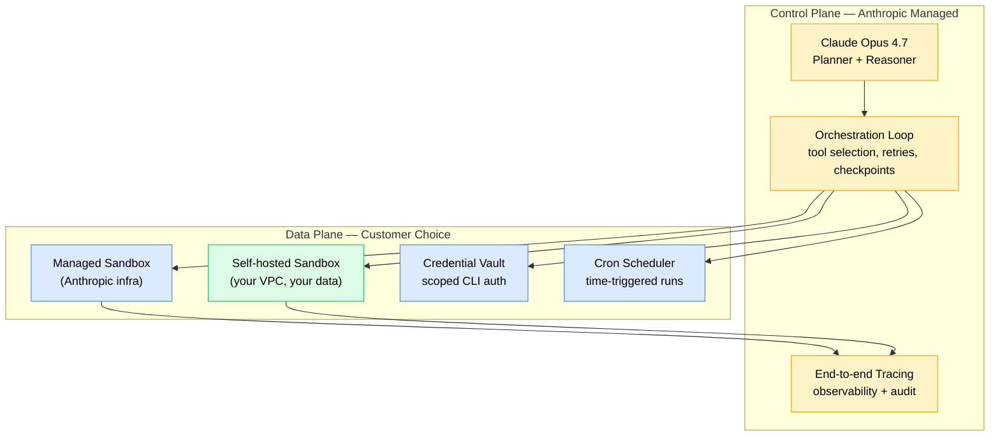

+++
date = '2026-06-12T10:00:00+08:00'
draft = false
title = "Anthropic's $965B Valuation Is About Agent Infrastructure, Not Models"
description = "Anthropic confidentially filed for an IPO at a $965B post-money valuation on a $47B run-rate. The real moat isn't Claude Opus — it's Managed Agents: sandboxed execution, checkpointing, cron, credential vault, and the new Self-hosted Sandboxes beta. Here's the infrastructure bet."
toc = true
tags = ['Anthropic', 'Claude Code', 'Managed Agents', 'AI Infrastructure', 'IPO']
keywords = ['Anthropic IPO 2026', 'Anthropic 965 billion valuation', 'Anthropic Series H', 'Claude Managed Agents', 'Self-hosted Sandboxes Anthropic', 'Anthropic vs OpenAI valuation', 'Claude Code infrastructure', 'agent infrastructure 2026', 'Code with Claude 2026']

[[params.faqItems]]
question = "Why is Anthropic valued at $965 billion if OpenAI has more users?"
answer = "Because investors are repricing the AI stack. Anthropic's Series H closed at $965B post-money on a confidentially-filed S-1 (June 2, 2026), backed by a $47B run-rate in revenue as of late May and a projected $10.9B in Q2 alone. The bet is not that Claude beats GPT-5 on benchmarks — Opus 4.7, GPT-5, Gemini 3 Pro, and Qwen 3.7 Max are all close enough on raw capability. The bet is that Anthropic owns the production agent runtime: Managed Agents, sandboxed execution, checkpointing, credential vault, cron schedules, end-to-end tracing. OpenAI's Codex CLI has none of this. Google's Gemini Agents are months behind. Infrastructure, not intelligence, is the bottleneck — and infrastructure is what compounds revenue."

[[params.faqItems]]
question = "What are Claude Managed Agents and what's new as of June 2026?"
answer = "Managed Agents is Anthropic's hosted runtime for production agents, in public beta since April 8, 2026. The platform handles sandboxed code execution, task checkpointing (pause/resume), scoped credential management, and end-to-end tracing — so you don't have to rebuild any of that yourself. The June 9 update added two production-critical features: cron schedules (agents can now run on time triggers without an external scheduler) and a secure command-line credential vault (agents can call authenticated CLI tools without you handing over plaintext secrets). The May 19 London announcement also opened a Self-hosted Sandboxes beta — but read the next question carefully before getting excited."

[[params.faqItems]]
question = "How is Self-hosted Sandboxes different from a fully self-hosted agent?"
answer = "It's not. Self-hosted Sandboxes lets your team run sandboxed code execution on your own infrastructure (your VPC, your compliance perimeter, your data) — but the agent orchestration loop, planning, and tool routing still run on Anthropic's control plane. In other words: your data stays home, your control plane doesn't. This is a hybrid SaaS + private data plane model. If your concern is data residency or PII handling, this works. If your concern is vendor independence or air-gapped operation, this does not solve your problem. Anthropic was explicit in their engineering blog ('Scaling Managed Agents: Decoupling the brain from the hands') that this is a deliberate split: the brain stays managed."

[[params.faqItems]]
question = "When will Anthropic IPO and what does the timeline look like?"
answer = "As of June 12, 2026, the only confirmed facts are: confidential S-1 filed June 2, public reporting cites 'as soon as this fall' as the working timeline. That points to a likely Q4 2026 listing window if the SEC review proceeds cleanly. The valuation in the filing is whatever the most recent Series H supported ($965B post-money), but Anthropic has not made the precise IPO price band public — that comes later in the roadshow. If they list at the Series H valuation, this would be one of the largest tech IPOs in U.S. history. Investors should treat the valuation as confidential and subject to adjustment until the prospectus is public."

[[params.faqItems]]
question = "Can OpenAI catch up on the agent infrastructure gap?"
answer = "Technically yes — building sandboxed execution, checkpointing, and credential management is engineering work, not research. Practically, the lag is now meaningful. OpenAI's Codex CLI shipped impressive autonomy but offers no managed runtime equivalent: no hosted sandboxes, no checkpointing API, no built-in cron, no scoped credential vault. They are essentially shipping the brain and asking the developer to build the hands. Google's Gemini Code Assist is in a similar position. The window for OpenAI to match Managed Agents feature-for-feature is realistically 6-12 months, but during that window Anthropic gets to compound enterprise lock-in with every team that builds on top of the runtime. This is the textbook 'platform first-mover' setup, and it's why investors priced the gap in."
+++

On June 2, 2026, Anthropic confidentially filed for an IPO at a **$965 billion post-money valuation** — backed by Series H funding of $65 billion from Altimeter Capital, Dragoneer, Greenoaks, Sequoia Capital, Capital Group, Coatue, and D1 Capital Partners. Two days earlier the company disclosed a **$47B run-rate revenue** as of late May, and projected **$10.9 billion in Q2 alone**, more than double Q1. That is the largest private-to-public valuation pop in the history of generative AI, and for the first time it puts Anthropic ahead of OpenAI on paper.

The headline-friendly read is: Claude won. The model story.

The headline-friendly read is wrong. Claude Opus 4.7 is roughly tied with GPT-5 and Gemini 3 Pro on most benchmarks anyone cares about. Qwen 3.7 Max is close enough that for many production workloads the model is fungible. **The $965B valuation has very little to do with which model is best.** It has everything to do with what Anthropic shipped between April 8 and June 9 — Managed Agents, Self-hosted Sandboxes, cron schedules, the credential vault — and what that infrastructure stack means for who owns the next decade of agent runtime.

This is, in their own words from the engineering blog that dropped alongside the Code with Claude Tokyo keynote: **"Infrastructure, not intelligence, is now the bottleneck for production agents."** That sentence is the entire investment thesis compressed into eleven words.

## Why $965B is not a bubble: the run-rate math

Before unpacking the agent infrastructure thesis, the numbers need a sanity check. A $965B valuation looks insane against a 2024-era mental model where Anthropic was a research lab burning capital. Against the 2026 financials it is a 20x revenue multiple on a hyperscaler-class growth curve — and that is actually conservative for a category leader at this stage.

The relevant comparables: Snowflake went public in 2020 at roughly a 175x revenue multiple. Datadog crossed 50x at IPO. Even Meta, a mature business, sits around 8-10x trailing revenue today. **$965B / $47B run-rate = ~20x.** For a company doubling quarter-over-quarter on enterprise revenue, this is the kind of multiple investors hand out when they believe the category is winner-take-most.

The doubling pattern matters more than the absolute number. Q1 2026 revenue is implied around $5B (working backward from the Q2 $10.9B projection of "environmental doubling"). Run-rate hit $47B by late May. If Q3 holds the cadence, annualized exit-2026 revenue lands in the $30-40B range. At that point the valuation looks like a Microsoft-at-IPO comparable, not a meme stock.

I am not claiming the $965B is bulletproof. It is confidential, it could be adjusted before pricing, and the public market may not absorb a tech IPO of this size cleanly. What I am claiming: if you reflexively dismiss it as bubble, you are pattern-matching to 2021 SaaS exuberance and missing the actual business underneath. The business is real. The question is whether the valuation correctly identifies *why* it is real — and that is where most of the post-filing commentary went wrong.

## The actual moat: brain decoupled from hands

Anthropic's engineering blog post that accompanied the June 9 Tokyo announcement is titled **"Scaling Managed Agents: Decoupling the brain from the hands."** That title is the entire competitive thesis in one sentence, and almost no one in the post-filing coverage picked up on it.

Here is the architecture, in the form the platform actually exposes:

The model — the "brain" — does the planning, reasoning, and tool selection. The hands — sandboxed code execution, the credential vault, the scheduler, the tracing layer — are the runtime components that actually let agents do useful work in production. Anthropic owns both layers and the contract between them. Crucially, when they opened Self-hosted Sandboxes in beta on May 19, they let customers run the hands inside their own infrastructure, but **the brain and the orchestration loop stay on Anthropic's control plane**. This is not a generous open-sourcing move. It is a textbook platform play.

Why does this matter for valuation? Because the model layer is converging. I have argued this point at length in my [Hermes Agent v0.9 review](/posts/ai/2026-04-14-hermes-agent-guide/) and in the broader [Harness Engineering window-of-opportunity post](/posts/ai/2026-05-08-harness-engineering-window-of-opportunity/) — when LangChain swapped harnesses without touching the model, their TerminalBench score moved from 52.8% to 66.5% and their ranking went from outside the top 30 to top 5. The model was constant. The harness — the production runtime, the very thing Anthropic has now productized as Managed Agents — was everything.

If models are fungible and runtime is decisive, then whoever owns the production runtime owns the economics. That is what the $965B is buying.

## The hands: what Managed Agents actually ships

Cataloging the capability stack matters because the gap between Anthropic and the rest of the field is now concrete, not handwavy. As of the June 9 Tokyo announcement, Managed Agents in public beta ships:

| Capability | Status | Who else has it? |
|---|---|---|
| Sandboxed code execution | GA (Apr 8) | OpenAI Codex partial; Google nothing equivalent |
| Task checkpointing (pause/resume) | GA (Apr 8) | No managed competitor |
| Scoped credential management | GA (Apr 8) | No managed competitor |
| End-to-end tracing | GA (Apr 8) | OpenAI Traces (limited); Langfuse (BYO) |
| Cron schedules | Beta (Jun 9) | None — you'd build this on Temporal or Inngest |
| CLI credential vault | Beta (Jun 9) | None — usually handled by ad-hoc env vars |
| Self-hosted Sandboxes | Beta (May 19) | None — Codex CLI runs locally but offers no managed sandbox API |

Look at the right column. **Most of these rows say "none."** That is not an accident of feature-naming. It reflects the fact that OpenAI, Google, and the open-source ecosystem have all been competing on the wrong axis — model capability and inference cost — while Anthropic has been quietly building the rest of the production stack.

The cron schedule update from June 9 is a perfect example of why this matters. Until last week, if you wanted a Managed Agent to run on a time trigger — say, "every weekday at 8am, scan support tickets and draft responses" — you had to wire up an external scheduler (Temporal, Inngest, AWS EventBridge), have it hit your agent's webhook, manage state across runs, and handle failure modes. Now you write `schedule: "0 8 * * 1-5"` in the agent config and Anthropic handles state, retries, observability, and credential refresh. That is **one line of YAML replacing a multi-day infrastructure project**, and it is the kind of compound value that turns a 20% better model into a 5x better product.

The CLI credential vault is similarly load-bearing. Before this week, if an agent needed to call `gh`, `aws`, `kubectl`, or any CLI requiring authentication, you were either embedding secrets in the sandbox image (bad), proxying them through a custom secrets layer (annoying), or accepting that authenticated CLI workflows were off-limits (limiting). The vault closes that gap and makes the agent runtime actually viable for real DevOps and platform engineering workloads.

## The trap: Self-hosted Sandboxes is half-open, not open

Here is the part the post-filing coverage mostly missed, and that developers absolutely must understand before they sign on.

Self-hosted Sandboxes — announced at the London station of Code with Claude on May 19, expanded discussion at Tokyo on June 5-6 — is being read in some quarters as "Anthropic is opening up the platform." That read is wrong, and I would argue dangerously wrong if you make architecture decisions based on it.

What Self-hosted Sandboxes actually does: lets your team deploy the sandboxed code execution environment inside your own infrastructure. Your data plane. Your VPC. Your compliance perimeter. Your secrets management. This is real, and it solves a class of legitimate enterprise concerns — particularly around data residency, PII handling under GDPR / HIPAA / SOX regimes, and large data egress costs when the sandbox needs to read terabytes from your data lake.

What Self-hosted Sandboxes does *not* do: give you control over the agent orchestration loop. The brain, the planning, the tool selection, the retry logic, the checkpointing decisions — all of that **still executes on Anthropic's control plane**. If Anthropic's API is unreachable, your agents stop. If Anthropic deprecates a feature or changes pricing, you adapt. If you want to inspect or audit *how* the agent decided to call a tool — you get tracing data Anthropic provides, but you don't own the runtime logic.

This is a deliberate design choice from Anthropic, and they were explicit about it in the engineering blog. They are not pretending otherwise. But the marketing word "self-hosted" carries baggage from the open-source era that does not apply here. **The correct mental model is "private data plane on a managed control plane,"** which is what most modern SaaS looks like (think Snowflake on AWS, or Databricks on your cloud). For most use cases this is fine. For a minority of use cases — air-gapped environments, jurisdictions where the U.S. control plane is unreachable, regulated industries that require full runtime auditability — this does not solve the problem and you need to know that before you bet your architecture on it.

## OpenAI's Codex CLI: the brain without the hands

The contrast that makes the valuation make sense is what OpenAI is actually shipping in the agent space, and it is worth pulling apart explicitly because I think the comparison is the most underappreciated story in the post-filing coverage.

OpenAI's Codex CLI is genuinely impressive on autonomy. Long-horizon coding tasks, multi-step reasoning, decent recovery from failure. On raw model + agentic capability, GPT-5 in Codex is competitive with Claude Opus 4.7 in Claude Code — I covered this comparison in detail in my [Codex CLI mastery guide](/posts/ai/2026-02-12-codex-cli-mastery-guide/) and the follow-up [Claude Code vs Codex deep dive](/posts/ai/2026-02-19-claude-code-vs-codex/). The disclosure here: both are useful, both are good products, and I use both regularly.

But Codex CLI has no managed runtime equivalent. Specifically:

- **No hosted sandboxed execution.** Code runs locally on your machine. That is fine for a developer at a terminal. It is unusable for an enterprise that wants 500 agents running 24/7 doing support triage, code review, and incident response.
- **No checkpointing API.** If a task fails mid-run or you want to resume across sessions, you build the state machine yourself.
- **No built-in cron.** Want it to run on schedule? Stand up your own scheduler.
- **No credential vault.** Authenticated tool calls go through whatever ad-hoc secret management you wire up.
- **No first-party tracing.** Observability is BYO.

What OpenAI is shipping is a great brain bundled into a single-user CLI. What Anthropic is shipping is the full production runtime, with multiple deployment topologies, end-to-end observability, and now scheduled background execution. **These are not the same product category.** Investors picked up on this gap, and they priced it in. The $965B post-money is the market saying: in 2027 and beyond, the operating system layer for agents is more valuable than the model layer.

OpenAI is not asleep. They can build all of this. The lag is engineering, not research — and engineering catches up. But the platform compounding effect is real. Every enterprise that ports its agent stack onto Managed Agents in 2026 is one less enterprise that will port off in 2027. Lock-in is not malicious, it is just gravity, and Anthropic has a 6-12 month head start to accumulate it.

## What this means for developers and platform teams

Pragmatic takeaways for the people who actually have to make build-versus-buy decisions in the next 60 days.

**If you are an individual developer or small team experimenting with agents:** Managed Agents is overkill until you have a workload that runs unattended. The Claude Code CLI you are already using is more than sufficient, and I've written up the [pricing breakdown](/posts/ai/2026-02-25-claude-code-pricing/) and the [rate limits reality check](/posts/ai/2026-02-28-claude-rate-limits/) elsewhere. Stay there until you have a real production workload, then port.

**If you are building agentic workloads at company scale and considering rolling your own runtime:** stop. The economics no longer favor a custom orchestration layer for the same reason they stopped favoring custom Kubernetes operators in 2018. Anthropic's Managed Agents at scale will cost less than your team's salary to maintain the equivalent. Build on top, not below.

**If you are in a regulated industry or have hard data residency requirements:** Self-hosted Sandboxes is interesting and probably solves your problem, but read the architecture carefully. The control plane is not in your perimeter. If your compliance officer needs the control plane in-scope, this is not for you and you should keep using internal-only models.

**If you are building agent frameworks (LangChain, AutoGen, CrewAI, etc.):** the ground shifted under you. The framework value proposition was "we abstract over the chaos of agent runtime." Anthropic just productized the runtime. The remaining value is in cross-model abstraction and provider-neutral orchestration — which is real, but smaller. I covered the framework-vs-product dynamic in my [OpenSpec workflow post](/posts/ai/2026-04-09-claude-code-openspec-superpowers/) and the principle generalizes here.

**If you are an investor or strategy person reading this:** the bet implied by the $965B is that Anthropic's runtime moat compounds for 24-36 months before competitors close the gap meaningfully. If you believe that — and I do, modulo execution risk — the valuation is rich but not crazy. If you think OpenAI can ship parity in 6 months — which would require them to materially shift product priorities away from frontier model research — then you should short. I am not in that camp.

## The IPO timeline: what to actually expect

As of June 12, 2026, here is what we know with high confidence: confidential S-1 filed June 2; reported target window "as soon as this fall"; Series H at $965B post-money; revenue at $47B run-rate as of late May; Q2 projected $10.9B. Here is what we don't know: the precise IPO price band, the exact float, whether there will be a dual-class structure, whether the SEC review proceeds cleanly, and whether macro conditions in Q4 hold up enough to support a listing of this size.

My base case: Q4 2026 listing, price band reflecting the Series H valuation with some discount for liquidity and public-market risk, primary float in the $20-40B range to give the company a substantial cash cushion. If they list at anywhere close to the Series H number, this is one of the largest tech IPOs in U.S. history — comparable to the Saudi Aramco listing on a global basis, and the largest U.S. tech IPO on record.

The honest caveat: every word of this is subject to change before pricing. The IPO valuation is not the Series H valuation — they look at different inputs. The market mood in October-December 2026 matters. The Q3 earnings update matters. If Anthropic ships another major Managed Agents feature in September (which is my expectation given the April-May-June cadence), the price band moves up. If a model competitor leapfrogs them on benchmarks during the quiet period, the price band moves down. Treat the $965B as a strong signal of where the smart money has positioned, not as a settled fact.

## What I would do today

I am running Claude Code daily and ported a few personal agent workloads onto Managed Agents during the public beta. The June 9 cron + credential vault update materially shifted what I think the platform can do — I previously had Hermes Agent running scheduled jobs from a $5 Hetzner VPS (covered in the [Hermes deep dive](/posts/ai/2026-04-24-hermes-agent-v010-deep-review/)) and I am now moving the production-critical ones to Managed Agents because the operational overhead disappears.

If you are sitting on the fence, here is my one-sentence test: **do you have an agent workload that needs to run when you are not watching it?** If yes, Managed Agents is the cheapest place to put it. If no, stay in interactive Claude Code and revisit in three months.

The $965B valuation will get adjusted, the IPO timeline will slip or accelerate, and the feature gap between Anthropic and OpenAI will narrow over 2027. None of that changes the structural point: agent infrastructure is the new bottleneck, Anthropic owns it, and the investor consensus has now priced it in. Whether that is the right bet is a 24-month question. Whether it is a serious bet is no longer in doubt.
