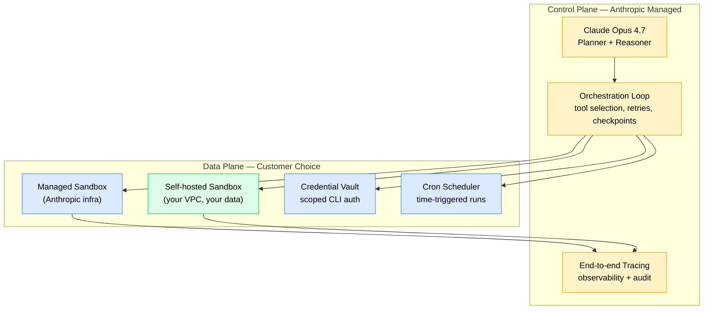

+++
date = '2026-06-12T10:00:00+08:00'
draft = false
title = "Anthropic's $965B Valuation Is Pricing Agent Infrastructure"
description = "Anthropic filed for an IPO at a $965B valuation on a $47B run-rate — a 20x multiple that prices Managed Agents, the agent runtime, not Claude itself."
toc = true
tags = ['Anthropic', 'Claude Code', 'Managed Agents', 'AI Infrastructure', 'IPO']
keywords = ['Anthropic IPO 2026', 'Anthropic 965 billion valuation', 'Anthropic Series H', 'Claude Managed Agents', 'Self-hosted Sandboxes Anthropic', 'Anthropic vs OpenAI valuation', 'Claude Code infrastructure', 'agent infrastructure 2026', 'Code with Claude 2026']

[[params.faqItems]]
question = "Why is Anthropic valued at $965 billion if OpenAI has more users?"
answer = "Because investors are repricing the AI stack. Anthropic's Series H closed at $965B post-money on a confidentially-filed S-1 (June 2, 2026), backed by a $47B run-rate in revenue as of late May and a projected $10.9B in Q2 alone. The bet is not that Claude beats GPT-5 on benchmarks — Opus 4.7, GPT-5, Gemini 3 Pro, and Qwen 3.7 Max are all close enough on raw capability. The bet is that Anthropic owns the production agent runtime: Managed Agents, sandboxed execution, checkpointing, credential vault, cron schedules, end-to-end tracing. OpenAI's Codex CLI has none of this. Google's Gemini Agents are months behind. Infrastructure, not intelligence, is the bottleneck — and infrastructure is what compounds revenue."

[[params.faqItems]]
question = "What are Claude Managed Agents and what's new as of June 2026?"
answer = "Managed Agents is Anthropic's hosted runtime for production agents, in public beta since April 8, 2026. The platform handles sandboxed code execution, task checkpointing (pause/resume), scoped credential management, and end-to-end tracing — so you don't have to rebuild any of that yourself. The June 9 update added two production-critical features: cron schedules (agents can now run on time triggers without an external scheduler) and a secure command-line credential vault (agents can call authenticated CLI tools without you handing over plaintext secrets). The May 19 London announcement also opened a Self-hosted Sandboxes beta — but read the next question carefully before getting excited."

[[params.faqItems]]
question = "How is Self-hosted Sandboxes different from a fully self-hosted agent?"
answer = "It's not. Self-hosted Sandboxes lets your team run sandboxed code execution on your own infrastructure (your VPC, your compliance perimeter, your data) — but the agent orchestration loop, planning, and tool routing still run on Anthropic's control plane. In other words: your data stays home, your control plane doesn't. This is a hybrid SaaS + private data plane model. If your concern is data residency or PII handling, this works. If your concern is vendor independence or air-gapped operation, this does not solve your problem. Anthropic was explicit in their engineering blog ('Scaling Managed Agents: Decoupling the brain from the hands') that this is a deliberate split: the brain stays managed."

[[params.faqItems]]
question = "When will Anthropic IPO and what does the timeline look like?"
answer = "As of June 12, 2026, the only confirmed facts are: confidential S-1 filed June 2, public reporting cites 'as soon as this fall' as the working timeline. That points to a likely Q4 2026 listing window if the SEC review proceeds cleanly. The valuation in the filing is whatever the most recent Series H supported ($965B post-money), but Anthropic has not made the precise IPO price band public — that comes later in the roadshow. If they list at the Series H valuation, this would be one of the largest tech IPOs in U.S. history. Investors should treat the valuation as confidential and subject to adjustment until the prospectus is public."

[[params.faqItems]]
question = "Can OpenAI catch up on the agent infrastructure gap?"
answer = "Technically yes — building sandboxed execution, checkpointing, and credential management is engineering work, not research. Practically, the lag is now meaningful. OpenAI's Codex CLI shipped impressive autonomy but offers no managed runtime equivalent: no hosted sandboxes, no checkpointing API, no built-in cron, no scoped credential vault. They are essentially shipping the brain and asking the developer to build the hands. Google's Gemini Code Assist is in a similar position. The window for OpenAI to match Managed Agents feature-for-feature is realistically 6-12 months, but during that window Anthropic gets to compound enterprise lock-in with every team that builds on top of the runtime. This is the textbook 'platform first-mover' setup, and it's why investors priced the gap in."
+++

$965 billion — and the punchline is that it might be cheap. Snowflake went public in 2020 at roughly 175 times revenue. Datadog crossed 50x at its IPO. Anthropic's confidential S-1, filed June 2, 2026, asks for about 20x against a $47 billion run-rate. By the one yardstick Wall Street actually uses to price software companies, the scariest valuation in tech is a more modest ask than a data-warehouse vendor made six years ago.

The rest of the facts, fast. The Series H that set the price raised $65 billion from Altimeter Capital, Dragoneer, Greenoaks, Sequoia Capital, Capital Group, Coatue, and D1 Capital Partners, at $965B post-money. Two days before the filing, Anthropic disclosed the $47B run-rate as of late May and projected **$10.9 billion in Q2 alone** — more than double Q1. It's the largest private-to-public valuation pop in the history of generative AI, and it puts Anthropic ahead of OpenAI on paper for the first time.

The lazy read of the Anthropic $965 billion valuation is "Claude won" — a model story. It's wrong. Claude Opus 4.7 is roughly tied with GPT-5 and Gemini 3 Pro on every benchmark anyone cares about, and Qwen 3.7 Max is close enough that for plenty of production workloads the model is fungible. What the number is actually pricing is what Anthropic shipped between April 8 and June 9 — Managed Agents, Self-hosted Sandboxes, cron schedules, a credential vault — and what that stack means for who owns the next decade of agent runtime.

Anthropic said the quiet part out loud, in the engineering blog that dropped alongside the Code with Claude Tokyo keynote: **"Infrastructure, not intelligence, is now the bottleneck for production agents."** One sentence. That's the entire investment thesis.

## The $965B Math: A Doubling Business at a 20x Multiple

Sanity-check the number before theorizing about it. Against a 2024 mental model — Anthropic as a research lab setting capital on fire — $965B looks unhinged. Against the 2026 financials, it's a 20x revenue multiple on a hyperscaler-class growth curve, which for a category leader at this stage is closer to conservative than crazy.

Run the comparables: Snowflake priced around 175x revenue in 2020, Datadog crossed 50x at IPO, and Meta — a mature, wildly profitable business — trades around 8–10x trailing revenue today. **$965B / $47B run-rate ≈ 20x.** That's the multiple investors hand out when they believe a market is winner-take-most and the company in front of them is the winner.

The doubling pattern matters more than the absolute number. Work backward from the Q2 projection — $10.9B, more than double Q1 — and Q1 lands around $5B. The run-rate hit $47B by late May. If Q3 holds that cadence, annualized exit-2026 revenue lands in the $30–40B range, and at that point the honest comparable isn't a meme stock. It's Microsoft at IPO.

> As of June 12, 2026, Anthropic has confidentially filed for an IPO at a $965 billion post-money valuation, backed by a $47 billion revenue run-rate as of late May and a projected $10.9 billion in Q2 2026 — roughly a 20x revenue multiple.

I'm not calling the number bulletproof. It's a confidential filing, it can move before pricing, and the public market may not cleanly absorb a listing this size. But if your reflex is to yell "bubble," you're pattern-matching to 2021 SaaS exuberance and missing a real business underneath. The interesting question isn't whether the business is real — it's whether the valuation correctly identifies *why* it's real. That's where most of the post-filing commentary faceplanted.

## The Real Moat: Decoupling the Brain From the Hands

The tell is hiding in a blog title. The engineering post that accompanied the June 9 Tokyo announcement is called **"Scaling Managed Agents: Decoupling the brain from the hands"** — the entire competitive thesis compressed into one line, and almost no one in the post-filing coverage picked up on it.

Here's the architecture the platform actually exposes:

The brain — the model — plans, reasons, and picks tools. The hands — sandboxed execution, the credential vault, the scheduler, the tracing layer — are what let an agent do real work in production. Anthropic owns both layers *and the contract between them*. And when Self-hosted Sandboxes opened in beta on May 19, customers got to run the hands inside their own infrastructure while the brain and the orchestration loop stayed on Anthropic's control plane. That's not a generous open-sourcing move. That's a textbook platform play.

Why does this drive the valuation? Because the model layer is converging. I've argued this at length in my [Hermes Agent v0.9 review](/posts/ai/2026-04-14-hermes-agent-guide/) and the [Harness Engineering window-of-opportunity post](/posts/ai/2026-05-08-harness-engineering-window-of-opportunity/): when LangChain swapped harnesses without touching the model, its TerminalBench score jumped from 52.8% to 66.5% and its ranking went from outside the top 30 to top 5. Same model, different runtime. The runtime — the thing Anthropic just productized as Managed Agents — was everything.

Follow that to the end. If models are fungible and runtime is decisive, whoever owns the production runtime owns the economics. That's what $965 billion is buying.

## What Managed Agents Actually Ships

The gap between Anthropic and everyone else is now concrete enough to put in a table. As of the June 9 Tokyo announcement, Managed Agents in public beta ships:

| Capability | Status | Who else has it? |
|---|---|---|
| Sandboxed code execution | GA (Apr 8) | OpenAI Codex partial; Google nothing equivalent |
| Task checkpointing (pause/resume) | GA (Apr 8) | No managed competitor |
| Scoped credential management | GA (Apr 8) | No managed competitor |
| End-to-end tracing | GA (Apr 8) | OpenAI Traces (limited); Langfuse (BYO) |
| Cron schedules | Beta (Jun 9) | None — you'd build this on Temporal or Inngest |
| CLI credential vault | Beta (Jun 9) | None — usually handled by ad-hoc env vars |
| Self-hosted Sandboxes | Beta (May 19) | None — Codex CLI runs locally but offers no managed sandbox API |

Look at the right column. **Most of those rows say "none."** That's not a naming accident — it's what happens when OpenAI, Google, and the open-source ecosystem all compete on model capability and inference cost while Anthropic quietly builds the rest of the production stack.

The June 9 cron update shows why one row in that table can be worth a valuation premium. Until last week, running a Managed Agent on a time trigger — "every weekday at 8am, scan support tickets and draft responses" — meant wiring up Temporal, Inngest, or AWS EventBridge, pointing it at your agent's webhook, managing state across runs, and eating the failure modes yourself. Now it's `schedule: "0 8 * * 1-5"` in the agent config, and Anthropic handles state, retries, observability, and credential refresh. **One line of YAML replacing a multi-day infrastructure project** — the kind of compounding that turns a 20% better model into a 5x better product.

The CLI credential vault is just as load-bearing. Before this week, an agent that needed `gh`, `aws`, or `kubectl` left you three bad options: bake secrets into the sandbox image (bad), proxy them through a custom secrets layer (annoying), or declare authenticated CLI workflows off-limits (limiting). The vault closes that gap, which is what makes the runtime viable for real DevOps and platform-engineering workloads.

## Self-hosted Sandboxes: Half-Open, On Purpose

Here's the trap the post-filing coverage mostly missed — and the one thing you must understand before you make an architecture decision on this platform.

Self-hosted Sandboxes — announced at the London stop of Code with Claude on May 19, expanded on at Tokyo June 5–6 — is being read in some corners as "Anthropic is opening up the platform." That read is wrong, and dangerously wrong if you build on it.

What it actually does: lets your team deploy the sandboxed execution environment inside your own infrastructure. Your data plane, your VPC, your compliance perimeter, your secrets management. That's real, and it solves a legitimate class of enterprise problems — data residency, PII handling under GDPR / HIPAA / SOX regimes, and egress costs when the sandbox needs to read terabytes out of your data lake.

What it does *not* do: hand you the orchestration loop. Planning, tool selection, retry logic, checkpointing decisions — all of it **still executes on Anthropic's control plane**. If Anthropic's API is unreachable, your agents stop. If Anthropic deprecates a feature or reprices, you adapt. You get the tracing data Anthropic chooses to expose; you don't own the runtime logic.

Anthropic isn't hiding any of this — the engineering blog is explicit that the brain stays managed. But "self-hosted" carries open-source-era baggage that doesn't apply here. The correct mental model is **a private data plane on a managed control plane** — the same shape as most modern SaaS (Snowflake on AWS, Databricks on your cloud). Fine for most use cases. Not fine for air-gapped environments, jurisdictions where a U.S. control plane is unreachable, or regulated industries that need full runtime auditability. Know which bucket you're in before you bet the architecture.

## OpenAI's Codex CLI: A Brain With No Hands

The comparison that makes the valuation click is what OpenAI is actually shipping in the agent space — and it's the most underappreciated story in the post-filing coverage.

Codex CLI is genuinely impressive on autonomy: long-horizon coding tasks, multi-step reasoning, decent failure recovery. On raw model-plus-agentic capability, GPT-5 in Codex is competitive with Claude Opus 4.7 in Claude Code — I've covered that matchup in my [Codex CLI mastery guide](/posts/ai/2026-02-12-codex-cli-mastery-guide/) and the [Claude Code vs Codex deep dive](/posts/ai/2026-02-19-claude-code-vs-codex/). Full disclosure: both are good products, and I use both regularly.

But Codex CLI has no managed runtime behind it:

- **No hosted sandboxed execution.** Code runs on your machine. Fine for a developer at a terminal; unusable for an enterprise that wants 500 agents running 24/7 on support triage, code review, and incident response.
- **No checkpointing API.** Task dies mid-run, or you want to resume across sessions? Build the state machine yourself.
- **No built-in cron.** Want a schedule? Stand up your own scheduler.
- **No credential vault.** Authenticated tool calls ride on whatever ad-hoc secrets plumbing you wire up.
- **No first-party tracing.** Observability is BYO.

OpenAI is shipping a great brain bundled into a single-user CLI. Anthropic is shipping the full production runtime, with multiple deployment topologies, end-to-end observability, and now scheduled background execution. **These are not the same product category.** Investors saw the gap and priced it in: $965B post-money is the market saying that in 2027 and beyond, the operating-system layer for agents is worth more than the model layer.

Can OpenAI catch up? Technically, sure — this is engineering, not research, and engineering gaps close. But platform compounding is real: every enterprise that ports its agent stack onto Managed Agents in 2026 is one less enterprise that will port off in 2027. Lock-in isn't malice; it's gravity. Anthropic has a 6–12 month head start to accumulate it.

## What This Changes for You

The build-versus-buy decisions, by role, for the next 60 days.

**Individual developer or small team:** Managed Agents is overkill until you have a workload that runs unattended. The Claude Code CLI you already use is more than sufficient — I've written up the [pricing breakdown](/posts/ai/2026-02-25-claude-code-pricing/) and the [rate limits reality check](/posts/ai/2026-02-28-claude-rate-limits/) elsewhere. Stay put until a real production workload shows up, then port.

**Platform team about to roll your own runtime:** stop. The economics no longer favor a custom orchestration layer, for the same reason they stopped favoring custom Kubernetes operators in 2018. Managed Agents at scale will cost less than the salaries required to maintain your equivalent. Build on top, not below.

**Regulated industry, or hard data-residency requirements:** Self-hosted Sandboxes probably solves your problem, but reread the section above first. The control plane is not in your perimeter. If your compliance officer needs it in scope, this platform isn't for you — stay on internal-only models.

**Framework builders (LangChain, AutoGen, CrewAI):** the ground moved under you. Your value proposition was "we abstract the chaos of agent runtime." Anthropic just productized the runtime. What's left — cross-model abstraction, provider-neutral orchestration — is real but smaller. I covered the framework-versus-product dynamic in my [OpenSpec workflow post](/posts/ai/2026-04-09-claude-code-openspec-superpowers/), and the principle generalizes here.

**Investors and strategy folks:** the implied bet is that Anthropic's runtime moat compounds for 24–36 months before competitors meaningfully close the gap. If you believe that — I do, modulo execution risk — the valuation is rich but not crazy. If you think OpenAI ships parity in 6 months, which would mean pulling product priority away from frontier research, you should short. I'm not in that camp.

## The IPO Timeline, Minus the Breathlessness

What we know with confidence as of June 12, 2026: S-1 filed confidentially June 2; reported target window "as soon as this fall"; Series H at $965B post-money; revenue at a $47B run-rate as of late May; Q2 projected at $10.9B. What we don't know: the price band, the exact float, whether there's a dual-class structure, how the SEC review goes, and whether Q4 macro conditions hold up under a listing this size.

My base case: a Q4 2026 listing, priced off the Series H number with some discount for liquidity and public-market risk, and a primary float in the $20–40B range to bank a serious cash cushion. Anywhere close to the Series H valuation makes this one of the largest tech IPOs in U.S. history — comparable to the Saudi Aramco listing on a global basis, and the largest U.S. tech listing on record.

The honest caveat: every word of that can change before pricing. IPO valuation and Series H valuation answer different questions. The October–December market mood matters; the Q3 update matters. If Anthropic ships another major Managed Agents feature in September — my expectation, given the April-May-June cadence — the band moves up. If a competitor leapfrogs on benchmarks during the quiet period, it moves down. Treat $965B as a strong signal of where the smart money sits, not a settled fact.

## What I'd Do Today

I run Claude Code daily, and I ported a few personal agent workloads onto Managed Agents during the public beta. The June 9 cron-plus-vault update genuinely changed my read on the platform: I used to run Hermes Agent scheduled jobs off a $5 Hetzner VPS (covered in the [Hermes deep dive](/posts/ai/2026-04-24-hermes-agent-v010-deep-review/)), and I'm now moving the production-critical ones over because the operational overhead just evaporates.

If you're on the fence, here's the one-sentence test: **do you have an agent workload that needs to run when you're not watching it?** If yes, Managed Agents is the cheapest place to put it. If no, stay in interactive Claude Code and check back in three months.

The $965B will get adjusted, the timeline will slip or accelerate, and the feature gap between Anthropic and OpenAI will narrow through 2027. None of that touches the structural point: agent infrastructure is the new bottleneck, Anthropic owns it, and the investor consensus just priced it in. Whether it's the right bet is a 24-month question. Whether it's a serious bet stopped being a question on June 2.
