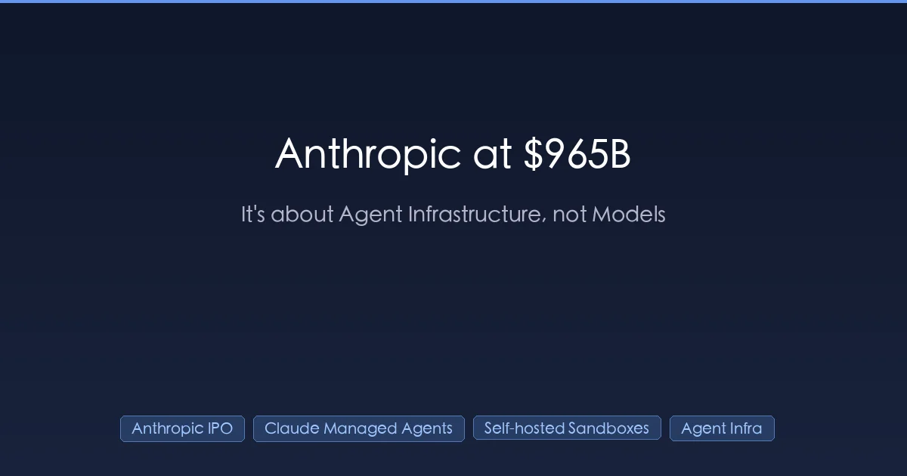
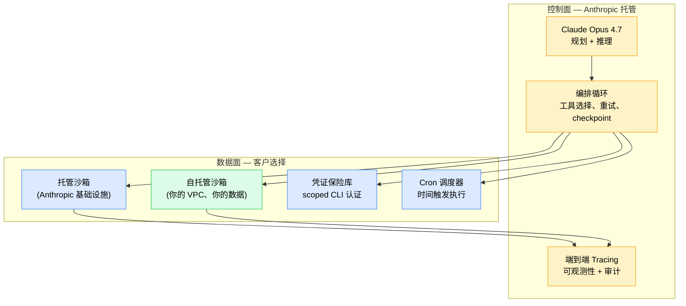

+++
date = '2026-06-12T10:00:00+08:00'
draft = false
title = 'Anthropic 9650 亿估值买的不是模型，是 Agent 基础设施：国内开发者怎么办'
description = "Anthropic 秘密递交 IPO，9650 亿美元估值对 470 亿年化收入只有 20 倍——投资人定价的是 Managed Agents 这套生产级 Agent 运行时，不是 Claude 模型。本文拆 20 倍估值账、讲透 Self-hosted Sandboxes 半开放真相，并给国内开发者三条落地路径。"
toc = true
tags = ['Anthropic', 'Claude Code', 'Managed Agents', 'AI Infrastructure', 'IPO']
keywords = ['Anthropic IPO', 'Anthropic 9650 亿估值', 'Anthropic 上市', 'Claude Managed Agents 中文', 'Anthropic 不进中国', 'Claude API 国内不能用', '国内 Claude Code 替代', '智谱 ChatGLM Agent vs Claude', '通义 Qwen Agent vs Claude', 'Self-hosted Sandboxes 中国']

[[params.faqItems]]
question = "Anthropic 9650 亿估值是不是泡沫？"
answer = '''不是泡沫。Series H 在 2026-06-02 秘密递交 S-1 时定的是 post-money 9650 亿美元，背后是 5 月底 470 亿美元年化收入和 Q2 预期 109 亿美元（环比翻倍）的硬数字。9650 / 470 ≈ 20 倍收入倍数，对一个季度环比翻倍、企业收入主导的类别领导者来说不算贵。参照系：Snowflake 2020 年 IPO 倍数约 175 倍，Datadog IPO 时超过 50 倍。投资人买的不是"Claude 模型比 GPT-5 好"——Opus 4.7、GPT-5、Gemini 3 Pro、Qwen 3.7 Max 在基础能力上已经非常接近——投资人买的是 Managed Agents 这套生产级 Agent 运行时的入口控制权。'''

[[params.faqItems]]
question = "Claude Managed Agents 到底是什么，国内能用吗？"
answer = '''Managed Agents 是 Anthropic 2026-04-08 上线公测的 Agent 托管运行时，包含沙箱代码执行、任务 checkpoint（可暂停/恢复）、scoped 凭证管理、端到端 tracing。2026-06-09 东京站新增 cron 调度 + 命令行凭证保险库（公测）。2026-05-19 伦敦站推出 Self-hosted Sandboxes 公测。但 Anthropic 至今不开放中国大陆 API 访问，技术上控制面在 Anthropic 美国侧，国内主流方案只有两种：① 海外 VPN + 海外信用卡，合规风险自担；② 用国内替代方案（智谱、通义、Kimi、豆包），但目前**没有一家有完整的 Managed Agents 等价物**。'''

[[params.faqItems]]
question = "Self-hosted Sandboxes 是不是意味着可以完全私有部署？"
answer = '''不是。Self-hosted Sandboxes 让你的团队在自己的基础设施（你的 VPC、你的合规边界、你的数据）里跑沙箱代码执行——但 agent 编排循环、规划、工具路由仍然跑在 Anthropic 的控制面上。这是混合模式：私有数据面 + 托管控制面。如果你的诉求是数据驻留或 PII 合规，这够用；如果你的诉求是完全离线运行或对中国大陆部署，这不解决问题，因为控制面无法跨境联通。Anthropic 在工程博客《Scaling Managed Agents: Decoupling the brain from the hands》里说得非常明确——"hands"（手）可以下放，"brain"（脑）必须留在 Anthropic 控制面。'''

[[params.faqItems]]
question = "国内有哪些 Claude Code Managed Agents 的替代方案？"
answer = '''截至 2026-06-12，国内没有任何一家有完整对位 Managed Agents 的生产级方案。各家分别有部分能力：智谱 ChatGLM Agent 有基础 Agent 编排但缺生产级沙箱和 cron；阿里通义 Qwen 3.7 Max API 有强模型但 Agent 运行时仍要自建；字节豆包提供 Agent 开发平台但没有端到端 tracing 和 checkpoint API；月之暗面 Kimi K2 主打超长上下文但 Agent 工具链最弱。务实路径：模型层用国内 API，Agent 运行时用开源方案自建（Hermes Agent、LangGraph、AutoGen），凭证管理用 Vault、Cron 用 Temporal/Airflow，自己拼出一套"半 Managed Agents"。代价是工程量大约 3-6 个人月，胜在数据不出境、合规可控。'''

[[params.faqItems]]
question = "Anthropic 什么时候 IPO？对中国投资人有影响吗？"
answer = '''截至 2026-06-12 已知信息：S-1 在 6 月 2 日秘密递交，公开报道目标窗口"as soon as this fall"，基本指向 2026 年 Q4 上市。Series H post-money 估值 9650 亿美元，最终 IPO 定价范围 Anthropic 还未公布。对中国投资人来说有两个现实约束：① 中国大陆个人投资者认购美股 IPO 通道有限，通常通过老虎、富途等持牌券商打新，且 9650 亿估值的 IPO 通常机构优先，散户中签率极低；② 即便上市后买入二级市场，中国政府对赴美 IPO 中概股的监管态度也是变量，但 Anthropic 是美国本土公司不存在 VIE 问题。务实建议：把它当 "AI 时代的 Microsoft IPO" 看，长期叙事重要，但短期定价波动会非常大，不要 all in。'''
+++

Anthropic 这次 9650 亿美元估值，最反直觉的地方不是它大，而是它可能还算便宜。Snowflake 2020 年上市时收入倍数约 175 倍，Datadog 超过 50 倍，Anthropic 按 470 亿美元年化收入算，只要了 20 倍。

事实先钉死。2026 年 6 月 2 日，Anthropic 秘密递交 S-1；Series H 融资 650 亿美元，post-money 估值 9650 亿美元，投资方包括 Altimeter Capital、Dragoneer、Greenoaks、Sequoia Capital、Capital Group、Coatue、D1 Capital Partners。

递交前两天，公司披露 5 月底年化收入 470 亿美元，Q2 单季预期 **109 亿美元——环比翻倍**。这是生成式 AI 历史上最大的一次私募估值跳跃，也是 Anthropic 账面估值首次压过 OpenAI。

国内媒体的解读几乎全是一个味道："Claude 赢了"。这个读法是错的。Opus 4.7 跟 GPT-5、Gemini 3 Pro 在主流基准上基本平手，Qwen 3.7 Max 在很多生产场景下已经够用——模型层在收敛，9650 亿跟"哪个模型最好"关系不大。

真正被定价的，是 Anthropic 从 4 月 8 日到 6 月 9 日两个月里连发的一整套东西：Managed Agents、Self-hosted Sandboxes、cron 调度、凭证保险库。一句话：谁掌握生产级 Agent 运行时，谁吃下一个十年。

Anthropic 自己在东京站同步发的工程博客里把话挑明了：**"Infrastructure, not intelligence, is now the bottleneck for production agents"**——基础设施而非智能，才是生产 Agent 的瓶颈。这一句就是整个投资逻辑。

对国内开发者，还有一层更扎心的问题：这套东西你根本接不进来。Anthropic 不进中国，怎么办——文章后半段给三条路。

## 9650 亿估值不是泡沫：先把 20 倍算明白

按 2024 年的心智模型，9650 亿像疯了——那会儿 Anthropic 还是个烧钱的研究实验室。但放进 2026 年的财务背景，这是给一个季度环比翻倍的类别领导者定 20 倍收入倍数，甚至偏保守。

对照系一拉就清楚：Snowflake 上市约 175 倍，Datadog 超 50 倍，连 Meta 这种成熟印钞机今天也在 8-10 倍。**9650 亿 / 470 亿年化 ≈ 20 倍**——这是投资人认定"赢家通吃、你就是赢家"时才给的价。

翻倍节奏比绝对数字更重要。从 Q2 预期 109 亿"环比翻倍"倒推，Q1 大约 50 亿；5 月底年化冲到 470 亿。Q3 若维持节奏，2026 年底年化收入落在 300-400 亿美元区间——到那时对标物是 IPO 时的微软，不是 meme 股。

> 截至 2026 年 6 月 12 日：Anthropic 于 6 月 2 日秘密递交 S-1，Series H post-money 估值 9650 亿美元，5 月底年化收入 470 亿美元，Q2 预期 109 亿美元，对应约 20 倍收入倍数。

当然，这个数字不是铁打的：秘密递交、定价前会调、公开市场也未必消化得动这个体量。但如果你条件反射喊"泡沫"，那是把 2021 年 SaaS 狂热往上硬套，错过了底下那门真生意。真正值得问的是——估值到底定价了什么。

## 真正的护城河："脑"和"手"解耦

答案藏在一个博客标题里。6 月 9 日东京站同步发布的工程博客叫 **《Scaling Managed Agents: Decoupling the brain from the hands》**（解耦脑与手）——一句话就是全部竞争论点，而中文报道几乎没人抓到这点。

Managed Agents 暴露的真实架构长这样：

"脑"是模型：规划、推理、选工具。"手"是运行时：沙箱执行、凭证保险库、调度器、tracing。Anthropic 两层都攥在手里，连中间的契约也是它定的。

关键在 5 月 19 日开放公测的 Self-hosted Sandboxes：客户可以把"手"搬进自己的基础设施，但"脑"和编排循环留在 Anthropic 控制面。这不是慷慨开源，这是教科书级的平台打法。

为什么这决定估值？因为模型层在收敛。我在 [Hermes Agent v0.9 评测](/zh/posts/ai/2026-04-14-hermes-agent-guide/) 和 [Harness Engineering 窗口期框架](/zh/posts/ai/2026-05-08-harness-engineering-window-of-opportunity/) 里反复论证过：LangChain 不换模型只换 harness，TerminalBench 从 52.8% 跳到 66.5%，排名从 30 名开外冲进前 5。

模型没动，运行时动了，结果天翻地覆。如果模型可替代、运行时定胜负，那谁掌握生产运行时谁就掌握经济——9650 亿买的就是这个。

## Managed Agents 到底交付了什么

差距现在可以列成表，不用含糊。截至 6 月 9 日东京站，Managed Agents 公测交付：

| 能力 | 状态 | 其他家有什么？ |
|---|---|---|
| 沙箱代码执行 | GA（4 月 8 日） | OpenAI Codex 部分有；Google 无对位 |
| 任务 checkpoint（暂停/恢复） | GA（4 月 8 日） | 无托管竞品 |
| Scoped 凭证管理 | GA（4 月 8 日） | 无托管竞品 |
| 端到端 Tracing | GA（4 月 8 日） | OpenAI Traces（有限）；Langfuse（自建） |
| Cron 调度 | 公测（6 月 9 日） | 无——你得自己上 Temporal 或 Inngest |
| CLI 凭证保险库 | 公测（6 月 9 日） | 无——通常靠临时环境变量凑 |
| Self-hosted Sandboxes | 公测（5 月 19 日） | 无——Codex CLI 本地跑但没有托管沙箱 API |

看右列——**大部分行的答案是无**。这不是巧合：OpenAI、Google 和开源生态过去一年都在卷模型能力和推理成本，Anthropic 一个人在悄悄把生产栈的剩余部分建完了。

cron 调度就是最好的例子。上周之前，想让 Agent 按时间跑——"每个工作日早 8 点扫描客服工单并起草回复"——你得自己拼 Temporal / Inngest / AWS EventBridge，打 webhook、管跨次状态、兜失败模式。

现在配置里写一行 `schedule: "0 8 * * 1-5"`，状态、重试、可观测性、凭证刷新全归 Anthropic 管。**一行 YAML 干掉一个几人天的基建项目**——这种复利才能把"好 20% 的模型"变成"好 5 倍的产品"。

凭证保险库同样是承重墙。以前 Agent 要调 `gh`、`aws`、`kubectl` 这类需要认证的 CLI，三个选项全是坑：secrets 嵌进沙箱镜像（差）、自建 secrets proxy（烦）、干脆放弃认证工作流（受限）。保险库把缺口堵上，DevOps 和平台工程的真实负载才真正跑得起来。

## Self-hosted Sandboxes 是"半开放"，不是"开放"

这是中外报道大多漏掉的坑，做架构决策前必须搞清楚——对国内开发者尤其要紧，下一节专门讲为什么。

Self-hosted Sandboxes——5 月 19 日伦敦站宣布、6 月 5-6 日东京站进一步展开——被一些声音解读成"Anthropic 要开放平台了"。错，而且如果你按这个理解做架构决策，会错得很贵。

它真正做的：让你在自己的基础设施里部署沙箱执行环境。你的数据面、你的 VPC、你的合规边界、你的 secrets 管理。这解决一类真实的企业诉求——数据驻留、GDPR / HIPAA / SOX 体系下的 PII 处理、沙箱读 TB 级数据湖时的出口流量成本。

它不做的：把编排循环的控制权给你。规划、选工具、重试逻辑、checkpoint 决策，**全部仍在 Anthropic 控制面执行**。API 不可达，Agent 停摆；对方改价或弃用特性，你被动适应；tracing 数据给你看，运行时逻辑不归你。

Anthropic 没装大方，工程博客里写得明明白白：脑必须留在托管侧。但"self-hosted"这个词带着开源年代的包袱，容易让人会错意。

正确的心智模型是**私有数据面 + 托管控制面**——大部分现代 SaaS 都长这样（Snowflake on AWS、Databricks on 你的云）。多数场景够用；离线环境、美国控制面到不了的司法辖区、要求完整运行时可审计的强监管行业，不够用。押注架构之前，先分清自己在哪一类。

## 国内开发者的真问题：Anthropic 不进中国

这一节是中文版独有的。如果你在国内做 Agent，前面的估值和"脑手解耦"跟你最直接的关系不是投资机会，而是：这套东西你能不能用，用不上怎么办。

残酷现实先摆出来：

- **Anthropic 至今不开放中国大陆 API 访问**，控制面、计费、TOS 都不支持大陆用户。
- **Code with Claude 系列没有中国站**——4 月旧金山主会、5 月伦敦站、6 月东京站，下一站可能在新加坡或首尔，没有任何进大陆的官方表态。
- **Self-hosted Sandboxes 技术上必须联通 Anthropic 控制面**——沙箱落在本地也没用，控制面那侧仍要走 Anthropic 美国域名，大陆环境基本不可用。

我的判断：这个状态短期（12-24 个月）不会变。地缘政治、模型滥用合规、出口管制，哪一条都让 Anthropic 没动力主动进大陆。真要私有部署，唯一路径是 Anthropic 在华设独立法人并接受合规审查——类比 Apple 在贵安云上的数据本地化。短期不会发生。

那国内开发者怎么办？三条路。

### 路径 A：海外 VPN + 海外信用卡直连 Claude API（合规风险自担）

个人开发者和小团队最常见的实际选择，技术门槛最低（Claude Code 直连官方 API），但风险是真的：

- TOS 风险：服务条款不允许大陆 IP，封号是常态不是意外。
- 支付风险：海外卡 + 海外注册地址，大陆居民很难合规拿到。
- 数据合规风险：代码涉及客户数据、个人信息或商业秘密时，跨境传到 Anthropic 美国服务器是合规黑洞。

成本和限速细节我在 [Claude Code 定价拆解](/zh/posts/ai/2026-02-25-claude-code-pricing/) 和 [Claude API 限速实测](/zh/posts/ai/2026-02-28-claude-rate-limits/) 里写过。个人写代码可以，**公司产品化部署别走这条路**。

### 路径 B：国内 API + 开源 Agent 运行时自建（企业推荐）

模型层用国内 API，"手"那一侧用开源自建。2026 年 6 月的现状摘要：

| 国内模型 | 强项 | Agent 运行时配套 |
|---|---|---|
| 智谱 ChatGLM Agent | 模型能力均衡、价格便宜 | 自家有基础 Agent 编排但缺生产级沙箱和 cron |
| 阿里通义 Qwen 3.7 Max | 模型能力最强、企业接入成熟 | API 强但 Agent 运行时仍要自建 |
| 字节豆包 Agent 平台 | 工程化产品最完整 | 有 Agent 开发平台但缺端到端 tracing 和 checkpoint API |
| 月之暗面 Kimi K2 | 超长上下文（200 万 token） | Agent 工具链相对最弱 |

务实拼法：
1. **模型层**：按成本和能力选国内 API（我个人偏好通义 Qwen 3.7 Max，智谱 ChatGLM 备用）。
2. **Agent 运行时**：开源自建——我评测过的 [Hermes Agent v0.9](/zh/posts/ai/2026-04-14-hermes-agent-guide/) 和 [Hermes v0.10 深度拆解](/zh/posts/ai/2026-04-24-hermes-agent-v010-deep-review/) 是最接近 Managed Agents 的开源选项，LangGraph、AutoGen 也能拼。
3. **凭证管理**：HashiCorp Vault 或自建 secrets 服务。
4. **Cron 调度**：Temporal、Airflow，或云厂商自带调度。
5. **Tracing**：Langfuse、自建 Jaeger，或阿里云 ARMS。

代价是 3-6 个人月的工程量，换来数据不出境、合规可控。

### 路径 C：等国内厂商追平 Managed Agents

我的判断：12-18 个月内会有国内厂商推出生产级对标方案。最可能是阿里（通义 + 阿里云基础设施天然占优）或字节（Agent 平台已有，差的是生产级运行时打磨）。适合等得起、且完全不接受合规风险的企业。

我推荐路径 B，理由就三个字：等不起。Agent 经济的窗口期就是 2026-2027 这两年（为什么是这两年，[Harness Engineering 窗口期框架](/zh/posts/ai/2026-05-08-harness-engineering-window-of-opportunity/) 里有完整论证）。等对标到位再上车，红利早被先动手的吃完了。

## OpenAI 的 Codex CLI：只有脑，没有手

让 9650 亿合理化的对比，是 OpenAI 在 Agent 侧到底交付了什么——这是递交后报道里最被低估的故事，值得专门拎出来。

Codex CLI 的自主性确实能打：长程编码、多步推理、失败恢复都不错。纯论模型 + agentic 能力，GPT-5 在 Codex 里跟 Opus 4.7 在 Claude Code 里打平——详见我的 [Codex CLI 上手指南](/zh/posts/ai/2026-02-12-codex-cli-mastery-guide/) 和 [Claude Code vs Codex 深度对比](/zh/posts/ai/2026-02-19-claude-code-vs-codex/)。声明：两个都好用，我都常用。

但 Codex CLI 背后没有托管运行时：

- **没有托管沙箱执行**：代码本地跑。个人开发者 OK；企业要 500 个 Agent 24/7 做客服分诊、代码评审、事故响应——没法用。
- **没有 checkpoint API**：中途挂了、想跨会话恢复？状态机自己写。
- **没有内置 cron**：定时触发？调度器自己起。
- **没有凭证保险库**：认证工具调用靠你自己拼的临时 secrets 管理。
- **没有一手 tracing**：可观测性自带干粮。

OpenAI 交付的是塞进单用户 CLI 的好"脑"；Anthropic 交付的是完整生产运行时 + 多种部署拓扑 + 端到端可观测性 + 定时后台执行。**这不是同一个产品品类**。投资人看到缺口，也把它定价了进去：9650 亿是市场在说，2027 年以后 Agent 的操作系统层比模型层值钱。

OpenAI 追得上吗？技术上能——这是工程差距不是研究差距，工程差距会被填平。但平台复利是真的：2026 年每一家把 Agent 栈搬上 Managed Agents 的企业，都是 2027 年少一家搬走的企业。锁定不是恶意，是地心引力，**Anthropic 有 6-12 个月的先发窗口在攒这股引力**。

## 国内开发者实操清单（2026 年 6 月）

把判断落成可执行的清单：

**个人开发者 / 小团队做实验**：路径 A（VPN + 海外卡）。Claude Code 直连官方 API 写代码够用了，等有需要无人值守的生产负载再考虑迁移。

**企业要规模化部署 Agent**：路径 B（国内 API + 开源运行时自建），当下唯一合规可控的方案。模型选通义 Qwen 3.7 Max 或字节豆包，运行时用 Hermes Agent 或 LangGraph 自建，凭证走 Vault，cron 用 Temporal 或云厂商调度。

**12 个月内要交付、零合规风险容忍**：等 12-18 个月，阿里或字节会推出对标方案。等的期间用国内模型 + 极简 Agent 框架做 PoC，先攒工作流和数据。

**在做 Agent 框架（LangChain、AutoGen、CrewAI 等）**：地基动了。框架的价值主张本来是"抽象掉 Agent 运行时的混乱"，Anthropic 把运行时产品化了，剩下的跨模型抽象和供应商中立编排是真价值但盘子更小。框架与产品的张力我在 [Claude Code + OpenSpec 工作流](/zh/posts/ai/2026-04-09-claude-code-openspec-superpowers/) 里聊过，原理通用。

**投资人 / 战略岗**：9650 亿暗含的赌注是运行时护城河能复利 24-36 个月才被有意义追平。信这个（我信，扣除执行风险），估值贵但不疯；认为 OpenAI 半年内追平（那意味着他们把产品优先级从前沿模型研究里大幅切出来），你该做空。我不在那个阵营。

## IPO 时间线：到底该期待什么

高置信度已知（截至 2026-06-12）：S-1 于 6 月 2 日秘密递交；公开报道目标窗口"as soon as this fall"；Series H post-money 9650 亿美元；5 月底年化收入 470 亿美元；Q2 预期 109 亿美元。未知：精确价格区间、确切流通量、是否双层股权、SEC 审查节奏、Q4 宏观扛不扛得住这个体量。

我的基准情景：2026 年 Q4 上市，定价参照 Series H 但打些流动性和公开市场风险的折扣，主流通量 200-400 亿美元，给公司留足现金垫。接近 Series H 数字上市的话，这是美国历史上最大的科技 IPO 之一——全球范围仅次于沙特阿美。

诚实免责：以上每个字都可能在定价前变。IPO 估值和 Series H 估值参照的输入不同；10-12 月市场情绪、Q3 财报都是变量。9 月若再放一个 Managed Agents 大特性（按 4-5-6 月节奏推大概率会），区间上调；quiet period 里被竞品在基准上反超，区间下调。

**把 9650 亿当"聪明钱已经站位"的强信号，别当板上钉钉的事实**。

## 我现在做什么

Claude Code 我每天在用，公测期把几个个人 Agent 负载迁上了 Managed Agents。6 月 9 日 cron + 凭证保险库上线后，我把原来跑在 5 美金 Hetzner VPS 上的 Hermes Agent 定时任务（详见 [Hermes v0.10 深度拆解](/zh/posts/ai/2026-04-24-hermes-agent-v010-deep-review/)）里生产关键的那部分迁了过去——运维负担直接归零。

还在犹豫的话，一句话测试：**你有没有一个 Agent 负载需要在你不看着的时候自己跑**？有，Managed Agents 是最便宜的放置点（前提是能合规接入）；没有，留在交互式 Claude Code，三个月后再看。

9650 亿会调整，时间线会漂移，Anthropic 和 OpenAI 的特性差距 2027 年会缩小。但结构性判断不变：**Agent 基础设施是新瓶颈，Anthropic 拥有它，投资人共识已经定价**。这是不是对的赌注是 24 个月的问题；是不是严肃的赌注，已经没有疑问。

对国内开发者，问题从来不是"要不要参与这场盛宴"——参与通道本来就窄——而是怎么在合规边界内把同样的 Agent 红利吃下来。答案是路径 B：国内模型 + 开源运行时自建。窗口就这两年，现在不动手，2027 年就晚了。
