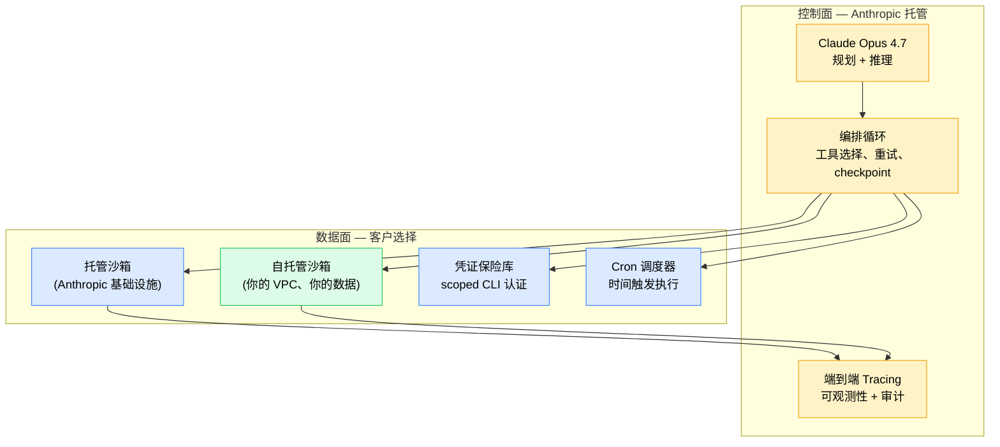

+++
date = '2026-06-12T10:00:00+08:00'
draft = false
title = 'Anthropic 9650 亿估值的真相：贵的不是模型，是 Agent 基础设施 — 国内开发者怎么办'
description = "Anthropic 秘密递交 IPO、9650 亿美元估值、年化收入 470 亿美元。但这次估值跟模型几乎无关，跟 Managed Agents 这套生产级 Agent 基础设施完全相关。文章拆估值逻辑、讲 Self-hosted Sandboxes 真假开放、给出国内开发者实战清单。"
toc = true
tags = ['Anthropic', 'Claude Code', 'Managed Agents', 'AI Infrastructure', 'IPO']
keywords = ['Anthropic IPO', 'Anthropic 9650 亿估值', 'Anthropic 上市', 'Claude Managed Agents 中文', 'Anthropic 不进中国', 'Claude API 国内不能用', '国内 Claude Code 替代', '智谱 ChatGLM Agent vs Claude', '通义 Qwen Agent vs Claude', 'Self-hosted Sandboxes 中国']

[[params.faqItems]]
question = "Anthropic 9650 亿估值是不是泡沫？"
answer = '''不是泡沫。Series H 在 2026-06-02 秘密递交 S-1 时定的是 post-money 9650 亿美元，背后是 5 月底 470 亿美元年化收入和 Q2 预期 109 亿美元（环比翻倍）的硬数字。9650 / 470 ≈ 20 倍收入倍数，对一个季度环比翻倍、企业收入主导的类别领导者来说不算贵。参照系：Snowflake 2020 年 IPO 倍数约 175 倍，Datadog IPO 时超过 50 倍。投资人买的不是"Claude 模型比 GPT-5 好"——Opus 4.7、GPT-5、Gemini 3 Pro、Qwen 3.7 Max 在基础能力上已经非常接近——投资人买的是 Managed Agents 这套生产级 Agent 运行时的入口控制权。'''

[[params.faqItems]]
question = "Claude Managed Agents 到底是什么，国内能用吗？"
answer = '''Managed Agents 是 Anthropic 2026-04-08 上线公测的 Agent 托管运行时，包含沙箱代码执行、任务 checkpoint（可暂停/恢复）、scoped 凭证管理、端到端 tracing。2026-06-09 东京站新增 cron 调度 + 命令行凭证保险库（公测）。2026-05-19 伦敦站推出 Self-hosted Sandboxes 公测。但 Anthropic 至今不开放中国大陆 API 访问，技术上控制面在 Anthropic 美国侧，国内主流方案只有两种：① 海外 VPN + 海外信用卡，合规风险自担；② 用国内替代方案（智谱、通义、Kimi、豆包），但目前**没有一家有完整的 Managed Agents 等价物**。'''

[[params.faqItems]]
question = "Self-hosted Sandboxes 是不是意味着可以完全私有部署？"
answer = '''不是。Self-hosted Sandboxes 让你的团队在自己的基础设施（你的 VPC、你的合规边界、你的数据）里跑沙箱代码执行——但 agent 编排循环、规划、工具路由仍然跑在 Anthropic 的控制面上。这是混合模式：私有数据面 + 托管控制面。如果你的诉求是数据驻留或 PII 合规，这够用；如果你的诉求是完全离线运行或对中国大陆部署，这不解决问题，因为控制面无法跨境联通。Anthropic 在工程博客《Scaling Managed Agents: Decoupling the brain from the hands》里说得非常明确——"hands"（手）可以下放，"brain"（脑）必须留在 Anthropic 控制面。'''

[[params.faqItems]]
question = "国内有哪些 Claude Code Managed Agents 的替代方案？"
answer = '''截至 2026-06-12，国内没有任何一家有完整对位 Managed Agents 的生产级方案。各家分别有部分能力：智谱 ChatGLM Agent 有基础 Agent 编排但缺生产级沙箱和 cron；阿里通义 Qwen 3.7 Max API 有强模型但 Agent 运行时仍要自建；字节豆包提供 Agent 开发平台但没有端到端 tracing 和 checkpoint API；月之暗面 Kimi K2 主打超长上下文但 Agent 工具链最弱。务实路径：模型层用国内 API，Agent 运行时用开源方案自建（Hermes Agent、LangGraph、AutoGen），凭证管理用 Vault、Cron 用 Temporal/Airflow，自己拼出一套"半 Managed Agents"。代价是工程量大约 3-6 个人月，胜在数据不出境、合规可控。'''

[[params.faqItems]]
question = "Anthropic 什么时候 IPO？对中国投资人有影响吗？"
answer = '''截至 2026-06-12 已知信息：S-1 在 6 月 2 日秘密递交，公开报道目标窗口"as soon as this fall"，基本指向 2026 年 Q4 上市。Series H post-money 估值 9650 亿美元，最终 IPO 定价范围 Anthropic 还未公布。对中国投资人来说有两个现实约束：① 中国大陆个人投资者认购美股 IPO 通道有限，通常通过老虎、富途等持牌券商打新，且 9650 亿估值的 IPO 通常机构优先，散户中签率极低；② 即便上市后买入二级市场，中国政府对赴美 IPO 中概股的监管态度也是变量，但 Anthropic 是美国本土公司不存在 VIE 问题。务实建议：把它当 "AI 时代的 Microsoft IPO" 看，长期叙事重要，但短期定价波动会非常大，不要 all in。'''
+++

2026 年 6 月 2 日，Anthropic 秘密递交 IPO 招股书。Series H 融资 650 亿美元、**post-money 估值 9650 亿美元**——投资方阵容包含 Altimeter Capital、Dragoneer、Greenoaks、Sequoia Capital、Capital Group、Coatue、D1 Capital Partners。两天前公司披露 5 月底年化收入冲破 **470 亿美元**，并预期 Q2 单季度收入 **109 亿美元**——环比翻倍。**这是生成式 AI 历史上最大的一次私募估值跳跃，也是 Anthropic 估值首次超过 OpenAI。**

国内媒体的标题党解读基本上都是一个味道："Claude 赢了"——模型故事。

这个解读是错的。Claude Opus 4.7 跟 GPT-5、Gemini 3 Pro 在基准测试上几乎平手，国内 Qwen 3.7 Max 在很多生产场景下已经能替代。**9650 亿估值跟"哪个模型最好"几乎没关系。** 它跟 Anthropic 在 2026 年 4 月 8 日到 6 月 9 日之间这两个月连续发布的一整套东西——Managed Agents、Self-hosted Sandboxes、cron 调度、凭证保险库——以及这一套生产级 Agent 运行时谁来掌控接下来 10 年 Agent 经济入口，关系全部。

Anthropic 自己在工程博客里那句话已经说穿了：**"Infrastructure, not intelligence, is now the bottleneck for production agents"**（基础设施而非智能，才是生产 Agent 的真正瓶颈）。这十一个英文单词就是整个投资逻辑的压缩版本。但对国内开发者来说，故事不止于此，还有一个更重要的问题——**Anthropic 不进中国，国内开发者怎么办？**

## 9650 亿估值不是泡沫：先把数字算清楚

聊 Agent 基础设施之前，估值得先算明白。9650 亿这个数字按 2024 年的心智模型看完全像疯了——那时候 Anthropic 还是个烧钱的研究实验室。但放在 2026 年财报背景下，这是一个 20 倍年化收入倍数、给一个季度环比翻倍的类别领导者的合理定价——对这个阶段来说甚至偏保守。

对照系拉出来看就更清楚：Snowflake 2020 年 IPO 时是大约 175 倍收入倍数，Datadog IPO 时超过 50 倍，连 Meta 这种成熟业务今天也在 8-10 倍。**9650 亿 / 470 亿年化 ≈ 20 倍。** 对一个企业收入主导、季度环比翻倍的公司，这是投资人给类别领导者的常规估值。

季度翻倍的节奏比绝对数字更重要。倒推 Q2 109 亿，Q1 大约 50 亿（这是从"环比翻倍"反推的估算）。5 月底年化收入冲破 470 亿。如果 Q3 维持这个节奏，2026 年退出时的年化收入会落在 300-400 亿美元区间。在那个数字上，9650 亿的估值看起来更像"微软 IPO 时的对标物"，不像 meme 股。

我并不是说 9650 亿是铁打的。它是秘密递交时的数字，定价时会调整，公开市场也未必能干净消化掉这个规模的科技 IPO。我要说的是：如果你条件反射式地把它斥为"泡沫"，那是把模式匹配到了 2021 年 SaaS 狂热上，错过了底下那门真生意。这门生意是真的，问题在于估值是否准确识别出了它为什么真——而后者，是大部分递交后报道都搞错了的地方。

## 真正的护城河："脑"和"手"解耦

Anthropic 6 月 9 日东京站发的那篇工程博客，标题是 **《Scaling Managed Agents: Decoupling the brain from the hands》**（扩展 Managed Agents：解耦脑与手）。这个标题就是整个竞争论点的一句话浓缩，而递交后的中文报道里几乎没人抓到这点。

Managed Agents 暴露的真实架构长这样：

模型——"脑"——负责规划、推理、工具选择。"手"——沙箱代码执行、凭证保险库、调度器、tracing 层——是真正让 Agent 在生产环境干活的运行时组件。Anthropic 同时掌握这两层以及它们之间的契约。关键点在于 5 月 19 日开放的 Self-hosted Sandboxes 公测——它让客户可以在自己的基础设施里跑"手"，但**"脑"和编排循环仍然留在 Anthropic 的控制面上**。这不是慷慨开源，这是教科书级别的平台打法。

这一点对估值意味着什么？因为模型层在收敛。我在之前的 [Hermes Agent v0.9 评测](/zh/posts/ai/2026-04-14-hermes-agent-guide/) 和 [Harness Engineering 窗口期决策框架](/zh/posts/ai/2026-05-08-harness-engineering-window-of-opportunity/) 里反复论证过这个点——LangChain 不换模型只重新设计 harness，TerminalBench 分数从 52.8% 跳到 66.5%，排名从第 30 名外冲到前 5。模型保持不变，harness——也就是生产运行时，也就是 Anthropic 现在产品化成 Managed Agents 这个东西——决定了一切。

如果模型可替代而运行时决定胜负，那谁掌握生产运行时谁就掌握经济。这就是 9650 亿在买的东西。

## "手"这一侧：Managed Agents 究竟交付了什么

把能力栈梳理清楚很重要，因为现在 Anthropic 和其他家之间的差距是可量化的，不是含糊的。截至 6 月 9 日东京站发布，Managed Agents 公测交付的能力如下：

| 能力 | 状态 | 其他家有什么？ |
|---|---|---|
| 沙箱代码执行 | GA（4 月 8 日） | OpenAI Codex 部分有；Google 无对位 |
| 任务 checkpoint（暂停/恢复） | GA（4 月 8 日） | 无托管竞品 |
| Scoped 凭证管理 | GA（4 月 8 日） | 无托管竞品 |
| 端到端 Tracing | GA（4 月 8 日） | OpenAI Traces（有限）；Langfuse（自建） |
| Cron 调度 | 公测（6 月 9 日） | 无——你得自己上 Temporal 或 Inngest |
| CLI 凭证保险库 | 公测（6 月 9 日） | 无——通常靠临时环境变量凑 |
| Self-hosted Sandboxes | 公测（5 月 19 日） | 无——Codex CLI 本地跑但没有托管沙箱 API |

看右列。**大部分行都写着"无"。** 这不是命名巧合，这反映了一个事实：OpenAI、Google、以及开源生态过去一年都在错误的轴上竞争——模型能力和推理成本——而 Anthropic 一直在悄悄地建剩下的生产栈。

6 月 9 日发的 cron 调度更新是说明为什么这件事重要的完美例子。上周以前，如果你想让一个 Managed Agent 按时间触发跑——比如"每个工作日早 8 点扫描客服工单并起草回复"——你得自己拼一套外部调度器（Temporal、Inngest、AWS EventBridge），让它打到 Agent 的 webhook，自己管跨次运行的状态，自己处理失败模式。现在你在 Agent 配置里写一行 `schedule: "0 8 * * 1-5"`，Anthropic 替你管状态、重试、可观测性、凭证刷新。**一行 YAML 干掉一个原本要花几人天的基础设施项目**——这种复利价值才是把"20% 更好的模型"变成"5 倍更好的产品"的真正杠杆。

CLI 凭证保险库的份量也类似。本周之前，如果一个 Agent 需要调用 `gh`、`aws`、`kubectl` 等任何需要认证的 CLI，你要么把 secrets 嵌进沙箱镜像（差），要么自己搭一层 secrets proxy（烦），要么放弃认证 CLI 工作流（受限）。保险库把这个缺口堵上了，让 Agent 运行时真正能承接 DevOps 和平台工程的实际工作负载。

## Self-hosted Sandboxes 是"半开放"，不是"开放"

这是国内外报道大多没抓到的部分，对国内开发者来说尤其要紧——我会在下一节专门讲为什么。

Self-hosted Sandboxes——5 月 19 日伦敦站宣布，6 月 5-6 日东京站做了进一步阐述——有些声音把它读成"Anthropic 在开放平台了"。这个解读是错的，**如果你基于这个解读做架构决策，可能会非常错。**

Self-hosted Sandboxes 真正做的是：让你的团队在自己的基础设施里部署沙箱代码执行环境。你的数据面。你的 VPC。你的合规边界。你的 secrets 管理。这是真的，它确实解决一类合法的企业关切——尤其是数据驻留、GDPR / HIPAA / SOX 体系下的 PII 处理、以及沙箱需要读 TB 级数据时的出口流量成本。

Self-hosted Sandboxes 不做的是：把 Agent 编排循环的控制权给你。脑、规划、工具选择、重试逻辑、checkpoint 决策——**所有这些仍然在 Anthropic 的控制面上执行**。如果 Anthropic 的 API 不可达，你的 Agent 停摆。如果 Anthropic 弃用某个特性或改价格，你被动适应。如果你想审计 Agent 究竟为什么决定调用某个工具——你拿到 Anthropic 提供的 tracing 数据，但不拥有运行时逻辑本身。

这是 Anthropic 主动做的设计决策，他们在工程博客里说得明明白白，没有装大方。但"self-hosted"这个营销词带着开源年代的包袱，会让人误以为是另一回事。**正确的心智模型是"私有数据面 + 托管控制面"**——就是大部分现代 SaaS 的样子（想想 Snowflake on AWS，或者 Databricks on 你的云）。对大部分用例这没问题。但对一类用例——离线环境、美国控制面无法到达的司法管辖区、必须完整运行时可审计的强监管行业——它解决不了你的问题，**你需要在押注架构之前知道这一点**。

## 国内开发者的真问题：Anthropic 不进中国

下面这节是中文版独有的。如果你在国内做 Agent，前面 9650 亿估值和"脑手解耦"的论述跟你最直接的关系不是"投资机会"，而是"这套东西你能不能用、用不上怎么办"。

先把残酷的现实摆桌面上：

- **Anthropic 至今不开放中国大陆 API 访问**，控制面、计费、TOS 都不支持大陆用户。
- **Code with Claude 系列大会没有中国站**——4 月旧金山主会、5 月伦敦站、6 月东京站，下一站可能在新加坡或首尔，目前没有任何官方表态会到中国大陆。
- **Self-hosted Sandboxes 从技术上需要 Anthropic 控制面联通**——意味着大陆环境下即便部署了沙箱在本地，控制面那一侧仍然要走 Anthropic 美国域名。这在大陆基本不可用。

我的判断是这种状态短期（12-24 个月）不会变。Anthropic 出于地缘政治、模型滥用合规、出口管制几方面的考量都不会主动进中国大陆。如果想在国内私有部署，唯一路径是 Anthropic 在中国设立独立法人实体并接受合规审查——这跟 Apple 在贵安云上数据本地化是类似的形态。**短期不会发生。**

那国内开发者怎么办？有三条路。

### 路径 A：海外 VPN + 海外信用卡走 Claude API（合规风险自担）

这是个人开发者和小团队最常见的实际选择。技术门槛低（用 Claude Code 直接连官方 API），但有几个真实风险：

- TOS 风险：Anthropic 的服务条款不允许大陆 IP，账号被封是常态而非异常。
- 支付风险：海外卡 + 海外注册地址不是中国大陆居民能轻易合规拿到的。
- 数据合规风险：如果你的代码涉及客户数据、个人信息或商业秘密，跨境传输到 Anthropic 美国服务器是合规黑洞。

我之前写过 [Claude Code 定价拆解](/zh/posts/ai/2026-02-25-claude-code-pricing/) 和 [Claude API 限速实测](/zh/posts/ai/2026-02-28-claude-rate-limits/) 这两篇文章，里面有详细的成本和限速对比。对个人写代码 OK，**对公司产品化部署不要走这条路。**

### 路径 B：国内 API + 开源 Agent 运行时自建（推荐企业方案）

模型层用国内 API，Agent 运行时和"手"那一侧用开源方案自建。下面是 2026 年 6 月的现状摘要：

| 国内模型 | 强项 | Agent 运行时配套 |
|---|---|---|
| 智谱 ChatGLM Agent | 模型能力均衡、价格便宜 | 自家有基础 Agent 编排但缺生产级沙箱和 cron |
| 阿里通义 Qwen 3.7 Max | 模型能力最强、企业接入成熟 | API 强但 Agent 运行时仍要自建 |
| 字节豆包 Agent 平台 | 工程化产品最完整 | 有 Agent 开发平台但缺端到端 tracing 和 checkpoint API |
| 月之暗面 Kimi K2 | 超长上下文（200 万 token） | Agent 工具链相对最弱 |

务实路径：
1. **模型层**：根据成本和能力选一家国内 API（我个人偏好通义 Qwen 3.7 Max + 智谱 ChatGLM 备用）。
2. **Agent 运行时**：用开源方案自建——我之前评测过的 [Hermes Agent v0.9](/zh/posts/ai/2026-04-14-hermes-agent-guide/) 和 [Hermes v0.10 深度拆解](/zh/posts/ai/2026-04-24-hermes-agent-v010-deep-review/) 是最接近 Managed Agents 等价物的开源选项，另外 LangGraph、AutoGen 也能拼。
3. **凭证管理**：HashiCorp Vault 或自建 secrets 服务。
4. **Cron 调度**：Temporal 或 Airflow，或者云厂商自带的调度服务。
5. **Tracing**：Langfuse、自建 Jaeger，或阿里云 ARMS。

代价是工程量大约 3-6 个人月，胜在数据不出境、合规可控。

### 路径 C：等国内厂商追上 Managed Agents 等价物

我的判断：12-18 个月内会有一家国内厂商推出生产级 Managed Agents 对标方案。最可能的候选是阿里（基于通义+阿里云基础设施天然有优势）或字节（已有 Agent 平台，差的是生产级运行时打磨）。这条路适合等不及而且不愿意承担合规风险的企业。

我个人会推荐路径 B，理由是：不能等。Agent 经济的窗口期就是这两年（我在 [Harness Engineering 窗口期框架](/zh/posts/ai/2026-05-08-harness-engineering-window-of-opportunity/) 里详细论证过为什么是 2026-2027 这两年）。等国内对标到位再上车，红利已经被早动手的吃完了。

## OpenAI 的 Codex CLI：只有脑没有手

让 9650 亿估值合理化的对比，是 OpenAI 在 Agent 这一侧到底交付了什么。这是递交后报道里最被低估的故事，值得专门拎出来。

OpenAI 的 Codex CLI 在自主性上确实印象深刻。长程编码任务、多步推理、不错的失败恢复能力。在原始模型 + agentic 能力上，GPT-5 在 Codex 里跟 Claude Opus 4.7 在 Claude Code 里相当——我在 [Codex CLI 上手指南](/zh/posts/ai/2026-02-12-codex-cli-mastery-guide/) 和后续的 [Claude Code vs Codex 深度对比](/zh/posts/ai/2026-02-19-claude-code-vs-codex/) 里有详细评测。声明：两个都好用，我都常用。

但 Codex CLI 没有托管运行时对应物。具体说：

- **没有托管沙箱执行**：代码本地跑。对终端开发者 OK，对一个企业想跑 500 个 Agent 24/7 做客服分诊、代码评审、事故响应——不可用。
- **没有 checkpoint API**：任务跑到一半失败或者想跨会话恢复？自己写状态机。
- **没有内置 cron**：想按时间触发？自己起调度器。
- **没有凭证保险库**：认证工具调用走你拼的临时 secrets 管理。
- **没有一手 tracing**：可观测性自带。

OpenAI 交付的是一个被打包进单用户 CLI 的好"脑"。Anthropic 交付的是完整的生产运行时、多种部署拓扑、端到端可观测性、现在还加了定时后台执行。**这不是同一个产品品类。** 投资人看到这个缺口，把它定价进去了。9650 亿 post-money 是市场在说：2027 年及以后，Agent 操作系统层的价值大于模型层。

OpenAI 没在睡觉。这些他们都能造。这个差距是工程差距，不是研究差距——工程差距会被追上。但平台复利效应是真的。2026 年每一家把 Agent 栈搬到 Managed Agents 上的企业，都是 2027 年少一家会搬走的企业。锁定不是恶意，就是地心引力，**而 Anthropic 已经领跑 6-12 个月在累积这种引力。**

## 国内开发者实操清单（2026 年 6 月）

把判断落到具体可执行的清单上：

**如果你是个人开发者 / 小团队做实验**：路径 A（VPN + 海外卡）。Claude Code 直接连官方 API 写代码，足够好。等有真正生产工作负载需要无人值守再考虑迁移。

**如果你是企业要做规模化 Agent 部署**：路径 B（国内 API + 开源运行时自建）。这是当下唯一合规可控的方案。模型层选通义 Qwen 3.7 Max 或字节豆包，Agent 运行时用 Hermes Agent 或 LangGraph 自建，凭证 Vault，cron 用 Temporal 或云厂商调度。

**如果你的诉求是 12 个月内交付 + 不接受任何合规风险**：等 12-18 个月，阿里或字节会推出对标方案。在等的期间用国内模型 + 极简 Agent 框架做 PoC，积累工作流和数据。

**如果你在做 Agent 框架（LangChain、AutoGen、CrewAI 等）**：地基动了。框架原本的价值主张是"我们抽象掉 Agent 运行时的混乱"。Anthropic 把运行时产品化了，剩下的价值在跨模型抽象和供应商中立的编排——是真的但更小。我之前在 [Claude Code + OpenSpec 工作流](/zh/posts/ai/2026-04-09-claude-code-openspec-superpowers/) 里也聊过框架与产品的张力，这个原理可推广到这里。

**如果你是投资人或战略岗**：9650 亿暗含的判断是 Anthropic 的运行时护城河会复利 24-36 个月再被竞争对手有意义地追平。如果你信这个——我信，扣除执行风险——估值贵但不疯。如果你认为 OpenAI 能在 6 个月内追平——这需要他们把产品优先级从前沿模型研究里大幅切换出来——你该做空。我不在那个阵营。

## IPO 时间线：到底该期待什么

截至 2026-06-12 高置信度已知信息：S-1 6 月 2 日秘密递交；公开报道目标窗口"as soon as this fall"；Series H post-money 9650 亿美元；5 月底年化收入 470 亿美元；Q2 预期 109 亿美元。不知道的：精确 IPO 价格区间、确切流通量、是否双层股权架构、SEC 审查是否顺畅、Q4 宏观是否扛得住这个规模的上市。

我的基准情景：2026 年 Q4 上市，价格区间反映 Series H 估值但有些许折扣考虑流动性和公开市场风险，主要流通量在 200-400 亿美元区间，给公司充足现金垫。如果按 Series H 数字接近上市，这将是美国历史上最大的科技 IPO 之一——按全球范围比仅次于沙特阿美。

诚实免责声明：上面每一个字都可能在定价前变化。IPO 估值不是 Series H 估值——参考的输入不同。2026 年 10-12 月的市场情绪很重要。Q3 财报很重要。如果 Anthropic 在 9 月再放一个 Managed Agents 大特性（按 4-5-6 月节奏推大概率会），价格区间往上调；如果模型竞品在 quiet period 期间在基准测试上反超，价格区间往下调。**把 9650 亿当作"聪明钱已经站到这里"的强信号，不要当作板上钉钉的事实。**

## 我现在做什么

我 Claude Code 每天在用，公测期把几个个人 Agent 工作负载迁到了 Managed Agents。6 月 9 日 cron + 凭证保险库的更新实质改变了我对这个平台能做什么的判断——之前我有 Hermes Agent 在一台 5 美金 Hetzner VPS 上跑定时任务（详见 [Hermes v0.10 深度拆解](/zh/posts/ai/2026-04-24-hermes-agent-v010-deep-review/)），现在我把生产关键路径迁到 Managed Agents，因为运维负担消失了。

如果你在犹豫，给你一个一句话测试：**你有没有一个 Agent 工作负载需要在你不看着的时候自己跑？** 如果有，Managed Agents 是最便宜的放置点（前提是你能合规接入）。如果没有，留在交互式 Claude Code 里，三个月后再回来看。

9650 亿估值会调，IPO 时间线会推迟或加速，Anthropic 和 OpenAI 之间的特性缺口会在 2027 年缩小。这些都不改变结构性判断：**Agent 基础设施是新瓶颈，Anthropic 拥有它，投资人共识已经把它定价进去。** 这是不是个对的赌注是 24 个月的问题，是不是个严肃的赌注已经没有疑问。

对国内开发者来说，问题不是"要不要参与这场盛宴"——参与方式有限，吃相也不好看——而是"在国内合规边界内怎么把同样的 Agent 红利吃下来"。答案是路径 B：国内模型 + 开源运行时自建。窗口期就这两年，现在不动手，2027 年就晚了。
